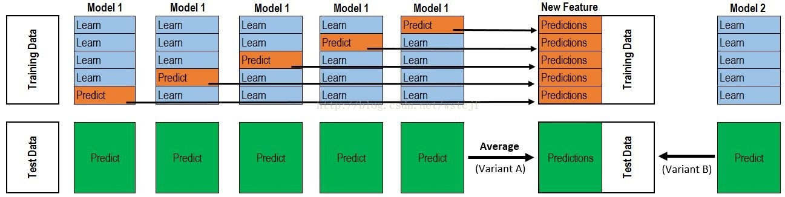

目录

[toc]

## 1 评价指标

理解深度学习或一篇文章的关键，是理解**真实值是如何编码的**，这样损失计算、网络训练就水到渠成了。

### 1.1 IOU

IOU 表示两个区域交集与并集面积之比，其计算公式为
$$
\text{IOU} = \frac{\text{area}(B_p \cap B_{gt})}{\text{area}(B_p \cup B_{gt})}
$$
形象点说，就是


### 1.2 二分类检验指标


| 指标                | 定义                                                         |
| ------------------- | ------------------------------------------------------------ |
| True Positive (TP)  | 真实地预测为正；<br/>在 CV 中，预测为正是 predicted box 之内的部分，“真实地” 表示与某个 ground truth box 的 IOU 大于阈值； |
| False Positive (FP) | 虚假地预测为正；<br/>在 CV 中，预测为正是 predicted box 之内的部分，“虚假地“ 表示与任意 ground truth box 的 IOU 小于阈值； |
| True Negative (TN)  | 真实地预测为负；<br/>在 CV 中，预测为负是 predicted box 之外的部分，“虚假地” 表示与 ground truth box 的 IOU 小于阈值，<br/>即 ground truth box 与某个 predicted box 的 IOU 大于阈值； |
| False Negative (FN) | 虚假地预测为负；<br/>在 CV 中，预测为负是 predicted box 之外的部分，“虚假地” 表示与 ground truth box 的 IOU 大于阈值，<br/>即 ground truth box 与任意 predicted box 的 IOU 小于阈值； |

【注】CV 中的区域理解：


在计算机视觉场景中，上述指标的含义也是一样的，根据检测框和真实框之间的相交程度，有上图所示的四种状态。

由于 Positive 和 Negative 状态不能同时存在，因此实际使用中会预定义一个 IoU 阈值，通过判断检测框与预测框的 IoU 是否超过阈值，来界定 Positive 和 Negative 状态。

### 1.3 精确率与召回率

* Precision（精确率）
  $$
  \text{precision}=\frac{TP}{TP+FP}=\frac{TP}{\text{all detections}}
  $$

  * 一般理解：所有预测当中，正确的比例
  * CV 理解：定位的准确率、“查准”程度，即所有的<u>该类</u>预测当中，正确的占比是多少
  
* Recall（召回率）
  $$
  \text{recall}=\frac{TP}{TP+FN}=\frac{TP}{\text{all ground truths}}
  $$

  * 一般理解：所有正例当中，预测对的比例，也叫 TPR（真正例率）
  * CV 理解：定位的召回率、“查全”程度，即<u>该类</u>的所有预测当中，正确的占比是多少
  
* FPR（假正例率）
  $$
  FPR = \frac{FP}{FP+TN}
  $$

  * 理解：所有负例当中，预测错的比例，也叫 FPR（假正例率）
  
* Accuracy（准确率）

  $$
  \mathrm{accuracy} = \frac{TP + TN}{TP + FP + TN + FN}
  $$

  * 理解：所有正确预测所占的比例
  
  * 扩展：Top-$k$ Accuracy
  
    对于一个输入，经过网络预测后，如果前 $k$ 个预测包含正确答案，则认为正确。

### 1.4 F-score

概念：$F_\beta$ 值是分类问题的一个综合衡量指标，它综合考虑了 精确率 Precision 和 召回率 Recall 之间的权衡。

* $F_1$ 是准确率与召回率的调和平均值
  $$
  F_1 = 2 \cdot \frac{\text{precision}\cdot \text{recall}}{\text{precision}+\text{recall}}
  $$
  【注1】为什么用调和平均？调和平均可以惩罚 $(\text{recall}, \text{precision})$ 的极端情况，算数平均却不行。

  【注2】F1-score 基于 Dice coefficient $\frac{2 \left | A\cap B \right |}{|A| + |B|}$ 导出，其中 $A$ 是预测正样例集，$B$ 是标注正样例集。
  $$
  \begin{align}
  \text{DSC} & = \frac{2 \cdot \mathrm{TP}}{(\mathrm{TP}+\mathrm{FP})+(\mathrm{TP}+\mathrm{FN})} \\
  & = \frac{2 \cdot \mathrm{TP} \cdot \frac{\mathrm{TP}}{(\mathrm{TP}+\mathrm{FP})(\mathrm{TP}+\mathrm{FN})}}{\frac{(\mathrm{TP}+\mathrm{FP}+\mathrm{TP}+\mathrm{FN})\cdot\mathrm{TP}}{(\mathrm{TP}+\mathrm{FP})(\mathrm{TP}+\mathrm{FN})}} \\
  & = \frac{2 \cdot \frac{\mathrm{TP}}{\mathrm{TP}+\mathrm{FP}} \cdot \frac{\mathrm{TP}}{\mathrm{TP}+\mathrm{FN}}}{\frac{\mathrm{TP}}{\mathrm{TP}+\mathrm{FP}} + \frac{\mathrm{TP}}{\mathrm{TP}+\mathrm{FN}}} \\
  & = F_1
  \end{align}
  $$
  
* $\text{micro-}F_1$ 和 $\text{macro-}F_1$ 是多分类任务中，对各个类别 $F_1$ 值的合并方式

  * $\text{micro-}F_1$：先计算所有类别的总的 $\text{precision}$ 和 $\text{recall}$，然后计算 $F_1$ 值
    $$
    \begin{align}
    \text{precision}_{mi}&=\frac{\sum_{i=1}^n\text{TP}_i}{\sum_{i=1}^n\text{TP}_i+\sum_{i=1}^n\text{FP}_i} \\
    \text{recall}_{mi}&=\frac{\sum_{i=1}^n\text{TP}_i}{\sum_{i=1}^n\text{TP}_i+\sum_{i=1}^n\text{FN}_i} \\
    F_{1,mi}&=2\cdot\frac{\text{precsion}_{mi}\cdot\text{recall}_{mi}}{\text{precsion}_{mi}+\text{recall}_{mi}}
    \end{align}
    $$
    使用场景：公式中考虑到每个类别的数据量，所以适用于<u>数据类别分布不平衡</u>的情况，但在数据极度不平衡时会受到影响。

  * $\text{macro-}F_1$：分别计算每个类别的 $F_1$，然后做平均（各类别的权重相同）
    $$
    \begin{align}
    \text{precision}_{ma}&=\frac{1}{n}\sum_{i=1}^n\frac{\text{TP}_i}{\text{TP}_i+\text{FP}_i}\\
    \text{recall}_{ma}&=\frac{1}{n}\sum_{i=1}^n\frac{\text{TP}_i}{\text{TP}_i+\text{FN}_i} \\
    F_{1,ma}&=2\cdot\frac{\text{precsion}_{ma}\cdot\text{recall}_{ma}}{\text{precsion}_{ma}+\text{recall}_{ma}}
    \end{align}
    $$
    使用场景：公式中不考虑每个类别的数据量，所以会<u>平等的看待每一类</u>，从而受到极端 $(\text{recall}, \text{precision})$ 类的影响。

* $F_\beta$ 通过增加 $\beta$ 来调节对 $\text{precision} / \text{recall} $ 的惩罚权重
  $$
  F_\beta = (1+\beta^2) \cdot \frac{\text{precision}\cdot \text{recall}}{\beta^2 \cdot \text{precision}+\text{recall}}
  $$

### 1.5 Average Precision & Recall

<u>概念</u>：

* Average Precision (AP) 表示 Precision-Recall 曲线下方面积
* Average Recall (AR) 表示 Recall-IoU 曲线下方 `[0.5, 1.0]` 区域面积的两倍

<u>理解</u>：

* AP 值本质是**不同召回值下所有精度的平均值**，揭示二分类器**对正例的识别准确度与覆盖能力之间的权衡**
* AR 值本质是**不同 IoU 下所有召回值的平均值**，揭示模型**检测框定位是否全面**

<u>极值</u>：AP 和 AR 曲线以靠近 $(1,1)$ 点为最佳，面积越右上接近 $1$ 二分类器性能越好。

<u>算法</u>：以 AP 曲线的计算为例

* 排序模型的预测结果，对于每个 rank，Recall 和 Precision 仅在高于该 rank 值的预测结果中计算

* AP 的计算

  一般选取 11 个 rank 值 $\{0,0.1,\dots,1\}$，得到 11 个不同的 recall 和 precision 值对 $(r,p)$，绘制初步的 AP 曲线。
  
  在此基础上，AP 和 AR 的定义为：
  $$
  \begin{align}
  AP & = \frac{1}{11} \sum_{r\in\{0,0.1,\dots,1\}} p_{\text{interp}}(r) \\
  AR & = 2 \int_{0.5}^{1}\text{recall}(u)du = \frac{2}{n} \sum_{i=1}^{n}\max\left(\text{IoU}(\text{gt}_i)-\frac{1}{2}, 0\right)
  \end{align}
  $$
  其中 $p_{\text{interp}}(r) = \max_{\hat{r}\ge r}p(\hat{r})$ 是 AP 曲线上 recall 处的 precision 插值，取所有 $\text{recall}>=r$ 中的 precision 最大值，<u>保证曲线单调性</u>。


【注1】IOU 阈值的不同取值导出不同的 AP 指标，如

* `iou_threshold=0.5` 对应 AP@50

* `iou_threshold=0.75` 对应 AP@75

* `iou_threshold=0.5 0.55 0.6 0.65 0.7 0.75 0.8 0.85 0.9 0.95` 对于 AP@[0.5,0.95]，即相应 AP@xx 下的平均值

* COCO 的图像评价标准

  

【注2】AP 是对一个类别计算的结果，mAP 是**所有类** AP 的平均值。

【注3】CV 中增加检测框的影响：随着检测框的逐步增加，召回率也正常持续增加，准确率也要保持相对的稳定性才是最佳的。

### 1.6 Area Under Curve

概念：Area Under Curve (AUC) 表示 Receiver Operating Characteristic (ROC)/TPR-FPR  曲线下方面积。

理解：AUC 值本质是**不同假正例率下真正例率的平局值**，揭示**二分类器对随机正负样本正确区分的能力**。

极值：ROC 曲线以靠近 $(0,1)$ 点为最佳，越偏离 $45$ 度对角线，二分类器性能越好。

算法：

> 设已有一系列的样本，它们的真实类别 `class` 和预测为正的概率 `score` 已经得到。
>
> 1. 绘制 ROC/TPR-FPR 曲线
>
>    设置分类器分类阈值 `threshold`，大于等于它的预测为正样本，小于它的预测为负样本，从而得到一个 `(FPR, TPR)` 点。
>
>    重复上述步骤多次，得到一组 `(FPR, TPR)` 点，绘制出 ROC/TPR-FPR 曲线。
>
> 2. 计算 ROC 曲线下方面积
>
>    计算方法多种都有，这里不赘述。


【注1】ROC 曲线的特点：当测试集中的<u>正负样本不平衡、分布发生变换</u>的时候，ROC 曲线能够大体不变，这是 Precision-Recall 曲线没有的。

【注2】经验：对于 MINIST 和 CIFAR 数据集来说，它们的效果较好，一般能达到 0.8-0.9 甚至以上。

### 1.7 Perplexity

困惑度 perplexity 用来评价语言模型自身的好坏。

它的基本思想是：给测试集的句子赋予较高概率值的语言模型较好，当语言模型训练完之后，测试集中的句子都是正常的句子，那么训练好的模型就是在测试集上的概率越高越好。

它的公式如下：
$$
ppl(W)=P(w_{1}w_{2}...w_{N})^{-\frac{1}{N}}=\sqrt[N]{\frac{1}{P(w_{1}w_{2}...w_{N})}}
$$
由公式可知，句子概率越大，语言模型越好，困惑度越小。

## 2 结构设计

### 2.1 神经网络

#### 2.1.1 基本结构

神经元的基本结构如下。


其基本组成为：

* $w$ - 权值矩阵（Weights）
  * 概念：输入的数据被神经元接收后，会乘以一个权值因子
  * 作用：训练初始，权值因子被随机设置，训练过程，会不断的调整权值因子来**拟合数据**
  * 本质：深度学习的训练过程，也就是调整这些权值因子的过程
* $b$ - 偏置（Bias）
  * 概念：输入数据和权值相乘后，通过和偏置相加，以此作为激活函数的输入
* $f$ - 激活函数（Activate function）
  * 概念：输入数据的加权相乘以及和偏置相加进行非线性变换
  * 作用：如果没有激活函数，神经网络就是一些线性变换的叠加，激活函数引入非线性变换性，提高神经网络的**表达能力**

最简单的神经网络如下图所示，只有一个隐层。


各个量的符号表示为：

* $w^l_{jk}$ 表示第 $l$ 层的第 $j$ 个神经元与上一层 $(l-1)$ 第 $k$ 个神经元之间的权值
* $a^l_j$ 表示第 $l$ 层的第 $j$ 个神经元的输出，上一层的输出就是下一层的输入（激活 $\rightarrow$ $a$ 输出）
* $z^l_j$ 表示第 $l$ 层的第 $j$ 个神经元输入到激活函数中的值（$z$ 收集 $\rightarrow$ 激活）
* $b^l_j$ 表示第 $l$ 层的第 $j$ 个神经元的偏置

#### 2.1.2 前向传播

上面的网络中，$(a^1_1, a^1_2)$ 为第一层的输入和输出。

* 传播到隐层第一个神经元 c
  * 输入到激活函数中的值为
    $$
    z^2_1 = w^2_{11} \cdot a^1_1 + w^2_{12} \cdot a^1_2 + b^2_1
    $$

  * 输出
    $$
    a^2_1 = \text{sigmoid}(z^2_1)
    $$

* 传播到隐层第二个神经元 d

  * 输入到激活函数中的值为
    $$
    z^2_2 = w^2_{21} \cdot a^1_1 + w^2_{22} \cdot a^1_2 + b^2_2
    $$

  * 输出
    $$
    a^2_2 = \text{sigmoid}(z^2_2)
    $$

写成矩阵形式为
$$
\begin{bmatrix}
z^2_1 \\
z^2_2
\end{bmatrix}
 = 
\begin{bmatrix}
w^2_{11} & w^2_{12}\\
w^2_{12} & w^2_{22}
\end{bmatrix}
\begin{bmatrix}
a^1_1 \\
a^1_2
\end{bmatrix}
+
\begin{bmatrix}
b^1_1 \\
b^1_2
\end{bmatrix}
$$

$$
\begin{bmatrix}
a^2_1 \\
a^2_2
\end{bmatrix}
=
\begin{bmatrix}
\text{sigmoid}(z^2_1) \\
\text{sigmoid}(z^2_2)
\end{bmatrix}
$$

隐层到输出层的计算类似
$$
Z^3 = W^3 \cdot A^2 + B^3 \\
A^3 = \text{sigmoid}(Z^3)
$$

#### 2.1.3 反向传播

设输出层的误差函数采用平方损失，则输出层两个神经元上的误差为：
$$
e_{o1}=\frac{1}{2}(a^3_1-y_1)^2 \\
e_{o2}=\frac{1}{2}(a^3_2-y_2)^2
$$

* 误差 $e_{o1}$ 对输出层第一个神经元 e

  * 相关变量联系
    $$
    \begin{align*}
    e_{o1}&=\frac{1}{2}(a^3_1-y_1)^2 \\
    a^3_1 &= \text{sigmoid}(z^3_1) \\
    z^3_1 &= w^3_{11} \cdot a^2_1 + w^3_{12} \cdot a^2_2 + b^3_1
    \end{align*}
    $$

  * 链式求导
    $$
    \begin{align*}
    \frac{\partial e_{o1}}{\partial w^3_{11}} & = \frac{\partial e_{o1}}{\partial a^3_1} \cdot \frac{\partial a^3_1}{\partial z^3_1} \cdot \frac{\partial z^3_1}{\partial w^3_{11}} \\
    & = (a^3_1-y_1) \cdot \text{sigmoid}(z^3_1)(1-\text{sigmoid}(z^3_1)) \cdot a^2_1
    \end{align*}
    $$

    $$
    \begin{align*}
    \frac{\partial e_{o1}}{\partial w^3_{12}} & = \frac{\partial e_{o1}}{\partial a^3_1} \cdot \frac{\partial a^3_1}{\partial z^3_1} \cdot \frac{\partial z^3_1}{\partial w^3_{21}} \\
    & = (a^3_1-y_1) \cdot \text{sigmoid}(z^3_1)(1-\text{sigmoid}(z^3_1)) \cdot a^2_2
    \end{align*}
    $$

    $$
    \begin{align*}
    \frac{\partial e_{o1}}{\partial b^3_1} & = \frac{\partial e_{o1}}{\partial a^3_1} \cdot \frac{\partial a^3_1}{\partial z^3_1} \cdot \frac{\partial z^3_1}{\partial b^3_1} \\
    & = (a^3_1-y_1) \cdot \text{sigmoid}(z^3_1)(1-\text{sigmoid}(z^3_1))
    \end{align*}
    $$

  【注】对于输出层来说，$e_{o2}$ 与第一个神经元没有联系，故 $e_o$ 关于输出层第一个神经元的梯度就是 $e_{o1}$ 的相应梯度。

* 误差 $e_{o1}$ 对隐层第一个神经元 c

  * 相关变量联系
    $$
    \begin{align*}
    e_{o1}&=\frac{1}{2}(a^3_1-y_1)^2 \\
    a^3_1 &= \text{sigmoid}(z^3_1) \\
    z^3_1 &= w^3_{11} \cdot a^2_1 + w^3_{12} \cdot a^2_2 + b^3_1 \\
    a^2_1 &= \text{sigmoid}(z^2_1) \\
    z^2_1 &= w^2_{11} \cdot a^1_1 + w^2_{12} \cdot a^1_2 + b^2_1
    \end{align*}
    $$

  * 链式求导
    $$
    \begin{align*}
    \frac{\partial e_{o1}}{\partial w^2_{11}} & = \frac{\partial e_{o1}}{\partial a^3_1} \cdot \frac{\partial a^3_1}{\partial z^3_1} \cdot \frac{\partial z^3_1}{\partial a^2_1} \cdot \frac{\partial a^2_1}{\partial z^2_1} \cdot \frac{\partial z^2_1}{w^2_{11}} \\
    & = (a^3_1-y_1) \cdot \text{sigmoid}(z^3_1)(1-\text{sigmoid}(z^3_1)) \cdot w^3_{11} \cdot \text{sigmoid}(z^2_1)(1-\text{sigmoid}(z^2_1)) \cdot a^1_1
    \end{align*}
    $$

    $$
    \begin{align*}
    \frac{\partial e_{o1}}{\partial w^2_{12}} & = \frac{\partial e_{o1}}{\partial a^3_1} \cdot \frac{\partial a^3_1}{\partial z^3_1} \cdot \frac{\partial z^3_1}{\partial a^2_1} \cdot \frac{\partial a^2_1}{\partial z^2_1} \cdot \frac{\partial z^2_1}{w^2_{12}} \\
    & = (a^3_1-y_1) \cdot \text{sigmoid}(z^3_1)(1-\text{sigmoid}(z^3_1)) \cdot w^3_{11} \cdot \text{sigmoid}(z^2_1)(1-\text{sigmoid}(z^2_1)) \cdot a^1_2
    \end{align*}
    $$

    $$
    \begin{align*}
    \frac{\partial e_{o1}}{\partial b^2_1} & = \frac{\partial e_{o1}}{\partial a^3_1} \cdot \frac{\partial a^3_1}{\partial z^3_1} \cdot \frac{\partial z^3_1}{\partial a^2_1} \cdot \frac{\partial a^2_1}{\partial z^2_1} \cdot \frac{\partial z^2_1}{b^2_1} \\
    & = (a^3_1-y_1) \cdot \text{sigmoid}(z^3_1)(1-\text{sigmoid}(z^3_1)) \cdot w^3_{11} \cdot \text{sigmoid}(z^2_1)(1-\text{sigmoid}(z^2_1))
    \end{align*}
    $$

  【注】对于隐层来说，$e_{o1}$ 和 $e_{o2}$ 与隐层第一个神经元都有联系，故 $e_o$ 关于隐层第一个神经元的梯度是 $e_{o1}$ 和 $e_{o2}$  的相应梯度之和。

#### 2.1.4 基本方程

观察上面的反向传播公式，会发现它们有很对相同的地方，设损失函数 $Loss(x)$，激活函数 $\sigma(x)$。

**输出层的简化**

设中间变量 $\delta^{layer}_{num}$：
$$
\delta_1^3 = \frac{\partial e_{o1}}{\partial a^3_1} \cdot \frac{\partial a^3_1}{\partial z^3_1} = \frac{\partial e_o}{\partial z^3_1} = Loss'(a_1^3) \cdot \sigma'(z_1^3) \\
\delta_2^3 = \frac{\partial e_{o2}}{\partial a^3_2} \cdot \frac{\partial a^3_2}{\partial z^3_2} = \frac{\partial e_o}{\partial z^3_2} = Loss'(a_2^3) \cdot \sigma'(z_2^3)
$$
它是误差对输入的梯度，前部分是损失函数对输出的导数，它的后部分是激活函数对输入的导数。

于是，误差对输出层每个神经元各个权重的梯度，就是该层中间变量乘以权重相应的上一层输出：
$$
\begin{bmatrix}
\frac{\partial e_{o}}{\partial w_{11}^3} & \frac{\partial e_{o}}{\partial w_{12}^3} \\
\frac{\partial e_{o}}{\partial w_{21}^3}  &\frac{\partial e_{o}}{\partial w_{22}^3} 
\end{bmatrix}
=
\begin{bmatrix}
\delta_1^3\cdot a_1^2 & \delta_1^3\cdot a_2^2  \\
\delta_2^3 \cdot a_1^2 & \delta_2^3 \cdot a_2^2
\end{bmatrix}
$$

$$
\begin{bmatrix}
\frac{\partial e_{o}}{b_1^3} \\ \frac{\partial e_{o}}{b_2^3}
\end{bmatrix}
 =
\begin{bmatrix}
\delta_1^3 \\\delta_2^3
\end{bmatrix}
$$

**隐层的简化**

隐层的误差总梯度为各个误差梯度之和，故中间变量 $\delta^{layer}_{num}$：
$$
\delta_j^2 = \frac{\partial e_o}{\partial z_j^2} = \sum_k^2\frac{\partial e_{ok}}{\partial z_j^2}  = \frac{\partial e_{o1}}{\partial z_j^2} + \frac{\partial e_{o2}}{\partial z_j^2}
$$
由于隐层与输出层的联系 $z_j^3 = w_{j1}^3 a_1^2 + w_{j2}^3 a_2^2$，故有递推公式
$$
\begin{align*}
\delta_j^2 &= \frac{\partial e_{o1}}{\partial z_j^2} + \frac{\partial e_{o2}}{\partial z_j^2} \\
&= \frac{\partial e_{o1}}{\partial z_1^3} \cdot \frac{\partial z_1^3}{\partial a_j^2} \cdot \frac{\partial a_j^2}{\partial z_j^2} + \frac{\partial e_{o2}}{\partial z_2^3} \cdot \frac{\partial z_2^3}{\partial a_j^2} \cdot \frac{\partial a_j^2}{\partial z_j^2} \\
&= \delta_1^3 \cdot w_{1j}^3 \cdot \sigma'(z_j^2) + \delta_2^3 \cdot w_{2j}^3 \cdot \sigma'(z_j^2)
\end{align*}
$$

$$
\begin{align*}
\left[\begin{array}{c}\delta_1^2 \\ \delta_2^2\end{array}\right]
&= \left[\begin{array}{c}\delta_1^3 \cdot w_{11}^3 \cdot \sigma'(z_1^2) + \delta_2^3 \cdot w_{21}^3 \cdot \sigma'(z_1^2) \\
\delta_1^3 \cdot w_{12}^3 \cdot \sigma'(z_2^2) + \delta_2^3 \cdot w_{22}^3 \cdot \sigma'(z_2^2) \end{array}\right] \\
&= \left[\begin{array}{c} w_{11}^3 & w_{21}^3 \\ w_{12}^3 & w_{22}^3\end{array}\right] \cdot 
\left[\begin{array}{c}\delta_1^3 \\ \delta_2^3\end{array}\right] \odot \left[\begin{array}{c} \sigma'(z_1^2) \\ \sigma'(z_2^2)\end{array}\right]
\end{align*}
$$

$$
\delta^2 = (W^3)^T\delta^3\odot \sigma'(z^l)
$$

于是，误差对隐层每个神经元每个权重的梯度，就是该层中间变量乘以权重相应的上一层输出：
$$
\left[
\begin{array}{cc}
 \frac{\partial e_{o}}{\partial w_{11}^2} & \frac{\partial e_{o}}{\partial w_{12}^2} \\
\frac{\partial e_{o}}{\partial w_{21}^2}  & \frac{\partial e_{o}}{\partial w_{22}^2} 
\end{array}\right] = \left[ \begin{array}{cc}\delta_1^2\cdot a_1^1 & \delta_1^2\cdot a_2^1  \\  \delta_2^2 \cdot a_1^1 & \delta_2^2 \cdot a_2^1\end{array}
\right]
$$

$$
\left[
\begin{array}{c}
\frac{\partial e_{o}}{b_1^2} \\ \frac{\partial e_{o}}{b_2^2}
\end{array}
\right] = \left[
\begin{array}{c}
\delta_2^3 \\\delta_2^3
\end{array}
\right]
$$

**四条公式总结**

* 输出层的误差，$\delta^L$
  $$
  \delta^L = \frac{\partial e}{\partial a^L} \odot \sigma'(z^L) \tag{BP1}
  $$

* 递推公式
  $$
  \delta^{L-1} = (W^L)^T\delta^L \odot \sigma'(z^{L-1}) \tag{BP2}
  $$
  
* 误差关于每个神经元权值的导数
  $$
  \frac{\partial e}{w_{jk}^l} = \delta_j^l a_k^{l-1} \tag{BP4}
  $$

* 误差关于每个神经元偏置的导数
  $$
  \frac{\partial e}{b_j^l} = \delta_j^l \tag{BP3}
  $$

#### 2.1.5 多层感知器

多层感知机（MLP，Multi-layer Perceptron）也叫人工神经网络（ANN，Artificial Neural Network），在输入输出层之间，有一至多个隐层。


单隐层无激活函数的 MLP 在深度学习中常称作全连接层、线性变换层。

### 2.2 卷积技术

#### 2.3.1 常规卷积

常规的卷积操作中，一个卷积核面向所有通道，输出一个新的通道。


对于一张三通道彩色输入图片（`shape` 为 $5\times5\times3$），经过 $4$ 个 $3\times3$ 卷积核的卷积层（假设输出通道数为 $4$，则卷积核 `shape` 为 $3\times3\times3\cdot 4$），最终输出 $4$ 个 Feature Map，如果有 same padding 则尺寸与输入层相同为 $5\times5$，如果没有则为尺寸变为 $3\times3$。

#### 2.3.2 深度可分离卷积

Depthwise Separable Convolution，是谷歌 2017 论文 Xception 中提出的卷积操作类型。

它将一个完整的卷积运算分解为两种类型的卷积操作：Depthwise (DW) 卷积与 Pointwise (PW) 卷积。该结构和常规卷积操作类似，可用来提取特征，但相比于常规卷积操作，其参数量和运算成本较低，所以在一些轻量级网络中会碰到这种结构。

* Depthwise Convolution

  一个卷积核只面向其中一个通道，输出一个新的通道。

  

  对于一张三通道彩色输入图片（`shape` 为 $5\times5\times3$），Depthwise Convolution 不同于上面的常规卷积，完全在二维平面内进行，卷积核的数量与上一层的通道数相同（通道和卷积核一一对应，输出通道数必须为 $3$，则卷积核 `shape` 为 $3\times3\cdot3$），最终输出了 $3$ 个 Feature map，如果有 same padding 则尺寸与输入层相同为 $5\times5$，如果没有则为尺寸变为 $3\times3$。

* Pointwise Convolution

  一个卷积核视野只有 $1\times1$ 面向所有通道，输出一个新的通道。

  

  Pointwise Convolution 本质就是 $1\times1$ 的常规卷积，只是指数视野范围缩小了。

分析：

* Depthwise Convolution 负责提取各个通道上的特征信息
* Pointwise Convolution 负责综合不同通道在相同位置上的特征信息

【参考文献】

* 深度可分离卷积 - Xception: Deep Learning with Depthwise Separable Convolutions

#### 2.3.3 空洞卷积

空洞卷积就是在卷积核内填充权重为 $0$ 的格子，将卷积位置 “拉长”，例如：


(a) 普通卷积，1-dilated convolution，卷积核的感受野为 $3\times3$

间隔为一，因此和普通的卷积操作一样。

(b) 扩张卷积，2-dilated convolution，卷积核的感受野为 $7\times7$

间隔为二，因此中间空洞为一，当前一层是一个 1-dilated conv 时，卷积核跨度为 $5$，感受野为 $5+1+1=7$ ($1$ 为 $3\times3$ 外围).

(c) 扩张卷积，4-dilated convolution，卷积核的感受野为 $15\times15$

间隔为四，因此中间空洞为三，当前一层是一个 3-dilated conv 时，卷积核跨度为 $9$，感受野为 $9+3+3=15$ ($3$ 为 $7\times7$ 外围).

下面是传统卷积和空洞卷积的动态对比：

​						

【注1】传统卷积的感受野呈线性增长，空洞卷积的感受野呈指数增长，且参数量不变。

【注2】空洞卷积的好处是不做 pooling 损失信息的情况下，加大了感受野，让每个卷积输出都包含较大范围的信息。

【注3】在图像需要全局信息或者语音文本需要较长的序列信息依赖的问题中，都能很好的应用空洞卷积。

#### 2.3.4 可变形卷积

Deformable Convolutional Networks[^DCN] 一文提出了<u>可变形卷积</u>和<u>可变形 RoI</u>，它们的原理都是在卷积层或 RoI 池化层上，添加了位移变量 (offset)，这个变量根据数据的情况学习。偏移后，相当于卷积核每个方块可伸缩的变化，从而改变了感受野的范围，感受野成了一个多边形。


如上图所示，(a) 是常规卷积，(b) 是可变形卷积，通过额外的卷积层学习 offset 将采样点进行偏移，(c) 尺度变换效果的特例，(d) 旋转变换效果的特例。

一个 $3\times3$ 可变形 RoI 池化如下图所示，有一个**额外的 RoI 池化**来学习 offset，<u>原始 RoI 池化</u>和<u>额外 RoI 池化</u>共享 input feature maps.


设 input feature map 为 $H\times W \times C$，原始池化将 RoI 分为 $3\times3$ 个 bin，可变形 RoI 池化的流程为：

* 先用一个<u>额外传统 RoI 池化</u>得到 $3\times3\times C$ 的 pooled feature maps

* 将其输入到 $18$ 个 $3\times3\times C$ 的 fc 层来学习原始 RoI 每个 bin 的偏移 offset

  * $18$ 是因为每个点的 offset 是一个二维向量（确定方向），原始池化一共有 $3\times3=9$ 个 bin，$x,y$ 共 $2$ 个方向，故为 $18$

  【注1】池化得到 *normalized* offsets $\Delta \hat{\mathbf{p}}_{ij} \in (0,1)$，通过公式 $\Delta\mathbf{p}_{ij} = \gamma \cdot \Delta \hat{\mathbf{p}}_{ij} \circ \left ( w, h \right )$ 转化为 offsets，本文取 $\gamma=0.1$. 

  【注2】对 offsets 进行 normalized 是学习 RoI 大小不变性的必要操作。

* 偏移原始 RoI，池化得到最终的值

【注】常规卷积和可变形卷积的输入输出相同，因此可以相互替换。

[^DCN]: Deformable Convolutional Networks 论文解读见 [DCN](../CV/DCN.md).

#### 2.3.5 全连接层

全连接层可以看做多个 “全卷积”，比如下的 $3\times3\times5$ 特征，要输出 $1\times4096$ 的向量，就使用 $4096$ 个 $3\times3\times5$ 卷积核执行：


### 2.3 池化技术

#### 2.3.1 BertPooling

就是选取 `[CLS]` 的技术。

#### 2.3.2 Max-Pooling

* **token** 方向（time 方向）池化

$$
{\bf e}^\max = \max([{\bf{h}}_1, {\bf{h}}_2, \dots, {\bf{h}}_L])
$$

【注1】CV 中池化就是**下采样**，缩小图片：


【注2】NLP 中，对于长句子，最大池化比平均池化效果要好，推测原因是具有关键作用的词数量远小于句子长度。

* k-max pooling

  

  * 可以表达某类特征的强度（同一特征出现多次的情形）
  * 保留了部分的相对位置信息

* chunk-max pooling

  

  * 可以捕获特征强度
  * 保留较粗粒度的多个局部特征相对顺序信息

#### 2.3.3 Avg-Pooling

* **token** 方向（time 方向）池化
  $$
  {\bf e}^\mathrm{avg} = \frac{1}{L}\sum_{i=1}^L{\bf h}_i
  $$

* k-avg pooling 与 chunk-avg pooling 同上类比

#### 2.3.4 Self-attention Pooling

目的：将 encoding $X = [x_1, x_2, \dots, x_L]$ 聚集为固定个数和长度的 encoding $V = [v_1, v_2, \dots, v_M]$。

方法：详见 `NLP.md` 的 Transformer 的 Attention 结构。

扩展：处理长文本（sentence 级或 document 级）可以考虑分层结构来提升效率和可扩展性，如下图参考自 HAN 网络。


【参考文献】

* 分层注意力机制，处理 ”词->句->文档“ 的多文档 NLP 任务 - Hierarchical Attention Networks

#### 2.3.5 Capsule-network Pooling

目的：将 encoding $H = [{\bf{h}}_1, {\bf{h}}_2, \dots, {\bf{h}}_L]$ 聚集为固定个数和长度的 encoding $V = [{\bf{v}}_1, {\bf{v}}_2, \dots, {\bf{v}}_M]$。

方法：dynamic routing aggregation (DR-AGG) 机制


* 胶囊池化

  * 信息设置

    * $c_{ij}$ 表示信息传递的比例
    * $u_{ij} = f({\bf{h}}_i, \theta_j)$ 是参数为 $\theta_j$ 的单层全连接网络（线性变换层），表示信息传递的某角度内容，有点类似 LSTM 的门

  * 信息传递

    设输入胶囊 ${\bf{h}}_i$ 到输出胶囊 ${\bf{v}}_j$ 传递的信息为 ${\bf{m}}_{i\rightarrow j}$
    $$
    {\bf{m}}_{i\rightarrow j} = c_{ij}f({\bf{h}}_i, \theta_j)
    $$

  * 信息聚集
    $$
    {\bf{s}}_j = \sum_{i=1}^L {\bf{m}}_{i\rightarrow j}
    $$

  * 信息压缩
    $$
    {\bf{v}}_j = \frac{\left \| {\bf{s}}_j \right \|  ^2}{1+\left \| {\bf{s}}_j \right \|  ^2}\frac{{\bf{s}}_j}{\left \| {\bf{s}}_j \right \|}
    $$

* 参数更新

  * 更新公式

    上述的动态路由过程，参数 $c_{ij}$ 通过迭代计算得到
    $$
    \begin{align}
    c_{ij} & = \frac{\exp(b_{ij})}{\sum_k\exp(b_{ik})} \tag{standard DR-AGG} \\ 
    c_{ij} & = \frac{\exp(b_{ij})}{\sum_k\exp(b_{kj})} \tag{reversed DR-AGG} \\
    b_{ij} & \leftarrow b_{ij} + {\bf{v}}_j^Tf({\bf{h}}_i, \theta_j) 
    \end{align}
    $$
    即 $c_{ij}$ 的底层是基于 $b_{ij}$ softmax 得到的，本身不做更新，$b_{ij}$ 初始值是 $0$。

  * 更新算法

    

分析：

* standard DR-AGG 的每个 input capsule 的发送量是 $1$
* reserved DR-AGG 的每个 output capsule 的接收量是 $1$
* self attention 的 query 是 task dependent 的（每个任务一套参数），使用迭代更新（每轮训练反向传播更新）
* DR-AGG 的 query 是 instance dependent 的（每个样本一套参数），使用动态更新（迭代式更新再前向传播）

* 相对 self attention 的优势
  * 避免信息冗余和信息损失，DR-AGG 的关键是使用 “门” 决定 *what* 和 *how* 信息传递到最终 encoding
  * 能够处理长文本，如 paragraphs 或 documents

细节：

* 论文将 DR-AGG 使用在 Aggregation Layer 这个层次（作为 self attention 的替代角色）

* 优化器

  使用 Adam 优化器。

* 损失函数

  给定训练集 $\left \{ x^{(i)}, t^{(i)} \right \}$，其中 $x^{(i)}$ 表示一个样本，$t^{(i)}$ 表示对应的标签，目标是最小化损失函数 $\mathcal{J}(\theta)$：
  $$
  \mathcal{J}(\theta) = - \frac{1}{N}\sum_{i}\log p(t^{(i)}\mid x^{(i)};\theta) + \lambda \left \| \theta \right \| ^2_2
  $$
  其中 $\theta$ 表示所有的参数。

* 长文本扩展

  处理长文本（sentence 级或 document 级）同样可以参考 HAN 网络的分层结构。

* 避免过拟合

  * 损失函数添加 $L2$ 正则化项
  * 规定 $7$ 步后无提升停止迭代
  * biLSTM encoder 前和 MLP classifier 隐层前添加 dropout

* 词嵌入

  使用 pre-trained Glove 获取 word embedding，对于没有出现过的词则使用随机向量。

* 超参选择

  迭代次数：$3$

  

【参考文献】

* 胶囊网络 - Dynamic Routing Between Capsules

* 基于胶囊网络的池化 - Information Aggregation via Dynamic Routing for Sequence Encoding

### 2.4 正则化技术

#### 2.4.1 基本问题

##### 2.4.1.1 理解与目的

正则化准确的来说叫做 ”规则化“，就是向模型加入<u>先验知识制定的规则</u>，规范模型 ”长相“，缩小解空间，减小求出错误解的可能性。

正则化的<u>目的是避免过拟合</u>，因而所有能避免过拟合的技术都能说是一种正则化技术。

##### 2.4.1.2 ICS 问题

ICS 全称 Internal Covariate Shift，内部协变量偏移。

含义：网络中间层的输入分布变化的现象。

解释：

* 隐层神经元的权值梯度，不仅取决于本层的输入，还取决于上一层的输出
* 第 $i$ 轮迭代过程中，上一层神经元的权值分布为 $p_i$，基于此前向传播，反向更新梯度
* 第 $i+1$ 轮迭代过程中，上一层神经元的权值分布为 $p_{i+1}$，计算输出到下一层神经元
* 由于下一层神经元的权值是根据分布 $p_i$ 计算的，输入是根据分布 $p_{i+1}$ 计算的，这种差异可能导致本轮计算的 `loss` 不减

##### 2.4.1.3 过拟合问题


过拟合的基本表现：

* 训练集 loss 不断降低，但是测试集的 loss 开始不断增加

过拟合的特殊表现：

* 测试集 loss 开始不断增加，但是测试集 accuracy 也平稳增加

* 取最大概率作为预测输出是存在 “余地” 的，只要预测分数不超过下类别变化的临界值，就会有这种现象

  设真实值的 one-hot 为 $[0,1]$，有先后两种预测值：

  1. 预测 softmax 值为 $[0.1, 0.9]$，则交叉熵值计算为：$−(0∗\ln0.1+1∗\ln0.9)≈0.105$；

  2. 预测 softmax 值为 $[0.4, 0.6]$，则交叉熵值计算为：$−(0∗\ln0.4+1∗\ln0.6)≈0.511$；

  可以看到，虽然两次的预测结果均正确，但其 loss 是增加的。

#### 2.4.2 归一正则化

归一化的**出发点**是<u>避免输入数据落在激活函数的饱和区</u>，来进行 ”归一化“ 处理，避免过拟合。

##### 2.4.2.1 BN

批正则化（Batch Normalization, BN）是谷歌提出来的一个深度神经网络训练技巧，用于**缓解** ICS 问题。

> **Batch Normalization** - 批正则化
>
> 输入：$X=\{ x_1, x_2, \dots, x_m \}$
>
> 输出：$Y=\{ yi=\text{BN}_{\gamma,\beta}(x_i) \}$
>
> 1. 计算批处理数据均值：$\mu_\beta = \frac{1}{m}\sum_{i=1}^{m} x_i$
> 2. 计算批处理数据方差：$\sigma_\beta^2 = \frac{1}{m}\sum_{i=1}^{m} (x_i - \mu_\beta) ^ 2$
> 3. 输入规范化：$\hat{x}_i = \frac{x_i-\mu_\beta}{\sqrt{\sigma_\beta^2+\epsilon}}$，其中 $\epsilon$ 是微小的正数
> 4. 尺度变换和位移：$y_i = \gamma \hat{x}_i + \beta = \text{BN}_{\gamma,\beta}(x_i)$
> 5. 返回学习的参数 $\gamma$ 和 $\beta$
>
> 预测：预测时的均值和方差，都来自训练集
>
> * $\text{E}[x] = \text{E}_\beta [\mu_\beta]$
> * $\text{Var}[x]=\frac{m}{m-1}\text{E}_\beta[\sigma_\beta^2]$
> * $y = \gamma\frac{x-\text{E}[x]}{\sqrt{\text{Var}[x]+\epsilon}} + \beta$

概念：从算法中可以看到，1 至 3 步都是标准的正则化操作，第四步的使用才是批正则化独有的地方，它保证归一化操作<u>不会破坏之前的信息</u>。

理解：BN 本质是利用优化微调方差和均值，使得<u>新的分布更切合数据的真实分布</u>，保证模型的非线性表达能力。

作用：

* 缓解 ICS 问题

  理由上面的划线两点。

* 加速收敛

  没有 BN 层时，loss 的收敛就需要精心设计<u>初始化方法</u>和<u>调参方法</u>并等待漫长的训练；

  各层之间加入 BN 层后，优化器可以只调节两个参数的值就能<u>控制各层的输出</u>，从而不需要调节各层的全部参数。

* 避免过拟合

  BN 层<u>降低调节全部参数的可能性</u>，从而增加模型的泛化能力，能在一定程度上避免过拟合。

场景：

* BN 在一些场景使用，能取得非常好的效果：
  * 模型发生<u>梯度消失/爆炸</u>的时候
  * <u>损失值震荡</u>比较严重的时候
* BN 也有一些不是非常适用的场景，在遇见这些场景时要谨慎的使用 BN：
  * 每个 Batch 的尺寸比较小，难以反映数据真实分布，要慎用
  * 训练集和测试集方差较大时，数据分布不真实，要慎用
  * 在类似于 RNN 的动态网络中，数据分布是变化的，要慎用

细节：

* 将 BN 层放在激活函数之后

* $\text{batch}\_\text{size} = 1$ 的处理

  在训练时跟踪记录每一个 batch 的均值和无偏标准差，并使用这些值对全部样本的均值和标准差作无偏估计

  >* $\text{E}[x^{(k)}] = \text{E}_\beta [\mu_\beta^{(k)}]$
  >* $\text{Var}[x^{(k)}]=\frac{m}{m-1}\text{E}_\beta[\sigma_\beta^{2(k)}]$
  >* $y = \gamma\frac{x^{(k)}-\text{E}[x^{(k)}]}{\sqrt{\text{Var}[x^{(k)}]+\epsilon}} + \beta$

##### 2.4.2.1 LN、IN、GN

层正则化（Layer Normalization, LN）、例正则化（Instance Normalization, IN）、组正则化（Group Normalization, GN）是基于 BN 演化的来的，计算方法类似，变的只是正则化的维度。


【注1】对于向量形式，也只求出一对均值方差，共两个值，然后每个 pixel value 减去该均值并除以该方差。

【注2】BN 与 LN 的比较

* LN 不受 batch size 规模的影响，具有较好的<u>稳定性</u>
* LN 不受 batch size 规模的影响，不区分<u>训练与预测</u>
* NLP 中常用 LN，既避免 padding 存在导致的缩放误差，又符合自然语言的语言单元规律


#### 2.4.2 随机正则化

##### 2.4.3.1 dropout

dropout 的基本想法是，训练时让神经元以一定的概率停止工作，使网络不会太依赖某些局部的特征，避免过拟合。

**训练阶段**

每个神经元加入一道概率流程。


Standard network 的前向传播公式：
$$
\begin{align}
z^{(l+1)}_i & = {\bf{w}}^{(l+1)}_i \cdot {\bf{y}}^{(l)} + b^{(l+1)}_i \\
y^{(l+1)}_i & = f(z^{(l+1)}_i)
\end{align}
$$
Dropout network 的前向传播公式：
$$
\begin{align}
r^{(l)}_j & \sim \mathrm{Bernoulli}(p) \\
\hat{\bf{y}}^{(l)} & = {\bf{r}}^{(l)} * {\bf{y}}^{(l)} \\
z^{(l+1)}_i & = {\bf{w}}^{(l+1)}_i \cdot {\bf{\hat{y}}}^{(l)} + b^{(l+1)}_i \\
y^{(l+1)}_i & = f(z^{(l+1)}_i)
\end{align}
$$
代码层面：

实现让某个神经元以概率 $p$ 停止工作，其实就是让 $p$ 比例的神经元激活函数值置 $0$；

**测试阶段**

测试阶段没法随机丢失神经元会使输出结果不稳定，因此需要进行缩放操作，这个操作既可以放在训练阶段，也可以放在测试阶段。

训练阶段的缩放操作，对输出向量乘以倍数 $\frac{1}{(1-p)}$。

测试阶段的缩放操作，对每一个神经单元的权重参数乘以概率 $1-p$。


$$
\bold{w}^{(l)}_{\mathrm{test}} = (1-p)\bold{w}^{(l)}
$$
【注】dropout 也是一种变相的随机非线性激活层。

**理解**

* 集成学习作用

  dropout 可以看作是 bagging 的极限形式。

  dropout 掉不同的隐藏神经元就类似在训练<u>不同的网络</u>，然后将各个不同程度过拟合的网络取平均，能将一些互为 ”反向“ 的过拟合结果抵消掉。

* 减少神经元之间复杂的共适应关系

  dropout 使得神经元不在一个 dropout 网络中出现，<u>切断</u>神经元之间的相互依赖，<u>避免</u>形成有固定关系的隐含节点，<u>迫使</u>网络学习更加稳健的特征。

* native bayes  是 dropout 的一个特例

  Native bayes 有个错误的前提，即假设各个特征之间相互独立，这样在少样本情况下，训练时单独对每个特征学习，测试时将所有的特征相乘，且在实际应用时效果还不错。而 droput 每次不是训练一个特征，而是一部分隐含层特征。

**超参**

* dropout rate（$p$）

  经过交叉验证，隐含节点 dropout 率等于 0.5 的时候效果最好，原因是 0.5 的时候 dropout 随机生成的网络结构最多。

**用途**

* 当前 dropout 被<u>大量</u>用于全连接层（线性变换层）后，一般设置为 <u>0.5 或 0.3</u>，由于卷积、ReLU 的稀疏化等原因，隐层使用较少

* 总之，dropout 是一个超参，需要根据具体的网络、具体的应用领域进行尝试

##### 2.4.3.2 ms-dropout

multi-sample dropout 的想法如下：


**训练测试**

ms-dropout 是 dropout 的推广版本，训练阶段和测试阶段的方法同 dropout.

**原理剖析**

* 效果理解

  $m$ 个 dropout samples 的 ms-dropout，效果上类似于将一个 minibatch 重复扩大 $m$ 倍，效果近似于 Batch Augmentation.

* 速度理解

  ms-dropout 只重复了 dropout 及之后的全连接分类操作，因而能够保证速度。

* 保证提升理解

  更多的 dropout samples 将使 SGD 目标函数更接近 marginal likehood over the noise（$\mathcal{L}_{\mathrm{marginal}}$）：
  $$
  \mathcal{L}_{\mathrm{marginal}} \ge \mathcal{L}_{SGD}(m+1) \ge \mathcal{L}_{SGD}(m)
  $$

**超参**

* num of dropout samples（$m$）
* dropout rate（$p$）

#### 2.4.3 范数正则化

##### 2.4.3.1 L1 正则化

公式：
$$
\min_{w} L_1(w) = \min_{w} f(w) + \frac{\lambda}{n}\sum_{i=1}^n \left | w_i \right |
$$
理解：L1 正则化本质上为模型增加 “模型参数服从零均值拉普拉斯分布” 这一先验知识。

* 拉普拉斯分布
  $$
  f(w \mid \mu, b) = \frac{1}{2b} \exp \left ( -\frac{\left | w - \mu \right |}{b} \right )
  $$

* 加入到似然函数（以 LASSO[^1] 回归为例）
  $$
  \begin{align}
  L(w) & = P \left ( y \mid w, x \right ) P(w) \\
  & = \prod_{i=1}^{N} p(x_i)^{y_i}(1-p(x_i))^{1-yi} \prod_{j=1}^n\frac{1}{2b}\exp\left( -\frac{\left | w_j \right |}{b} \right)
  \end{align}
  $$

* 取对数再取负
  $$
  L_1(w) = -\ln L(w) = -\sum_{i=1}^N \left [ y_i \ln p(x_i) + (1-y_i) \ln (1-p(x_i)) \right ] + \frac{1}{2b} \sum_{j=1}^n \left | w_j \right |
  $$

参考文献：

[^1]: LASSO 回归正则项理解 - [【机器学习】逻辑回归（非常详细）](https://zhuanlan.zhihu.com/p/74874291)

##### 2.4.3.2 L2 正则化

公式：
$$
\min_w L_2(w) = \min_w f(w) + \frac{\lambda}{2n}\sum_{i=1}^n w_i^2
$$
理解：L2 正则化本质上为模型增加 “模型参数服从零均值正态分布” 这一先验知识。

* 正态分布
  $$
  f(w \mid \mu, \sigma) = \frac{1}{\sigma\sqrt{2\pi}} \exp \left ( -\frac{(w-\mu)^2}{2\sigma^2} \right)
  $$

* 加入到似然函数（以 Ridge[^2] 回归为例）
  $$
  \begin{align}
  L(w) & = P \left ( y \mid w, x \right ) P(w) \\
  & = \prod_{i=1}^{N} p(x_i)^{y_i}(1-p(x_i))^{1-yi} \prod_{j=1}^n \frac{1}{\sigma\sqrt{2\pi}} \exp \left ( -\frac{w_j^2}{2\sigma^2} \right)
  \end{align}
  $$

* 取对数再取负
  $$
  L_2(w) = -\ln L(w) = -\sum_{i=1}^N \left [ y_i \ln p(x_i) + (1-y_i) \ln (1-p(x_i)) \right ] + \frac{1}{2\sigma^2} \sum_{j=1}^n w_i^2
  $$

参考文献：

[^2]: Ridge 回归正则项理解 - [【机器学习】逻辑回归（非常详细）](https://zhuanlan.zhihu.com/p/74874291)

##### 2.4.3.3 稀疏性与平滑性

结论：L1 比 L2 更容易获得 sparse 的 $w$，L2 比 L1 更容易获得 smooth 的 $w$.

* 优化视角

  .jpg)

* 梯度视角

  .jpg)

* 概率视角

  .jpg)

#### 2.4.4 ==其他==防过拟技术

- 当验证集上的效果变差或规定步数后无提升停止迭代
- soft weight sharing
- ==残差网络==

## 3 激活函数

### 3.1 基本知识

* 激活函数的作用

  在 `2.1.1 基本结构` 提到过，神经网络就是一些线性变换的叠加，激活函数引入非线性变换性，提高神经网络的**表达能力**。

* 激活函数的应用指导

  根据激活函数的特点去选择它们，比如：

  * sigmoid 和 tanh 的特点是将输出限制在 `(0,1)` 和 `(-1,1)` 之间，因而适合做概率处理，如 LSTM 中的各种门
  * ReLU 无最大值限制，可能会出现很大值，适合用于深层网络的训练

### 3.2 神经元

#### 3.1.1 sigmoid

公式
$$
\sigma(z) = \frac{1}{1+e^{-z}}
$$
导数
$$
\sigma'(z) = (1-\sigma(z)) \cdot \sigma(z)
$$


优点

* 平滑、易求导

缺点

* 幂运算和除法的<u>计算量大</u>
* 函数取值<u>非 $0$ 均值</u>（zero centered），在深层网络下会改变数据的原始分布
* 导数取值在 $[0,0.25]$，在深层网络 “链式反应” 下容易出现<u>梯度消失</u>的情况

#### 3.1.2 tanh

公式
$$
\tanh(z) = \frac{e^z - e^{-z}}{e^z + e^{-z}}  \tag{公式1} \\
$$

$$
\tanh(z) = \frac{2}{1+e^{-2z}} -1  \tag{公式2}
$$


【注】公式 2 表明了 sigmoid 与 tanh 的关系：平移 + 拉伸。

特点

* 幂运算问题仍然存在，仍有<u>计算量问题</u>
* 函数值在 $[-1,1]$，解决了<u>非 $0$ 均值问题</u>
* 导数值在 $(0,1)$，缓解了<u>梯度消失问题</u>

#### 3.1.3 ReLU

公式
$$
\mathrm{relu}(z) = \max(0, z)
$$


理解

* 在 $z < 0$ 下，输出恒为 $0$ 的特点：
  * 首先要明确深度学习的目标：
    * 根据大批量样本数据，从错综复杂的数据关系中，找到关键信息（关键特征）
    * 把密集矩阵转化为稀疏矩阵，保留数据的关键信息，去除噪音，使模型具有健壮性
  * ReLU 在负区域输出恒为 $0$ 就是<u>矩阵稀疏化、去除噪音</u>的过程
  * ReLU 在负区域输出恒为 $0$ 有一定强制性，学习率过大时可能导致大部分神经元处于 <u>“dead” 状态</u>，无法学习有效特征

* 在 $z>0$ 下，导数恒为 $1$ 的特点：

  * 不会有梯度消失问题

  * 但这样梯度下降强度完全取决于乘积，会有梯度爆炸问题

    解决梯度爆炸问题的方法有：

    * 控制权重：将权重控制在 $(0,1)$ 范围内
    * 梯度裁剪：控制梯度下降强度，如 $\text{relu}(z) = \min(6, max(0,z))$
    * 改进激活函数，如下面的变种和 GeLU


特点

* 计算简单，没有计算量问题
* 解决梯度消失问题，收敛速度快于前两个，但会有梯度爆炸问题
* 学习率太大会有 “dead” 问题

变种

为了防止 “dead“ 问题，演变的 ReLU 函数会给负区域部分一个很小的负梯度。

* Leaky ReLU

  负区域的线性函数斜率为常数 $\alpha$。

  通常比 ReLU 函数效果好，但是效果不稳定，实际使用少。

* PReLU（参数化修正线性单元）

  负区域的线性函数斜率 $\alpha$ 会动态更新。

* RReLU（随机修正线性单元）

  负区域的线性函数斜率 $\alpha$ 在训练过程随机均匀分布，在预测过程固定。


#### 3.1.4 GeLU

GeLU 在激活函数中引入**随机正则**的思想，是一种对神经元输入的概率描述，直观上更符合自然的认识，同时实验效果要比 ReLU 与 eLU 都要好。

公式
$$
\begin{align*}
\mathrm{gelu}(z) & = z P(Z \le z) = z \Phi(z) \\
& = \frac{1}{2} z \left( 1 + \erf(z) \right) \\
& = \frac{1}{2} z \left( 1 + \frac{2}{\sqrt{\pi}} \int_{0}^{\frac{z}{\sqrt{2}}} e^{-t^2} dt \right) \tag{BERT}
\end{align*}
$$

$$
\mathrm{gelu}(z) \approx 0.5x \left(1+\tanh\left[\sqrt{\frac{2}{\pi}}\left(x+0.044715x^3\right)\right]\right) \tag{OpenAI}
$$


理解

* 当 $σ \rightarrow 0$， $μ=0$ 时，GeLU 将会变成 ReLU，GeLU 可以看做是对 ReLU 的**平滑**（就像 sigmoid 是对 binary threshold 的平滑）
* 当 $z$ 变小时，$\Phi (z)$ 概率减小，其为 input 加的权值取决于当前的 input 有多大概率大于其余 inputs，可以看作是随机**正则化**器的期望
* 当 $z > 0$ 时，GeLU 是单调凸函数，因而具有**曲率**，能够表示更为复杂的特征
* 当 $z < 0$ 时，GeLU 会给负区域部分一个很小的负梯度，能避免 **dead** 问题

### 3.2 softmax

公式：
$$
s_i = \frac{e^{x_i}}{\sum_j e^{x_j}}
$$
理解：

传统的 $\max$ 操作 “非黑即白”，会给大值分配概率 $1$，给小值分配概率 $0$；$\text{softmax}$ 则缓和这一点，让大值经常取到，小值也偶尔取到。

优点：

* 求导方便（关联交叉熵 https://www.zhihu.com/question/23765351/answer/139826397）
* 能够将数值之间的<u>距离拉大</u>（基于指数形式，自变量的小变化能引起因变量的大变化）

缺点：

* 自变量过大时，会进入<u>小梯度区域</u>（基于指数形式，自变量向负无穷延伸进入拖尾区域）

## 4 损失函数

### 4.1 基本概念

* 损失函数：用于衡量 “单个样本点” 预测值与实际值的偏离程度

* 风险函数：用于衡量 “样本点平均意义” 下的好坏，就是说要除以 `batch_size`

  * 经验风险：指预测结果和实际结果的差别

  * 结构风险：指经验风险 + 正则项

  风险函数是训练过程中的模型，对已知训练数据的计算，可以理解为是 `train` 过程的 `loss`。

* 泛化函数：指模型对未知数据的预测能力

  泛化函数是训练好的模型，对未知数据的计算，可以理解为是 `test` 过程的 `loss`。

* 评价函数：具有可解释性的度量指标

  评价函数解释性强，但往往难以求导用于反向传播，因此才有损失函数的产生。

### 4.2 分类任务损失函数

#### 4.2.1 0-1 loss

这是最原始的 Loss，它之间比较输入与输出之间是否相等。
$$
L(y_i,f(x_i)) = 
\left\{\begin{matrix}
1, & y_i \ne f(x_i)\\
0, & y_i  =  f(x_i)
\end{matrix}\right.
$$
可以看到，0-1 loss 无法求导，难以用于深度学习的反向传播任务当中。

#### 4.2.2 entropy loss

* 信息熵

  信息熵是随机变量**不确定性的度量**，随机变量 $X$ 的熵定义为
  $$
  H(X) = - \sum_{x\in X}p(x) \log p(x)
  $$
  性质：

  * 随机变量取值个数越多，信息熵越大
  * 随机变量均匀分布时，信息熵最大

  理解：

  * 信息熵是所需编码长度的期望，有多大的不确定性就需要多长的编码

* 条件熵

  条件熵表示已知随机变量 $X$ 的**条件下**，随机变量 $Y$ 的不确定性

$$
\begin{align}
H(Y|X) & = - \sum_{x\in X} p(x) H(Y \mid X=x) \\
& = - \sum_{x\in X} \sum_{y\in Y} p(x,y) \log{p(y \mid x)}
\end{align}
$$

* 相对熵（KL 散度）

  相对熵是两个随机变量**概率分布的差异度量**，随机变量 $X\sim p(x)$ 对随机变量 $Y \sim q(y)$ 的相对熵为
  $$
  D_{KL}(p \mid\mid q) = \sum_{x\in X} p(x) \log \frac{p(x)}{q(x)}
  $$
  性质：

  * 如果 $X$ 与 $Y$ 的分布相同，则相对熵为 $0$
  * $D_{KL}(p \mid\mid q) \ne D_{KL}(q \mid\mid p)$

* 交叉熵

  交叉熵表示用估计分布编码真实分布的信息熵，随机变量 $X\sim p(x)$ 在估计分布 $q(x)$ 下的交叉熵为
  $$
  H(p,q) = - \sum_{x\in X} p(x)\log q(x)
  $$
  性质：

  * $D_{KL}(p \mid\mid q) = H(p,q) - H(p)$：相对熵是估计分布 $q$ 比真实分布 $p$ 多出的平均编码长度
  * 使用交叉熵作为损失函数，对数的存在不仅能<u>防止乘法溢出</u>，还能把函数<u>乘法变为加法</u>、<u>保留凸函数性质</u>

  离散：
  $$
  Loss(y,f(x)) = - \sum_{i=1}^n y_i \log f(x_i) \tag{binary classes}
  $$

  $$
  Loss(y,f(x)) = - \sum_{j=1}^m \sum_{i=1}^n y_{ij}\log f(x_{ij}) \tag{multiple classes}
  $$

  其中 $y_i$ 表示样本 $i$ 属于 $0$ 或 $1$ 类，$y_{ij}$ 表示样本 $i$ 是否属于类 $j$（示性函数）。

* 互信息

  互信息表示已知随机变量 $X$ 或 $Y$ 中一个时，对另一个不确定性的减少程度
  $$
  I(X,Y) = - \sum_{x\in X} \sum_{y\in Y} p(x,y) \log \frac{p(x,y)}{p(x)p(y)}
  $$
  性质：

  

  * $I(X,Y)=H(X)-H(X\mid Y)$
  * $I(X,Y)=H(X,Y)-H(X\mid Y)-H(Y\mid X)$
  * $I(X,Y)=H(X)+H(Y)-H(X,Y)$

#### 4.2.3 softmax loss

##### 4.2.3.1 经典 softmax loss

由于交叉熵涉及到计算每个类别的概率，所以几乎每次都和激活函数 sigmoid 或 softmax 函数一起出现。

过程：


* 神经网络最后一层得到每个类别的得分 scores（也叫 logits）
* 得分经过 sigmoid 或 softmax 函数获得概率输出
* 将类别的预测概率与类别的真实 one hot 传入交叉熵损失函数进行计算

公式：
$$
\begin{align}
f(z_{ic}) & = \frac{e^{z_{ic}}}{\sum_{c=1}^m e^{z_{ic}}} \\ \\
\mathrm{loss}(f({\bf z}),y) & = \sum_{i=1}^n L(f({\bf z}_i), y) \\
& = -\sum_{i=1}^n \sum_{c=1}^m y_{ic} \log f(z_{ic}) \\
& = -\sum_{i=1}^n \sum_{c=1}^m y_{ic} \left(z_{ic} - \log\sum_{c=1}^m e^{z_{ic}}\right) \\ \\
\delta^o_{i} & = \frac{\partial \mathrm{loss}}{\partial {\bf z}_{i}}
 = \frac{\partial L(f({\bf z}_i), y)}{\partial {\bf z}_{i}}
 = \left(0, \cdots, f(z_{ic})-1 , \cdots, 0 \right)^T
\end{align}
$$
优点：

* 易求导，速度快
* 采用了类间竞争机制，擅长于学习类间的信息

缺点：

* 随着分类数目的增大，分类层的线性变换矩阵参数也随之增大
* 硬性分类只关心对于正确标签预测概率的准确性，忽略了其他非正确标签的相似与差异，导致学习到的特征比较散
* 优化类间的距离非常棒，但是优化类内距离时比较弱

##### 4.2.3.2 改进 softmax loss

* weighted softmax loss
  $$
  \mathrm{loss}(f(z),y)  = -\sum_{i} w_iy_i \log f(z_i)
  $$
  对样本进行加权，$w_i$ 根据<u>该</u> 样本/类别 特性取值，并且根据权重是否可学习，分为 fixed softmax loss 和 adapted softmax loss.

  作用：类别数量的差异会对模型的学习产生影响，通过加权能缓解类别不平衡的影响。

  理解：控制正负样本对总 loss 的权重。
  
* focal softmax loss
  $$
  \mathrm{loss}(f(z),y) = -\sum_i \left( 1-f(z_i) \right)^\gamma y_i \log f(z_i)
  $$
  其中 $r \ge 0$ 为调制因子，底数 $\in [0,1]$ 故越小权重越大，取值 $0$ 时退化为普通 softmax loss。

  作用：正确样本 loss 小，错误样本 loss 大，即越 “错” loss 越大，增加模型的学习效果。
  
  理解：控制易分样本和难分样本对总 loss 的权重。
  
* dice softmax ==loss==

  

* soft softmax loss
  $$
  f(z_i) = \frac{e^{z_i/T}}{\sum_j e^{z_j/T}} \\
  \mathrm{loss}(f(z),y)  = -\sum_{i} y_i \log f(z_i)
  $$
  在输入 $z_i$ 下除以一个系数，$T=1$ 就是普通的 softmax，$T>1$ 时，$T$ 越大 $z_k$  产生的概率差异就越小。

  用处：模型为所有的误标签都分配小概率，但是不同的错误标签之间，其被分配的概率仍然可能存在数个量级的差距，这信息不能忽略。

### 4.3 样本平衡优化

#### 4.3.1 重采样

re-sampling 重采样，在每个类别中采样一个样本的概率：
$$
p_i = \frac{n_i^q}{\sum_{j=1}^{C}n_j^q}
$$
其中，$q\in(0,1)$，$q=0$ 得到 class weight，$q=1$ 得到 instance weight。

【注1】PyTorch 中通过自定义 WeightRandomSampler 实现。

#### 4.3.2 重加权

对损失函数（特别是交叉熵函数），增加一个系数，控制少数类别对总 loss 的贡献。

如前面的 softmax loss 变种：

* weighted softmax loss

* focal softmax loss

## 5 优化方法

### 5.1 基本概念

#### 5.1.1 梯度下降原理

设所有要训练的参数为 $\theta$，损失函数为 $J(\theta)$，优化器的目标就是最小化损失函数值。

目前的优化器都基于梯度下降法，它的原理为

1. 方向向量
   $$
   \vec{l} = \cos \alpha \cdot \vec{i} + \sin \alpha \cdot \vec{j} = \left( \cos \alpha, \sin \alpha \right)
   $$

2. 梯度向量
   $$
   \nabla J = J_x \cdot \vec{i} + J_y \cdot \vec{j} = \left( J_x, J_y \right)
   $$

3. 方向导数
   $$
   \begin{align}
   \frac{\partial J}{\partial l} & = J_x \cos \alpha + J_y \sin \alpha \\
   & = \left( J_x, J_y \right) \cdot \left( \cos \alpha, \sin \alpha \right) \\
   & = \nabla J \cdot \vec{l} \\
   & = \left\| \nabla f \right\| \cos \theta
   \end{align}
   $$

因此，方向导数的最大值在梯度方向，对于凸函数来说，**负梯度方向**就是损失函数值下降最快的方向。

#### 5.1.2 指数平滑原理

设 $\theta_t$ 表示一年中第 $t$ 天的温度，$t\in[1,365]$，我们以天为横轴，以温度为纵轴，可以得到下图


1. 滑动平均
   $$
   m_t = \beta m_{t-1} + (1-\beta)\theta_t
   $$
   其中 $t>0$，$v_0 = 0$，$0\le\beta\le1$。

   经过展开
   $$
   \begin{align}
   m_0 & = 0 \\
   m_1 & = (1-\beta) \theta_1 \\
   m_2 & = \beta(1-\beta)\theta_1 + (1-\beta)\theta_2 \\
   m_3 & = \beta^2(1-\beta)\theta_1 + \beta^1(1-\beta)\theta_2 + \beta^0(1-\beta)\theta_3 \\
   m_4 & = \beta^3(1-\beta)\theta_1 + \beta^2(1-\beta)\theta_2 + \beta^1(1-\beta)\theta_3 + \beta^0(1-\beta)\theta_3 \\
   & \cdots \\
   m_t & = \sum_{k=1}^{t}\beta^{(t-k)}(1-\beta)\theta_k = \sum_{k=1}^{t}(1-\beta)\beta^{(t-k)}\theta_k \\
   1 & = \sum_{k=1}^\infty (1-\beta)\beta^{(t-k)}
   \end{align}
   $$
   可以看到，$m_t$ 就是当前与过去样本的指数加权平均值，如上图红线和绿线。

2. 偏差修正

   如上图绿线和紫线，初始值 $v_0$ 的设置会前期表现有影响。

   对 $v_t$ 进行缩放，开始时缩放效果大，随着 $t$ 增加，缩放效果减小：
   $$
   m_t = \frac{m_t}{1-\beta^t}
   $$

综上所述，指数加权平均减小了原始数据的震荡程度，能对原始数据起到平滑的效果。

### 5.2 优化方法

#### 5.2.1 GD

##### 5.2.1.1 BGD

Batch Gradient Descent 使用全部计算梯度进行梯度下降。

公式：
$$
\Delta \theta_t = - \eta_t \nabla_\theta J(\theta; x^{(\mathrm{all})}, y^{(\mathrm{all})})
$$
其中 $x$，$y$ 表示所有训练样本。

代码：

```python
for i in range(epochs):
    params_grad = evaluate_gradient(loss_function, data, params)	# 求梯度
    params = params - learning_rate * params_grad					# 更新
```

特点：

* 优点
  * 凸函数收敛全局最优，非凸函数收敛局部最优
* 缺点
  * 每次使用全部样本计算梯度，速度较慢
  * 不能够在线训练，即根据新数据来实时更新模型
  * batch size 很大且使用线性学习率时会==不稳定==

##### 5.2.1.2 SGD

Stochastic Gradient Descent 使用单个样本计算梯度进行梯度下降。

公式：
$$
\Delta \theta_t = - \eta_t \nabla_\theta J(\theta; x^{(i)}, y^{(i)})
$$
其中 $x^{(i)}$，$y^{(i)}$ 表示单个训练样本。

代码：

```python
for i in range(nb_epochs):
    shuffle(data)															# 随机单个数据
    for example in data :
        params_grad = evaluate_gradient(loss_function, example, params)		# 求梯度
        params = params - learning_rate * params_grad						# 更新
```

特点：

* 优点

  - 每次使用一个样本计算梯度，速度较快
  - 可以根据新样本实时更新模型

* 缺点

  - 优化的过程中损失的震荡会比较严重

     

##### 5.2.1.3 MBGD

Mini-batch Gradient Descent 是前两个的折中，使用小批量样本计算梯度进行梯度下降。

公式：
$$
\begin{align}
\Delta \theta_t & = - \eta_t \nabla_\theta J(\theta; x^{(i:i+m)}, y^{(i:i+m)}) \\
& = -\eta_t g_t
\end{align}
$$
代码：

```python
for i in range(nb_epochs):
    shuffle(data)															# 随机批量数据
    for batch in data :
        params_grad = evaluate_gradient(loss_function, batch, params)		# 求梯度
        params = params - learning_rate * params_grad						# 更新
```

特点：

- 优点

  - 收敛更加稳定
  - 可以利用高度优化的矩阵库来加速计算过程

- 缺点

  - 学习率选择困难，所有参数的学习率相同

    我们希望处理特征的稀疏性，即对出现频率低的特征进行大一点的更新，所以我们希望对不同的参数应用不同的学习率。

  - 容易被困在局部最优点或鞍点（saddle point）

     一阶导数为零，除了最优点外，还可能意味着局部最优点或鞍点，此时**梯度为 $0$**，模型容易被困住。
     
     

#### 5.2.2 Momentum

Momentum 改进梯度，加入梯度动量，梯度动量指的是<u>梯度经过指数平滑</u>后得到的值。

公式：
$$
\begin{align}
m_t & = \beta m_{t-1} + (1-\beta) g_t \\
\Delta \theta_t & = -\eta_t m_t
\end{align}
$$
其中 $m_t$ 是动量，$\beta$ 是动量因子。

代码：

```python
for i in range(nb_epochs):
    shuffle(data)															# 随机批量数据
    for batch in data :
        params_grad = evaluate_gradient(loss_function, batch, params)		# 求梯度
        params_momentum = beta*params_momentum + (1-beta)*params_grad		# 求动量
        params = params - learning_rate * params_momentum					# 更新
```

特点：

* 优点

  
  * 加速收敛：下降初期，在一致的方向上乘上较大的动量因子，达到加速效果
  * 抑制震荡：下降后期，在局部最小值来回震荡时梯度趋零，动量因子作用加强跳出陷阱

#### 5.2.3 AdaGrad

Adaptive Gradient 改进学习率，能够自动适应（调节）参数的学习率。

公式：
$$
\begin{align}
\eta_t & = \eta_{t-1} + g^2_t \\
\Delta\theta_t & = -\frac{\eta}{\sqrt{\eta_t+\epsilon}} g_t
\end{align}
$$
代码：

```python
for i in range(nb_epochs):
    shuffle(data)															# 随机批量数据
    for batch in data :
        params_grad = evaluate_gradient(loss_function, batch, params)		# 求梯度
        learning_rate = learning_rate + params_grad**2						# 求学习率
        params = params - eta / (learning_rate + epsilon) * params__grad	# 更新
```

特点：

- 优点
  - 自动调节各个参数的学习率
- 缺点
  - 学习率下降较快，容易陷入局部最优

#### 5.2.4 AdaDelta

Adaptive Delta 改进学习率，加入学习率动量，学习率动量指的是<u>梯度平方经过指数平滑</u>后得到的值。
$$
\begin{align}
\eta_t & = \beta \eta_{t-1} + (1-\beta)g^2_t \\
\Delta\theta_t & = -\frac{\eta}{\sqrt{\eta_t+\epsilon}} g_t
\end{align}
$$
代码：

```python
for i in range(nb_epochs):
    shuffle(data)															# 随机批量数据
    for batch in data :
        params_grad = evaluate_gradient(loss_function, batch, params)		# 求梯度
        learning_rate = beta*learning_rate + (1-beta)*(params_grad**2)		# 求学习率动量
        params = params - eta / (learning_rate + epsilon) * params__grad	# 更新
```

特点：

* 优点
  * 学习率下降更加平稳

#### 5.2.5 RMSprop

Root Mean Squre propogation 取 Adadelte 的一个特例，取 $\beta = 0.5$ 时得到的 $\eta_t$ 再取根号就变成 RMS。

公式：
$$
\begin{align}
\eta_t & = 0.5 \eta_{t-1} + 0.5 g^2_t \\
\Delta\theta_t & = -\frac{\eta}{\sqrt{\eta_t+\epsilon}} g_t \\
& = -\frac{\eta}{RMS[g_t]} g_t
\end{align}
$$
代码：同 Adadelta。

特点：同 Adadelta。

#### 5.2.6 Adam

##### 5.2.6.1 Adam Base

Adaptive Moment Estimation 引入 Momentum 的梯度动量和 AdaDelta 的学习率动量。

公式：
$$
\left\{
\begin{align}
m_t & = \beta m_{t-1} + (1-\beta)g_t \\
\eta_t & = \gamma\eta_{t-1} + (1-\gamma)g_t^2 \\
\end{align}
\right.
$$

$$
\left\{
\begin{align}
\hat{m}_t & = \frac{m_t}{1-\beta^t} \\
\hat{\eta_t} & = \frac{\eta_t}{1-\gamma^t}
\end{align}
\right.
$$

$$
\Delta \theta_t = -\frac{\eta}{\sqrt{\hat{\eta}_t}+\epsilon} \hat{m}_t
$$

其中 $\hat{m}_t$ 和 $\hat{\eta_t}$ 是对 $m_t$ 和 $\eta_t$ 的无偏修正。

代码：

```python
for i in range(nb_epochs):
    shuffle(data)															# 随机批量数据
    for batch in data :
        params_grad = evaluate_gradient(loss_function, batch, params)		# 求梯度
        params_momentum = beta*params_momentum + (1-beta)*params_grad 		# 求梯度动量
        learning_rate = gamma*learning_rate + (1-gamma)*(params_grad**2)	# 求学习率动量
        params_momentum = params_momentum/(1-beta**t)						# 梯度动量无偏修正
        learning_rate = learning_rate/(1-gamma**t)							# 学习率动量无偏修正
        params = params - eta / (learning_rate + epsilon) * params__grad	# 更新
```

特点：

* 自动平稳调节各个参数的学习率（Adadelta）
* 加速收敛和抑制震荡（Momentum）

经验：

* $\beta$ 通常设为 0.9，$\gamma$ 通常设为 0.999，$\epsilon$ 通常设为 10^-8^

##### 5.2.6.2 AdamL and AdamW

Adam with L2 regularizaton 和 Adam with Weight decay 是 L2 正则化在 Adam 中的不同实现。

**L2 正则化**

在损失函数中加入一个 L2 正则项，能够避免模型过拟合，
$$
J_2(\theta) = J(\theta) + \frac{1}{2} \lambda \left \| \theta \right \|^2
$$
对梯度的影响是增加了一个权重衰减项，因此相应的<u>正则系数</u>超参也称为 **weight decay**：
$$
\nabla J_2(\theta) = \nabla J(\theta) + \lambda\theta
$$
**两种更新策略**

如果没有使用动量，正则项的处理只有一种策略，但 Adam 是有动量项的，而且有两个还附带修正，因此有两种处理策略。

损失函数正则项导出的权重衰减项，有两种放置位置：

* AdamL：权重衰减项跟随梯度，进入动量的计算当中影响参数更新
* AdamW：权重衰减项不跟梯度，不进入动量的计算，直接影响参数更新


##### 5.2.6.3 BERT 中的 Adamw

* weight decay

  ```python
  # 不进行权重衰减（L2 正则项）的网络层
  no_decay = ['bias', 'LayerNorm.bias', 'LayerNorm.weight']
  ```

* scheduler

  * Transfomer 的 scheduler
    $$
    \eta_t =
    \left\{
    \begin{array}{l}
    \eta \cdot \frac{t}{ws}, & t<ws \\
    \eta \cdot \frac{ws^{1/2}}{t^{1/2}}, & t \ge ws
    \end{array}
    \right.
    $$

  * BERT 的 scheduler
    $$
    \eta_t =
    \left\{
    \begin{array}{l}
    \eta \cdot \frac{t}{ws}, & t<ws \\
    \eta \cdot \max(0, \frac{ts-t}{ts-ws}), & t \ge ws
    \end{array}
    \right.
    $$

  其中，$ws$ 表示 `warmup_step`，$ts$ 表示 `total_step`.


## 6 超参优化

### 6.1 学习率

学习率分为固定学习率与动态学习率，主要优化在于初始学习率上，主要改进在于动态变化方式上。

#### 6.1.2 CycleLR

概念：学习率在设定好地最大值与最小值之间往复变化


其中，$\mathrm{stepsize}$ 一般设置为 $\frac{\text{number of samples}}{\text{batch size}}$ 的 $2 - 10$ 倍，一个 $\text{cycle}$ 包含 $2$ 个 $\text{stepsize}$；$\text{base}\_\text{lr}$ 一般为 $\text{max}\_\text{lr}$ 的$\frac{1}{3}$ 或 $\frac{1}{4}$。

当学习率回到 $\text{base}\_\text{lr}$ 时训练结束。

优点：

* 增大学习率的过程可以帮助损失函数跳出局部最优点和鞍点

变种：OneCycleLR

* 整个训练过程只有一个 $\text{cycle}$，学习率先上升后下降
* 一般每个 $\text{batch}$ 调一次

PyTorch 支持：

```python
# pytorch
class torch.optim.lr_scheduler.OneCycleLR(
			# 优化器
    		optimizer,
			# 学习率最大值
             max_lr, 
             # 总step次数
             total_steps=None, epochs=None, steps_per_epoch=None, 
             # 学习率上升的部分step数量的占比
             pct_start=0.3, anneal_strategy='cos', 
             cycle_momentum=True, base_momentum=0.85, max_momentum=0.95, 
             # 初始学习率 = max_lr / div_factor
             div_factor=25.0, 
             # 最终学习率 = 初始学习率 / final_div_factor
             final_div_factor=10000.0, 
             three_phase=False, last_epoch=-1, verbose=False)
```

## 7 模型集成

常见方法

* 概率平均

  对多个模型预测的概率或者得分结果求平均，考虑到模型的性能不同加权
  $$
  H(x) = \frac{1}{T}\sum_{i=1}^{T}w_ih_i(x)
  $$

* 排序平均

  各个类别得分排名平均

* 投票

  直接计算不同模型的预测标签的数量

  【技1】投票相同时可以再取概率平均或排序平均。

* stacking

  预测结果也能进行训练。

  * 架构图

    

  * 重要环节：确定 stack_classifier
  * 训练预测：交叉验证

* Snapshot

  跑一次模型不一定只得到一个模型。

  * 背景

    * 神经网络的损失函数是非凸的，一般只收敛到局部最优点

    * 研究^1^显示，局部最优点的个数随参数数量呈指数型增长

    * 不同的局部最优可能有相近的损失值，但有不同的泛化性能

      

  * 方法：

    * 正常跑一次模型，拿到不同的 checkpoint
    * 学习率变化趋势用 CycleLR

  * snapshot ensemble

    * 一般在 20-30 epoch（图像 200-300 epoch）

    * 学习率上升的起点称为 restart

    

  * fast geometric ensemble

    * 提出 3-4 epoch
    * 直观认为：各个局部最优都是被高损失区域包围（盆地）
    * FGE 认为：局部最优直接是有 ”大峡谷“ 连接

    

    左图：根据传统的直觉，良好的局部极小值被高损失区域分隔开来（虚线)

    中/右图：局部极小值之间存在着路径，这些路径上的损失都很低（实线）

  * Stochastic Weight Averaging

    * SWA 认为：普通的优化过程产生的模型，会集中在测试最优区域的边界上，融合就能最优
    * 尽管 WSWA 训练时的损失较高，它的泛化性更好

    

    左图：W1、W2、W3 分别代表3个独立训练的网络，Wswa 为其平均值

    中图：WSWA 在测试集上的表现超越了 SGD

    右图：WSWA 在训练时的损失比 SGD 要高

  * 超参数：学习率的周期，大小，形状

[^ 1]: Deep Learning without
[^ 2]: https://baijiahao.baidu.com/s?id=1609979831764256548&wfr=spider&for=pc

* multi-exit 架构

  * 背景

    * overthinking 问题（overfitting in training $\leftrightarrow$ overthinking in inference）

      BERT 的最后一层的结果不一定是最好的：用 bert-base 不一定全部层

      

  * 架构

    * 每层都有一个分类器

      

    * 使用联合训练
      $$
      \mathcal{L} = \frac{\sum_{j=1}^{n}j\mathcal{L}_j}{\sum_{j=1}^nj}
      $$

      $$
      \mathcal{L}_i = - \sum_{z\in Z}\left[ \mathbb{1}\{y_i=z\} \cdot \log P(y_i=z \mid h_i) \right]
      $$

    * 使用早退选择

      Budgted exiting：使用第 $k$ 个 exit 做预测

      Dynamic exiting：结合当前和前几个 exit 的结果做预测

      三种实现方式：shallow-deep net，BranchyNet（DeeBERT 借鉴），PABEE（early exiting 类似模型早停） 
    
    * 增强方式：knowledge synergy（增加分类器接受监督信号能增加网络性能；层与层之间相互知识蒸馏，效果进一步提升）


对抗训练

* CV：

$$
\min_\theta -\log P(y \mid x+r_{adv; \theta}) \\
r_{adv} = \epsilon \cdot \text{sgn}(\nabla_\theta L(\theta))
$$

* NLP

  * 在连续的 embedding 上做扰动—— Fast Gradient Method（FGM）
    $$
    r_{adv} =-\epsilon \frac{g}{\left \|g \right \|_2} \\
    g = - \nabla_x \log p(y \mid x ; \hat \theta)
    $$
    缺点：一步移动到对抗样本，大梯度可能造成大扰动

  * Projected Gradient D（PGD）
    $$
    
    $$
    特点：小步走，多步走


