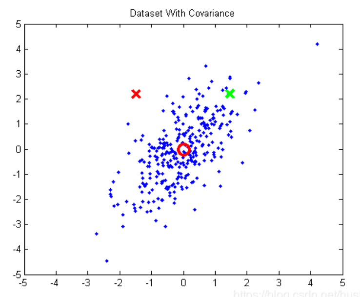
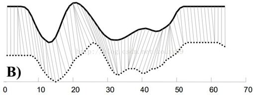
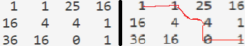
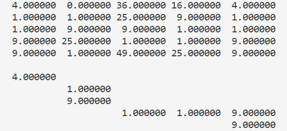
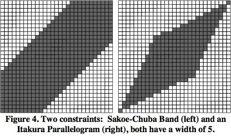
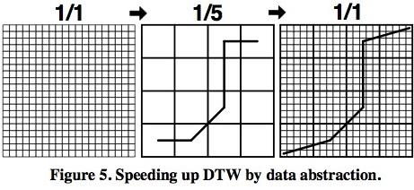
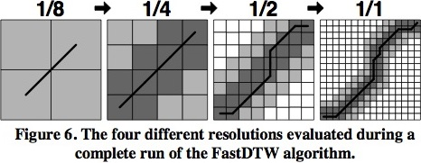
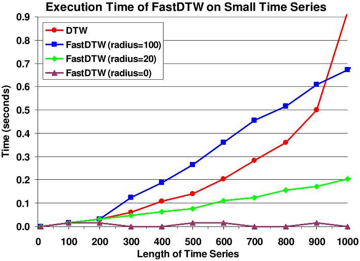
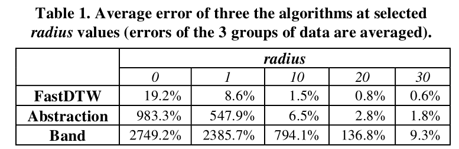
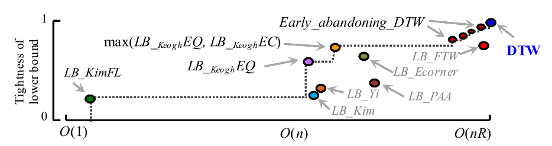

## 目录

[toc]

## 1 样本序列相似度

### 1.1 距离型

以差值为基础的相似度计算方法，通常值越小越相似。

#### 1.1.1 欧氏距离

假设序列 $X=\left \{ x_1,x_2, \dots, x_n \right \}$，$Y=\left \{y_1,y_2, \dots, y_n \right \}$，它们之间的欧式距离定义为：

$$
d_{L^p}=(\sum \limits _{k=1} ^{n} \left \vert x_k-y_k \right \vert^p ) ^{\frac 1p}
$$
当 $p=1$ 时，距离为 $d_{L^1}=(\sum\limits_{k=1}^{n}\left\vert x_k-y_k \right\vert)$，也称为曼哈顿距离。

当 $p=2$ 时，距离为 $d_{L^2}=(\sum\limits_{k=1}^{n}\left\vert x_k-y_k \right\vert^2)^{\frac 12}$，也称为欧几里得距离。

当 $p\rightarrow \infin$ 时，距离为 $d_{L^\infin}=\max\limits_{1\le k \le n}\left\vert x_k-y_k \right\vert$。

#### 1.1.2 马氏距离

设向量 $\vec{x} = \left (x_1,x_2, \dots, x_n \right )^T$，$\vec{y} = \left ( y_1,y_2, \dots, y_n \right )^T$，它们之间的马氏距离定义为：
$$
d(\vec x,\vec y)=\sqrt{\left (\vec x-\vec y \right )^{T}{\textstyle \sum^{-1}\left(\vec x-\vec y\right)}}
$$
其中，$\Sigma$ 为 $\vec x$ 和 $\vec y$ 的协方差矩阵。

【注1】马氏距离可以看成欧式距离使用协方差矩阵达成的标准化形式。

【注2】马氏距离的特点

考虑下面的例子。红圈是数据点的均值，绿 $\times$ 和红 $\times$ 到均值的欧式距离是相等的，但明显绿 $\times$ 更应属于这个分布。



原因在于：

1. 不同维度（x 轴，y 轴）之间存在相关性，这里表现为 x 轴与 y 轴存在正相关
2. 不同方向上变化幅度不同，把图顺时针旋转 45 度，可以看到横向上变化较大，竖向上变化较小（有些资料把这一点称为量纲不同和方差不同）。

用马氏距离就可以消除这种差别，它相当于把欧式距离进行了标准化。

### 1.2 夹角型

以乘积为基础的相似度计算方法，通常值越大越相似。可以通过取相反数达成值越小越相似。

#### 1.2.1 夹角余弦

假设序列 $X=\left \{ x_1,x_2, \dots, x_n \right \}$，$Y=\left \{y_1,y_2, \dots, y_n \right \}$，则它们之间的夹角 $\theta$ 满足：
$$
\cos\theta = \frac{\sum\limits_{k=1}^{n}x_k*y_k}{\sqrt{\sum\limits_{k=1}^{n}x_k^2} \sqrt{\sum\limits_{k=1}^{n}y_k^2}}
$$

#### 1.2.2 相关系数

假设序列 $X=\left \{ x_1,x_2, \dots, x_n \right \}$，$Y=\left \{y_1,y_2, \dots, y_n \right \}$，则它们之间的 Pearson 相关系数 $\text{corr}(X,Y)$ 满足：
$$
\text{corr}(X,Y)=\frac{\sum\limits_{k=1}^{n}(x_k-\bar x)(y_k-\bar y)}{\sqrt{\sum\limits_{k=1}^{n}(x_k-\bar x)^2}\sqrt{\sum\limits_{k=1}^{n}(x_k-\bar x)^2}}
$$
【注】相关系数可以看成夹角余弦通过每个特征减均值达成的标准化形式。

## 2 时间序列相似度

核心需要：对齐

什么是对齐：样本特征的互相配对。

为什么要对齐：样本的相似度是根据样本特征的相似度累加/平均的，这种结构化数据的特征直接对齐了，但时间序列的每一时刻值可能没有天然强对齐关系。

时间序列对齐策略的潜在要求：保序性/单调性，即假设序列 $T_1 = \left \{ a, b, c \right \}$ 和 $T_2 = \left \{ x, y, z \right \}$，$T_1$ 用任何配对策略匹配 $T_2$ 时，$T_2$ 都必须满足 “$y$ 不会在 $x$ 前面，$z$ 不会在 $x, y$ 前面”。

### 2.1 保端点型对齐策略

思想：

* 允许一对多

* 要求全部点

  即要求时间序列各个时刻的值都找到配对，从而开始点一定配对开始点，结束点一定配对结束点，也满足连续性。

适用场景：

* 语音相似度识别

  在语音识别领域不同人的语速不同，不同人说同样一句话会产生不同的序列，常需要还原时间上的位移。

#### 2.1.1 DTW

动态时间规整（Dynamic Time Warping，DTW），是保端点型对齐策略下的距离型度量。



##### 规整路径

设时间序列 $X=\left \{ x_1,x_2, \dots, x_n \right \}$，$Y=\left \{y_1,y_2, \dots, y_n \right \}$，长度分别为 $\left | X \right |$ 和 $\left | Y \right |$。

<u>规整路径的形式</u>为 $W = \left ( w_1, w_2, \dots, w_K \right )$，其中 $\max\left \{ \left| X \right|,\; \left| Y \right| \right \} \le K \le \left| X \right| + \left| Y \right|$。每个元素 $w_k = (i, j)$ 包含 $X$ 中的 $i$ 坐标和 $Y$ 中的 $j$ 坐标，且满足：
$$
\begin{align}
& w_1  = \left ( 1, 1 \right ) \\
& w_K  = \left ( \left| X \right|, \left| Y \right| \right ) \\

& w_k  = \left ( i, j \right ) ,\; w_{k+1} = \left ( i', j' \right ) \\
& i \le i' \le i+1 ,\; j \le j' \le j+1 \\

\end{align}
$$
于是，最后要得到<u>归整路径的距离</u>
$$
\text{dist}(W) = \sum_{k=1}^K \text{dist} (w_{ki}, w_{kj})
$$
最短的那个。其中 $\text{dist}(\cdot, \cdot)$ 为任意的经典距离计算方法，$w_{ki}$ 指 $X$ 的第 $i$ 个数据点，$w_{kj}$ 指 $Y$ 的第 $j$ 个数据点。

##### 算法实现

最基本的 DTW 可以用动态规划来实现。假设用 $\text{dp}[i][j] ,\; i\le m, \;j\le n$ 表示 $X$ 的前 $i$ 个点和 $Y$ 的前 $j$ 个点能取得的最小距离，定义状态转移方程：
$$
\text{dp}[i][j] = 
\begin{cases}
\text{dist}(1,1), & i=1,\; j=1 \\
\text{dp}[i-1][j] + \text{dist}(i,1), & i>1,\; j=1 \\
\text{dp}[i][j-1] + \text{dist}(1,j), & i=1,\; j>1 \\
\min \left \{ \text{dp}[i-1][j-1],\; \text{dp}[i][j-1],\; \text{dp}[i-1][j-1] \right \} + \text{dist}(i,j), & i>1,\; j>1
\end{cases}
$$
其中 $\text{dist}(i,j) = \left ( X[i] - Y[j] \right ) ^ 2$ 。

<u>例：DTW 例子</u>

设 $X=\left [3,6,8 \right ],\; Y = \left [2,4,8,7 \right ]$，DTW 计算过程中的距离矩阵为



要达到一个最小距离，相当于从左上角走到右下角，且每次只允许往右、往下或者往右下走，使得走过的数字的和最小。最短路径如右图所示。

##### 代码实现

```python
import sys
def dtw(X,Y):
    # variables
    l1, l2 = len(X), len(Y)
    M = [[distance(X[i],Y[i]) for i in range(len(X))] for j in range(len(Y))]
    # initialize
    dp = [[0 for i in range(l1+1)] for i in range(l2+1)]
    dp[0][0]=0
    for i in range(1, l1+1):
        dp[0][i] = sys.maxint
    for j in range(1, l2+1):
        dp[j][0] = sys.maxint
    # dynamic programming
    for j in range(1, l2+1):
        for i in range(1, l1+1):
            dp[j][i] = M[j-1][i-1] + min(dp[j-1][i], dp[j][i-1], dp[j-1][i-1] + M[j-1][i-1])
```

##### 优缺点

* DTW 的优点

  DTW 能处理长度不同的时间序列，这是它比传统的距离算法强的地方。而且对很多时间序列，用 DTW 进行距离计算明显更合理。

* DTW 的缺点

  用距离来度量相似度的算法的时间复杂度是 $O(n)$ ，空间复杂度是 $O(1)$ 的 ，而 DTW 算法在时间和空间上都是 $O(nm)$ 的。对于较长的时间序列，直接进行计算显然开销太大，于是要引进一些优化的方法。

#### 2.1.2 Greedy-DTW

> 来自论文《Time2Graph: Revisiting Time Series Modeling with Dynamic Shapelets》的附录 $A.1$ 的 $\text{Algorithm}\; 5$.

##### 思想概述

Greedy-DTW 用贪心算法代替动态规划，每次选择所有能走的点里代价最小的点。为了避免出现沿着边缘走的情况，设置一个窗口 $w$，规定走到的位置 $\left(x, y\right)$ 满足 $|x-y|\le w$。

<u>例：Greedy-DTW 例子</u>

设时间序列 $X=[2,3,5,7,1],\; Y=[4,2,8,6,4]$，$\text{dist}$ 矩阵和走过的路线如下：



##### 优缺点

* Greedy-DTW 的优点

  它最大的优点是速度快，只需要 $O(n+m)$ 的时间复杂度就可以完成计算。

* Greedy-DTW 的缺点

  缺点也很明显，贪心算法无法保证取得全局最优解，容易 ”误入歧途”。

#### 2.1.3 Fast-DTW

> 来自论文《FastDTW: Toward Accurate Dynamic Time Warping in Linear Time and Space》

##### 加速方法

* 搜索限制

  减少 $\text{dp}[i][j]$ 的搜索空间，下图中阴影部分为实际的探索空间，空白的部分不进行探索。

  

* 数据抽象

  把之前长度为 $N$ 的时间序列规约成长度为 $M(M<N)$ 表述方式。

  

##### 加速步骤

Fast-DTW 综合使用搜索限制和数据抽象两种方法来加速 DTW 的计算，主要分为三个步骤：

1. 粗粒度化

   首先对原始的时间序列进行数据抽象，数据抽象可以迭代执行多次 `1/1 -> 1/2 -> 1/4 -> 1/16`，粗粒度数据点是其对应的多个细粒度数据点的平均值。

2. 投影

   在较粗粒度上对时间序列运行 DTW 算法。

3. 细粒度化

   将在较粗粒度上得到的归整路径经过的方格进一步细粒度化到较细粒度的时间序列上。除了进行细粒度化之外，我们还额外的在较细粒度的空间内额外向外（横向，竖向，斜向）扩展 $K$ 个粒度，$K$ 为**半径参数**，一般取为 1 或者 2.

 Fast-DTW 算法的具体执行流程如下图所示:



第一个图表示在较粗粒度空间（`1/8`）内执行 DTW 算法。第二个图表示将较粗粒度空间（`1/8`）内求得的归整路径经过的方格细粒度化，并且向外（横向，竖向，斜向）扩展 $K=1$ 个细粒度单位后，再执行 DTW 得到的归整路径。第三个图和第四个图也是这样。

由于采取了减少搜索空间的策略，Fast-DTW 并不一定能求得准确的 DTW 距离，但 Fast-DTW 算法的时间复杂度比较低，为 $O(N)$。

##### 优缺点

* Fast-DTW 的优点

  最大的优点显然是速度快。

  

* Fast-DTW 的缺点

  由于这种方法得到的是较优解，因此我们有必要关注它的误差。定义误差如下所示：
  $$
  \text{Error of a wrap path} = \frac{\text{approxDist} - \text{optimalDist}}{\text{optimalDist}}
  $$
  经过试验得到误差大小：

  

  当 $radius =20$ 时，平均误差已经小于 $1%$ 。虽然误差仍然存在，但已经基本可以忽略。

#### 2.1.4 Constrained-DTW

> 来自论文《Searching and mining trillions of time series subsequences under dynamic time warping》

这篇文章对几种已有的剪枝策略进行了讨论，对它们的下界和时间复杂度进行了比较进行了比较，如下图所示：



一般认为在虚线下方的剪枝策略是没用的，因为至少存在一种下界更高且时间复杂度更低的策略。

最终作者决定用这种剪枝策略：先用 $LB_{Kim}FL$ ，如果不能大于 $Best\_so\_far$ ，则再用 $LB_{Keogh}EQ$ ，还是不行就用 $LB_{Keogh}EC$，再不行就用 $Early\_abandoning\_DTW$ 。

### 2.2 平移型对齐策略

思想：

* 只可一对一

* 允许无配对

  这里允许两边边界的点（端点及端点附近点）找不到配对，也满足连续性。

适用场景：

* 时钟不共享而有一定偏差的两条时间序列

#### 2.2.1 Cross-Correlation

Cross-Correlation 是平移型对齐策略下的夹角型度量。

Cross-Correlation 的定义与卷积类似，对于函数 $f(x)$ 和 $g(x)$ ，它们的 Cross-Correlation 定义为
$$
h(x)=\int_{-\infin}^{+\infin}f(t)g(x+t)dt
$$
事实上，把 $+$ 号改为 $-$ 号就是卷积了。

对于两个已经标准化了的时间序列 $\vec x=(x_1,\dots,x_m)^T$ 和 $\vec y=(y_1,\dots,y_m)^T$ 的 Cross-Correlation 可以这样定义：
$$
\begin{align}
CC(\vec{x}, \vec{y}) = (c_1, c_2, \dots, c_{2m-1}) \\
c_{k+m} =
  \begin{cases}
  	\sum \limits_{l=1}^{m-k} x_{l+k} y_l , & k>0 \\
    \vec{x} \cdot \vec{y} , & k=0 \\
    \sum \limits_{l=1-k}^{m} x_{l+k}y_l , & k<0
  \end{cases}
\end{align}
$$
然后在 $CC(\vec x,\vec y)$ 中找到一个最大的，记为 $CC_w(\vec x,\vec y)$，定义
$$
NCC_c(\vec x,\vec y) = \frac{CC_w(\vec x,\vec y)}{\sqrt{R_0(\vec x,\vec x)·R_0(\vec y,\vec y)}}
$$
这样就把距离归化到 $[-1,1]$。再定义
$$
SBD(\vec x,\vec y)=1-NCC_c(\vec x,\vec y)
$$
则得到向量 $\vec x$ 和向量 $\vec y$ 的 $\text{SBD}$（Shape-based Distance）距离，对于形状接近的时间序列，这个值接近于 0，否则接近于 2。

值得注意的是，直接计算两个长为 $m$ 的时间序列的 $\text{SBD}$ 距离是 $O(m^2)$ 的，但我们知道两个序列的卷积可以 $O(mlogm)$ 地计算，而)卷积只用把 $\vec x$ 翻转一下就变成了 $CC(\vec x,\vec y)$，因此，计算 $\text{SBD}$ 距离也是 $O(mlogm)$ 的。这会比 $O(m^2)$ 的 DTW 算法快很多。

以下是基于不同标准化思路得到的变种。

> 《k-Shape: Efficient and Accurate Clustering of Time Series》的 3.1 节的公式 8 的 3 个变种：
>
> * 定义 $NCC_b(\vec x,\vec y)=\frac{CC_w(\vec x,\vec y)}{m}$ 这样的结果并不会归一化到一个区间，有啥规律我也看不出来 ... ...
> * 定义 $NCC_u(\vec x,\vec y)=\frac{CC_w(\vec x,\vec y)}{w-|w-m|}$，这样的结果是上面有多少项相乘，则结果就除以多少。
