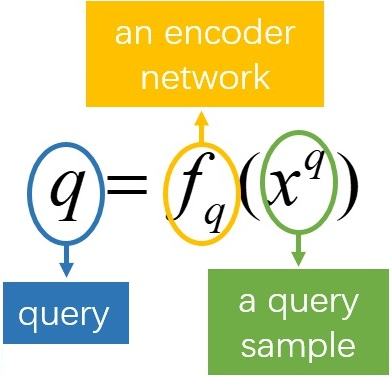
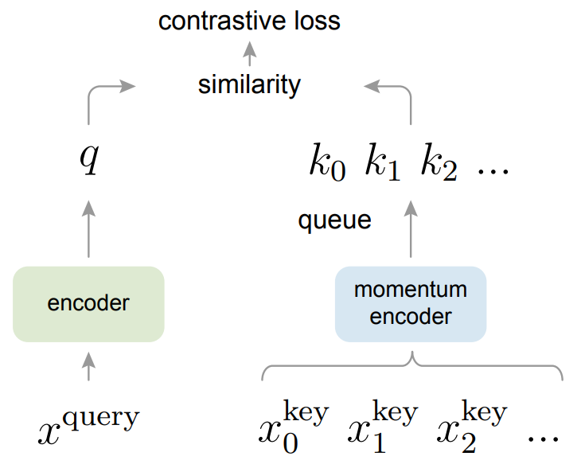
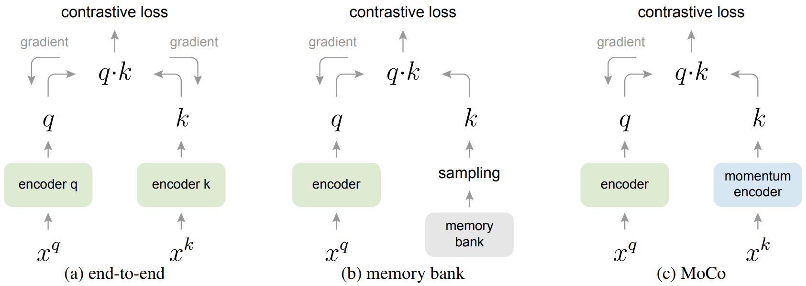
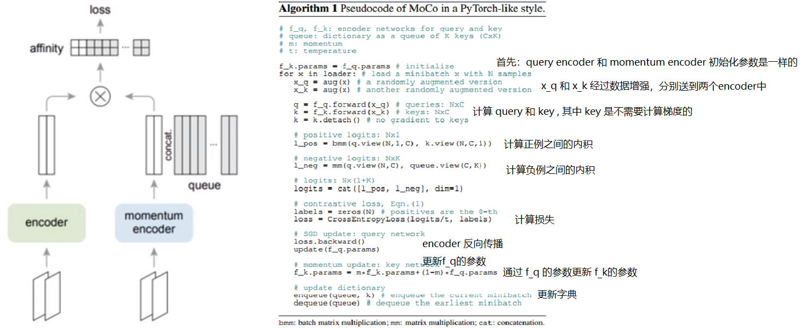
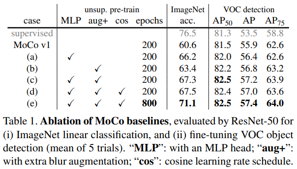
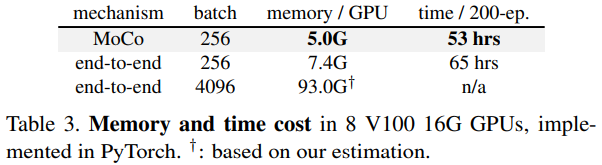

## 目录

[toc]

## 1 MoCo

### 1.1 介绍

题目：Momentum Contrast for Unsupervised Visual Representation Learning

论点：本文从 dictionary 视角出发，使用队列和移动平均 encoder 建立一个动态字典，同时具备 larget 和 consistent 的特点。

### 1.2 引入

在 NLP 中，无监督表示学习非常成功，诞生了如 GPT 和 BERT 这样里程碑式的模型，但在 CV 中这种学习方式却一筹莫展。

两者的主要差异在于：

* NLP 任务拥有**离散**的信号空间，能够建立标记化字典，设计无监督任务
* CV 任务的信号空间是**连续、高维**的，难以进展下去

目前图片上的无监督学习的经典方法是 instance discrimination method，设计原理为：给定两个图片采样（crop），如果它们来自同一张图片，则后者是正样本，否则后者是负样本。有了正负样本，就能够在对比中进行学习，设计对比损失函数，并最小化它。

本文基于对比损失，提出 Momentum Contrast（MoCo）方法来建立满足以下两种特点的 dictionary：

* large：队列（queue）的设计将 dictionary size 和 mini-batch size 解耦，从而允许 large dictionary

* consistent：基于 query encoder 移动平均得到 slowly progressing 的 key encoder，能够保持 consistency

### 1.3 模型

#### 1.3.1 网络结构

设 query representation 为 $q = f_q(x^q)$，其中 $f_q$ 为 encoder 网络，$x^q$ 为 query sample，同理有 $k = f_k(x^k)$.

在实现过程中，$x^q$ 和 $x^k$ 可以是图像、图块或图块集，$f_q$ 和 $f_k$ 可以是相同、部分共享或完全不同的网络。

建立如下的对比学习网络。

【悟1】对比学习本质上是为 dictionary look-up task 训练一个 encoder.

【悟2】对比学习本质上是一种在高维连续输入（如图像）上建立离散 dictionary 的方法。

#### 1.3.2 损失函数

假设只有一个与 $q$ 匹配的正样本 $k_+$，其余 key 均属于负样本集合 $K$，，本文使用经典的对比损失函数 InfoNCE：
$$
\mathcal{L}_q = -\log\frac{\exp(q\cdot k_+ / r)}{\sum_{i=0}^K \exp(q\cdot k_i/r)}
$$
其中 $r$ 是一个温度超参数（和 scaled dot product 类似），**有 ”归一“ 功能和 ”退火“ 功能**，本文设计为 $0.07$.

#### 1.3.3 动量对比

动量对比方法有两个核心：

* 字典队列

  将字典作为队列主要就是为了能将 dictionary 的大小和 mini-batch 的大小分离开来。

* 动量更新

  主要是为了解决字典这部分数据在反向传播的时候更新参数的问题，因为反向传播需要在队列中所有的样本中进行传播。

##### 1.3.3.1 字典队列

本文将 key 组成的 dictionary 设计成一个队列结构，如上面的网络结构图所示。

- 将字典维护为数据样本队列， 允许重用来自前面的小批量（mini-batch）的编码键（ key ）
- 字典大小可以比常规的批大小（mini-batch size）大得多
- 字典中的样本被逐步替换：最新的 mini-batch 进队，最旧的 mini-batch 出队

至此，dictionary size 与 mini-batch size 解耦，队列大小成为灵活独立的**超参数**。

##### 1.3.3.2 动量更新

对比学习的损失大体相同，但参数更新方式多种多样，从而**衍生出不同的模型**。

本文设计如下第三种的参数更新方式：

**end-to-end**

* 输入：mini-batch 样本作为字典
* 更新：query 和 key 的 encoder 通过反向传播进行端到端更新，因此键是一致编码的（相同的编码器参数集）
* 大小：字典大小等于 mini-batch 大小，，但大小会受GPU显存限制

**memory bank**

* 输入：每个 mini-batch 的字典是 memory bank 中随机采样的，memory bank 由数据集中所有样本的表示组成
* 更新：更新 encoder q，memory bank 无反向传播，其中的样本在最后一次看到时更新，采样的 key 本质上是关于过去 epoch 中多个不同步骤的编码器
* 大小：由于 encoder k 没有反向传播，支持更大的字典

memory bank 包含所有样本的特征表示，每个 mini-batch 从 memory bank 中随机采样数据且不需要反向传播，所以能支持比较大的字典。

但是，一个样本的特征表示只在它出现时才在 memory bank 更新，使得一个 epoch 只会更新一次，但模型在训练过程中不断迭代，这个特征就会 “过时”，使得一致性不强，而且它的更新只是进行特征表示的更新，不涉及 encoder.

**MoCo**

设 query 和 key 的 encoder 网络参数为 $\theta_q$ 和 $\theta_k$，则

* $\theta_q$ 通过正常的梯度反向传播更新

* $\theta_k$ 通过以下公式更新
  $$
  \theta_k \leftarrow m\theta_k + (1-m)\theta_q
  $$
  其中 $m\in(0,1)$，实验中发现取 $m = 0.999$ 效果较好。

特点：避免因为 encoder 的剧烈变化导致特征丢失一致性，同时也保持 encoder 一直处于被更新的状态。

### 1.5 实现细节

#### 1.5.1 实验设计

**数据集**

* *ImageNet-1M* (IN-1M)
  * 数据量：~ 1.28 M
  * 类别数：1 K
  * 物体态：形状类物体
* *Instagram-1B* (1G-1B)
  * 数据量：~ 940 M
  * 类别数：~ 1.5 K
  * 物体态：形状类物体、场景类物体

**数据增强**

- 从随机调整大小的图像中获取 224×224 像素的裁剪（a 224×224-pixel crop is taken from a randomly resized image）
- 随机颜色抖动（random color jittering）
- 随机水平翻转（random horizontal flip）
- 随机灰度转换（random grayscale conversion）

**样本设计**

设计原则：对于一对样本，如果它们来自同一张图像，则是正样本，否则是负样本。

使用过程：从随机增强的数据中选取一对图块放进队列中，队列中的其余样本自动称为负样本。

**模型设计**

query encoder 和 key encoder 采用 ResNet 神经网络。

**优化设计**

优化器类型为 Momentum，采用 PyTorch 的优化器函数 `SGD()` 实现。

**算法设计**

#### 1.5.2 BN 同质性

ResNet 经典的 Batch Normailzation 在对比学习上会有以下问题：

* 现象：BN 阻止模型学习好的表示

* 分析：

  * 在训练时使用多个 GPU，在每个 GPU 上分别进行 BN（常规操作）
  * 在分布式训练当中，所有 positive pairs 都分到相同的设备上计算，各个 GPU 独立进行 BN
  * BN 令设备上 batch 内的样本交流，展现 batch 特征给设备打上 “烙印”，设备的局部信息泄露从而被模型利用

* 办法：

  * shuffling BN

    本文的解决办法是 shuffling BN，它的过程如下：

    * 对于 key encoder，打乱当前 mini-batch 的样本顺序，再分配到 GPU 上分别进行 BN，然后恢复打乱前的顺序
    * 对于 query encoder，不改变样本的顺序

    作用：保证用于计算 query 和对应 positive key 的批统计量出自两个不同的子集。

  * global BN

    聚集所有设备上 BN 的 mean 和 varivance【代码细节】。

  * layer normalization

## 2 MoCov2

### 2.1 介绍

题目：Improved Baselines with Momentum Contrastive Learning

论点：本文借鉴 [SimCLR](SimCLR.md#1-SimCLR) 中的 MLP projection head 和 more data augmentation 观点，建立了更强的 baselines.

### 2.2 引入

当前图像领域的无监督表示学习研究逐渐收敛于 “对比学习” 这个概念上。MoCo 的提出标志着基于对比学习的无监督预训练模型首次超过有监督模型，随后 SimCLR 进一步在线性分类器上缩小了有监督和无监督之间的差距。

本文非常认可 **[SimCLR](SimCLR.md#1-SimCLR) 的 <u>MLP projection head</u> 和 <u>more data augmentation</u> 观点**，但是指出 <u>SimCLR 基于 end-to-end 机制</u>的参数更新方式，必须要 large batch 来提供大量的负样本，增加计算成本。

<u>MoCo 的 queue 机制</u>却能很好的解决这个问题，于是作者将 SimCLR 的两个创新应用到 MoCo 的改进上，提出 MoCo v2 版模型，取得 state of art 效果。

### 2.3 实验

#### 2.3.1 实验设计

本文设计两个实验：

* ImageNet linear classification
  * 数据集：1.28M ImageNet 训练集
  * 下游设计：frozen features 输入到 supervised linear classifier 训练
  * 评价指标：top-1 validation accuracy
* Transferring to VOC object detection
  * 数据集：VOC 07+12 trainval set 和 VOC 07 test set
  * 下游设计：faster R-CNN detector (C4-backbone) 端到端训练
  * 评价指标：COCO suite of metrics[^1]

[^1]: COCO: Common objects in context. In ECCV. 2014.

#### 2.3.2 实验结果

MLP head 与 augmentation 的提升效果如下：

与 SimCLR 的对比结果如下：

此外，作者还研究了模型的效率，MoCov2 的时空花费如下：

