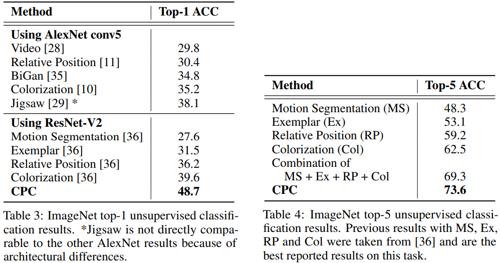

## 目录

[toc]

## 1 CPC

### 1.1 介绍

题目：Representation Learning with Contrastive Predictive Coding

论点：本文提出了一种通用的无监督学习方法——对比预测编码，能够从高维数据中提取有用的表征。

### 1.2 引入

有监督学习能够学习到质量很好的特征，但也存在数据获取效率、稳健性和泛化性等问题。无监督学习是迈向稳健性和泛化性的基石，但目前缺少突破。

无监督学习<u>最常见的策略</u>之一是预测未来、空缺或上下文信息，这是一种 predictive coding 的编码思想，属于信号处理数据压缩中的老技术。最近一些研究成功将该思想应用于词语特征的提取，其使用的方法就是通过相邻词语预测空缺词语进行学习。

本文提出以下几点内容：

* 将高维数据压缩到一个更紧凑的潜在嵌入空间中，在这个空间中条件预测更容易建模
* 在这个潜在嵌入空间中使用强大的自回归模型来预测未来的多个步骤
* 我们使用与 NLP 中词嵌入类似的方法对损失函数进行 Noise-Contrastive Estimation，实现端到端的训练

### 1.3 思想

本文的出发点是<u>学习</u>**全局有效**特征，它要求编码高维数据不同部分间共享的潜在信息，丢弃低级特征和局部噪声。为此抛出以下问题。

#### 1.3.1 学习 “全局” 特征

在时间序列和高维建模中，采用 Transformer 的 NSP 任务捕捉信号的局部平滑性来提取局部特征，如果**将时间跨度拉长**用 NN...SP，则共享信息减少，模型转而捕捉全局特征。

#### 1.3.2 学习 “有效” 特征

特征的有效性。对于一个 end-to-end 模型来说，encoder 作用得到的 latent vector 被 decoder 解码后，将新 matrix 用于训练和预测。但是传统上并没有要求 latent vector 具有足够好的特性（可解释性，代表性和区分度等），这里就存在着可优化的 ”有效“ 空间。                                                                                                                                                                                                                                                                                                                                                                                                                     

用对比衡量有效性。设输入 $X_i$ 经过 encoder 编码后得到 latent vector $c_i$，然后将它们建立为一个数据对 $(X_i, c_i)$，表示正样本，负样本由正样本打乱得到。建立一个 discriminator，简单的 binary classifier，用正样本和负样本进行训练，然后用测试样本考察其 loss 收敛性，loss 小则说明 latent vector 有效（由代表性、分辨度）。

图像数据对比示例：

序列数据对比示例：

#### 1.3.3 量化特征有效性

NSP 任务涉及高维数据的预测，这是一个极大的挑战：

* 常见的单峰损失函数（平方损失，交叉熵损失）不适用于对比学习
* 生成式模型要求苛刻到需要构建数据中的所有细节

为此作者另辟蹊径，**从 “对比” 的视角来衡量损失，并指导后续的模型设计与训练**。

本文使用最大化互信息的策略来提取 target $x$（NSP 中的 future）和 context $c$（NSP 中的 present）的全局信息（分布）。
$$
I(x; c) = \sum_x \sum_c p(x,c)\log \frac{p(x,c)}{p(x)p(c)} = \sum_{x,c}p(x,c)\log \frac{p(x\mid c)}{p(x)}
$$

### 1.4 模型

#### 1.4.1 网络结构

下图是 Contrastive Predictive Coding 模型的结构。

其中，<u>非线性编码器 $g_{\text{enc}}$</u> 将序列输入 $x_t$ 映射到隐层向量 $z_t = g_{\text{enc}}(x_t)$，<u>自回归模型 $g_{\text{ar}}$</u> 概括隐层空间中的 $z_{\le t}$ 生成上下文隐层向量 $c_t = g_{\text{ar}}(z_{\le t})$.

【注1】隐层向量 $z_t$ 和上下文隐层向量 $c_t$ 均可用于下游任务：

* 对于需要利用上下文信息的任务，可使用 $c_t$，否则 $z_t$ 也足够
* 对于需要整个序列信息的任务，可以池化所有位置的 $c_t$ 或 $z_t$

【注2】任何类型的 encoder 和 autoregressive model 均可用于这个网络。

#### 1.4.2 损失函数

对于生成式模型 $p_k(x_{t+k}\mid c_t)$，它直接预测 $x_{t+k}$，但在对比视角下转为最大化 $x_{t+k}$ 和 $c_t$ 之间的互信息，即最大化
$$
f_k(x_{t+k}, c_t) \propto \frac{p(x_{t+k}\mid c_t)}{p(x_{t+k})}
$$
称 $f_k(x_{t+k}, c_t)$ 为密度比（density ratio），其要求正比于互信息。

注意到 $f_k(x_{t+k}, c_t)$ **本质上度量的是 $c_t$ 对 $x_{t+k}$ 预测的效果增益**，因此不管 $f_k(x_{t+k}, c_t)$ 形式如何，只要有这种度量效果都能满足正比。因此 $f_k (x_{t+k}, c_t)$ 可以是非线性神经网络或循环神经网络，这里作者<u>选取简单的对数线性形式</u>：
$$
f_k(x_{t+k}, c_t) = \exp\left ( z^T_{t+k} W_k c_t \right )
$$
其中 $z_{t+k}$ 是待预测目标 $x_{t+k}$ 的隐层向量， $\hat{z}_{t+k} = W_kc_t$ 对它的预测，用余弦相似度计算两者的近似程度，再套个指数扩大差异。

密度比的设计能够缓解模型对高维数据分布的建模，为 Noise-Contrastive Estimation (NCE) 和 Importance Sampling 这些技术提供了使用空间，即为对比学习建立了基础。

于是，基于 NCE 技术建立对比损失函数 InfoNCE。给定 $N$ 个随机样本集合 $X = \{ x_1, \dots, x_N \}$，其中包含一个来自 $p(x_{t+k}\mid c_t)$ 的正样本和 $N-1$ 个来自 $p(x_{t+k})$ 的负样本，建立对比损失：
$$
\mathcal{L}_N = -\mathbb{E}_X \left [ \log \frac{f_k(x_{t+k}, c_t)}{\sum_{x_j\in X}f_k(x_j, c_t)} \right ]
$$
对这个函数的优化导致 $f_k(x_{t+k}, c_t)$ 的最大化，最终使得 $x_{t+k}$ 和 $c_t$ 之间的互信息最大化。

【注】定理表明，$\mathcal{L}_N$ 的优化能提高互信息下界从而实现逼近：
$$
I(x_t+k,c_t) \ge \log(N) - \mathcal{L}_N
$$

### 1.5 实验

#### 1.5.1 图像实验

数据集：ILSVRC ImageNet competition dataset

网络：

* 从 $256 \times 256$ 的图像中裁剪 $7\times 7$ 个 $64\times64$ 的子图，相互之间有 $32$ 个重叠像素
  * $256 \times 256$ 数据增强：裁剪自 $300 \times 300$ 的 ImageNet 图像，随机 $50\%$ 的翻转
  * $64\times64$ 数据增强：随机裁剪为 $60 \times 60$ 并重新扩充为 $64\times 64$
* ResNet-v2-101 作为 encoder 提取 $z_t$，得到 $7 \times 7 \times 1024$ 的张量
* PixelCNN 作为 autoregressive model 提取 $c_t$，预测后续 $7\times 7$ 中的至多五行，一行 1 个正样本 6 个负样本对比学习
* 网络不使用 BN

预训练

* 优化器：Adam
* 学习率：$2e-4$
* 批大小：$32$ GPU $\times 16$

下游任务

* 使用线性分类层进行预测
* 优化器：SGD
* 梯度动量：0.9
* 学习率：$0.1 \times 50k$，$0.01 \times 25k$，$0.001 \times 10k$
* 批大小：$1$ GPU $\times 1024$

实验结果

优化策略

* 增大 batch（上万）
  * memory bank
  * momentum contrast
* 提升 encoder 模型能力
  * SimCLR
* 提升数据增强技术
  * 特别是自监督学习要提升数据增强技术（相当于设置好的预训练任务）

对比学习表示的评价指标 ^Wang^ ^and^ ^Isola^ ^(2020)^

* Alignment
* Uniformity：向量整体分布的均匀程度

有监督对比学习

* 利用标签信息构建正负样本

[^ Supervised Contrastive Learning]: 有监督对比学习

NLP 中的有监督对比学习（应用）

* infoNCE
  * 直接使用
  * pooled output 拼接 linear 层的权重使用（label 制作为 0-34）
* supervised Loss

讲解了其具体的==代码实现==。

