## 1 SimCLR

### 1.1 介绍

题目：A Simple Framework for Contrastive Learning of Visual Representations

论点：本文提出一个视觉特征的对比学习框架 SimCLR，并对框架的主要组件进行分离实验，得出对比学习的重要结论。

### 1.2 引入

图像领域的自监督学习是一个经久不衰的话题，主流方法大多分成两类：生成式或判别式。

生成式方法学习在输入空间中生成或以其他方式建模像素，但计算量巨大且可能不适应表示学习。判别式方法通过类似于有监督任务的预训练任务来学习特征，但预训练任务需要精心的设计。

今年来基于潜在空间对比学习的判别式方法受到青睐，在诸多领域取得 SOTA 效果。本文也在对比学习领域提出 SimCLR 框架，并对此框架的主要组件进行系统性研究，得出若干影响对比学习的重要结论。

### 1.3 模型

#### 1.3.1 网络结构

SimCLR 通过在潜在空间中的对比损失，最大化同一样本的不同数据增强视图之间的一致性，从而学习特征。下图是 SimCLR 框架的主要结构。

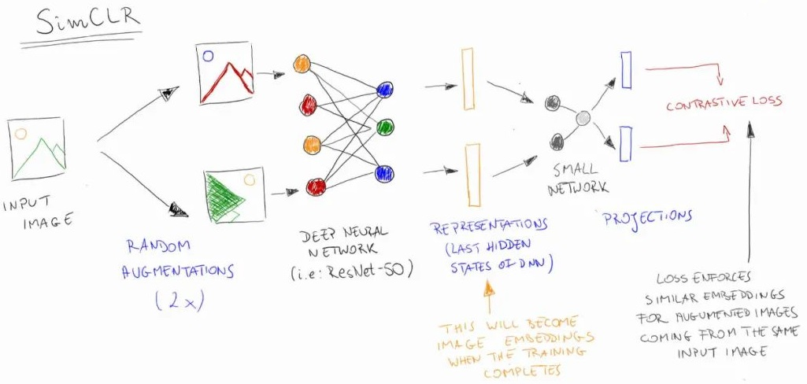

SimCLR 由四个主要组件组成：

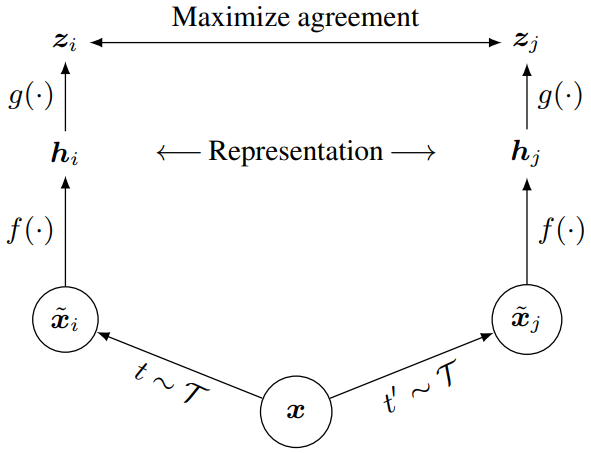

* 随机数据增强模块（Random Augumentation）

  * 功能：随机变换给定的样本 $x$，得到两个关联的视图 $\tilde{x}_i$ 和 $\tilde{x}_j$，构成一个正样本对（positive pair）
  * 类型：随机裁剪，随机色彩抖动，随机高斯模糊

* 基础编码器（Base Encoder）

  * 功能：从增强后的数据样本中提取特征向量
  * 类型：可以使用各种类型的网络结构，本文用 ResNet (最大为 -50 4$\times$) 卷积神经网络来获得 ${\bf{h}_i} = f(\bf{x}_i) = \text{ResNet}(\tilde{\bf x}_i) \in \mathbb{R}^d$

* 投影头（Projection Head）

  * 功能：将特征向量映射到对比损失函数的输入空间
  * 类型：<u>MLP 网络</u>，结构为 $z_i = g({\bf{h}_i}) = W^{(2)}\sigma(W^{(1)}\bf{h}_i)$，其中 $\sigma$ 为 ReLU 函数

* 对比损失函数（Contrastive Loss Function）

  * 功能：为对比损失任务衡量对比的损失

  * 类型：*NT-Xent* (the normalized temperature-scaled cross entropy loss)，也叫 InfoNCE

    对于任意一个样本对 $(i,j)$，其定义为
    $$
    \ell_{i,j} = -\log\frac{\exp(\text{sim}(z_i,z_j) / \tau)}{\sum_{k=1}^{2N} \mathbb{1}_{k \neq i} \exp(\text{sim}(z_i,z_j) / \tau)}
    $$
    最终的对比损失是 mini-batch 所有正样本对的损失之和，包括 $(i,j)$ 和 $(j,i)$.

#### 1.3.2 计算流程

四个组件在组成 SimCLR 网络，其工作方式为：

1. 随机取出一个 mini-batch 共 $N$ 个图像样本
2. 准备 2 个随机的图像增强得到 $2N$ 个数据点，因此对于任意一对正样本，其余 $2(N-1)$ 个都是负样本
3. 运行一个深度神经网络（最好是卷积神经网络，如 ResNet50）来获得那些增强图像的特征向量
4. 运行一个小的全连接线性神经网络 MLP，将特征向量投影到对比损失函数的输入空间
5. 计算对比损失并通过两个网络进行反向传播，损失函数中的相似度可以是任意的，本文使用余弦相似度

#### 1.3.3 算法流程

上述 SimCLR 网络计算过程的算法描述如下：

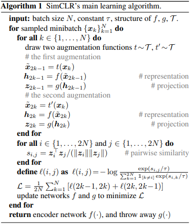

### 1.4 实验细节

#### 1.4.1 训练方案

作者为了保持框架的简洁，不采用 memory bank 的方式，而是使用**大 batch size** = 8192，这样通过数据增强，每对正样本能得到 16382 个负样本。

作者针对大 batch size 下对比学习的两个问题，提出相应的解决方法：

* BN 同质性

  问题成因见 MoCo 一文，作者采用 Global BN 方法。

* 大 batch 稳定性

  大 Batch Size 使用 SGD/Momentum 进行优化时可能导致的训练不稳定[^1]，作者转而使用 LARS 优化器[^2]。

【注】在 finetuning 阶段 MLP 投影头 $g(\cdot)$ 是完全丢弃的。

参考文献：

[^1]: [Accurate, Large Minibatch SGD: Training ImageNet in 1 Hour](https://arxiv.org/abs/1706.02677)
[^2]:[Large Batch Training of Convolutional Networks](https://arxiv.org/abs/1708.03888)

#### 1.4.2 评价方案

为了理解框架中不同组件的作用，作者设计如下评价方案。

* 数据集
  * 大部分实验：ImageNet ILSVRC-2012
  * 少部分实验：CIFAR-10
  * 预训练测试：一些广泛用于迁移学习的数据集
* 评价指标
  * 线性评价协议 (linear evaluation)：在一个冻结基网络的顶层训练一个线性分类器，用于评价表征的质量
  * 传统评价协议 (finetune evaluation)：在下游任务中微调整个网络的参数，用于评价整个模型的质量
  * 也比较一些迁移学习和半监督方法
* 默认参数
  * 数据增强：随机裁剪并缩放+随机翻转、色彩抖动、高斯模糊
  * 编码网络：ResNet-50
  * 投影头：两层的 MLP 网络，输出 128 维
  * 对比损失：NT-Xent
  * 优化器：LARS，学习率 $4.8 = 0.3 \times \text{BatchSize}/256$，前 10 epochs 线性升温，后面余弦衰减
  * 批大小：4096
  * 迭代数：100 epochs

### 1.5 数据增强详解

#### 1.5.1 观点一：数据增强决定预测任务

作者认为，数据增强是对比学习任务设计的系统环节之一。设计一些对比预测任务时，可以组合不同的数据增强方法，不必改变网络结构。作者举了以下例子来说明这个观点。

比如两种典型的对比预测任务，分别是 “整体—局部预测” 和 “邻近预测”，可以通过组合两种图像裁剪的数据增强方法实现：

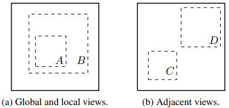

#### 1.5.2 观点二：组合种类影响特征效果

作者考虑以下的数据增强方法，研究单独和成对数据增强方法对 SimCLR 框架性能的影响。

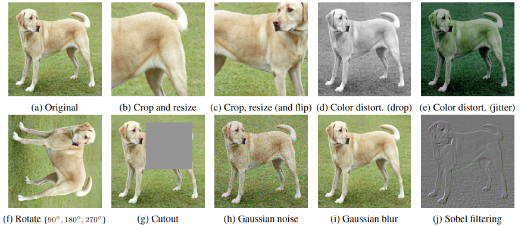

由于 ImageNet 数据集中的图像大小并不一致，在使用数据时通常已经进行了图像裁剪和缩放操作，因此剔除随机裁剪的影响，作者只对 SimCLR 的其中一个分支进行数据增强，另外一个保持 $t({\bf x}_i) = {\bf x}_i$.

以上方法及其组合的 linear evaluation (ImageNet top-1 accuracy) 结果如下： 

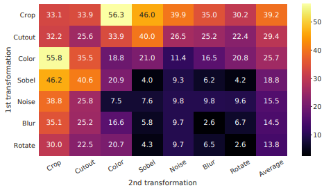

其中对角线时单个变换的效果，非对角线是两个变化的组合（线性应用两个变换）效果。

作者发现：

* 单个变换不足以学习良好的特征表示

* “随机裁剪 + 随机色彩抖动” 的效果最佳

  * 随机裁剪的图像具有相似的色彩分布

    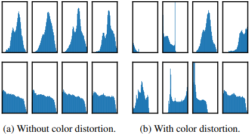 

  * 随机色彩抖动能阻止这一信息泄露

#### 1.5.3 观点三：对比学习更需数据增强

作者通过调整色彩增强的强度，来观察其在对比学习和传统自监督学习上的差异，结果如下：

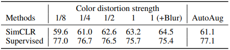

可以看到，随着色彩抖动强度的增加，对比学习框架的效果也在增加，自监督模型则不然。此外，作者还提到，一些不适用于自监督学习的方法也<u>能够应用于对比学习取得效果提升</u>。

### 1.6  Encoder & Head 详解

#### 1.6.1 观点一：对比模型益于更大结构

这个观点符合常规，作者的实验如下：

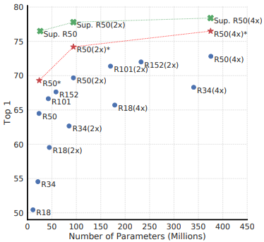

#### 1.6.2 观点二：曲投影头提升特征质量

作者对比无投影、线性投影和非线性投影，观察效果如下。

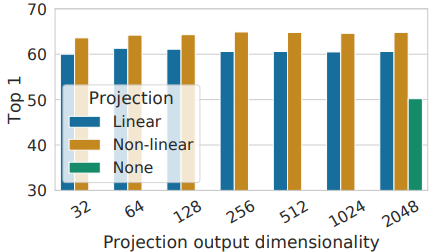

相比无投影头，线性投影头的 linear evaluation (ImageNet top-1 accuracy) 提升 $3\%$，非线性投影头提升 $>10\%$.

作者进一步研究投影头的作用，实验如下，发现：**投影头前的特征信息比投影头后的信息更多**。

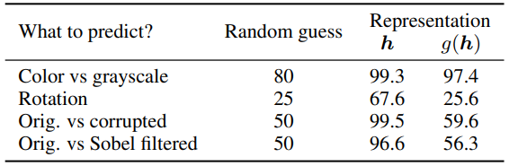

作者分析，投影头对数据变换的**平移不变性** ${\bf z} = g({\bf h})$，使得网络能够发现这些数据变换及其联系，从而**过滤掉这些信息干扰**，抽取用于给定任务的本质特征。 

### 1.7 损失函数和批大小详解

#### 1.7.1 观点一：对比损失有着更大优势

作者比较 NT-Xent、NT-Logistic 和 Margin Triplet 等损失函数，其定义和梯度如下表。

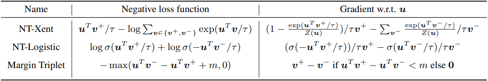

从梯度可以看出：

* $\ell_2$ 正则化和温度 $\tau$ 能够有效地加权不同样本，合适的 $\tau$ 能帮助学习 hard negatives
* 其他目标函数无法区分 negatives 间的 relative hardness，即使 semi-hard negatives mining 技术也难偿

总是，NT-Xent 损失函数有着绝对优势。

#### 1.7.2 观点二：对比学习益于大批长训

这个观点也较为直观，作者在不同 batch size 和 epochs 下基于 ResNet-50 的 linear evaluation 结果如下。

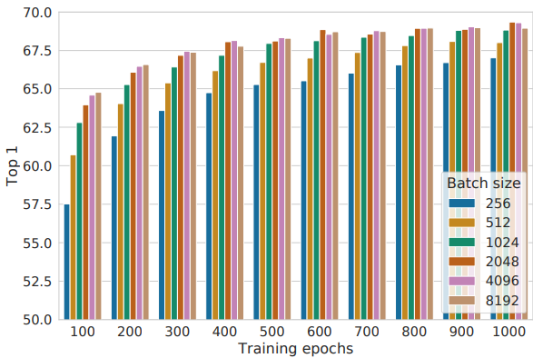

从中可以看到，随着 steps/epochs 的增加，不同 batch size 之间的表现差异逐渐缩小。作者分析，对比学习中提供越多 negative examples，越利于收敛，大 batch size 和长 epochs 都是这个道理。

## 2 SimCLRv2

### 2.1 介绍

题目：Big Self-Supervised Models are Strong Semi-Supervised Learners

论点：本文在 [SimCLR](#1-SimCLR) 的基础上，设计出一套共三步的半监督学习框架，并继续对重要设计选项进行深入探讨。

### 2.2 引入

在机器学习中，学习少部分有标注样本、并充分利用大部分无标注样本，是一个非常典型的问题，本文罗列两种方案。

* 无监督/半监督预训练 + 有监督微调

  目前在计算机视觉领域进展较少，但在自然语言处理领域已是主流。

* 有监督训练 + 无标注数据正则

  目前在计算机视觉领域用的较多。

本文借鉴目前计算机视觉领域的自监督学习思路，发展 [SimCLR](#1-SimCLR) 模型至 v2 版本，提出半监督学习框架，主要包含以下三个步骤：

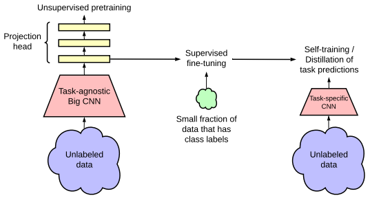

1. pretrain: 无监督/半监督预训练
2. finetune: 有监督微调
3. distill: 无标注样本蒸馏

本文的主要贡献如下：

* 更大的自监督模型更加 label efficient —— 在 finetune 时用少量标注数据达到更好的效果
* 模型的额外增大对于特定的下游任务可能不是必须的 —— 存在压缩的可能性
* 深层投影头特定用法既能提升表征质量，又能提升微调效果 —— 非线性变换的重要性

### 2.3 模型

#### 2.3.1 Pretrain 阶段

本文的预训练模型由 SimCLR 改进而来，它是一个基于对比学习理论的模型，详见 [SimCLR](#1-SimCLR).

SimCLRv2 相比 SimCLR 主要有三个提升：

* 基础编码器：使用更大的 ResNet 模型，以充分发挥预训练的潜力

  * SimCLR 使用的最大模型是 ResNet-50 (4$\times$)
  * SimCLRv2 使用 152 层 3$\times$ + selective kernels (SK) 的 ResNet

  在 1% labeled examples 的 finetuned 下，top-1 accuracy 提升 29%.

* 投影头：

  * SimCLR 使用的 MLP 有两层
  * SimCLR 使用更深的三层，并在 finetune 时保留第一层

  在 1% labeled examples 的 finetuned 下，top-1 accuracy 提升 14%.

* 参数更新方式

  * SimCLR 使用 end-to-end 的方式
  * SimCLRv2 借鉴 MoCo 使用 memory 机制

  在 1% labeled examples 的 finetuned 和 linear evaluation 下，top-1 accuracy 都提升约 1%.

  注：finetuned evaluation 和 linear evaluation 的区别见 `2.4.2 评价方案`，并且本文 linear evaluation 使用全部标注样本。

#### 2.3.2 Finetune 阶段

在 SimCLR 中，MLP 投影头 $g(\cdot)$ 在 pretrain 阶段完成后就全部丢弃了，只留下 $f(\cdot)$ 参与 finetune.

本文提出保留投影头的部分参与到 finetune 中，即从投影头中间某一层开始 finetune.

【注】从投影头的第一层开始 finetune，相当于在基网络中加入一个全连接层。

#### 2.3.3 Distill 阶段

为了进一步提升网络在目标任务上的表现，本文使用 finetuned 网络作为 teacher 来预测无标注样本的 label 给 student 进行学习。

蒸馏损失为：
$$
\mathcal{L}^{\text{distill}} = -\sum_{{\bf x_i}\in \mathcal{D}} \left [ \sum_y P^T(y\mid {\bf x_i}; \tau) \log P^S(y\mid {\bf x_i}; \tau) \right ]
$$
其中 $\tau$ 为温度参数，函数 $P$ 定义如下，上角标 $T$ 表示 teacher 网络（蒸馏时固定），$S$ 表示 student 网络（蒸馏时不固定），
$$
P(y\mid {\bf x_i}; \tau) = \frac{\exp(f^{\text{task}}({\bf x_i})[y]/\tau)}{\sum_{y'}\exp(f^{\text{task}}({\bf x_i})[y']/\tau)}
$$
蒸馏过程中使用的是无标注数据，如果还使用有标注数据且占比较大，可以组合损失：
$$
\mathcal{L} = -(1-\alpha)\sum_{({\bf x_i}, y_i)\in D^L} \left [ \log P^S(y_i|{\bf x_i}) \right ] - \alpha \sum_{{\bf x_i}\in \mathcal{D}} \left [ \sum_y P^T(y\mid {\bf x_i}; \tau) \log P^S(y\mid {\bf x_i}; \tau) \right ]
$$

### 2.4 实验研究

暂略。