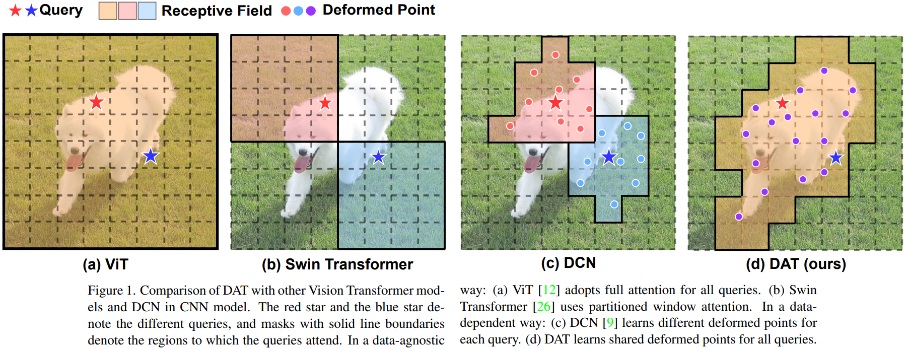
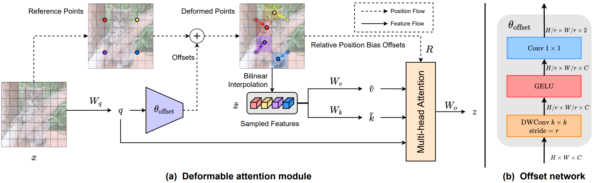
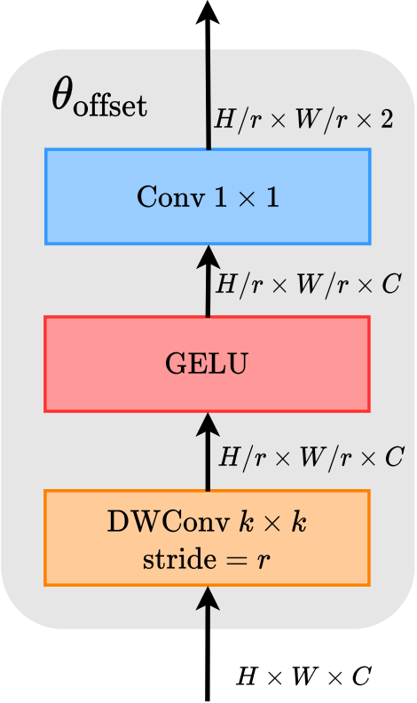
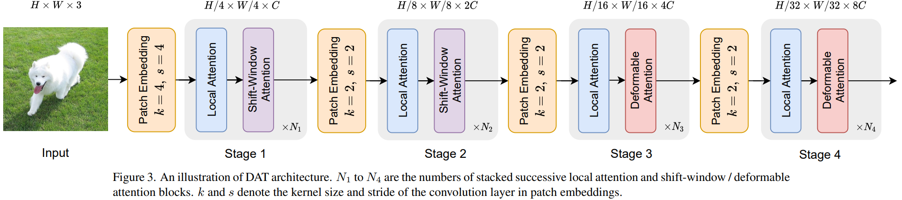
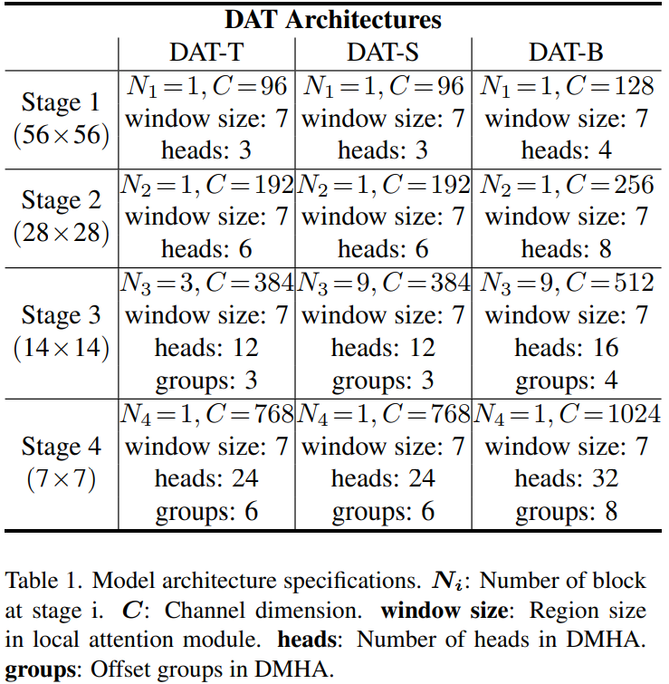

## 目录

## 1 DAT

### 1.1 简介

题目：Vision Transformer with Deformable Attention

挑战：单纯地扩大注意力感受野会带来一些问题

* 一方面，使用 dense attention (如 [ViT](./ViT.md)) 会导致内存和计算成本过高，特征也会受到不相关部分的影响
* 另一方面，采用的 sparse attention (如 PVT 或 [Swin Transformer](./SwinTransformer.md)) 是数据不可知的 (data agnostic)，可能限制建模长期关系的能力

方向：为了避免过度的注意力计算，一些研究利用精心设计的有效注意力模式来降低计算复杂度和扩展感受野

* Pyramid Vision Transformer (PVT) 则通过对 key 和 value 特征图进行下采样来节省计算量
  - 缺陷：下采样技术容易造成信息损失

- [Swin Transformer](./SwinTransformer.md) 采用基于 window 的局部注意力来限制 local window 中的注意力计算量
  - 缺陷：shift-window attention 导致感受野或者缓慢，影响对大物体的建模

- [Deformable Convolution Network](./DCN.md) 的可变形技术直接用于 attention 检测点的变形
  - 缺陷：引入 deformable offsets 的开销是 patch 数量的平方，计算量不可接受

- [Deformable-DETR](./DETR.md) 的 detection head 中为 query 缩减 keys 等技术用来增强 backbone
  - 缺陷：keys 的减少限制表达能力，并且注意力来自简单的线性投影，query token 之间不共享 keys

为了**缓解**这些问题，本文提出了一种新的可变形的自注意力模块，以 data-dependent 的方式选择自注意力中 key-value pairs 的位置，使自注意力模块能够聚焦于相关的区域并捕获更多的信息。

参考资料：

* [DAT 解读](https://blog.csdn.net/amusi1994/article/details/122335513)
* [DAT 代码](https://github.com/LeapLabTHU/DAT)

### 1.2 模型

在视觉注意力模型中，**不同的 query 具有相似的 attention map**。本文基于这个规律，提出了<u>可变形注意力</u>操作。

通过 offset 网络从 query 中学习多组 deformed sampling points，来确定特征图中的 important regions，然后采用双线性插值对其中的特征进行采样，最后将采样后的特征输入到 key-value 并投影得到 deformable key-value。后续对位移后的 key-value 照常使用 multi-head attention 聚集特征。

#### 1.2.1 Deformable Attention

可变形注意力模块的具体结构如下图所示。

##### Reference Points

给定输入特征图 $x\in\mathbb{R}^{H\times W\times C}$，生成关于点的统一网格 $p\in\mathbb{R}^{H_G \times W_G \times 2}$ 作为 references。其中，

* 统一网格是对特征图的下采样，因子为 $\gamma$，有 $H_G = H/ \gamma, W_G = W/ \gamma$，
* refenences 点的值为线性间隔的二维坐标 $\left \{ (0,0), \dots, (H_G-1, W_G-1) \right \}$

然后根据网格形状 $H_G \times W_G$ 将其归一化到 $\left [ -1,+1 \right ]$，其中 $(-1,-1)$ 表示网格左上角，$(+1,+1)$ 表示网格右下角。

##### Offsets

为了获得每个 refenences 点的 offset，将

* 特征图线性投影到 query tokens $q = xW_q$ 
* 然后输入一个轻量的子网络 $\theta_{\text{offset}}\left(\cdot\right)$ 来生成 offsets $\Delta p = \theta_{\text{offset}}\left(q\right)$

为了稳定训练过程，用一些预定义的因子 $s$ 来缩放 $\Delta p$ 的振幅，避免出现过大的 offset，即 $\Delta p \leftarrow s \cdot \tanh \left ( \Delta p \right )$。

【注】offset 生成网络 $\theta_{\text{offset}}\left(\cdot\right)$ 在 [Offset Network](#1.2.2-Offset-Network) 提到。

##### Deformed key-value

根据 offsets 对 reference 点进行位移后得到 deformed 点，在其上通过双线性插值函数 $\phi$ 采样特征，
$$
\begin{align}
& \tilde{x} =  \phi\left( x; p+\Delta p \right) \\ \\
& \phi\left( z; p_x, p_y \right) = \sum_{(r_x,r_y)} g(p_x, r_x) g(p_y, r_y) z[r_y, r_x, :] \\
& g(a,b) = \max\left(0, 1-\left | a-b \right |\right)
\end{align}
$$
其中坐标 $(r_x, r_y)$ 遍历特征图中的点 $z\in\mathbb{R}^{H\times W\times C}$ 的位置。

然后投影获得 deformed key-value，query 则在原特征图中获得：
$$
q = xW_q, \;\; \tilde{k} = \tilde{x}W_k, \;\; \tilde{v} = \tilde{x}W_v
$$

##### Multi-head Attention

最后使用标准的多头注意力机制：
$$
\begin{align}
& z^{(m)} = \sigma\left( \frac{q^{(m)}\tilde{k}^{(m)\top}}{\sqrt{d}} + \phi(\hat{B}; R) \right) \tilde{v}^{(m)} \\
& z = \text{Concat} \left( z^{(1)}, \dots, z^{(M)} \right)W_o
\end{align}
$$
其中 $\phi(\hat{B}; R) \in \mathbb{R}^{HW \times H_GW_G}$ 对应 [Swin Transformer](./SwinTransformer.md) 中的相对位置编码，由于本文的可变形注意力具有连续的 keys 位置，故先计算归一化的相对位置 $[-1,+1]$，然后在位置码表 $\hat{B} \in \mathbb{R}^{(2M-1)\times(2M-1)}$ 中进行插值，得到位置信息。

#### 1.2.2 Offset Network

##### Offset Generation

offset 生成网络 $\theta_{\text{offset}}\left(\cdot\right)$ 输入 query 特征输出 reference 点的位移值。

假设$s$ 是 offset 的最大值，则每个 reference 点的位移范围是 $s\times s$ 的区域，生成网络的结构如下：

给定输入特征图 $x\in\mathbb{R}^{H\times W\times C}$，先用 $k\times k = 5\times 5$ 的 Depthwise Convolution 下采样得到 references 网格 $p\in\mathbb{R}^{H_G \times W_G \times 2}$，经过 GELU 函数激活后，使用 Pointwise Convolution 压缩隐层维度为 $2$，要注意的是这里为了避免重复位移将 PWConv 的 bias 去除了。

##### Offset Groups

为了促进 deformed 点的多样性，这里借鉴 MHSA 的多头思想，并将特征的通道划分为 $G$ 组。每个组的特征使用共享的子网络 $\theta_{\text{offset}}\left(\cdot\right)$ 生成相应的偏移量。

【注】注意力模块的 head 数 $M$ 将设置为 offset groups 的组数 $G$，来确保多个注意力头被分配给一组 deformed keys 和 values。

#### 1.2.3 Complexity

可变形多头注意力 (DMHA) 的计算复杂度与 PVT 或 Swin Transformer 相似，唯一的额外开销来自于用于生成偏移量的子网络。

整个模块的复杂度可以概括为：
$$
\Omega(\text{DMHA})= \underbrace{2HWN_sC+2HWC^2+2N_sC^2}_{\text{vanilla self-attntion module}} + \underbrace{(k^2+2N_sC)}_{{\color[RGB]{0,0,255} \text{offset network}} }
$$
其中 $N_s = H_GW_G = HW/r^2$ 为采用点数量，可以看出，offset 网络的计算复杂度与通道数 $C$ 是线性的，相较于注意力计算的成本很小。此外，如果选择一个较大的下采样因子 $\gamma$，计算复杂度将进一步降低，有利于高分辨率相关任务，如目标检测和实例分割。

### 1.3 应用设计

本文的模型设计为主流的金字塔结构，广泛适用于需要多尺度特征图的各种视觉任务，如下图所示。

本文设计不同大小的网络结构。

### 1.4 实验分析

暂略。

### 1.5 IDEA

* 参考点这种东西太麻烦了，徒增计算量
  * 考虑直接收缩注意力感受野
  * 或者“构建”注意力感受野
  * ROI Attention 可行吗
