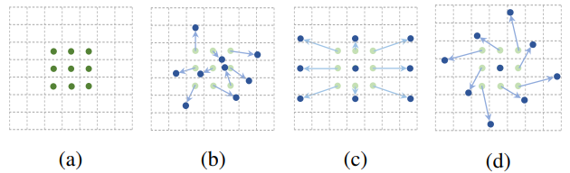
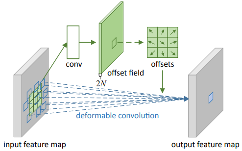
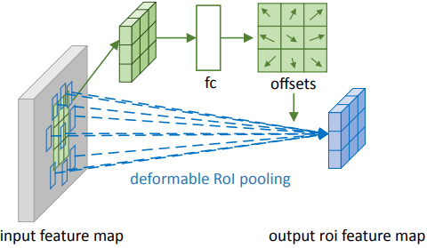
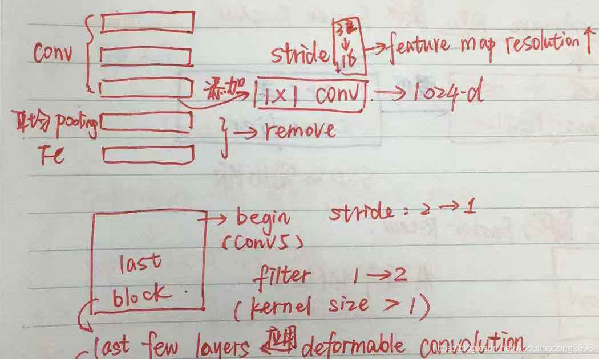
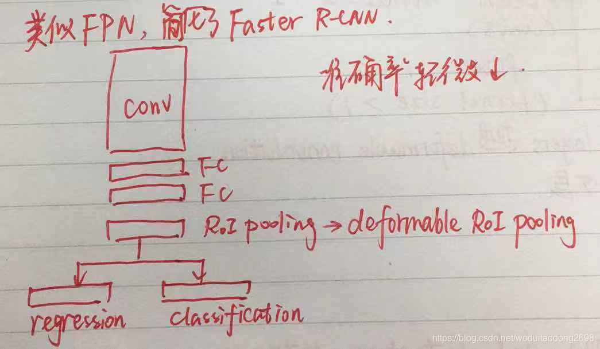

## 目录

[toc]

## 1 DCN

### 1.1 简介

题目：Deformable Convolutional Networks

挑战：适应检测对象尺寸、姿态、视野、部件变形中的几何变化以及模型几何变换。

方向：目前总的来说有两种研究重点

* 进行充分地数据增强，例如 affine transformation
  * 优点：学习到稳健的表征
  * 缺点：花费高，模型复杂
* 使用变换不变性的特征与算法，例如 SIFT，sliding window
  * 缺点：几何变换固定，越多越难，迁移能力不强

于是，本文在 CNN 深度卷积网络的基础之上，将传统卷积和 RoI 池化升级为可变形的，极大提高 CNN **对几何变化的处理能力**。

【参考资料】

* [DCN 解读](https://blog.csdn.net/woduitaodong2698/article/details/88258327)
* [DCN 代码](https://github.com/msracver/Deformable-ConvNets)

### 1.2 模型

本文提出了<u>可变形卷积</u>和<u>可变形 RoI 池化</u>，它们的原理都是在卷积层或 RoI 池化层上，添加了位移变量 (offset)，这个变量从特征图中学习得来。偏移后，相当于卷积核每个方块可伸缩的变化，从而改变了感受野的范围，感受野成了一个多边形。

如上图所示，(a) 是常规卷积，(b) 是可变形卷积，通过额外的卷积层学习 offset 将采样点进行偏移，(c) 尺度变换效果的特例，(d) 旋转变换效果的特例。

这种 deformable 思想有如下特点：

* 变形卷积与常规卷积的输入输出相同，因此可以相互替换
* 变形是基于前层特征做的**局部**、密集、自适应的变化

#### 1.2.1 Deformable Convolution

##### 1.2.1.1 理论解析

给定输入特征图 $\mathbf{x}$ 和 $3\times3$ 间隔 $1$ 的卷积感受野 $\mathcal{R} = \left \{ (-1,-1), (-1,0), \dots, (0,1), (1,1) \right \}$，卷积输出特征图 $\mathbf{y}$. 对卷积的一个检测点，卷积公式为：
$$
\mathbf{y}(\mathbf{p}_0) = \sum_{\mathbf{p}_n\in \mathcal{R}} \mathbf{w}(\mathbf{p}_n)\cdot \mathbf{x}\left(\mathbf{p}_0 + \mathbf{p}_n \right)
$$
可变形卷积就对个检测点，加上一个可学习的偏移量：
$$
\mathbf{y}(\mathbf{p}_0) = \sum_{\mathbf{p}_n\in \mathcal{R}} \mathbf{w}(\mathbf{p}_n)\cdot \mathbf{x}\left(\mathbf{p}_0 + \mathbf{p}_n + \Delta \mathbf{p}_n \right)
$$
由于 $\Delta \mathbf{p}_n$ 可能是小数，偏移后的检测点 $\mathbf{p}_0 + \mathbf{p}_n + \Delta \mathbf{p}_n$ 可能落在像素点之间，因此使用双线性插值计算偏移点的像素值：
$$
\begin{align}
\mathbf{x}(\mathbf{p}) & = \sum_{\mathbf{q}} G\left(\mathbf{q},\mathbf{p}\right) \cdot \mathbf{x}(\mathbf{q}) \\ \\
G\left(\mathbf{q},\mathbf{p}\right) & = g(q_x,p_x) \cdot g(q_y,p_y) \\ \\
g(a,b) &= \max\left( 0, 1-\left | a - b \right | \right)
\end{align}
$$
其中，$p = \mathbf{p}_0 + \mathbf{p}_n + \Delta \mathbf{p}_n$，$q$ 是特征图中所有像素点的枚举。

##### 1.2.1.2 案例解析

一个 $3\times3$ 可变形卷积的过程如下图所示，有一个**额外的卷积层**来学习 offset，<u>原始卷积</u>和<u>额外卷积</u>共享 input feature maps.

设 input feature map 为 $H\times W \times C$，原始卷积核大小为 $3\times3\times C$，可变形卷积流程为：

1. 先用 $18\times4$ 个 $3\times3\times C$ <u>额外传统卷积</u>预测**每个像素点以其为中心的原始卷积** offset，其中

   * $18$ 是因为每个点的 offset 是一个二维向量（确定方向），原始卷积一共有 $3\times3=9$ 个点，$x,y$ 共 $2$ 个方向，故 channel 有 $18$
   * 若卷积核通道有 $4$ 组，则最终的 offset field channel 为 $18 \times 4 = 72$（图中的通道只有一组，故 $2N = 2 \times 3 \times 3 = 18$）

2. 根据得到的 offset，计算原始卷积 9 个点偏移后在 input feature map 上应乘的像素值

   * 由于算出来的 offset 可能是小数，因此对于偏移的检测点，使用双线性差值计算该位置的像素值

     例如：偏移后检测点的位置为 `(2.5, 4.5)`，那么最近的像素点是 `(2,4), (2,5), (3,4), (3,5)`，取四点像素值加权求和，就是检测点的像素值。

3. 偏移原始卷积，卷积得到最终的值

#### 1.2.2 Deformable RoI Pooling

##### 1.2.2.1 理论解析

给定输入特征图 $\mathbf{x}$ 和 $w\times h$ 的 RoI（左上角设为 $\mathbf{p}_0$），RoI pooling 将 RoI 均分为 $k\times k$ 个 bin，然后对每个 bin 进行池化，输出 $k\times k$ 的特征 $\mathbf{y}$。在 RoI pooling 的一个 bin 中，池化公式为
$$
\mathbf{y}(i,j) = \sum_{\mathbf{p}\in \text{bin}(i,j)} \mathbf{x}\left(\mathbf{p}_0+\mathbf{p}\right)/n_{ij}
$$
其中，第 $(i,j)$ 个 bin 的像素个数为 $n_{ij}$，bin 区域是左闭右开、上闭下开的。

类似的，加入偏移量后得到
$$
\mathbf{y}(i,j) = \sum_{\mathbf{p}\in \text{bin}(i,j)} \mathbf{x}\left(\mathbf{p}_0+\mathbf{p} + \Delta \mathbf{p}_{ij}\right)/n_{ij}
$$
其中，偏移量集合为 $\left \{ \Delta \mathbf{p}_{ij} \mid 0 \le i,j < k \right \}$，小数问题同样按照 [1.2.1 Deformable Convolution](#1.2.1-Deformable-Convolution) 的双线性插值法处理。

##### 1.2.2.2 案例解析

一个 $3\times3$ 可变形 RoI 池化如下图所示，有一个**额外的 RoI 池化**来学习 offset，<u>原始 RoI 池化</u>和<u>额外 RoI 池化</u>共享 input feature maps.

设 input feature map 为 $H\times W \times C$，原始池化将 RoI 分为 $3\times3$ 个 bin，可变形 RoI 池化的流程为：

* 先用一个<u>额外传统 RoI 池化</u>得到 $3\times3\times C$ 的 pooled feature maps

* 将其输入到 $18$ 个 $3\times3\times C$ 的 fc 层来学习原始 RoI 每个 bin 的偏移 offset

  * $18$ 是因为每个点的 offset 是一个二维向量（确定方向），原始池化一共有 $3\times3=9$ 个 bin，$x,y$ 共 $2$ 个方向，故为 $18$

  【注1】池化得到 *normalized* offsets $\Delta \hat{\mathbf{p}}_{ij} \in (0,1)$，通过公式 $\Delta\mathbf{p}_{ij} = \gamma \cdot \Delta \hat{\mathbf{p}}_{ij} \circ \left ( w, h \right )$ 转化为 offsets，本文取 $\gamma=0.1$. 

  【注2】对 offsets 进行 normalized 是学习 RoI 大小不变性的必要操作。

* 偏移原始 RoI，池化得到最终的值

### 1.3 应用设计

#### 1.3.1 特征提取网络

本文针对 ResNet 网络进行可变形设计。

* 移除了平均池化层，使用任意初始化的 $1\times1$ 卷积层，将通道维度降为 1024 维
* 将最后一个卷积块的步长 stride 由 32 降为 16，从而增加特征图的分辨率
* 在 conv5 的最开始将步长由 2 变为 1，作为补偿，将该块中所有卷积滤核 (卷积核大小>1) 的 padding 从 1 改为 2

DCN 可变形卷积只应用于最后一个卷积块 (conv5)，在 DCNv2 中，可变形卷积应用于 conv3，vonv4，conv5 三个卷积块。

#### 1.3.2 分割检测网络

从特征提取神经网络得到的输出特征图上建立了一个任务专用网络，这个分割检测网络的可变形设计如下。

* 网络的最后面添加 $1\times1$ 的卷积层，会生成 C+1 个（C个目标类别+1个背景）代表每个像素的分类分数的映射
* 对 faster RCNN 的检测网络进行简化，如下图

### 1.4 实验分析

暂略。

## 2 DCNv2

### 2.1 简介

题目：Deformable ConvNets v2: More Deformable, Better Results

参考资料：

* [目标检测论文阅读：DCN v2](https://zhuanlan.zhihu.com/p/53127011)