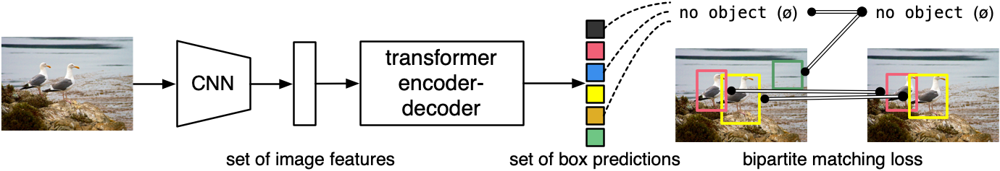
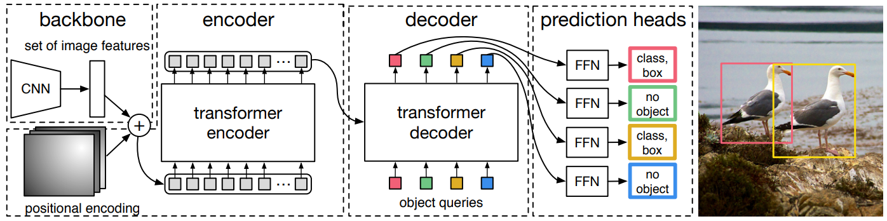

## 目录

[toc]

## 1 DETR

### 1.1 简介

题目：End-to-End Object Detection with Transformers

挑战：Transformer 端到端的设计应用于 CV 领域

* 目标检测拥有复杂的 pipline（[先验知识限制](YOLO.md#2-3-5-Direction Location Prediction)）

* 端到端设计尚未在 CV 领域有成功的实践

如上图所示，DETR 基于 Transformer 的 end-to-end 架构直接预测目标检测结果，并用双向匹配损失训练模型，既简化了目标检测的各种启发式组件，又取得了显著效果。

【参考资料】

* [DETR 详解](https://zhuanlan.zhihu.com/p/340149804)（备份：[DETR 详解](src/DETR详细解读.mhtml)）
* [DETR 代码](https://github.com/facebookresearch/detr)

### 1.2 模型

## 2 Deformable-DETR

【参考资料】

* [Deformable-DETR 详解](https://zhuanlan.zhihu.com/p/342261872)（备份：[Deformable-DETR 详解](src/Deformable-DETR详细解读.mhtml)）
* [Deformable-DETR 代码](https://github.com/fundamentalvision/Deformable-DETR)

