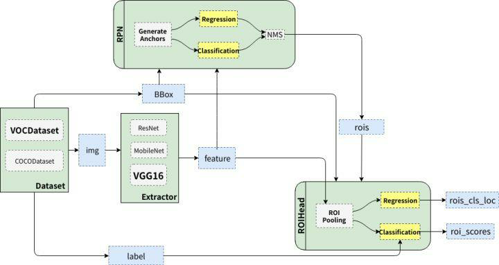
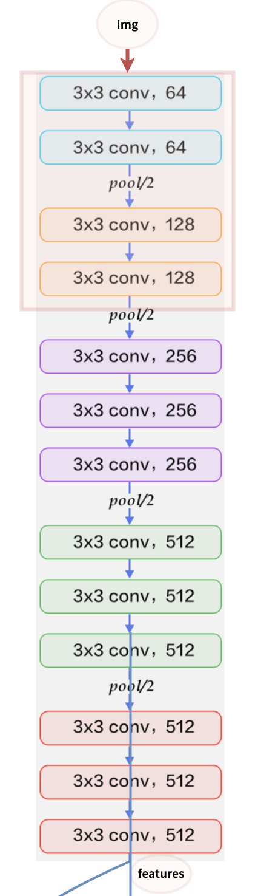
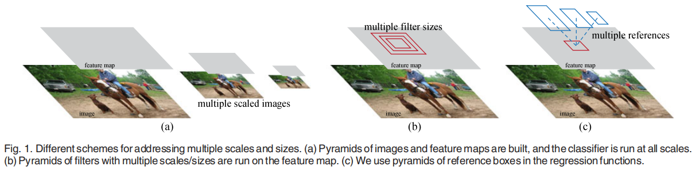
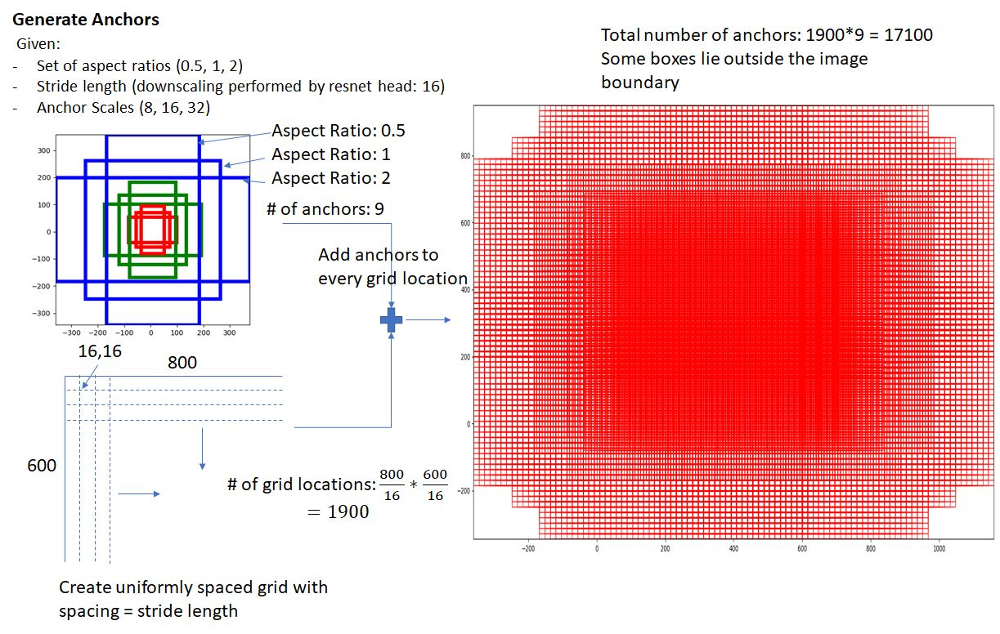
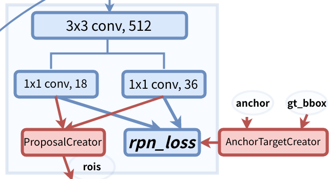
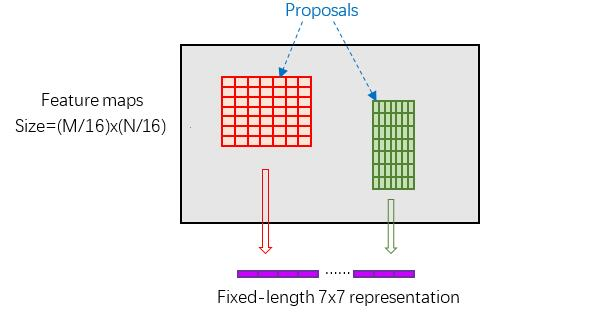
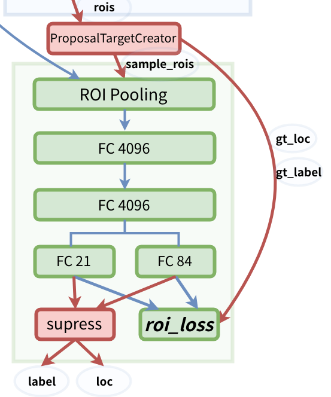
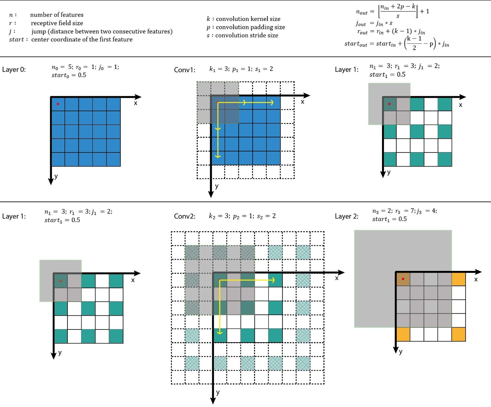
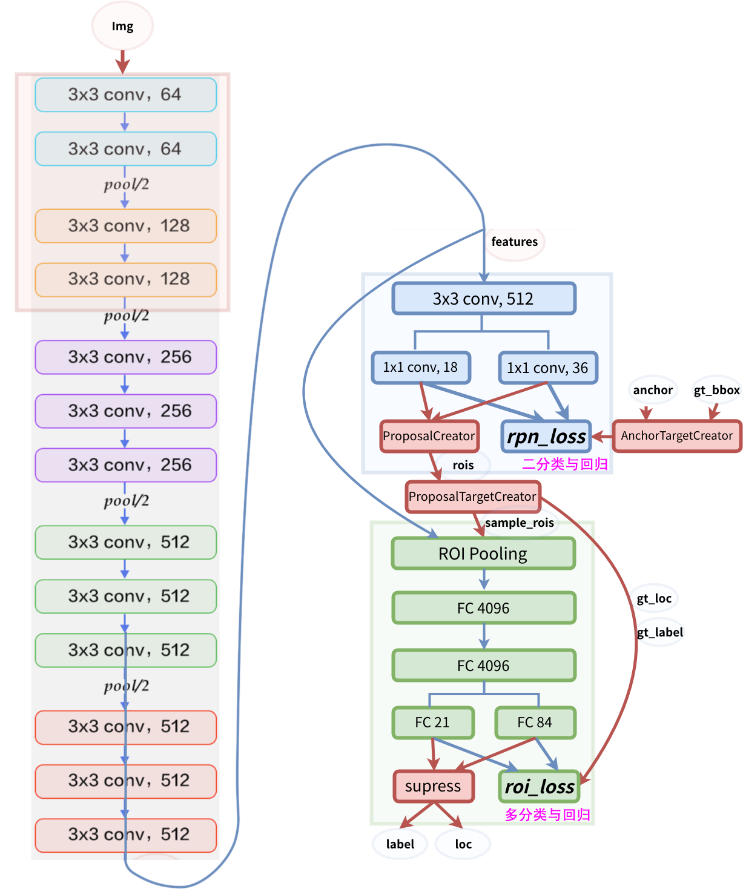
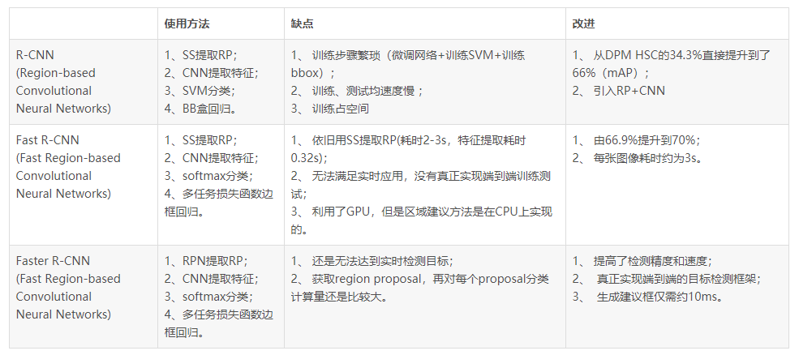

## 目录

[toc]

## 1 Faster R-CNN

### 1.1 介绍

题目：**Faster R-CNN**: Towards Real-Time Object Detection with Region Proposal Networks

论点：本文将特征提取、区域提议、边框回归和分类等目标检测技术整合到一个网络中，极大提升综合性能。

### 1.2 引入

经过 R-CNN 和 Fast R-CNN 的沉淀，传统区域提议方法的缺陷逐渐暴露，在整个检测网络中占比时间很大，并且难以迁移到 GPU 上。

为此，本文创新性的提出了区域提议网络（Region Proposal Networks, RPNs），通过神经网络的方法实现区域检测，成功将目标检测的一系列技术**整合到一个网络**中，解决了上述问题。

### 1.3 模型结构

Faster R-CNN 的整体架构如下，模型分为三大部分：

* 特征提取：图片（`img`）经过预训练的深度网络（`Extractor`），提取得到图片的特征（`feature`）
* 区域提议：利用提取的特征（`feature`），经过 RPN 网络，找出一定数量的 `rois`（region of interests）
* 分类回归：将 `rois` 和图像特征 `features`，输入到 `RoIHead` 网络，对 `rois` 进行分类，并对 `rois` 的位置进行微调

其详细的结构图如下：

#### 1.3.1 数据预处理

对于输入的图片数据，都需要进行缩放处理，最终得到输入特征 `img` 的格式为：

* `images` - 图像矩阵，维度为 $(C,H,W)$，其中 $C=3$，缩放后的的 scaled image 大小 $H \leq 600 \space \text{and} \space W \leq 1000 $
* `gt_bboxes` - ground truth bounding boxes，维度为 $(K,4)$，表示 $K$ 个 gt_bboxes，每个 box 含义为 $(Y_{\min},X_{\min},Y_{\max},X_{\max})$
* `labels` - 类别标签，维度为 $(K,)$，表示 ground truth bounding boxes 的类别，对于 VOC 数据集取值范围 $[0,19]$
* `scale` - 缩放倍数，标量，表示原图从 $(H',W')$ 缩放到 $(H,W)$ 的乘数

#### 1.3.2 特征提取网络

特征提取网络 Extractor 使用预训练好的模型来提取图片的特征，论文中使用的是 ZF（256-d） 或 VGG16（512d） 模型，这里以 VGG16 为例，其网络结构如下，共有 13 个 conv 层（含 13 个 relu 层），4 个 pooling 层。

这里有一个非常重要的信息，

* 所有的 conv 层都是：`kernel_size=3`，`pad=1`，`stride=1`
  * `pad=1` 填充一圈使得原图大小变为 `(H+2,W+2)`，然后 `kernel_size=3` 和 `stride=1` 卷积使得输出大小为 `(H,W)`，保证图像维度不变
* 所有的 pooling 层都是：`kernel_size=2`，`pad=0`，`stride=2`
  * `pad=0` 不填充，`kernel_size=2` 和 `stride=2` 池化使得输出大小变为 `(H/2,W/2)`，得到长宽均降到 `1/2` 的特征
  * VGG16 使用 4 个 pooling 层，就有 `feat_stride=16`，故提取到的图像特征大小为 `(H/16,W/16)`，
  * 这样 features 中的每个点都可以和 image 中的一个 `16x16` 区域**对应起来**

#### 1.3.3 区域提议网络

区域提议网络（Region Proposal Networks, RPNs）是 Faster R-CNN 最突出的贡献，它本质是一个**二分类与回归任务**。

##### 1.3.3.1 传统方法

传统的区域提议方法主要是 selective search，如下图所列。

**(a)** 图像金字塔（Pyramids of Images）

建立不同大小的图像并提取到不同大小的特征，然后在其上进行分类。

**(b)** 特征金字塔（Pyramids of Filters）

相同大小的图像建立不同大小的特征，然后在其上进行分类。

**(c)** 锚点金字塔 (Pyramids of Anchors)

而本文提出的 RPN 网络 **(c)** 避免了这些繁琐的操作，将候选区域提取的时间开销几乎降为 0（2s -> 0.01s）。

##### 1.3.3.2 Anchors

Anchor 是大小和尺寸固定的候选框。对于 feature map 上的每一个点，可以逆映射到**原图中对应区域（即感受野，见 1.3.5.1）的中心点**，设置若干个 anchor.

论文中用到的 anchor 有三种尺寸和三种比例，如上图所示，三种尺寸分别是小（蓝 128）中（红 256）大（绿 512），三个比例分别是 `1:1`，`1:2`，`2:1`，3×3 的组合总共有 9 种 anchor，最终生成了 `(H/16)×(W/16)×9` 个 anchor。

如此密集的 anchor **能覆盖所有可能的目标**，哪怕是蒙也能够把绝大多数的 ground truth bounding boxes 蒙中。

##### 1.3.3.3 RPN 训练与预测

RPN 网络结构如下图所示。对输出的 features 再进行一次卷积（3x3 conv, 512），然后利用两个 1x1 的卷积分别进行二分类（1x1 conv 18）和位置回归（1x1 conv, 36），得到 `rpn_scores`（<u>表示是否为正样本</u>，2 分类 x 9 anchor = 18）和 `rpn_locs`（**表示 anchor 的修正量**，4 坐标 x 9 anchor = 36）。

得到的 `rpn_socres` 和 `rpn_locs` 有两种去路：

> 训练阶段，和 AnchorTargetCreator 生成的 positive anchor 与 gt_bbox 的 ground true `loc`, `label`（**表示 anchor 应有修正的量**）进行比较计算损失

1. AnchorTargetCreator 生成 ground true `loc`, `label` 的原理（bounding box regression 原理）

   * 给定 anchors 和 gt_bboxes 的 `x,y,w,h` 表示（中心坐标和宽、高）

   * 剔除超出图像边界的 anchors

   * 选择制作 anchor 样本

     * 对于每一个 gt_bbox，选择和它重叠度（IoU）最高的一个 anchor 作为正样本
     * 对于剩下的 anchor，从中选择和任意一个 gt_bbox 重叠度（IOU）超过 0.7 的 anchor，作为正样本，正样本的数目不超过 128 个
     * 重叠度（IOU）在 0.3 - 0.7 的 anchor 忽略不考虑
     * 随机选择和 gt_bbox 重叠度小于 0.3 的 anchor 作为负样本，保证负样本和正样本的总数为 256，多除少补

   * 计算 positive anchor 样本与其<u>对应的 gt_bbox</u> 的 loc 值

     * `loc = (tx, ty, tw, th)` 表示 positive anchor 修正为 gt_bbox 应进行的<u>平移量</u>和<u>变换量</u>

     * 正向：已知 `loc`，修正 anchor 来预测 gt_bbox（预测阶段使用）
       $$
       \left\{\begin{matrix}
       \begin{align*}
        \hat{g}_y & = p_h t_y + p_y \\
        \hat{g}_x & = p_w t_x + p_x \\
        \hat{g}_h & = p_h \exp(t_h) \\
        \hat{g}_w & = p_w \exp(t_w)
       \end{align*}
       \end{matrix}\right.
       $$

     * 反向：已知 anchor 和 gt_bbox，得到 `loc`（训练阶段使用）
       $$
       \left\{\begin{matrix}
       \begin{align*}
       t_x & = (x-x_a)/w_a \\
       t_y & = (y-y_a)/w_y \\
       t_w & = \log(w/w_a) \\
       t_h & = \log(h/h_a)
       \end{align*}
       \end{matrix}\right.
       $$

2. 计算损失 `rpn_loss`

     * 总体损失函数 $L$
       $$
       L(\{p_i\},\{t_i\}) = \frac{1}{N_{cls}} \sum_i L_{cls}(p_i,p_i^*) - \lambda \frac{1}{N_{reg}} \sum_i p_i^* L_{reg}(t_i,t_i^*)
       $$
       其中，$p$ 表示 anchor 为正的概率（预测的 `score`），$p$ 为 anchor 实际正时取 $1$ 否则取 $0$；$t^\star$ 为预测的 `loc`，$t^\star$ 为实际的 `loc`。

     * **分类**损失函数 $L_{cls}$
       $$
       L_{cls}(p_i,p_i^*) = - \left [ \log(p_i^* p_i)+\log((1-p_i^*)(1-p_i)) \right ]
       $$

     * **回归**损失函数 $L_{reg}$
       $$
       L_{reg}(t_i,t_i^*) = \text{smooth}_{L_1}(t_i - t_i^*)
       $$
     
       $$
       \text{smooth}_{L_1}(x) = \left\{\begin{matrix}
       0.5 x^2, & |x|<1, \\
       |x|-0.5, & \text{otherwise}
       \end{matrix}\right.
       $$

     * 正则参数 $\lambda$ 用于平衡差距较大的 $N_{cls}$ 和 $N_{reg}$

> 预测阶段，传入 ProposalCreator 生成 Region of Interests (RoIs)

* ProposalCreator 生成 RoI 的原理
  * 利用回归的位置参数 `rpn_locs`，修正 anchor 的位置，得到初步的 RoIs
  * 裁剪超框的 RoIs
  * 过滤获取长和宽符合条件的 RoIs
  * 选取 `rpn_score` 前 `n_pre_nms` 大的 RoIs
  * 进行非极大值抑制（NMS）过滤一遍 RoIs
  * 选出概率最大的前 `n_post_nms` 个 RoIs

【注1】为了提高处理速度，`n_pre_nms` 和 `n_post_nums` 可适当减小。

【注2】这部分的操作不需要进行反向传播，因此可以利用 numpy/tensor 实现。

【注3】RoIs 的维度为 `(n_post_nums,4)`，坐标位于 scaled image 尺度上

#### 1.3.4 分类网络

经过 RPN 网络，得到若干个候选框 RoIs，分类网络（RoI Head）的作用在此框上继续进行**分类（这次是多分类）和位置参数（这次是多类别**）回归。

##### 1.3.4.1 RoI Pooling 原理

* 首先，由于 RoIs 是 scaled_image 尺度的，并且大小不一，所以
  * 使用 `spatial_scale = 1/feat_stride` 参数将其映射到 $(H/16) \times (W/16)$ 大小的 feature map 尺度上
* 再将每个 RoIs 对应的 feature map 区域水平分为 $pooled_w \times pooled_h$ 的网格
* 对网格的**每一份**都进行 max pooling 处理，得到固定大小的 feature

##### 1.3.4.2 RoI Head 训练与预测

RoI Head 的网络结构如下，首先利用 ProposalTargetCreator 挑选出 128 个 sample_rois，然后使用了 RoIPooling 将这些不同尺寸的区域全部 pooling 到同一个尺度（7×7）上，然后通过的 **VGG16 的**两个全连接层，最后再分别接两个用于输出的全连接层，分别是：

- `FC 21` 用来分类，预测 RoIs 属于哪个类别（20 个类 + 背景），得到 `roi_scores`
- `FC 84` 用来回归位置（21 个类，每个类都有 4 个位置参数），得到 `roi_cls_locs`

得到的 `roi_scores` 和 `roi_cls_locs` 也有两条去路，具体细节可与 RPN 类比：

> 训练阶段，和 ProposalTargetCreator 筛选的 RoI 与 gt_bbox 的 `gt_loc`, `gt_label`（**表示 anchor 应有修正的量**）进行比较计算损失

> 测试阶段，传入 supress 选择概率最大的类别 `roi_score` 及其 `roi_cls_loc`，得到 `label` 和 `loc`（用于修正 RoI 得到 bbox） 

【注1】在 RPN 的时候，已经对 anchor 做了一遍 NMS，在 RoI Head 预测的时候，还要再做一遍。

【注2】在 RPN 的时候，已经对 anchor 的位置做了位置回归，在 RoI Head 预测还要对 RoI 再做一遍。

【注3】在 RPN 阶段分类是二分类，而 RoI Head 阶段是 21 分类。

### 1.4 实现细节

#### 1.4.1 感受野

定义：在卷积神经网络CNN中，决定某一层**输出**结果中一个元素所对应的**输入**层的区域大小，被称作感受野（receptive field）。

感受野大小计算：

#### 1.4.2 模型训练方式

我所参阅的代码中，模型首先全部输出一遍，然后计算 RPN 位置损失 `rpn_loc_loss` 和分类损失 `rpn_cls_loss`，计算 RoI 位置损失 `roi_loc_loss` 和分类损失 `roi_cls_loss`，然后将四者相加，得到**总损失进行反向传播**。

#### 1.4.3 梯度传播流向

模型的总体结构如下，其中<u>蓝色箭头</u>的线代表着计算图，**梯度反向传播**会经过，而<u>红色部分</u>的线**不需要进行反向传播**。

### 1.5 RCNN 家族总结

