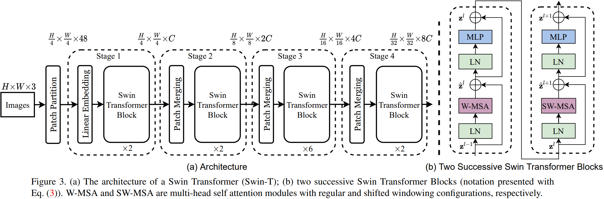
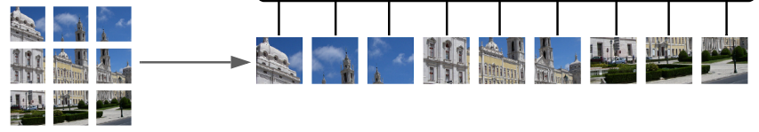
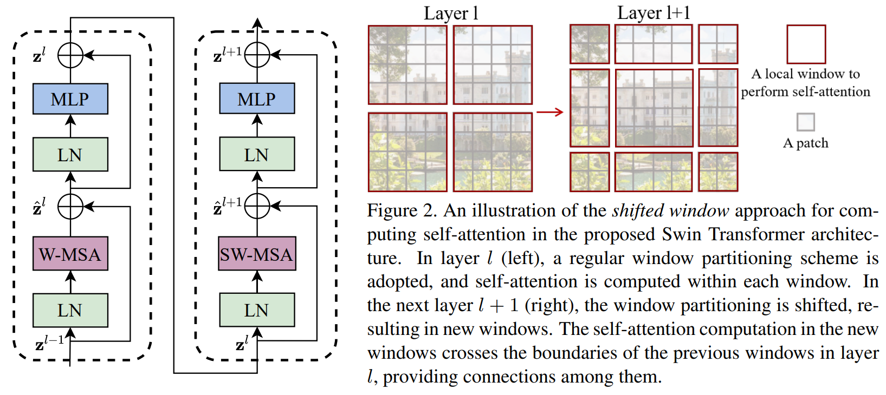
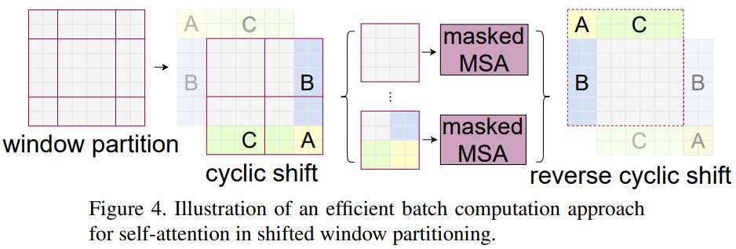
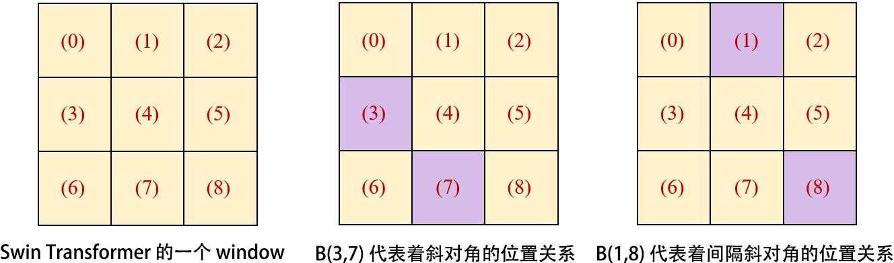
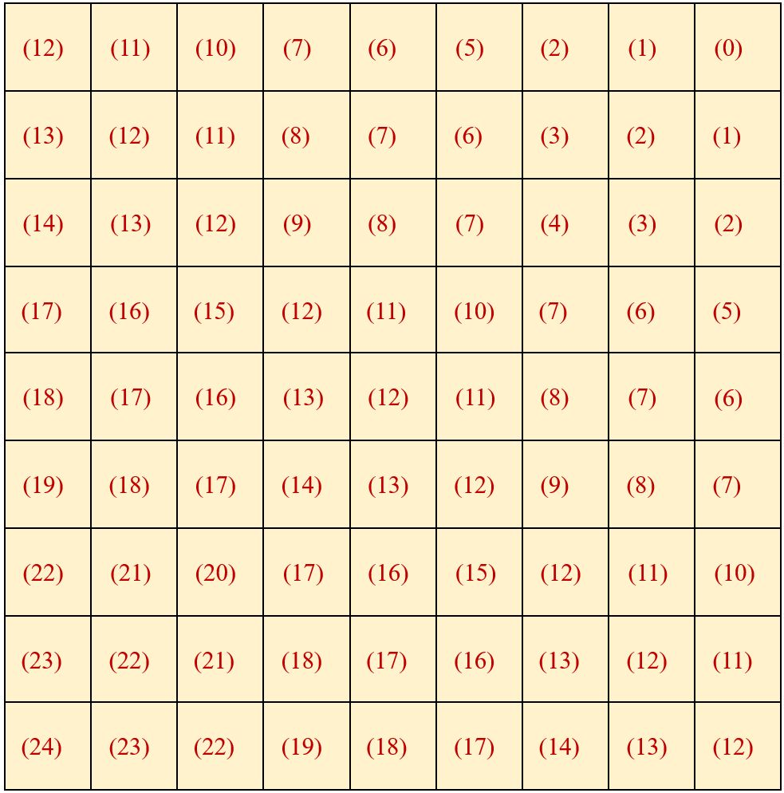

## 目录

[toc]

## 1 SwinTransformer

### 1.1 简介 

题目：Swin Transformer: Hierarchical Vision Transformer using Shifted Windows

挑战：将 Transformer 迁移到视觉任务有两大困难

* 两个领域涉及的 scale 不同，NLP 任务的 entity 以 token 为单位，scale 标准固定，而 CV 中 visual entities 的 scale 变化范围非常大
* CV 比起 NLP 有更大的分辨率，计算复杂度是图像尺度的平方，例如语义分割，需要像素级的密集预测

为了解决这两个问题，本文引入 CNN 中常用的层次化构建方式，提出的一种通用的视觉架构。

【参考资料】

* [SwinTransformer 解读](https://zhuanlan.zhihu.com/p/404001918)

* [SwinTransformer 代码](https://github.com/microsoft/Swin-Transformer)

### 1.2 模型

Swin Transformer 的整体结构如下图所示，其中的数据是 tiny 版本的。

模型的结构解析和运算流程下面逐步讲解。

#### 1.2.1 Patch Partiton

这是图片预处理步骤。和 [ViT](./ViT.md) 模型一样，将 $H \times W \times 3$ 的 RGB 图片切分为图片块 (image patches)，**相当于 NLP 中的 tokens**，这里称之为 patch tokens，它们将传入后面的 Staegs 进行处理。

在上面的 tiny 模型中，输入图片为 $H\times W\times 3$，分割的 patch size 为 $4\times4\times3 = 48$，得到 $\frac{H}{4}\times\frac{W}{4}\times 48$ 的输入。

#### 1.2.2 Stage 1

##### 1.2.2.1 Linear Embedding

在 Stage 1 阶段，先对 patch tokens 进行线性变换，将其投影到维度 $C$.

在上面的 tiny 模型中，$\frac{H}{4}\times\frac{W}{4}\times 48$ 的 patch tokens 投影为 $\frac{H}{4}\times\frac{W}{4}\times C$ 的 patch embeddings.

##### 1.2.2.2 Swin Transformer Block

将 patch embeddings 输入 Two Successive Swin Transformer Block，其结构如下图所示。

可以看到 Swin Transformer Block 和 ViT Block 的区别就在于将 ViT 的多头注意力机制 **MSA 替换为了 Window-based MSA 和 Shifted Window-based MSA**.

###### Window-base MSA

ViT 采用 global MSA，即计算每个 token 和所有其他 token 的 attention map，window-based MSA 则做了局部化，它将 patches 划分为一个个 window 并只计算 window 内的 attention map，如上图 $\text{Layer l}$ 所示。

设 $h\times w$ 的图片，其每个 window 有 $M\times M$ 个 patches，则 ViT 的 global MSA 和 window-based MSA 的计算复杂度如下：
$$
\begin{align}
\Omega\left(MSA\right) & = 4hwC^2 + 2(hw)^2C \\
\Omega\left(W-MSA\right) & = 4hwC^2 + 2M^2C
\end{align}
$$
由于 window 中的 patches 个数 $M$ 固定，使得复杂度变为图像大小 $hw$ 的线性阶。

###### Shifted Window-based MSA

Window-based MSA 虽然大幅节约了计算量，但是牺牲了 windows 之间关系的建模，不重合的 window 之间缺乏信息交流会影响模型的表征能力。

Shifted Window-based MSA 用于建模 cross-window 的信息，它将 window 的位置进行**移动** $\left ( \lfloor M/2 \rfloor, \lfloor M/2 \rfloor \right )$ 个 patch 单位，得到 $3\times3$ 个不重合的 windows，这样再在 windows 内做 attetion，就引入了 windows 之间的关系，如上图 $\text{Layer l+1}$ 所示。

综上所述，Two Successive Swin Transformer Block 的计算公式如下：
$$
\begin{align}
&{{\hat{\bf{z}}}^{l}} = \text{W-MSA}\left( {\text{LN}\left( {{{\bf{z}}^{l - 1}}} \right)} \right) + {\bf{z}}^{l - 1},\nonumber\\
&{{\bf{z}}^l} = \text{MLP}\left( {\text{LN}\left( {{{\hat{\bf{z}}}^{l}}} \right)} \right) + {{\hat{\bf{z}}}^{l}},\nonumber\\
&{{\hat{\bf{z}}}^{l+1}} = \text{SW-MSA}\left( {\text{LN}\left( {{{\bf{z}}^{l}}} \right)} \right) + {\bf{z}}^{l}, \nonumber\\
&{{\bf{z}}^{l+1}} = \text{MLP}\left( {\text{LN}\left( {{{\hat{\bf{z}}}^{l+1}}} \right)} \right) + {{\hat{\bf{z}}}^{l+1}}, \label{eq.swin}
\end{align}
$$
其中 ${{\hat{\bf{z}}}^{l}}$ 表示 (S)W-MSA 的输出特征，${{\bf{z}}^l}$ 表示 MLP 的输出特征。

###### Cyclic Shift

* 引入 Shifted Window 可能会在边缘处出现问题：window 数量变化、window 大小不一

  这里作者提出了一种更加高效的 batch computation 方法，通过上图的 **cycle shift 操作**，对边缘进行<u>循环填充</u>，如上图所示。

* 引入循环填充可能会出现新的问题：一个 window 可能包含多个 sub-windows 的 patches，且它们在特征图中不相邻

  采用 masked 机制将 self-attention 的计算限制在每个 sub-window 内。

#### 1.2.3 Stage 2/3/4

##### 1.2.3.1 Patch Merging

Stage 1 不改变输入的维度，维度为 $\frac{H}{4}\times\frac{W}{4}\times C$ 的特征输入到 Stage 2 中。

Stage 2 先对其进行 patch megring 操作：

* 把相邻的 $2\times2$ 个 patches 合并，得到维度为 $\frac{H}{8}\times\frac{W}{8}\times 4C$ 的特征
* 然后再做一次线性变换，得到维度为 $\frac{H}{8}\times\frac{W}{8}\times 2C$ 的特征

这样就减少 tokens 的数量为原来的 $1/4$，增加特征维度为原来的 $1/2$.

##### 1.2.3.2 重复 Block 操作

将 $\frac{H}{8}\times\frac{W}{8}\times 2C$ 的特征送入同样的 Two Successive Swin Transformer Block，进行特征变换，进一步整合信息。

上述 Patch Merging 和 feature transformation 操作再重复两次，得到 Stage 3 和 Stage 4 阶段，并且其中的特征维度分别输出为 $\frac{H}{16}\times\frac{W}{16}\times 4C$ 和 $\frac{H}{32}\times\frac{W}{32}\times 8C$，由此产生**层次化的表征**，就像 VGG 和 ResNet 一样。

#### 1.2.4 Relative position bias

本文采用相对位置编码方式，其详细解析如下面这个例子。

于是，于是，满足 B(3,7) = B(4,8) = B(1,5) = B(0,4) 、B(0,6) = B(1,7) = B(2,8) 等关系的位置编码矩阵 $B$ 如下图所示。

本文的相对位置信息是加在 attention 矩阵上的。考虑 attention 矩阵，它是个四维张量，维度为：
$$
(\text{num\_windows},\; \text{num\_heads},\; \text{windows\_size*windows\_size},\;\text{windows\_size*windows\_size})
$$
设 $M = \text{windows\_size}$，window 内的 attention 三件套 $Q,K,V \in \mathbb{R}^{M^2\times d}$，相应的相对位置编码矩阵为 $B \in \mathbb{R}^{M^2\times M^2}$.

于是，相对位置信息设计为加在 attention 矩阵上的偏倚：
$$
\text{Attention}\left(Q,K,V\right) = \text{SoftMax}\left(QK^T/\sqrt{d}+B\right)
$$
在代码实现中，由于位置编码范围在 $[-M+1,M-1]$，于是使用压缩矩阵 $\hat{B} \in \mathbb{R}^{(2M-1)\times(2M-1)}$ 作为码表，生成 $B$.

### 1.3 应用设计

Swin Transformer 分为 Swin-T，Swin-S，Swin-B，Swin-L 这四种结构。使用的 window 的大小统一为 $M=7$，每个 head 的embedding dimension 都是 32，每个 stage 的层数如下：

* Swin-T：$C=96$，layer number：$\left\{ {2,2,6,2} \right\}$
* Swin-S：$C=96$，layer number：$\left\{ {2,2,18,2} \right\}$
* Swin-B：$C=128$，layer number：$\left\{ {2,2,18,2} \right\}$
* Swin-L：$C=192$，layer number：$\left\{ {2,2,18,2} \right\}$

### 1.4 实验分析

暂略。

### 1.5 IDEA

* 图片 patch 序列 $\leftrightarrow$ token
  * 可变形的窗口，根据学习到的内容自动调整 token
  * 自底向上的 object 聚类，即像素 $\rightarrow$ 小 patch $\rightarrow$ 大 patch $\rightarrow$ object

* 可变形注意力
  * Deformable-DETR 的可变形注意力也是要求部分序列，然后做出偏移
  * SwinTransformer 的注意力正是窗口化的，为自动变形**提供了可能性**