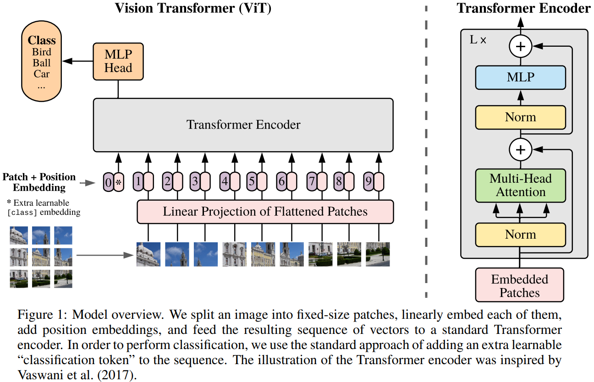

## 目录

[toc]

## 1 ViT

### 1.1 简介

题目：AN IMAGE IS WORTH 16X16 WORDS: TRANSFORMERS FOR IMAGE RECOGNITION AT SCALE

本文以尽可能少修改的原则，将原版的 Transformer 开箱即用地迁移到分类任务上面。

### 1.2 模型

【参考资料】

* [ViT 详解](https://zhuanlan.zhihu.com/p/342261872)（备份：[ViT 详解](src/ViT.mhtml)）
* [ViT 代码](https://github.com/google-research/vision_transformer)