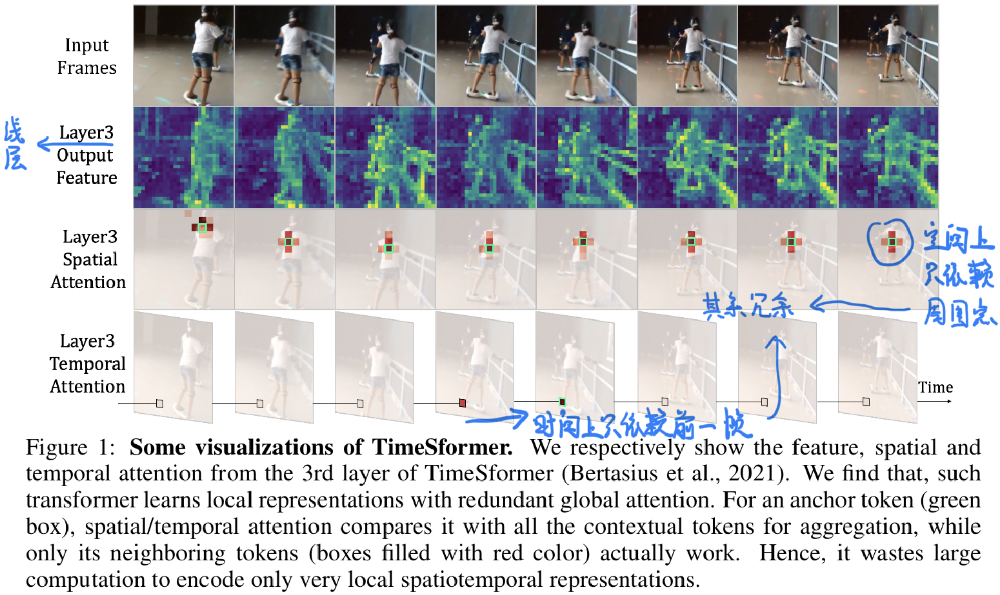
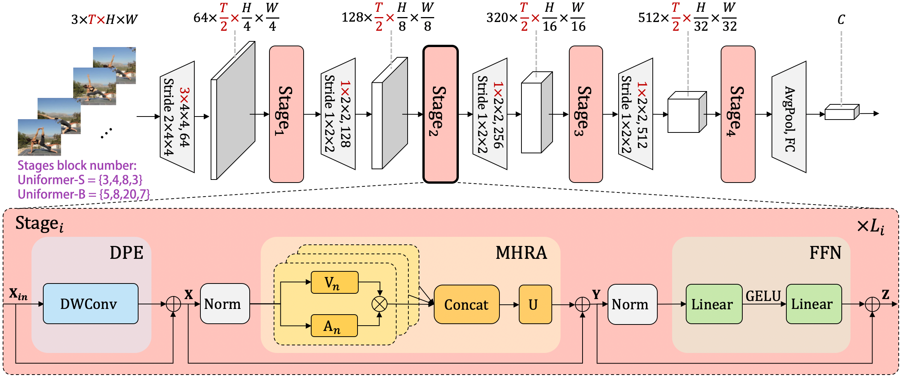

## 目录

[toc]

## 1 UniFormer

### 1.1 简介

题目：

* UniFormer: Unified Transformer for Efficient Spatiotemporal Representation Learning (CVPR)

* UniFormer: Unifying Convolution and Self-attention for Visual Recognition (IEEE)

挑战：从高维 videos 中学习丰富且多尺度的时空语义。

方向：目前业界的研究重点如下

* 3D CNN
  * 优点：高效聚集局部特征，有效的降低局部冗余（local redundancy）
  * 缺点：有限的感受野使其无法捕获全局依赖关系（global dependency）
* Vision Transformer
  * 优点：高效捕获长距离依赖（long-rang denpendency）
  * 缺点：消除 local redundancy 的能力有限（盲相似性比对会导致过高的冗余）

> 例：Vision Transformer 浅层网络捕捉局部时空特征有非常高的冗余
>
>  

于是，本文提出 Unified Transformer (UniFormer)，**将<u>卷积与自注意力</u>的优点通过 transformer 进行无缝衔接**，综合上述两种优点。

【参考资料】

* [UniFormer 解读](https://blog.csdn.net/amusi1994/article/details/122694745)

* [UniFormer 代码](https://github.com/Sense-X/UniFormer)

### 1.2 模型

UniFormer 模型结构图如下：

注：其中 $T$ 表示帧数，图中$\bf \color{red}{标红的维度}$仅作用于视频输入，其他维度对于图像和视频输入相同。

UniFormer 包含三个模块，设输入 $\mathbf{X}_{in} \in \mathbb{R}^{C\times T \times H \times W}$，于是整体流程为：

* Dynamic Poistion Embedding (DPE)
  $$
  \mathbf{X} = \text{DPE}\left(\mathbf{X}_{in}\right) + \mathbf{X}_{in}
  $$
  将 3D 位置信息动态集成进所有 tokens，它适用于任意输入分辨率，可充分利用 token 时空顺序进行建模。

* Multi-Head Relation Aggregator (MHRA)
  $$
  \mathbf{Y} = \text{MHRA}\left(\text{Norm}\left(\mathbf{X}\right)\right) + \mathbf{X}
  $$
  通过探索每个 token 的 contextual tokens 来进行增强特征。

* Feed-Forward Network (FFN)
  $$
  \mathbf{Z} = \text{FFN}\left(\text{Norm}\left(\mathbf{Y}\right)\right) + \mathbf{Y}
  $$
  对每个 token 进行进一步的增强。

#### 1.2.1 DPE

> **传统**的位置编码：
>
> * absolute position embedding
>
>   在 finetune 阶段使用更大的输入时，需要对位置编码进行插值。
>
> * relative position embedding
>
>   不仅改变了自注意力，而且由于缺少绝对位置信息导致效果下降。

DPE (Dynamic Poistion Embedding) 的卷积编码方式借鉴了 CPE (Chu et al., 2021) 和 [CPVT (Chu et al., 2021)](https://arxiv.org/abs/2102.10882)，公式如下
$$
\text{DPE}\left(\mathbf{X}_{in}\right) = \text{DWConv}\left(\mathbf{X}_{in}\right)
$$
其中，

* 输入 $\mathbf{X}_{in} \in \mathbb{R}^{C\times T \times H \times W}$
* $\text{DWConv}$ 是 3D depthwise convolution[^1]且进行 zero padding。

DPE 模块就是一个简单的 DW 卷积，不改变输入 $\mathbf{X}_{in}$ 的维度，故输出 $\mathbf{X} = \text{DPE}\left(\mathbf{X}_{in}\right) \in \mathbb{R}^{C\times T \times H \times W}$。

【注1】DW 的优点是克服排列不变性、能够处理任意维度的输入、计算极为轻量化。

【注2】zero padding 隐含地编码了绝对位置信息，有助于模型对绝对位置的感知。

[^1]: 3D depthwise convolution 的概念 - [Xception 深度可分离卷积](../Base/Base.md#2-3-2-深度可分离卷积)

#### 1.2.2 MHRA

MHRA (Multi-Head Relation Aggregator) 是一种**广义相关性聚合**，其基本结构类似多头注意力机制：
$$
\begin{align}
R_n\left(\mathbf{X}\right) & = A_n V_n \left(\mathbf{X}\right) \\
\text{MHRA}\left(\mathbf{X}\right) & = \text{Concat}\left( R_1\left(\mathbf{X}\right); R_2\left(\mathbf{X}\right); \cdots; R_N\left(\mathbf{X}\right) \right) \mathbf{U}
\end{align}
$$
其中，

* $\mathbf{X} \in \mathbb{R}^{C\times T \times H \times W}$，先将其维度调整为 $\mathbf{X} \in \mathbb{R}^{L\times C},\; L = T \times H \times W$
* $V_n(\cdot)$  是线性变换函数 $X\in\mathbb{R}^{L\times C} \longmapsto  \mathbb{R}^{L\times\frac{C}{N}}$
* $A_n \in \mathbb{R}^{L\times L}$ 是可学习的参数
* $R_n(\cdot)$ 就是 realation aggregator (RA) 的第 $n$ 个 head
* $\mathbf{U} \in \mathbb{R}^{C\times C}$ 是可学习的参数

对于每一个 head $R_n(\cdot)$，首先将输入 $\mathbf{X}$ 调整为 token 序列（即切块），然后通过线性变换 $V_n(\cdot)$ 获取一个 head 的内容，将 origin token 编码为 contextual token，再通过 token affinity 矩阵 $A_n$ 对 context token 的上下文信息进行聚合。最后将 $N$ 个 head 的输出 $\text{Concat}$ 和线性变换，得到 $\mathbf{Y} = \text{MHRA}\left(\mathbf{X}\right) \in \mathbb{R}^{L\times C}$.

上述过程的**关键是 $A_n$ 的学习方式**，分为 local 和 global 两种，**从而将卷积与自注意力统一为 token 相关性学习 (affinity learning)**，获得不同时空粒度的特征。

##### 1.2.2.1 Local MHRA

Local MHRA 用于学习小区域中的局部时空上下文信息，类似卷积操作。给定 anchor token $\mathbf{X}_i$，让 RA 模块在一块小范围 $\Omega^{t\times h \times w}_i$ 内学习局部时空相关性 (local spatiotemporal affinity)：
$$
A^{\text{local}}_n\left(\mathbf{X}_i,\mathbf{X}_j\right) = 
\left \{ \begin{align}
 a^{i-j}_n, & \;\;\;\; \mathcal{where} \; j \in \Omega^{t\times h \times w}_i \\
 0, & \;\;\;\; \mathcal{where} \; j \notin \Omega^{t\times h \times w}_i
\end{align} \right .
$$
其中，

* 一个 token $\mathbf{X}_k, \; k\in [0, L-1]$ 的位置定义为
  $$
  \begin{align}
  t_k & = \left \lfloor \frac{k}{H\times W} \right \rfloor \\
  h_k & = \left \lfloor \frac{k-t_k\times H\times W}{W} \right \rfloor \\
  w_k & = \frac{k-t_k\times H\times W}{W}  \mod W \\
  \end{align}
  $$

* $\Omega^{t\times h \times w}_i$ 是近邻区域，$\mathbf{X}_i$ 的近邻定义为
  $$
  \left | t_i - t_j \right | \leq  \frac{t}{2} , \;\; \left | h_i - h_j \right | \leq  \frac{h}{2} ,\;\;  \left | w_i - w_j \right | \leq  \frac{w}{2} \\
  $$

* $a_n^{i-j} \in \mathbb{R}^{t\times h \times w}$，下标 $i-j$ 对应的距离决定相应权重，有
  $$
  a_n^{i-j} = a_n \left [  t_i - t_j,  h_i - h_j, w_i - w_j \right ]
  $$

【注1】$A^{\text{local}}_n$ 的值只由 tokens 之间的相对位置决定。

【注2】Local MHRA 的 $V(\cdot)\rightarrow A^{\text{local}}_n\cdot \rightarrow \text{Concat}\&U\cdot$ 等价于 PWConv-DWConv-PWConv 卷积组合，故可用卷积来灵活高效实现。

【注3】根据 Transformer 架构，在 MHRA 后插入 FFN 层进一步整合每个时空的 token 上下文信息。

##### 1.2.2.2 Global MHRA

Global MHRA 用于学习视频帧之间的长距离依赖性/相关性，类似注意力操作。给定 anchor token $\mathbf{X}_i$，让 RA 在全局范围 $\Omega_{T\times H\times W}$ 内学习全局时空依赖性 (global spatiotemporal dependency)：
$$
A^{\text{global}}_n\left(\mathbf{X}_i,\mathbf{X}_j\right) = \frac{e^{Q_n(\mathbf{X}_i)^T K_n(\mathbf{X}_j)}}{\sum_{j'\in \Omega_{T\times H\times W}}e^{Q_n(\mathbf{X}_i)^T K_n(\mathbf{X}_{j'})}}
$$
其中，

* $\Omega_{T\times H\times W}$ 是全局区域
* $Q_n(\cdot)$ 和 $K_n(\cdot)$ 是两个不同的线性变换，生成 Query 和 Key

【注1】由于 Local MHRA 高效聚集了相对信息，因此 Global MHRA 可以同时编码时空关系，不同将时间和空间分解来降低算力。

#### 1.2.3 FFN

这里使用参考 vision transformers (Dosovitskiy et al., 2021) 的 FFN 网络：
$$
\mathbf{Z}'' = \text{Linear}_2 \left ( \text{GELU} \left ( \text{Linear}_1\left( \mathbf{Z}' \right) \right ) \right )
$$
采用 $\text{GELU}$ 激活函数，channel 数先增至 $4$ 倍然后再缩减回原来的。

### 1.3 应用设计

* 各 stage block 数量
  * Uniformer-S：$\{3,4,8,3\}$
  * Uniformer-B：$\{5,8,20,7\}$
* MHRA
  * Local MHRA
    * 位置：前两个 stage
    * 近邻：$5\times5\times5$
    * 头数：$N = channels$
    * 正则化：Batch Normalization
  * Global MHRA
    * 位置：后两个 stage
    * 头维度：64
    * 正则化：Layer Normalization

* DPE
  * 卷积核：$3\times3\times3$
  * 扩展率：$4$
* 其他卷积
  * first stage 前：卷积核 $3\times4\times4$，步长 $2\times4\times4$
  * 每个 stage 间：卷积核 $1\times2\times2$，步长 $1\times2\times2$

### 1.4 实验分析

暂略。

### 1.5 IDEA

为了使用注意力，这些方法都是将二维像素切块，整体当作一维序列来参与注意力机制，其中的原因是：

* 句子 token 是一维，对应过来的图像 pixel 是二维的
* 存在一维的卷积，那么有没有 “二维注意力机制”，直接就能作用于图片整体呢？
