## 目录

[toc]

## 1 YOLOv1

### 1.1 介绍

题目：**Y**ou **O**nly **L**ook **O**nce: Unified, Real-Time Object Detection

论点：本文提出新的对象检测网络，利用整张图作为输入，在一个网络内完成定位和分类的单回归任务，其特点就是**快**。

### 1.2 核心思想

人类能够看一眼图像就立刻知晓其中的物体，这是人工智能追求的目标。

当前较为先进的网络，如 [Faster R-CNN](FasterR-CNN.md#1-Faster-R-CNN)，采用 proposal+classifier 的思路，直接用整张图作为输入，两（多）次利用图像特征进行回归得到结果。

YOLO 也利用整张图作为输入，但是**直接在输出层回归** bounding box 的位置和 bounding box 所属的类别，一步到位。

### 1.3 网络结构

#### 1.3.1 网格化框架

YOLO 将图像分成 $S \times S$ 的网格，

* 预测任务：如果某个 object 的中心落某个网格中，则指定这个网格负责预测这个 object

* 预测内容：对于每个网格，

  * 预测 $B$ 个 predicted bounding boxes = $(x,y,w,h)$

    * $(x,y)$ - predicted box 中心点，相对于网格边界定义，取值 $[0,1]$
    * $(w,h)$ - predicted box 宽高，相对于整幅图像大小定义，取值 $[0,1]$

  * 预测 $B$ 个 confidence = $\text{Pr}(\text{Object}) \times \text{IOU}^{\text{truth}}_{\text{pred}}$

    * $\text{Pr}(\text{Object})$ - predicted box 前景概率，取值 $\{0,1\}$
    * $\text{IOU}^{\text{truth}}_{\text{pred}}$ - predicted box 和 ground truth box 的 IOU（Intersection of Union），取值 $[0,1]$

  * 预测 $C$ 个条件类别概率 = $\text{Pr}(\text{Class}_i \mid  \text{Object})$

    * 这样在测试阶段，通过简单乘法就可以得到每个 predicted box 的类别预测概率：
      $$
      \text{Pr}(\text{Class}_i \mid  \text{Object}) \times \text{Pr}(\text{Object}) \times \text{IOU}^{\text{truth}}_{\text{pred}} = \text{Pr}(\text{Class}_i) \times \text{IOU}^{\text{truth}}_{\text{pred}}
      $$

于是，通过对 $S\times S$ 个网格的预测，就可以得到 $S \times S \times (B \times 5 + C)$ 的 tensor， 然后根据阈值去除可能性较低的 boxes，再用 NMS 去除冗余 boxes，即为最后的检测结果。

上述网格化后的检测流程如下图所示。

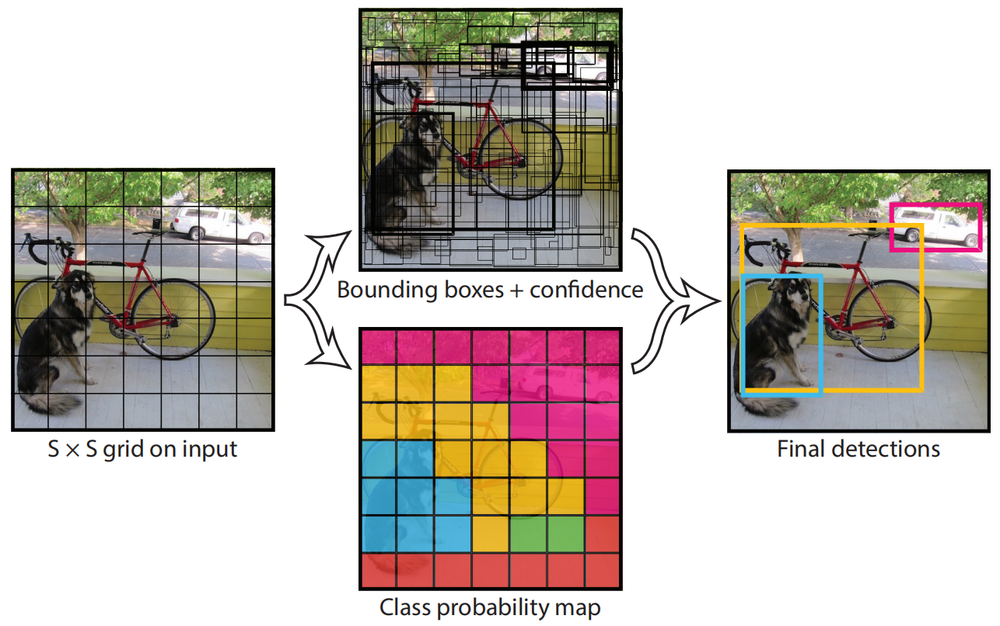

本文中，YOLO 评价使用 PASCAL VOC 数据集，参数设置为 $S=7$，$B=2$，$C=20$，故最终输出维度为 $7 \times 7 \times (2 \times 5 + 20)=1470$.

#### 1.3.2 网络设计

本文的网络结构借鉴了 GoogLeNet，共有 24 个卷积层，2 个全连接层。

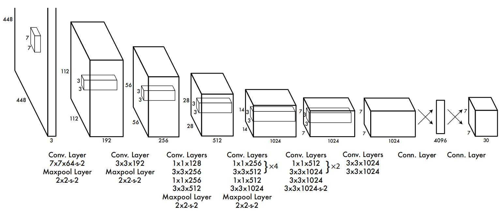

YOLO 就是如此简单，它在卷积特征提取网络之上，直接使用全连接层来预测 bounding boxes 的坐标。

其完整的检测系统如下图，共分为三个步骤：

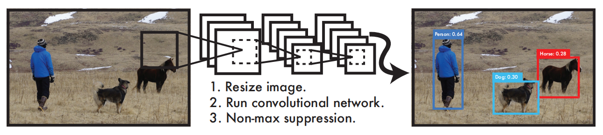

* 调整图像大小为 $448 \times 448$
* 运行上述卷积神经网络
* 通过 NMS 和 confidence 筛选检测结果

### 1.4 训练预测

#### 1.4.1 预训练分类网络

使用 ImageNet 1000-class competition dataset 预训练模型的分类网络（此时网络输入是 $224 \times 224$），这个网络组成为

* 上图中的前 20 个卷积层
* 平均池化层
* 全连接层

#### 1.4.2 训练检测网络

*Object Detection Networks on Convolutional Feature Maps* 一文提到，在预训练网络中增加卷积层和全连接层可以改善网络表现。于是有了上图的网络结构（此时网络输入是 $448 \times 448$），即

* 上图中的前 20 个卷积层
* 上图中的 4 个卷积层
* 上图中的 2 个全连接层

#### 1.4.3 损失函数设计

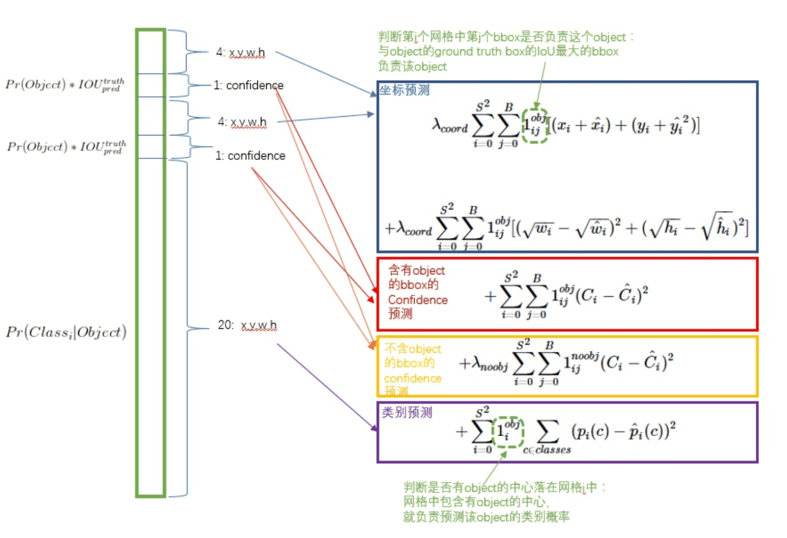

【注】因为平方和误差存在以下问题：

* 8 维的 localization error 和 20 维的 classification error 同等重要不太合理
* 如果一个网格中没有 object，那么就会将这些网格中 box 的 confidence 推向 0，抑制包含 object 的 box 参数梯度，导致网络不稳定甚至发散

因此，作者重新配置权重来补救这个问题，设置 $\lambda_{\text{coord}} = 5$，$\lambda{\text{noobj}}=0.5$。

* 对不同大小的 box 配置相同的权重，这也不合理，小 box 中的偏差比大 box 中的更重要

因此，作者改为预测 bounding box 宽和高的平方根，即 $\sqrt{w}$ 和 $\sqrt{h}$。

#### 1.4.4 学习率设置

学习率规划如下：

* 第一步迭代，将学习率从 $10^{-3}$ 缓慢增加到 $10^{-2}$（如果一开始学习率很大，模型容易由于梯度不稳定而发散）
* 继续以 $10^{-2}$ 的学习率迭代 75 步
* 继续以 $10^{-3}$ 的学习率迭代 30 步
* 最后以 $10^{-4}$ 的学习率迭代 30 步

#### 1.4.5 预测

对测试数据的预测和训练过程一样。

不过，由于网格设计使得 bounding box predictions 呈现空间多样性，会出现多个 box 高度重合的现象，这时采用非最大抑制（Non-maximal suppression，NMS）用于修正多样性，能提高 mAP $2-3\%$。

### 1.5 实现细节

#### 1.5.1 正则化与参数化

网络最后一层同时输出 class probabilities 和 predicted bounding box，由于 box 数值是相对于特定网格的，因此

* $(w,h)$ 除以图像宽高，使得取值范围 $[0,1]$
* $(x,y)$ 映射为相对于 box 边界的偏移，使得取值范围 $[0,1]$

#### 1.5.2 激活函数 

* 网络最后一层：线性激活函数

* 网络其它层：leaky rectified linear 函数
  $$
  \phi =\left\{\begin{matrix}
  x,  & x > 0 \\
  0.1x,  & 其他
  \end{matrix}\right.
  $$

#### 1.5.3 预防过拟合

**(1) 增加 dropout 层**

在第一个全连接层设置 $0.5$ 的 dropout 层，以防止网络层之间的 co-adaptation。

**(2) 数据增加**

随机放缩、平移至多 $20\%$ 的原始图像；

随机在 HSV 色彩空间上调整曝光度和饱和度至多 1.5 个因子。

### 1.6 评价指标

AP 和 mAP.

### 1.7 缺陷与不足

YOLOv1 对 bounding boxes 施加了很强的空间约束，限制单个网格内的检测数量，因此

* YOLO 对于成群的小尺度对象（如鸟群）的检测效果不佳

YOLOv1 从数据当中学习和预测 bounding boxes，并且学习的特征粒度较粗，因此

* YOLO 难以步骤新角度、新比例的对象

YOLOv1 的损失函数对不同大小的 box 设置相同的权重，因此

* YOLO 主要的误差来源于错误的定位

## 2 YOLOv2

### 2.1 介绍

题目：YOLO9000: Better, Faster, Stronger

论点：本文针对 [YOLOv1](#1-YOLOv1) 的缺陷和不足进行三大方面的改进，取得 state-of-art 的效果。

### 2.2 核心思想

本文分以下三方面逐步将 [YOLOv1](#1-YOLOv1) 提升至 YOLOv2，

* Better：提升 mAP
* Faster：提升速度
* Stronger：提升泛化能力

得到的 YOLOv2 一大特性是 `tradeoff`，即“折中”，能在准确率和速度上调整，适应多种场景需求。

下面逐一介绍这三方面的改进方法，<u>具有较大的参考性</u>。

### 2.3 Better

先总览本篇所用到技巧及其效果：

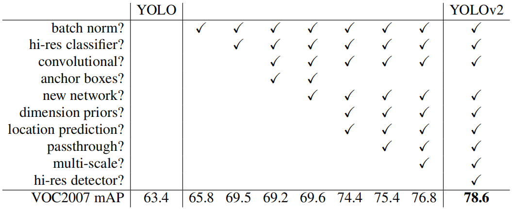

其中绝大多数的设计都能带来较大的 mAP 提升，除了 anchor boxes 与 new network 的切换过程，因为使用 anchor boxes 的主要提升在 recall，使用 new network 的主要提升在速度。

#### 2.3.1 Batch Normalization

BN 的使用提高模型收敛性，无需再使用其他正则化方法了，甚至 `dropout` 层去掉也不会过拟合。

批正则化能够带来 $2.4\%$ 的 mAP 提升。

#### 2.3.2 High Resolution Classifer

YOLOv1 用 $224\times 224$ 的输入预训练分类网络，却用 $448 \times 448$ 的输入上训练检测网络，这意味着模型既要学习物体检测、又要使用高精度。

YOLOv2 在 ImageNet 数据集上**继续迭代 10 次**，不过此时图像**分辨率提升**至 $448 \times 448$，来让模型适应高精度特征。

高精度分类网络能够带来将近 $4\%$ 的 mAP 提升。

#### 2.3.3 Convolutional With Anchor Boxes

借鉴 Faster R-CNN 的做法，YOLO2也尝试采用 <u>[anchor 机制](FasterR-CNN.md#1-3-3-2-Anchors)</u>，得到输出的维度组织如下：

* 在每个网格设定一组不同大小和宽高的 anchor box（也叫 prior，先验框）

  * YOLOv1 每个网格只预测 2 个 bounding box，整个图像预测 $7\times7\times2=98$ 个框（无先验框）；

    输出张量大小为 $N \times N \times [B \times (4+1) + \text{classes}]$；

  * YOLOv2 如果每个网格采用 9 个 anchor、预测 9 个 bounding box，整个图像拥有 $13 \times 13 \times 9 = 1521$ 个<u>先验框</u>，在此基础上预测 $1521$ 个框；

    输出张量大小为 $N \times N \times [ \text{anchors} \times (4 + 1 + \text{classes)} ]$；

* 去掉一个池化层，使网络卷积层输出具有更高的分辨率

* 调整网络输入为 $416 \times 416$

  * 而不是 $448 \times 448$，这样保证逆映射到原图中心只有一个点
  * YOLO 特征提取网络下采样倍数为 $32$，因此获得输出**特征图大小为 $13\times 13$**

YOLOv2 的召回率大幅提升到 $88\%$，同时 mAP 有 $0.2\%$ 的轻微下降。

#### 2.3.4 Dimension Clusters

作者进一步改良 priors，使用 k-means 对训练集中标注的 ground truth bounding boxes 进行聚类，自动寻找更符合样本中对象尺寸的 anchor.

对于常用的欧式距离，大边框会产生更大的误差，而我们关心的只是 IOU 值，因此使用如下公式作为聚类中的距离度量：
$$
d(\text{box},\text{centroid}) = 1 - \text{IOU}(\text{box},\text{centroid})
$$
$\text{centroid}$ 是聚类时被选作中心的边框，$\text{box}$ 就是其它边框，$d$ 就是两者间的“距离”。IOU 越大，“距离”越近。

作者使用了各种 $k$ 值进行实验，结果如下图。

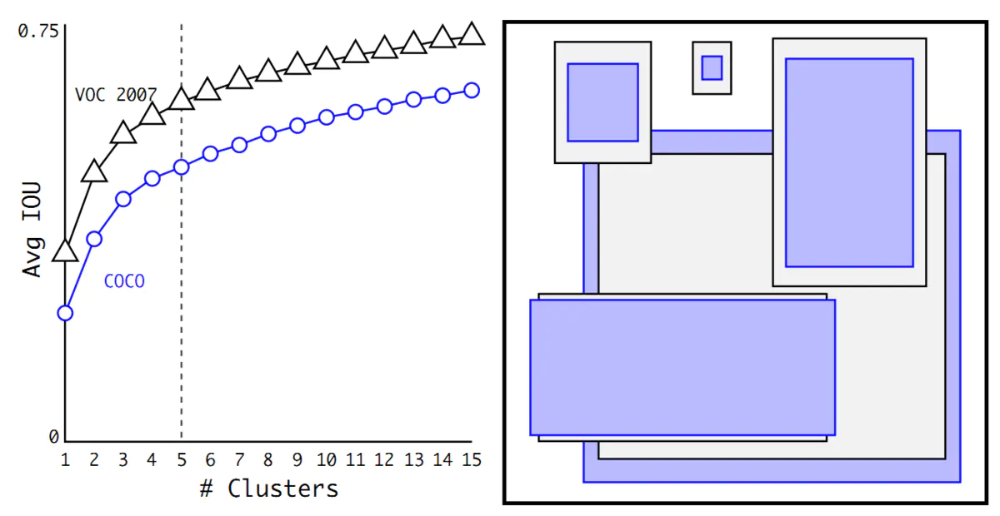

其中短、宽的框更少，高、瘦的框更多，推测与人的外形有关。

此外，作者还使用 VOC 2007 数据集评价聚类的效果，结果如下表，可以看到，5 个聚类先验框就有 9 个预设框的效果。

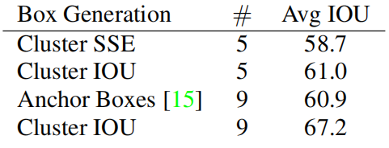

维度聚类加上下面的边框约束，使得 mAP 有 $4.8\%$ 的提升。

【?】聚类过程理解：训练集所有 box 聚类出 5 个，它们的中心是图像中心 $\Leftrightarrow $ 9 个 anchor 在图像中心的状况

#### 2.3.5 Direction Location Prediction

YOLO 使用 anchor box 的**第二个问题**是模型稳定性，尤其是早期迭代过程中，对 box 位置 $(x,y)$ 的预测引入了很大的不稳定性：

> Faster R-CNN 中，位置预测公式
> $$
> \left\{\begin{matrix}
> \begin{align*}
>  \hat{g}_y & = p_h t_y + p_y \\
>  \hat{g}_x & = p_w t_x + p_x \\
> 
> \end{align*}
> \end{matrix}\right.
> $$
> 其中的 $t_x$，$t_y$ **没有任何约束**，因此线性回归时，预测边框的中心可能出现在任何位置，训练早期阶段不容易稳定。

YOLOv2 在 $13\times13$ 特征图上沿用 YOLOv1 **直接预测 bbox** 的方法，并取借鉴 Faster R-CNN，对预测公式取长补短，将预测边框的中心约束在特定网格内：
$$
\begin{align}
b_x & = \sigma(t_x) + c_x \\
b_y & = \sigma(t_y) + c_y \\
b_w & = p_w e^{t_w} \\
b_h & = p_h e^{t_h}\\
Pr(\text{object})*\text{IOU}(b,\text{object}) & = \sigma(t_o)
\end{align}
$$
其中 $b_x$, $b_y$, $b_w$, $b_h$ 是预测边框的中心和宽高；$c_x$, $c_y$ 是当前网格左上角到图像左上角的距离（网格大小归一化为 $1\times1$），$p_w$, $p_h$ 是 anchhor 的宽和高，$t_x, t_y$ 是预测框的中心点位置，$t_w, t_h$ 是预测框的大小。

于是，预测中心 $t_x, t_y$ 经过 $\sigma$ 函数归一化为 $[0,1]$，利于回归；预测大小 $t_w, t_h$ 经过先验框 $p_w, p_h$ 参考，也利于回归。总之，通过引入<u>网格参考</u>和<u>锚框参考</u>，将**直接绝对预测转换为直接相对预测**，站在巨人的肩膀上，降低了模型预测难度。

【悟】追根到底，网格划分、anchor 以及后面的 NMS <font color="red">**本质上都是编码了先验知识的条件**</font>，缩小变化空间、提升回归预测的准确率。

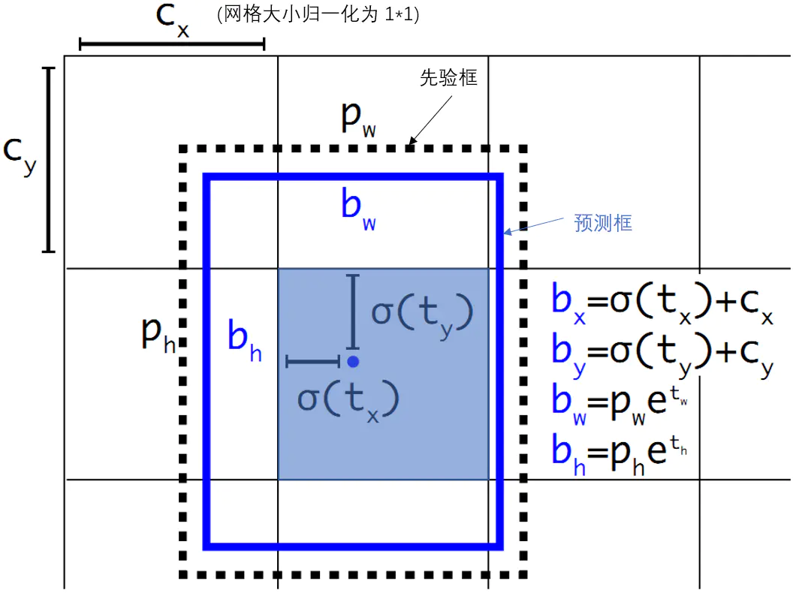

不同于 YOLOv1 直接预测置信度，这里直接预测 $t_o$ 后再取 sigmoid 作为置信度；$t_x$, $t_y$ 也同样被 sigmoid 约束在 $(0,1)$ 范围内，模型更加稳定。

#### 2.3.6 Fine-Grained Features

修改后的 YOLO 在 $13 \times 13$ 的特征图上进行检测，为了提高其对小目标的检测效果，有两种方向：

* Faster R-CNN 和 SSD 在不同的特征图上进行区域提议，获得不同精度的检测

* 本文增加 passthrough 层

  * 取第一个 $26 \times 26 \times 512$ 的特征图（最后一个 pooling 前）

  * 一拆四（$4\times13\times13\times512=13\times13\times2048$）

    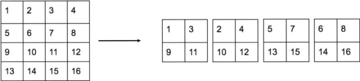

  * 直接传递到 pooling 后（并且又经过一组卷积）的特征图中叠加

    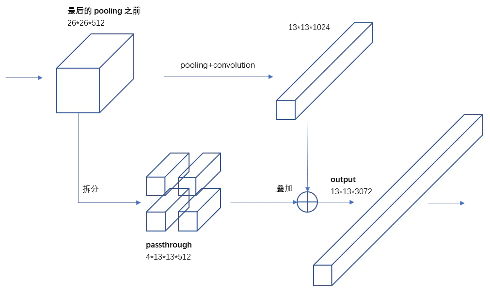
  

细粒度特征检测使得 mAP 有将近 $1\%$ 的提升。

#### 2.3.7 Multi-Scale Training

因为去掉了全连接层，YOLO2 可以输入任何尺寸的图像。又因为整个网络下采样倍数是32，作者采用 `{320,352,...,608}` 等 10 种输入图像的尺寸进行训练，每 10 个 batch 就随机更换一种尺寸，使网络能够适应各种大小的对象检测。

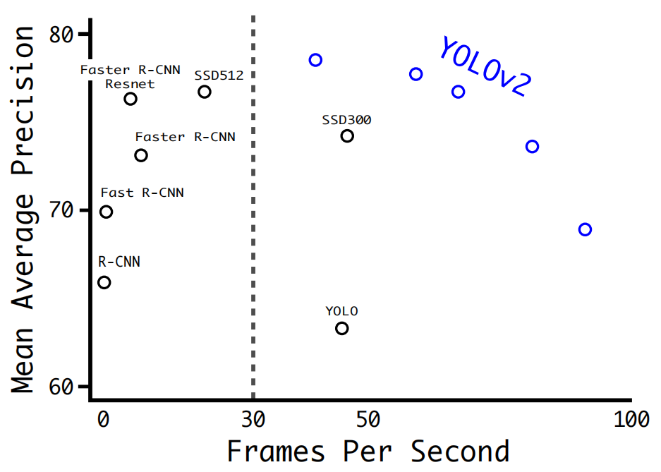

让网络学习预测不同维度的图像，意味着网络可以应用于不同精度的预测，从而使得 YOLOv2 可以在精度与速度当中调整。

多尺度图像训练对 mAP 有 $1.4\%$ 的提升。

### 2.4 Faster

#### 2.4.1 Darknet-19 网络

为了进一步提升速度，YOLO2 提出 Darknet-19（有 19 个卷积层和 5 个 MaxPooling 层）特征提取网络，其结构如下表。

DarkNet-19 比 VGG-16 小一些，精度不弱于 VGG-16，且浮点运算量减少到约 1/5，以保证更快的运算速度。

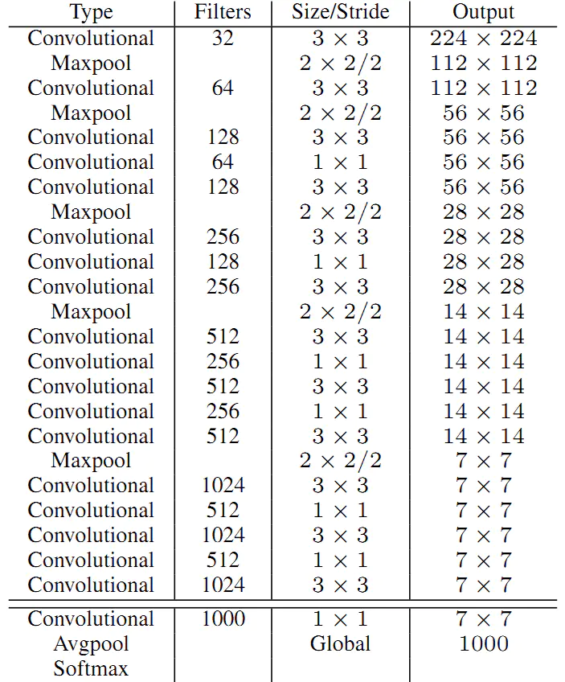

#### 2.4.2 分类和检测训练

1. 先在 ImageNet 1000 分类数据集（已数据增强）上预训练 Darknet-19，此时模型输入为 $224\times224$，共训练 160 个 epochs
2. 再将网络的输入调整为 $448\times448$ ，继续在 ImageNet 数据集上 finetune 分类模型，训练 10 个 epochs
3. **修改** Darknet-19 分类模型为检测模型（22-31 为新的层）

   * 移除最后一个卷积层、global avgpooling 层以及 softmax 层
   * 新增三个 $3\times3\times1024$ 卷积层，同时增加一个 passthrough 层
   * 使用 $1\times1$ 卷积层输出预测结果
     * 输出的 channels 数为：**num_anchors * (4 + 1+ num_classes)** = $25\times(4+1+20)$
     * 输出的张量大小为：$N \times N \times$ num_anchors * (5+num_classes) = $13\times13\times25\times(4+1+20)$

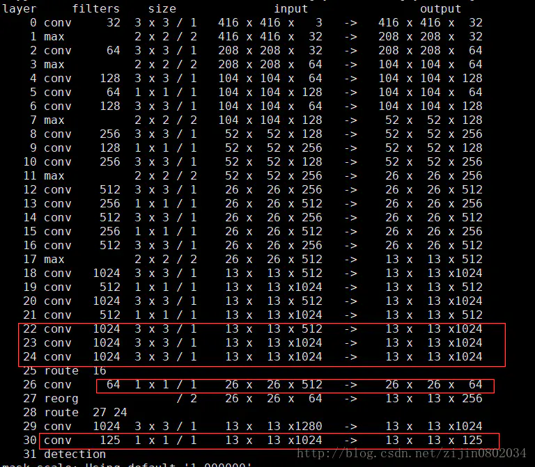

综上所述，YOLOv2 的输入输出结构为

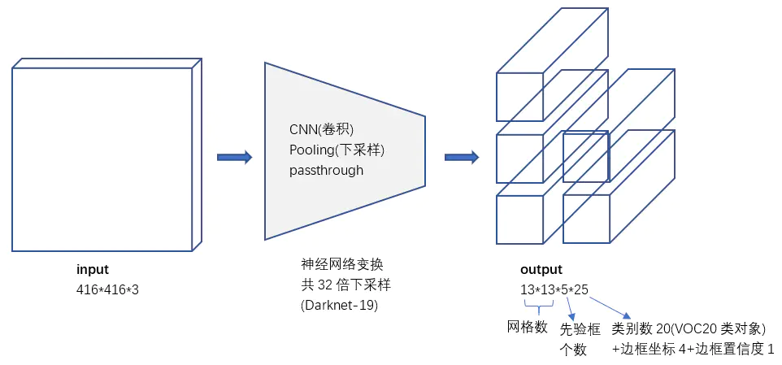

#### 2.4.3 误差函数

误差依然包括边框位置误差、置信度误差、对象分类误差。

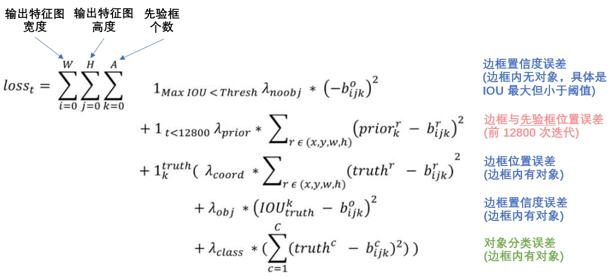

其中，

* $1_{Max IOU<Thresh}$ - 预测边框中，与 ground truth 边框 IOU 最大的那个，YOLO2 使用 $Thresh=0.6$
* $1_{t<12800}$ - 前 128000 次迭代计入误差
* $1_{k}^{truth}$ - 该边框负责预测一个真实对象（边框内有对象）

### 2.5 Stronger

#### 2.5.1 联合训练思路

YOLO2 尝试利用 ImageNet 非常大量的分类样本，联合 COCO 的对象检测数据集一起训练，提出在分类和检测数据集上的联合训练方法。

其基本思路是：

* 如果是检测样本，训练时其 Loss 包括分类误差和定位误差
* 如果是分类样本，训练时其 Loss 包括分类误差

这里遇到的一个问题是，不同的数据集所使用的 label 不一样，其中 ImageNet 与 COCO 的对象类别并不互斥，因而并不适用于 softmax 处理。

#### 2.5.2 WordTree

**概念**

YOLO2 根据 WordNet（有向图），将 ImageNet 和 COCO 中的名词对象合并构建出 WordTree，如下图所示。

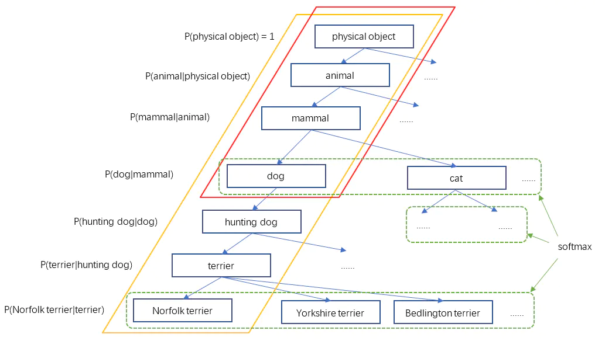

WordTree 以 physical object 为根节点，各名词依据相互间的关系构建树枝、树叶，节点间的连接表达了对象概念之间的蕴含关系（上位/下位关系）。

其中，只有同属与一个父节点的子节点间才是互斥的，因而可以进行 softmax 操作。

**构建**

* 对 ImageNet 的每个名词，在 WordNet 中检查至 physical object，如果只有一条路径，则添加
* 对剩下的名词（有多条路径），选择较短的路径添加到 WordTree 中

**实现**

本文也用一个 n 维向量（n 是预测对象的类别数）表示预测结果：

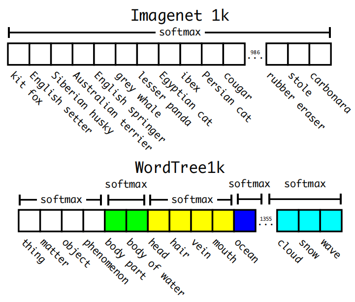

<u>Ground Truth 表示</u>：对于某个图像的 label，在 WordTree 中表示为该节点至根节点的路径，路径上的节点概率为 1，其余为 0

<u>Prediciton 表示</u>：模型预测各个节点的条件概率，因而一个节点的绝对概率为它到根节点路径上所有条件概率的乘积

<u>WordTree 结果搜索方法</u>：在实际计算中，对于预测到的一个向量，采用了一种**贪婪模式**，

从根节点开始向下遍历，对每一个节点，在它的所有子节点中，选择概率最大的那个（一个节点下面的所有子节点是互斥的），一直向下遍历直到某个节点的子节点概率低于设定的阈值（意味着很难确定它的下一层对象到底是哪个），或达到叶子节点，那么该节点就是该 WordTree 对应的对象。

#### 2.5.3 分类和检测的联合训练

首先，由于 ImageNet 样本比 COCO 多很多，因此对 COCO 样本会多做一些采样（oversampling），将两者的<u>样本平衡</u>为 $4:1$。

其次，通过联合训练方法得到的 YOLO9000 模型，能检测分类多达 9000 种的对象，其<u>基本结构同 YOLOv2</u>，只是 5 个先验框减少到 3 个先验框。

接着，由于对象类别为 WordTree 的形式，因此对一个检测样本，其<u>分类误差</u>只包含该标签节点以及到根节点的所有节点的误差。

最后，关于分类数据集的图像，<u>计算分类误差</u>的方法为，找到 predicted bounding box 中概率最大的类，计算该类的损失。

【注】这里假设用作类别的 predicted bounding box 与 ground truth box 的重叠（IOU）在 0.3 以上。

## 3 YOLOv3

### 3.1 介绍

题目：YOLOv3: An Incremental Improvement

论点：本文进行一系列小的设计改变，得到更好的模型，它虽然更大些，但更准确、速度仍快。

### 3.2 核心思想

YOLO3 借鉴当前的最新方法，对 [YOLOv2](#2-YOLOv2) 做了进一步的保留和改进。

### 3.3 网络结构

整个 YOLOv3 body 包含 252 层，分为：

* Add - 23
* BatchNormalization - 72
* Concatenate - 2
* Conv2D - 75
* InputLayer - 1
* LeakyReLU - 72
* UpSampling2D - 2
* ZeroPadding2D - 5

输入大小：$416\times416\times3$


输入大小：$608\times608\times3$

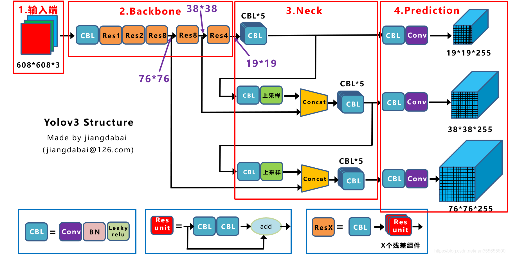

其中，

* DBL（Darknetconv2D_BN_Leaky）- YOLOv3 的基本组件，由 conv, BN, Leaky relu 组成
* resn（Resblock_body） - YOLOv3 的大组件，n 表示由 n 个 Res_unit 组成，它借鉴 ResNet 的残差结构，让网络结构更深

可以看到，YOLOv3 的 backbone 为 Darknet53，neck 部分为标准 FPN，prediction 为三种尺度的预测。

### 3.4 特征提取部分

YOLOv3 使用一个<u>新的网络</u>来提取特征，作者在 Darknet-19 网络的基础上，借鉴新颖的残差网络，提出 **Darknet-53**.


**采样倍数：**

在 [YOLOv2](#2-YOLOv2) 中，有 5 个池化层，因而特征提取网络下采样倍数为 $2^5=32$；

在 YOLOv3 中，是**没有池化层和全连接层**的，**张量的尺寸变换是通过改变卷积核的步长来实现**。

如上图所示，YOLOv2 通过最大池化调整张量尺寸，YOLOv3 通过改变步长调整张量尺寸，因而也是 $32$ 的下采样倍数。

**残差结构：**

在 [YOLOv2](#2-YOLOv2) 中，Darknet-19 没有残差结构，是和 VGG 同类型的上一代 backbone；

在 YOLOv3 中，Darknet-53 借鉴残差结构，是和 Resnet 同类型的新一代 backbone.

**效果对比**

Darknet-53 及其轻量版 tiny-Darknet 的效果如下：

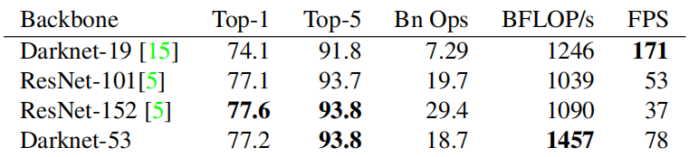

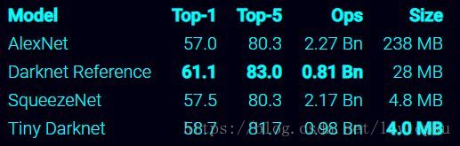

可以看到，Darknet-53 媲美 ResNet-152，tiny-Darknet 能提高更高的速度，两者使得 YOLOv3 全面超越 YOLOv2 和 YOLOv1.

### 3.5 模型预测部分

#### 3.5.1 Bounding Box Prediction

1. YOLOv3 首先沿用了 [YOLOv2](#2-YOLOv2) 的 维度聚类（Dimension Clusters）和直接位置预测（Direction Location Prediction）的方法。

   选用 prior 个数为 $9$（tiny-yolo 为 $6$），得到 9 个宽高如下的 priors；

   9 个 priors 会被三个输出张量平分的。根据大中小三种 size 各自取自己的 prior；

   ```
   (10,13), (16,30), (33,23), (30,61), (62,45), (59,119), (116,90), (156,198),  (373,326)
   ```

2. YOLOv3 然后改变了 [YOLOv2](#2-YOLOv2) 用 linear regression 进行 bbox 预测的方式，转而采用 logistic regression。

   每次预测 bbox 时，回归输出和 YOLOv2 一样都是 $(t_x,t_y,t_w,t_h,t_o)$， 然后也同样用公式计算结果；

   使用 logistic regression 对每个 prior 覆盖的内容进行目标性评分（objectness score）， 根据目标性评分选择 anchor prior 进行预测；

【注1】每个 gt bbox **只指定一个** overlap 最高的 prior，其他超过阈值（0.5）的执行忽略。

#### 3.5.2 Class Prediction

和 [YOLOv2](#2-YOLOv2) 一样，每个 bbox 预测一个 multilabel classification.

不过 YOLOv3 不再使用 <u>softmax classifiers</u>，仅用独立的 <u>logistic classifiers</u>，并在训练时使用二值交叉熵作为损失函数。

#### 3.5.3 Predicions Across Scales

YOLOv3 借鉴了 FPN（Feature Pyramid Networks），用三种不同尺度的 feature map 执行上述预测，以适应不同大小的检测目标。大的网格有大感受野，利于检测大目标；小的网格有小感受野，利于检测越精细的物体。

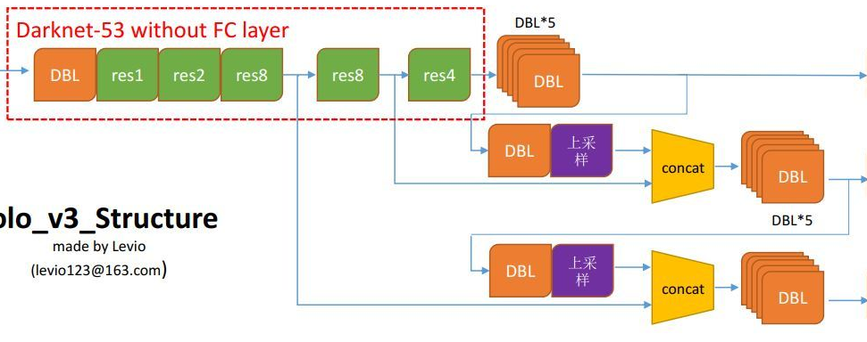

1. YOLOv3 通过上采样的方法实现多尺度预测

   如上图，YOLOv3 用 $2\times$ 上采样当前 feature map，然后与网络前面的 feature map 进行 concat 操作，得到更大尺度的 feature map.

   上述方法总共重复两次，就得到三种尺度的 feature map。

   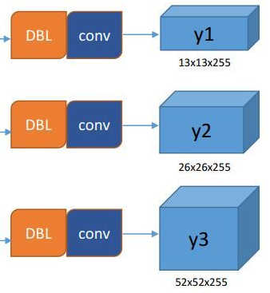

2. YOLOv3 在三种 feature map 上进行预测

   YOLOv3 在三种不同尺度的 feature map 进行预测，各条线路最后输出一个三维 tensor，包含 bounding box，objectness 和 class predictions，表示 `(x,y,w,h,confidence)` 和 `p_class`。

   对于 COCO 数据集而言，每个网格 3 个 anchors 预测 3 个 bounding box，包含 80 个类别的 logits，因此延续 YOLOv2 得到输出的 channel 数为 $3\times((4+1)+80)=255$，输出的张量大小为 $N \times N \times 3 \times (4+1+80)$.

### 3.6 训练技巧

##### Rectangular training/inference

矩形训练/推理，YOLOv3 中是下采样 32 倍，长宽也必须是 32 的倍数，所以在进入模型前，数据需要处理到 $416×416$​ 大小，这个过程称为**仿射变换**。

仿射变换后的图像变为正方形，非正方形图片通过补灰 `padding` 来变为正方形的图。如下图，缩放为

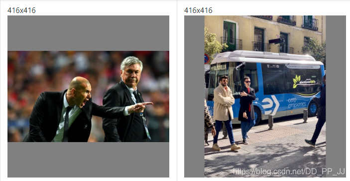

技巧目标：直接使用这样的图片进行训练会产生很多冗余信息，于是矩形训练/推理的想法就是在训练/推理过程中，去除这些冗余信息。

具体方法：将较长边设定为目标尺寸 416，短边按比例缩放，再对短边进行<u>较少</u>填充使短边满足 32 的倍数。

填充逻辑：

* 确定目标 `size` 的宽高比 `P`
* 新图宽高比大于 `P`，则宽 `resize` 到目标尺寸，上下 `padding` 黑边
* 新图宽高比小于 `P`，则高 `resize` 到目标尺寸，左右 `padding` 黑边

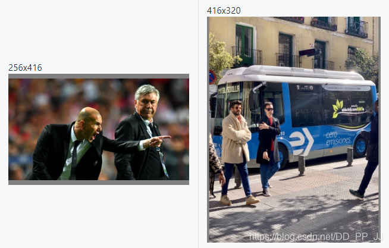

## 4 YOLOv4

### 4.1 介绍

题目：YOLOv4: Optimal Speed and Accuracy of Object Detection

论点：本文通过大量实验尝试近年 CNN 领域中的优化策略，建立可用于生产系统和并行优化的高性能目标检测网络。

### 4.2 核心思想

YOLOv4 在原有的目标检测架构基础上，采用了近些年 CNN 领域中最优秀的优化策略，从**数据处理、主干网络、网络训练、激活函数、损失函数**等各个方面进行不同程度的优化，相当于一篇**目标检测的 trick 综述**。

### 4.3 相关工作

#### 4.3.1 Object detection models

总览目前的对象检测方法，一般的对象检测模型可以有几个部分：

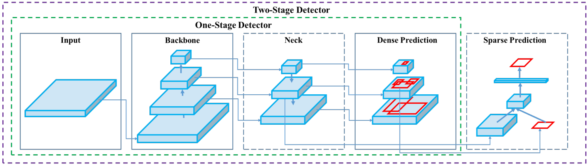

* Input：输入模块
  * Image, Patches, Image Pyramid
* Backbone：特征提取模块（常在 ImageNet 上预训练）
  * GPU 平台：VGG, ResNet, ResNeXt, DenseNet
  * CPU 平台：SqueezeNet, MobileNet, ShuffleNet
  * 常用：VGG16, ResNet-50, SpineNet, EfficientNet-B0/B7, CSPResNeXt50, CSPDarknet53
* Neck：特征聚集模块（位于 Backbone 与 Head 之间，聚集不同阶段的特征）
  * Additional blocks：SPP, ASPP, RFB, SAM
  * Path-agreegation blocks：FPN, PAN, NAS-FPN, Fully-connected FPN, BiFPN, ASFF, SFAM
* Heads：预测模块（预测 bboxes 和 classes）
  * Dense Prediction (one-stage)：
    * RPN, SSD, YOLO, RetinaNet (anchor based)
    * CornerNet, CenterNet, MatrixNet, FCOS (anchor free)
  * Sparse Prediction (two-stage)：
    * Faster R-CNN, R-FCN, Mask R-CNN (anchor based)
    * RepPoints (anchor free)

#### 4.3.2 Bag of freebies

概念：改变训练策略或训练花费，但能够提高精度而不增加推断时间的技术

* 数据增强：增加输入图像的变化性，让模型更加健壮
  * 像素级调整：亮度、对比度、饱和度抖动，几何变化，噪声
  * 块级调整：随机擦除，CutOut，CutMix
  * 特征级调整：DropOut, DropConnect, DropBlock
  * 风格调整：MixUp, style transfer GAN
* 数据平衡：降低数据集中的语义分布偏差
  * 数据类别平衡：hard negative example mining, focal loss
  * 数据类别表达：knowledge distillation
* BBox 回归的目标函数
  * 距离：Mean Square Error (MSE)
  * 面积：IoU, GIoU, DIoU, CIoU

#### 4.3.3 Bag of specials

概念：增加少许推断代价，但提高模型精度的插件模块和后处理方法

* 感受野插件
  * SPP, ASPP, RFB
* 注意力插件
  * channel-wise：Squeeze-and-Excitation (SE)
  * point-wise：Spatial Attention Module (SAM)
* 特征集成插件
  * SFAM, ASFF, BiFPN
* 改进激活函数
  * LReLU, PReLU, ReLU6, Scale Exponential Linear Unit (SELU)
  * 无穷阶可导：Swish, hard-Swish, Mish
* NMS 后处理
  * soft NMS, DIoU NMS

### 4.4 模型结构

YOLO 一直以来的特点在于速度，因此模型建构的基本目标是运行速度要快，在此基础上考虑质量与速度的权衡。

YOLOv4 的最终结构为：

* Input：Image？

* Backbone：CSPDarknet53
  * BoF
    * 数据增强：CutMix, Mosaic, DropBlock regularization
    * 数据平衡：Class label smoothing
  * BoS
    * 改进激活函数：Mish activation
    * Cross-stage partial connection (CSP)
    * Multi input weighted residual connections (MiWRC)
* Neck：SPP, PAN
* Head：YOLOv3
  * BoF
    * CIoU-loss
    * CmBN

## 5 YOLOv5

### 5.x 数据


### 5.y 训练

##### Hyperparameter Evolution

超参数进化，一种利用 <u>遗传算法(GA)</u> 进行超参数优化的方法。

原理：待定

用法：待定，参考 https://blog.csdn.net/ayiya_Oese/article/details/115369068

【注】由于超参数进化会耗费大量的资源和时间，如果默认参数训练出来的结果能满足你的使用，使用默认参数也是不错的选择。

##### Cosine Annealing

余弦退火，一种通过余弦函数降低学习率的学习率调整方法。

### 5.z 框架

##### 混合精度加速

##### 卷积优化