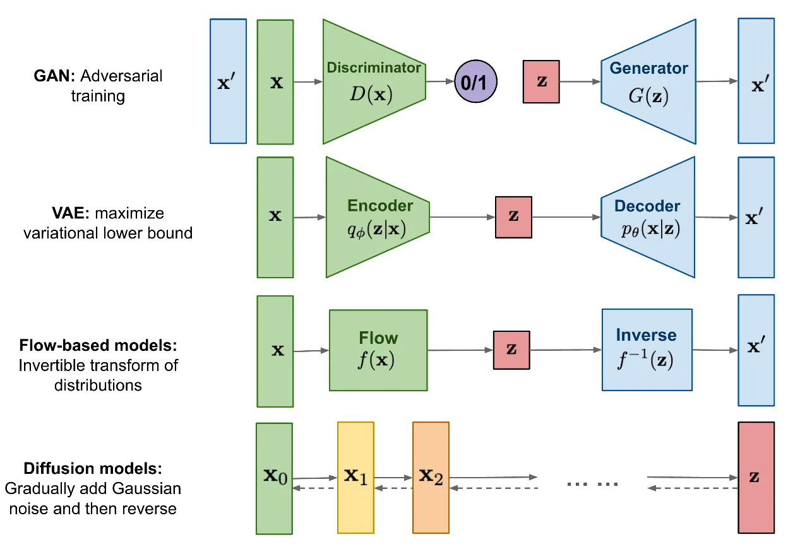
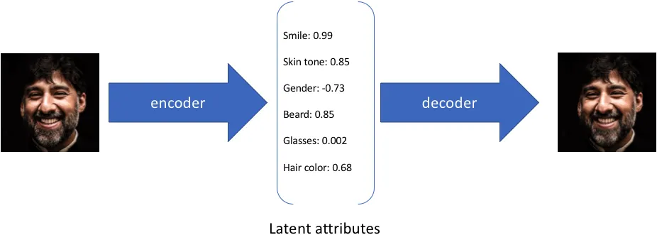
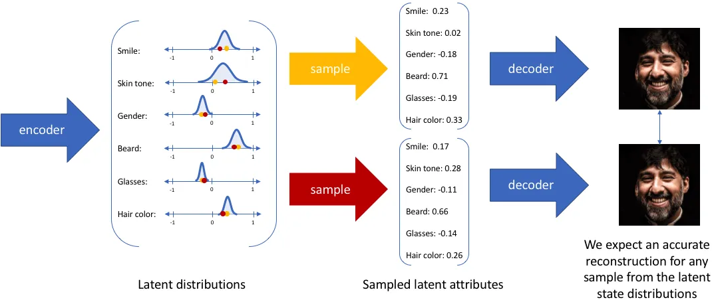
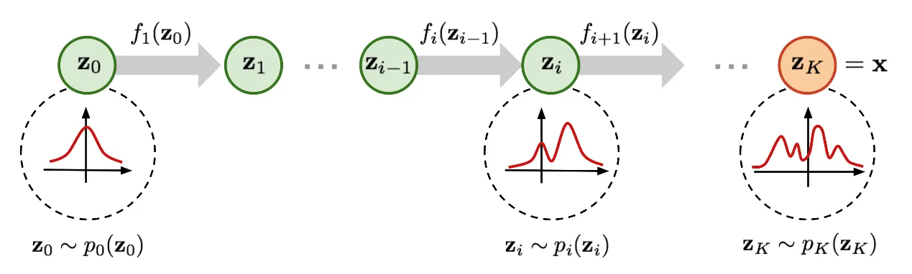

## 目录

[toc]

## 1 介绍

自 2014 年生成对抗网络（GAN）诞生以来，图像生成研究成为了深度学习乃至整个人工智能领域的重要前沿课题，现阶段技术发展之强已达到以假乱真的程度。

如上图所示，目前（2022 年）主流的图像生成方法有四种，除了为人熟知的生成对抗网络（GAN），主流方法还包括变分自编码器（VAE）和基于流的生成模型（Flow-based models），以及近期（2022.09）颇受关注的扩散模型（Diffusion models）。

### 1.1 生成对抗网络

生成对抗网络（**G**enerative **A**dversarial **N**etworks，GAN）的核心思想是 “博弈”，即在训练生成器（<u>G</u>enerator）从随机噪声生成图像的同时，训练判别器（<u>D</u>iscriminator）来判断输入是真实图像还是生成图像，两者在一个极小极大游戏中相互博弈不断变强，如式 (1) 所示。当生成器生成足以 “骗” 过判别器的图像时，我们认为较好地拟合出了真实图像的数据分布。
$$
\min_G\max_D V(D,G) = \mathbb{E}_{x\sim P_{data}(x)} \left[ \log D(x) \right] + \mathbb{E}_{z\sim P_z(Z)} \left[ \log \left( 1-D \left( G(z) \right) \right) \right]
$$
GAN 是生成式模型中应用最广泛的技术，在图像、视频、语音和自然语言等众多数据合成场景大放异彩。

【补充】除了直接从随机噪声生成内容外，我们还可以将条件（例如分类标签）作为输入加入生成器和判别器，使得生成结果符合条件输入的属性，让生成内容得以控制。

【优劣】虽然 GAN <u>效果出众</u>，但由于博弈机制的存在，其训练稳定性差且容易出现<u>模式崩溃</u>（Mode collapse），如何让模型平稳地达到博弈均衡点，也是 GAN 的热点研究话题。

### 1.2 变分自编码器

> **自编码器**
>
> 传统的自编码器旨在以无监督的方式训练一个神经网络，完成将 “原始输入压缩成中间表示” 和 “将中间表示恢复成原始输入” 两个过程，前者通过编码器（Encoder）将原始高维输入转换为低维隐层编码，后者通过解码器（Decoder）从编码中重建数据。
>
> 
>
> 不难看出，自编码器的目标是学习一个恒等函数，我们可以使用交叉熵（Cross Entropy）或者均方差（Mean Square Error）构建重建损失来量化输入和输出的差异。如上图所示，在上述过程中我们获得了低维度的隐层编码，它<u>捕捉了原始数据的潜在属性，可以用于数据压缩和特征表示</u>。

变分自编码器（**V**ariational **A**uto **E**ncoder，VAE）是自编码器的一种变体。由于<u>自编码器仅关注隐层编码的重建能力，其隐层空间分布往往是无规律和不均匀的</u>，在连续的隐层空间随机采样或者插值得到一组编码通常会产生无意义和不可解释的生成结果。为了构建一个有规律的隐层空间，使得我们可以在不同潜在属性上随机地采样和平滑地插值，最后通过解码器生成有意义的图像，研究者们在 2014 年提出了变分自编码器。

变分自编码器不再将输入映射成隐层空间中的一个固定编码，而是转换成**对隐层空间的概率分布估计**。为了方便表示，假设先验分布是一个标准高斯分布，并训练一个概率解码器，实现从隐层空间分布到真实数据分布的映射。

如上图所示，当给定一个输入，我们通过后验分布估计出隐层分布的参数（多元高斯模型的均值和协方差），并在此分布上采样（可使用重参数化技巧使采样为可导的随机变量），最后通过概率解码器输出真实分布的近似。

为了使生成图像尽量真实，我们需要求解后验分布，即最大化真实图像的对数似然。但根据贝叶斯模型，真实的后验分布包含对在连续空间上的积分，无法直接求解，因此 VAE 通过**变分推理**方法引入一个可学习的概率编码器去近似真实的后验分布，将**问题转化**为最大化生成真实图像的证据下界（Evidence Lower Bound）：
$$
\begin{align}
\log p_\theta(x) & \ge \log p_{\theta}(x) - D_{KL}\left( q_\phi(z|x) \| p_\theta(z|x) \right) \\
& = \mathbb{E}_{z\sim q_\phi(z|x)} \log_{p_\phi}p(x|z) - D_{KL}\left( q_\phi(z|x) \| p(z) \right) \\
& = -L_{VAE} (\theta, \phi)
\end{align}
$$

### 1.3 基于流的生成模型

基于流的生成模型（Flow-based models）如下图所示，其假设原始数据分布可以通过一系列可逆的转化函数从已知分布获得。

于是，通过雅可比矩阵行列式和变量变化规则，我们可以直接估计真实数据的概率密度函数（如下），最大化可计算的对数似然。
$$
\log p(x) = \log \pi_0(z_0) - \sum_{i=1}^K \log \left | \det \frac{df_i}{dz_{i-1}} \right |
$$
其中 $\det \frac{df_i}{dz_{i-1}}$ 是转换函数的雅可比行列式，因此要求可逆、易算。

【注1】基于流的生成模型如 Glow 采用 $1 \times 1$ 可逆卷积进行精确的密度估计，在人脸生成上取得不错的效果。

【注2】基于流的生成模型的可逆要求往往难以实现，限制了它的广泛应用。

### 1.4 扩散模型

扩散模型（Diffusion Models）相当于是 VAE 的多步扩展，它也定义了正向和逆向两个过程。

**正向过程/扩散过程**是从真实数据分布中采样，逐步向样本添加高斯噪声，生成噪声样本序列。这个加噪过程是可控的（方差参数控制），用条件分布表示如下。
$$
q(x_t \mid x_{t-1}) = \mathcal{N}(x_t ; \sqrt{1-\beta_t} x_{t-1},\; \beta_t I)
$$
**逆向过程/收缩过程**是从高斯噪声分布中采样，学习一个模型来估计真实的条件概率分布，可定义为
$$
\begin{align}
p_\theta (x_{0:T}) & = p(x_T)\prod_{t=1}^T p_\theta (x_{t-1}\mid x_t) \\
p_\theta(x_{t-1} \mid x_t) & = \mathcal{N}(x_{t-1}; \mu_\theta(x_t, t), \Sigma_\theta(x_t, t))
\end{align}
$$
扩散模型的**优化目标**有多种选择。例如，由于正向过程可以直接计算，于是可从预测的分布中采样，采样过程加入图像分类和文本标签作为条件输入，用最小均方差优化重建损失，这个过程等效于自编码器。在去噪扩散概率模型 DDPM 中，作者通过重参数化技术构建了简化版的噪声预测模型损失
$$
\frac{1}{\sqrt{\alpha_t}}\left( x_t - \frac{\beta_t}{\sqrt{1-\bar{\alpha}_t}}z_t \right)
$$
预测去噪数据 $x_{t-1}$ 的高斯分布均值，实现人脸图像去噪
$$
L^{\text{simple}}_t = \mathbb{E}_{x_0, z_t} \left[ \left \| z_t - z_\theta \left( \sqrt{\bar{\alpha}_t}x_0 + \sqrt{1-\bar{\alpha}}z_t, t \right) \right \| ^2 \right]
$$

