## 目录

[toc]

## 1 UNITER

### 1.1 介绍

题目：UNITER: **UN**iversal **I**mage-**TE**xt **R**epresentation Learning

论点：本文提出 UNITER 模型并给出通用高效的 joint multimodal embeddings，同时这也基于本文提出的四种预训练任务（MLM, MRM, ITM, WRA）。

### 1.2 引入

大多数视觉语言（Vision-and-Language, V+L）任务依赖联合跨模态表示（joint multimodal embeddings）来连接图像与文本之间的语义信息，但是目前方法使用的 embeddings 都是 task-specific 的，**不够通用**。

本文提出 UNITER 模型，一个生成 joint multimodal embedding 的大规模预训练模型，其**灵感来源**有二：

* [Transformer](../NLP/Transformer.md#1-Transformer)，它通过自注意力机制巧妙地学习 contextualized representations
* [BERT](../NLP/BERT.md#1-BERT)，它通过大规模语言预训练任务成功地将 Transformer 用于 NLP 任务

因此，**本文以 Transformer 为核心，提出四种预训练任务，得到 joint multimodal embeddings**。

这样的多模态 embeddings 可以用于多种 V+L 任务，如

* Image Captioning：给定一张图片，我们可以概括图片内容
* Visual Question Answering：对这张图片进行提问，让模型回答相关的问题
* Dense Captioning：我们也会对图片的细节感兴趣，针对图片的特定区域进行描述
* Referring Expressions：给定一个描述语句，并定位该语句的指定区域
* Visual Dialogue：针对图片还可以进行多轮问答

### 1.3 模型结构

UNITER 模型核心为 [Transformer](../NLP/Transformer.md#1-Transformer)，如下图所示。  

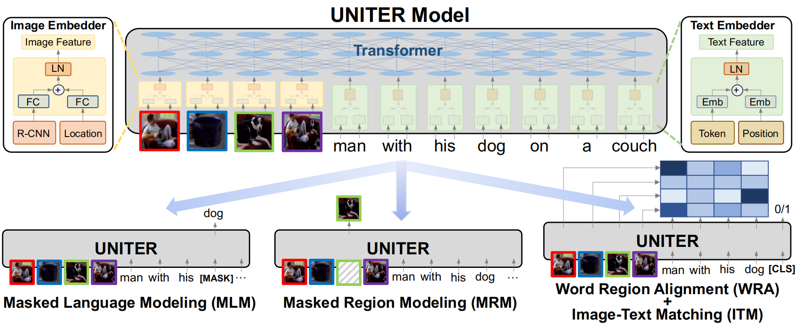

**模型输入：**Image-Text Pair

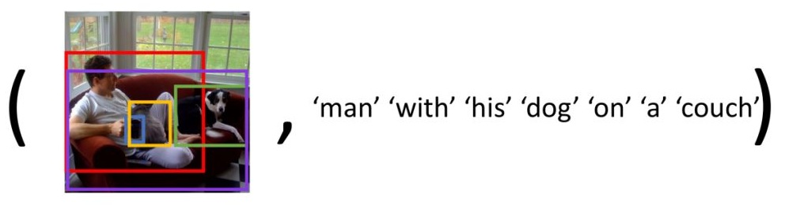

**Image Embedder：**

* R-CNN：Faster R-CNN 提取图像中各个区域的特征（pooled ROI 特征）
* Location：图像区域位置信息，7 维向量 $[x_1,y_1,x_2,y_2,w,h,w*h]$，分别表示正则化后的 `top`/`left`/`bottom`/`right` 坐标，`width`，`height` 和  `area`
* FC：fully-connected 全连接层，输入图像与位置特征，将它们投影到相同的 embedding 空间
* LN：layer normalizatioon 正则化层，图像特征与位置特征相加后，经过正则化输出 Image Feature

**Text Embedder：**

* Token：句子的分词，即 tokens
* Position：tokens 位置信息
* Emb：embedder，左边的是 BERT 模型，右边的是？？
* LN：layer normalization 正则化层，文本特征与位置特征相加后，经过正则化输出 Text Feature

**Transformer：**输入 Image Feature 和 Text Feature

【注】由于 Transformer 缺少序的信息，因此需要 Location 和 Positon 两个来显示编码位置信息到输入中。

### 1.4 预训练任务

**定义**

* 图像区域 $v=\{ v_1,\dots,v_K \}$
* 句子 token $w=\{ w_1,\dots,w_T \}$
* mask 下标 $m \in \mathbb{N}^M$（$\mathbb{N}$ 是自然数集，$M$ 是 masked tokens 数量，**$m$** 是 masked 下标集合）

#### 1.4.1 Masked Language Modeling

任务：基于未遮罩的词 $w_{\setminus m}$ 和所有图像区域 $v$，预测遮罩部分的词 $w_m$

目标：使用负对数似然损失函数，其中 $\theta$ 为可训练参数，$(w,v)$ 在整个训练集 $D$ 上采样
$$
\min_{\theta} \mathcal{L}_{\text{MLM}}(\theta) = - \mathbb{E}_{(w,v)\sim D}\log P_{\theta}(w_m | w_{\setminus m},v)
$$
条件遮罩：用特殊的 token `[MASK]` 随机替换输入序列中的 tokens（不遮图），比例分配同 BERT（15%，其中的 10% 用随机词，10% 不变，80% 用 `[MASK]`）

#### 1.4.2 Image-Text Matching

任务：基于一对 $(w,v)$ 生成的特殊 token `[CLS]`，学习预测 $y\in\{0,1\}$ 表示它们是否匹配

目标：使用二值交叉熵损失函数，其中 `[CLS]` 经过一个全连接层和 sigmoid 函数，最终得到输出分数 $s_\theta(w,v)$
$$
\min_{\theta} \mathcal{L}_{\text{ITM}}(\theta) = - \mathbb{E}_{(w,v)\sim D} \left[ y\log s_{\theta}(w,v) + (1-y)\log(1-s_\theta(w,v)) \right]
$$
表示：正负样本对 $(w,v)$ 来自数据集 $D$，其中负样本通过随机错配产生，输入 UNITER 后，取融合了两种模态信息的序列起始 token `[CLS]`.

#### 1.4.3 Word-Region Alignment

> Optimal Transport (OT)
>
> OT 的参数为一个对齐方式（transport plan）$T\in \mathbb{R}^{T\times K}$，表示图像区域 $v$ 与句子 tokens $w$ 的对齐方式。
>
> 它有以下几个优点：
>
> * Self-normalization：$T$ 矩阵所有元素和为 $1$
> * Sparsity：$T$ 矩阵是稀疏的，最多只有 $2r-1$ 个非零元素，其中 $r=\max(K,T)$
> * Efficiency：相比于传统的线性规划，其解可以用仅需矩阵/向量乘积的迭代方式近似得到
>
> 对于一对 $(w,v)$，可以将它们看成两个离散分布 $\mu=\sum_{i=1}^{T}a_i\delta_{w_i}$，$v=\sum_{j=1}^{K}b_j\delta_{v_j}$，其中 $\delta_{w_i}$ 为 $w_i$ 上的 Dirac 函数，$\sum_{i=1}^{T}a_i=1$，$\sum_{j=1}^{K}b_j=1$.
>
> 由此可以定义出具体的 OT 距离公式 $D_{ot}$（见下）衡量 $(w,v)$ 的对齐损失。

任务：学习对齐方式 $T$ 来优化两种模态的对齐程度

目标：使用 OT 距离公式，其中集合 $\Pi(a,b)=\left \{ T\in \mathbb{R}_+^{T\times K} | T1_m = a, T^\top1_n=b \right \}$，距离用 $c(w_i,v_j)=1-\frac{w_i^\top v_j}{\left \| w_i \right \| _2 \left \| v_j \right \| _2 }$
$$
\min_{\theta} \mathcal{L}_{\text{WRA}}(\theta) = \min_{\theta} \mathcal{D}_{ot}(\mu,v)=\min_{\theta} \min_{\Pi(a,b)}\sum_{i=1}^{T}\sum_{j=1}^{K}T_{ij} \cdot c(w_i,v_j)
$$
算法：使用 IPOT 算法来近似求解 OT 距离，OT 距离就是 WRA 任务的误差函数，可用于更新参数 $\theta$。

#### 1.4.4 Masked Region Modeling

任务：基于未遮罩的图像区域 $v_{\setminus m}$ 和所有词 $w$，重建遮罩部分的图像区域 $v_m$

目标：由于图像特征的高维连续性，无法建立关于类别的似然损失，于是提出了三个 MRM 的变种，基于以下损失函数
$$
\mathcal{L}_{\text{MRM}}(\theta) = \mathbb{E}_{(w,v)\sim D}f_\theta(v_m|v_{\setminus m},w)
$$
条件遮罩：用全零特征向量随机替换输入序列中的图像区域（不遮字），比例为 15%

变种：

* Masked Region Feature Regression (MRFR)

  * 任务：学习回归每个遮罩区域的 Transformer 输出 $v_m^{(i)}$ 到它的真实特征

  * 目标：先用一个全连接层转换输出 $h_\theta(v_m^{(i)})$，维度与 ROI pooled 特征 $r(v_m^{(i)})$ 一样，然后用 L2 回归损失
    $$
    f_\theta(v_m|v_{\setminus m},w)=\sum_{i=1}^{M}\left \| h_\theta(v_m^{(i)}) - r(v_m^{(i)}) \right \|_2^2
    $$

* Masked Region Classification (MRC)

  * 任务：学习预测每个遮罩区域的对象类别（hard label）

  * 目标：先用一个全连接层和 softmax 层转换输出 $g_\theta(v_m^{(i)})\in\mathbb{R}^K$（$K$ 表示类别个数），ground truth label 为 faster R-CNN 预测结果 $c(v_m^{(i)})\in\mathbb{Z}^K$，然后用交叉熵损失（cross-entropy, CE）
    $$
    f_\theta(v_m|v_{\setminus m},w)=\sum_{i=1}^{M}\text{CE}(c(v_m^{(i)}),g_\theta (v_m^{(i)}))
    $$

* Masked Region Classification with KL-Divergence (MRC-kl)

  * 任务：学习预测每个遮罩区域的对象类别（soft label）

  * 目标：先用一个全连接层和 softmax 层转换输出 $g_\theta(v_m^{(i)})\in\mathbb{R}^K$（$K$ 表示类别个数），ground truth label 为 faster R-CNN 输出结果 $\hat{c} (v_m^{(i)})\in\mathbb{R}^K$，然后用两个分布间的 KL 散度
    $$
    f_\theta(v_m|v_{\setminus m},w)=\sum_{i=1}^{M}D_{KL}\left ( \hat{c} (v_m^{(i)}) || g_\theta(v_m^{(i)}) \right )
    $$
    【注】该方法类似知识蒸馏，参见论文 *Distilling the Knowledge in a Neural Network*。

### 1.5 预训练数据集

预训练基于以下四种 V+L 数据集：

* [COCO](https://paperswithcode.com/dataset/coco)
* [Visual Genome](https://paperswithcode.com/dataset/visual-genome) (VG)
* [Conceptual Captions](https://paperswithcode.com/dataset/conceptual-captions) (CC)
* SBU Captions

图像-句子对生成方式：

* 合并 COCO 的训练集与验证集，移除所有验证集和测试集中出现在下游任务中的图像

* 通过 URL 匹配移除 Flickr30K 和 COCO 中重复出现的图像
* 对 Visual Genome 数据集重复上述操作

最后，预训练使用的数据集统计如下，分为两类四种：

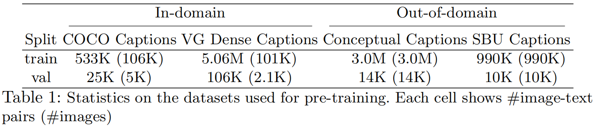

### 1.6 实验分析

#### 1.6.1 下游任务

本文通过以下任务来评价 UNITER 的效果：

1. **VQA 任务**：给定输入图像（对）和自然语言描述，基于图像内容预测答案或者判断描述正确性

   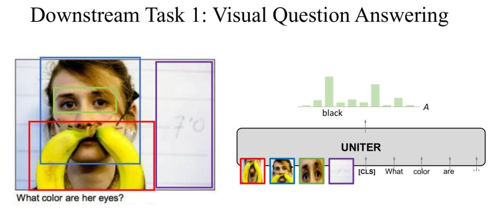

2. **Visual Entailment 任务**：使用 SNLI-VE 数据集，预测一幅图像是否与输入句子在语义上关联，分三类（"Entailment"，"Neutral"，"Contradiction"）

   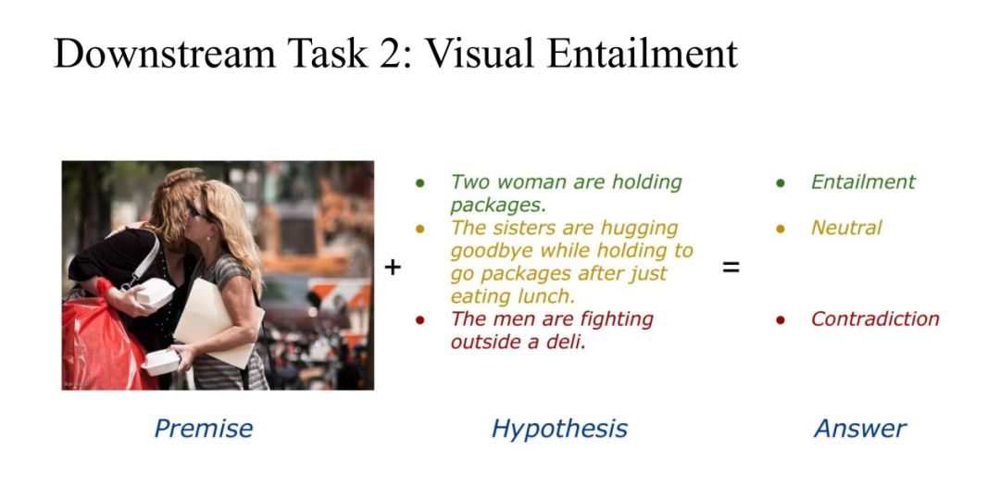

3. **NLVR^2^  任务**：输入两张 image 和一个 text，判断描述与 Image 的对应关系是否一致（true/false）

   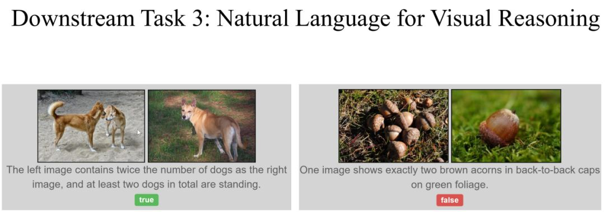

   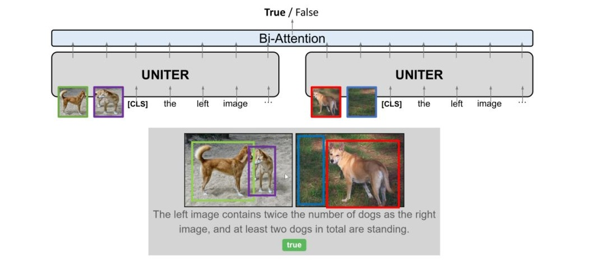

   【注】由于任务需要成对图像的比较，这里应用 UNITER 模型时<u>有三种改进</u>：

   * *Triplet*：两种图像和一个句子组成三元组 `(sen, img1, img2)`，直接得到一个 embeddings
     * *Pair*：两张图像分别与同一个句子组对 `[(sen, img1), (sen, img2)]`，得到两个独立的 embeddings 
   * *Pair-biattn*：*Pair* 的两个输出再经过 Bi-Attention 层

4. **VCR 任务**：选择题形式的任务，模型从四个答案中选择出一个答案，然后再从四个理由中选出选择这个答案的理由

   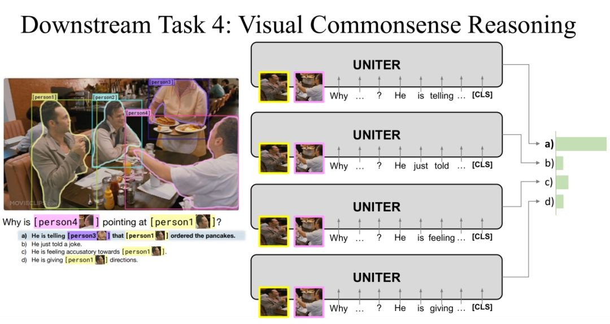

   

5. **RE 任务**：全称 Referring Expression Comprehension，即给定查询描述，从图像区域提议集合中选取正确目标，评价会用 gt boxes 和 dectected boxes

   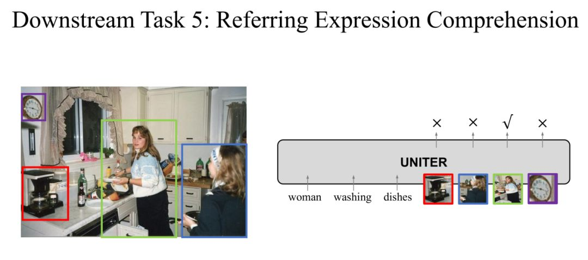

6. **Image-Text Retrieval 任务**：由它导出的 <u>IR 任务（图像检索任务）</u>和 <u>TR 任务（文本检索任务）</u>

   * 图像检索任务：给定一个句子，在 Image DataBase 中获取与句子相关的 image

   * 文本检索任务：给定一个 image，在 Text DataBase 中获取与图片相关的 text

   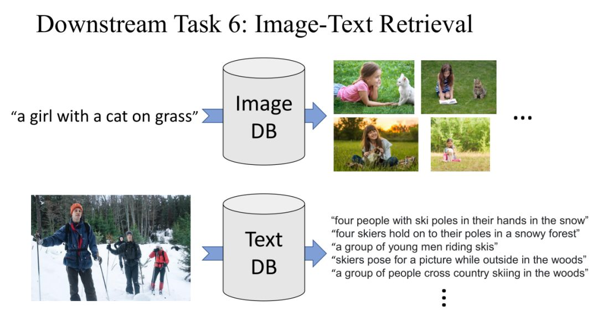

   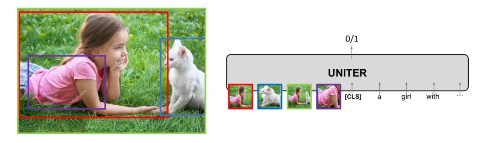

下表是各个任务的数据来源、大小和评价指标。

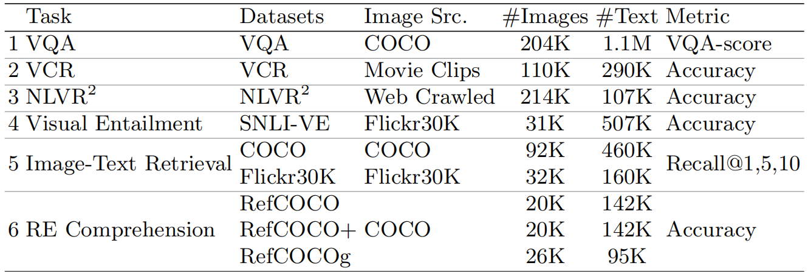

特征提取细节：

* 对于 VQA，VCR，NLVR^2^，Visual Entailment 和 Image-Text Retrieval 任务，通过多层感知器（MLP）提取 `[CLS]` token 的表示，作为输入 image-text 对的 joint embedding

* 对于 RE Comprehension，通过 MLP 计算区域级的对齐分数

问题建模细节：

* 对于 VQA，VCR，NLVR^2^，Visual Entailment 和 RE Comprehension 任务，建模为分类问题，使用交叉熵损失函数
* 对于 Image-Text Retrieval 任务，建模为排名问题

fine-tuning 细节：

* 采样三条 image-text 对，一正两负
* 负样本由随机替换其他句子/图像获得

#### 1.6.2 预训练任务评价

除了使用标准的评价指标（上表所列）外，本文还使用 Meta-Sum（所有 benchmarks 分数之和）作为全局评价指标。

下图是使用 VQA，Image-Text Retrieval（Flickr30K），NLVR^2^ 和 RefCOCO+ 作为 benchmarks 来对预训练任务进行评价的结果。

其中的<u>多模态 embeddings 均由 UNITER-base 生成</u>。

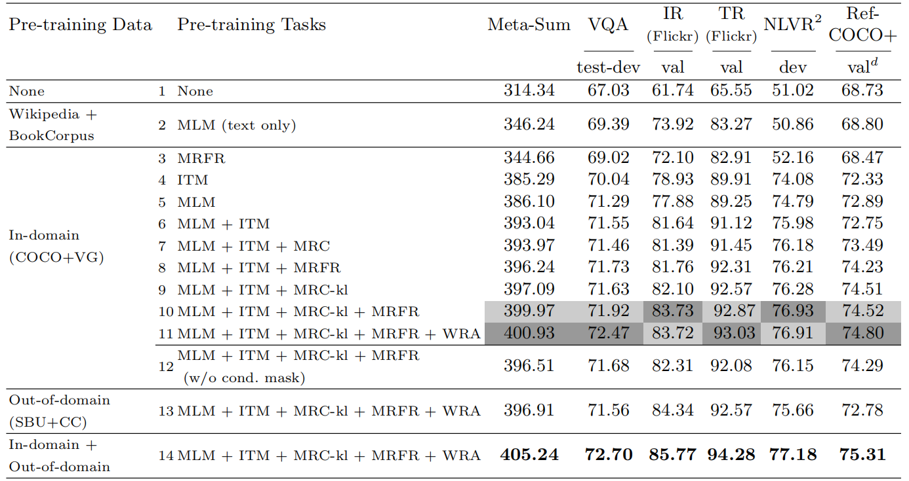

【注】这里的 MLM 任务使用 BERT 的预训练权重。

**结论：**

（1） 有文本的预训练任务比没有文本的预训练任务效果更好；

（2） Vison+Language 组合的预训练效果要好于单独的 Vision/Language；

（3） 最好的预训练组合是：MLM+ITM+MRC-kl+MRFP；

（4） 将上面提到的四个数据一起训练效果最好，这也证明数据越多效果越好。

#### 1.6.3 下游任务结果

UNITER 模型：UNITER-base 和 UNITER-large 都使用 In-domain 和 Out-of-domain 数据集，使用最优预训练任务配置 MLM + ITM + MRC-kl + MRFR + WRA.

SOTA 模型：

* VAQ：MCAN
* NLVR^2^：MaxEnt
* VCR：B2T2
* Image-Text Retrieval：SCAN
* SNLI-VE：EVE-Image
* RE Comprehension（RefCOCO, RefCOCO+, RefCOCOg）：MAttNet

其他预训练模型：

* ViLBERT
* LXMERT
* Unicoder-VL
* VisualBERT
* VL-BERT

结果总结表：

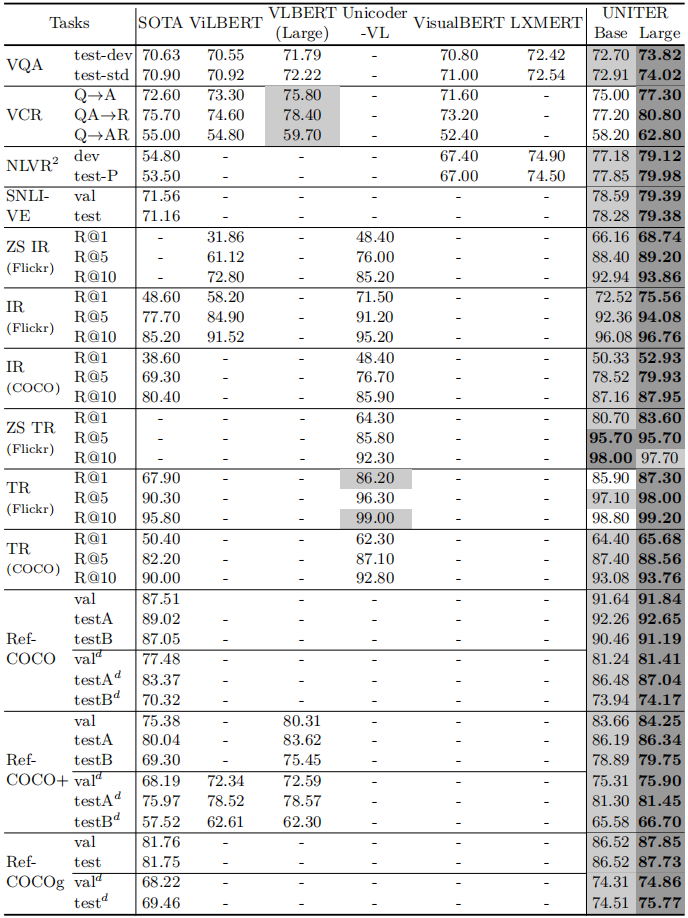

**结论：**UNITER-Base 在 9 个数据集上面几乎都好于其他的模型，而 UNITER-Large 取得了当前最好的效果。