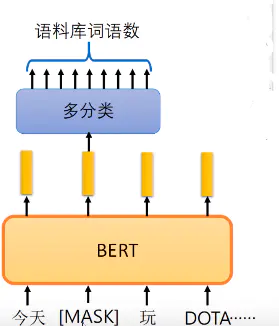

## 目录

[toc]

## 1 BERT

### 1.1 介绍

题目：BERT: Pre-training of Deep Bidirectional Transformers for Language Understanding

论点：本文利用 [Transformer](Transformer.md#1-Transformer) 设计了一个新的语言表示模型，取得了显著的效果。

### 1.2 引入

预训练模型已经被证明是提升自然语言处理任务表现的有效方法，它有**两种使用方式**：

* featured-based

  * 首先，在 big data A 上训练语言模型，训练完毕得到语言模型（用作 embedding）

  * 然后，构造 task-specific model，采用有 label 的语料 B 训练该 model，<u>将语言模型的参数固定</u>，语料 B 的训练数据经过语言模型得到 embedding，作为 task-specific model 的额外特征

  * 如 word2vec 或者 ELMo

    将上下文当作特征，但是无监督的语料和我们真实的语料还是有区别的，不一定的符合我们特定的任务，是一种双向的特征提取。

* fine-tunning

  * 首先，构造语言模型，采用 big data A 来训练语言模型

  * 然后，在语言模型基础上增加小量神经网络层实现 task-specific，采用有 label 的语料 B 来训练模型，这个过程中语言模型的参数不固定，依然是 trainable variables

  * 如 OpenAI GPT

    使用 transformer 代替 elmo 的 lstm，学习出来一个语言模型，通过下游任务 finetuning 得到目标任务的模型，相比 BERT 缺少了 encoder 以及相应的 attention 机制。

作者发现，当前的技术限制了预训练表示的能力，尤其在 fine-tunning 方式上。因为标准语言模型都是**单向的**（<u>与 Transformer 的序列性异曲同工</u>），限制预训练阶段可用的结构。

因此，本文提出 BERT 来提升基于 fine-tunning 方式的方法效果，通过 “masked language model" (MLM) 预训练目标<u>缓解单向约束</u>，通过 ”next sentence prediction" (NSP) 任务<u>捕捉句间关系</u>。

本文的主要贡献有：

* 证明双向预训练对语言表示的重要性
* 预训练表示能够减少大量大规模 task-specific 结构的使用
* BERT 在十一个 NLP 任务中提升 state of the art

### 1.3 BERT 模型

#### 1.3.1 整体结构

BERT 分为两个模块：

* pre-training
  * 模型在不同的任务上，用 unlabeled 数据进行<u>无监督</u>学习
* fine-tunning
  * 模型用 pre-training 参数初始化，然后用下游任务的 labeled 数据进行<u>有监督</u>学习

BERT 的一个**显著特征**就是，尽管 BERT 用相同的结构处理多种多样的下游任务，预训练结构与下游任务结构差异却很小。

BERT 整体结构如下图，其中的序列及其符号见后文。

#### 1.3.2 模型结构

BERT 框架和 [Transformer](Transformer.md#1-Transformer) 一样，只是做的工作不同，BERT 的目的是预训练语言模型，使其可以对句子进行 embedding，其作用可以类比 word embedding.

BERT **本质**上是多层双向 Transformer encoder（**下图的左半部分**），因此得到的 embedding 就是 encoder 的输出，shape 为 `[batch_size, sequence_length, embedding_size]`，后面的自然语言处理任务则是使用这个 embedding 作为输入特征。

本文中，设 encoders/decoders 栈堆叠层数为 $L$（即图中的 $N$），$d_{\text{model}}=H$（隐层维度），self-attention heads 数量为 $A$.

具体地，本文设置了两种大小的 BERT 模型：

* $\text{BERT}_{\text{BASE}}$ - $L=12, H=768, A=12$，总参数量为 $110M$
* $\text{BERT}_{\text{LARGE}}$ - $L=24, H=1024, A=16$，总参数量为 $340M$

其中 $\text{BERT}_{\text{BASE}}$ 主要用于与 OpenAI GPT 做对比。 

#### 1.3.3 输入表示

BERT 的 input embedding 与 [Transformer](Transformer.md#1-Transformer) 大体相同，略有修改。

首先是输入的定义：

* 为了让能够处理下游任务的多样数据，BERT 定义的输入 sequence 既可以是单个 sentence，也可以是两个 sentences 连接。

然后是输入的处理：

* 为每个 token 使用 WordPiece embeddings tokenization subword 词向量，作为单词的数值表示

* 在每个 sequence 前加入特殊的辨识 token `[CLS]`，两个 sentences 之间（和尾部）加入分隔 token `[SEP]`，得到 Token Embeddings
  * 定义 `[CLS]` 最终在 encoder 的输出向量为 $C \in \mathbb{R}^H$
  * 定义输入 token 最终在 encoder 的输出向量为 $T_i \in \mathbb{R}^H$
* 为每个 token 增加 learned embedding 表示其所属的 sentence
* 为每个 token 增加位置信息，和 Transformer 中的 Position Embedding 一样

最终按照上图将三种 Embeddings 累加得到 input embeddings.

### 1.4 Pre-training BERT

BERT 使用两种无监督任务进行预训练。

#### 1.4.1 Masked Language Model

为了训练出**深度双向表示**，作者提出任务 Masked Language Model (MLM)，可以理解为完形填空：

* **随机遮盖** sequence 里面任意字或词：
  * 将输入中 tokens 按某百分比用 `[MASK]` 遮掉，<u>避免模型将 `[MASK]` 简单地看作某个单词</u>
* 让模型通过上下文的**理解预测**那一个被遮盖或替换的部分：
  * 将 encoder 的输出向量中，对应于 mask tokens 的那部分，输入到一个 vocabulary 大小线性层并 softmax.

这里作者考虑到 <u>pre-training 的 mask 并不会用在 fine-tuning</u> 上，于是提出一种**缓和两者差异**的 mask 方式：

随机选择 15% 的 tokens 进行 mask，其中：

* 80% 替换为 `[MASK]`
  * 既可以让模型去学着预测这些 token, 又以 20% 的概率保留了语义信息展示给模型
* 10% 替换为其他一个随机的 token
  * 避免让模型死记硬背当前的 token，而是去尽力学习 token 周边的语义表达和远距离的信息依赖
* 10% 保持不变
  * 让信息不至于完全被遮掩，使得模型可以"看清"真实的 token 面貌

然后用 $T_{\text{[MASK]}}$ 预测原始的 token，使用<u>交叉熵</u>**计算被遮盖部分的** Loss 并反传梯度。

#### 1.4.2 Next Sentence Prediction

为了让模型理解**句间关系**，作者提出任务 Next Sentence Prediction (NSP)：

* 制作样本，它包含句子 A 和 B，其中
  * 50% 可能性：B 是 A 的下一个句子（标记为 `IsNext`）
  * 50% 可能性：B 是除 A 外随机选择的（标记为 `NotNext`）
* 然后传入模型，用 `[CLS]` 在 encoder 的输出向量 $C \in \mathbb{R}^H$ 来进行预测

【注】MLM 与 NSP 同时训练，用 MLM 来完成语义的大部分的学习，用 NSP 来辅助模型对噪声/非噪声的辨识。

### 1.5 Fine-tuning BERT

fine-tuning 的思路很直接：由于自注意力机制统一了单语句和语句对两种类型输入，下游任务只需要简单地将 task-specific **输入和输出传入 BERT**，然后对所有参数进行**端到端的 fine-tuning**.

对于输入 input，sentence A 和 sentence B 可以是

* 在释义中的句子对
* 在推理中的假设-前提
* 在问答里的问题-答案
* 文本分类或序列标注中退化的 $<\text{text},\emptyset>$ 对

对于输出 output，有四种使用方法

* 使用顶层的 `[CLS]` representation
* 使用顶层的 tokens representation
* 使用各层的 `[CLS]` representation
* 使用各层的 tokens representation

对于 token-level 任务，如序列标注或问答，常用 tokens representation，最好用 attention 集成各层

对于 classification 任务，如推理或情感分析，常用 `[CLS]` representation，一般使用顶层足够

> **Fine-tuning 实例**
>
> 1. 文本分类
>
> 
>
> 2. 序列标注
>
> 
>
> 3. 句子推理
>
> 
>
> 4. 问答
>
> 

### 1.6 Ablation Work

#### 1.6.1 预训练任务的效果

结论：双向 LM 和 NSP 任务带来的提升最大。

#### 1.6.2 模型大小的效果

结论：增加模型参数数量可以提升模型效果。

#### 1.6.3 两种使用方式的效果

BERT 预训练模型的输出就是一个或多个向量，下游任务的使用方式有两种：

* 参数精调（fine-tuning）：改变预训练模型参数
* 特征抽取（feature-based）：不改变预训练模型参数，只是把预训练模型的输出作为特征输入到下游任务

实验一：NER 任务

结论：最好的特征抽取方式只比精调方式差一点点，但特征抽取模型可以重复使用提升速度。

实验二：ELMo 与 BERT 对比

结论：ELMo 使用 feature-based 效果更好，BERT 使用 fine-tuning 效果更好。

### 1.7 实践总结

**适用场景**

* BERT 的长处在于 **“文本编码”**，如果 NLP 任务偏向在语言本身中就包含答案，而不特别依赖文本外的其它特征，往往应用 Bert 能够极大提升应用效果
* BERT 由于 NSP 任务的句间推理特点和 Attention 句间匹配特点，特别适合解决句子或者段落的**匹配类任务**
* BERT 由于 Transformer 层次较深，可以逐层捕获不同层级不同深度的特征，适合解决需要**深层语义特征的任务**
* BERT 由于 Attention 的复杂度是时间的平方，因而适合解决输入**长度不太长**（句子级别或者段落级别）的 NLP 任务

## 2 RoBERTa

### 2.1 介绍

题目：RoBERTa: A Robustly Optimized BERT Pretraining Approach

论点：本文深入研究 BERT 的预训练过程，提出一整套 BERT 的设计选择和训练策略，称为 RoBERTa.

### 2.2 引入

NLP 领域的自监督学习发展的如火如荼，如 ELMo, GPT, BERT, XLM, XLNet 等，它们在各种任务中带来了极大的提升。但是问题也随之而来：模型方法不同方面的表现难以评价、预训练的计算量巨大、预训练的语料常受到保护，等等。

于是，本文以 BERT 模型作为研究对象，复现其训练过程，发现 BERT 存在很大程度的训练不充分线性，并改进为 RoBERTa：

* 用更大的 batch size，更多的数据训练更长时间
* 移除 NSP（next sentence prediction）目标函数
* 用更长的序列长度（max_seq_length）训练
* 在训练数据上动态更新 masking pattern

在 GLUE，SQuAD，RACE 三个榜单上取得 SOTA 效果。

本文的主要结论如下：

* 提出了一套重要的 BERT 设计选择和训练策略，并提出能够提高下游任务性能的一种选择
* 使用一个新的数据集 CCNEWS，并证实使用更多的数据进行预训练可以进一步提高下游任务的性能
* 在正确的设计选择下，预训练的 MLM 任务比其他最近发表的预训练任务更具有竞争力

### 2.3 改进

本文首先对 BERT 进行完整的复现：输入序列处理、模型结构、预训练目标函数、优化器配置、数据语料，其具体内容在原论文 `2 Background` 和 `3 Experimental Setup` 中有详实的记录。

#### 2.3.1 动态 mask

MLM 任务中模型会随机挑选 token进行 mask，这一步在数据预处理过程中进行。

这一使得原有的 bert 在仅会 mask 一次，称为 **static mask**：每个 epoch 中每个训练样本都将使用相同的 mask pattern.

本文设计 **dynamic mask**：把训练数据复制 10 份，这样在 40 个 epoch 的训练过程中，每个样本将有 10 种不同的 mask pattern.

对比实验结果如上，证明了 dynamic mask 的有效。这可能是因为更换数据的 mask 方式后，**提高了模型输入的数据的随机性，使得模型学习到更多的 pattern**.

#### 2.3.2 输入格式与 NSP

NSP 任务判断两句话是不是连续的一句话，正例是从文章中挑选的连续的两句话，负例是从不同的文章中挑选的两句话。

本文怀疑 NSP 任务对模型的提升效果，并设计以下对比实验。

* SEGMENT-PAIR + NSP：传统的 Bert 的输入和 NSP 任务，每个输入有一对 segments，总长度要求小于 512
* SENTENCE-PAIR + NSP：输入和 Bert 相同，每一个输入有一对 sentences，总长度远小于 512 故采用更大的 batch 保证 tokens 数量相近
* FULL-SENTENCES：不会截断句子，句子的边界可能会跨过 document 直至长度接近 512，不使用 NSP Loss
* DOC-SENTENCES：数据和 FULL-SENTENCES 类似，但句子不会超过 document 故同样动态调整 batch size，不采用 NSP Loss

作者发现，

* 使用单句子会降低模型在下游任务的表现（斜杠右边的数字）

* **不采用 NSP Loss 可以轻微提升模型的效果**

* DOC-SENTENCES 的效果优于 FULL-SENTENCES 的效果（为避免动态调整 batch size，本文使用 FULL-SENTENCES）

#### 2.3.3 更大的 batch size

在机器翻译任务中，有人发现采用更大的 batch 可以提高模型的训练速度和下游任务的效率。

Bert-base 中采用 256 的 batch size 训练 1M 步，这和 2K batch size, 125K epoches， 以及 8K batch size, 31K epoches 相同。

作者对比了不同的batch size的下游任务的困惑度（perplexity），

发现**更大 batch size 的模型可以获得更好的效果，**并且有利于并行训练。

#### 2.3.4 Text Encoding

Bert-base 中采用 WordPiece Encoding，就是把单词拆成一片一片的，这种编码在处理数字的时候非常明显，对于长度比较长的数字例如 “912378”，通过WordPiece Encoding 就会变成 “[912, #378]” 这样做的好处是，**可以用常见的 word piece 拼接得到输入字符，降低词典的大小。**

WordPiece Encoding 的一种主要实现方式就是 BPE（Byte-Pair Encoding）双字节编码，有关BPE的算法可以上网搜索，这里不是重点。BPE 算法的词表大小通常在 10K-100K 之间，词表大多数元素都是 unicode 编码，不过论文《Language models are unsupervised multitask learners》采用 byte 编码替代 BPE 中的 unicode 编码，可以将词表的大小缩小到 50K。

在 Bert-base使用的词表大小是30K，本文作者使用了《Language models are unsupervised multitask learners》中的编码方法，采用更大的数据集训练了 50K大小的词表，**不过实验表明两种编码方法对模型的效果影响并不大。**

### 2.4 实验分析

上一节中作者分别从 batch size，mask，NSP 任务和 text encoding 进行了实验，这部分作者将上文对 Bert 的实验效果整合在一起：

* 采用 dynamic mask
* 采用 Full-Sentence 即无 NSP Loss
* 采用 large mini-batches 
* 采用 byte 编码 BPE 算法得到 50K 大小的词表

使用 bert-large的结构，在 BOOKCORPUS + WIKIPEDIA 上训练 100K 步，得到的结果如下。

GLUE 榜单：

SquAD 榜单：

RACE 榜单：

