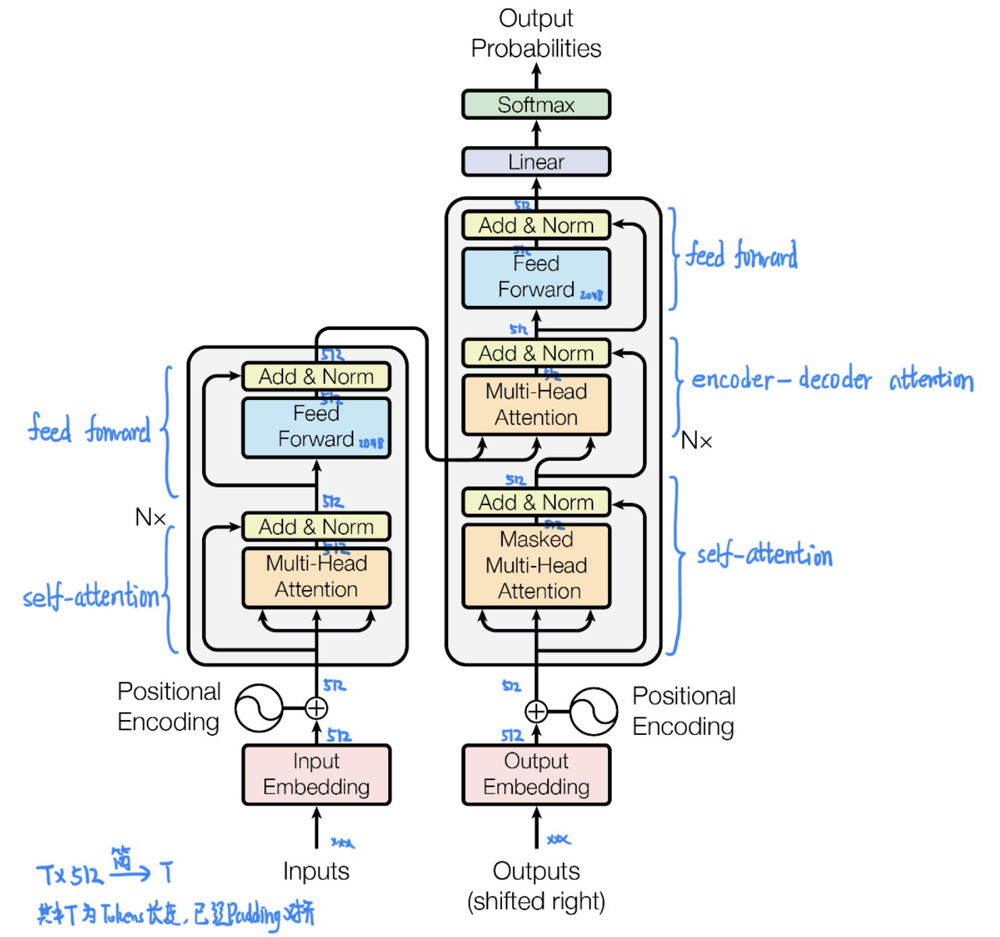

## 目录

[toc]

## 1 Transformer

### 1.1 介绍

题目：Attention Is All You Need

论点：本文提出了仅基于注意力机制的网络结构——Transformer，其效果、复杂度、并行度均有突破，拥有极高的泛化性能。

【参考资料】

[1]: https://www.jianshu.com/p/25fc600de9fb	"BERT泛读系列（一）——《Attention is All You Need》论文笔记 - 简书"
[2]: https://www.jianshu.com/p/29e31b73528e	"BERT(一) Transformer原理理解 - 简书"
[3]: https://www.jianshu.com/p/7c1ad1823206 "BERT(二) BERT解读及应用"
[4]: https://zhuanlan.zhihu.com/p/47812375	"[整理] 聊聊 Transformer"

### 1.2 引入

传统的序列转换模型基于复杂的循环/卷积神经网络（循环神经网络，长短期记忆网络，gated recurrent neural network），在一段时间占据着序列模型和转换问题中的主流。

一方面，尽管有着许许多多的改进，这类模型的固有特性——**序列性**，一直在限制着并行化的潜力，该问题在大模型上非常突出；

另一方面，**注意力机制**已经成为了处理序列模型和转换模型的基本手法，但除了少数几种情况，它都是与循环网络一同使用，难以发挥其巨大的潜力。

本文提出了 Transformer 网络结构，在避开循环网络的同时，完全使用注意力机制的作用，取得很显著的效果。

### 1.3 整体结构

#### 1.3.1 结构流程

大多数先进的神经网络转换模型都有一个 “encoder-decoder” 结构。

给定输入序列的符号表示 $(x_1,\dots,x_n)$，encoder 将输入映射到一个连续性表示 $z=(z_1,\dots,z_n)$。然后给定 $z$，decoder 会生成输出序列 $(y_1,\dots,y_n)$，顺序为每次一个元素，如下图所示。

本文的 Transformer 沿用了这一框架，并**堆叠**了多层。如下图所示，本文使用了 6 层的 Encoder 栈和 6 层的 Decoder 栈。根据 Attention 机制的要求，最后一层 Encoder 的输出会输入给每一个 Decoder 层。

其动态流程图如下。

【注】Transformer 的窗口大小为 $512$，对于过短数据用 padding 处理，过长数据采取分段处理，其对长序列的训练和预测流程如下：

#### 1.3.2 Encoder 和 Decoder 栈

模型总体结构如下图所示：

**Encoder 栈**

* Encoder 栈包含 6 个相同的层，每层有两个子层

  * 第一个子层是一个多头自注意力机制（Muti-Head Self Attention）

  * 第二个子层是一个简单的全连接前馈神经网络（Feed Forward）

  * 在每个子层结束，使用残差网络和正则化处理（Add & Norm）

    * 即对每个子层（Sublayer）输出 $x$，都有 $\text{LayerNorm}(x+\text{Sublayer}(x))$
    * Add 操作原理参考 Resnet，是为了训练深层网络时，减少信息损失
    * Norm 操作是为了处理网络层数值过大/小问题，保证训练的稳定性

* 为了利用这些残差连接，模型中的所有 sublayers、embedding 层的输出的 token **维度统一为 $d_{\text{model}}=512$**

**Decoder 栈**

* Decoder 栈也包含 6 个相同的层，每层有三个子层

  * 第一个和第三个子层与 Encoder 的相同，分别是 Muti-Head Self Attention 和 Feed Forward
* 第二个子层处理的是来自 Encoder 栈和 Decoder 栈第一子层的注意力（Muti-Head Context Attention）
  * 在每个子层结束，使用残差网络和正则化处理（Add & Norm）

    * 即对每个子层（Sublayer）输出 $x$，都有 $\text{LayerNorm}(x+\text{Sublayer}(x))$
    * Add 操作原理参考 Resnet，是为了训练深层网络时，减少信息损失
    * Norm 操作是为了处理网络层数值过大/小问题，保证训练的稳定性
  * 解码器将编码器的输出视为生成的上下文，因此需要这层来引入序列上下文信息
  
* 为了保证 Decoder 的自回归性（不能看到未来的信息），会对 Self-Attention 进行 mask 和 offset 处理

### 1.4 具体结构

#### 1.4.1 注意力机制

##### 1.4.1.1 回顾

Attention 函数可以描述为从 query（Q） 和 key-values（K-V） 集合到 output 的一个映射，其中 query、key、value 和 output 都是向量，output 是所有 value 的加权和，权重由 query 和每个 key 计算得到，计算分三步：

1. 计算比较 Q 和 K 的相似度 $f(Q,K_i)_i$，相似度的计算方法有一些 4 种

   * 点乘 Dot-Product：$f(Q,K_i)_i=Q^T K_i$
   * 权重 General：$f(Q,K_i)_i=Q^T W K_i$
   * 拼接权重 Concat：$f(Q,K_i)_i=W [ Q^T ; K_i ]$
   * 感知器 Perceptron：$f(Q,K_i)_i=V^T \tanh (WQ+UK_i)$

2. 将得到的相似度进行 softmax 归一化
   $$
   \alpha_i = \frac{e^{f(Q,K_i)_i}}{\sum_{j}e^{f(Q,K_i)_j}}
   $$

3. 用计算出来的权重，对所有 values 进行加权求和，得到 Attention 向量
   $$
   \sum_{i}\alpha_i V_i
   $$

##### 1.4.1.2 缩放点积注意力

本文使用的 Attention 是 dot-product，不过进行了一些改动。

设 queries 和 keys 输入的 token 维度为 $d_k$，values 的 token 维度为 $d_v$. 在计算 Dot-Product 之后，除以 $\sqrt{d_k}$，用 softmax 加权求和，公式为：
$$
\text{Attention}(Q,K,V) = \text{softmax} \left ( \frac{QK^T}{\sqrt{d_k}} \right )V
$$
【注1】additive/perceptron attention 和 scaled/dot-product attention 较为常用，并且理论复杂度近似，选取后者原因是

* 现有成熟的矩阵运算方法，使得后者在时间上更快，空间上更省

【注2】dot-product attention 进行 scaled 化的原因是

* 对于小的 $d_k$，上述两种计算方法效果近似
* 但对于大的 $d_k$，点积结果值很大，会进入 softmax 的小梯度区域（数值大，梯度小），于是除以 $\sqrt{d_k}$ 来缓解

<u>例：Scaled Dot-Product Attention 计算过程</u>

> 取 $n=2$, $d_k=d_v=3$，计算的是 self attention.
>
> 首先计算出 self attention 的 query（Q）, key（K）, value（V）,
>
> 
>
> 然后计算 $QK^T$，scaled 之后再 softmax 得到相似度矩阵，最后对 values 加权求和.
>
> 

##### 1.4.1.3 多头注意力

Multi-Head Attention 是一种扩展性更高、并行度更高的 Attention 计算方式，是Attention机制的完善。

它把 Scaled Dot-Product Attention 的过程做 h 次（并行），然后把输出连接起来，如下图：

它的计算公式为：
$$
\text{MultiHead}(Q,K,V) = \text{Concat}(\text{head}_1,\dots,\text{head}_\text{h})W^O
\\
\text{head}_1 = \text{Attention}(QW^Q_i,KW^K_i,VW^V_i)
$$
其中投影矩阵为 $W^Q_i \in \mathbb{R}^{d_{\text{model}} \times d_k}$，$W^K_i \in \mathbb{R}^{d_{\text{model}} \times d_k}$，$W^V_i \in \mathbb{R}^{d_{\text{model}} \times d_v}$ 和 $W^O \in \mathbb{R}^{hd_v \times d_{\text{model}}}$. 本文中，取 $h=8$，$d_k=d_v=d_{\text{model}}/h=64$，由于每个头维度减小，故总的花费与满维度的 single-head attention 近似。

【注1】多头注意力相比普通注意力的优势：

* 并行度更高
* 允许模型在不同位置同时关注来自不同表示子空间的信息，单个注意力头的平均操作会一致这种情况
  * 扩展模型集中于不同位置的能力
  * 赋予 attention 在多种子空间的表达方式

【注2】头数不是越多越好，在头足够的情况下就能够有关注位置信息、关注语法信息、关注罕见词的能力了，在加下去无非就是一种 enhance 或 noise 而已。

<u>例：Multi-Head Attention 计算过程</u>

> 取 $h=8$，$d_k=d_v=d_{\text{model}}/h=64$
>
> 模型的基本参数表示如下，
>
> 
>
> 将 Scaled Dot-Product Attention 做 $h=8$ 次，得到 8 个 attention 输出，
>
> 
>
> 然后将这些 attention 拼接起来重新映射到给定的输出维度上。
>
> 

##### 1.4.1.4 使用注意力

在本文的 Transformer 中，Multi-Head Attention 有三种不同的使用：

* Encoder-Decoder Attention
  * queries 来自 decoder 前一个 sublayer 的输出
  * memory keys 和 values 来自同层 encoder 的输出，用于整个句子信息的集成
  * 进行 padding mask 处理
* Encoder 的 Self-Attention
  * 所有的 keys，values 和 queries 都来自 encoder layer 的前一层
  * 进行 padding mask 处理
* Decoder 的 Self-Attention
  * 所有的 keys，values 和 queries 都来自 decoder layer 的前一层
  * 进行 padding mask 和 sequence mask 处理，保证<u>自回归性（decoder 在计算的时候，不能看到未来的信息）</u>
  
  

#### 1.4.2 前馈神经网络

Encoder 和 Decoder 都有一个全连接前馈网络（Feed Forward Networks），分布独立地作用于每一个位置（token）。它在两个线性变换之间有一个 ReLU 激活函数：
$$
\text{FFN}(x) = \max (0, xW_1+b_1)W_2+b_2
$$
本文中，网络输入和输出的 token 维度均为 $d_{\text{model}}=512$，隐层维度为 $d_{ff}=2048$. 虽然线性变换在不同位置上是相同的，但它们在层与层之间使用不同的参数。

【注】FF 子层的理解：attention 机制只解决了长距离依赖问题，FF 子层本质是非线性变换，解决特征提取问题。

#### 1.4.3 Embeddings

##### 1.4.3.1 输入输出

那么<u>刚开始</u>怎么得到我们的 input embedding 呢？

本文使用 learned embeddings 转换 input 和 output 为 $d_{\text{model}}$ 维的 embedding 向量。

* 对于英文，可以通过结合切换符号以及结合 wordpiece 机制进行分词
  * 关于 wordpiece 的理解，可以认为就是将本来有的英文单词再进行切分得到 subword 英文
  * 考虑到单词的时态，单复数等变化情况，这种方式可以使得模型训练效果更加好
* 对于中文，可以通过分词或者按照每个字进行切分，这里建议推荐利用字进行切分
  * 因为相对于字来说，常用的汉字也就是 4000 多个
  * 如果用分词，就会有很多组合，需要准备大型的词库，对于训练模型不够友好

另外，模型的输入大小要保持一致性，因此对于不同长度大小的 sequence：

* 对于短语句，一般通过加入 padding 项的方法，使其长度补齐
* 对于长语句，一般采用截断的方法，使其长度对齐

【注】encoder embedding 层、 decoder embedding 层和 softmax 前的线性变换层，使用相同的权重矩阵，并且两个 embedding 层的权重乘以 $\sqrt{d_{\text{model}}}$.

##### 1.4.3.2 位置编码

由于模型既没有循环也没有卷积，因此顶多是一个非常精妙的词袋模型而已，即使将 K，V 按行顺序打乱，Attention 结果也是**一样**的。

因此，**必须**给每个 token 都引入位置信息（Positional Encoding），让 Attention 可以分辨出不同的词。本文直接给出了一个 Position Embedding 构造公式：
$$
\begin{align}
PE_{pos,2i} & =\sin\left(\frac{pos}{10000^{\frac{2i}{d_{\text{model}}}}}\right) \\
PE_{pos,2i+1} & =\cos\left(\frac{pos}{10000^{\frac{2i+1}{d_{\text{model}}}}}\right)
\end{align}
$$
其中，$pos$ 是 token 位置，$i$ 是 token 的 embedding 的第 $i$ 个维度。

<u>绝对位置信息</u>：公式在偶数维度使用正弦编码，在奇数维度使用余弦编码，

<u>相对位置信息</u>：作者使用三角函数进行编码，于是给定偏移量 $k$，由于 $\sin(\alpha+\beta)=\sin\alpha\cos\beta+\cos\alpha\sin\beta$ 以及 $\cos(\alpha+\beta)=\cos\alpha\cos\beta-\sin\alpha\sin\beta$，使得 $PE_{pos+k}$ 能表示为 $PE_{pos}$ 的线性变换，这提供了表达**相对位置信息**的**可能性**。

<u>直观理解</u>：

上图每一行表示一个字的位置编码，共 100 个字（行），字的维度是 15，每个值在 -1 至 1 之间，然后进行的可视化。图里分界的原因是，正弦编码与余弦编码在交替，然后拼接得到的。

可以看到，在每个维度 $i$ 都有一个不同周期的三角函数，并且 $i$ 越大，周期越小，从而组合在每个 $pos$ 上，得到独一无二的位置信息。

【注】Transformer 对过长数据采取分段处理，一个序列**不同段的同一位置其位置编码相同**，因此 Transformer 的位置编码是**相对于片段的绝对位置编码**，与当前内容在原始句子中的相对位置没有关系。

#### 1.4.4 Linear & Softmax

Linear 和 softmax 层转换 decoder output 为 predicted next-token probabilities。

然而解码器最后输出浮点向量，如何将它转成词？

* linear 层是个简单的全连接层，将解码器的最后输出映射到一个**非常大**的 logits 向量上
* softmax 层将这些分数转换成概率值（都是正值，且加和为1），最高值对应的维上的词就是这一步的输出单词

【注】encoder embedding 层、 decoder embedding 层和 softmax 前的线性变换层，使用相同的权重矩阵，并且两个 embedding 层的权重乘以 $\sqrt{d_{\text{model}}}$.

### 1.5 细节总结

#### 1.5.1 含有 dropout 的结构

* embedding
* self attention
* FFN

### 1.6 实验分析

#### 1.6.1 Self-Attention 的优势

Self-Attention 在三种指标上占优：

* total computational complexity per layer - 总的计算复杂度
* minimum number of sequential operations - 度量可以并行化的计算数量
* path length between long-range dependencies - 学习长距离依赖是很多序列转换任务的关键挑战，其中的关键因素是前向和后向信号在网络中穿越的长度

