## 目录

[toc]

## 1 PTMs

### 1.1 介绍

题目：Pre-Trained Models: Past, Present and Future

论点：本文深入研究预训练的历史，全面回归 PTMs 的突破性进展，并讨论预训练模型的一系列开放性问题和研究方向。

### 1.2 预训练发展

#### 1.2.1 迁移学习

##### 1.2.1.1 概念

在深度神经网络 “<u>数据饥饿</u> (Data Hungury)” 的挑战下，迁移学习成为<u>高效利用有限标注数据</u>的曙光，是预训练的早期努力。

迁移学习旨在从多个源任务获取重要的知识，然后应用到目标任务上，如同人类运用已有知识解决新问题。因此它的<u>基本假设</u>是源任务包含目标任务所需的知识，<u>关键工作</u>是建立源任务到目标任务的知识桥梁。

迁移学习形成一个两阶段的学习框架：

* 预训练阶段：从一个或多个源任务中捕获知识
* 微调阶段：将捕获到的知识迁移的新的的目标任务上

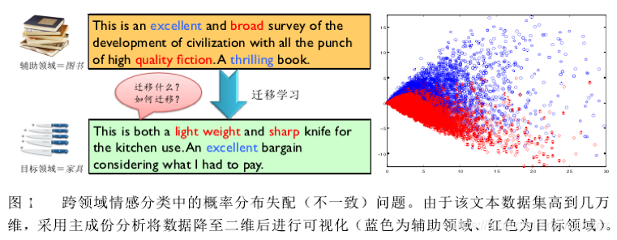

##### 1.2.1.2 定义

它的数学定义和分类如下：

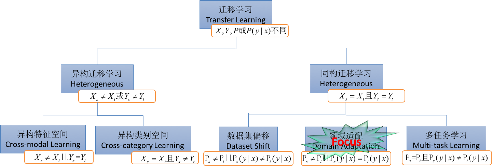

* $\mathcal{X}$ 表示特征空间，$P(X\in\mathcal{X})$ 是其上的概率分布，构成域 *domain* $D=\{\mathcal{X},P(X)\}$
* $\mathcal{Y}$ 表示标注空间，$P(Y\in \mathcal{Y} \mid X)$ 是从特征空间到标注空间的映射函数，构成任务 *task* $T = \{\mathcal{Y},P(Y\mid  X)\}$
* 下标 $s$ 表示源任务，下标 $t$ 表示目标任务，以作区分

##### 1.2.1.3 方法

两种广泛使用的迁移方法：

* 特征迁移

  预训练有效的特征表示，对跨领域和任务的知识进行预编码，然后引入这些预训练的表征到目标任务中。

  例如：word embedding，ELMo

* 参数迁移

  假设源任务和目标任务可以共享模型参数或超参数的先验分布，将知识编码进共享模型参数中，再在目标任务数据上微调参数。

  例如：pre-trained CNNs，BERT

因此某种程度上，特征迁移和参数迁移奠定了 PTMs 的基础，更详细的如下图所示。

##### 1.2.1.4 发展

迁移学习按照源任务和目标任务数据有无标注，可以分为以下四类，预训练在此基础上发展而来。

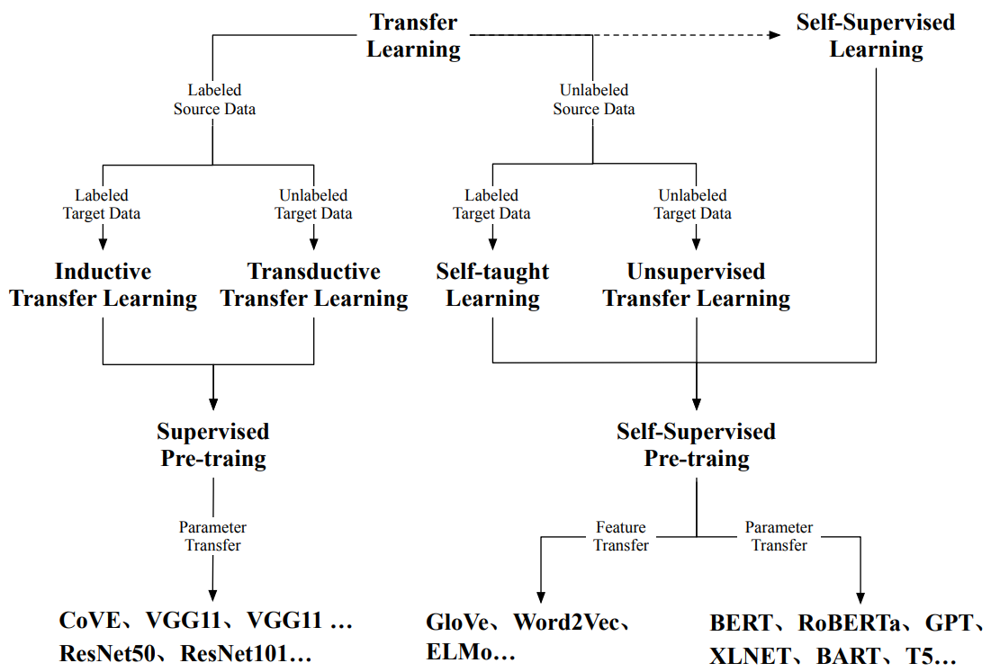

#### 1.2.2 有监督到自监督

##### 1.2.2.1 有监督预训练

从 AlexNet (Krizhevsky et al., 2012) 开始，深度神经网络以其显著的效果成为 AI 研究的热门，并发展加深为 VGG (Simonyan and Zisserman, 2015) 至 GoogleNet (Szegedy et al., 2015)，直到 ResNet (He et al., 2016) 通过**归一化**和**残差连接**有效应对梯度消失/爆炸问题后，开启了深度学习的飞速发展。

CV 领域是有监督预训练发展的主要受益方，ResNet 也是 CV 领域上的有监督预训练模型。通过引用 ImageNet 上预训练的 ResNet 作为里程碑，不同 CV 任务飞快发展，比如图片分类，目标检测，图像分割，图片捕获和视觉问答等。

不过受此启发 NLP 领域也有 CoVE (McCann et al., 2017) 等探索。

##### 1.2.2.2 自监督预训练

无标注数据的规模远大于人工标注数据的规模，而随着<u>自监督学习的发展和入局</u>（上图右上角），使得对大规模无监督数据进行预训练成为可能。类似 CV 领域有监督预训练的进步，NLP 领域无监督预训练也取得长足发展。

早期的 NLP PTMs 是词嵌入模型（word embeddings）(Collobert and Weston, 2008; Mikolov et al., 2013b; Pennington et al., 2014)，其利用自监督方法将词转化为分布式表征，并由 Peters et al. (2018) 输入到序列级神经模型中来捕获上下文特征，自此使用词嵌入作为神经模型的输入成为 NLP 任务的常用模式。

Transformer (Vaswani et al., 2017) 通过**注意力网络**解决序列数据问题，将 NLP 领域的研究推进到深层、预训练的阶段，诞生出 GPT、BERT 等经典预训练模型，目前的 SOTA 为 XLNET (Yang et al., 2019)，RoBERTa (Liu et al., 2020d)，BART (Lewis et al., 2020a)，T5 (Raffel et al., 2020) 等。

Transformer 的成功，使得在 NLP 任务上使用基于 Transformer 的预训练模型已经成为标准步骤。除此之外，目前 Transformer 还在 CV 和多模态领域取得可喜的效果。

【注】自监督学习和无监督学习的区别

* 自监督学习可以认为是无监督学习的一个分支
* 无监督学习着重于抽取数据模式，比如聚类，社区发现，异常检测等
* 自监督学习仍然延续着监督学习的范式

#### 1.2.3 Transformer 时代

从上面可以知道，PTM 成功的关键是自监督学习和 Transformer 的成功整合，开启了预训练模型的 Transformer 时代。目前两个基于 Transformer 的经典 PTM 是 GPT 和 BERT，所有后续介绍的 PTMs 都是这两个模型的变体。

##### 1.2.3.1 预训练框架

预训练结构多种多样，主要分为如下三种框架，优缺点各异：

* AR (Auto Regressive) 语言模型
  * 优点：对生成模型友好，天然<u>符合生成式任务的生成过程</u>
  * 缺点：只能利用单向语义而<u>不能同时利用上下文信息</u>
  * 代表：GPT

* AE (Auto Encoding) 语言模型
  * 优点：能够很好的编码上下文/双向语义信息， 在<u>自然语言理解相关的下游任务</u>上表现突出
  * 缺点：`[MASK]` 标记导致<u>预训练与微调输入不一致</u>；独立性假设忽略了 masked token 间的关系
  * 代表：BERT

* ED (Encoder-Decoder) 模型
  * 优点： 适合带条件的文本生成任务
  * 缺点：参数量倍增
  * 代表：Transformer，T5

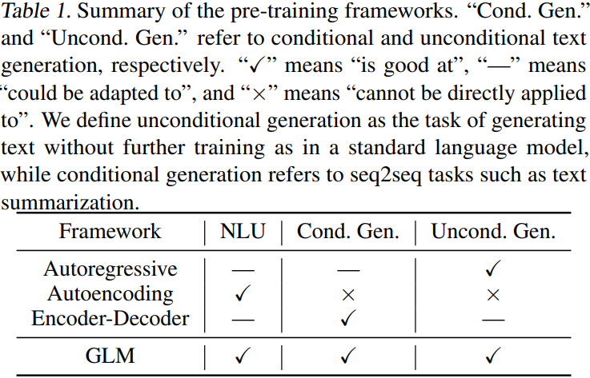

三种框架的代表结构图如下。

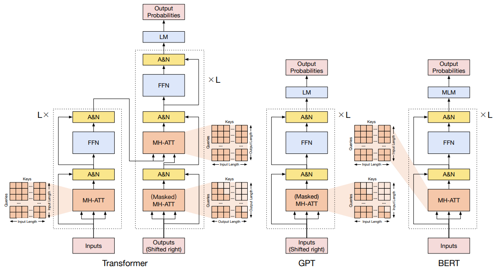

##### 1.2.3.2 Transformer

**网络结构**

Transformer 由一个编码器和一个解码器组成，编码器和解码器都是由几个相同的块堆叠而成。其中，编码器块由一个<u>多头的 self-attention 层</u>和<u>位置前馈层</u>组成，解码器块还有一个附加的 cross-attention 层。

在神经层之间，采用了<u>残差连接和层归一化</u>，用于支持深度神经网络的构建。

**Attention Layer**

给定查询集 $Q = \{q_1, q_2, \dots, q_{d_k} \}$，键集 $K = \{k_1, k_2, \dots, k_{d_k} \}$ 和值集 $V = \{v_1, v_2, \dots, v_{d_v} \}$.

Transformer 采用缩放的点积注意力：

$$
\begin{align}
H & = \text{ATT}\left( Q,K,V \right) = AV \\
 & = \text{Softmax}\left( \text{ATT-Mask}\left( \frac{QK^T}{\sqrt{d_k}} \right) \right) V
\end{align}
$$

其中掩码函数 $\text{ATT-Mask}(\cdot)$ 用于限制每个查询向量可以参与哪些键值对：

$$
\text{ATT-Mask}(x) = 
\left\{\begin{align}
-\infin, & \space \space q_i \space 与 \space v_j \space 不参与\\
x, & \space \space q_i \space 与 \space v_j \space 参与
\end{align}\right.
$$

Transformer 没有使用普通缩放的点积注意力，而是进一步改进为多头注意力层：
$$
\begin{align}
H & = \text{MH-ATT}\left ( Q,K,V \right ) \\
& = \text{Concat} \left ( H_1, \dots, H_h \right ) W^O \\
H_i & = \text{ATT}\left ( QW_i^Q, KW_i^K, VW_i^V \right )
\end{align}
$$
其中，$W_i^Q, W_i^K, W_i^V$ 分别用于将 $Q,K,V$ 投影到第 $i$ 个 head attention 的特征空间，$W^O$ 将连接投影到最终输出空间。

**Position-Wise Feed-Forward Layer**

给定输入 $X\in \mathcal{R}^{n\times d_{\text{model}}}$，Transformer 的位置前馈层为：
$$
\text{FFN}(X) = \text{Act}(xW_1+b_1)W_2+b_2
$$
其中激活函数 $\text{Act}(\cdot)$ 一般为 ReLU，$W_1 \in \mathcal{R}^{d_{\text{model}}\times d_{ff}}$，$W_2 \in \mathcal{R}^{d_{ff}\times d_{\text{model}}}$，$b_2 \in \mathcal{R}^{d_{\text{model}}}$，$d_{ff}$ 一般远大于 $d_{\text{model}}$.

**Residual Connection and Normalization**

Transformer 在各个神经层之间应用了残差连接和层归一化，使 Transformer 的架构有可能变得更深。
$$
H = \text{A\&N}(X) = \text{LayerNorm}\left(f(X)+X\right)
$$
##### 1.2.3.3 GPT

**网络结构**

GPT 以 Transformer 解码器作为主干，应用生成式预训练和判别式微调。

**预训练**

给定大规模无标注语料，GPT 优化标准的**自回归语言模型 (Auto Regressive)**，即通过给定前文单词作为 context，最大化所有单词的条件概率。

形象地说，对每个单词，GPT 通过其之前的单词计算该单词的概率分布，如下图所示。

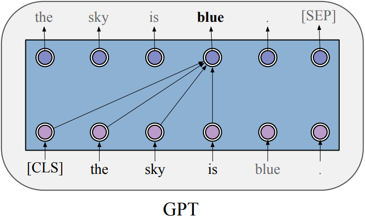

一般地说，给定包含 tokens $\mathcal{X} = \left \{ x_0, x_1, \dots, x_n, x_{n+1} \right \}$ 的语料，GPT 通过最大化如下 log-likelihood 目标函数：
$$
\mathcal{L}(\mathcal{X}) = \sum_{i=1}^{n+1}\log P\left ( x_i \mid x_{i-k}, \dots, x_{i-1}; \Theta \right )
$$
其中 $k$ 是窗口大小，概率函数 $P$ 由 Transformer 解码器用参数 $\Theta$ 建模，$x_0$ 是特殊标记 `[CLS]`，$x_{n+1}$ 是特殊标记 `[SEP]`.

**微调**

GPT 通过微调来完成对下游特定任务的适应。它从预训练参数作为起点，使用简单、额外的输出层优化下游任务的目标函数。

##### 1.2.3.4 BERT

**网络结构**

BERT 以 Transformer 编码器作为主干，有预训练和微调两个独立的阶段。

**预训练**

给定大规模无标注语料，BERT 优化标准的**自编码语言模型 (Auto Encoding)**，即给定上下文信息作为 context，预测被遮挡的单词，也称为掩码语言模型 <u>MLM (Masked Language Model)</u>。

形象地说，用一个特殊 token [MASK] 随机屏蔽序列中的某个 token，然后用上下文预测屏蔽位置的单词，如下图所示。

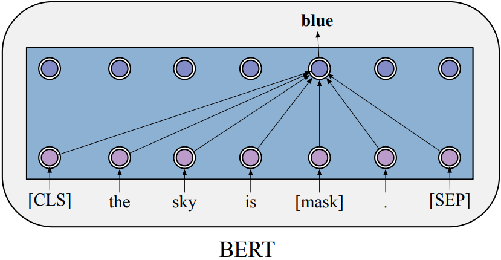

一般地说，给定包含 tokens $\mathcal{X} = \left \{ x_0, x_1, \dots, x_n, x_{n+1} \right \}$ 的语料，BERT 随机屏蔽 $\mathcal{X}$ 中的 $m$ 个 token，并最大化以下对数似然函数：
$$
\mathcal{L}(\mathcal{X}) = \sum_{i=1}^{m}\log P\left ( \text{[Mask]}_i = y_i \mid \tilde{\mathcal{X}}; \Theta \right )
$$
其中概率函数 $P$ 由 Transformer 编码器用参数 $\Theta$ 建模，$\tilde{\mathcal{X}}$ 由 $\mathcal{X}$ 随机屏蔽 $m$ 个 token 得到，$\text{[Mask]}_i$ 是第 $i$ 个屏蔽位置，$y_i$ 是该位置的原始标记。

除了 MLM 之外，还采用 <u>NSP (Next Sentence Prediction)</u> 目标捕捉句子之间的话语关系，其使用二元分类器预测两个句子是否连贯。

**微调**

MLM 和 NSP 共同优化 BERT 的参数后，BERT 通过下游的数据优化输入和输出。

##### 1.2.3.5 之后

GPT 和 BERT 之后，涌现出许多改进，如 RoBERTa 和 ALBERT.

<u>RoBERTa (Liu et al., 2020d)</u> 是 BERT 的一种成功的改进，其主要有四个**简单有效的改进**：

* 用更大的 batch size，更多的数据训练更长时间
* 移除 NSP（next sentence prediction）目标函数
* 用更长的序列长度（max_seq_length）训练
* 在训练数据上动态更新 masking pattern

<u>ALBERT(Lan et al., 2019)</u> 是 BERT 的另一个重要变体，它提供了几个关于**减少参数的方法**：

* 首先，它将输入词嵌入矩阵分解为两个较小的矩阵

* 其次，强制所有 Transformer 层之间的参数共享以显着减少参数

* 最后，它提出了句子顺序预测（Sentence Order Prediction）任务来替代 BERT 的 NSP 任务

  注：作为对空间效率的牺牲，ALBERT 的微调和推理速度较慢。

除了上述两个改进模型外，after-BERT PTMs 已有诸多演化方向（如下图），下一节进行归纳和介绍。

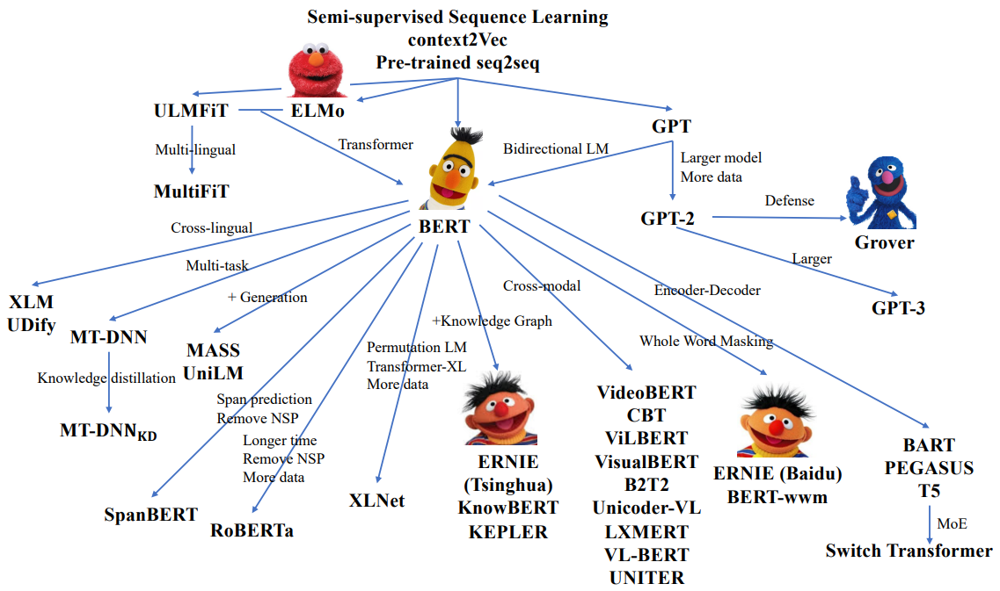

### 1.3 模型架构设计

本节，将更深入地研究 after-BERT PTMs，而且主要是基于 Transformer 的。所有用于语言预训练的 after-BERT Transformer，其架构都可以按照动机分为两类：**统一序列建模 (unified sequence modeling)** 和 **认知启发架构 (cognitive-inspired architectures)**。

#### 1.3.1 统一序列建模

NLP 有丰富的下游任务场景，通常可以分为三类：

* 自然语言理解：包括语法分析，句法分析，词/句/段落分类，问答、事实/常识知识推理等

* 开放式语言生成：包括对话生成、故事生成、数据到文本生成等

* 非开放式语言生成：包括机器翻译、摘要概括、填空等

一系列新颖的架构寻求<u>将不同类型的下游语言任务统一到一个 PTM 内</u>，这种动机称为统一序列建模。

##### 1.3.1.1 整合 AR 和 AE

GPT 这种 AR 模型擅长生成，BERT 这种 AE 模型擅长理解，因此统一序列建模的其中一个思路就是整合 AR 模型和 AE 模型，目前的路径有置换语言、多任务训练，代表作品如下。

---

###### XLNet (Yang et al., 2019)

XLNet 提出排列语言模型 <u>PLM (Permuted Language Model)</u>，以无需 mask 的 Auto Regressive 模型为基础，不再对序列按顺序建模，而是对序列所有可能的排列组合中的部分建模，再最大化期望对数似然。

<u>PLM 模型</u>

如下图所示，在预训练中对原始序列的排列组合**采样**（我理解的本质是数据增强），“**遮掩**” 末尾一定量的词，然后用 AR 的方式按照这种排列依次**预测**。

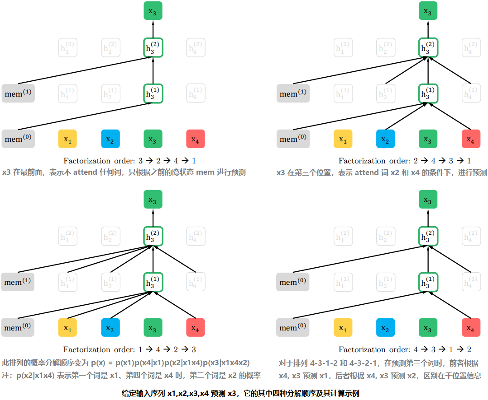

PLM 模型的不同排列改变的是概率的分解顺序，并不会改变原始词的顺序。在实践当中，通过调整 attention mask 来限制词语的交互，得到不同的分解顺序。

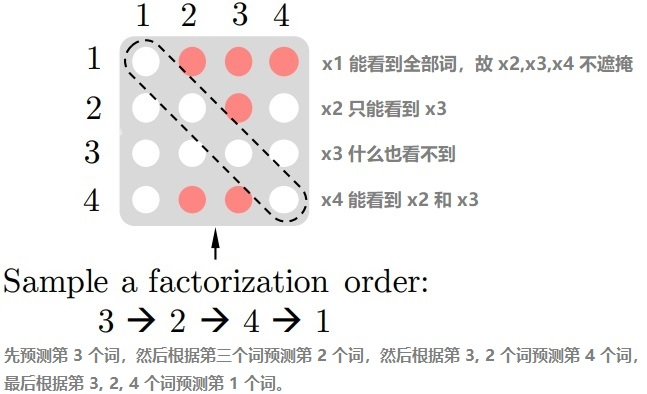

这样处理过后保留了序列的上下文信息、巧妙改进了 Auto Regressive 模型的缺点。PLM 模型的目标函数为：
$$
\mathcal{L}(\mathcal{X}) = \mathbb{E}_{z\in Z_T}\sum_{t=c+1}^T\log P\left ( x_{z_t} \mid x_{z_{\cdot<=t}}; \Theta \right )
$$
其中 $T$ 表示序列长度，$Z_T$ 是序列的所有排列集合，$z = \{z_1, z_2, \dots, z_T\}$ 是其中的一个排列。

<u>双流自注意力</u>

Transformer 某个 token 的内容和位置向量在输入到模型前就已经加在一起了，后续的隐向量同时具有内容和位置的信息。但是本文不同，如果模型预测当前词，则只能使用位置向量；如果模型预测后续词，那么使用位置加内容向量。因此既需要标准 Transformer 的网络提供内容向量，又要另一个网络提供对应的位置向量。

BERT 这样的**位置+内容**的注意力流，称为 content stream，作者增加另一个**只有位置信息**的注意力流，称为 query stream。

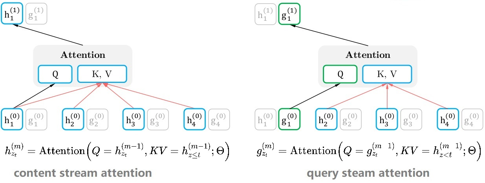

省略小箭头，两个流整合为多层网络：

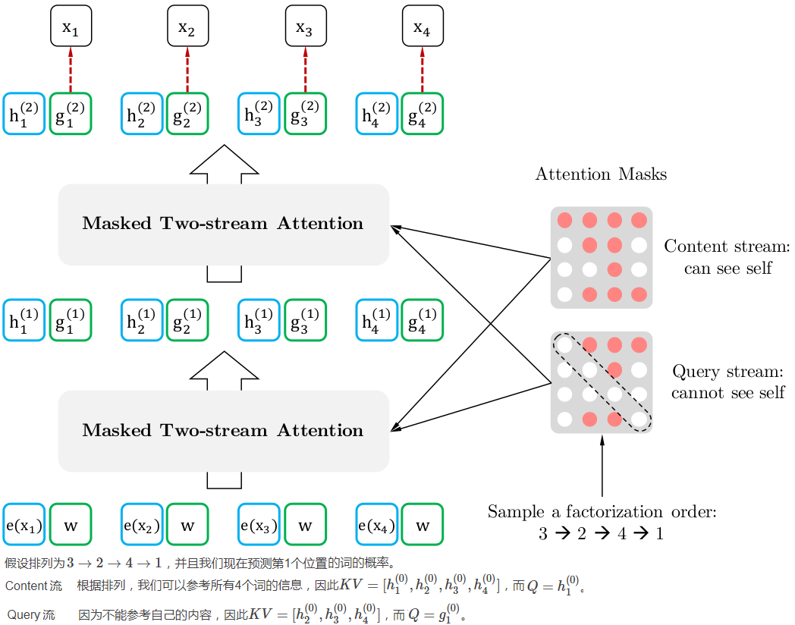

【注1】最下面一层蓝色的 content stream 的输入是 embedding，绿色的是相同的 relative position encoding（详见下文）.

【注2】query stream 实际上实现中应该是所有时序上的 $h$ 都作为 key 和 value，在进行 attention mask.

最后在微调阶段，只需要简单的把 query stream 移除，只采用 content stream 即可。

<u>集成 Transformer-XL</u>

作者还将 Transformer-XL 的两个最重要的技术点应用了进来，即<u>段级递归机制</u>与<u>相对位置编码</u>。

普通的 Transformer 由于有一个最长序列的超参数控制其长度，对于特别长的序列就会导致丢失一些信息，Transformer-XL 的提出主要是为了**解决超长序列的依赖问题**。

假设我们有一个长度为 1000 的序列，如果我们设置 Transformer 的最大序列长度是100，那么这个 1000 长度的序列需要计算十次，并且每一次的计算都没法考虑到每一个段之间的关系，如果采用 Transformer-XL，首先取第一个段进行计算，然后把得到的结果的隐藏层的值进行缓存，第二个段计算的过程中，把缓存的值拼接起来再进行计算。该机制不但能保留长依赖关系还能加快训练。

XLNet 中引入**段级递归机制**其实也很简单，只需要在计算 key 和 value 的时候做简单的修改，其中 $\tilde{h}^{(m-1)}$ 是缓存值。
$$
h_{z_t}^{(m)} = \text{Attention}\left ( Q = h_{z_t}^{(m-1)}, KV = [\tilde{h}^{(m-1)}, h_{z\le t}^{(m-1)}]; \Theta \right )
$$
BERT 的 position embedding 采用的是绝对位置编码，但它在 Transformer-XL 中有一个致命的问题——没法区分词在哪一个片段，会导致位置信息的损失，因此 Transformer-XL 采样相对位置编码。

假设给定位置 $i$ 与 $j$，如果 $i$ 与 $j$ 在同一个片段则令片段位置编码为 $s_{ij} = s_+$，否则为 $s_{ij} = s_-$，这个值在训练的过程中得到。

XLNet 中引入**相对位置编码**时，首先要计算出 $a_{ij} = (q_i + b)^T s_{ij}$，$b$ 为参数，然后与传统 Transformer 的 attention weight 相加。

---

###### MPNet (Song et al., 2020)

MPNet 发现 XLNet 没有充分利用句子的位置信息——预训练中不知道句子长度而在下游任务中却知道，于是对比 MLM 与 PLM 的条件差异，将辅助位置信息作为输入，使模型看到完整的句子从而减少位置差异。

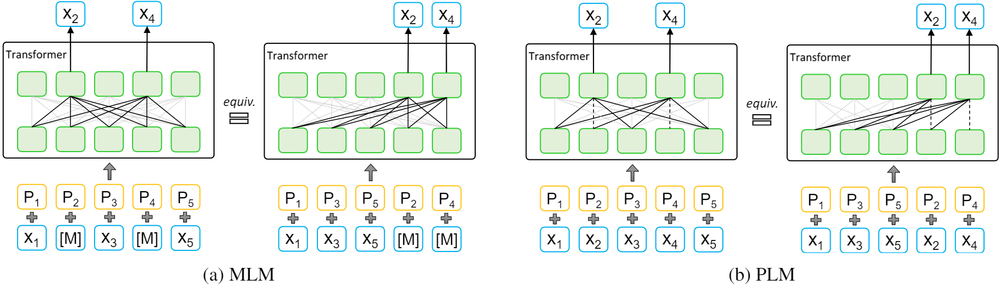

本文首先对 MLM 和 PLM 进行上图的等价变换，然后对比两者的目标函数。其中 $\mathcal{Z}_T$ 是序列的其中一个排列，$z_{\cdot \cdot \cdot}$ 是其中下标指定范围的元素。
$$
\begin{align}
\mathcal{L}_{\text{MLM}} & = \mathbb{E}_{z\in \mathcal{Z}_T}\sum_{t=c+1}^T\log P \left ( x_{z_t} \mid x_{z_{\cdot<=c}}, M_{z_{\cdot > c}}; \Theta \right ) \\
\mathcal{L}_{\text{PLM}} & = \mathbb{E}_{z\in \mathcal{Z}_T}\sum_{t=c+1}^T\log P \left ( x_{z_t} \mid x_{z_{\cdot<=t}}; \Theta \right )
\end{align}
$$
通过对比可以发现，MLM 比 PLM 多了 $M_{z_{\cdot > c}}$，也即多了句子长度信息（一个 $M$ 表示一个位置）；PLM 比 MLM 变了 $x_{z_{\cdot<=t}}$，也即被预测部分 token 之间的相关性（下标是 $t$ 且随时间变化）。

于是 MPNet 就综合两者的长处，定义两者兼顾的目标函数：
$$
\mathcal{L}_{\text{MPNet}}  = \mathbb{E}_{z\in \mathcal{Z}_n}\sum_{t=c+1}^n\log P \left ( x_{z_t} \mid x_{z_{\cdot<=t}}, M_{z_{\cdot > c}}; \Theta \right )
$$
在实践当中，通过 “位置补偿” (position compensation) 来实现，即在双流注意力中，保证 content stream 和 query stream 任何时候都可以看到所有 token 的位置信息。

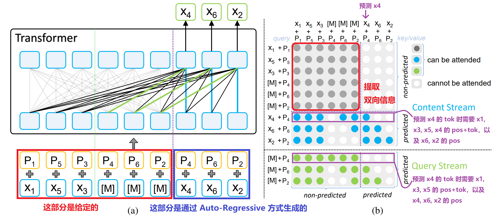

因此，MPNet 的提升来源于保留了更多的信息。

---

###### UniLM (Dong et al., 2019)

UniLM 提出联合训练下面三种语言建模目标，使得模型可以用于 NLG，同时在 NLU 任务获得和 BERT 一样的效果，其在生成式问答和摘要概括方面表现相当出色。

UniLM 通过改变 Transformers 中的注意力掩码来实现三种建模任务，如下图所示。

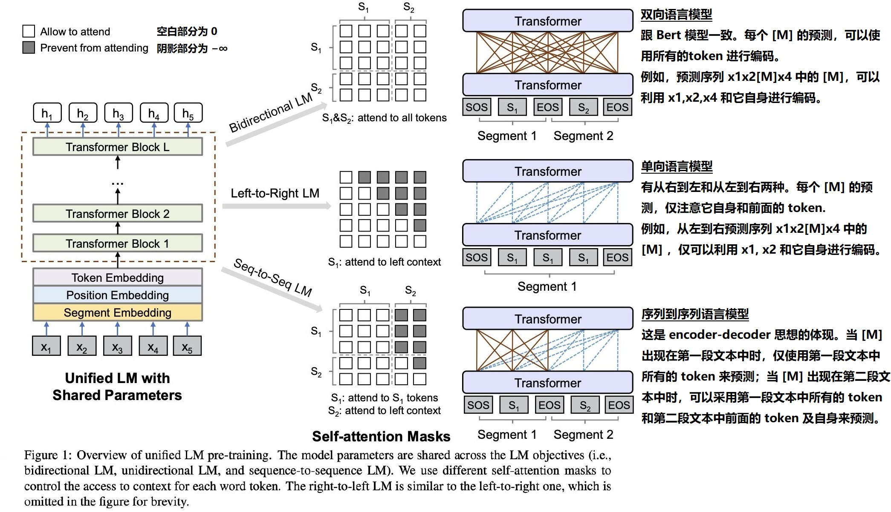

在 finetune 阶段，NLU 任务同 BERT 一样；NLG 任务只 mask S2 句子中的 token，包括 `[SEP]`（学习如何停止）。

---

###### GLM (Du et al.，2021)

GLM 提出了一种更优雅的方法来结合自回归和自编码。GLM 会 mask 若干连续的 tokens 称为 span，并用 autoregressive 方式生成。为了保留 `[MASK]` 的位置信息，GLM 提出了一种 2D 位置编码策略。GLM 是第一个在包括自然语言理解、条件生成和无条件生成在内的所有类型的任务上**同时实现最佳性能的模型**。

GLM 的<u>模型流程</u>如下图所示。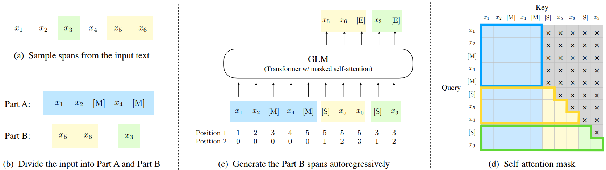

给定输入序列 ${\bf x} = \left [ x_1, \dots, x_n \right]$，步骤 (a) 从 ${\bf x}$ 中采样多个 span $\left \{ {\bf s}_1 \dots {\bf s}_m \right \}$，其中 ${\bf s}_i = \left [ s_{i,1}, \dots, s_{i,l_i} \right ] \in {\bf x}$ 是连续的片段。步骤 (b) 将 ${\bf x}$ 中采样的 spans 用 `[Mask]` 替换得到 Part A 的序列 ${\bf x}_{\text{corrupt}}$，将 spans 之间和内部的顺序打乱得到 Part B 来增加独立性。步骤 (c) 将得到的新序列输入到 GLM 中，使用 autoregressive 方式预测 span，其中每个 span 用 `[Start]` 和 `[End]` 填充头尾。步骤 (d) 是相应的注意力矩阵，其中 Part A 可以 attend 自己的所有 tokens，Part B 可以 attend Part A 和自己前面的 tokens.

在位置信息的编码上，作者提出 <u>2D 位置编码</u>方法。第一维 position 1 中对 ${\bf x}_{\text{corrupt}}$ 递增编码避免长度泄露，对 span 重复编码指示遮罩位置；第二维 position 2 中对 ${\bf x}_{\text{corrupt}}$ 平凡编码不做预测，对 span 递增编码指示预测长度。

关于 <u>span 的生成</u>，有两个目标函数。目标一，span 长度服从泊松分布 ($\lambda=3$)，重复采样直到 $15\%$ 的 token 被 mask；目标二，span 长度服从均匀分布并覆盖 $50\%\sim 100\%$ 的原始 token，采样一个。

生成一个 span ${\bf s}_i$ 的概率可以分解为：
$$
p_\theta \left ( {\bf s}_i \mid {\bf x}_{\text{corrupt}}, {\bf s}_{{\bf z}_{<i}} \right ) = \prod_{j=1}^{l_i} p \left ( s_{i,j} \mid {\bf x}_{\text{corrupt}}, {\bf s}_{{\bf z}_{<i}} \right )
$$
总的目标函数为：
$$
\max_\theta \mathbb{E}_{{\bf z}\sim Z_m} = \left [ \sum_{i=1}^{m}\log p_\theta \left ( {\bf s}_{{\bf z}_i} \mid {\bf x}_{\text{corrupt}}, {\bf s}_{{\bf z}_{<i}} \right ) \right ]
$$
最后是关于下游任务的使用：

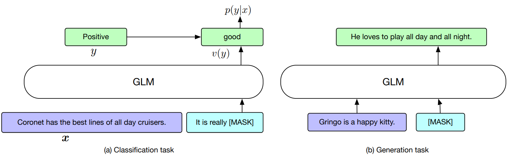

##### 1.3.1.2 应用广义 En-De

在 GLM 之前，无论是编码器结构（BERT）还是解码器结构（GPT）都无法解决一个重要问题：**填充可变长度的空白**。基于解码器的模型无法做到，因为它们只能在序列的末尾生成；基于编码器的模型也不能，因为 `[MASK]` 的数量会泄漏信息。

<u>以下研究</u>深入探索 Encoder-Decoder 架构的潜力，并具有 BERT 和 GPT 所不具备的优势，能够轻松处理可变长度空白。 

然而，Encoder-Decoder 架构也面临着一些挑战。首先，与单个编码器/解码器相比，Encoder-Decoder 架构引入了更多的参数，虽然这个问题可以通过编码器和解码器的参数共享来缓解，但其参数效率仍值得怀疑。其次，Encoder-Decoder 架构通常在自然语言理解方面表现不佳，尽管类似大小的 vanilla BERT 有些改进，但训练好的 RoBERTa 或 GLM 编码器的性能要好得多。

---

###### MASS (Song et al., 2019)

MASS 是针对语言生成任务的 seq2seq 模型，它率先将 masked-prediction 策略引入到 encoder-decoder 架构中，得到融入预训练机制的自然语言生成模型。最初为机器翻译设计的 Encoder-Decoder 架构能够产生可变长度的序列，但 MASS 并**没有涉及填充可变长度的空白问题**。

MASS 的模型结构是传统的 Transformer，在任务类型上借鉴 BERT 提出 masked-prediction 策略，如下图所示。

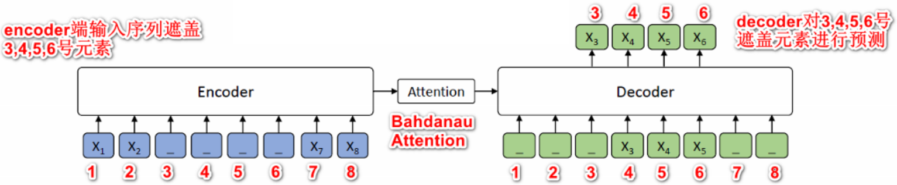

作者认为，BERT 是预测个数 $K = 1$ 时的特例，GPT 是 $K = \text{len}({\bf x})$ 的特例：

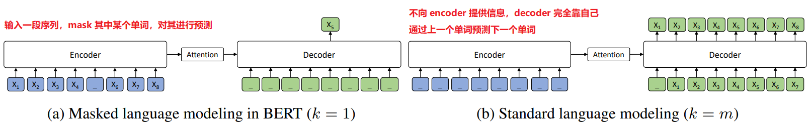

MASS 模型的目标/损失函数为：
$$
\begin{align}
L \left (\theta; \mathcal{X} \right ) & = \frac{1}{\left | \mathcal{X} \right | } \sum_{x\in \mathcal{X}} \log \left ( P \left (x^{\mu:v} \mid x^{\setminus  \mu:v} ; \theta \right )  \right ) \\
& = \frac{1}{\left | \mathcal{X} \right | } \sum_{x\in \mathcal{X}} \log \left ( \prod_{t=\mu}^{v} P \left (x^{\mu:v}_t \mid x^{\mu:v}_{\lt t}, x^{\setminus  \mu:v} ; \theta \right )  \right )
\end{align}
$$
其中 $\mathcal{X}$ 为语料库，$x$ 为其中的样本，上标表示截取的部分。

---

###### T5 (Raffel et al., 2020)

T5 采用 Transformer 结构（Encoder-Decoder 架构），应用于以下的 **text-to-text 框架**，即对多个任务的**输入和输出格式进行统一**。为指定模型所处理的具体任务类别，需要在原始的输入序列上增加 task-specific (text) 前缀。输出内容就根据相应的输入前缀进行规范。

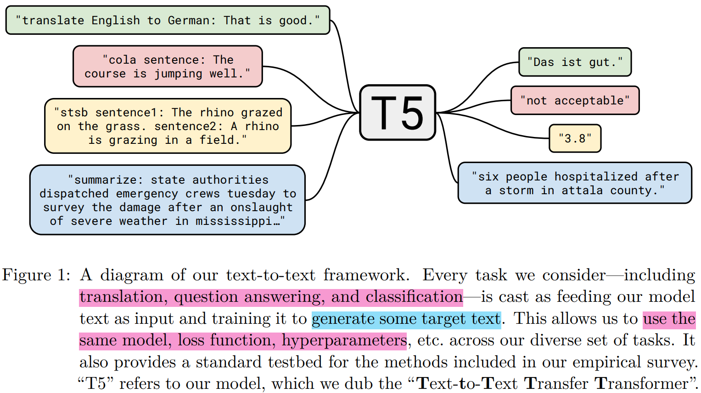

T5 仅用一个 `[MASK]` 标记来遮盖文本中的多个 tokens（长度可变），然后让解码器**填充可变长度的空白**，恢复 masked 序列，如下图所示。本文其实并没有引入新的模型或者新的方法，而是将现有的方法和技术做一次集大成，还引入一个新的数据集。

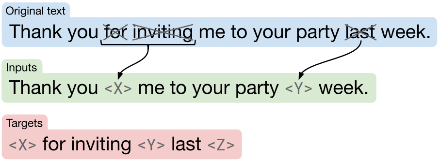

接下来作者进行了诸多实验，在 model structure，model architecture，pre-training objectives，datasets 等方面进行对比。

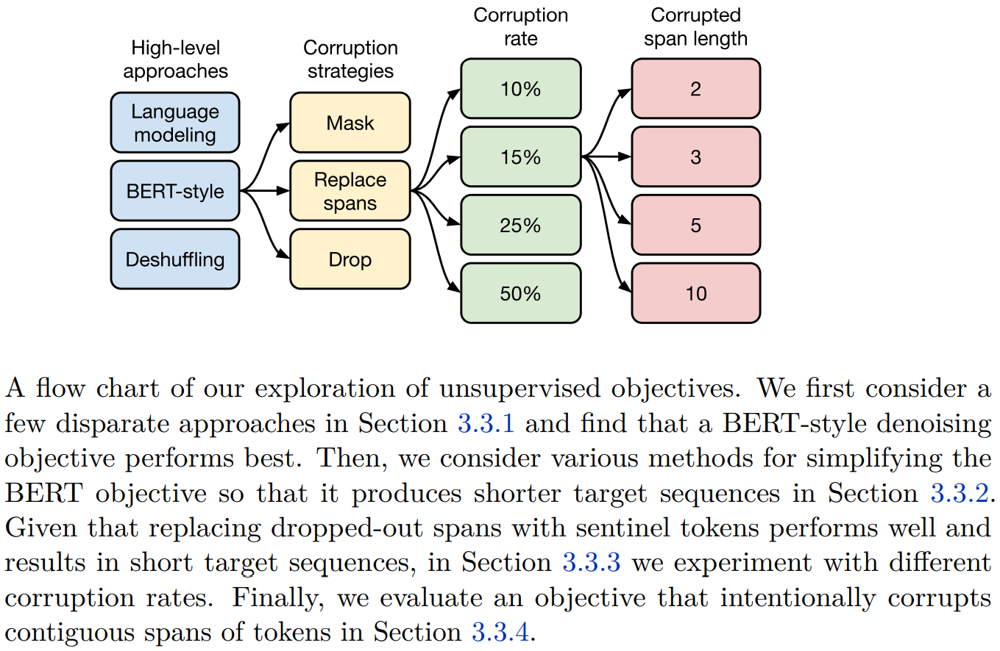

---

###### BART (Lewis et al., 2020a)

BART 同样采样与 MASS 和 T5 相同的 Transformer 结构（Encoder-Decoder 架构），只是**在输入上有更加灵活的处理**。

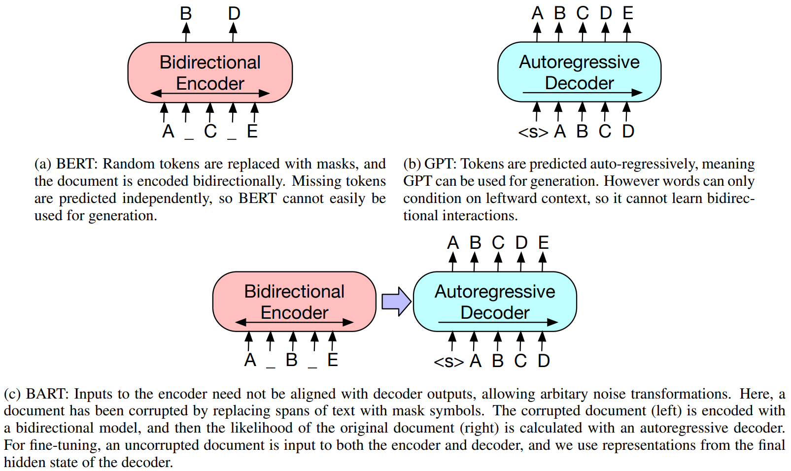

BART 引入了一个有趣的想法，即通过截断、删除、替换、改组和掩码等多种操作来破坏源序列，而不仅仅是 mask：

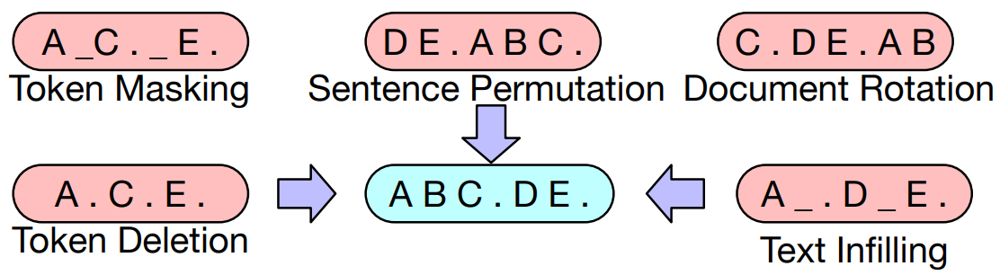

其中，词语删除和多个词语替换为一个 `[MASK]` 等方式会改变句子的长度，支持**填充可变长度的空白**，这点是 BERT 做不到的。

---

###### PEGASUS (Zhang et al., 2020a)

PEGASUS 同样基于 Transformer 结构（Encoder-Decoder 架构），并针对文本摘要任务提出新的自监督预训练目标 <u>GSG (Gap Sentences Generation)</u>，能在**低资源的情形**下同样取得不错的效果。

---

###### PALM (Bi et al., 2020)

PALM 将 auto-encoding 理解委托给 Transformer 中的编码器，将 auto-regressive 生成委托给 Transformer 解码器。编码器和解码器的预训练分为**两个阶段**：编码器首先被训练成双向自动编码器，从损坏的上下文重建原始文本；然后将编码器和解码器联合训练，以从编码器的上下文表示形式自回归地生成文本输出。

#### 1.3.2 认知启发架构

当前的 Transformer 并不足以很好地实现人类的认知系统。Transformer 的核心是注意力机制，这只借鉴了人类认知系统的感知能力，是微观的、原子的功能。一系列架构尝试理解人类认知功能的宏观功能，包括决策、逻辑推理、反事实推理和工作记忆等，这种动机称为认知启发架构（Cognitive-Inspired Architectures）。

##### 1.3.2.1 维护工作记忆

Transformer 的一个自然问题是其固定的窗口大小和二次空间复杂度，这极大阻碍了其在长文档理解和生成中的应用。近年来，二次增长的点积注意力近似计算在缓解复杂度的问题，但却导致注意力机制过长，不符合人类的认知——人类还可以<u>记忆、组织、遗忘</u>，LSTM 网络就是这一哲学的典型实践。

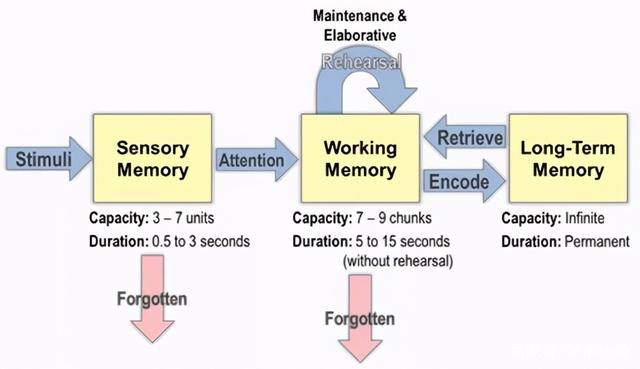

更深入的研究认为人类存在**工作记忆 (working memroy) —— 人类用来推理和决策的信息储存系统**，虽然这个系统每次只能保留 7~9 个 item 或者 word（就像有限容量的注意力系统），但是其通过协调、综合信息——随时间遗忘不重要信息、刷新重要信息，来在一个较长的时间跨度下收集信息辅助推理和决策。<u>以下研究</u>就尝试将人类的工作记忆机制应用到 Transformer 中。

---

###### Transformer-XL (Dai et al., 2019)

NLP 中处理变长数据的方案有几种：

* 截断法：就是暴力截断，分为 head 截断、tail 截断和 head+tail 截断（数据损失）

* pooling 法：将长文本（拆分、断句或划窗）分成多个 segment，然后分别编码取 `[CLS]` 进行 pooling 后使用（性能低、碎片化）

* 压缩法

  * 将数据输入到类似前馈神经网络的模型中得到长度固定的特征向量（计算量大）

  * 通过数据切段或者 padding 的方式将数据填充到固定长度（数据碎片化）

Transformer 笔记中提到，它使用压缩法的第二种方案解决长序列问题。但是也导致 Transformer 使用**分段训练和滑动预测**，位置编码是**相对于片段的绝对位置编码**。

Transformer-XL 的提出主要是为了解决 Transformer 的遗留问题——**超长序列的建模/依赖问题**，它也是第一个引入**段级递归机制**和**相对位置编码**来实现记忆、组织、遗忘这一目标的架构。

<u>段级递归机制</u>

Transformer-XL 在训练时的输入也是固定长度的片段，不同的是上一个片段的隐层状态会被缓存下来，然后在计算当前段的时候复用。这也就赋予了Transformer-XL 建模更长期的依赖的能力，下面用公式详细说明其过程。

设长度为 $L$ 的两个连续片段为 ${\bf s}_\tau = \left [ x_{\tau,1}, \dots, x_{\tau,L} \right ]$ 和 ${\bf s}_{\tau+1} = \left [ x_{\tau+1,1}, \dots, x_{\tau+1,L} \right ]$，它们输入到网络后的隐层向量/注意力向量分别为 ${\bf h}_\tau^n \in \mathbb{R}^{L\times d}$ 和 ${\bf h}_{\tau+1}^n \in \mathbb{R}^{L\times d}$，其中 $d$ 为隐层维度。
$$
\begin{align}
\tilde{{\bf h}}_{\tau+1}^{n-1} & = \left [ \text{SG} \left( {\bf h}_{\tau}^{n-1} \right) , {\bf h}_{\tau+1}^{n-1} \right ] \\
{\bf q}_{\tau+1}^n, {\bf k}_{\tau+1}^n, {\bf v}_{\tau+1}^n & = {\bf h}_{\tau+1}^{n-1}{\bf W}^T_q, \tilde{{\bf h}}_{\tau+1}^{n-1}{\bf W}^T_k, \tilde{{\bf h}}_{\tau+1}^{n-1}{\bf W}^T_v \\
{\bf h}_{\tau+1}^n & = \text{Transformer-Layer}\left ( {\bf q}_{\tau+1}^n, {\bf k}_{\tau+1}^n, {\bf v}_{\tau+1}^n \right )
\end{align}
$$
其中 $\text{SG}(\cdot)$ 表示 stop-gradient 不参与 BP 的计算，$\left [ {\bf h}_u , {\bf h}_v \right ]$ 表示两个隐层向量在长度维拼接，${\bf W}_\cdot$ 是各个要学习的参数矩阵。从公式中可以看到，段级递归机制的实现非常简单，只需在计算 key 和 value 的时候**将上一段的缓存和当前段的输入进行拼接**。
$$
{\bf h}_{\tau+1}^{(n)} = \text{Attention}\left ( Q = {\bf h}_{\tau+1}^{(n-1)}, KV = \left [\text{SG} \left( {\bf h}_{\tau}^{(n-1)} \right) , {\bf h}_{\tau+1}^{(n-1)} \right ]; \Theta \right )
$$
上述计算过程在 Transformer-XL 中如下图所示。

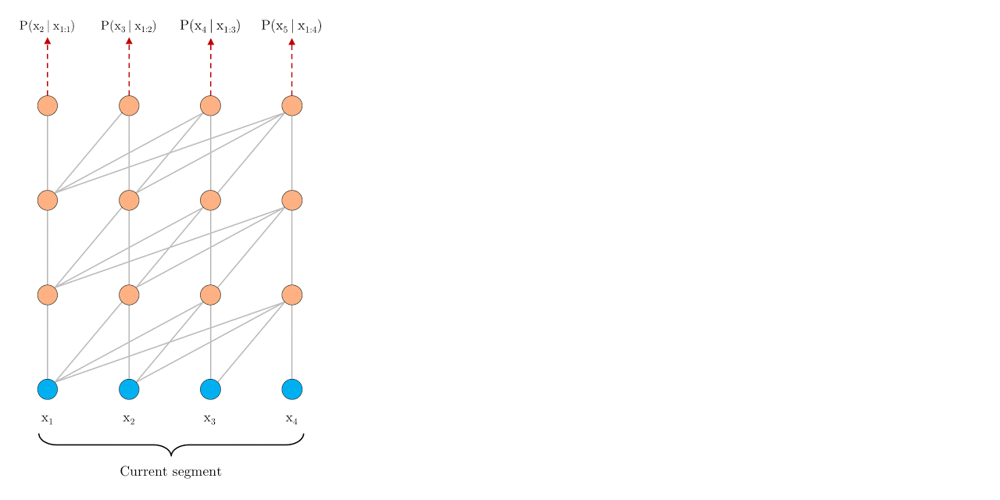

段级递归机制能够让网络建模更长期的依赖的能力，同时带来的推理速度的提升。如下图所示，通过直接复用上一个片段的表示而不是从头计算，将推理过程提升到**以片段为单位**。

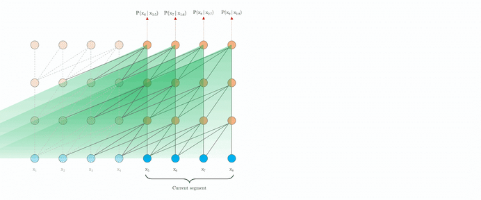

【悟】从这个角度看，段级递归机制和残差网络思想类似，它相当于在两个片段之间添加了一条 short-cut.

<u>相对位置编码</u>

相对位置编码在《Self-attention with **R**elative **P**ositional **R**epresentation》一文提出，其**思想**是在计算第 $i$ 个元素与第 $j$ 个元素之间的 attention 时，加入 $i$ 与 $j$ 之间的距离编码。因为加入的是 $i$ 与 $j$ 之间的相对位置关系，所以称相对位置编码，下面从 Transformer 的绝对位置编码推理 Transformer-XL 的相对位置编码。

Transformer 的单个头的 self-attention 公式为
$$
A = \text{Softmax}\left( \text{ATT-Mask}\left( \frac{QK^T}{\sqrt{d_k}} \right) \right)
$$
其中的核心是点积相似度 $A^{\text{abs}} = Q^TK$ 的计算，细化其中的 query 和 key 来源，即来自 embedding $E$ 和 position encoding $U$：
$$
\begin{align}
A^{\text{abs}} & = Q^ \top K \\
& = \left ( X {\bf W}_q \right )^ \top X{\bf W}_k \\
& = \left (({\bf E} + {\bf U}){\bf W}_q\right )^ \top({\bf E}+{\bf U}){\bf W}_k \tag{1} \\
A^{\text{abs}}_{i,j} & = \left ( {\bf W}_q \left ( {\bf E}_{x_i} + {\bf U}_i \right ) \right )^T\left ( {\bf W}_k \left ( {\bf E}_{x_j} + {\bf U}_j \right ) \right ) \\
& = \underbrace{\mathbf{E}_{x_i} ^ \top \mathbf{W}_q ^ \top \mathbf{W}_k \mathbf{E}_{x_j}}_{(a)} + \underbrace{\mathbf{E}_{x_i} ^ \top \mathbf{W}_q ^ \top \mathbf{W}_k \mathbf{U}_{j}}_{(b)} + \underbrace{\mathbf{U}_{i} ^ \top \mathbf{W}_q ^ \top \mathbf{W}_k \mathbf{E}_{x_j}}_{(c)} +\underbrace{\mathbf{U}_{i} ^ \top \mathbf{W}_q ^ \top \mathbf{W}_k \mathbf{U}_{j}}_{(d)} \tag{2}
\end{align}
$$
论文 RPR 并没有根据输入序列的长度来确定需要考虑的相对位置的元素范围，而是用了一个固定的常数 $k$，即相对位置的计算窗口大小为 $2k+1$，并且作者实验发现 $k\ge2$ 时效果相当。Transformer-XL 参考 RPR 把相对位置编码加入到 self-attention 中的思想，在 $(2)$ 式的基础上发展为：
$$
\begin{align}
A_{i,j} ^ {\text{rel}} & = \underbrace{\mathbf{E}_{x_i} ^ \top \mathbf{W}_q ^ \top \mathbf{W}_{k,E} \mathbf{E}_{x_j}}_{(a)} + \underbrace{\mathbf{E}_{x_i} ^ \top \mathbf{W}_q ^ \top \mathbf{W}_{k,R} \mathbf{R}_{i-j}}_{(b)} + \underbrace{u ^ \top \mathbf{W}_{k,E} \mathbf{E}_{x_j}}_{(c)} +\underbrace{v ^ \top  \mathbf{W}_{k,R} \mathbf{R}_{i-j}}_{(d)} \tag{3} \\
& = (\mathbf{W}_q \mathbf{E}_{x_i} + u) ^ \top \mathbf{W}_{k,E} \mathbf{E}_{x_j} + (\mathbf{W}_q \mathbf{E}_{x_i} + v)^\top \mathbf{W}_{k,R}\mathbf{R}_{i-j} \tag{4}
\end{align}
$$

* 第一个变化在 $(a),(b),(c),(d)$ 中，四个 ${\bf W}_k$ 被按情况独立成 ${\bf W}_{k,E}$ 和 ${\bf W}_{k,R}$，即输入序列和位置编码不再共享权值
* 第二个变化在 $(b),(d)$ 中，绝对位置编码 $\mathbf{U}_j$ 换成相对位置编码 ${\bf R}_{i-j}$，其中 ${\bf R}$ 是 Transformer 中采用的不需要学习的 sinsoid 编码矩阵
* 第三个变化在 $(c),(d)$ 中，query 向量 $\mathbf{U}_{i} ^ \top \mathbf{W}_q ^ \top$ 换成两个可学习参数 $u \in \mathbb{R}^d$ 和 $v \in \mathbb{R}^d$，表示所有 query 位置对应的位置编码相同，即无论query位置如何，对不同词的注意偏差都保持一致

改进后 $(3)$ 式的各个部分也有了各自的含义：

- $(a)$ 没有考虑位置编码的原始分数，只是基于内容的寻址
- $(b)$ 相对于当前内容的位置偏差
- $(c)$ 从内容层面衡量 key 的重要性，表示全局的内容偏置
- $(d)$ 从相对位置层面衡量 key 的重要性，表示全局的位置偏置

---

###### CogQA (Ding et al., 2019)

递归只是隐式模拟了工作记忆，CogQA 提出更明确的解决方案。针对**多跳阅读理解**问题，CogQA 提出在多跳阅读中维护认知图的方案。其灵感来源与以下思考。

> **多跳阅读理解问题**：可以直观地理解为需要多次跳转，将不同的信息进行进一步整合才能得到答案的阅读理解问题。其基本<u>假设</u>是，一些文本中关键的句子存储了完成任务所需要的充分且必要的信息。
>
> 假设你手边有一个维基百科的搜索引擎，可以用来获取实体对应的文本段落，那么如何来回答下面这个复杂的问题呢？ 
>
> “谁是某部在 2003 年取景于洛杉矶 Quality cafe 的电影的导演？”
>
> 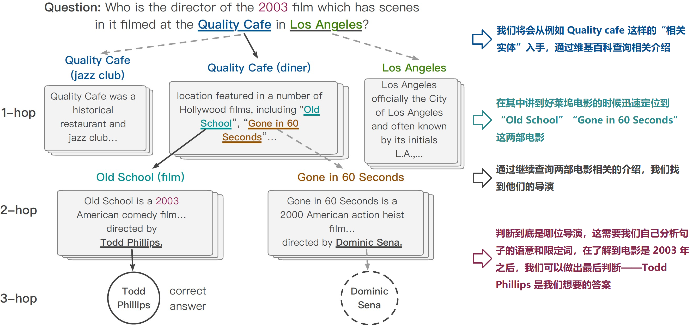
>
> 从上面的案例中，可以发现 QA 解答使用了 “**快速将注意力定位到相关实体**” 和 “**分析句子语意进行推断**” 两种不同的思维过程。这就是著名的 “双过程理论 (dual process theory) ”，其认为人的认知分为两个系统：
>
> * 系统一是基于直觉的、无知觉的思考系统，其运作依赖于经验和关联
> * 系统二是显式的、需要意识控制的，其利用工作记忆 (working memory) 中的知识进行慢速但是可靠的逻辑推理

CogQA 据此提出一种新颖的迭代框架，算法使用两个系统来维护一张认知图谱 (Cognitive Graph)：

- 系统一（BERT）：从文本中提取和问题相关的实体并得到候选答案，同时对其语义信息进行编码
- 系统二（GNN）：通过图的方式进行问题的推导，并收集一定的线索来帮助更好地提取下一跳的信息

模型通过不停迭代系统 1 和系统 2 来扩展认知图以最终回答问题，系统 1 为认知图生成节点，并初始化其表示，系统 2 为系统 1 提供线索，并更新节点的表示。反复此步骤，至没有更多的前沿节点或认知图已经足够大，由认知图中的所有节点进行预测。

下面详细讲解两个系统的结构，网络图如下。

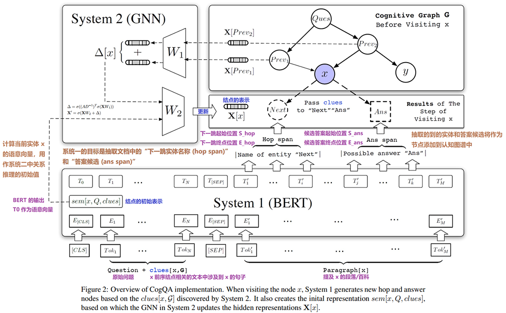

<u>系统一：BERT</u>

BERT 的输入为 $\underbrace{[CLS] \text { Question }[S E P] \text { clues }[x, \mathcal{G}][\operatorname{SEP}]}_{\text {Sentence } A} \underbrace{\operatorname{Para}[x]}_{\text {Senterce } B}$，其中：

* $\text {Question}$ 为原始问题的文本，例如案例中的 "Question"

* $\text{clues}[x, \mathcal{G}]$ 为认知图谱中结点 $x$ 的前序结点相关的文本中涉及到 $x$ 的句子，例如案例中第二跳实体 $x$ "Old School" 所在的句子，是前序结点 "Quality Cafe" 相关的文本（作者基于训练效率的考虑，之间输入原句子 raw sentence）

  【悟】clues 可以理解为 “之所以从 $x$ 的上一个结点推出 $x$ 的原因 = 涉及 $x$ 的上一个结点的文本中确实提到了 $x$ 的证据”

* $\operatorname{Para}[x]$ 为涉及结点 $x$ 的 context，例如案例中第二跳实体 $x$ "Old School" 查询的百科

BERT 的输出为：

* Span Extraction，下一跳的实体 + 答案候选

  这里利用四个**指针**向量 $S_{\text{hop}}, E_{\text{hop}}, S_{\text{ans}}, E_{\text{ans}}$ 来计算相应的开始、结束位置，是<u>待学习的参数</u>。

  设 $T$ 是 BERT 的输出序列，其第 $i$ 个位置是某一答案的开始位置的概率如下计算，并且只关注 top-K 个概率最大的起始位置：
  $$
  \begin{align}
  P_{a n s}^{s t a r t}[i] & = \frac{e^{\mathbf{S}_{a n s} \cdot \mathbf{T}_{i}}}{\sum_{j} e^{\mathbf{S}_{a n s} \cdot \mathbf{T}_{j}}} \\
  \operatorname{start}_{k} & \in  \text{top-K} \left \{ P_{a n s}^{s t a r t}[i] \right \}
  \end{align}
  $$
  对于每一个起始位置，计算结束位置，即从起始位置开始，往后 $\max L$ 的范围内，寻找概率最大的可能的结束位置：
  $$
  \operatorname{end}_{k}=\arg \max _{\operatorname{start}_{k} \leq j \leq \operatorname{start}_{k}+\max L} P_{a n s}^{e n d}[j]
  $$
  这样得到的可能还是概率很小（比如推理未完成），故使用 `[CLS]` 向量的概率**作为阈值进行筛选**。上述计算对于 hop 同理。

* Semantics Generation，涉及结点 x 的文本的语义向量

  这里使用 $T_0$ 作为 $\operatorname{sem}[x, Q, \text { clues }]$ 的表示。注意这里并不是使用最后一层输出的 $T_0$，而是某个隐层的。

【注】对于一个实体 $x$ 它的 $\operatorname{Para}[x]$ 可能是空的（也就是上一个实体确实提到了实体 $x$，但是实体 $x$ 的更多信息没有了），则此时 Span Extraction 的部分不能够继续进行，但是仍能够基于前面的部分计算 Semantics Generation 表示。可以认为此时结点 $x$ 不再作延伸（也就是不再有从 $x$ 出发的新的答案结点或者实体结点），但是本身 $x$ 自己的初始化表示还是可以完成的。

<u>系统二：GNN</u>

首先根据系统 1 生成的下一跳实体和候选答案，在认知图谱上生成新的结点（也就是从实体 $x$ 延伸出去的新的结点），同时用上一步生成的 $\operatorname{sem}[x, Q, \text { clues }]$ 作为结点 $x$ 的初始化表示。

然后，认知图谱通过推断来更好地更新对 $x$ 的表示，将 $x$ 与其他结点的关系等信息也加入进去，更新规则如下：
$$
\begin{array}{l}
\Delta & = \sigma\left(\left(A D^{-1}\right)^{T} \sigma\left(\mathbf{X} W_{1}\right)\right) \\ \mathbf{X}^{\prime} & =\sigma\left(\mathbf{X} W_{2}+\Delta\right)
\end{array}
$$
其中 $W_1$, $W_2$ 是权重矩阵，$A$ 是邻接图矩阵，对角矩阵 $D$ 的元素 $D_{jj} = \sum_i A_{ij}$。$(AD^{-1})^T$ 是对 $A$ 的某种归一化，$\Delta$ 是 $x$ 的前序结点对 $x$ 的影响的某种综合度量。

<u>模型训练</u>

训练对系统 1 和系统 2 **分别进行**。

系统 1 的任务为 Span Extraction，对于问题 $Q$ 每一个相关文档 $para[x]$，有如下格式的 spans data ：
$$
\mathcal{D}\left[x, Q \right] = \left \{ \left(y_1, start_1,end_1 \right), \dots,\left(y_2, start_2,end_2 \right) \right \}
$$
ans span 仅有一个，故对应的起始位置标签 $\operatorname{gt}_{a n s}^{s t a r t}[\operatorname{start}]=1$，hop span 可以有 $k$ 个，故使用起始位置标签 $\operatorname{\bf gt}_{h o p}^{\text {start}}\left[\text {start}_{i}\right]=1 / k$，损失函数为交叉熵函数：
$$
\mathcal{L}_{a n s}^{s t a r t}=-\sum_{i} \mathbf{g} \mathbf{t}_{a n s}^{s t a r t}[i] \cdot \log P_{a n s}^{s t a r t}[i]
$$
系统 2 的任务为答案节点预测，损失函数为：
$$
\mathcal{L}=-\log (\operatorname{softmax}(\mathcal{F}(\mathbf{X}))[\text { ans }])
$$
【注】为了使模型能够筛选不相关段落，在训练集中加入一些与问题无关的节点，并令 $\operatorname{gt}_{a n s}^{s t a r t}[0]=1$，学习将 `[CLS]` 预测为 $1$ 过滤掉。

<u>模型预测</u>

经过系统 1、2 的处理，此时认知图谱中的实体都是和问题以某种逻辑相关的，然后对 <u>answer span 结点</u>进行一定的筛选得到答案。

由于这里最后测试的时候使用的是 HotpotQA 数据集，其中的答案大致分为以下两类，通过问题的疑问词简单地判断各个问题属于哪一类，再分别用不同的预测 predictor 来处理：

* special question：也就是一般的问题，以 what / where / when / who 之类的开头的普通的询问问题

  此时答案通过抽取得到，即通过一个两层的全连接神经网络 $\mathcal{F}$ 得到：
  $$
  \text { answer }=\underset{\text { answer node } x}{\arg \max } \mathcal{F}(\mathbf{X}[x])
  $$
  也就是从所有构造得到的答案结点中选出通过 MLP 后最大的结点作为最后的答案。

* alternative / general question：也就是两个实体比较的问题，此时回答是 yes 或 no，或回答两个实体中的某一个

  此时将两个结点的差值 $X[x] - X[y]$ 作为输入，用全连接卷积 FCN 来作为一个二分类问题处理（两个问题类型对应两个 FCN）。

最后，CogQA 的一个局限是它对系统 1 的使用仍然基于固定的窗口大小，限制其使用工作记忆来理解长文档的能力。

---

###### CogLTX (Ding et al., 2020)

作为另一个应用场景，针对**文档阅读理解**问题，CogLTX 提出 MemRecall 模块来选择应保留在工作记忆中的关键句子，再通过 task-specific 模块 reasoner 来完成任务。

CogLTX 在三类 NLP 任务中的结构如下：

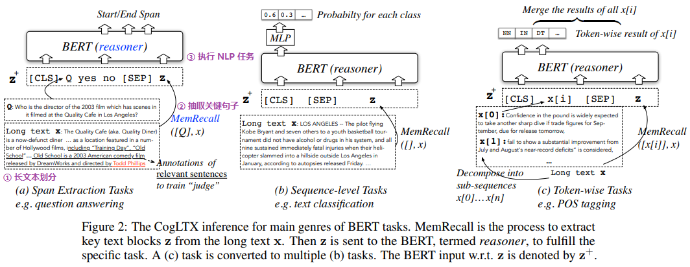

类似多跳阅读理解的假设，文档阅读理解也有类似假设：存在短文本 $z$ 可以完全表达长文本 $x$，即 $reasoner(x) \approx reasoner(z)$，于是 CogLTX 的**核心工作**就是找到这个短文本 $z$.

<u>模型流程</u>

模型的工作流程如下：

* 长文本划分

  使用动规算法划分长文本 $x$ 为文本 block 的集合 $[x_{0}...x_{T-1}]$，当 BERT 的 $L=512$ 时每个 block 长度限制为 $B = 63$.

* 抽取关键句子

  MemRecall 模块需要两个输入，第一个 query 用来检索相关的 block，第二个 block 集合提供数据。

  * 任务 (a)：输入问题 $Q$、block 集合 $[x_{0}...x_{T-1}]$
  * 任务 (b)：只输入 block 集合 $[x_{0}...x_{T-1}]$
  * 任务 (c)：输入子句 $x_i$、block 集合 $[x_{0}...x_{T-1}]$

  MemRecall 的内部流程如下，它全程维护着一个变量——关键短文本 $z^+$，由 query 初始化来 $z^+ = [\;Q\;]$。

  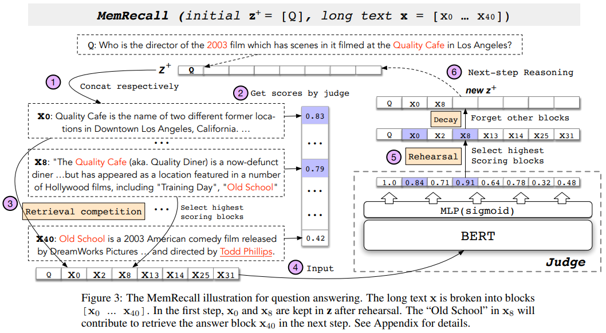

  1. 将 $Q$ 分别于各个 block $x_i$ 拼接，得到新的 block $z_i= \left [\; Q \; [SEP] \; x_i \; \right ]$

  2. 使用 judge 模型进行粗相关性打分，该模型基于 BERT 而来
     $$
     \text{judge}\left(z_i\right)=\text{sigmoid}\left(\text{MLP}\left(\text{BERT}\left(z_i\right)\right)\right)\in (0,1)^{len(z_i)}
     $$
     一个 block $x_i$ 的得分就是这个 block 内所有 token 的得分均值，记作
     $$
     \text{judge}\left(z_i\right)[x_i] = \frac{1}{len(x_i)}\sum_{x_{i,j}\in x_i}x_{i,j}
     $$

  3. 将得分最高的 blocks 拼接到 $z^+$ 中，直到 $len(z^+) < L$

  4. 重复 2 Retrieval competion：将 $z^+$ 再次输入到 judge 模型中，进行精相关性打分 $\text{judge}\left(z^+\right)[x_i]$，增加 blocks 之间的交互

  5. 重复 3 Rehearsal-Decay：只保留得分最高的若干个 blocks 在 $z^+$ 中，实现工作记忆的 “重复-衰减” 特点

  6. 进入下一个输入步骤

     要注意的是，若后续步骤的 blocks 极大降低先前步骤的 blocks 相关性，则在先前步中保留在 $z^+$ 中的 blocks 也会 decay 掉。

* 执行 NLP 任务

  将 $z^+$ 输入到 reasoner 模块中进行训练/预测，它也是一个 BERT 模型，用于执行原本的 NLP 任务。

<u>模型训练</u>

* reasoner 的有监督学习

  理想情况下，训练时 reasoner 的输入应该由 MemRecall 来生成，但是并不能保证所有的相关 block 都能被检索到。以 QA 任务为例，如果答案的 blcok 没有被检索到，reasoner 就无法通过检索到的 block 进行训练，因此解决方案为做一个近似，将所有相关 blcok 和 retrieval competition 中的 “winner” block 输入到 reasoner 中进行训练。

* judge 的学习

  reasoner 面向原本的 NLP 任务，训练和预测可以参考 CogQA，需要研究的是新模型 judge 的训练，它有两种学习方式。

  * judge 的有监督学习

    在多跳阅读理解等拥有句子相关性 label 的 span extraction tasks 任务中，自然而然使用有监督学习。
    $$
    \begin{align}
    loss_{judge}(z)&=CrossEntropy(judge(z^{+}),relv\_label(z^{+}))\\ relv\_label(z^{+})&=[\underset{for\; query}{\underbrace{1,1,\cdots ,1}}\; \; \underset{z_0\; is\; irrelevant}{\underbrace{0,0,\cdots ,0}}\; \; \underset{z_1\; is\; relevant}{\underbrace{1,1,\cdots ,1}}\; \; \cdots ]\in [0,1]^{len(z^{+})}
    \end{align}
    $$
    这里样本 $z$ 或是从 $x$ 中采样出的多个连续 block $z_{\text{rand}}$对应 (retrieval competition 的数据分布)，或是所有相关和随机选择的不相关 block $z_{\text{relv}}$ (对应 rehearsal的数据分布)。

  * judge 的无监督学习

    大多数的任务不会提供相关性的 label。对于这种情况作者使用干预的手段来推断相关性标签：通过从 $z$ 中剔除某个block来看它是否是不可或缺的。

    假设 $z$ 中包含所有的相关block，则有：
    $$
    \begin{align}
    loss_{reasoner}(z_{-z_{i}})-loss_{reasoner}(z)&>t,&\forall z_{i}\in z,\tag{necessity} \\ loss_{reasoner}([zx_{i}])-loss_{reasoner}(z)&\approx 0,&\forall x_{i}\notin z,\tag{sufficiency}
    \end{align}
    $$
    $z_{-z_i}$ 是从 $z$ 中移除 $z_i$ 的结果，$t$ 是一个阈值。每次训练 reasoner 后，进行剔除然后根据 loss 的增加调整相关性标签：如果loss的增加是不显著的，则表明这个 block 是不相关的，它可能在下一个 epoch 中不会再在 retrieval competition 胜出，因为它将在下一个 epoch 中被标记为 irrelevant 来训练 judge。实践中，阈值 $t$ 被划分为 $t_{up}$ 和 $t_{down}$ 的缓冲区来避免标签的频繁切换。
  
  最后是一个流程图：
  
  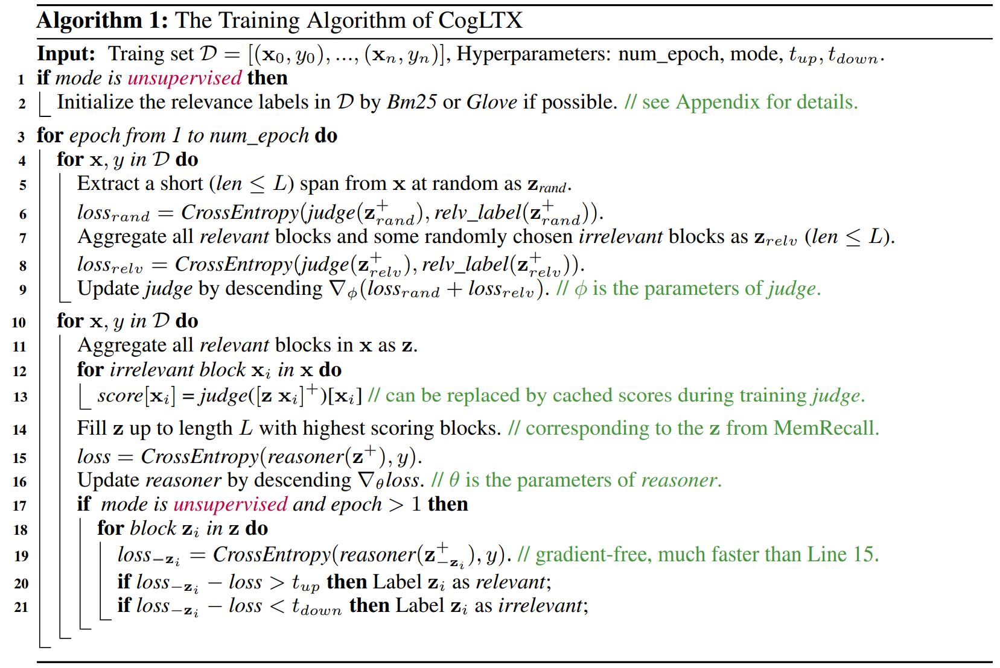

##### 1.3.2.2 保持长期记忆

些许研究对 Transformer 的记忆能力进行了探索，并在某种程度上证明：Transformers 中前馈网络等同于记忆网络。但是，Transformer 的内存容量极其有限，面对既需要<u>用于决策和推理的工作记忆</u>、又需要<u>回忆事实和经验的长期记忆</u>的人类智能，Transformer 显得比较弱小。

下面的研究尝试增强 Transformer 的长期记忆能力，其出发点是人解决问题时并不需要完全掌握相关领域的知识，只需要在用到时找到知识并学习即可。目前有两种实现方向：

* **检索 $\rightarrow$ 编码**

  对文本语料库（如维基百科）进行张量化[^1]，然后输入给任务模型。

* **实体 $\rightarrow$ 嵌入**

  对实体[^2] 知识库（如三元组知识图谱）进行张量化，然后嵌入到模型的隐层中。

知识库的引入不仅能丰富与原始文本中互补的信息（如实体的指称[^3]），还能解决 “低频但常识性的 mention” 或 “长距离依赖” 导致难以学习选择偏好[^4] 的问题。

[^1]: 张量化 - 表示从语料库中抽取文本进行向量化/编码后投入使用的这样一个流程。
[^2]: 实体 - 知识库中完整定义的，唯一存在的条目，每一个实体都可以看作是指代它的名词短语或代词构成的集合。
[^3]: 指称 - 实体在自然语言文本中的别名或另一种指代形式。
[^4]: 选择偏好 - 动词的倾向性。谓语对其论元是有一定选择倾向性的，不是什么词语都可以通过简单排列组合进行搭配的。

---

###### REALM (Guu et al., 2020)

REALM 是探索如何为 Transformer 构建可持续外部记忆的先驱。作者针对**抽取式 Open-QA**，逐句张量化 (tensorize) 整个维基百科的文本，并检索相关的文档作为 masked pre-training 的上下文进行进一步推理，同时张量化的维基百科会在训练中异步更新。

<u>模型流程</u>

REALM 的流程图如下，过程遵循 **“检索 $\rightarrow$ 编码”** 这两个关键步骤，分为 Retriever 和 Encoder 两个系统。

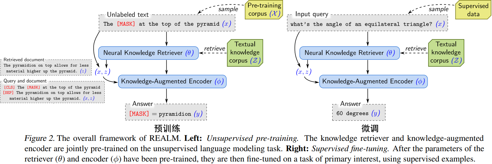

<u>模型结构</u>

* Neural Knowledge Retriever

  从预训练语料库 $\mathcal{X}$ 中抽取 masked 样本 $x$，检索知识语料库中的每个文档 $z \in \mathcal{Z}$. 

  首先对 $x$ 和 $z$ 进行编码，本文采用 BERT 模型的 `[CLS]` 输出，并且乘以一个投影矩阵进行降维：
  $$
  \begin{align}
  \text{Embed}_{\text{input}} (x) & = {\bf W}_{\text{input}}\text{BERT}_{\text{CLS}}\left( \text{ [CLS] } x \text{ [SEP] } \right) \\
  \text{Embed}_{\text{doc}} (z) & = {\bf W}_{\text{doc}}\text{BERT}_{\text{CLS}}\left( \text{ [CLS] }  z_{\text{title}} \text{ [SEP] } z_{\text{body} } \text{ [SEP] } \right)
  \end{align}
  $$
  然后计算两者的相似度获得相似概率：
  $$
  \begin{align}
  f\left(x,z\right) & = \text{Embed}_{\text{input}} (x) ^ \top \text{Embed}_{\text{doc}} (z) \\
  p\left(z \mid x\right) & = \frac{\exp f\left(x,z\right)}{\sum_{z'}\exp f\left(x,z'\right)}
  \end{align}
  $$
  根据相似度进行判断，获取所有可能的知识 $z$ 输出。令 $\theta$ 表示 retriever 所涉及的参数，供后面使用。

* Knowledge-Augmented Encoder

  拼接样本 $x$ 和获取的文档 $z$，作为另一个 BERT 的输入，这个 BERT 的功能是执行原本的 NLP 任务。

  * MLM 预训练

    目标是还原 $x$ 中被 masked 的 tokens 序列 $y$.
    $$
    \begin{align}
    p \left( y \mid z,x \right) & = \prod_{j=1}^{J_x} p \left ( y_j \mid z,x \right ) \\
    p \left ( y_j \mid z, x \right ) & \propto \exp \left ( w_j^\top \text{BERT}_{\text{MASK(j)}} \left ( \text{ [CLS] }  x \text{ [SEP] } z_{\text{body} } \text{ [SEP] } \right ) \right)
    \end{align}
    $$
    其中 $\text{BERT}_{\text{MASK(j)}}$ 表示 BERT 输出序列中对应第 $j$ 个 masked token 位置的输出向量，$J_x$ 是 $x$ 中总的 `[MASK]` 数量，$w_j$ 是 token $y_j$ 的 embedding 向量。

    【注】在预训练中 $y_j$ 本身就是标注，因此直接取预测为 $y_j$ 的概率作为基本的损失单元。

  * Open-QA 微调

    此时文档 $z$ 已经确定，要填空 $y$，任务本质上由<u>多跳阅读理解转化为文档阅读理解</u>。

    令 $S(z,y)$ 为 $z$ 中**可能是 $y$ 的范围的集合**，则预测为 $y$ 的概率为：
    $$
    \begin{align}
    p \left ( y \mid z, x \right ) & \propto \sum_{s\in S(z,y)} \exp \left ( \mathrm{MLP} \left ( \left [ h_{\text{START}(s)} ; h_{\text{END}(s)} \right ] \right ) \right ) \\
    h_{\text{START}(s)} & = \text{BERT}_{\text{START}(s)} \left ( \text{ [CLS] }  x \text{ [SEP] } z_{\text{body} } \text{ [SEP] } \right ) \\
    h_{\text{END}(s)} & = \text{BERT}_{\text{END}(s)} \left ( \text{ [CLS] }  x \text{ [SEP] } z_{\text{body} } \text{ [SEP] } \right )
    \end{align}
    $$
    其中 $\text{BERT}_{\text{START}(s)}$ 和 $\text{BERT}_{\text{END}(s)}$ 分别表示 BERT 输出序列中对应 $s$ 起始、结束位置的向量，$\mathrm{MLP}$ 是一个前馈神经网络。

  令 $\phi$ 表示 encoder 所涉及的参数，供后面使用。

<u>模型训练</u>

两个系统通过全概率公式整合在一起，并进行联合训练：
$$
p \left ( y \mid x \right ) = \sum_{z \in \mathcal{Z}} p\left(y\mid x,z\right)p\left(z\mid x\right)
$$
整个系统的预训练、微调的目标是，最大化对数似然函数 $\log p\left ( y \mid x \right )$，通过梯度的反向传播，可以更新参数 $\theta$ 和 $\phi$. 但这有计算上的挑战，即边际概率 $p \left ( y \mid x \right )$ 的计算，涉及对知识语料库 $\mathcal{Z}$ 的求和，计算量起码是百万级别的。

作者做了两个优化：

* 近似计算

  选择概率最高 top-$k$ 个文档 $z$ 来近似计算 $p \left ( y \mid x \right )$. 因为绝大部分文档由于与问题不相关，即 $p \left( z \mid x \right)$ 接近于零。

* MIPS

  <u>近似计算带来的问题</u>是如何搜索这 top-$k$ 个文档。作者注意到 $p \left( z \mid x \right)$ 正比于相关性 $f\left(x,z\right) = \text{Embed}_{\text{input}} (x) ^ \top \text{Embed}_{\text{doc}} (z)$ 这个内积，于是使用最大内积搜索算法（MIPS）来寻找 top-$k$ 文档，能够达到线性时间复杂度。

  <u>MIPS 带来的问题</u>是要构建一个快速检索的索引——这要求两个编码后的向量是固定的，在不断训练的编码器无法满足。因此，作者使用异步更新的策略，即**每隔几百步**才 re-embedding 和 re-indexing 所有文档来更新索引。实验发现 MIPS 的索引每次更新只是稍微变化，对于只使用 top-$k$ 文档的模型来说很难命中需要更新的索引，因此实验结果是稳健的。

作者还总结了额外的策略：

* 只使用真正需要知识的词（通常是实体和日期）来训练 MLM
* 在 top-$k$ 文档外添加一个虚拟的 null document（兼容无意义的 mask 训练？）
* 避免让 $x$ 出现在 $z$ 中（因为 $x$ 被 mask 过，如果它来源于 $z$，那答案就暴露了！）
* 避免冷启动的 retriever 太渣导致的恶性循环，用了一个以 ICT 作为任务的模型来初始化 retriever

---

###### RAG (Lewis et al., 2020b)

RAG 针对**生成式 Open-QA** 提出<u>检索增强式生成 (Retrieval Augmented Generation，RAG) 架构</u>，一种参数和非参数结合进行知识记忆的方法。参数式记忆由预训练的 seq2seq 模型 BART 提供，非参数式记忆由预训练的神经检索器作用于 Wikipedia 密集向量索引得到，这是 RAG 的**两种知识来源**。

RAG 的基本结构和 REALM 一样，只是用生成模型**替换** REALM 的回归模型，并补充训练和测试技术，扩展了应用范围。REALM 和 RAG 的架构存在中间步骤，使得其内部知识能够扩展和改动，解决了 PTMs 难以修正记忆的缺陷：REALM 和 RAG 的内部知识可随意更改或补充，从而控制知识的取舍，减少时间和算力的浪费。

<u>模型流程</u>

RAG 的整体架构如下图，它延续 **“检索 $\rightarrow$ 编码”** 的流程，分为 Retriever 和 Geneator 两个系统：

* Retriver $p_\eta\left(z\mid x\right)$，模型参数为 $\eta$，输入查询 $x$ 返回 top-$k$ 个文档
* Generator $p_\theta\left(y_i\mid x,z,y_{1:i-1}\right)$，模型参数为 $\theta$，输入查询 $x$、提取的文档 $z$、先前输出 $y_{1:i-1}$，生成当前 token $y_i$

给定如图中的三种 query $x$，Retriver 检索出 $k$ 个最相关的文档 $z$，然后拼接 $[x, z]$ 输送到 Generator 中做自回归生成。 

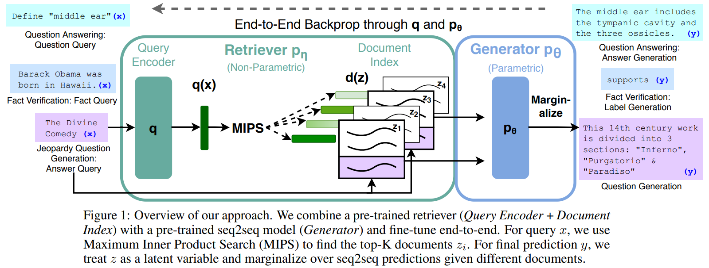

<u>模型结构</u>

* Retriver：DPR

  检索器采用提出的 DPR 检索模型（貌似和 REALM 的一样），它包含查询编码器和文档编码器：
  $$
  \begin{align}
  \mathbf{q}(x) & = \text{BERT}_q(x) \\
  \mathbf{d}(z) & = \text{BERT}_d(z) \\
  p_\eta \left ( z \mid x \right ) & \propto \exp \left ( \mathbf{d}(z)^\top\mathbf{q}(x) \right )
  \end{align}
  $$
  其中 $\mathbf{d}(z)$ 和 $\mathbf{q}(x)$ 是两个 BERT~BASE~ 生成的稠密向量表示。然后计算先验概率 $p_\eta \left ( z \mid x \right )$ 找 top-$k$ 文档 $z$，这是一个 MIPS 问题。

* Generator：BART

  生成器可以是任意的 encoder-decoder 模型，本文采用 BART~large~ 模型。生成器的输入是拼接的查询和文档 $[x, z]$.

<u>模型训练</u>

为了端到端地联合训练 Retriver 和 Generator，将检索到的文档看作隐变量，以概率的方式建模边际似然 $p\left(y\mid x\right)$，有两种计算方法。

* RAG-Sequence

  生成器在生成目标句中每个词的时候使用相同的文档作为条件，每个文档是一个单独的隐变量，通过 top-$k$ 的方式近似边际似然。
  $$
  \begin{align*} p_{\text {RAG-Sequence }}(y \mid x) &\approx \sum_{z \in \operatorname{top-k}(p(\cdot \mid x))} p_{\eta}(z \mid x) p_{\theta}(y \mid x, z)\\ &=\sum_{z \in \operatorname{top-k}(p(\cdot \mid x))} p_{\eta}(z \mid x) \prod_{i}^{N} p_{\theta}\left(y_{i} \mid x, z, y_{1: i-1}\right) \end{align*} \\
  $$

* RAG-Token

  允许生成器在生成目标句中每个词的时候使用不同的文档作为条件，这种方式直观上更灵活，也更接近于标准的解码方式。
  $$
  p_{\text {RAG-Token }}(y \mid x) \approx \prod_{i}^{N} \sum_{z \in \operatorname{top-k}(p(\cdot \mid x))} p_{\eta}(z \mid x) p_{\theta}\left(y_{i} \mid x, z, y_{1: i-1}\right) \\
  $$

【技】RAG 可以用于分类任务，类似 T5 一样，将目标类别当中长度为 $1$ 的序列进行预测就行。

【注】当任务的输出长度为 $1$ 时，RAG-Sequence 和 RAG-Token 等价。

其他训练细节：

* 使用 DPR 论文中预训练的 bi-encoder 初始化 retriver 并建立文档索引
* 文档编码器 $\text{BERT}_d$ 的训练费时间，每次微调后都得重新建立 MIPS 索引——得像 RELAM 一样周期性更新。但作者发现不训练它对模型最终表现影响不大，所以保持 文档编码器 $\text{BERT}_d$ 及其索引不变，只微调查询编码器 $\text{BERT}_q(x)$ 和生成器 $\text{BART}$.

<u>模型测试</u>

在 test 阶段，RAG-Sequence 和 RAG-Token 以不同的方式来近似 $\arg \max _{y} p(y \mid x)$，下面讲解。

* RAG-Token

  该模型是标准的自回归 seq2seq 生成器，转移概率为
  $$
  p_{\theta}^{\prime}\left(y_{i} \mid x, y_{1: i-1}\right)=\sum_{z \in \operatorname{top-k}(p(\cdot \mid x))} p_{\eta}\left(z_{i} \mid x\right) p_{\theta}\left(y_{i} \mid x, z_{i}, y_{1: i-1}\right) \\
  $$
  解码时可以使用 beam search 算法寻找最优解，将 $p_{\theta}^{\prime}\left(y_{i} \mid x, y_{1: i-1}\right)$ 插入到标准的 beam decoder 即可。

* RAG-Sequence

  该模型的 $p(y\mid x)$ 不能分解为每个词的条件概率乘积，需要针对每个文档表示 $z$ 做 beam search，用 $p_{\theta}\left(y_{i} \mid x, z, y_{1: i-1}\right)$ 对每个假设打分，得到候选假设集 $Y$，其中一些元素可能不曾出现在所有文档的 beams 中。

  为了估计候选集中每个 $y$ 相对于每个文档的生成概率，作者提出了两种解码方式：

  * Thorough Decoding：对那些未出现在其他文档 beam seach 路径的 $y$ 重新计算生成概率

  * Fast Decoding：将未出现在其他文档 beam seach 路径的 $y$ 的概率直接近似为 $p_\theta(y\mid x,z_i)\approx 0$

---

###### KnowBERT (Peters et al., 2019)

KnowBERT 抛弃<u>相似度检索</u>的方式，转而将切入点放在**识别的实体**上面，于是所使用的外部知识不再是<u>文本语料库</u>，而是**实体知识库**。

<u>实体识别</u>

从输入中检测 entity 的 mention 是前人的工作，该方法在关于指代消解的文章《End-to-end Neural Coreference Resolution》中提出，作者直接拿来用，封装成一个 external mention detector。下面简要说明该方法的输入输出格式：

> **mention 检测**
>
> 采用基于规则的方法。
>
> 输入：文本
>
> 输出：候选实体列表 $C$ 与之对应的先验概率
>
> 例子：Prince sang Purple Rain, she … $\longrightarrow$ [Prince] sang [Purple [Rain]]，[she]…
>
> **指代消解**
>
> 例如上面的文本中，Prince 和 she 共同指代同一个实体，但 embedding 却有差异，指代消解的目的就是消除这样的不一致。
>
> 这里不赘述相关工作。

得到 entity 后的工作是获取 entity embeddings，这里作者对于不同的数据库作者的做法不完全一致：

* 对于图结构的数据库，使用 2019 年知识图谱 embedding 的最新工作获得实体嵌入
* 对于仅有实体元数据的数据库，使用 doc2vec 的方式直接从 Wikipedia 描述中学习页面标题的 300 维嵌入

* 上面两种融合在一起的数据库，融合使用方法

于是，对于一段文本，作者站在巨人肩膀上，直接检测到其 mention 并获得对应的 entity embedding.

<u>实体嵌入</u>

作者提出 Knowledge Attention and Recontextualization (KAR) 组件来向 Transformer 隐层嵌入知识，其结构如下图。KAR 采用 attention 机制整合到 BERT 的层间，对隐层向量的改动是全局的，称为**注入式**。

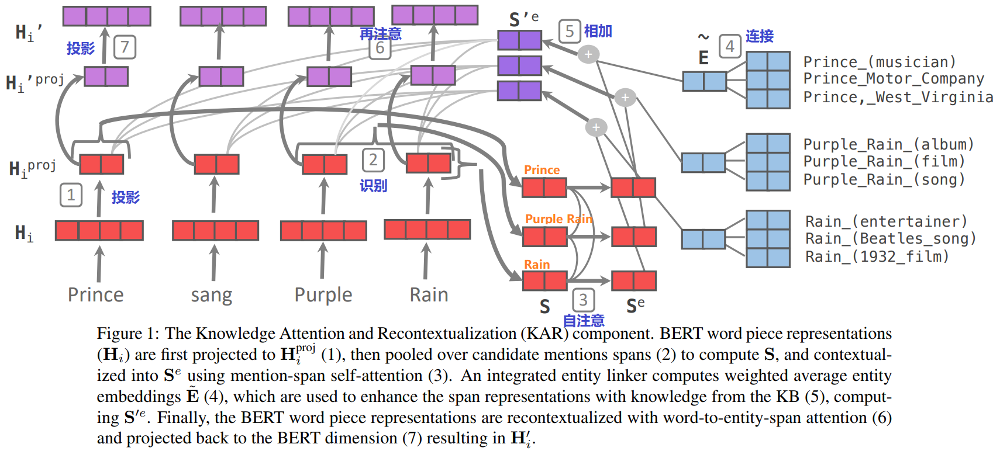

1. 投影
   
   取 BERT 的隐层向量 $\mathbf{H}_i$ 做线性投影，调整到 entity embedding 的维度 $E$ (一般 200 或 300)，得到 $\mathbf{H}_i^{\text{proj}}$
   $$
   \mathbf{H}_i^{\text{proj}} = \mathbf{H}_i \mathbf{W}_i^{\text{proj}} + \mathbf{b}_1^{\text{proj}}
   $$
   
2. 识别

   使用前面提到的 external mention detector 处理隐层向量 $\mathbf{H}_i^{\text{proj}}$，得到 $C$ 个 candidate-span $m$，对应 $C$ 个 mention-span 向量  $\mathbf{s}_m \in \mathbb{R}^E$，堆叠成为 $\mathbf{S} \in \mathbb{R}^{C\times E}$

3. 自注意
   
   使用 multi-headed mention-span self-attention 得到 contextualized 的 $\mathbf{S}^e$，公式为
   $$
   \mathbf{S}^e = \text{TransformerBlock}(\mathbf{S})
   $$
   于是，每个 mention-span 都有一个 contextualized mention-span $s_m^{\bf e}\in \mathbb{R}^E$，堆叠成为 $\mathbf{S}^e \in \mathbb{R}^{C\times E}$.
   
4. 连接

   现在每个 candidate span $m$ 都有一个 contextualized mention-span 向量 $s_m^{e}$，以及实体知识库中的 $M_m$ 个 candidate entities，其中每个 entity embedding 为 $\mathbf{e}_{mk}\in \mathbb{R}^{E}$ 、先验概率为 $p_{mk}\in \mathbb{R}$（$k$ 从 $1$ 到 $M_m$）。

   将先验概率 $p_{mk}$ 和内积 $\mathbf{s}^e_m \cdot \mathbf{e}_{mk}$ 传入两层 MLP (隐层维度 100)，计算得分：
   $$
   \psi_{mk} = \text{MLP}\left(p_{mk},\mathbf{s}^e_m \cdot \mathbf{e}_{mk}\right)
   $$
   然后按照一定的阈值 $\delta$ 进行j截断筛选：
   $$
   \tilde{\psi}_{mk} =  \left\{\begin{align}
   & \frac{\exp \left( \psi_{mk} \right)}{\sum_{\psi_{mk}\ge\delta}\exp \left( \psi_{mk} \right)},  & \psi_{mk} \ge \delta\\
   & 0, & \psi_{mk} < \delta\\
   \end{align}\right.
   $$
   最后，根据得分 $\tilde{\psi}_{mk}$ 对所有 entity embedding $\mathbf{e}_{mk}$ 进行加权求和，得到 weighted entity embedding：
   $$
   \tilde{\bf e}_m = \sum_k \tilde{\psi}_{mk} \mathbf{e}_{mk}
   $$
   【注1】如果所有的实体得分都低于阈值 $\delta$，就用一个特殊的 `NULL` embedding 替代 weighted entity embedding $\tilde{\bf e}_m$

   【注2】如果此时有 ground truth，即 mention-span 所应该真正对应的实体，那么可以对 $\text{MLP}$ 进行训练，有两种损失函数：
   $$
   \begin{align}
   \mathcal{L}_{\text{EL}} & = -\sum_m \log \left(\frac{\exp\left(\psi_{mg}\right)}{\sum_k \exp\left(\psi_{mk}\right)}\right) \\
   \mathcal{L}_{\text{EL}} & = \max\left(0, \gamma -\psi_{mg} + \sum_{e_{mk}\neq e_{mg} } \max \left( 0, \gamma + \psi_{mk} \right) \right)
   \end{align}
   $$

5. 相加

   将 contextualized mention-span $s_m^{e}$ 与 weighted entity embedding $\tilde{\bf e}_m$ 相加，得到 entity-span representation $s_m'^{e}$：
   $$
   s_m'^{e} = s_m^{e} + \tilde{\bf e}_m
   $$
   将 $C$ 个 $s_m'^{e} \in \mathbb{R}^{E}$ 堆叠成 $\mathbf{S}'^e \in \mathbb{R}^{C\times E}$.

6. 再注意

   得到融入知识的 $\mathbf{S}'^e$ 后，再通过 multi-headed word-to-entity-span attention 将其注入到 BERT 模型中：
   $$
   \mathbf{H}_i^{'\text{proj}} = \text{MLP}\left(\text{MultiHeadAttn}\left(\mathbf{H}_i^{\text{proj}},\mathbf{S}'^e,\mathbf{S}'^e\right)\right)
   $$

7. 投影

   最后将 $\mathbf{H}_i^{'\text{proj}}$ 投影回原有的维度当中：
   $$
   \mathbf{H}_i' = \mathbf{H}_i^{'\text{proj}}\mathbf{W}_2^{\text{proj}} + b_2^{\text{proj}} + \mathbf{H}_i
   $$
   这里加上了上一层的输出 $\mathbf{H}_i$，做一次残差连接。

   【注】为了保持对齐，将 $\mathbf{W}_2^{\text{proj}}$ 初始化为 $\mathbf{W}_1^{\text{proj}}$ 的矩阵逆。

<u>模型训练</u>

模型训练算法和损失函数如下。

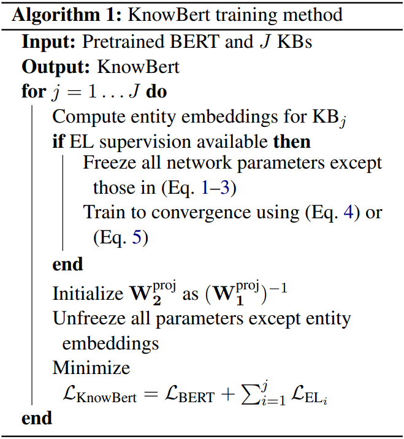

---

###### EaE (Févry et al., 2020)

EaE 同样通过文本中的实体调取出不同的知识来辅助后续推理，相比 KnowBERT（还有 ERINE，E-BERT 等）通过 attention 实现的 “知识注入式”，本文和下文对知识的结合方式更加直接——“知识相加式”，没有第二次的注意力整合，因而对隐层向量的改动是局部的。

<u>模型结构</u>

EaE 的结构和 KnowBERT 类似，也是在 Transformer 中间层切入知识，切入点位于前 $l_0 = 4$ 层和后 $l_1 = 8$ 层之间，其结构如下。

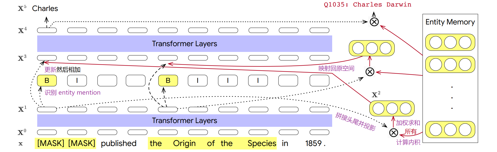
$$
\begin{align}
\mathbf{X}^0 & = \text{TokenEmbed} \left( \mathbf{x} \right) \\
\mathbf{X}^1 & = \text{Transformer} \left( \mathbf{X}^0, \text{num\_layers} = l_0 \right) \\
\mathbf{X}^2 & = \text{EntityMemory} \left( \mathbf{X}^1 \right) \\
\mathbf{X}^3 & = \text{LayerNorm} \left( \mathbf{X}^2 + \mathbf{X}^1 \right) \\
\mathbf{X}^4 & = \text{Transformer} \left( \mathbf{X}^3, \text{num\_layers} = l_1 \right) \\
\mathbf{X}^5 & = \text{TaskSpecificHeads} \left( \mathbf{X}^4 \right) \\
\end{align}
$$
EaE 的核心是 $\text{EntityMemory}$ 模块，它接受 Transformer 中间层 ${\bf X}^l$ 作为输入，输出 entity representation ${\bf X}^{l+1}$. 下面详细介绍其处理流程，先设 ${\bf E} \in \mathbb{R}^{N\times d_{ent}}$ 为 entity embedding 矩阵，函数 $\text{EntEmbed}(e_i)$ 将 entity $e_i$ 映射到 ${\bf E}$ 中对应的行。

将 $X^1$ 输入 $\text{EntityMemory}$ 后，<u>识别该段落中的每个 entity mention</u> $m_i = \left( e_{m_i}, \text{start}_{m_i}, \text{tail}_{m_i} \right)$（识别方法见下述注1，这里就当作已知输入），取其开始和结束位置的对应 $\mathbf{X}^1$ 中的向量 $x^l_{\text{start}_{m_i}}$ 和 $x^l_{\text{tail}_{m_i}}$，进行<u>**拼接**后投影</u>到 entity 的维度：
$$
h_{m_i} = \mathbf{W}_f\left[x^l_{\text{start}_{m_i}} \parallel x^l_{\text{tail}_{m_i}}\right]
$$
其中 $\mathbf{W}_f \in \mathbb{R}^{d_{ent}\times 2\cdot d_{emb}}$，$d_{emb}$ 是 $\mathbf{X}^1$ 的维度，$d_{ent}$ 是 entity 的维度。

然后对每个 $e_j \in E$，与 $h_{m_i}$ <u>计算内积</u>，并选取选择得分最高的 $K$ 个 entity embeddings (训练时 $K=N$，推断时 $K=100$)：
$$
\text{topK}\left(E, h_{m_i}, K\right) = \underset{e_j\in E}{\text{argmax-K}}\left\{\text{EntEmbed}(e_j) \cdot h_{m_i}\mid \right\}
$$
将它们<u>加权求和</u>，得到 $E_{m_i}$：
$$
\begin{align}
\alpha_j & = \frac{\exp\left(\text{EntEmbed}(e_j) \cdot h_{m_i}\right)}{\sum_{e \in \text{topK}\left(E, h_{m_i}, k\right)}\exp\left(\text{EntEmbed}(e) \cdot h_{m_i}\right)} \\
E_{m_i} & = \sum_{e_j \in \text{topK}\left(E, h_{m_i}, k\right)} \alpha_j \cdot \text{EntEmbed}(e_j)\\
\end{align}
$$
最后，将 $E_{m_i}$ <u>映射回原空间</u>，只用<u>更新</u> entity mention $m_i$ 的**头位置**对应的向量：

$$
x^{l+1}_{k} =
\left\{\begin{align}
\mathbf{W}_bE_{m_i}, \;\;\;\; & k = \text{start}_{m_i} \\
x^l_i, \;\;\;\; & \text{others} \\
\end{align}\right.
$$

将 $x^{l+1}_k$ 堆叠为输出 ${\bf X}^{l+1}$，之后加入到 Transformer 隐层中。

> 【注1】Mention Detion
>
> 实体识别可以参考 KnowBERT 的 external mention detector，也可以参考本文的 internal mention detector.
>
> EaE 引入一个神经网络层来完成实体识别任务，它取 Transformer 第 1 层的输出 $X^1$，做 BIO 分类（判断一个 token 在 mention 中的 Beginning/Inside/Outside 哪个位置）。

<u>模型训练</u>

本文将 Transformer 末层输出用于两种任务，相应的 head 为：

* TokenPred：预测 masked tokens，将末层输出 $x^4_i \in \mathbf{X}^4$ 输入到基于 token vocabulary 的 softmax 层做分类
* EntityPred：预测 entity mention span 的 id，对每个 $m_i$，取最后一层输出的 $h_{m_i}$，判断与 $E$ 中最接近的 entity embedding

作者设语料库为 $\mathcal{D} = \left\{\left(\mathbf{x}_i, \mathbf{m_i}\right)\right\}$，其中 $\bf m_i$ 表示已经检测出的 entity mentions，但还未连接到对应的 entities. 

目标/损失来函数来自三个：

* Mention Dection

  实体识别任务是有监督信号的，对所有 label 采用交叉熵函数计算即可。
  $$
  \begin{align}
  \hat{e}_{m_i} & = \text{argmax}_{e_i \in E}\left((x^{l+1}_{m_i})^Te_i\right) \\
  loss_{\text{ctx}} & = \text{cross\_entropy}\left(\text{softmax}\left(x^{l+1}_{m_i},E\right),\mathbb{I}_{e_{m_i}}\right)
  \end{align}
  $$
  
* Entity Linking

  对于每个已经检测出 entity mentions 的 mention $m_i = \left( e_{m_i}, \text{start}_{m_i}, \text{tail}_{m_i} \right)$，其中 $e_{m_i} \neq e_\emptyset$，$h_{m_i}$ 应该尽量靠近 label entity：
  $$
  \begin{align}
  \text{ELLoss} & = \sum_{m_i}\alpha_i\cdot\mathbb{1}_{e_{m_i}\neq e_\emptyset } \\
  \alpha_i & = \frac{\exp\left(\text{EntEmbed}\left(e_{m_i}\right)\cdot h_{m_i}\right)}{\sum_{e\in E}\exp\left(\text{EntEmbed}\left(e\right)\cdot h_{m_i}\right)}
  \end{align}
  $$

* Masked Language Modelling

  MLM 的预训练同 BERT 一样，随机遮盖 20% 的实体，详见论文附录 B.

---

###### FaE (Verga et al., 2020)	

FaE 在 BERT 的架构基础上加入了一个<u>实体记忆模块</u>和<u>事实记忆模块</u>，即**在 EaE 的基础上增加一个事实记忆模块（三元组知识库）**。

<u>模型流程</u>

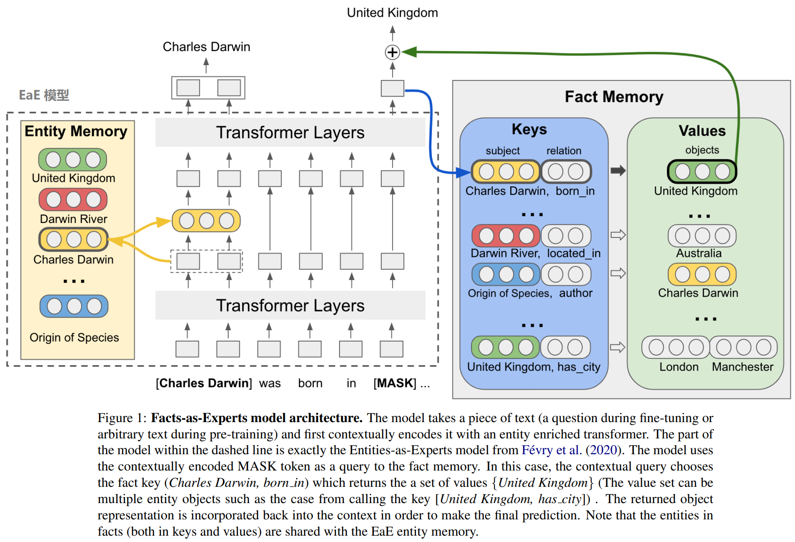

首先输入一段文本，经过 EaE 的上下文嵌入后，使用 `[MASK]` 作为对 $\text{FactMemory}$ 的 key，查询到对应的 value，然后返回到上下文中进行最终预测。需要强调的是，$\text{FactMemory}$ 中的 entity 与 $\text{EntityMemory}$ 中的一致/共享。

<u>模型结构</u>

在 EaE 的基础上，这里只需说明 $\text{FactMemory}$ 的工作结构。

#### 1.3.3 其他变种架构

现有 PTM 除了上述两类外，大多数研究都集中在优化 BERT 的架构来提高语言模型在自然语言理解方面的性能。

一系列工作旨在改进 mask 策略，可以理解为数据增强 (Gu et al., 2020)。

* Span BERT (Joshi et al., 2020)

  用跨度边界目标 (SBO) mask 连续随机长度的 token 跨度可以提高 BERT 的性能。

* ERNIE (Sun et al., 2019 c,d)，NEZHA (Wei et al., 2019)，Whole Word Masking (Cui et al., 2019)

  将整个实体进行 mask，提高 BERT 的性能。

另一个有趣的做法是将 mask 预测目标更改为更难的目标。

* ELECTRA (Clark et al., 2020)

  将 MLM 转换为替换标记检测 (RTD) 目标，其中 generator 替换原始序列中的 token，而 classifier 预测 token 是否被替换。

### 1.4 多元异构数据

利用多源异构数据的典型 PTM，包括多语言 PTM、多模态 PTM。

多跳阅读 ---> CogQA 不会自己提出有疑问的 entity，少了点针对性

忒修斯之BERT ---各层的替换有效果区别---> 金字塔蒸馏（高维特征的量少，压缩率更高）

