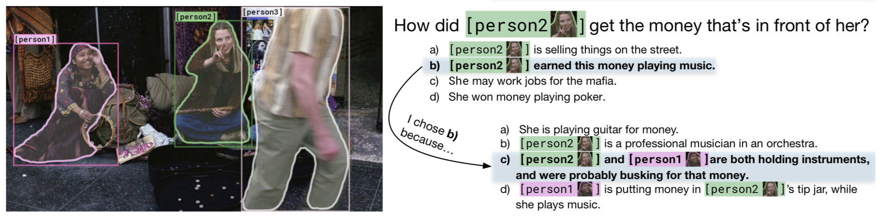
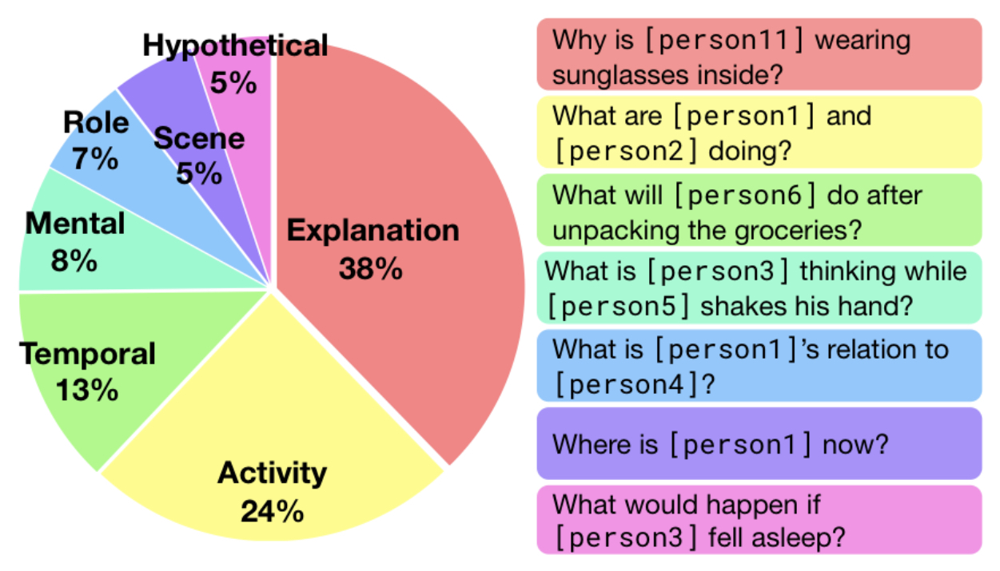
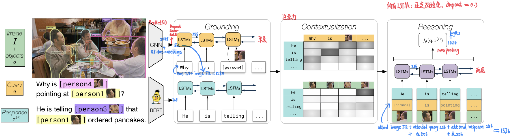
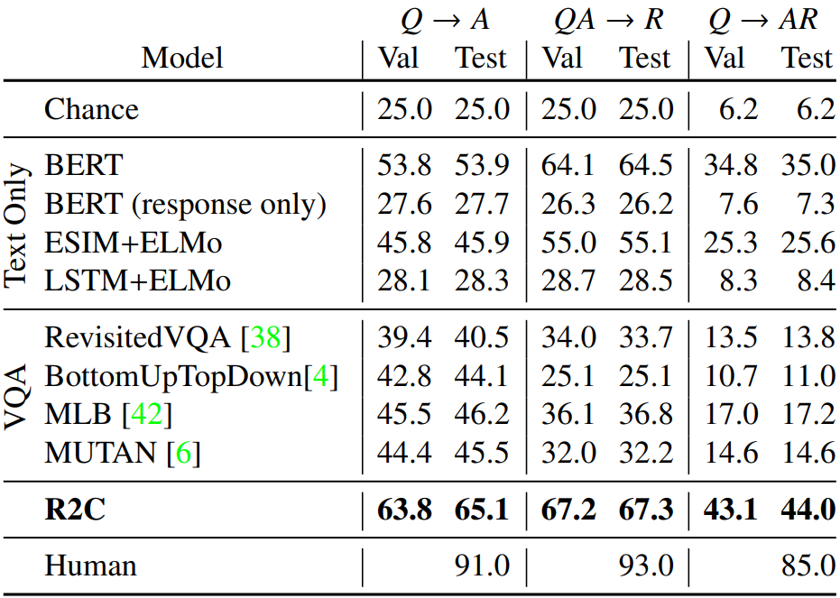

## 目录

[toc]

## 1 VCR

### 1.1 介绍

题目：From Recognition to Cognition : **V**isual **C**ommonsense **R**easoning

论点：本文在传统的模式识别的基础上，进一步提出视觉常识推理问题，并建立了从数据到模型的全套方法

### 1.2 引入

当前，在模式识别的研究上已经取得了长足的进步，而视觉理解——像人一样观察图像中的信息并进行一些简单的推理，仍然是一个困难的任务。

因此，本文先针对性地提出了 **VCR 问题**，其定义在后面讲到。

然后，建立相应的 **$\mathbb{VCR}$ 数据集**，它从约 `110,000` 个电影场景中建立约 `290,000` 个多项选择题（QA），其中的关键是“对抗式匹配”方法。

最后，作者提出了 Recognition to Cognition，**R2C 模型**，它由 grouding，contextualization 和 reasoning 三个模块组成。

### 1.3 VCR 问题建立

#### 1.3.1 问题定义

视觉理解是认识（recognition）到认知（cognition）过程的统称，

* 认识：识别图像中的内容，例如物体及其属性的检测
* 认知：能够根据图像中的信息进行推理，例如推断人可能的想法、目的和行为

当前在认识领域上已有许多的基础，故作者尝试解决认知领域的问题。而其中的一个**关键步骤**是视觉理解，表现为正确回答问题并给出理由，作者针对性地提出了 VCR 问题。

> **视觉常识推理（Visual Commonsense Reasoning，VCR）**
>
> 给出一张图像和相应的一个需要简单推理的问题，机器要能够正确地给出答案并提供理由

#### 1.3.2 问题建模

VCR 问题的答案和理由空间无穷无尽，作者就将其建立为两阶段多选择问题（$Q \rightarrow AR$），其示意图如下

该问题可以分解为两个子任务：

* 回答 $Q \rightarrow A$
* 证明 $QA \rightarrow R$

每个子任务的严格定义为：

> **Definition** $\mathbb{VCR}$ 子任务
>
> 一个子任务包含一幅图像 $I$ 和：
>
> * 检测物体序列 $o$. 每个检测物体 $o_i$ 包含一个边界框 $b$，一个分割遮罩 $m$ 和一个 类别标签 $\mathcal{l}_i \in \mathcal{L}$.
> * 一个查询 $q$ 由自然语言和图像指针的混合表示。问题中每个词 $q_i$ 要么是一词汇表 $\mathcal{V}$ 中的词语，要么是 $o$ 中一个物体的标记。
> * $N$ 个响应的集合中，每个响应 $r^{(i)}$ 的格式都与查询 $q$ 类似：自然语言和图像指针的组合。其中只有一个响应是正确的。
>
> 模型会选择一个最佳的响应。

在问题-回答（$Q \rightarrow A$）任务中，查询表示问题，响应表示对应的回答选项；在回答-证明（$QA \rightarrow R$） 任务中，查询表示问题与正确回答的连接，响应表示对应的理由选项。

本文使用正确率来评估模型，选取 $N=4$ 个响应。每个子任务上的基准正确率就是 $1/N=25\%$，整个任务上的基准正确率就是 $1/N^2=6.25\%$.

### 1.4 $\mathbb{VCR}$ 数据集构建

#### 1.4.1 数据收集

数据收集的流程为：提取电影截图中描述复杂但人易辨认的情景图。其中的关键是仔细地选择感兴趣的情景，总的来说要做到以下两点：

* 有趣和多样的情景
* 高质量的众包标注

最后得到的数据中，问题涉及的推断类别分布如下图。

#### 1.4.2 对抗式匹配算法

根据上面的问题模型，建立相应的数据集。其中的主要困难在于，如何构建大规模复杂问题的同时避免 annotation artifacts 问题？

> **概念：annotation artifacts**
>
> 该问题本质上是一种过拟合现象。
>
> 在人工制作的数据集上，如果有一些词语和标签有着紧密联系，模型就有可能直接使用这些词进行分类，但这对语义理解没有作用。
>
> 尤其是文本，当推理关系是 entailment （逻辑蕴含）时，容易产生这种“局部决定整体”现象，例如可能出现无需了解问题就能选出正确答案的现象。

作者提出了对抗式匹配（Adversarial Matching）算法，一个开创性的 QA 分配算法，能够大规模生产稳健的多选题数据集。

* 思想：将每个问题的正确答案**分配三次**——作为另外三个问题的错误答案

* 目标：错误答案必须尽可能与背景相关，同时不能与正确答案过于相似

* 公式：该目标可以表示为一个约束最优化问题，采用每个后选错误答案和最佳答案之间的<u>相关分数</u>和<u>蕴含分数</u>

  * 相关分数 $P_{rel}$：采用 BERT 模型

  * 蕴含分数 $P_{sim}$：采用 ESIM+ELMo 模型

  * 于是，给定一个样本 $(q_i,r_i)_{1 \leq i \leq N}$，通过权值矩阵 $W \in \mathbb{R}^{N \times N}$ 上的最大权值二分匹配得到每个 $q_i$ 的错误答案：
    $$
    W_{i,j} = \log \left ( P_{rel}(q_i,r_j) \right ) + \lambda \log \left ( 1-P_{sim}(r_i,r_j) \right )
    $$
    为了获得多个错误答案，执行多次二分匹配；为了保证错误答案的多样性，每次迭代时，用候选答案 $r_i$ 与分配给 $q_i$ 的所有响应之间的最大相似性，来代替相似性项。（控制最大相似性，并减小它）

### 1.5 R2C 网络

为了深入理解语言、视觉和世界中的信息，作者提出 Recognition to Cognition Networks (R2C) 模型。

模型输入：物体序列 $o$，查询 $q$，响应集合 $r=\{ r^{(1)}, \dots, r^{(i)}, \dots, r^{(4)} \}$

它分为三个模块：

* **Grouding**：学习给定序列中每一项的 image-language 表示

  * 因为查询和响应的格式相同，于是共用相同的一个模块，实现共享参数
  * 底层实现：
    * 双向 LSTM 网络，每一个位置传入 $w_i$ 和 $o_{w_i}$，所有位置的输出为 $r$（如果输入时响应），为 $q$（如果输入时查询）
      * 注：当 $w$ 为指针时，物体 $o_w$ 表示检测物体；当 $w$ 不是指针时，$o_w$ 表示整个图像边界
    * 使用 CNN 学习物体层特征 $o_{w_i}$，通过 Roi-Align* 得到
      * 为了额外编码物体类别信息，将物体类别标签 $l_o$ 的 embedding 投射到一个共享的隐层表示中

* **Contextualizaiton**：给定查询和响应的 grounded 表示，根据句子之间和句子与图像的关联，使用注意力机制去 contextualize 这些句子

  * 对于响应中的每一项 $i$，定义并计算 attended query representation $\hat{q}_i$
    $$
    \alpha_{i,j} = \text{softmax}(\bold{r}_i W\bold{q}_j)
    \\
    \hat{q}_i = \sum_{j}\alpha_{i,j}\bold{q}_j
    $$

  * 对于答案与图像，按同样的方法计算响应 $\bold{r}$ 与每个物体 $o$ 图像特征的双线性注意力，结果用 attended object representation $\hat{o}_i$ 表示

* **Reasoning**：在 response，attented query 和 attended object 之间进行推理

  * 底层实现：
    * 双向 LSTM 网络，每个位置传入 $\hat{q}_i$，$\bold{r}_i$ 和 $\hat{o}_i$
    * 为了更好地优化梯度流，每一个时间步连接 Reasoning LSTM 的输出与问题和答案表示，然后将结果序列进行最大池化、传入多重感知器预测 query-response compatibility 的 logit

实现细节：

* 图像特征的提取使用 CNN 的 ResNet-50
* 语言特征的提取使用 BERT
* R2C 的训练采用最小化每个响应 $r^{(i)}$ 的预测与真实答案之间的多分类交叉熵

### 1.6 任务结果

