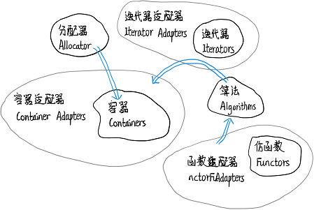

### 目录

[toc]

### 1.1 编译环境

#### 1.1.1 编译器介绍

编译器用于将用户编写的字符代码转换为计算机可以执行的二进制代码。

目前所有的 C++ 编译器一定支持有一份 STL，并且以源码形式存在。

#### 1.1.2 MinGW

##### 1.1.1.1 基本概念

MinGW 全称 Minimalist GNU on Windows，是 Windows 的 GCC 端口，它将经典的开源 C 语言编译器 GCC 移植到 Windows 平台下，并包含 Win32 API 来支持源代码编译为 Windows 可执行程序。总的来说，MinGW 就是 GCC 的 Windows 版本。

MinGW 与 MinGW-w64

* MinGW 只能编译生成32位可执行程序（已停止更新）
* MinGW-w64 则可以编译生成 64位 或 32位 可执行程序

特点

* MinGW-w64 使用 Windows 的 C 语言运行库，因此编译出的程序不需要第三方 DLL，可以直接在 Windows 下运行
* 著名的开源 IDE 实际只是将 MinGW-w64 封装了起来，使它拥有友好的图形化界面，简化了操作，但内部核心仍然是 MinGW-w64

##### 1.1.1.2 结构解析

+ `bin` - 存放开发相关的命令

  ​		`gcc.exe` - 一般用来编译 C 程序

  ​		`g++.exe` - 一般用来编译 C++ 程序

  ​		`gdb.exe` - 用于调试的命令

+ `etc`

+ `include`

+ `lib`

+ `libexec`

+ `licenses`

+ `opt`

+ `share`

+ `x86_64-w64-mingw32`

  `build-info.txt`

##### 1.1.1.3 编译方法

```shell
$ touch foo.c bar.cpp
$ gcc -v -c foo.c
```

##### 1.1.1.4 包含路径

* C 头文件目录

  `c：/ mingw / lib / gcc / x86_64-w64-mingw32 / 8.1.0 / include`

* C++ 头文件目录

  `c：/ mingw / lib / gcc / x86_64-w64-mingw32 / 8.1.0 / include / c++`
  
  `c：/ mingw / lib / gcc / x86_64-w64-mingw32 / 8.1.0 / include / c++ / bits`

* GNU 扩展头文件目录

  `c：/ mingw / lib / gcc / x86_64-w64-mingw32 / 8.1.0 / include / c++ / ext`

#### 1.1.3 GCC 与 Clang

GCC 全称 GNU Compiler Collection，指一套编程语言编译器，支持主要处理器架构：ARM、x86、x86-64、MIPS、PowerPC 等。

Clang 是一个 C、C++、Objective-C 和 Objective-C++ 编程语言的编译器前端，采用了底层虚拟机（LLVM）作为其后端。

### 1.2 基础知识

#### 1.2.1 标准库介绍

C++ 标准库（C++ Standard Library）中有丰富的类库及库函数资源，是 C++ 强大的功能来源。

C++ 标准库的内容总共在 50 个标准头文件中定义，分以下为 10 类。

##### 1.2.1.1 语言功能相关

| 头文件        | 描述                                                         |
| ------------- | ------------------------------------------------------------ |
| `<cstddef>`   | 定义宏 `NULL` 和 `offsetof`，以及其他标准类型 `size_t` 和 `ptrdiff_t`。<br/>与对应的标准 C 头文件的区别是，`NULL` 是 C++ 空指针常量的补充定义，宏 `offsetof` 接受结构或者联合类型参数，只要他们没有成员指针类型的非静态成员即可。 |
| `<limits>`    | 提供与基本数据类型相关的定义。<br/>例如，对于每个数值数据类型，它定义了可以表示出来的最大值和最小值以及二进制数字的位数。 |
| `<climits>`   | 提供与基本整数数据类型相关的C样式定义。<br/>这些信息的 C++ 样式定义在 `<limits>` 中。 |
| `<cfloat>`    | 提供与基本浮点型数据类型相关的C样式定义。<br/>这些信息的C++样式定义在 `<limits>` 中。 |
| `<cstdlib>`   | 提供支持程序启动和终止的宏和函数。<br/>这个头文件还声明了许多其他杂项函数，例如搜索和排序函数，从字符串转换为数值等函数：<br/>* 它与对应的标准 C 头文件 `stdlib.h` 不同，定义了 `abort(void)`。`abort()` 函数还有额外的功能，它不为静态或自动对象调用析构函数，也不调用传给 `atexit()` 函数的函数。<br/>* 它还定义了 `exit()` 函数的额外功能，可以释放静态对象，以注册的逆序调用用 `atexit()` 注册的函数。清除并关闭所有打开的 C 流，把控制权返回给主机环境。 |
| `<new>`       | 支持动态内存分配。                                           |
| `<typeinfo>`  | 支持变量在运行期间的类型标识。                               |
| `<exception>` | 支持异常处理，这是处理程序中可能发生的错误的一种方式。       |
| `<cstdarg>`   | 支持接受数量可变的参数的函数，即在调用函数时，可以给函数传送数量不等的数据项。<br/>它定义了宏 `va_arg`、`va_end`、`va_start` 以及 `va_list` 类型。 |
| `<csetjmp>`   | 为 C 样式的非本地跳跃提供函数。这些函数在 C++ 中不常用。     |
| `<csignal>`   | 为中断处理提供C样式支持。                                    |

##### 1.2.1.2 流的读写相关

| 头文件        | 描述                                                         |
| ------------- | ------------------------------------------------------------ |
| `<iostream>`  | 支持标准流 `cin`、`cout`、`cerr` 和 `clog` 的输入和输出，它还支持多字节字符标准流 `wcin`、`wcout`、`wcerr` 和`wclog` 。 |
| `<iomanip>`   | 提供操纵程序，允许改变流的状态，从而改变输出的格式。         |
| `<ios>`       | 定义 `iostream` 的基类。                                     |
| `<istream>`   | 为管理输出流缓存区的输入定义模板类。                         |
| `<ostream>`   | 为管理输出流缓存区的输出定义模板类。                         |
| `<sstream>`   | 支持字符串的流输入输出。                                     |
| `<fstream>`   | 支持文件的流输入输出。                                       |
| `<iosfwd>`    | 为输入输出对象提供向前的声明。                               |
| `<streambuf>` | 支持流输入和输出的缓存。                                     |
| `<cstdio>`    | 为标准流提供 C 样式的输入和输出。                            |
| `<cwchar>`    | 支持多字节字符的 C 样式输入输出。                            |

##### 1.2.1.3 诊断功能相关

| 头文件        | 描述                                 |
| ------------- | ------------------------------------ |
| `<stdexcept>` | 定义标准异常。异常是处理错误的方式。 |
| `<cassert>`   | 定义断言宏，用于检查运行期间的情形。 |
| `<cerrno>`    | 支持 C 样式的错误信息。              |

##### 1.2.1.4 工具函数相关

| 头文件         | 描述                                                         |
| -------------- | ------------------------------------------------------------ |
| `<utility>`    | 定义重载的关系运算符，简化关系运算符的写入。<br/>它还定义了 `pair ` 类型，该类型是一种模板类型，可以存储一对值。 |
| `<functional>` | 定义了许多函数对象类型和支持函数对象的功能，函数对象是支持 `operator()()` 函数调用运算符的任意对象。 |
| `<memory>`     | 给容器、管理内存的函数和 `auto_ptr` 模板类定义标准内存分配器。 |
| `<ctime>`      | 支持系统时钟函数。                                           |

##### 1.2.1.5 字符串处理相关

| 头文件      | 描述                                                         |
| ----------- | ------------------------------------------------------------ |
| `<string>`  | 为字符串类型提供支持和定义。<br/>包括单字节字符串（由 `char` 组成）的 `string` 和多字节字符串（由 `wchar_t` 组成）。 |
| `<cctype>`  | 单字节字符类别                                               |
| `<cwctype>` | 多字节字符类别                                               |
| `<cstring>` | 为处理非空字节序列和内存块提供函数。<br/>不同于对应的标准 C 库头文件，几个 C 样式字符串的一般 C 库函数被返回值为 `const` 和非 `const` 的函数对替代。 |
| `<cwchar>`  | 为处理、执行 I/O 和转换多字节字符序列提供函数。<br/>不同于对应的标准C库头文件，几个多字节 C 样式字符串操作的一般 C 库函数被返回值为 `const` 和非 `const` 的函数对替代。 |
| `<cstdlib>` | 为把单字节字符串转换为数值、在多字节字符和多字节字符串之间转换提供函数。 |

##### 1.2.1.6 容器类相关

| 头文件     | 描述                                                         |
| ---------- | ------------------------------------------------------------ |
| `<vector>` | 定义 `vector` 序列模板，这是一个大小可以重新设置的数组类型，比普通数组更安全、更灵活。 |
| `<list>`   | 定义 `list` 序列模板，这是一个序列的链表，常常在任意位置插入和删除元素。 |
| `<deque>`  | 定义 `deque` 序列模板，支持在开始和结尾的高效插入和删除操作。 |
| `<queue>`  | 为队列(先进先出)数据结构定义序列适配器 `queue` 和` priority_queue` . |
| `<stack>`  | 为堆栈(后进先出)数据结构定义序列适配器 `stack` .             |
| `<map>`    | `map` 是一个关联容器类型，允许根据键值是唯一的，且按照升序存储。`multimap` 类似于 `map`，但键不是唯一的。 |
| `<set>`    | `set` 是一个关联容器类型，用于以升序方式存储唯一值。`multiset` 类似于 `set`，但是值不必是唯一的。 |
| `<bitset>` | 为固定长度的位序列定义 `bitset` 模板，它可以看作固定长度的紧凑型 `bool` 数组。 |

##### 1.2.1.7 迭代器相关

| 头文件       | 描述                     |
| ------------ | ------------------------ |
| `<iterator>` | 给迭代器提供定义和支持。 |

##### 1.2.1.8 算法操作相关

| 头文件        | 描述                                                         |
| ------------- | ------------------------------------------------------------ |
| `<algorithm>` | 提供一组基于算法的函数，包括置换、排序、合并和搜索。         |
| `<cstdlib>`   | 声明 C 标准库函数 `bsearch()` 和 `qsort()`，进行搜索和排序。 |
| `<ciso646>`   | 允许在代码中使用 `and` 代替 `&&`。                           |

##### 1.2.1.9 数值操作相关

| 头文件       | 描述                                                         |
| ------------ | ------------------------------------------------------------ |
| `<complex>`  | 支持复杂数值的定义和操作。                                   |
| `<valarray>` | 支持数值矢量的操作。                                         |
| `<numeric>`  | 在数值序列上定义一组一般数学操作，例如 `accumulate` 和 `inner_product`. |
| `<cmath>`    | 这是 C 数学库，其中还附加了重载函数，以支持 C++ 约定。       |
| `<cstdlib>`  | 提供的函数可以提取整数的绝对值，对整数进行取余数操作。       |

##### 1.2.1.10 本地化相关

| 头文件      | 描述                                                   |
| ----------- | ------------------------------------------------------ |
| `<locale>`  | 提供的本地化包括字符类别、排序序列以及货币和日期表示。 |
| `<clocale>` | 对本地化提供 C 样式支持。                              |

#### 1.2.2 标准模板库介绍

##### 1.2.2.1 标准库与组件关系

C++ 标准模板库（C++ Standard Template Library，STL）是惠普实验室开发的一系列软件的统称，是一套功能强大的 C++ 模板类。

它是 C++ 标准库的一大核心，关系如下：


STL 一般细为六大组件，彼此之间可以组合套用。



##### 1.2.2.2 STL 组件介绍

* 容器（containers）

  容器是各种数据结构，用来存放数据。

  例如：`vector`，`list`，`deque`，`set`，`map`.

* 算法（algorithms）

  算法用于操作容器中的元素，实现各种功能。

* 迭代器（iterators）

  迭代器是容器与算法之间的接口，所谓 ”泛型指针“。

* 仿函数（functors）

  仿函数也称作函数对象（function object），具有 ”像函数一样的行为“，基于算法形成各种策略（policy）。

* 适配器（adapters）

  适配器用来修饰容器、仿函数或迭代器，形成新的、更自定义的组件。

<u>例：六大组件的组合套用</u>

```c++
#include <vector>
#include <algorithm>
#include <functional>
#include <iostream>

using namespace std;

int main()
{
    int ia[6] = { 27, 210, 12, 47, 109, 83 };
    // container  allocator
    //  |			|
    //  v			v
    vector<int, allocator<int>> vi(ia, ia+6);
    // 		algorithm		iterator	function_adapter   functor
    // 			|			|	   |		 |		|		|
    // 			v			v	   v		 v		v		v
    cout << count_if( vi.begin(), vi.end(), not1(bind2nd(less<int>(), 40)) );
    return 0;
}
```

#### 1.2.3 SGI STL 配置文件

不同的编译器对 C++ 的支持程度不同，因此为了拥有可靠的移植能力，SGI STL 定义了一个环境配置文件 `<stl_config.h>`.

配置文件中定义了许多常量，表示某些配置是否成立，所有 STL 头文件都会直接或间接包含这个配置文件。

##### 1.2.3.1 经典常量解析

以下是 [`stl_config.h`](src\stl_config.h) 的内容解析，本配置文件功能列表: 

1. 如果编译器没有定义 `bool`, `true`, `false` 则定义

2. 如果编译器不支持 `drand48()` 函数则定义 `__STL_NO_DRAND48`
     [注] `drand48` 产生双精度的伪随机数，因为采用了 `48bit` 计算, 故名 `drand48`.
     
3. 如果编译器不支持 static members of template classes（模板类静态成员），则定义 `__STL_STATIC_TEMPLATE_MEMBER_BUG`

     ```c++
     // 测试在 class template 中拥有 static data members
     template <typename T>
     calss testClass {
     public: // 纯粹为了方便测试，使用 public
         static int _data; // NOTE: 静态成员
     };
     int testClass<int>::_data = 1;
     int testClass<int>::_data = 2;
     ```

4. 如果编译器不支持 `typename` 关键字, 则将 `typename` 定义为空（`null macro`）

5. 如果编译器支持 partial specialization of class templates（类模板偏特化），则定义 `__STL_CLASS_PARTIAL_SPECIALIZATION`
     [参考资料] http://msdn.microsoft.com/en-us/library/9w7t3kf1(v=VS.71).aspx

     ```c++
     // 测试 class template partial specialization
     template <class I, class O> // 一般化设计
     struct testClass {
         testClass() { cout << "I, O" << endl; }
     };
     
     template <class T> // NOTE: 特例化设计
     struct testClass<T*, T*> {
         testClass() { cout << "T*, T*" << endl; }
     };
     
     template <class T> // NOTE: 特例化设计
     struct testClass<const T*, T*> {
         testClass() { cout << "const T*, T*" << endl; }
     };
     ```

6. 如果编译器支持 partial ordering of function templates（函数模板特化优先级），则定义 `__STL_FUNCTION_TMPL_PARTIAL_ORDER`
     [参考资料] http://msdn.microsoft.com/zh-cn/library/zaycz069.aspx

     ```c++
     class alloc {};
     
     template <class Tp, class _Alloc = alloc>
     class vector {
     public:
         void swap(vector<Tp, _Alloc>&) { cout << "swap()" << endl; }
     };
     
     #ifdef __STL_FUNCTION_TMPL_PARTIAL_ORDER // 节选自 stl_vector.h
     template <class _Tp, class _Alloc>
     inline void swap(vector<_Tp, _Alloc>& __x, vector<_Tp, _Alloc>& __y)
     {
       __x.swap(__y);
     }
     #endif
     ```

7. 如果编译器支持 calling a function template by providing its template arguments explicitly（显式指定调用模板函数的模板参数），则定义`__STL_EXPLICIT_FUNCTION_TMPL_ARGS`

     [注] 整个 SGI STL 都没有用到这一常量的定义。

8. 如果编译器支持 template members of classes（类模板成员），则定义 `__STL_MEMBER_TEMPLATES`

     ```c++
     // 测试 class template 之内可否再有 template (members)
     class alloc {};
     
     template <class T, class Alloc = alloc> // NOTE: 外模板
     class vector {
     public:
         typedef T value_type;
         typedef value_type* iterator;
         
         template <class I> // NOTE: 内模板
         void insert(iterator position, I first, I last) {
             cout << "insert()" << endl;
         }
     };
     ```

9. 如果编译器不支持 `explicit` 关键字, 则将 `explicit` 定义为空（`null macro`）

10. 如果编译器不能根据前一个模板参数设定后面的默认模板参数，则定义 ` __STL_LIMITED_DEFAULT_TEMPLATES`

     ```c++
     // 测试 template 参数可否根据前一个 template 参数而设定默认值
     class alloc {};
     
     template <class T, class Alloc = alloc, size_t BufSiz = 0> // NOTE: 默认值
     class deque {
     public:
         deque() { cout << "deque" << endl; }
     }
     
     template <class T, class Sequence = deque<T> > // NOTE: 默认值
     class stack {
     public:
         stack() { cout << "stack" << endl; }
     private:
         Sequence c;
     };
     ```

11. 如果编译器不能处理函数模板的非类型（`non-type`）模板参数，则定义 `__STL_NON_TYPE_TMPL_PARAM_BUG`

      ```c++
      // 测试 class template 可否拥有 non-type template 参数
      class alloc {};
      
      inline size_t __deque_buf_size(size_t n, size_t sz)
      {
          return n != 0 ? n : (sz < 512 ? size_t (512 / sz) : size_t(1));
      }
      
      template <class T, class Ref, class Ptr, size_t BufSiz> // NOTE: 非类型参数
      struct __deque_iterator {
          typedef __deque_iterator<T, T&, T*, BufSiz> iterator;
          typedef __deque_iterator<T, const T&, const T*, BufSiz> const_iterator;
          static size_t buffer_size() { return __deque_buf_size(BufSize, sizeof(T)); }
      };
      
      template <class T, class Alloca = alloc, size_t BufSiz = 0> // NOTE: 非类型参数
      class deque {
      public:		// Iterators
          typedef __deque_iterator<T, T&, T*, BufSiz> iterator;
      };
      ```

12. 如果编译器不支持迭代器使用 `'->'` 操作符，则定义 `__SGI_STL_NO_ARROW_OPERATOR`

13. 如果编译器（在当前编译模式下）支持异常，则定义 `__STL_USE_EXCEPTIONS`

14. 如果我们将 STL 放进命名空间中，则定义 `__STL_USE_NAMESPACES`

15. 如果本 STL 在 SGI 的编译器上编译, 并且用户没有选择 `pthreads` 或者 `no threads`，则默认使用 `__STL_SGI_THREADS`
        [注] POSIX thread 简称为 `pthread`，`Posix` 线程是一个 POSIX 标准线程。

16. 如果本 STL 在 Win32 平台的编译器上使用多线程模式编译，则定义 `__STL_WIN32THREADS`

17. 适当的定义命名空间相关的宏（`__STD`，` __STL_BEGIN_NAMESPACE` 等）

18. 适当的定义异常相关的宏（`__STL_TRY`, `__STL_UNWIND` 等）

19. 根据是否定义 `__STL_ASSERTIONS`, 将 `__stl_assert` 定义为断言或者空（`null macro`）

文件测试：

```c++
#include <iostream>
using namespace std;

#ifdef 常量名
	cout << "define 常量名" << endl;
#endif
```

##### 1.2.3.2 其他常量解析

以下配置常量也在 [`stl_config.h`](src\stl_config.h) 内，不常用但需要认识。

* `__STL_NULL_TMPL_ARGS` 用于实现 bound friend templates，即类模板的某个实例与  友元函数模板的某个实例有一对一关系（`15.2.5.4 友元详解`）

  ```c++
  // 定义
  # ifdef __STL_EXPLICIT_FUNCTION_TMPL_ARGS
  #   define __STL_NULL_TMPL_ARGS <>
  # else
  #   define __STL_NULL_TMPL_ARGS
  # endif
  ```

  ```c++
  // 常用场景 stl_stack.h
  
  // 源代码
  template <class _Tp, class _Sequence>
  class stack {
  	friend bool operator== __STL_NULL_TMPL_ARGS (const stack&, const stack&);
  	friend bool operator< __STL_NULL_TMPL_ARGS (const stack&, const stack&);
      // ...
  };
  
  // 展开后变成
  template <class _Tp, class _Sequence>
  class stack {
  	friend bool operator== <> (const stack&, const stack&);
  	friend bool operator< <> (const stack&, const stack&);
      // ...
  };
  ```

* `__STL_TEMPLATE_NULL` 用于实现 class template explicit specialization （`15.4.2 模板特例化`）

  ```c++
  // 定义
  # ifdef __STL_CLASS_PARTIAL_SPECIALIZATION
  #   define __STL_TEMPLATE_NULL template<>
  # else
  #   define __STL_TEMPLATE_NULL
  # endif
  ```

  ```c++
  // 常用场景 type_traits.h & stl_hash_fun.h
  
  // 源代码
  template <class type>  struct __type_traits { ... };
  __STL_TEMPLATE_NULL struct __type_traits<char> { ... };
  
  template <class key> struct hash { };
  __STL_TEMPLATE_NULL struct hash<char> { ... };
  __STL_TEMPLATE_NULL struct hash<unsigned char> { ... };
  
  // 展开后变成
  template <class type>  struct __type_traits { ... };
  template<> struct __type_traits<char> { ... };
  
  template <class key> struct hash { };
  template<> struct hash<char> { ... };
  template<> struct hash<unsigned char> { ... };
  ```

  【注】在 GCC 和 VC6 中，允许不指定 `template<>` 就完成 explicit specialization，即为上面的第二情况。


