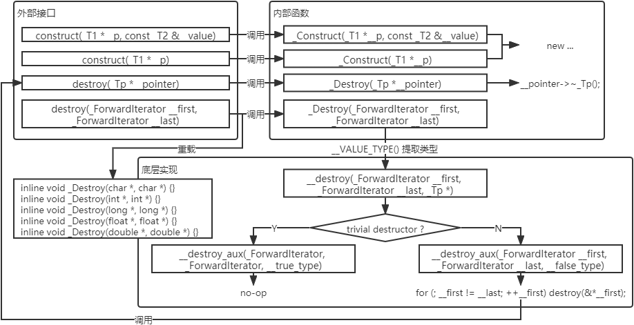
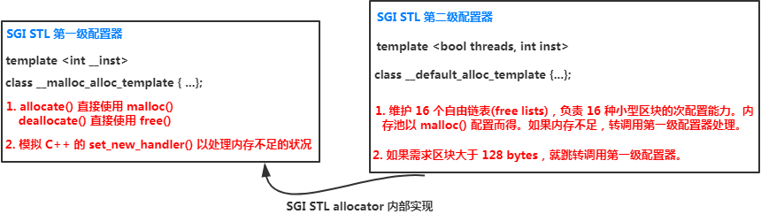
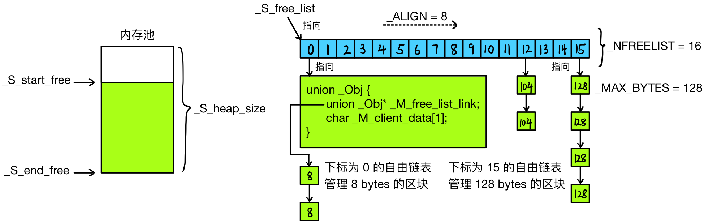
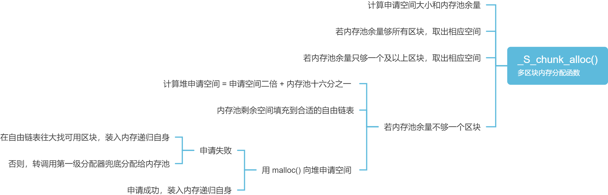
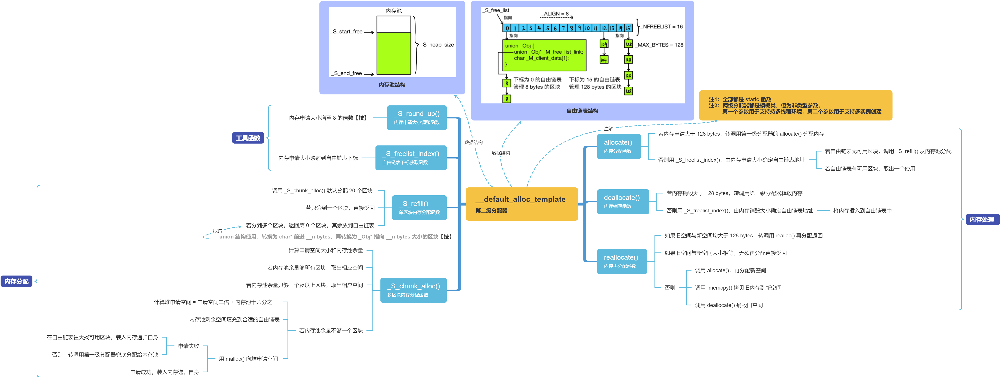

### 目录

[toc]

### 2.1 基本概念

定义：分配器负责空间分配与管理，从实现的角度来看，分配器是一个实现了动态空间分配、空间管理、空间释放的类模板。

用途：整个 STL 的操作对象（所有的数值）都存放在容器之内，而分配器负责给容器分配所需的空间。

#### 2.1.1 分配过程浅析

在所有的 STL 分配器中，空间分配动作最终都会使用到 `operator new()`，其中调用 `malloc()` 函数。

> `operator new()` 的接口
>
> ```c++
> // File: mingw64\lib\gcc\x86_64-w64-mingw32\8.1.0\include\c++\new
> // Line: 120
> 
> void* operator new(std::size_t) _GLIBCXX_THROW (std::bad_alloc)
>   __attribute__((__externally_visible__));
> ```
>
> `operator new()` 的实现
>
> ```c++
> // File: gcc-releases-gcc-8\libstdc++-v3\libsupc++\new_op.cc
> // Line: 42
> 
> _GLIBCXX_WEAK_DEFINITION void *
> operator new (std::size_t sz) _GLIBCXX_THROW (std::bad_alloc)
> {
>   	void *p;
> 
>       /* malloc (0) is unpredictable; avoid it.  */
>       if (sz == 0)
>            sz = 1;
> 
>       while (__builtin_expect ((p = malloc (sz)) == 0, false))  // 这里用到 malloc() 函数
>        {
>            new_handler handler = std::get_new_handler ();
>            if (! handler)
>             _GLIBCXX_THROW_OR_ABORT(bad_alloc());
>            handler ();
>        }
> 
>   	return p;
> }
> ```

【注】`malloc` 分配的内存包含头尾 cookie 等的额外开销（==内存管理==）。

#### 2.1.2 分配器标准接口

根据 STL 规范，一个标准的分配器 `allocator` 的必要接口如下。

<u>类型成员</u>

```c++
985211// 以下各种 type 的设计详见第 3 章
allocator::size_type;
allocator::difference_type;
allocator::pointer;
allocator::const_pointer;
allocator::reference;
allocator::const_reference;
allocator::value_type;
```

<u>数据成员</u>

```c++
// 一个嵌套的类模板
// rebind<T> 有唯一类型成员 other 表示 allocator<T>，用于支持嵌套定义 
allocator::rebind;
```

<u>函数成员 - 拷贝控制</u>

```c++
// 默认构造函数
allocator::allocator();
// 拷贝构造函数
allocator::allocator(const allocator&);
// 拷贝构造函数模板
template <class T> allocator::allocator(const allocator<T>&);
// 析构函数
allocator::allocator();
```

<u>函数成员 - 地址获取</u>

```c++
// 返回某个对象的地址
pointer allocator::address(reference x) const { return &x; }
// 返回某个 const 对象的地址
const_pointer allocator::address(const_reference x) const { return &x; }
```

<u>函数成员 - 内存分销</u>

```c++
// 分配 n 个 T 对象的空间
pointer allocator::allocate(size_type n, const void * = 0); // 第二个参数是个提示，可用于提升 locality
// 释放 n 个 T 对象的空间
void allocator::deallocate(pointer p, size_type n)
```

```c++
// 返回可容纳的最大元素数目
// 通过强制类型转换，size_t(-1) 恰能代表其能表示的最大虚拟内存地址空间，即 2^32 (2^64，64 位机器)
size_type allocator::max_size() const { return size_t(-1) / sizeof(_Tp); }
```

<u>函数成员 - 元素构析</u>

```c++
// 元素构建函数
void allocator::construct(pointer p, const T &val) { new (p) T(val); }
// 元素销毁函数
void allocator::destroy(pointer p) { p->~T(); }
```

### 2.2 SGI 标准分配器

标准分配器 `std::allocator` 是 SGI 的一个普通无优化的、符合标准的分配器，是较新的 SGI 版本中的默认实现。

* [`defalloc.h`](src\allocator\defalloc.h) - 标准分配器的定义与实现
  * `::allocate()`     - 内存分配函数，转调用 `::operator new()`
  * `::deallocate()` - 内存销毁函数，转调用 `::operator delete()`
  * `allocator` - 标准分配器类模板，内存操作转调用上面两个函数

`std::allocator` 只是底层内存分配/释放操作（`::operator new()` 和 `::operator delete()`）的简单封装，并没有考虑到任何效率上的强化，因此在分配大量元素时，会产生**大量的 cookie 开销**。

### 2.3 SGI 两级分配器

#### 2.3.1 设计思路

传统上，C++ 内存分配操作和释放操作均分为两个阶段：

* 分配操作：先调用 `new` 分配内存，再调用构造函数
* 释放操作：先调用析构函数，再调用 `delete` 释放内存

SGI STL 采用更精细的操作，它将两阶段操作区分开来：

* 分配内存用`alloc::allocate()`
* 释放内存用 `alloc::deallocate()`
* 构造对象用 `::construct()`
* 析构对象用 `::destroy()`

C++ STL 标准规定 `<memory>` 文件定义内存分配器（`1.2.1.4 工具函数相关`），于是 SGI 设计 `<memory>` 内包含三个文件：


#### 2.3.2 对象构析

对象的构造和析构基本工具在文件 [`stl_construct.h`](src\allocator\stl_construct.h) 中。



外部接口：

```c++
// construct() 第一版本的外部接口
template <class _T1, class _T2>
inline void construct(_T1 *__p, const _T2 &__value)
{ _Construct(__p, __value); }

// construct() 第二版本的外部接口
template <class _T1>
inline void construct(_T1 *__p)
{ _Construct(__p); }

// destroy() 第一版本的外部接口
template <class _Tp>
inline void destroy(_Tp *__pointer)
{ _Destroy(__pointer); }

// destroy() 第二版本的外部接口
template <class _ForwardIterator>
inline void destroy(_ForwardIterator __first, _ForwardIterator __last)
{ _Destroy(__first, __last); }
```

对象构造函数：

```c++
// construct() 第一版本，在指针 __p 指向的内存中重新构造值为 __value 的对象。
template <class _T1, class _T2>
inline void _Construct(_T1 *__p, const _T2 &__value)
{ new ((void *)__p) _T1(__value); // placement new，在 __p 指向的内存调用 _T1::_T1(__value) 构造新对象 }
```

```c++
// construct() 第二版本，在指针 __p 指向的内存中重新构造值为默认的对象。
template <class _T1>
inline void _Construct(_T1 *__p)
{  new ((void *)__p) _T1(); // placement new，在 __p 指向的内存调用 _T1::_T1() 构造新对象 }
```

对象析构函数：

```c++
// destroy() 第一版本，接受一个指针 __pointer，将其所指的对象析构掉。
template <class _Tp>
inline void _Destroy(_Tp *__pointer)
{ __pointer->~_Tp(); }
```

```c++
// 元素类型有 non-trivial destructor.
// 即这是 __false_type，以循环的方式遍历整个范围，并在循环中逐个对象调用第一版本的 destory() / _Destroy().
template <class _ForwardIterator>
void __destroy_aux(_ForwardIterator __first, _ForwardIterator __last, __false_type)
{
    for (; __first != __last; ++__first)
        destroy(&*__first); // 迭代器拿到那个对象，然后获取地址，传入 destroy() 函数
}
// 元素类型有 trivial destructor.
// 即这是 __true_type，什么都不做。
template <class _ForwardIterator>
inline void __destroy_aux(_ForwardIterator, _ForwardIterator, __true_type) {}

// 利用 __type_traits<> 判断给定的元素类型是否有 trivial destructor 来判断行动. 【技1 __type_traits<T>】
template <class _ForwardIterator, class _Tp>
inline void __destroy(_ForwardIterator __first, _ForwardIterator __last, _Tp *)
{
    typedef typename __type_traits<_Tp>::has_trivial_destructor _Trivial_destructor;
    __destroy_aux(__first, __last, _Trivial_destructor());
}

// destroy() 第二版本，接受两个迭代器，调用 __VALUE_TYPE() 判断元素类型进而利用 __type_traits<> 判断行动。
template <class _ForwardIterator>
inline void _Destroy(_ForwardIterator __first, _ForwardIterator __last)
{
    __destroy(__first, __last, __VALUE_TYPE(__first)); // 【技1 __VALUE_TYPE()】
}
```

```c++
// _Destroy 的重载版本
inline void _Destroy(char *, char *) {}
inline void _Destroy(int *, int *) {}
inline void _Destroy(long *, long *) {}
inline void _Destroy(float *, float *) {}
inline void _Destroy(double *, double *) {}
#ifdef __STL_HAS_WCHAR_T
inline void _Destroy(wchar_t *, wchar_t *) {}
#endif /* __STL_HAS_WCHAR_T */
```

【技1】C++ 本身不直接支持对 “指针所指对象” 的类型判断，这里通过 `__VALUE_TYPE()` 和 `__type_traits<T>` 实现，==具体待后面补充==。

#### 2.3.3 内存分销

##### 2.3.3.1 设计要点

[`stl_alloc.h`](src\allocator\stl_alloc.h) 负责内存的分配和释放（含一、二级分配器的定义与实现，命名为 `std::alloc`），它考虑的问题有：

* 向 system heap 申请空间

  SGI STL 两级分配器均采用 `malloc()`、`free()`、`realloc()` 函数管理内存空间，其对外接口采用 `new()` 函数。

* 多线程处理

  主要处理同步的问题，以防多个线程同时修改全局变量，不同系统下的实现方式不同。

  * 在 Linux 系统下采用的是互斥锁 `pthread_mutex_lock()`、`pthread_mutex_unlock()`
  * 在 Windows 系统下采用的是临界区
  * ==具体实现方式==

* 内存碎片的问题

  

  * `__malloc_alloc_template` - 第一级分配器，用来配置大于 128 bytes 的内存，直接使用 `malloc()` 和 `free()`
  * `__default_alloc_template` - 第二级分配器，用来配置小于 128 bytes 的内存，采用复杂的 *memory pool* 方法

  【注1】预定义常量 `__USE_MALLOC` 用于管理是否只用第一级分配器：

  ```c++
  // 第一级分配器定义
  // ...
  typedef __malloc_alloc_template<0> malloc_alloc; // 定义 malloc_alloc 为第一级 0 号分配器
  
  #ifdef __USE_MALLOC
  typedef malloc_alloc alloc; 			  // 为了兼容转化为定义 alloc
  typedef malloc_alloc single_client_alloc; // 为了兼容而补充定义 single_client_alloc
  
  #else
  // 第二级分配器定义
  // ...
  typedef __default_alloc_template<__NODE_ALLOCATOR_THREADS, 0> alloc; // 定义 alloc 为第二级 0 号分配器
  typedef __default_alloc_template<false, 0> single_client_alloc;      // 定义 single_client_alloc 为第二级单线程 0 号分配器 
  
  #endif /* ! __USE_MALLOC */
  ```

  【注2】无论 `alloc` 被定义为第一级或第二级分配器，容器中的代码都会将 `alloc` 传入以下的标准接口来使用：

  ```c++
  // 两级分配器标准接口，通过封装将分配单位由 bytes 转为元素大小 sizeof(_Tp)，底层单纯地转调用原分配器(第一级或第二级)。
  template <class _Tp, class _Alloc>
  class simple_alloc {
  public:
      static _Tp *allocate(size_t __n)
      	{ return 0 == __n ? 0 : (_Tp *)_Alloc::allocate(__n * sizeof(_Tp)); }
      static _Tp *allocate(void)
      	{ return (_Tp *)_Alloc::allocate(sizeof(_Tp)); }
      static void deallocate(_Tp *__p, size_t __n)
      	{ if (0 != __n) _Alloc::deallocate(__p, __n * sizeof(_Tp)); }
      static void deallocate(_Tp *__p)
      	{ _Alloc::deallocate(__p, sizeof(_Tp)); }
  };
  ```

##### 2.3.3.2 第一级分配器

[`stl_alloc.h`](src\allocator\stl_alloc.h) 中的 `__malloc_alloc_template` 负责管理大于 128 bytes 的大额区块。

第一级分配器：

```c++
// SGI STL 第一级分配器，直接基于 malloc 和 free 来分配内存，用于大于 128 bytes 的内存管理。
// 无 “template 类型参数”，而 “非类型参数 __inst” 用于支持多个模板实例的创建（但也使容器的 allocator 类型不一致）
template <int __inst> 
class __malloc_alloc_template
{
private:
    // 以下是函数指针，所代表的函数用来处理内存不足的情况，在类外定义
    static void *_S_oom_malloc(size_t);
    static void *_S_oom_realloc(void *, size_t);
#ifndef __STL_STATIC_TEMPLATE_MEMBER_BUG
    static void (*__malloc_alloc_oom_handler)(); // out-of-memory 处理函数
#endif

public:
    // 分配函数
    static void *allocate(size_t __n)
    {
        void *__result = malloc(__n); // 第一级配置器直接调用 malloc()
        // 以下无法满足需求时，改用 _S_oom_malloc()
        if (0 == __result)
            __result = _S_oom_malloc(__n); // 分配失败，内存不足处理
        return __result;
    }

    // 销毁函数
    static void deallocate(void *__p, size_t /* __n */)
    {
        free(__p);  // 第一级分配器直接使用 free()
    }

    // 再分配函数
    static void *reallocate(void *__p, size_t /* old_sz */, size_t __new_sz)
    {
        void *__result = realloc(__p, __new_sz); // 第一级配置器直接调用 realloc()
        // 以下无法满足需求时，改用 _S_oom_realloc()
        if (0 == __result)
            __result = _S_oom_realloc(__p, __new_sz); // 分配失败，内存不足处理
        return __result;
    }

    // 自定义 out-of-memory 处理函数。
    // 第一级分配器会模仿 C++ 的 set_new_handler()，指定自己的 out-of-memory handler；
    // 这里不使用 C++ new-handler 机制，因为第一级配置器并没有用 ::operator new 来配置内存；
    // 【注1】C++ new handler 机制：要求系统 new 分配内存不成功时，调用一个称为 new handler 的自定义函数。
    // 		 new handler 处理内存不足的做法有特点的模式，参看《effective C++》2-e 条款 7.
    // 【注2】SGI 用 malloc 而非 new 来分配内存应该有两个原因：
    // 		 其一是历史因素；其二是 C++ 没有相应于 realloc 的内存分配操作。
    static void (*__set_malloc_handler(void (*__f)()))()
    {
        void (*__old)() = __malloc_alloc_oom_handler;
        __malloc_alloc_oom_handler = __f;
        return (__old);
    }
};
```

`malloc_alloc` 的 out-of-memory 处理函数组：

```c++
#ifndef __STL_STATIC_TEMPLATE_MEMBER_BUG
template <int __inst>
void (*__malloc_alloc_template<__inst>::__malloc_alloc_oom_handler)() = 0; // 初值为 0，由客户自行设定
#endif

template <int __inst>
void *__malloc_alloc_template<__inst>::_S_oom_malloc(size_t __n)
{
    void (*__my_malloc_handler)();
    void *__result;

    // 申请大小为 __n 的内存
    for (;;) // 不断尝试释放、分配、再释放、再分配内存
    {
        __my_malloc_handler = __malloc_alloc_oom_handler;       // out-of-memory 处理函数
        if (0 == __my_malloc_handler) { __THROW_BAD_ALLOC; }    // 检查 out-of-memory 处理函数的有效性
        (*__my_malloc_handler)();                               // 调用 out-of-memory 处理函数，企图释放内存
        __result = malloc(__n);                                 // 再次尝试分配内存
        if (__result) return (__result);                        // 如果分配成功，就返回结果，否则重新循环
    }
}

template <int __inst>
void *__malloc_alloc_template<__inst>::_S_oom_realloc(void *__p, size_t __n)
{
    void (*__my_malloc_handler)();
    void *__result;

    // 给一个已经分配了内存的空间地址重新分配空间，参数 __p 为原有的空间地址，__n 是重新申请的内存大小
    for (;;) // 不断尝试释放、分配、再释放、再分配内存
    {
        __my_malloc_handler = __malloc_alloc_oom_handler;       // out-of-memory 处理函数
        if (0 == __my_malloc_handler) {  __THROW_BAD_ALLOC; }   // 检查 out-of-memory 处理函数的有效性
        (*__my_malloc_handler)();                               // 调用 out-of-memory 处理函数，企图释放内存
        __result = realloc(__p, __n);                           // 再次尝试再分配内存
        if (__result) return (__result);                        // 如果分配成功，就返回结果，否则重新循环
    }
}
```

模板实例化：

```c++
// 定义 malloc_alloc 为第一级 0 号分配器
typedef __malloc_alloc_template<0> malloc_alloc; // 直接将 “非类型参数 __inst” 指定为 0
```

##### 2.3.3.3 第二级分配器

[`stl_alloc.h`](src\allocator\stl_alloc.h) 中的 `__default_alloc_template` 用于管理小于 128 bytes 的小额区块。小额区块不仅会带来<u>内存碎片问题</u>，也会因为 cookie 等的增多带来<u>额外负担问题</u>，第二级分配器围绕内存池来解决。

内存池结构：



如上图所示，内存池分配一大块内存维护自由链表（free-list），需要时从特定链表取出内存，回收时插入内存到特定链表。

<u>为了方便管理</u>，内存池会将任何需求量上调至 8 的倍数，共维护 16 种 free-list，分别为 $1\times8=8, 2\times8=16, \dots, 16\times8=128$ bytes 的小额区块。

<u>为了节省内存</u>，free-list 的结点结构 `_Obj` 使用联合体定义，它在内存池中使用第一个字段作为 `_Obj` 指针，指向相同形式的另一个 `_Obj`，在取出后使用第二个字段作为内存位置指针，指向实际区块。

内存池静态常量：

```c++
// 【注】其实这里用静态常量 static const int x = N 才合适，但很少编译器支持。
enum { _ALIGN = 8 };		// 小额区块的上调基数
enum { _MAX_BYTES = 128 };	// 小额区块的上限
enum { _NFREELISTS = 16 };	// free-list 的个数 = _MAX_BYTES / _ALIGN
```

第二级分配器：

```c++
// SGI STL 第二级分配器，GCC 默认使用第二级分配器，用于小于 128 bytes 的内存管理。
// 无 “template 类型参数”，前者用于支持多线程环境，后者用于支持多个实例的创建（但也使容器的 allocator 类型不一致）
template <bool threads, int inst>
class __default_alloc_template
{
private:
    // 大小调整函数，将所有小型区块的内存需求量增加至 8 的倍数【技】
    static size_t _S_round_up(size_t __bytes)
    {
        // ~(size_t)_ALIGN - 1) => 11111000，其中 8 及其倍数位是 true，而 8 的余数位是 false，做 & 运算完成截断
        return (((__bytes) + (size_t)_ALIGN - 1) & ~((size_t)_ALIGN - 1));
    }

__PRIVATE :
    // free-list 的节点结构，使用 union 降低维护 free-list 带来的额外负担
    union _Obj {
        union _Obj *_M_free_list_link; // 指向相同形式的另一个 _Obj
        char _M_client_data[1];        // 指向实际区块
    };

private:
    // 16 个自由链表，_S_free_list 是一个二级指针数组，每个元素指向一级指针，
    // 一级指针是指向 _Obj 类型的指针，各自管理大小分别为 8， 16， 24， 32，...128 bytes(8 的倍数)的小额区块。
    // 【注1】__STL_VOLATILE 的含义
    // 		元素 *my_free_list 或 _S_free_list[]可能被优化到寄存器中，从而使库代码无法 lock 住对它的读调用。
    // 		若在寄存器中另一个线程可能会修改该寄存器的值， 若在内存中另一个线程没有访问权力有修改保护。
    // 【注2】__STL_VOLATILE 的用法
    //      用 volatile 修饰声明变量必须在内存中，这里修饰的是 *my_free_list 或 _S_free_list[]，
    // 		是 free_list 数组中的一个元素，而不是数组指针，所以 volatile 放在两个 * 中间。
#if defined(__SUNPRO_CC) || defined(__GNUC__) || defined(__HP_aCC)
    static _Obj *__STL_VOLATILE _S_free_list[];
#else
    static _Obj *__STL_VOLATILE _S_free_list[_NFREELISTS];
#endif
    
    // 下标获取函数，根据申请数据块大小找到相应自由链表的下标，n 从 0 起算
    static size_t _S_freelist_index(size_t __bytes)
    {
        // 1~8 => 0, 9~16 => 1, 17~24 => 2, 25~32 => 3, ...
        return (((__bytes) + (size_t)_ALIGN - 1) / (size_t)_ALIGN - 1);
    }

    // 单对象内存分配函数，基于下面的 _S_chunk_alloc 函数
    static void *_S_refill(size_t __n);
    // 多对象内存分配函数，若不足 __nobjs 会减小
    static char *_S_chunk_alloc(size_t __size, int &__nobjs);

    // 内存状态指针
    static char *_S_start_free; // 内存池起始位置。只在 _S_chunk_alloc() 中变化
    static char *_S_end_free;   // 内存池结束位置。只在 _S_chunk_alloc() 中变化
    static size_t _S_heap_size; // 内存池的大小，内存池数据结构为堆
    
public:
    // 内存分配函数，申请大小为 n 的数据块，返回该数据块的起始地址
    // 注：__n must be > 0
    static void *allocate(size_t __n) { /* 详述于后 */ }
    
    // 内存释放函数，释放 __p 指向的大小为 __n 的空间
    // 注：__p may not be 0
    static void deallocate(void *__p, size_t __n) { /* 详述于后 */ }
    
    // 内存再分配函数
    static void *reallocate(void *__p, size_t __old_sz, size_t __new_sz); // 详述于后
};
```

静态成员变量的定义与初值设定：

```c++
// 内存状态指针
template <bool __threads, int __inst>
char *__default_alloc_template<__threads, __inst>::_S_start_free = 0; // 内存池起始位置
template <bool __threads, int __inst>
char *__default_alloc_template<__threads, __inst>::_S_end_free = 0;   // 内存池结束位置
template <bool __threads, int __inst>
size_t __default_alloc_template<__threads, __inst>::_S_heap_size = 0; // 内存池的大小
// 16 个自由链表
template <bool __threads, int __inst>
typename __default_alloc_template<__threads, __inst>::_Obj *__STL_VOLATILE
         __default_alloc_template<__threads, __inst>::_S_free_list[
#if defined(__SUNPRO_CC) || defined(__GNUC__) || defined(__HP_aCC)
	_NFREELISTS
#else
	__default_alloc_template<__threads, __inst>::_NFREELISTS
#endif
] = { 0, 0, 0, 0, 0, 0, 0, 0, 0, 0, 0, 0, 0, 0, 0, 0, };
```

##### 2.3.3.4 `allocate()`

[`stl_alloc.h`](src\allocator\stl_alloc.h) 中的 `__default_alloc_template` 拥有分配器标准接口函数 `allocate()`，其逻辑和代码如下。


```c++
// 内存分配函数，申请大小为 n 的数据块，返回该数据块的起始地址
// 注：__n must be > 0
static void *allocate(size_t __n)
{
    void *__ret = 0;
    if (__n > (size_t)_MAX_BYTES)
    // 如果需求区块大于 128 bytes，就转调用第一级分配器
    {
		__ret = malloc_alloc::allocate(__n);
    }
    else
    // 根据申请空间的大小寻找相应的自由链表（16 个自由链表中的一个）
    {
		_Obj *__STL_VOLATILE *__my_free_list = _S_free_list + _S_freelist_index(__n);
#ifndef _NOTHREADS
        // 获取线程锁，在这里通过构造函数调用获取锁，这可确保在退出或堆栈展开期间释放。
        // Acquire the lock here with a constructor call.
        // This ensures that it is released in exit or during stack unwinding.
        _Lock __lock_instance;
#endif
        _Obj *__RESTRICT __result = *__my_free_list;
        if (__result == 0)
		// 自由链表没有可用数据块，就将区块大小先调整至 8 倍数边界，然后调用 _S_refill() 分配空间
            __ret = _S_refill(_S_round_up(__n));
        else
		// 如果自由链表中有空闲数据块，则取出一个，并把自由链表的指针指向下一个数据块
        {
            // 将 __my_free_list 头节点移出并返回
            *__my_free_list = __result->_M_free_list_link;
            __ret = __result;
        }
    }
    return __ret;
};
```

##### 2.3.3.5 `deallocate()`

[`stl_alloc.h`](src\allocator\stl_alloc.h) 中的 `__default_alloc_template` 拥有分配器标准接口函数 `deallocate()`，其逻辑和代码如下。


```c++
// 内存释放函数，释放 __p 指向的大小为 __n 的空间
// 注：__p may not be 0
static void deallocate(void *__p, size_t __n)
{
    if (__n > (size_t)_MAX_BYTES)
    // 大于 128 bytes，就调用第一级分配器的释放操作
    {
        malloc_alloc::deallocate(__p, __n);
    }
    else
	// 否则将空间回收到相应自由链表（由释放块的大小决定）中
    {
        _Obj *__STL_VOLATILE *__my_free_list = _S_free_list + _S_freelist_index(__n);
        _Obj *__q = (_Obj *)__p;

#ifndef _NOTHREADS
        // 获取线程锁，acquire lock
        _Lock __lock_instance;
#endif /* _NOTHREADS */
        // 将 __p 按头插法插入到 __my_free_list 当中
        __q->_M_free_list_link = *__my_free_list; // 调整自由链表，回收数据块
        *__my_free_list = __q;
        // lock is released here
    }
}
```

##### 2.3.3.6 `refill()`

上面提到，当 `allocate()` 发现自由链表中没有可用区块时，会调研 `refill()` 从内存池分配，其逻辑和代码如下。


```c++
// 单对象内存分配函数的类外实现，默认调用多对象内存分配函数，分配 20 个对象的冗余空间，冗余的放到自由链表中
// 注：假设 __n 已经上调至 8 的倍数
/* Returns an object of size __n, and optionally adds to size __n free list.*/
/* We assume that __n is properly aligned.                                  */
/* We hold the allocation lock.                                             */
template <bool __threads, int __inst>
void* __default_alloc_template<__threads, __inst>::_S_refill(size_t __n)
{
    // 虽然只要求一个对象，但这里会默认分配 20 个冗余
    int __nobjs = 20;
    // 调用 _S_chunk_alloc()，默认取 20 个区块作为 free list 的新节点
    char *__chunk = _S_chunk_alloc(__n, __nobjs);
    _Obj *__STL_VOLATILE *__my_free_list;
    _Obj *__result;
    _Obj *__current_obj;
    _Obj *__next_obj;
    int __i;

    // 如果只获得一个区块，那么这个区块就直接分给调用者，自由链表中不会增加新节点
    if (1 == __nobjs)
        return (__chunk);
    // 否则根据申请区块的大小找到相应的自由链表
    __my_free_list = _S_free_list + _S_freelist_index(__n);
 
    // 在分配的 chunk 空间内建立 free list
    __result = (_Obj *)__chunk;                             // 这一块准备返回给调用者
    *__my_free_list = __next_obj = (_Obj *)(__chunk + __n); // 这里开始放到自由链表
    for (__i = 1;; __i++)                                   // 将 free list 各结点串接，从 1 开始
    {
        // 记录当前插入的结点
        __current_obj = __next_obj;
        // 记录下一个结点（转换为 char* 前进 __n bytes，再转换为 _Obj* 指向 __n bytes 大小的区块【技】）
        __next_obj = (_Obj *)((char *)__next_obj + __n); 
        if (__nobjs - 1 == __i)
        // 如果 __i 或 __current_obj 指向最后一个 _Obj 或 __next_obj 为 “空”
        { __current_obj->_M_free_list_link = 0;  break; }  // 收尾 
        else
        // 如果还没到最后一个结点
        { __current_obj->_M_free_list_link = __next_obj; } // 衔接
    }
    return (__result);
}
```

##### 2.3.3.7 `chunk_alloc()`

上面提到，`refill()` 使用 `chunk_alloc()` 来从内存池取空间，其逻辑和代码如下。



```c++
// 多对象内存分配函数的类外实现，从内存池中取空间，不够再考虑分配空间
// 注：假设 __size 已经上调至 8 的倍数
/* We allocate memory in large chunks in order to avoid fragmenting     */
/* the malloc heap too much.                                            */
/* We assume that size is properly aligned.                             */
/* We hold the allocation lock.                                         */
template <bool __threads, int __inst>
char* __default_alloc_template<__threads, __inst>::_S_chunk_alloc(size_t __size, int &__nobjs)
{
    char *__result;                                    // 申请空间的起始指针
    size_t __total_bytes = __size * __nobjs;           // 需要申请空间的大小
    size_t __bytes_left = _S_end_free - _S_start_free; // 计算内存池剩余空间

    if (__bytes_left >= __total_bytes)
    // 内存池剩余空间完全满足申请
    {
        __result = _S_start_free;               // 指向起始地址
        _S_start_free += __total_bytes;         // 内存池缩减
        return (__result);                      // 返回结果
    }
    else if (__bytes_left >= __size)
    // 内存池剩余空间不能满足申请，但能提供一个及以上的区块
    {
        __nobjs = (int)(__bytes_left / __size); // 调整申请区块的个数
        __total_bytes = __size * __nobjs;       // 调整需要申请空间的大小
        __result = _S_start_free;               // 指向起始地址
        _S_start_free += __total_bytes;         // 内存池缩减
        return (__result);                      // 返回结果
    }
    else
    // 内存池剩余空间连一个区块的大小都无法提供
    {
        // 新需求量：原需求量的二倍 + 现有内存池大小的十六分之一并扩充至 8 倍数
        size_t __bytes_to_get = 2 * __total_bytes + _S_round_up(_S_heap_size >> 4);
        // 尝试利用内存池的剩余空间，放到合适的自由链表中
        if (__bytes_left > 0)
        {
            // 找到合适的自由链表（__bytes_left 一定是 8 的倍数）
            _Obj *__STL_VOLATILE *__my_free_list = _S_free_list + _S_freelist_index(__bytes_left);
            // 头插法插入内存池
            ((_Obj *)_S_start_free)->_M_free_list_link = *__my_free_list;
            *__my_free_list = (_Obj *)_S_start_free;
        }
        // 从堆中分配空间，用来补充内存池
        _S_start_free = (char *)malloc(__bytes_to_get);
        // 如果堆空间不足，malloc() 失败
        if (0 == _S_start_free)
        {
            size_t __i;
            _Obj *__STL_VOLATILE *__my_free_list;
            _Obj *__p;
            // 尝试寻找自由链表中的可用内存
            // 注：为了避免多进程机器上的灾难性问题，不会尝试分配较小的区块。
            //     只会寻找自由链表中 “没有用过的、足够大” 的区块来使用。
            for (__i = __size; __i <= (size_t)_MAX_BYTES; __i += (size_t)_ALIGN)
            // 从 __size 这个最小可用需求往大的方向寻找
            {
                // 找到合适的自由链表
                __my_free_list = _S_free_list + _S_freelist_index(__i);
                __p = *__my_free_list;
                if (0 != __p)
                // 如果找到内存池对应的可用区块，递归调用 chunk_alloc 并 return
                {
                    // 调整自由链表，释放可用区块
                    *__my_free_list = __p->_M_free_list_link; // 取出这个区块
                    _S_start_free = (char *)__p;              // 设置内存池起始地址
                    _S_end_free = _S_start_free + __i;        // 设置内存池结束地址
                    // 递归调用 chunk_alloc 取空间，并修正 __nobjs
                    return (_S_chunk_alloc(__size, __nobjs));
                    // Any leftover piece will eventually make it to the right free list.
                }
            }
            // 如果出现意外（山穷水尽，到处都没有内存了）
            _S_end_free = 0;                                                // In case of exception.
            // 调研第一级分配器，尝试 out-of-memory 机制能否尽力
            // 注：这要么导致抛出异常，要么改善内存不足的情况
            _S_start_free = (char *)malloc_alloc::allocate(__bytes_to_get);
        }
        // 到此保证拿到 __bytes_to_get 大小的内存到内存池中
        _S_heap_size += __bytes_to_get;
        _S_end_free = _S_start_free + __bytes_to_get;
        // 递归调用 chunk_alloc 取空间，并修正 __nobjs
        return (_S_chunk_alloc(__size, __nobjs));
    }
}
```

#### 2.3.4 内存操作

STL 有六个全局函数，作用于**未初始化的空间**上，其中两个是 `2.2.2.2 对象构析` 中的 `construct()` 和 `destroy()`，剩下的是文件 [`stl_uninitialized.h`](src\allocator\stl_uninitialized.h) 中的 `uninitialized_copy()`，`uninitialized_copy_n()`，`uninitialized_fill()`，`uninitialized_fill_n()`，分布对应于 STL 算法 `copy()`，`copy_n()`，`fill()`，`fill_n()`.


拷贝函数：

* `uninitialized_copy(...)` - 内存拷贝函数，考虑 POD 类型

  如果输出位置 `[result, result+(last-first))` 内的每个迭代器都指向为未初始化的内存，则拷贝输入位置 `[first, last)` 的每一个对象到输出位置。

  具有 "*commit* or *rollback*" 性质，即要么产生所有必要元素，要么不产生任何元素。

* `uninitialized_copy_n(...)` - 指定数量的内存拷贝函数

  如果输出位置 `[result, result+n)` 内的每个迭代器都指向为未初始化的内存，则拷贝输入位置 `[first, first+n)` 的每一个对象到输出位置。

  具有 "*commit* or *rollback*" 性质，即要么产生所有必要元素，要么不产生任何元素。

填充函数：

* `uninitialized_fill(...)` - 内存填充函数，考虑 POD 类型

  如果输出位置 `[first, last)` 内的每个迭代器都指向为未初始化的内存，则填充对象 `x` 到各个输出位置。

  具有 "*commit* or *rollback*" 性质，即要么产生所有必要元素，要么不产生任何元素。

* `uninitialized_fill_n(...)` - 指定数量的内存填充函数

  如果输出位置 `[first, first+n)` 内的每个迭代器都指向为未初始化的内存，则填充对象 `x` 到各个输出位置。

  具有 "*commit* or *rollback*" 性质，即要么产生所有必要元素，要么不产生任何元素。

扩展函数：

* `__uninitialized_copy_copy()` - 两次拷贝的函数
* `__uninitialized_fill_copy()` - 先填充，后拷贝的函数
* `__uninitialized_copy_fill()` - 先拷贝，后填充的函数

#### 2.3.5 两级总结

---


其中，`malloc_alloc` 为实例化的第一级 0 号分配器。

---



其中，`alloc` 为实例化的第二级 0 号分配器，`single_client_alloc` 为实例化的第二级单线程 0 号分配器。

---
