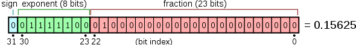

### 目录

[toc]

### 1.1 基本内置类型

#### 1.1.1 算数类型

C++ 算数类型包含布尔值、字符、整型数和浮点数。

##### 1.1.1.1 概念

* 布尔类型：布尔类型取值是真（true）或假（false）。
  * 关键字：`bool`

* 字符类型：分为<u>基本字符类型</u>和<u>扩展字符类型</u>

  * 基本字符类型：确保存放机器基本字符集中任意字符对于的数字值 $\rightarrow$ 一个 `char` 的大小和一个机器字节一样

  * 扩展字符类型：确保可以存放机器最大扩展字符集中的任意一个字符
  * 关键字：`char`；`wchar_t`，`char16_t`，`char32_t`

  【注】`char16_t` 和 `char32_t` 为 Unicode 字符集服务。

* 整数类型：表示不同尺寸的整数
  * 关键字：`short`，`int`，`long`，`long long`

* 浮点类型：表示带小数点的数值

  * 关键字：`float`，`double`，`long double`

  【注】浮点数运算首选 `double`，因为双精度浮点数和单精度浮点数的计算代价相差无几。

##### 1.1.1.2 尺寸

算数类型的尺寸（所占的比特数）在不同机器上有所差别，视编译器规定，C++ 标准做的**只是规定最小尺寸**。

| 类型          | 含义           | 最小尺寸                                                     | 分类             |
| ------------- | -------------- | ------------------------------------------------------------ | ---------------- |
| `bool`        | 布尔类型       | 未定义                                                       | 布尔类型         |
| `char`        | 字符           | 8 位（ -128 到 127 或者 0 到 255）                           | （基本）字符类型 |
| `wchar_t`     | 宽字符         | 16 位（-32768 到 32767）                                     | （扩展）字符类型 |
| `char16_t`    | Unicode 字符   | 16 位（-32768 到 32767）                                     | （扩展）字符类型 |
| `char32_t`    | Unicode 字符   | 32 位（ -2147483648 到 2147483647）                          | （扩展）字符类型 |
| `short`       | 短整型         | 16 位（-32768 到 32767）                                     | 整数类型         |
| `int`         | 整型           | 16 位（-32768 到 32767）                                     | 整数类型         |
| `long`        | 长整型         | 32 位（ -2147483648 到 2147483647）                          | 整数类型         |
| `long long`   | 长整型         | 64 位（-9,223,372,036,854,775,808 到 9,223,372,036,854,775,807） | 整数类型         |
| `float`       | 单精度浮点型   | 6 位有效数字（占 32 位内存空间，$\pm3.4\times10^{\pm38}$，约 7 个数字）<br/><br/> | 浮点类型         |
| `double`      | 长精度浮点型   | 10 位有效数字（占 64 位内存空间，$\pm1.7\times10^{\pm308}$，约 15 个数字）<br/><br/> | 浮点类型         |
| `long double` | 扩展精度浮点型 | 10 位有效数字（占 64 位内存空间，$\pm1.7\times10^{\pm308}$，约 15 个数字） | 浮点类型         |

【注1】基本字符类型和整数类型可以进一步修饰为带符号的（signed）和无符号的（unsigned），尺寸表示的范围也不同。

【注2】基本字符类型有三种符号划分：`char`，`signed char` 和 `unsigned char`，其中 `char` 根据编译器表现为带符号或无符号。

【注3】计算机上的算数类型最值获取

* 手写版本

  一般 `int` 数是 `8 bit` / `32` 位，因此对于十六进制来说，`f = 1111`，`7 = 0111`，于是：

  * 最大值：`0x7fffffff`
  * 最小值：`0x80000000`

* `climits` 版本（在头文件 `climits.h` 中）
  * `CHAR_MIN` - `char` 的最小值
  * `SCHAR_MAX` - `signed char` 最大值
  * `SCHAR_MIN` -  `signed char` 最小值
  * `UCHAR_MAX` - `unsigned char` 最大值
  * `SHRT_MAX` - `short` 最大值
  * `SHRT_MIN` - `short` 最小值
  * `USHRT_MAX`  - `unsigned short` 最大值
  * `INT_MAX` - `int` 最大值
  * `INT_MIN` - `int` 最小值
  * `UINT_MAX` - `unsigned int` 最大值
  * `UINT_MIN` - `unsigned int` 最小值
  * `LONG_MAX` - `long` 最大值
  * `LONG_MIN` - `long` 最小值
  * `ULONG_MAX` - `unsigned long` 最大值
  * `FLT_MANT_DIG` - `float` 类型的尾数
  * `FLT_DIG` - `float` 类型的最少有效数字位数
  * `FLT_MIN_10_EXP` - 带有全部有效数的 `float` 类型的负指数的最小值（以 `10` 为底）
  * `FLT_MAX_10_EXP` - `float` 类型的正指数的最大值（以 `10` 为底）
  * `FLT_MIN` - 保留全部精度的 `float` 类型正数最小值
  * `FLT_MAX` - `float` 类型正数最大值

##### 1.2.1.3 机器码

计算机中的负数是以其补码形式存在的：**补码 = 原码取反 + 1​**。

”原反补移“码的概念和区别以后再整理。

#### 1.1.2 字面值常量

每个字面值常量都对应一种数据类型，由字面值常量的形式和值决定。

##### 1.1.2.1 整型和浮点型字面值

* 十进制字面值
  * 形式：普通的数字，如 `0`，`24`，`1024`
  * 类型：能容纳其数值的 `int`，`long`，`long long` 中尺寸最小者
* 八进制字面值
  * 形式：以 `0` 开头的整数，如 `00`，`024`，`0750`
  * 类型：能容纳其数值的 `int`，`unsigned int`，`long`，`unsigned long`，`long long`，`unsigned long long` 中尺寸最小者
* 十六进制字面值
  * 形式：以 `0x` 开头的整数，如 `0x0000`，`0X2E9`，`0xae4`
  * 类型：能容纳其数值的 `int`，`unsigned int`，`long`，`unsigned long`，`long long`，`unsigned long long` 中尺寸最小者

* 浮点型字面值
  * 小数点形式：`3.14159`，`0.`，`.001`
  * 指数形式：`3.14159E0`，`0e0`
  * 类型：`double`

【注1】关联的最大数据类型都放不下的字面值时将报错。

【注2】类型 `short` 没有对应的字面值。

【注3】严格来说，十进制字面值不会是负数，那个**负号不在字面值内**。

##### 1.1.2.2 字符和字符串字面值

* 字符字面值
  * 形式：单引号括起来的一个字符，如 `'a'`

* 字符串字面值
  * 形式：双引号括起来的零个或多个字符，如 ``"Hello World!"`

【注1】字符串字面值类型实际上是由常量字符构成的数组（array）

* 字符串字面值的类型为数组类型： `const char[长度]`（`15.4.2 模板特例化` 的例子）
* 字符串字面值的类型可自动转换为常量指针：const char*`（`15.4.2 模板特例化` 的例子）
* 字符串字面值的类型是常量指针不是常指针，常指针的引用写法要注意：`const char* const &p1`（`1.4.2 const 和引用` 和 `15.4.2 模板特例化`）

【注2】编译器在每个字符串结尾附加空字符 `'\0'`，因此**字符串字面值长度比内容多 1**。

【注3】两个字符串字面值之间仅由<u>空格、缩进、换行符</u>分隔时，实际上是一个整体。

##### 1.1.2.3 布尔字面值而指针字面值

* 布尔字面值
  * 形式：`true` 和 `false`
  * 类型：`bool`

* 指针字面值
  * 形式：`nullptr`
  * 类型：

##### 1.1.2.4 转义序列

对于<u>不可打印字符</u>和 C++ <u>特殊含义字符</u>，需要用转移序列（escape sequence）来表示。C++ 中规定如下转义序列：

| 内容       | 符号 | 内容       | 符号 | 内容           | 符号 |
| ---------- | ---- | ---------- | ---- | -------------- | ---- |
| 换行符     | `\n` | 横向制表符 | `\t` | 报警（响铃）符 | `\a` |
| 纵向制表符 | `\v` | 退格符     | `\b` | 双引号         | `\"` |
| 反斜线     | `\\` | 问号       | `\?` | 单引号         | `\'` |
| 回车符     | `\r` | 进纸符     | `\f` |                |      |

转义序列的使用方式有 2 种：

* 直接使用：

  ```c++
  std::cout << '\n';  		// 转到新一行
  std::cout << "\tHi!\n"; 	// 输出一个制表符，输出“Hi！”，转到新一行
  ```

* 泛化使用：转义数字对应计算机所使用的字符集字符编号

  * `\` 后紧跟 1 个、2 个或 3 个八进制数字

    ```c++
    std::cout << "Hi \x4dO\115!\n";  // 输出 Hi MOM!，转到新一行
    ```

    【注】如果后面的数字超过 3 个，只取到前 3 个。

  * `\x` 后紧跟 1 个或多个十六进制数字

    ```c++
    std::cout << "\x1234";
    ```

    【注】会取到后面的所有数字。

##### 1.1.2.5 指定字面值的类型

通过下表的<u>前缀和后缀</u>，可以改变整型、浮点型和字符型字面值的默认类型。

字符和字符串字面值：

| 前缀 | 含义                            | 类型       |
| ---- | ------------------------------- | ---------- |
| `u`  | `Unicode16` 字符                | `char16_t` |
| `U`  | `Unicode32` 字符                | `char32_t` |
| `L`  | 宽字符                          | `wchar_t`  |
| `u8` | `UTF-8`（仅用于字符串字面常量） | `char`     |

整型字面值和浮点型字面值：

| 后缀         | 最小匹配类型 | 后缀       | 类型          |
| ------------ | ------------ | ---------- | ------------- |
| `u` 或 `U`   | `unsigned`   | `f` 或 `F` | `float`       |
| `l` 或 `L`   | `long`       | `l` 或 `L` | `long double` |
| `ll` 或 `LL` | `long long`  |            |               |

【注1】对于长整型字面值，尽量使用大写字母 `L`，避免与数字 `1` 混淆。

【注2】可以将 `U` 与 `L` 或 `LL` 合在一起使用。

### 1.2 变量

#### 1.2.1 定义、初始化

##### 1.2.1.1 变量定义

变量定义的语法为：

```c++
类型说明符 声明符1, 声明符2, ...;
```

* 类型说明符：变量的数据类型，可一个内置类型，也可以是类类型
* 声明符：包含一个标识符和关联修饰
  * 标识符：即变量名
    * 由字母、数字、下划线组成
    * 开头必须为字母或下划线（下划线不能紧连大写字母，函数体外不能以下划线开头）
    * 不能连续出现两个下划线
  * 关联修饰：可以指定变量为与基本数据类型有关的某种类型（如指针、引用）

【术语】对象：通常情况下，对象是指一块能存储数据并具有某种类型的内存空间。

##### 1.2.1.2 变量初始化

在对象创建时**获得一个特定的值**，就是初始化（initialized）。初始化和赋值是两个完全不同的操作，<u>前者从无到有，后者改头换面</u>。

C++ 中有多种初始化形式：

* 默认初始化：定义变量时<u>没有指定初值</u>时进行的初始化操作

  * 内置类型的默认初始化
    * 定义于<u>函数体之外</u>的内置类型变量将被**默认初始化为 `0`**
    * 定义在<u>函数体内部</u>的内置类型变量将**不被初始化**（对其拷贝/访问将发生错误）
  * 类类型的默认初始化
    * 由类自己决定是否支持默认初始化操作
  * 动态分配内存的方式（即采用 `new` 关键字）
    * 不加括号（如 `int *p = new int;`）为默认初始化
    * 加了括号（如 `int *p = new int();`）为值初始化

  【注】为了确保程序安全，建议初始化每一个内置类型变量。

* 直接初始化：使用<u>圆括号</u>的初始化方式，初始化要用到多个值时只能使用直接初始化

  ```c++
  // 语法演示
  int a(0);						// 直接初始化
  vector<int> ivec(ivec2);		// 直接初始化
  string s("123456");				// 直接初始化
  ```

* 拷贝初始化：使用<u>等号</u>的初始化方式，编译器会把右侧对象的值拷贝到新建对象中去

  ```c++
  // 语法演示
  int a = 12;						// 拷贝初始化
  string s = string("123456");	// 拷贝初始化
  ```

  * 对于内置类型变量，直接初始化与拷贝初始化差别可以忽略不计

  * 对于类类型的变量，直接初始化调用类的匹配构造函数，拷贝初始化调用类的拷贝构造函数 / 移动构造函数

  * 拷贝初始化的发生时机

    * 用 `=` 定义变量时，进行拷贝初始化，这种情况只能有一个对象
    * 函数调用过程中，将一个对象作为实参传递给一个非引用类型的形参（`4.2 参数传递`）
    * 函数返回过程中，从一个返回类型为非引用类型的函数返回一个对象（`4.3 函数返回`）
    * 用花括号列表初始化一个数组中的元素或一个聚合类中的成员，元素/成员进行拷贝初始化

    【注1】`explicit` 修饰的构造函数只能用于直接初始化，无法用于拷贝初始化（`5.3.4.4 转换构造函数` 的内容）。

    【注2】拷贝初始化过程中，编译器可以（但不必须）跳过拷贝/移动构造函数（但一定要存在且可访问），直接创建对象。

    ```c++
    string null_book = "9-999-99999-9";	// 拷贝初始化
    string null_book("9-999-99999-9");	// 编译器略过了拷贝构造函数
    ```

  * 直接初始化与拷贝初始化的差异（基于 `12.2.1 拷贝构造函数` 的知识）

    ```c++
    string dots(10, '.');				// 直接初始化（调用 int + const char* 构造函数）
    string s(dots);						// 直接初始化（调用拷贝构造函数）
    string s2 = dots; 					// 拷贝初始化（调用拷贝构造函数）
    string null_book = "9-999-99999-9";	// 拷贝初始化（先用 const char* 构造函数建立 string 临时对象，然后调用拷贝构造函数）
    string nines = string(100, '9');	// 拷贝初始化（先创建 string 对象，然后调用拷贝构造函数）
    ```

    可以总结出：

    * 直接初始化的首要目的是要求编译器使用普通的函数匹配来选择最佳构造函数
    * 拷贝初始化的首要目的是将右侧运算对象拷贝到正在创建的对象中，如果需要的话进行类型转换

* 列表初始化：使用<u>花括号</u>进行的初始化操作

  * 直接初始化和拷贝初始化的地方都能用列表初始化
  * 但当元素刁钻使得列表初始化无法进行时，会考虑使用其他的初始化方式（`7.3.1 vector 的定义和初始化`）
  * 列表初始化的一大特点是安全，即当初始值**存在丢失风险**时，编译器将报错
  
  ```c++
  // 语法演示
  int units_sold{0};		// 列表初始化代替直接初始化
  int units_sold = {0};  	// 列表初始化代替拷贝初始化
  
  // 安全性演示
  long double ld = 3.1415926;
  int a{ld};				// 错误：转换为执行，因为存在丢失信息的风险
  int b = {ld};			// 错误：转换为执行，因为存在丢失信息的风险
  int c(ld);				// 正确：转换执行，且丢失了部分值
  int d = ld;				// 正确：转换执行，且丢失了部分值
  ```


* 值初始化：使用了初始化器（即使用了圆括号或花括号）但却没有提供初始值的情况

  ```c++
  int a();					// 错误：这是声明了一个函数
  int a = int();				// 正确：值初始化通常与拷贝初始化结合使用
  int *p = new int();			// 正确：动态分配内存的方式，同默认初始化的例子
  vector<string> vec(10);		// 正确：使用圆括号但是没有给向量元素提供初值，故使用值初始化
  ```
  
  【悟】默认初始化与值初始化是 “一隐一显” 的关系。

参考链接：[C++的变量初始化](https://www.cnblogs.com/caidi/p/9679673.html)

#### 1.2.2 `extern` 关键字

##### 1.2.1.1 概念

`extern` 关键字置于变量或者函数前，标示其定义可能在<u>当前语句后面</u>或者<u>其它文件</u>中。

`extern` 关键字具有以下两个作用。

##### 1.2.1.2 变量声明

C++ 将声明与定义区分，用来支持<u>分离式编译（`4.1.3 分离式编译`）</u>，实现文件间共享代码。

变量声明的方法是添加关键字 `extern`：

```c++
// 变量声明演示
extern int i; 					// 声明 i 
int j;							// 定义 j
extern double pi = 3.1416;  	// 定义 pi
```

【注】声明时初始化问题

* 在函数体外，声明时显示初始化（即非默认初始化），会抵消 `extern` 的作用，将其变为定义
* 在函数体内，声明时显示初始化，将引发错误

【辨】声明与定义的关系为

* 声明（declaration）
  * 概念：使得名字为程序所知，一个文件要使用别处定义的名字，必须包含该名字的声明
  * 工作：记录变量的类型和名字
  * 唯一性：同一变量可以声明多次

* 定义（definition）
  * 概念：负责创建与名字关联的实体
  * 工作：记录变量的类型和名字，并为其申请内存空间，还可能会赋初值
  * 唯一性：同一变量只能定义一次

##### 1.2.1.3 向 C 兼容

C++ 中设计很多策略来支持 C 代码和 C 语言库，`extern "C"` 就是其中一个，它用于指示编译器按 C 语言的方式进行编译和链接。

* 起源
  * C++ 支持函数重载，编译器 C++ 函数时除了函数名，还会加上函数的参数类型
  * C 不支持函数重载，编译 C 函数时不会带上函数的参数类型，一般只包括函数名

* 情景
  * C++ 代码调用 C 语言代码
  * C++ 头文件中使用
  * 多个人协同开发中 C 与 C++ 兼容

* 用法

  * 单一语句

    ```c++
    extern "C" double sqrt(double);
    ```

  * 复合语句

    ```c++
    extern "C"
    {
          double sqrt(double);
          int min(int, int);
    }
    ```

  * 头文件

    ```c++
    extern "C"
    {
        ＃include <cmath>
    }　
    ```

  * 不可以将 `extern "C"` 添加在函数内部
  * 如果函数有多个声明，可以都加 `extern "C"`, 也可以只出现在第一次声明中，后面的声明会接受第一个链接指示符的规则
  * 除 `extern "C"`，还有 `extern "FORTRAN"` 等

* 典例

  标准头文件的类似结构

  ```c++
  #ifndef __INCvxWorksh /* 防止该头文件被重复引用 */
  #define __INCvxWorksh
  
  #ifdef __cplusplus    // 告诉编译器，这部分代码按 C 语言的格式进行编译，而不是 C++ 的
  extern "C"{
  #endif
   
  /*…*/
   
  #ifdef __cplusplus
  }
  #endif
  
  #endif /*end of __INCvxWorksh*/
  ```

【注1】`extern "C"` 修饰的变量或函数包含双重含义，被修饰目标既是 `extern` 的，又是 `C` 编译的。

【注2】`static` 指示变量或函数只能在本模块中使用，因此被 `static` 修饰的变量或函数不能被 `extern C` 修饰。

#### 1.2.3 名字的作用域

作用域是程序的一部分，在其中的名字有其特定的含义。

* 全局作用域
  * 名字定义于所用花括号之外，一旦声明后在整个程序范围内都可使用

* 块作用域
  * 名字定义于函数所限定的作用域之内，在函数外无法访问

* 嵌套作用域

  * 作用域可以嵌套
  * 内层作用域可以重新定义外层作用域中已有的名字，内层作用域名字将<u>隐藏</u>外层作用域名字
  * 内层作用域可以<u>访问</u>被隐藏的外层作用域中的名字
    * 使用作用域运算符 `作用域名字::变量名` 访问
    * 全局作用域没有名字，用 `::变量名` 访问
  

### 1.3 复合类型

复合类型是基于其他类型定义的类型。

#### 1.3.1 引用

将声明符写成 `&变量名` 的形式，即

```c++
类型说明符 &变量名 = 地址值;
```

【悟】引用即别名。

【注1】无法令引用绑定到另一个对象，因此引用必须初始化。

【注2】无法定义引用的引用。

【注3】引用的类型要和与之绑定的对象严格匹配

* 例外情况 1：`1.4.2 const 和引用`

* 例外情况 2：`14.6.2 派生类向基类的类型转换`

#### 1.3.2 指针

##### 1.2.3.1 操作

**（1）异同和语法**

相同点：指针和引用都实现了对其他对象的间接访问。

相异点：指针本身是一个对象，无需在定义时赋初值。

语法：将声明符写成 `*变量名` 的形式，即

```c++
类型说明符 *变量名;
```

【注1】引用不是对象，没有实际地址，因此无法定义指向引用的指针。

【注2】指针的类型要和它所指向的对象严格匹配

* 例外情况 1：`1.4.3 const 和指针`

* 例外情况 2：`14.6.2 派生类向基类的类型转换`

**（2）获取对象地址**

通过取地址符 `&` 来获得某个对象的地址。

**（3）利用指针访问对象**

通过解引用符 `*` 来访问指针所指向的对象。

【注】建议初始化所有指针，且在使用时才定义。

**（4）其他指针操作：条件、比较**

在条件表达式中，如果指针值为 `0`（非`int`型常量），则条件取 `false`；对任何非 `0` 值，条件取 `true`。

两个类型相同的合法指针，可以用相等操作符（`==`）和不等操作符（`!=`）来比较，如果两个指针存放的地址相同，则返回 `true`，否则返回 `flase`。

##### 1.2.3.2 取值

**（1）指针值的四种状态**

指针值必然属于下列四种状态之一：

* 指向一个对象

  * 只能访问这种状态的指针

* 指向紧邻对象所占空间的下一个位置

* 空指针（null pointer）

  * 空指针不指向任何对象

  * 空指针有以下几种生成方法

    ```c++
    int *p1 = nullptr;	// 使用 nullptr 字面值
    int *p2 = 0;		// 使用字面常量 0，注意这不是数值 0，不能把 int 变量 0 直接赋给指针
    // 首先要 #include <cstdlib>
    int *p3 = NULL;		// 使用 NULL 预处理变量
    ```

* 无效指针（除上述情况之外的情况）

  * 试图拷贝或以其他方式访问无效指针的值都将引发错误
  * 编译器不负责检查此类错误，这和使用未初始化变量一样

**（2）赋值和指针**

指针是变量，可以存放新的地址来指向新的对象。

**（3）`void*` 指针**

`void*` 是一种特殊的指针类型，可以存放任意对象的地址。

不能直接操作 `void*` 指针所指的对象，从其视角上看内存空间也就仅仅是内存空间，没有更多的信息。

#### 1.3.3 理解复合类型的声明

**（1）指向指针的指针**

指针可以被指针指向，从而无限套娃。为此，可以通过 `*` 的个数来区分指针的级别。

【悟】使用“*二分逻辑+指针级别*”来去理解和使用多级指针。例如，`int **ppi` 是一个二级指针，它指向一级指针（指向 `int` 类型）。

**（2）指向指针的引用**

指针是对象，存在对指针的引用。

【悟】使用“*从右向左，多级别名*”来去理解和使用指针引用。例如，`int *&r` 是一个引用，它绑定一个一级指针（指向 `int` 类型）。

### 1.4 `const` 限定符

#### 1.4.1 `const` 的使用

**（1）定义和初始化**

`const` 修饰的变量一旦初始化后就不能再改变。

定义语法：

```c++
const 类型说明符 声明符1 = 值1, 声明符2 = 值2, ...;
```

**【注】**和引用类型一样，`const` 修饰的类型也必须初始化。

**（2）文件内有效性**

在编译过程中，编译器会将用到 `const` 变量的地方替换成对应的值。因此，

* 一方面，在每一个文件中都必须访问到该变量的初始值；

* 另一方面，要避免对 `const` 变量的重复定义，默认情况下，`const` 对象被设定为**仅在文件内有效**。

为了<u>扩展 `const` 变量的访问性</u>，有两步：

* 除了使用时像变量一样用 `extern` 声明外
* **还要**在定义的时候也用 `extern` 显示初始化

```c++
// file_1.cc 定义并初始化了一个常量，该常量能被其他文件方法（在文件外有效）
extern const int bufSize = fcn();
// file1_.h 头文件，声明常量，与 file1.cc 中定义的 bufSize 是同一个
extern const int bufSize;
```

【辨】变量和 `cosnt` 变量的访问性：

* 变量默认文件外有效，只需要通过 `extern` 声明是外部变量即可
* `const` 变量默认文件内有效，即使用 `extern` 声明也不行，必须在定义也用 `extern` 显示初始化**来打开可见性**

#### 1.4.2 `const` 和引用

**（1）常量引用**

如果引用绑定的对象是 `const` 修饰对象，就称为常量引用——对常量的引用（reference to const）。

定义语法：

```c++
const 类型说明符 &变量名 = 值;
```

【注1】引用与常量的关系

* 引用本身：因为不能改变引用与对象的绑定关系，所以引用本身可以理解为常量
* 引用对象：它是常量还是变量取决于其所能参与的操作，但无论如何不会影响引用和对象的绑定关系本身

【注2】“引用严格匹配”的例外情况（其一）

* 常量只能用常量引用绑定

* 但常量引用可以绑定非常量（乃至相通类型）

  ```c++
  int i = 42;
  const int &r1 = i;		// 正确，常量引用可以绑定普通变量
  const int &r2 = 42;		// 正确，常量引用可以绑定字面值常量（字面值也是常量）
  const int &r3 = r1*2;	// 正确，常量引用绑定常量
  int &r4 = r1*2;			// 错误，普通引用不能绑定常量
  ```

* 绑定相通类型时会转换类型，产生常量临时量

  ```c++
  double dval = 3.14;
  const int &ri = dval;
  
  // 常量引用绑定相通类型，中间添加了常量临时量
  const int temp = dval;
  const int &ri = temp;
  ```

【注1】如果常量引用绑定了一个变量，则其他途径对变量的修改会传递到引用上。

【注2】如果常量引用绑定了相通类型从而产生临时量，上述修改不会传递到引用身上。

#### 1.4.3 `const` 和指针

**（1）常量指针**

如果指针指向的类型是 `const` 修饰对象，就称为常量指针——指向常量的指针（pointer to const）。

定义语法：

```c++
const 类型说明符 *变量名;
```

【注1】“指针严格匹配”的例外情况（其一）

* 常量地址只能赋给常量指针
* 但常量指针可以指向非常量

【悟】常量引用和常量指针都是“自以为是”地认为自己绑定/指向了常量。

**（2）常指针**

允许把指针定义为常量，称为常指针（const pointer），作为一个`const`修饰类型，其也必须初始化。

定义语法：

```c++
类型说明符 *const 变量名 = 值;
```

【注1】常量指针和常指针的定义区分可以<u>从右向左读</u>。

【注2】指针是一个常量不意味着指向对象的值不可更改，这取决于指向对象的类型。

#### 1.4.4 顶层 `const` 和底层 `const`

> 辅助使用，这种方法不如自己的理解管用。

顶层 `const`（top-level const）：指针本身是个常量 $\to$ 可以在任意对象中出现

底层 `const`（low-level const）：指针所指的对象是一个常量 $\to$ 在指针和引用等复合类型的基本类型部分中出现

【悟】“顶层”与“底层”这两个概念表示 `const` 作用的深度。

【注1】<u>指针</u>既可有顶层 `const`，又可有底层 `const`；引用只有底层 `const`。

【注2】<u>”**常量**取地址”</u>有底层 `const`，因为“取地址”操作相当于“深入一层”，地址对象是 `const`，因此是底层 `const`。

```c++
int i = 0;
int *const p1 = &1;  		// 不能改变 p1 的值，这是一个顶层 const
const int ci = 42;	 		// 不能改变 ci 的值，这是一个顶层 const
const int *p2 = &ci; 		// 允许改变 p2 的值，这是一个底层 const
const int *const p3 = p2;  	// 靠右的 const 是顶层 const，靠左的 const 是底层 const
const int &r = ci; 			// 用于声明引用的 const 都是底层 const
```

【注3】<u>拷贝</u>操作忽略顶层 `const`，但如果有底层 `const`，拷入和拷出对象都必须具有相同的底层 `const` 或相通类型。

```c++
int *p = p3;		// 错误：p3 包含底层 const 的定义，而 p 没有
p2 = p3;			// 正确：p2 和 p3 都是底层 const
p2 = &i;			// 正确：int * 能够转换成 const int*
int &r = ci;		// 错误：普通的 int& 不能绑定到 int 常量上
const int &r2 = i;	// 正确：const int& 可以绑定到一个普通 int 上
```

【注4】<u>`auto`</u> 一般会忽略顶层 `const`（`2.5.2 auto 类型说明符`）。

【注5】当用<u>实参初始化形参</u>时，由于其原理等价拷贝操作，故同样会忽略顶层 `const`（`4.2.3 const 形参和实参`）。

【注6】使用 `2.3.2 显式转换` 时，`vs` 编译要求目标为指针、引用或指向对象类型成员的指针，可以推知复合类型才可有底层 `const`。

#### 1.4.5 `constexpr` 和常量表达式

**（1）常量表达式概念**

常量表达式（const expression）是指值不会改变并且在编译过程中就能得到结果的表达式。

属于常量表达式的有：

* 字面值（基本定义）
  * 算数类型
  * 引用
  * 指针
  * 字面值常量类（`5.1.2.5 字面值常量类`）
* 常量表达式初始化的 `const` 对象（递归定义）

**（2）`constexpr` 检测**

由于实际使用时难以明确上述两种常量表达式的情况，C++11 引入 `constexpr` 类型来修饰变量，它的作用是让编译器检查变量是否是一个常量表达式。

如果认为变量是常量表达式，就声明它为 `constexpr` 类型，让编译器会进行检查、确认。

```c++
constexpr int mf = 20;  		// 20 是常量表达式
constexpr int limit = mf + 1;  	// mf + 1 是常量表达式
constexpr int sz = size();  	// 只用当 size() 是一个 constexpr 时才是常量表达式
```

【注】通过 `constexpr` 检查的函数也是常量表达式（`4.6.2.2 constexpr 函数`）

**（3）字面值类型**

常量表达式的值在编译时得到，因此对声明 `constexpr` 时**用到的类型必须有所限制**，集中在一种值显而易见、容易得到的“字面值类型”中，包括：

* 算数类型
* 指针，`constexpr` 限定其初值如下
  * `nullptr` 或 `0`
  * 固定地址中的对象
  * 局部静态对象和全局对象（`4.1.1 局部对象`）
* 引用，`constexpr` 限定其初值如下
  *  局部静态对象和全局对象（`4.1.1 局部对象`）

**（4）指针和 `constexpr`**

对于 `constexpr` 修饰的指针，其限定仅对指针有效（只有顶层 `const` 效果），与指针所指对象无关：

```c++
const int *p1 = nullptr;		// p1 是指向常量的指针
int *const p2 = nullptr;		// p2 是常指针，指向 int 类型
constexpr int *p3 = nullptr;	// p3 是常指针，指向 int 类型
```

从上面的例子看到，`p2` 和 `p3` 的效果相同，**`constexpr` 的作用是<u>检查确认</u>变量本身为常量**，其指向对象既可以是常量，也可以是变量。

### 1.5 处理类型

#### 1.5.1 类型别名

类型别名就是重新起名字，主要用于简化复杂的类型名称。

**（1） `typedef`**

传统方法是使用关键字 `typedef`。

用法：

```c++
typedef 类型说明符 声明符列表;
```

这里的声明符不再是变量而是类型别名，同时**声明符也可以包含类型修饰**。

```c++
typedef double wages;		// wages 是 double 的别名
typedef wages base, *p;		// base 是 double 的别名，p 是 double* 的别名
typedef int int_array[4];	// int_array 是 int[4] 的别名
```

**（2）`using`**

新标准是使用关键字 `using`。

用法：

```c++
using 类型别名 = 类型名字;
```

```c++
using wages = double;
using p = wages*;			// 正确？
using int_array = int[4];	// 正确？
```

**（3）复合类型、常量和类型别名**

如果类型别名指代的是复合类型或常量，直接翻译不要回代，翻译出来后再回代。

例如：

```c++
typedef char *pstring;		// pstring 是类型 char* 的别名
const pstring cstr = 0;		// cstr 是一个 pstring 类型的常量，即 char* 类型的常量，即一级常指针
const pstring *ps;			// ps 是一个指针，指向 pstring 类型的常量，即指向 char* 类型的常量，即一级常量指针
```

#### 1.5.2 `auto` 类型说明符

**（1）定义**

`auto` 让编译器通过初始值来推算变量的类型，显然，`auto` 必须有初始值。

这样，要求必须初始化的就有引用类型、`const` 修饰类型、`auto` 修饰类型。

用法：

```c++
auto 类型说明符 声明符列表 = 值;
```

【注】`auto` 声明多个变量时，所有变量的初始基本数据类型必须一样。

**（2）复合类型、常量和 `auto`**

* 引用被用作 `auto` 初值时，编译器以引用对象的类型作为 `auto` 的类型

* `auto` 一般会忽略顶层 `const`（即不管赋值变量是不是 `const`，只要值而已，做的是拷贝值工作）

  ```c++
  int i = 0;
  const int ci = i, &cr = ci;
  auto b = ci;  					// b 是一个整数（ci 的顶层 const 特性被忽略了）
  auto c = cr;  					// c 是一个整数（cr 是 ci 的别名，ci 本身是一个顶层 const）
  auto d = &i;  					// d 是一个整型指针（整数的地址而已，用整型指针接受）
  auto e = &ci; 					// e 是一个整型常量的指针（常量取地址是底层 const）
  ```

* 希望 `auto` 推断出一个顶层 `const`，需要明确指出

  ```c++
  const auto f = ci; 				// f 是 const int
  ```

#### 1.5.3 `decltype` 类型指示符

**（1）定义**

`decltype` 选择并返回表达式的数据类型。

用法：

```c++
decltype(表达式) 声明符列表 = 初始值;
```

【注1】`decltype(a)` 推断出的类型

* `a` 为变量

  这是最简单的情况，推导出的类型为 `a` 的类型 `T`。

  ```c++
  int a = 0;
  decltype(a) b; // (int) b
  ```

* `a` 为右值表达式（`2.1.1.3 左值和右值`）

  同上，推导出的类型为 `a` 的类型 `T`。

  ```c++
  decltype(2.f) b; 　　// (float) b
  decltype(b + 1) c;  // (float) c
  ```

* `a` 为左值表达式（`2.1.1.3 左值和右值`）

  这时 `decltype` 推断出的类型是 `a` 的引用类型 `T&`，这也正是造成很多问题的根源。

  ```c++
  int b = 0;
  decltype(*(&b)) c; // error: declaration of reference variable 'c' requires an initializer
  ```

【注2】当操组数为函数调用（如 `f()`）时，编译器不会调用函数，只判断调用发生时返回值类型。

【注3】对于数组名（`4.3.3 返回数组`）和函数名（``）

<u>例：引用和 `decltype`</u>

* 如果表达式是一个变量，则 `decltype` 返回变量类型（这里与 `auto` 不同，是包括顶层 `const` 和引用在内的，也是将引用视为非别名）

* 如果表达式不是个变量，则 `decltype` 返回表达式结果对应的类型

  * 如果想让结果类型是引用所绑定的类型，可以将引用作为表达式的一部分：

    ```c++
    int i = 42, *p = &i, &r = i;
    decltype(r+0) b; 				// 加法的结果是 int，因此 b 是一个（未初始化的）int
    ```

  * 如果表达式的内容是解引用操作或赋值操作，则 `decltype` 将得到引用类型：

    ```c++
    decltype(*p) c = &i; 			// c 是 int&，必须初始化
    ```

  * `decltype((variable))` 的结果永远是引用，`decltype(variable)` 的结果只有当 `variable` 本身是引用是才是引用。

    ```c++
    decltype((i)) d = &i; 			// d 是 int&，必须初始化
    decltype(i) e; 					// e 是一个（未初始化的）int
    ```
    
  * `decltype(a=b)` 的结果也是引用，这个和上面 + 两个例子产生引用类型的原因见 `2.1.1.3 左值和右值`。

