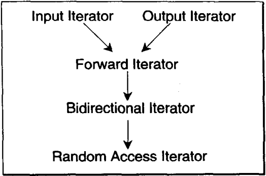
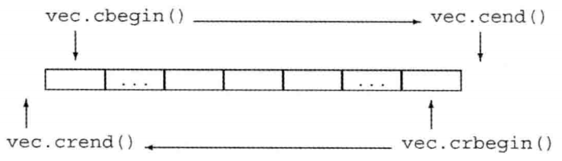
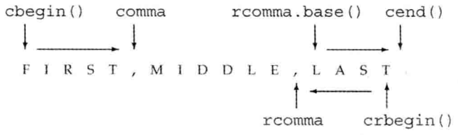

### 目录

[toc]

### 6.1 命名空间

#### 6.1.1 概念

C++ 有多个类库，为了解决不同库中的名字重复问题，引入了命名空间这个概念：

* 作为附加信息来区分不同库中相同名称的函数、类、变量等
* 使用命名空间即定义了上下文，本质就是定义了一个范围

例子：计算机的文件系统中，一个文件夹(目录)中可以包含多个文件夹，每个文件夹中不能有相同的文件名，但不同文件夹中的文件可以重名。

【注】标准库定义的所有名字都在命名空间 `std` 中。

#### 6.1.2 定义命名空间

命名空间的定义使用关键字 `namespace`，后跟命名空间的名称。

```c++
namespace namespace_name {
   // 代码声明
}
```

#### 6.1.3 使用命名空间

* 作用域操作符（`::`）

  ```c++
  命名空间::名字
  ```

  ```c++
  #include <iostream>
  using namespace std;
   
  // 第一个命名空间
  namespace first_space{
     void func(){
        cout << "Inside first_space" << endl;
     }
  }
  // 第二个命名空间
  namespace second_space{
     void func(){
        cout << "Inside second_space" << endl;
     }
  }
  int main ()
  {
   
     // 调用第一个命名空间中的函数
     first_space::func();
     
     // 调用第二个命名空间中的函数
     second_space::func(); 
   
     return 0;
  }
  ```

* `using` 声明

  一旦声明，即可直接访问该命名空间中的所有名字。

  ```c++
  using namespace 命名空间;
  ```

  ```c++
  #include <iostream>
  using namespace std;
   
  // 第一个命名空间
  namespace first_space{
     void func(){
        cout << "Inside first_space" << endl;
     }
  }
  // 第二个命名空间
  namespace second_space{
     void func(){
        cout << "Inside second_space" << endl;
     }
  }
  using namespace first_space;
  int main ()
  {
   
     // 调用第一个命名空间中的函数
     func();
     
     return 0;
  }
  ```

  【注】头文件不应包含 `using` 声明，因为头文件的内容会拷贝到引用它的文件中去，导致使用该头文件的文件都会有这个声明。

### 6.2 标准模板库

C++ 的标准模板库（Standard Template Library, STL）是标准库的一部分，它通过模板实现了常用的数据结构及其算法，并做到类型与算法的分离。

C++ STL 的核心包含三个组件：

* 容器（Containers）

  容器是用来管理某一类对象的集合。C++ 提供了各种不同类型的容器，比如 `deque`、`list`、`vector`、`map` 等。

* 迭代器（Iterators）

  迭代器用于遍历对象集合的元素。这些集合可能是容器，也可能是容器的子集。

* 算法（Algorithms）

  算法作用于容器和迭代器。它们提供了执行各种操作的方式，包括对容器内容执行初始化、排序、搜索和转换等操作。

### 6.3 容器库概览

#### 6.3.1 容器库基本概念

容器上的操作可以按照层级进行划分：

* 顶层：所有容器类型都提供的操作（详见本节）
* 中层：仅针对顺序容器、关联容器提供的操作（详见 `07 STL 顺序容器`，`08 STL 关联容器`）
* 底层：只适用于一小部分容器的操作（详见 `07 STL 顺序容器`，`08 STL 关联容器`）

容器的使用涉及头文件和模板的知识：

* 一般来说，每个容器都定义在一个头文件中，文件名与类型名相同，因此使用时必须包含头文件

* 容器均定义为模板类，因此必须提供额外的元素信息来生成特定的容器类型

```c++
list<Sales_data> lst;	// 保存 Sales_data 对象的 list
deque<double> dqe;		// 保存 double 的 deque
```

容器的元素类型几乎没有限制：

* 容器几乎可以保存任意类型的元素，包括嵌套容器类型

* 某些容器操作对元素类型由其自己的特殊要求，如果元素类型不支持，那么注意不能使用这样的容器操作

  ```c++
  // 假定 noDefault 是一个没有默认构造函数的类型
  vector<noDefault> v1(10, init);		// 正确：提供了元素初始化器
  vector<noDefualt> v2(10);			// 错误：必须提供一个元素初始化器
  ```

#### 6.3.2 容器定义和初始化

<table>
    <tr>
    	<th>语法</th>
        <th>说明</th>
    </tr>
    <tr>
    	<td>C c;</td>
        <td>
            默认构造函数。<br/>
            【注】如果 C 是一个 array，则 c 中的元素按默认初始化方式初始化，否则 c 为空；
        </td>
    </tr>
    <tr>
    	<td>C c1(c2)</td>
        <td rowspan="2">
            c1 初始化为 c2 的拷贝。<br/>
    		【注1】c1 和 c2 必须是相同的（容器和元素）类型；<br/>
            【注2】对于 array 类型，两者还必须具有相同的大小；
        </td>
    </tr>
    <tr>
    	<td>C c1=c2</td>
    </tr>
    <tr>
    	<td>C c{a,b,c...}</td>
        <td rowspan="2">
            c 初始化为列表中元素的拷贝。<br/>
            【注1】列表中的元素类型必须与 C 的元素类型相容；<br/>
            【注2】对于 array 类型，列表中的元素数目必须小于等于 array 的大小，剩余元素的将进行值初始化；
        </td>
    </tr>
    <tr>
    	<td>C c={a,b,c...}</td>
    </tr>
    <tr>
    	<td>C c(b,e)</td>
        <td>
            c 初始化为迭代器 b 和 e 指定范围中的元素的拷贝；<br/>
            【注】范围中的元素的类型必须与 C 的元素类型相容（array 不适用）;
        </td>
    </tr>
    <tr>
    	<td colspan="2"><b>只有顺序容器（不包括 array）的构造函数才能接受大小参数</b></td>
    </tr>
    <tr>
    	<td>C seq(n)</td>
        <td>
            seq 包含 n 个元素，这些元素进行了值初始化；此构造函数是 explicit 的（string不适用）。<br />
            【注1】如果元素类型是内置类型或有默认构造函数的类类型，可以使用此函数；<br/>
            【注2】如果元素类型没有默认构造函数，则必须用下面的函数显示提供初值；
        </td>
    </tr>
    <tr>
    	<td>C seq(n,t)</td>
        <td>seq 包含 n 个初始化为值 t 的元素</td>
    </tr>
</table>
#### 6.3.3 一般容器操作

<table>
    <tr>
    	<th>一般容器操作</th> <th>说明</th>
    </tr>
    <tr>
    	<th colspan="2">类型别名</th>
    </tr>
    <tr>
    	<td>iterator</td>
        <td>此容器类型的迭代器类型</td>
    </tr>
    <tr>
    	<td>const_iterator</td>
        <td>
            可以读取元素，但不能修改元素的迭代器类型；<br/>
            【注】如果容器是 const 的，必须使用这个
        </td>
    </tr>
    <tr>
    	<td>size_type</td>
        <td>无符号整数类型，足够保存此种容器类型最大可能容器的大小</td>
    </tr>
    <tr>
    	<td>difference_type</td>
        <td>带符号整数类型，足够保存两个迭代器之间的距离</td>
    </tr>
    <tr>
    	<td>value_type</td>
        <td>元素类型</td>
    </tr>
    <tr>
    	<td>reference</td>
        <td>元素的左值类型；与 value_type& 含义相同</td>
    </tr>
    <tr>
    	<td>const_reference</td>
        <td>元素的 const 左值类型；与 const value_type& 含义相同</td>
    </tr>
    <tr>
		<th colspan="2">构造函数</th>
    </tr>
    <tr>
        <td>C c;</td>
        <td>默认构造函数，构造空容器（array 的参见 p301）</td>
    </tr>
    <tr>
        <td>C c1(c2);</td>
        <td>构造 c2 的拷贝 c1</td>
    </tr>
    <tr>
        <td>C c(b, e);</td>
        <td>构造 c，将迭代器 b 和 e 指定的范围内的元素拷贝到 c（array 不支持）</td>
    </tr>
    <tr>
    	<td>C c{a, b, c...};</td>
        <td>列表初始化 c</td>
    </tr>
    <tr>
		<th colspan="2">赋值与 swap</th>
    </tr>
    <tr>
    	<td>c1=c2</td>
        <td>将 c1 中的元素替换为 c2 中元素的拷贝，c1 和 c2 必须具有相同的类型</td>
    </tr>
    <tr>
    	<td>c1={a, b, c...}</td>
        <td>将 c1 中的元素替换为列表中的元素（不适用于 array）</td>
    </tr>
    <tr>
    	<td>a.swap(b)</td>
        <td rowspan="2">
            交换 a 和 b 的元素，a 和 b 必须具有相同的类型；<br/>
            swap 通常比拷贝要快得多；
        </td>
    </tr>
    <tr>
    	<td>swap(a,b)</td>
    </tr>
    <tr>
    	<td colspan="2">
        	赋值与 swap 的区别：
            <ul>
				<li>赋值相关运算会导致指向左边容器内部的迭代器、引用和指针失效</li>
				<li>除了 array 和 string 类型， swap 操作只交换两个容器的数据结构，因此内部的迭代器、引用和指针不会失效</li>
            </ul>
        </td>
    </tr>
    <tr>
		<th colspan="2">大小</th>
    </tr>
    <tr>
    	<td>c.size()</td>
        <td>c 中元素的数目（不支持 forward_list）</td>
    </tr>
    <tr>
    	<td>c.max_size()</td>
        <td>c 可保存的最大元素数目</td>
    </tr>
    <tr>
    	<td>c.empty()</td>
        <td>若 c 中存储了元素，返回 false，否则返回 true</td>
    </tr>
    <tr>
		<th colspan="2">添加/删除元素（不适用于 array，在不同容器中它们的接口不同）</th>
    </tr>
    <tr>
    	<td>c.insert(args)</td>
        <td>
            将 args 中的元素拷贝进 c；<br/>
            【注】插入函数创建的元素是拷贝初始化的（1.2.1.2 变量初始化）；
        </td>
    </tr>
    <tr>
    	<td>c.emplace(inits)</td>
        <td>
            使用 inits 构造 c 中的一个元素<br/>
            【注】emplace 成员创建的元素是直接初始化的（1.2.1.2 变量初始化）；
        </td>
    </tr>
    <tr>
    	<td>c.erase(args)</td>
        <td>删除 args 指定的元素</td>
    </tr>
    <tr>
    	<td>c.clear()</td>
        <td>删除 c 中的所有元素，返回 void</td>
    </tr>
    <tr>
		<th colspan="2">关系运算符</th>
    </tr>
    <tr>
    	<td>==, !=</td>
        <td>所有容器都支持的相等（不等）运算符</td>
    </tr>
    <tr>
    	<td><, <=, >, >=</td>
        <td>关系运算符（无序关联容器不支持）</td>
    </tr>
    <tr>
    	<td colspan="2">
            关系运算符的工作方式基于元素类型：
            <ul>
                <li>容器的关系运算符使用元素的关系运算符完成比较</li>
				<li>容器相等 <=> 元素数量相同，元素大小相等</li>
				<li>否则，容器比较结果取决于第一对不同的元素的比较结果</li>
            </ul>
        </td>
    </tr>
    <tr>
		<th colspan="2">获取迭代器</th>
    </tr>
    <tr>
    	<td>c.begin(), c.end()</td>
        <td>
            返回指向 c 的首元素位置的迭代器和尾元素之后位置的迭代器；<br/>
            对于非 const 容器，返回 iterator 类型；对于 const 容器，返回 const_iterator 类型
        </td>
    </tr>
    <tr>
    	<td>c.cbegin, c.cend()</td>
        <td>
            无论容器是否是 const 的，都返回 const_iterator；<br/>
            【注】不以 c 开头的函数都是被重载过的
        </td>
    </tr>
    <tr>
		<th colspan="2">反向容器的额外成员（不支持 forward_list）</th>
    </tr>
    <tr>
    	<td>reverse_iterator</td>
        <td>按逆序寻址元素的迭代器类型</td>
    </tr>
    <tr>
    	<td>const_reverse_iterator</td>
        <td>不能修改元素的逆序迭代器类型</td>
    </tr>
    <tr>
    	<td>c.rbegin), c.rend()</td>
        <td>返回指向 c 的尾元素和首元素之前位置的迭代器</td>
    </tr>
    <tr>
    	<td>c.rbegin(), c.rend()</td>
        <td>返回指向 c 的尾元素和首元素之前位置的迭代器</td>
    </tr>
    <tr>
    	<td>c.crbegin(), c.crend()</td>
        <td>返回 const_reverse_iterator，兼具“反向”和“逆序”</td>
    </tr>
</table>

### 6.4 迭代器

#### 6.4.1 迭代器基本概念

迭代器按照功能的强弱，分为五种：

<table>
    <tr>
    	<th>迭代器类别</th>
        <th>说明</th>
		<th>必须支持的操作</th>
    </tr>
    <tr>
    	<td>输入迭代器</td>
        <td>只读，不写；单遍扫描，只能递增</td>
        <td>
            相等运算符（==）, 不等运算符（!=）<br/>
            前置和后置递增运算符（++）<br/>
            解引用运算符（*）<br/>
            箭头运算符（-&gt;）
        </td>
    </tr>
    <tr>
    	<td>输出迭代器</td>
        <td>只写，不读；单遍扫描，只能递增</td>
        <td>
        	前置和后置递增运算符（++）<br/>
            解引用运算符（*）
        </td>
    </tr>
    <tr>
    	<td>前向迭代器</td>
        <td>可读写；多遍扫描，只能递增</td>
        <td>支持所有输入和输出迭代器的操作</td>
    </tr>
    <tr>
    	<td>双向迭代器</td>
        <td>可读写；多遍扫描，可递增递减</td>
        <td>除了支持所有前向迭代器的操作之外，还支持前置和后置递减运算符（--）</td>
    </tr>
    <tr>
    	<td>随机访问迭代器</td>
        <td>可读写，多遍扫描，支持全部迭代器运算</td>
        <td>
            支持双向迭代器的所有功能，此外还支持：<br/>
            关系运算符（&lt;、&lt;=、&gt; 和 &gt;=）<br/>
            和整数值的加减运算（+、+=、- 和 -=）<br/>
            两个迭代器上的减法运算（-）<br/>
            下标运算符（iter[n]，等价于 *(iter[n])）
        </td>
    </tr>
</table>
上述五种迭代器的细化关系如下（箭头反过来可以看做继承关系）：



迭代器有范围的概念，它是标准库的基础：

* 一个迭代器范围由一对迭代器表示，两个迭代器分别指向同一个容器中的元素或尾后元素。
* 这种元素范围是左闭右开区间：`[begin, end)`。

#### 6.4.2 迭代器定义

迭代器的定义基于容器的迭代器类型成员：

| 迭代器定义方式 | 语法                                         |
| -------------- | -------------------------------------------- |
| 正向迭代器     | `容器类名::iterator 迭代器名;`               |
| 常量正向迭代器 | `容器类名::const_iterator 迭代器名;`         |
| 反向迭代器     | `容器类名::reverse_iterator 迭代器名;`       |
| 常量反向迭代器 | `容器类名::const_reverse_iterator 迭代器名;` |

**反向迭代器详解**

反向迭代器（reverse iterator）是在容器中从尾元素反向移动的迭代器，其递增、递减操作的含义颠倒过来。

* 反向迭代器需要递减运算符（`--`）

* 反向迭代器也具有左闭右开区间

  

* 反向迭代器和其他迭代器的关系

  * 可以通过调用反向迭代器 `reverse_iterator` 的函数成员 `base()` 得到容器的普通迭代器

    ```c++
    // 在一个逗号分隔的列表中查找第一个元素
    auto comma = find(line.cbegin(), line.cend(), ',');
    cout << string(line.cbegin(), comma) << endl;
    
    // 在一个逗号分隔的列表中查找最后一个元素
    auto rcomma = find(line.crbegin(), line.crend(), ',');
    cout << string(line.crbegin(), rcomma) << endl;  
    // 错误：假设输入为 FIRST,MIDDLE,LAST，输出会是 TSAL
    // 原因：rcomma 是一个反向迭代器，因此 [line.crbegin(), rcomma) 从尾部 T 遍历到 L
    
    cout << string(rcomma.base(), line.cend()) << endl;
    // 正确：得到一个正向迭代器，从逗号开始读取字符直到 line 末尾
    ```

    

    【注】两者指向容器中相同的元素范围但位置不对称，因而 `rcomma` 和 `rcomma.base()` 生成相邻位置而不是相同位置。

* 除了 `forward_list` 之外的标准库容器都支持反向迭代器

**移动迭代器**

移动迭代器：这些迭代器不是拷贝其中的元素，而是移动它们（这个==留到 `p480 13.6.2`== 节讨论）

#### 6.4.3 迭代器操作

* 所有容器都支持的迭代器操作：

  | 运算符           | 含义与要点                                                   |
  | ---------------- | ------------------------------------------------------------ |
  | `*iter`          | 返回迭代器 `iter` 所指元素的内容                             |
  | `iter->mem`      | 解引用 `iter`，获取该元素名为 `mem` 的成员，等价于 `(*iter).mem` |
  | `++iter`         | 令 `iter` 指示容器中的下一个元素                             |
  | `--iter`         | 令 `iter` 指示容器中的上一个元素                             |
  | `iter1 == iter2` | 当两个迭代器指示同一个元素或同一个容器的尾后迭代器时，迭代器相等；否则，不相等 |
  | `iter1 != iter2` | 当两个迭代器指示同一个元素或同一个容器的尾后迭代器时，迭代器相等；否则，不相等 |

* `string`、`vector`、`deque`、`array` 额外支持的迭代器操作：

  | 运算符               | 含义与要点                                                   |
  | -------------------- | ------------------------------------------------------------ |
  | `iter + n`           | 迭代器加上一个整数 `n`，效果是向前移动 `n` 个元素。结果为一个元素或者尾元素下一位置 |
  | `iter - n`           | 迭代器减去一个整数 `n`，效果是向后移动`n`个元素。结果为一个元素或者尾元素下一位置 |
  | `iter1 += n`         | 迭代器加法复合赋值语句，将 `iter1` 加 `n` 的结果赋给 `iter1` |
  | `iter1 -= n`         | 迭代器减法复合赋值语句，将 `iter1` 减 `n` 的结果赋给 `iter1` |
  | `iter1 - iter2`      | 两个迭代器相减结果为他们之间的距离<br/>【注】返回的距离值是类型为 `difference_type` 的带符号整型数 |
  | `>`, `>=`, `<`, `<=` | 迭代器关系运算符，迭代器在容器位置靠前的较小，靠后的较大     |

#### 6.4.4 迭代器适配器

除了容器自身的迭代器外，标准库在头文件 `iterator` 中，还定义了额外几种迭代器：

##### 6.4.4.1 插入迭代器

将插入迭代器（insert iterator）绑定到一个容器上，就可以向容器中插入元素。

**插入迭代器类型**

* `back_inserter` : 创建一个使用 `push_back` 的迭代器

  ```c++
  back_inserter(容器);
  ```

* `front_inserter` : 创建一个使用 `push_front` 的迭代器

  ```c++
  front_inserter(容器);
  ```

* `inserter` : 创建一个使用 `insert` 的迭代器，接受第二个参数，必须是一个指向给定容器的迭代器，插入元素到此之前

  ```c++
  inserter(容器, 指向某位置的迭代器);
  ```

【注】只有在容器支持对应的操作函数时，才能使用对应的迭代器。

**插入迭代器操作**

| 插入迭代器操作        | 说明                                                         |
| --------------------- | ------------------------------------------------------------ |
| `it=t`                | 在 `it` 指定的当前位置插入值 `t`                             |
| `*it`, `++it`, `it++` | 这些操作虽然存在，只是为了兼容其他泛型算法，不会对 `it` 做任何的改变，直接返回 `it`（`it` 的改变在重载的赋值操作专门定制了） |

**过程解析**

当调用 `inserter(c, iter)` 时，得到一个迭代器，使用它时，会将元素插入到原来所指向的元素之前的位置。

```c++
// 插入迭代器赋值语句
*it = val;
// 等价语句
it = c.insert(it, val);  	// it 指向新加入的元素
++it;						// 递增 it 使它指向原来的元素
```

当调用 `front_inserter` 时，它的行为完全不同，元素总是插入到容器第一个元素之前。

```c++
list<int> lst = {1,2,3,4};
list<int> lst2, lst3;  		// 空 list
// 拷贝完成后，lst2 包含 4 3 2 1
copy(lst.cbegin(), lst.cend(), front_inserter(lst2));
// 拷贝完成后，lst3 包含 1 2 3 4
copy(lst.cbegin(), lst.cend(), inserter(lst3, lst3.begin()));
```

##### 6.4.4.2 流迭代器

将流迭代器（stream iterator）绑定到输入或输出流上，就可以按照迭代器的方式遍历所关联的 IO 流。

**流迭代器类型**

* `istream_iterator` : 读取输入流，要读取的类型必须且只需支持输入运算符（`>>`）
* `ostream_iterator` : 读取输出流，要输出的类型必须且只需支持输出运算符（`<<`）

**流迭代器操作**

<table>
    <tr>
        <th> 流迭代器类型</th>
    	<th>流迭代器操作</th>
        <th>说明</th>
    </tr>
    <tr>
    	<td rowspan=7>istream_iterator 操作</td>
        <td>istream_iterator&lt;T&gt; in(is);</td>
        <td>in 从输入流 is 读取类型为 T 的值</td>
    </tr>
    <tr>
        <td>istream_iterator&lt;T&gt; end;</td>
        <td>读取类型为 T 的值的 istream_iterator 迭代器，表示尾后位置</td>
    </tr>
    <tr>
        <td>in1 == in2</td>
        <td rowspan=2>in1 和 in2 必须读取相同类型。如果它们都是尾后迭代器，或绑定到相同的输入，则两者相等</td>
    </tr>
    <tr>
    	<td>in1 != in2</td>
    </tr>
    <tr>
    	<td>*in</td>
        <td>返回从流中读取的值</td>
    </tr>
    <tr>
    	<td>in->mem</td>
        <td>与 (*in).mem 的含义相同</td>
    </tr>
    <tr>
        <td>++in, in++</td>
        <td>使用元素类型所定义的 &gt;&gt; 运算符从输入流中读取下一个值。与以往一样，前置版本返回一个指向递增后迭代器的引用，后置版本返回旧值</td>
    </tr>
    <tr>
        <td rowspan=4>ostream_iterator 操作</td>
        <td>ostream_iterator&lt;T&gt; out(os); </td>
        <td>out 将类型为 T 的值写到输出流 os 中</td>
    </tr>
    <tr>
        <td>ostream_iterator&lt;T&gt; out(os,d); </td>
        <td>out 将类型为 T 的值写到输出流 os 中，每个值后面输出一个 d。d 指向一个空字符结尾的字符数组</td>
    </tr>
    <tr>
    	<td>out = val</td>
        <td>用 &lt;&lt; 运算符 将 val 写入到 out 所绑定的 ostream 中。val 的类型必须与 out 可写的类型兼容</td>
    </tr>
    <tr>
    	<td>*out, ++out, out++</td>
        <td>这些运算符是存在的，但不对 out 做任何事情，直接原样返回 out</td>
    </tr>
</table>

【注1】默认初始化迭代器，可以得到尾后迭代器。

【注2】对于一个绑定到流的迭代器，一旦其关联的流遇到文件尾或 IO 错误，迭代器的值就与尾后迭代器相等。

【注3】`istream_iterator` 允许使用懒惰求值

* 当绑定到一个 `istream_iterator` 流时，标准库并不保证迭代器立即从流中读取数据
* 标准库保证的是，在第一次解引用迭代器之前，已经完成从流中读取数据

**案例演示**

`istream_iterator` 操作演示：

```c++
// 用 istream_iterator 从标准输入读取数据

// 基本法
istream_iterator<int> in_iter(cin);  // 从 cin 读取 int
istream_iterator<int> eof;			 // istream 尾后迭代器
while(in_iter != eof)
    vec.push_back(*in_iter++);		 // 后置递增运算读取流，返回迭代器的旧值；解引用迭代器获得从流读取的前一个值

// 改进法
istream_iterator<int> in_iter(cin), eof;  // 从 cin 读取 int
vector<int> vec(in_iter, eof);			  // 从迭代器范围构造 vec
```

`ostream_iterator` 操作演示：

```c++
// 用 ostream_iterator 从标准输出写入数据

// 基本法
ostream_iterator<int> out_iter(cout, " ");
for(auto e:vec)
    *out_iter++ = e;  // 赋值语句实际上将元素写到 cout
cout << endl;

// 改进法
copy(vec.begin(), vec.end(), out_iter);
cout << endl;
```
