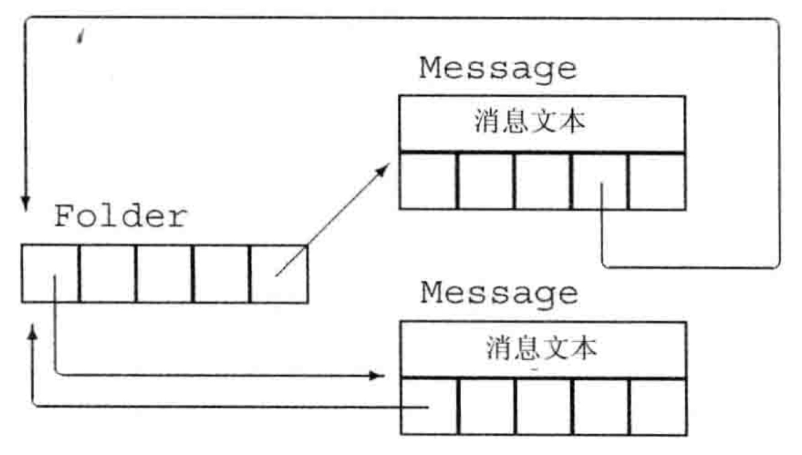

### 目录

[toc]

### 12.1 拷贝控制基本概念

#### 12.1.1 拷贝控制概述

类的对象有创建、拷贝/赋值、移动和销毁这三种基本操作，C++ 深度给予类设计者控制这些操作的能力。

C++ 中的类通过定义五种特殊的成员函数来控制这些操作：

* 默认构造函数（default constructor，`5.3.4.1 构造函数的定义`）

* 拷贝构造函数（copy constructor）
* 拷贝赋值运算符（copy-assignment operator）
* 移动构造函数（move constructor）
* 移动赋值运算符（move-assignment operator）
* 析构函数（destructor）

其中默认构造函数及普通构造函数已总结，本章着重后面五个——拷贝控制操作（copy control）。

**章节联系：**

* 第 05 章：通过解析面向对象编程的基本单元——类，介绍数据抽象/封装的知识
* <u>第 12 章</u>：讨论如何控制对象拷贝、移动、赋值和销毁等行为
* 第 13 章：学习如何自定义运算符
* 第 14 章：详细介绍继承和多态的知识

#### 12.1.2 右值引用

左值和右值的概念：`2.1.1.3 左值和右值`；

右值引用的概念：

* 解析：右值引用是绑定到右值的引用，通过 `&&` 来获得右值引用

  * 右值引用只能绑定到一个将要销毁的对象
  * 右值引用和左值引用一样，都是表达式的属性，本质是别名

* 绑定：右值引用绑定右值，左值引用绑定左值，`const` 左值引用可绑定右值

  * 常见的右值：要求转换的表达式、字面值常量、返回右值的表达式（只能使用其值的对象可以说是右值）
  * 常见的左值：变量（既是左值又是右值），右值引用类型的变量

  【注1】左值可以当右值使用，右值引用能绑定右值但不能直接绑定左值。

  【注2】**右值引用类型的变量**是左值表达式。

  ```c++
  int i = 42;
  
  int &r = i;					// 正确：r 引用 i
  int &&rr = i;				// 错误：不能将一个右值引用绑定到一个左值上
  
  int &r2 = i * 42;			// 错误：i * 42 是一个右值
  const int &r3 = i * 42;		// 正确：我们可以将一个 const 的引用绑定到一个右值上
  int &&rr2 = i * 42;			// 正确：将 rr2 绑定到乘法结果这个右值上
  
  int &&rr1 = 42;				// 正确：字面常量是右值
  int &&rr2 = rr1;			// 错误：表达式 rr1 是左值
  ```

* 生命：左值持久，右值短暂

  * 左值有持久的状态
  * 右值要么是字面值常量，要么是表达式求值过程中创建的临时对象
  
  【注】右值引用的代码可以自由**接管/窃取**所引用对象的资源。
  
* 用途

  * 模板实参转发（`15.2.4.6 转发的支持`）
  * 模板重载（`15.2.4.7 重载的支持`）

#### 12.1.3 标准库 `move` 函数

##### 12.1.3.1 `std::move` 的使用

虽然不能将一个右值引用直接绑定到一个左值上，但可以显示地将一个左值转换为对应的右值引用类型。

通过名为 `move` 的新标准库函数可以获得<u>绑定到左值上的的右值引用</u>，它定义在头文件 `<utility>` 中。

例如：

```c++
int &&rr3 = std::move(rr1);
```

* 调用 `move` 后，得到**移后源对象** `rr1`，下一步<u>除了赋值和销毁</u>外，不能再使用它（因为其中的 “内容” 被移走了）
* 对于 `move`，习惯上不使用 `using` 声明，而是<u>直接调用 `std::move`</u>，这将在 ==`p707 18.2.3`== 中解释

##### 12.1.3.2 `std::move` 的原理

标准库 `move` 函数是使用右值引用的模板（`15.2.4.5 左右引用的推断`）的典型例子。

**`std::move` 的定义**

```c++
// 在返回类型和类型转换中也要用到 typename（15.2.4.3 隐式模板实参高级）
// remove_reference 在 15.2.4.3 隐式模板实参高级
template <typename T>
typename remove_reference<T>::type&& move(T&& t)
{
    // static_cast 在 2.3.2.1 命名的强制类型转换
    return static_cast<typename remove_reference<T>::type&&>(t);
}
```

`move` 的函数参数 `T&&` 是一个指向模板类型参数的右值引用，通过引用折叠规则可以匹配任何类型。

**`std::move` 的工作**

```c++
string s1("hi!"), s2;
s2 = std::move(string("bye!"));		// 正确：从一个右值移动数据
s2 = std::move(s1);					// 正确：从一个左值移动数据，但在赋值之后，s1 的值是不确定的
```

* 传入右值分析

  * 推断出 `T` 的类型为 `string`
  * `remove_reference` 用 `string` 实例化
  * `remove_reference<T>::type` 成员是 `string`
  * `move` 返回类型是 `string&&`
  * `move` 的函数参数 `t` 的类型是 `string&&`

  实例化结果为：

  ```c++
  string&& move(string &&t)
  ```

* 传入左值分析

  * 推断出 `T` 的类型为 `string&`（特殊推断规则 `15.2.4.5 左右引用的推断`）
  * `remove_reference` 用 `string&` 实例化
  * `remove_reference<T>::type` 成员是 `string`
  * `move` 返回类型是 `string&&`
  * `move` 的函数参数 `t` 的类型是 `string&`
  
  实例化结果为：
  
  ```c++
  string&& move(string &t)
  ```

【注1】`static_cast` 允许将一个左值转换为右值，因为截断一个左值是安全的。

【注2】建议统一使用 `std::move`，使得程序查找潜在截断左值的代码时变得容易。

### 12.2 拷贝控制操作

#### 12.2.1 拷贝构造函数

##### 12.2.1.1 语法

如果一个构造函数的第一个参数是<u>自身类类型的**引用**</u>，且任何额外参数都有默认值，则此构造函数是拷贝构造函数。

```c++
class Foo {
public:
	Foo(); 				// 默认构造函数
	Foo(const Foo&); 	// 拷贝构造函数
}
```

【注1】拷贝构造函数的参数必须是一个引用，否则调用拷贝构造函数时，传参过程中又用到拷贝构造函数，造成死循环。

【注2】可以定义一个接受非 `const` 引用的拷贝构造函数，但一般情况不做修改，都会是 `const` 的引用。

【注3】拷贝构造函数<u>属于转换构造函数</u>（只接受一个参数），也会被隐式使用，故不声明为 `explicit`（`5.3.5.4 转换构造函数`）。

【注4】拷贝初始化的联系（`1.2.1.2 变量初始化`，概念、发生时机、与直接初始化的差异）

* 拷贝构造函数主要用于拷贝初始化
* 但拷贝初始化既可能使用拷贝构造函数，也可能使用移动构造函数

##### 12.2.1.2 合成拷贝构造函数

合成拷贝构造函数的时机：与默认构造函数不同，即使定义了其他构造函数，编译器<u>都会合成</u>一个拷贝构造函数。

合成拷贝构造函数的行为：

* 从给定对象中依次拷贝非 `static` 成员到正在创建的对象中
* 各个成员的拷贝方式遵循 “粒度最小原则”
  * 对于类类型成员，使用其拷贝构造函数来拷贝
  * 对于内置类型成员，直接拷贝
  * 对于数组，逐个元素进行拷贝（回到前面两点）

显示等价形式：

```c++
class Sales_data {
public:
    // ...
    Sales_data(const Sales_data&);
private:
    std::string bookNo;
    int units_sold = 0;
    double revenue = 0.0;
};

// 与 Sales_data 的合成的拷贝构造函数等价
Sales_data::Sales_data(const Sales_data &orig):
	bookNo(orig.bookNo),			// 使用 string 的拷贝构造函数
	units_sold(orig.units_sold),	// 拷贝 orig.units_sold
	revenue(orig.revenue),			// 拷贝 orig.revenue
	{  }							// 空函数体
```

```c++
// =default 版本
Sales_data::Sales_data(const Sales_data&) = default;
```

【注】在类的内部，`=default` 会隐式地声明为内联函数；在类的外部，该成员默认情况下不是内联的。

#### 12.2.2 拷贝赋值运算符

##### 12.2.2.1 语法

拷贝赋值运算符的定义涉及重载运算符（`13.1 重载运算基本概念`）的知识。

拷贝赋值运算符基于 `operator=` 函数，接受一个自身类类型的**左值引用**作为参数，通常返回一个指向其左侧运算对象的引用。

```c++
class Foo {
public:
    Foo& operator=(const Foo&); // 赋值运算符
    // ...
};
```

【注】<u>拷贝赋值运算符的重载实现</u>有专门注意的地方，详见 `13.2.3 赋值运算符` 节。

##### 12.2.2.2 合成拷贝赋值运算符

合成拷贝赋值运算符的时机：如果一个类未定义拷贝赋值运算符，编译器<u>会合成</u>一个拷贝赋值运算符。

合成拷贝赋值运算符的行为：

* 依次将右侧对象中的每个非 `static` 成员赋给左侧运算对象中的对应成员
* 各个成员的拷贝方式遵循 “粒度最小原则”
  * 对于类类型成员，使用其拷贝赋值运算符来拷贝
  * 对于内置类型成员，直接拷贝
  * 对于数组，逐个元素进行拷贝（回到前面两点）

显示等价形式：

```c++
// 等价于合成拷贝赋值运算符
Sales_data& Sales_data::operator=(const Sales_data &rhs)			// 类外
{
    bookNo = rhs.bookNo;			// 调用 string::operator=
    units_sold = rhs.units_sold;	// 使用内置的 int 赋值
    revenue = rhs.revenue;			// 使用内置的 double 赋值
    return *this;					// 返回一个此对象的引用
}
```

```c++
// =default 版本
Sales_data& operator=(const Sales_data&) = default;					// 类内
Sales_data& Sales_data::operator=(const Sales_data&) = default;		// 类外
```

【注】在类的内部，`=default` 会隐式地声明为内联函数；在类的外部，该成员默认情况下不是内联的。

#### 12.2.3 移动构造函数

##### 12.2.3.1 语法

移动构造函数的定义有两点：

* 移动构造函数的第一个参数是该类型的一个<u>右值引用</u>，且任何额外参数都有默认值
* 除了完成资源移动，移动构造函数还必须确保移后源对象的<u>状态安全</u>——可随时赋值和销毁（没有牵挂了）
  * 一旦资源完成移动，源对象必须不再指向被移动的资源
  * 否则源对象销毁时，会释放掉我们刚刚移动的内存

```c++
StrVec::StrVec(StrVec &&s) noexcept 								// 移动操作一般不会抛出任何异常，做显示说明（下面解释）
    : elements(s.elements), first_free(s.first_free), cap(s.cap) 	// 成员初始化器接会接管 s 中的资源
{
	s.element = s.first_free = s.cap = nullptr; 					// 确保移后源对象状态安全
        															// 如果忘记置空，则析构函数自动调用时，会释放掉刚刚移动的内存
}
```

【注】在成员初始化器中，与拷贝构造函数不同，移动构造函数不分配任何新内存，而是接管给定的 `StrVec` 中的内存。

##### 12.2.3.2 合成移动构造函数

一般情况下，编译器都会使用拷贝操作代替移动操作。

编译器也会合成移动构造函数和移动赋值运算符，但是<u>合成移动操作的条件</u>与<u>合成拷贝操作的条件</u>大不相同：

* 类没有定义任何自定义版本的拷贝控制成员（拷贝构造函数，拷贝赋值运算符或析构函数）
* 类的每个非 `static` 数据成员都可移动

满足上面两个条件才会合成移动构造函数或移动赋值运算符。

```c++
// 编译器会为 X 和 hasX 合成移动操作
struct X {
    int i;						// 内置类型可以移动
    std::string s;				// string 定于了自己的移动操作
};

struct hasX {
    X mem; 						// X 有合成的移动操作
};

X x, x2 = std::move(x);			// 使用合成的移动构造函数
hasX hx, hx2 = std::move(hx);	// 使用合成的移动构造函数
```

##### 12.2.3.3 `noexcept` 声称

概念：

* 由于移动操作 “窃取” 资源，通常不分配任何资源，因此一般不会抛出异常
* 当编写一个确定不抛出异常的操作时，可以指明 `noexcept` 来通知标准库，减少一些额外工作

语法：

* 放在参数列表和初始化列表（如果是构造函数）的冒号之间

```c++
class StrVec {
public:
    StrVec(StrVec&&) noexcept;		// 移动构造函数
    // 其他成员的定义，如前
};
StrVec::StrVec(StrVec &&s) noexcept : /* 成员初始化器 */
{ /* 构造函数体 */ }
```

【注1】必须在类头文件的声明和定义（如果定义在类外）中都指定 `noexcept`。

【注2】对于不抛出异常的移动构造函数和移动赋值运算符，必须标记为 `noexcept`，原因在于：

* 如果要让标准库容器对自定义类使用移动操作，就必须确保移动过程中不会发生异常（移动操作中途出异常无法撤销）
* 没有 `noexcept` 标记的话，编译器会出于安全起见使用拷贝构造函数而不是移动构造函数

#### 12.2.4 移动赋值运算符

##### 12.2.4.1 语法

移动赋值运算符的定义涉及重载运算符（`13.1 重载运算基本概念`）的知识。

语法：移动赋值运算符基于 `operator=` 函数，接受一个自身类类型的**右值引用**作为参数，通常返回一个指向其左侧运算对象的引用。

要点：

* 移动赋值运算符必须正确处理<u>自赋值</u>
* 移动赋值运算符必须确保<u>异常安全</u>，因此也要标记为 `noexcept`
* 除了完成资源移动，移动赋值运算符还必须确保移后源对象的<u>状态安全</u>——可随时赋值和销毁（没有牵挂了）

```c++
StrVec &StrVec::operator=(StrVec &&rhs) noexcept
{
    // 直接检测自赋值，
    // 防止此右值 rhs 可能是 std::move 调用的返回结果，
    // 保证不能在使用右侧运算对象的资源之前就释放左侧运算对象。
    if(this != &rhs)
    {
        // 释放已有元素
        free();
        // 从 rhs 接管资源
        elements = rhs.elements;
        first_free = rhs.first_free;
        cap = rhs.cap;
        // 将 rhs 置于可析构状态
        rhs.elements = rhs.first_free = rhs.cap = nullptr;
    }
    return *this;
}
```

【注】逻辑上，移动赋值运算符执行的是析构函数+移动构造函数的工作。

##### 12.2.4.2 合成移动赋值运算符

一般情况下，编译器都会使用拷贝操作代替移动操作。

编译器也会合成移动构造函数和移动赋值运算符，但是<u>合成移动操作的条件</u>与<u>合成拷贝操作的条件</u>大不相同：

* 类没有定义任何自定义版本的拷贝控制成员（拷贝构造函数，拷贝赋值运算符或析构函数）

* 类的每个非 `static` 数据成员都可移动

满足上面两个条件才会合成移动构造函数或移动赋值运算符。

```c++
// 编译器会为 X 和 hasX 合成移动操作
struct X {
    int i;						// 内置类型可以移动
    std::string s;				// string 定于了自己的移动操作
};

struct hasX {
    X mem; 						// X 有合成的移动操作
};

X x, x2 = std::move(x);			// 使用合成的移动构造函数
hasX hx, hx2 = std::move(hx);	// 使用合成的移动构造函数
```

#### 12.2.5 析构函数

##### 12.2.5.1 语法

析构函数执行与构造函数相反的操作，释放对象使用的资源，并销毁对象的非 `static` 数据成员。

析构函数是类的一个成员函数，名字有波浪号接类名构成，没有返回值，也不接受参数。

```c++
class Foo {
public:
    ~Foo();  // 析构函数
    // ...
};
```

【注】析构函数是唯一的，不能被重载。

##### 12.5.1.2 合成析构函数

合成析构函数的时机：当一个类未定义自己的析构函数时，编译器会合成一个析构函数。

合成析构函数的行为：合成版本和自定义版本流程统一，见下面的 `12.5.1.3 析构函数的析构流程`。

##### 12.5.1.3 析构函数的析构流程

析构函数的执行流程是构造函数的反面：

* 构造函数有一个<u>初始化部分</u>和一个<u>函数体</u>        $$\longleftrightarrow$$​​      析构函数有一个<u>函数体</u>和一个<u>析构部分</u>

* 构造函数<u>先顺序初始化成员</u>，再执行函数体    $$\longleftrightarrow$$​​      析构函数先执行函数体，<u>再逆序销毁成员</u>

* 构造函数的初始化部分由<u>初始化列表</u>控制        $$\longleftrightarrow$$​​      析构函数的析构部分是<u>隐式的</u>

【注1】析构函数体并不直接销毁成员，成员是在析构函数体之后隐含的**析构部分**被销毁的。

【注2】销毁成员只会释放这个变量，对于普通指针来说，**并不会** `delete` 它所指向的对象。

##### 12.5.1.4 析构函数的触发

对象被销毁，就会自动调用其析构函数。

* <u>变量</u>离开其作用域时，被销毁，调用析构函数
* <u>对象</u>被销毁时，其成员被销毁，调用析构函数

* <u>容器</u>（标准库容器、数组）被销毁时，其元素被销毁，调用析构函数
* <u>动态分配的对象</u>，使用 `delete` 运算符时，该对象被销毁，调用析构函数
* <u>临时对象</u>，当创建它的完整表达式结束时，该对象被销毁，调用析构函数

【注】当一个对象的引用或指针离开作用域时，析构函数不会执行。

<u>例：析构函数的触发情形</u>

```c++
{ // 新作用域
    // p 和 p2 指向动态分配的对象
    Sales_data *p = new Sales_data;			// p 是一个内置指针
    auto p2 = make_shared<Sales_data>();	// p2 是一个 shared_ptr
    
    Sales_data item(*p);		// 拷贝构造函数将 *p 拷贝到 item 中
    
    vector<Sales_data> vec;		// 局部对象
    vec.push_back(*p2);			// 拷贝 p2 指向的对象
    
    delete p;					// 对 p 指向的对象执行析构函数
} // 推出局部作用域，对 item, p2 和 vec 调用析构函数
  // 销毁 p2 会递减其引用计数，其引用计数变为 0，对象释放
  // 销毁 vec 会释放它的元素
```

#### 12.2.6 拷贝控制操作的调用规则

##### 12.2.6.1 基本规则

* 左值拷贝，右值移动

  如果一个类既有移动构造函数/移动赋值运算符，也有拷贝构造函数/拷贝赋值运算符，编译器会使用普通的函数匹配规则来调用。

  ```c++
  StrVec v1, v2;
  v1 = v2; 					// v2 是左值，使用拷贝赋值运算符
  StrVec getVec(istream &); 	// getVec 返回一个右值
  v2 = getVec(cin); 			// 该函数返回一个右值，使用移动赋值运算符
  ```

* 无移动，右值也拷贝

  如果一个类没有移动构造函数，编译器不会合成它，而是保证目标被拷贝，即使使用 `move` 操作也会拷贝。

  ```c++
  class Foo {
  public:
      Foo() = default;
      Foo(const Foo&); 		// 拷贝构造函数
      // 其他成员定义，但 Foo 未定义移动构造函数
  };
  Foo x;
  Foo y(x); 					// 使用拷贝构造函数，x 是一个左值
  Foo z(std::move(x)); 		// 使用拷贝构造函数，因为未定义移动构造函数，将右值 Foo&& 转换为左值 const Foo&
  ```

【注】使用拷贝构造函数代替移动构造函数肯定是安全的。

##### 12.2.6.2 触发细化

**拷贝构造函数与移动构造函数**

* 拷贝构造函数的触发

  拷贝构造函数主要用于<u>拷贝初始化</u>，但拷贝初始化既可能依靠拷贝构造函数完成，也可能依靠移动构造函数完成，根据 “左值拷贝，右值移动” 决定。

* 移动构造函数的触发

  移动构造函数主要用于<u>拷贝初始化</u>，但拷贝初始化既可能依靠拷贝构造函数完成，也可能依靠移动构造函数完成，根据 “左值拷贝，右值移动” 决定。

  在拷贝初始化的表达式中，通过使用 `std::move`（`12.1.3 标准库 move 函数`）来改变底层的内存处理方式。

【注1】如果拷贝初始化的源对象类型不匹配，根据其转换构造函数的特性，编译器还会自动执行一步类型转换，再调用拷贝/移动构造函数。

【注2】拷贝初始化的发生时机：`1.2.1.2 变量初始化`。

【悟】拷贝构造函数和移动构造函数是拷贝初始化的两种底层实现形式，本质区别在于<u>内存是否复用</u>，通过<u>函数匹配</u>（左值和右值）实现区分。

**拷贝赋值运算符与移动赋值运算符**

* 拷贝赋值运算符的触发

  拷贝赋值运算符用于将一个<u>对象赋值（`=`）</u>给另一个对象，此时另一个对象调用拷贝赋值运算符。

* 移动赋值运算符的触发

  移动赋值运算符用于将一个<u>右值对象赋值（`=`）</u>给另一个对象，此时另一个对象**尝试（如果支持，否则 “无移动，右值也拷贝”）**调用移动赋值运算符。

【注】初始化和赋值是两个完全不同的操作，<u>前者从无到有，后者改头换面</u>（`1.2.1 定义、初始化和声明`）。

#### 12.2.7 交换操作

除了定义拷贝控制成员，管理资源的类通常还定义一个名为 `swap` 的函数，表示交换操作。

`swap` 交换操作的支持只是一种习惯上的优化手段，并没有专门规定它的语法存在，但它基于拷贝控制操作实现，包含一次拷贝和两次赋值。

##### 12.2.7.1 定义方法

* 首先将 `swap` 定义为 `friend`（`5.2.2 友元`），以便能访问自己类的 `private` 成员
* 然后将其声明为 `inline` 函数，体现其优化功能

```c++
class HashPtr {
    friend void swap(HashPtr&, HashPtr&);
    // ...
}

// 使用标准库定义版本
inline void swap(HashPtr &lhs, HashPtr &rhs)
{
    using std::swap; 		// 内部使用标准库定义版本，这是使用的前置语法
    swap(lhs.ps, rhs.ps); 	// 由于内置类型没有专门的 swap，所以会匹配到标准库版本的 std::swap，而不会递归调用本 swap
    swap(lhs.i, rhs.i);
}

// 使用自定义版本
void swap(Foo &lhs, Foo &rhs)
{
    using std::swap；
    std::swap(lsh.h, rhs.h);	// 错误：对于自定义类 HashPtr，想要使用自定义版本的 swap，而不是标准库定义版本的 swap
    swap(lsh.h, rhs.h); 		// 交换两个 Foo 类型的 HashPtr 成员，优先匹配自定义版本的 swap
    // 交换 Foo 的其他成员
}
```

【注1】`swap` 优先匹配类型特定的版本，不存在时才用标准库定义的版本（`14.3.3 改变个别成员的可访问性`，`15.2.4.7 重载的支持`）。

【注2】上面的 `using` 没有隐藏自定义版本，原因 ==p706 18.2.3==。

##### 12.2.7.2 基于拷贝的交换赋值运算符

在赋值运算符 `=` 中使用基于拷贝的 `swap`，就能得到拷贝交换赋值运算符。

这种情况的 `swap` 使用<u>拷贝并交换技术</u>：将左侧运算对象与右侧运算对象的一个副本进行交换。

```c++
// 注意这里的 rhs 是按值传递的，意味着拷贝构造函数将右侧运算对象拷贝到 rhs
HashPtr& HashPtr::operator=(HashPtr rhs)
{
    // 交换（一次拷贝和两次赋值）：左侧运算对象的内容与局部变量 rhs 的内容
    swap(*this, rhs); 	// rhs 现在指向本对象曾经使用的内存，本对象指向 rhs 曾经使用的内存
    return *this; 		// rhs 被销毁，从而 delete 了 rhs 中的内容
}
```

【注1】可以看到，拷贝并交换技术天然就是异常安全的，且能处理自赋值。

【注2】定义 `swap` 的类通常用 `swap` 来定义它们的赋值运算符，得到交换赋值运算符。

##### 12.2.7.2 支持移动的交换赋值运算符

在赋值运算符 `=` 中使用基于移动的 `swap`，就能得到移动交换赋值运算符。

这种情况的 `swap` 也是使用<u>拷贝并交换技术</u>：将左侧运算对象与右侧运算对象的一个副本进行交换；

不同的是，还为此类添加了一个移动构造函数。

```c++
class HashPtr {
    // 添加移动构造函数
    HashPtr(HashPtr &&p) noexcept: ps(p.ps), i(p.i) { p.ps = 0; }
    // 既是拷贝并交换赋值运算符（定义和上面的 12.2.6.2 一样）
    // 也是移动并交换赋值运算符（下面说明原因）
    HashPtr& operator=(HashPtr rhs)
    {
        swap(*this, rhs);
        return *this;
    }
}

// 演示：假设 hp 和 hp2 都是 HashPtr 对象
hp = hp2;				// 右侧是一个左值，通过拷贝构造函数来拷贝
hp = std::move(hp2);	// 右侧是一个右值，通过移动构造函数来移动
```

过程分析：

观察赋值运算符，它的**形参非引用，因此会进行拷贝初始化**，而拷贝初始化调用的函数<u>取决于实参类型</u>——左值拷贝，右值移动。

然后，不管使用的是拷贝构造函数还是移动构造函数，赋值运算符函数体都执行 `swap` 交换两个对象的状态。

结果，左侧运算对象 `this` 指向右侧内容，右侧运算对象 `rhs` 被拷贝/移动后，离开作用域被销毁。

#### 12.2.8 阻止拷贝/移动

##### 12.2.8.1 `=delete`

可以通过将拷贝构造函数或拷贝赋值运算符定义为 `=delete`（删除的函数）来阻止拷贝，它的作用是阻止被修饰函数任何方式的调用。

```c++
struct NoCopy {
    NoCopy() = default; 						// 使用合成的默认构造函数
    NoCopy(const NoCopy&) = delete; 			// 阻止拷贝构造函数
    NoCopy &operator=(const NoCopy&) = delete; 	// 阻止拷贝赋值运算符
}
```

【注1】`=default` 与 `=delete` 的异同：

* `=delete` 必须出现在函数第一次声明的时候
* 可以对任何函数指定 `=delete`

【注2】不能定义删除的析构函数。

##### 12.2.8.2 合成的阻止拷贝

对于某些情形，编译器会将合成的拷贝控制成员定义为 `=delete`：

* 如果类的某个成员的<u>析构函数</u>是删除的或不可访问的，则类的<u>合成析构函数</u>被定义为删除的；

* 如果类的某个成员

  * 的<u>拷贝构造函数</u>是删除的或不可访问的
  * 的<u>析构函数</u>是删除的或不可访问的

  则类的<u>合成拷贝构造函数</u>被定义为删除的；

* 如果类的某个成员

  * 的<u>拷贝赋值运算符</u>是删除的或不可访问的
  * 是<u>引用类型</u>
  * 是 <u>`const` 的</u>

  则类的<u>合成拷贝赋值运算符</u>被定义为删除的；

  解释1：左侧对象的引用必须初始化，且其赋值改变所指对象而不会重定向，故不允许；

  解释2：左侧对象的 `const` 常量无法赋值；

* 如果类的某个成员

  * 的<u>析构函数</u>是删除的或不可访问的
  * 是<u>引用类型</u>且没有类内初始化器（类内初始值）
  * 是 <u>`const` 的</u>且没有类内初始化器、这个成员也没有显示默认构造函数

  则<u>默认构造函数</u>被定义为删除的；

* 如果类

  * 定义了<u>移动构造函数</u>
  * 定义了<u>移动赋值运算符</u>

  则该类的<u>拷贝构造函数</u>和<u>拷贝赋值运算符</u>被定义为删除的，因此定义移动操作后也要定义拷贝操作；

【注1】本质上，当不可能拷贝、赋值或销毁类的成员时，类的合成拷贝控制成员就被定义为删除的。

【注2】C++11 新标准发布以前的阻止拷贝：

* 类是通过将其拷贝构造函数和拷贝赋值运算符声明为 `private` 的来阻止拷贝

* 友元和成员函数仍然可以拷贝对象，因此这些拷贝控制成员通常只声明不定义

##### 12.2.8.3 合成的阻止移动

移动操作在以下情况会隐式定义为删除的：

* 如果要求生成 `=default` 的移动操作但又无法移动所有成员时，编译器会隐式定义为 `=delete`；

* 如果类的某个成员

  * 定义了<u>拷贝构造函数</u>且未定义<u>移动构造函数</u>
  * 未定义<u>拷贝构造函数</u>且不能合成<u>移动构造函数</u>

  则类的<u>移动构造函数</u>被定义为删除的，<u>移动赋值运算符</u>类似；

* 如果类的某个成员

  * 的<u>移动构造函数</u>或<u>移动赋值运算符</u>是删除的或不可访问的

  则<u>移动构造函数</u>或<u>移动赋值运算符</u>被定义为删除的；

* 如果类的某个成员

  * 的<u>析构函数</u>是删除的或不可访问的

  则<u>移动构造函数</u>被定义为删除的；

* 如果类的某个成员

  * 是<u>引用类型</u>
  * 是 <u>`const` 的</u>

  则<u>移动赋值运算符</u>被定义为删除的；

#### 12.2.9 三/五法则

拷贝控制操作不要求全部自己定义，但它们之间有一些相互依赖关系：

* 基本原则：首先确定类是否需要一个析构函数

  * 需要自定义析构函数的类也需要自定义拷贝和赋值操作

    ```c++
    class HashPtr {
    public:
        HasPtr(const std::string &s = std::string()): ps(new std::string(s)), i(0) { }
        
        // 错误：HasPtr 需要一个拷贝构造函数和一个拷贝赋值运算符
        ~Hashtr() { delete ps; }
        
        // ...
    }
    
    HasPtr f(HasPtr hp)			// HasPtr 是传值参数，所有执行拷贝初始化，调用 HasPtr 的拷贝构造函数
    {
        HasPtr ret = hp;		// hp 赋值给 ret，调用 HasPtr 的拷贝赋值运算符
        // ...
        return ret;				// ret 和 hp 被销毁，调用 HasPtr 的析构函数
        // 错误：由于使用的是 HasPtr 的合成拷贝构造函数和 HasPtr 的合成拷贝赋值运算符，
        // 数据成员 ps 作为指针类型，只进行了简单的拷贝，意味着 hp.ps 和 ret.ps 指向相同的内存，
        // 于是两次调用 HasPtr 的自定义析构函数，会 delete 两次，发生错误。
    }
    ```

  * 需要自定义拷贝操作的类也需要自定义赋值操作，反之亦然

* 更新三/五法则：所有五个拷贝控制成员应该看着一个整体，全部一起定义最好

### 12.3 拷贝控制相关支持

#### 12.3.1 移动迭代器

新标准库定义了一种移动迭代器适配器，它的解引用运算符生成一个右值引用，而不是传统的左值引用。

通过调用标准库的 `make_move_iterator` 函数，可以将普通迭代器装饰为移动迭代器，传入迭代器，返回移动迭代器，而且迭代器接口保持不变。

```c++
void StrVec::reallocate()
{
    // 分配大小两倍于当前规模的内存空间
    auto newcapacity = size() ? 2 * size() : 1;
    auto first = alloc.allocate(newcapacity);
    // 移动元素（而不是拷贝）
    auto last = uninitialized_copy(make_move_iterator(begin()), make_move_iterator(end()), first);
    free(); 			// 释放旧空间
    elements = first; 	// 更新指针
    first_free = last;
    cap = elements + newcapacity;
}
```

【注】必须确认移后源对象没有其他访问操作时，才使用移动迭代器，以大幅提升性能。

#### 12.3.2 成员函数左右值参数

**（1）成员函数的左值和右值版本**

除了构造函数和赋值运算符外，如果一个成员函数同时提供拷贝和移动版本，也能从中受益。

这种成员函数使用与拷贝/移动构造函数和赋值运算符相同的参数模式：

* 第一个版本接受一个指向 `const` 的左值引用
* 第二个版本接受一个指向非 `const` 的右值引用（此版本会从其参数窃取数据）

【注】一般不需要定义另外两种，想要窃取数据是就不会设为 `const`，想要拷贝是就不应该修改源对象而加上 `const`。

例子：

```c++
void push_back(const X&);	// 拷贝：绑定到任意类型的 X
void push_back(X&&);		// 移动：只能绑定到类型 X 的可修改右值
```

**（2）`this` 的左值和右值版本**

在参数列表后放置一个**引用限定符**，来限定成员函数的 `this` 对象为左值/右值：

* `&`：指出 `this` 可以指向一个左值
* `&&`：指出 `this` 可以指向一个右值

```c++
class Foo {
public:
    Foo &operator=(const Foo&) &; // 只能想可修改的左值赋值
    // ...
}
```

【注1】类似于`const` 限定符，引用限定符只能用于（非`static`）成员函数，且必须同时出现在函数的声明和定义中。

【注2】同时使用 `const` 限定符和引用限定符时，`const` 限定符在前，引用限定符在后。

【注3】引用限定符也参与函数重载，且可以与 `const` 限定符综合使用。

【注4】如果一个成员函数有引用限定符，则所有同名同参数列表的函数，要么都有引用限定符，要么都不加。

### 12.4 指导案例

#### 12.4.1 拷贝控制的资源管理

上一节叙述了拷贝控制的知识点，这节从类的角度学习如何使用拷贝控制进行资源管理。

管理类外资源的类必须定义拷贝控制成员，因此必须首先明确此类型对象的拷贝语义，有两种选择：

* 行为像值的类
* 行为像指针的类

为了说明这两种方式，下面以 `HashPtr` 类的定义为例进行讲解，该类有两个成员，一个 `int` 值 `i` 和一个 `string` 指针 `ps`。

##### 12.4.1.1 行为像值的类

为了给 `HashPtr` 提供类值的行为，对于类管理的资源，<u>每个对象都应该拥有一份自己的拷贝</u>。

```c++
class HashPtr {
public:
    HashPtr(const std::string &s = std::string()): ps(new std::string(s)), i(10) {} // 默认构造函数
    HashPtr(const HashPtr &p): ps(new std::string(*p.ps)), i(p.i) {} 				// 拷贝构造函数
    HashPtr& operator=(const HashPtr&); 											// 拷贝赋值运算符*
    ~HashPtr { delete ps; } 														// 析构函数
private:
    std::string *ps;																// string 指针
    int i;																			// int 值
}
```

**拷贝赋值运算符的实现**要专门讲解。

* 操作剖析：大多数赋值运算符组合了析构函数和构造函数的工作
  * 类似析构函数，赋值操作会销毁左侧运算对象的资源
  * 类似拷贝构造函数，赋值操作会从右侧运算对象拷贝数据
* 安全实现

  * 自赋值安全，即使将一个对象赋予它自身也保证正确
  * 异常安全，当异常发生时能将左侧运算对象置于一个有意义的状态

* 参考模式
  * 先将右侧运算对象拷贝到一个局部临时对象
  * 销毁左侧运算对象的现有成员
  * 从临时对象拷贝到左侧运算对象的成员中

```c++
// 拷贝赋值运算符的定义
HashPtr& HashPtr::operator=(const HashPtr &rhs)
{
    auto newp = new string(*rhs.ps); 	// 拷贝底层 string（先拷贝右侧对象！这样即使是自赋值，也不会丢失值）
    delete ps; 							// 释放旧内存
    ps = newp; 							// 从右侧运算对象拷贝数据到本对象
    i = rhs.i;
    return *this; 						// 返回本对象
}
```

##### 12.4.1.2 行为像指针的类

为了给 `HashPtr` 提供类指针的行为，对于类的指针成员，<u>应该拷贝指针本身而不是指向的对象</u>。

* 智能指针法：令一个类展现类似指针的行为的最好方法是使用 `shared_ptr` 来管理类中的资源

* 引用计数法：如果想要直接管理资源，应该建立引用计数

**（1）引用计数**

工作方式：

* 每个构造函数（拷贝构造函数除外）在初始化对象时，还要创建一个引用计数器，记录该对象的共享状态
* 拷贝构造函数不分配新的计数器，而是拷贝给定对象的数据成员，包括计数器，然后递增共享的计数器
* 析构函数递减计数器，如果计数器变为 `0`，则析构函数释放状态
* 拷贝赋值运算符递增右侧运算对象的计数器，递减左侧运算对象的计数器。如果左侧运算对象计数器归 0，则释放状态

存放方式：

* 将计数器保存在<u>动态内存</u>中，创建、拷贝对象时操作的是指针

**（2）实例**

```c++
class HashPtr {
public:
    // 默认构造函数（同样分配新的 string，并且还分配了新的计数器置为 1）
    HashPtr(const std::string &s = std::string()):
    	ps(new std::string(s)), i(0), use(new std::size_t(1)) {}
    // 拷贝构造函数（拷贝所有的三个成员，并递增计数器）
    HashPtr(const HashPtr &p): ps(p.ps), i(p.i), use(p.use) { ++*use; }
    // 拷贝赋值运算符（未定义）
    HashPtr& operator=(const HashPtr&);
    // 析构函数（未定义）
    ~HashPtr();
private:
    std::string *ps;
    int i;
    std::size_t *use; 	// 用来记录有多少个对象共享 *ps 的成员
}

// 析构函数的定义
HashPtr::~HashPtr()
{
    if(--*use == 0) 	// 如果引用计数变为0
    {
        delete ps; 		// 释放 string 内存
        delete use; 	// 释放计数器内存
    }
}

// 拷贝赋值运算符的定义
HashPtr& HashPtr::operator=(const HashPtr &rhs)
{
    // 处理自赋值：先增后减计数
    ++*rhs.use; 		// 递增右侧运算对象的引用计数
    if(--*use == 0) 	// 然后递减本对象的应引用计数
    {
        delete ps; 		// 释放 string 内存
        delete use; 	// 释放计数器内存
    }
    ps = rhs.ps; 		// 将数据从 rhs 拷贝到本对象
    i = rhs.i;
    use = rhs.use;
    return *this; 		// 返回本对象
}
```

#### 12.4.2 拷贝控制的簿记工作

资源管理并不是一个类需要定义自己的拷贝控制成员的唯一原因，类也需要拷贝控制成员来进行簿记操作。

这里将概述邮件处理应用中两个类的设计：

* Message 类：表示电子邮件，保存一个它所在 Folder 指针的 `set`
* Folder 类：表示消息目录，保存一个它包含的 Message 的指针的 `set`

设计思路如下：



其中，每个 Message 对象可以出现在多个 Folder 中，但只有一个副本。

##### 12.4.2.1 Message 类的设计

* 类的设计

  ```c++
  class Message {
  public:
      // 默认构造函数，folders 被隐式初始化位空集合
      explicit Message(const string &str = ""): contents(str) { }
      // 拷贝控制成员，用来管理指向本 Message 的指针
      Message(const Message&);			// 拷贝构造函数
      Message& operator=(const Message&);	// 拷贝赋值运算符
      ~Message();							// 析构函数
      // 从给定的 Folder 集合中添加/删除本 Message
      void save(Folder&);
      void remove(Folder&);
  private:
      string contents;					// 实际消息文本
      set<Folder*> folders;				// 包含本 Message 的 Folder
      // 拷贝构造函数、拷贝赋值运算符和析构函数所使用的工具函数
      // 1.将本 Message 添加到指向参数的 Folder 中
      void add_to_Folders(const Message&);
      // 2.从 folders 中的每个 Folder 中删除本 Message
      void remove_from_Folders();
  };
  ```

* `save` 和 `remove` 成员

  ```c++
  void Message::save(Folder &f)
  {
      folders.insert(&f);		// 将给定 Folder 添加到我们的 Folder 列表中
      f.addMsg(this);			// 将本 Message 添加到 f 的 Message 集合中
  }
  
  void  Message::remove(Folder &f)
  {
      folders.erase(&f);		// 将给定 Folder 从我们的 Folder 列表中删除
      f.remMsg(this);			// 将本 Message 从的 f 的 Message 集合中删除
  }
  ```

* 拷贝构造函数

  ```c++
  // 将本 Message 添加到指向 m 的 Folder 中
  void Message::add_to_Folders(const Message &m)
  {
      for(auto f : m.folders)		// 对每个包含 m 的 Folder，
          f->addMsg(this);		// 向该 Folder 添加一个指向本 Message 的指针
  }
  
  Message::Message(const Message &m): contents(m.contents), folders(m.folders)
  {
      add_to_Folders(m);			// 将本消息添加到指向 m 的 Folder 中
  }
  ```

* 析构函数

  ```c++
  // 从对应的 Folder 中删除本 Message
  void Message::remove_from_Folders()
  {
  	for(auto f : folders)		// 对 folders 中的每个指针，
          f->remMsg(this);		// 从该 Folder 删除本 Message
  }
  
  Message::~Message()
  {
  	remove_from_Folders();		// 从 folders 中删除本消息
  }
  ```

* 拷贝赋值运算符

  ```c++
  Message& Message::operator=(const Message &rhs)
  {
      // 通过先删除指针在插入它们来处理自赋值情况
      remove_from_Folders();		// 更新已有 Folder
      contents = rhs.contents;	// 从 rhs 拷贝消息内容
      folders = rhs.folders;		// 从 rhs 拷贝 Folder 指针
      add_to_Folders(rhs);		// 将本 Message 添加到那些 Folder 中
      return *this;
  }
  ```

* `swap` 函数

  这里的关键是，调用 `swap(m1,m2)` 之后，原来指向 `m1` 的 Folder 现在必须指向 `m2`.

  ```c++
  void swap(Message &lhs, Message &rhs)
  {
      using std::swap;			// 在本例中严格来说不需要，但这是一个好习惯
      // 将每个消息的指针从它（原来）所在 Folder 中删除
      for(auto f : lhs.folders)
          f->remMsg(&lhs);
     	for(auto f : rhs.folders)
          f->remMsg(&rhs);
     	// 交换 contents 和 Folder 指针 set
      swap(lhs.folders, rhs.folders);		// 使用 swap(set&, set&)
      swap(lhs.folders, rhs.contents);	// swap(string&, string&)
      // 将每个 Message 的指针添加到它（新）的 Folder 中
      for(auto f : lhs.folders)
          f->addMsg(&lhs);
      for(auto f : rhs.folders)
          f->addMsg(&rhs);
  }
  ```

##### 12.4.2.2 Folder 类的设计

自己实现，暂略。

#### 12.4.3 拷贝控制的内存管理

某些类需要在运行时分配<u>可变大小</u>的内存空间，这种类通常可以：

* 使用标准库容器来保存数据
* 自己分配和管理动态内存

下面以实现标准库 `vector` 的一个简化版本 `StrVec` 为例，展示手动管理内存。

##### 12.4.3.1 `StrVec` 设计

**内存分配策略**

预先分配足够的内存保存元素，如果空间已满则重新分配空间。

使用 `allocator` 来获得原始内存，`construct()` 构造对象，`destroy()` 销毁对象，三个维护指针：


**类的设计**

```c++
class StrVec {
public:
    // 拷贝控制
    StrVec():
    	elements(nullptr), first_free(nullptr), cap(nullptr) { }	// 默认构造函数
    StrVec(const StrVec&);											// 拷贝构造函数
    StrVec& operator=(const StrVec&);								// 拷贝赋值运算符
    ~StrVec();														// 析构函数
    // 功能函数
    void push_back(const std::string&);			// 拷贝元素
    size_t size() const { return first_free - elements; }
    size_t capacity() const { return cap - elements; }
    std::string *begin() const { return elements; }
    std::string *end() const { return first_free; }
    
private:
    // 工具成员
    static std::allocaator<std::string> alloc;	// 分配元素
    void chk_n_alloc()							// 被添加元素的函数所使用
    	{ if (size() == capacity()) reallocate(); }
    std::pair<std::string*, std::string*>		// 被拷贝控制函数所使用
        alloc_n_copy(const std::string*, const std::string*);
    void free();								// 销毁元素并释放内存
    void reallocate();							// 获得更多内存并拷贝已有元素
    // 数据成员
    std::string *elements;						// 指向数组首元素的指针
    std::string *first_free;					// 指向数组第一个空闲元素的指针
    std::string *cap;							// 指向数组尾后元素的指针
};
```

##### 12.4.3.2 成员实现

**`push_back` 成员**

函数 `push_back()` 调用 `chk_n_alloc()` 确保有空间容纳新元素，调用 `allocator` 的成员 `construct()` 来构建新的尾元素。

```c++
void StrVec::push_back(const string &s)
{
    chk_n_alloc();						// 确保有空间容纳新元素
    alloc.construct(first_free++, s);	// 在 first_free 指向的元素中构造 s 的副本
}
```

**`alloc_n_copy` 成员**

`StrVec` 是行为像值的类，拷贝或赋值操作需要分配独立的内存，`alloc_n_copy()` 会分配足够的内存完成这件事。

```c++
pair<string*, string*>
StrVec::alloc_n_copy(const string *b, const string *e)
{
    // 分配空间保存给定范围中的元素
    auto data = alloc.allocate(e - b);
    // 初始化并返回一个 pair，该 pair 由 data 和 uninitialized_copy 的返回值构成
    return { data, uninitialized_copy(b, e, data) };
}
```

**`free` 成员**

`free()` 先 destroy 元素，然后释放分配的内存空间，这样从尾元素开始逆序销毁所有元素。

```c++
void StrVec::free()
{
    // 不能传递给 deallocate 一个空指针，如果 elements 为 0，函数什么也不做
    if(elements)
    {
        // 逆序销毁旧元素
        for(auto p = first_free; p != elements; )
            alloc.destroy(--p);  // 运行 string 的析构函数
        alloc.deallocate(elements, cap - elements);
    }
}
```

**拷贝控制成员**

```c++
StrVec::StrVec(const StrVec &s)
{
    // 调用 alloc_n_copy 分配空间以容纳与 s 中一样多的元素
    auto newdata = alloc_n_copy(s.begin(), s.end());
    elements = newdata.first;
    first_free = cap = newdata.second;
}

StrVec::~StrVec() { free(); }

StrVec& StrVec::operator=(const StrVec &rhs)
{
    // 调用 alloc_n_copy 分配内存，大小与 rhs 中元素占用空间一样多
    auto data = alloc_n_copy(rhs.begin(), rhs.end());
    free();
    elements = data.first;
    first_free = cap = data.second;
    return *this;
}
```

**`reallocate` 成员**

`StrVec` 是行为像值的类，但对于 `reallocate()` 函数，将元素从旧空间拷贝到新空间，然后销毁旧空间，导致分配和释放内存的额外开销。

通过标准库的两种机制，可以避免元素的拷贝，

* 移动构造函数：将资源从给定对象 “移动” 而非拷贝到正在创建的对象（`12.2.3 移动构造函数`）
* `std::move` ：定义在头文件 `<utility>` 中（`12.1.3 标准库 move 函数`）

```c++
void StrVec::reallocate()
{
    // 我们将分配当前大小两倍的内存空间
    auto newcapacity = size() ? 2 * size() : 1;
    // 分配新内存
    auto newdata = alloc.allocate(newcapacity);
    // 将数据从旧内存移动到新内存
    auto dest = newdata;	// 指向新数组中下一个空闲位置
    auto elem = elements;	// 指向旧数组中下一个元素
    for(siez_t i = 0; i != size(); ++i)
        alloc.construct(dest++, std::move(*elem++));
    free();	// 一旦我们移动完元素就释放内存空间
    // 更新我们的数据结构，执行新元素
    elements = newdata;
    first_free = dest;
    cap = elements + newcapacity;
}
```

