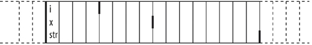

### 目录

[toc]

### 18.1 控制内存分配

### 18.2 运行时类型识别

### 18.3 枚举类型

#### 18.3.1 概念语法

概念：枚举类型（enumeration）使我们可以将一组整型常量组织在一起，定义为一种新的类型，属于字面值常量类型。

语法：C++ 包含两种枚举

* 限定作用域的枚举类型（scoped enumeration）

  ```c++
  enum class 枚举类型名 {枚举成员1, 枚举成员2, ...} [对象];
  enum struct 枚举类型名 {枚举成员1, 枚举成员2, ...} [对象];
  ```

  ```c++
  enum class open_modes {input, output, append}; // 限定作用域的枚举类型
  ```

* 不限定作用域的枚举类型（unscoped enumeration）

  ```c++
  enum [枚举类型名] {枚举成员1, 枚举成员2, ...} [对象];
  enum [枚举类型名] {枚举成员1, 枚举成员2, ...} [对象];
  ```

  ```c++
  enum color {red, yellow, green}; // 不限定作用域的枚举类型
  enum {floatPrec = 6, doublePrec = 10, double_doublePrec = 10}; // 未命名的、不限定作用域的枚举类型
  ```

#### 18.3.2 枚举成员详解

* 成员作用域
  * 限定作用域的枚举类型：遵循常规的作用域准则，在枚举类型的作用域外不可访问
  * 不限定作用域的枚举类型：与枚举类型本身的作用域相同

  ```c++
  enum color {red, yellow, green}; 			// 不限定作用域的枚举类型
  enum stoplight {red, yellow, green}; 		// 错误：重复定义了枚举成员
  enum class peppers {red, yellow, green};	// 正确：枚举成员被隐藏了
  
  color eyes = green;		// 正确：不限定作用域的枚举类型的枚举成员位于有效的作用域中
  pepper p = green;		// 错误：peppers 的枚举成员不在有效的作用域中
  						// color::green 在有效的作用域中，但是类型错误
  
  color hair = color::red;	// 正确：允许显示访问枚举成员
  peppers p2 = peppers::red;	// 正确：使用 peppers 的 red
  ```

* 成员取值

  * 默认情况下，枚举值从 0 开始，依次加 1
  * 如果有成员显示提供初始值，则当前枚举成员等于之前枚举成员的值加 1

  ```c++
  enum class intTypes {
      charTyp = 8, shortTyp = 16, intTyp = 16, longTyp = 32, long_longTyp = 64
  };
  ```

  【注1】枚举值不一定唯一。

  【注2】枚举成员本身是一条常量表达式，因而初始值必须是常量表达式。

* 成员使用

  * 在任何需要常量表达式的地方使用枚举成员

    ```c++
    constexpr intTypes charbits = intTypes::charTyp;
    ```

  * 将枚举类型作为 `switch` 的表达式，枚举值作为 `case` 标签

  * 将枚举类型作为非类型模板形参使用

  * 在类的定义中初始化枚举类型的静态数据成员

#### 18.3.3 枚举类型详解

* 转换 `enum` 类型

  * 初始化和赋值

    **必须**使用 `enum` 类型的另一个对象或它的一个枚举成员。

    ```c++
    open_modes om = 2;		// 错误：2 不属于类型 open_modes
    om = open_modes::input;	// 正确：input 是 open_modes 的一个枚举成员
    ```

  * 其他类型转换

    <u>不限定作用域的</u>枚举类型，其对象或枚举成员能**自动转换为整型**。

    ```c++
    int i = color::red;		// 正确：不限定作用域的枚举类型的枚举成员隐式转换成 int
    int j = peppers::red;	// 错误：限定作用域的枚举类型不会进行隐式转换
    ```

* 指定 `enum` 大小

  * 默认类型

    `enum` 是由某种整数类型表示的。

    限定作用域的 `enum` 成员默认类型是 `int`；

    不限定作用域的 `enum` 成员不存在默认类型，会自动指定一个**足够容纳**枚举值的潜在类型。

  * 指定类型

    可以在 `enum` 的名字后面加上冒号，指定想要使用的类型。

    ```c++
    enum intValues : unsigned long long {
        charTyp = 255,  shortTyp = 65535, intTyp = 65535,
        longTyp = 4294967295UL, long_longTyp = 18446744073709551615ULL
    };
    ```

* 前置声明

  * `enum` 的前置声明（无论隐式地还是显示地）必须指定成员大小

    ```c++
    enum intValues : unsigned long long;	// 不限定作用域的，必须指定成员类型
    enum class open_modes;					// 限定作用域的枚举类型可以使用默认成员类型 int
    ```

  * `enum` 的声明和定义必须匹配

    ```c++
    enum class intValues; 	// 错误：所有的声明和定义必须对该 enum 是限定作用域的还是不限定作用域的保持一致
    enum intVlaues;			// 错误：intValues 已经被声明为限定作用域的 enum
    enum intValues : long;	// 错误：intValues 已经被声明为 int
    ```

### 18.4 `union` 类型

#### 18.4.1 概念语法

**概念**

* 特殊性

  联合体（union）是一种特殊的类。

  * 一个 union 可以有多个数据成员，但任意时刻只有一个数据成员可以有值，为某个成员赋值后其他成员变成未定义的状态

  * 分配 union 的存储空间至少能容纳它的最大数据成员

* 通用性

  和类一样，一个 union 定义了一种新类型。

  * union 不能含有引用类型的成员，含有构造函数或析构函数的类类型可以作为 union 成员类型
  * union 可以为成员指定 `public`，`protected` 和 `private` 包含标记，默认情况是 `public` 的

* 对象性

  * union 可以定义包括构造函数和析构函数在内的成员函数
  * union 不能继承或作为基类，不能含有虚函数

* 内存分析

  * 联合体中所有成员都是从内存中同一个地址开始的

    

  * 结构体中每个成员使用内存中的不同位置

    

**定义**

union 提供一种有效的途径来获得一组类型不同的互斥值。

```c++
union [联合体类型名] { 成员声明列表 } [对象] ;
```

```c++
// Token 类型的对象只有一个成员，该成员的类型可能是下列类型中的任意一种
union Token {
    // 默认情况下成员是 public 的
    char val;
    int ival;
    double dval;
}
```

**初始化**

默认情况下 union 是未初始化的。

可以像聚合类一样用花括号显示初始化，提供一个初始值，被用于初始化**第一个**成员，也可以使用成员指示符指出要初始化的具体成员。

```c++
Token first_token = { 'a' };	// 初始化 cval 成员
Token last_token;				// 未初始化的 Token 对象
Token *pt = new Token;			// 指向一个未初始化的 Token 对象的指针

Token var1 = { 77 };			// 初始化 cval 成员
var2 = { .ival = 88 };			// 初始化 ival 成员
var3 = var1;					// 拷贝 union 对象 var1 到 var3

// 数组 myToken 中的元素如果没有指定初始化器，会被隐式地初始化为 0 值
myToken[100] = { {.dval= 0.5}, { 1 }, var2 };
```

**赋值**

union 是类，其对象可以使用通用的成员访问运算符访问。

```c++
last_token.cval = 'z';
pt->ival = 42;
```

【注】根据 union 的特殊性，为 union 的一个数据成员赋值会令其他数据成员变成未定义的状态。

#### 18.4.2 匿名 union

匿名 union 是没有联合体类型名和对象名的未命名 union.

```c++
union { 成员声明列表 };
```

性质：

* 移动定义一个匿名 union，编译器就会自动创建一个未命名的对象
* 在匿名 union 定义所在的作用域内，该 union 的成员都是可以直接访问的

【注】匿名 union 不能包含受保护的成员或私有成员，也不能定义成员函数。

#### 18.4.3 含有类类型成员

早期的 C++ 版本规定，union 中不能含有定义了构造函数或拷贝控制成员的类类型成员。C++ 11 取消了这一限制，但也使得含有类类型的 union 用法更为复杂。

##### 18.4.3.1 拷贝控制

**赋值操作**

只有内置类型成员的 union：

* 使用普通的赋值语句改变你 union 保存的值

含有类类型成员的 union：

* 将 union 的值改为类类型成员的值时，必须允许类类型的构造函数
* 将类类型的值改为其他值时，必须允许类类型的析构函数

**成员存在性**

如果该类类型定义了默认构造函数或拷贝控制成员，则编译器为 union 合成对应的版本并将其声明为删除的。

<u>例1：含有 string 的 union</u>

* string 类定义了五个拷贝控制成员以及一个默认构造函数
* 对于含有 string 的 union，联合体的五个拷贝控制成员和默认构造函数声明为删除的
* 如果某个类含有一个 union 成员，则该类与之对应的拷贝控制操作也将时删除的（`12.2.8 阻止拷贝/移动`）

例2：

```c++
#include <iostream>
using namespace std;

// 类类型
class base{
public:
	base(){cout << "base()" <<endl;}
	~base(){cout << "~base()" << endl;}
};

// union 类型 1
union tu1{
	base b;	// 包含类类型成员
};

// union 类型 2
union tu{
	base b;	// 包含类类型成员
	tu() ：b() { cout << "tu()" << endl;}
	~tu() {cout << "~tu()" << endl; b.~base();}

int main()
{
	tu1 t;	// 错误：由于 union tu1 的默认构造函数是删除的，故不能定义对象 t
    tu2 t;	// 正确：定义 union tu2 的默认构造函数和析构函数，并且显示析构
	return 0;
}
```

##### 18.4.3.2 封装管理指导

由于 union 构造或销毁类类型成员的操作比较复杂，因此通常将 union 封装到另一个类中进行管理和控制。

**技术思路**

假设为 union 添加一个 string 类类型成员：

* 将 union 定义成匿名的，作为 Token 类的成员，便于访问
* 在 Token 类中定一个 “判别式（discriminant）” 不限定作用域枚举成员，用于辨认 union 存储的值类型

**`Token` 类的定义**

```c++
class Token {
public:
    // 因为 union 含有一个 string 成员，所有 Token 必须定义拷贝控制成员，定义移动构造函数和移动赋值运算符暂略
    // 默认构造函数
    Token(): tok(INT), ival(0) { }
    // 拷贝构造函数
    Token(const Token &t): tok(t.tok) { copyUnion(t); }
    // 拷贝赋值运算符（外部实现）
    Token &operator=(const Token&);
    // 析构函数
    ~Token() { if (tok == STR) sval.~string(); } // 必须手动销毁 union 的类类型成员
    // 下面的赋值运算符负责设置 union 的不同成员
    Token &operator=(const std::string&);
    Token &operator=(char);
    Token &operator=(int);
    Token &operator=(double);
private:
    enum { INT, CHAR, DBL, STR } tok; // 判别式
    union { // 匿名 union
    	char	cval;
        int		ival;
        double	dval;
        string	sval;
    }; // 每个 Token 对象都含有一个该未命名 union 类型的未命名成员
    // 检查判别式，然后酌情拷贝 union 成员
    void copyUnion(const Token&);
}
```

**`string` 的管理**

```c++
// 赋值为其他类型
Token &Token::operator=(int i)
{
    if(tok == STR) sval.~string();	// 如果当前存储的是 string，专门释放它
    ival = i;						// 为成员赋值
    tok = INT;						// 更新判别式
    return *this;
}

// 赋值为 string 类型
Token &Token::operator=(const string &s)
{
    if(tok == STR)				// 如果当前存储的是 string，可以直接赋值
        sval = s;
    else
        new(&sval) string(s);	// 否则需要先构造一个 string
   	tok = STR;					// 更新判别式
    return *this;
}
```

**拷贝构造函数**

```c++
void Token::copyUnion(const Token&t)
{
    switch(t.tok)
    {
        case Token::INT: ival = t.ival; break;
        case Token::CHAR: cval = t.cval; break;
        case Token::DBL: ival = t.dval; break;
        case Token::STR: new(&sval) string(t.sval); break; // string 的拷贝可以使用定义 new 来构造
    }
}

Token &Token::operator=(const Token &t)
{
    // 如果此对象的值是 string 而 t 的值不是，则我们必须释放原理的 string
    if(tok == STR && t.tok != STR) sval.~string();
    if(tok == STR && t.tok == STR)
        sval = t.sval;	// 无须构造一个新 string
    else
        copyUnion(t);	// 如果 t.tok 是 STR，则需要构造一个 string
    tok = t.tok;
    return *this;
}
```

### 18.5 类成员指针

### 18.6 嵌套类

### 18.7 局部类

