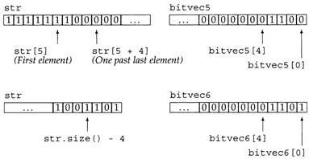

## 目录

[toc]

## 1 `bitset`

标准库提供了 `bitset`类用于处理二进制位的有序集。

### 1.1 头文件

```c++
#include <bitset>
using std::bitset;
```

### 1.2 定义和初始化

```c++
bitset<n> b;	          // b 有 n 位，每位都为 0
bitset<n> b(u);	          // b 是 unsigned long 型 u 的一个二进制副本
bitset<n> b(s);	          // b 是 string 对象 s 中含有的位串的二进制副本
bitset<n> b(s, pos, n);	  // b 是 s 中从位置 pos 开始的 n 个位的二进制副本

/*
    例 1：用 unsigned 值初始化 bitset 对象
    其中，0xffff 表示的二进制位为十六个 1（0xf 可表示为 1111）
*/
// bitvec1 is smaller than the initializer
bitset<16> bitvec1(0xffff);          // bits 0 ... 15 are set to 1
// bitvec2 same size as initializer
bitset<32> bitvec2(0xffff);          // bits 0 ... 15 are set to 1; 16 ... 31 are 0
// on a 32-bit machine, bits 0 to 31 initialized from 0xffff
bitset<128> bitvec3(0xffff);         // bits 32 through 127 initialized to zero

/*
	例 2：用 string 对象初始化 bitset 对象
	从 string 对象读入位集的顺序是从右向左的
*/
// 读取整个 string 对象
string strval("1100");
bitset<32> bitvec4(strval); 				// bitvec4 的位模式中第 2 和 3 的位置为 1，其余位置都为 0，即 `0011...00`
// 读取部分 string 对象
string str("1111111000000011001101");
bitset<32> bitvec5(str, 5, 4); 				// 4 bits starting at str[5], 1100，结果见下图，其中 bitvec5 已反向显示
bitset<32> bitvec6(str, str.size() - 4);  	// use last 4 characters, 1101，结果见下图，其中 bitvec6 已反向显示
```



类似于 `vector`，`bitset` 类是一种类模板；而与 `vector` 不一样的是，在定义 `bitset` 时，要明确 `bitset` 含有多少位，在尖括号内给出它的长度值（常量表达式）。

### 1.3 操作

* `b.any()`：`b` 中是否存在置为 `1` 的二进制位

* `b.none()`：`b` 中不存在置为 `1` 的二进制位

* `b.count()`：`b` 中置为 `1` 的二进制个数

* `b.size()`：`b` 中二进制位的个数

* `b[pos]`：访问 `b` 中在 `pos` 处的二进制位

* `b.test(pos)`：b中在 `pos` 处的二进制位是否为 `1`

* `b.set()`：把 `b` 中二进制位都置 `1`
* `b.set(pos)`：把 `b` 在 `pos` 处的二进制位置 `1`

* `b.reset()`：把 `b` 中二进制位都置 `0`
* `b.reset(pos)`：把 `b` 在`pos` 处的二进制位置 `1`

* `b.flip()`：把 `b` 中位数都取反
* `b.flip(pos)`：把 `b` 中 `pos` 处的二进制位取反

* `b.to_ulong()`：把 `b` 中同样的二进制位返回一个 `unsigned_long` 值
* `os << b`：把 `b` 中的位集输出到 `os` 流

