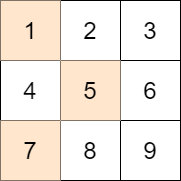

## 11目录

[toc]

指导思想：

* 复习的目的——理解算法：靠自己的思路写出来，查出没有理解的地方。

## 1 分解

### 1.1 分治策略

**思想：**分解$\downarrow$ $\rightarrow$ 解决$\uparrow$ $\rightarrow$​ 合并，代价亏损

#### >> 二分思想

#### 1.1.1 搜索旋转排序数组

> 整数数组 `nums` 按升序排列，数组中的值 **互不相同** 。
>
> 在传递给函数之前，`nums `在预先未知的某个下标 `k`（`0 <= k < nums.length`）上进行了 **旋转**，使数组变为 `[nums[k], nums[k+1], ..., nums[n-1], nums[0], nums[1], ..., nums[k-1]]`（下标 **从 `0` 开始** 计数）。例如， `[0,1,2,4,5,6,7]` 在下标 `3` 处经旋转后可能变为 `[4,5,6,7,0,1,2]` 。
>
> 给你 **旋转后** 的数组 `nums` 和一个整数 `target` ，如果 `nums` 中存在这个目标值 `target` ，则返回它的下标，否则返回 `-1` 。
>
> **示例 1：**
>
> ```
> 输入：nums = [4,5,6,7,0,1,2], target = 0
> 输出：4
> ```
>
> **示例 2：**
>
> ```
> 输入：nums = [4,5,6,7,0,1,2], target = 3
> 输出：-1
> ```
>
> **示例 3：**
>
> ```
> 输入：nums = [1], target = 0
> 输出：-1
> ```
>
> **提示：**
>
> * `1 <= nums.length <= 5000`
> * `-10^4 <= nums[i] <= 10^4`
> * `nums` 中的每个值都 **独一无二**
> * 题目数据保证 `nums` 在预先未知的某个下标上进行了旋转
> * `-10^4 <= target <= 10^4`
>
> **来源：**[33. 搜索旋转排序数组](https://leetcode-cn.com/problems/search-in-rotated-sorted-array/)
>
> **记录：**
>
> - [x] 0722
> - [x] 0725
> - [x] 0730
> - [x] 0815
> - [x] 0914

抓住二分思想的起源：每次筛掉一些。

于是，考虑基本问题 `[nums[low], ..., nums[high]]`，比较 `nums[mid]` 和 `target`：

* 如果 `nums[mid] == target`，则返回 `mid`

* 如果 `nums[mid] < target`
  * 如果 `nums[low] < nums[mid]`，则达成普通二分的情形，有 `low = mid + 1`
  * 否则 `nums[low] >= nums[mid]` 的情形较为复杂，能排除一个就好
    * 如果 `nums[low] == target`，则返回 `low`
    * 如果 `nums[low] != target`，则 `low = low + 1`
* 如果 `target < nums[mid]`
  * 如果 `nums[mid] < nums[high]`，则达成普通二分的情形，有 `high = mid - 1`
  * 否则 `nums[mid] >= nums[high]` 的情形较为复杂，能排除一个就好
    * 如果 `nums[high] == target`，则返回 `high`
    * 如果 `nums[high] != target`，则 `high = high - 1`

```c++
class Solution {
public:
    int search(vector<int>& nums, int target) {
        int low = 0, high = nums.size()-1, mid;
        while(low<=high)
        {
            mid = (low+high)/2;
            if(nums[mid]==target)
                return mid;
            else if(nums[mid]<target)
                if(nums[low]<nums[mid])
                    low = mid + 1;
                else if(nums[low]==target)
                    return low;
                else 
                    low += 1;
            else
                if(nums[mid]<nums[high])
                    high = mid - 1;
                else if(nums[high]==target)
                    return high;
                else
                    high -= 1;
        }
        return -1;
    }
};
```

还有更好的方法，仔细观察数组可以发现：

* 任选两点，顺序连续，逆序断点

* 从中间分开成左右两个部分，必然有一个部分是有序的

因此根据有序的那个部分，确定目标元素是否在其中，从而确定如何改变二分查找的上下界。

```c++
class Solution {
public:
    int search(vector<int>& nums, int target) {
        int low = 0, high = nums.size()-1;
        while(low<=high)
        {
            int mid = (low+high)/2;
            if(nums[mid]==target)
                return mid;
            if(nums[low]<=nums[mid])  								// 【注1】左中位数特性，两个元素时 low==mid，low!=high
                if(nums[low]<=target && target<nums[mid])			//  mid 是左中位数，因此单元素时优先认为左部分有序
                    high = mid - 1;
                else
                    low = mid + 1;
            else
                if(nums[mid]<target && target<=nums[high])
                    low = mid + 1;
                else
                    high = mid - 1;
        }
        return -1;
    }
};
```

#### >> 矩阵快速幂

**应用场景：**幂的计算就可以用快速幂

**算法模式：**

```c++
int pow(int x, int n)
{
    int res = 1;			// 对 n 奇偶性的初值处理可在此进行
    while(n)
    {
        if(n&1)				// 【关键】奇数情形先拿出一个乘了，再处理幂累乘
            res = res * x;  // 支持取余
        x = x * x;			// 支持取余
        n >>= 1;
    }
    return res;				// 支持取余
}
```

参考原理：[快速幂算法（全网最详细地带你从零开始一步一步优化）](https://blog.csdn.net/qq_19782019/article/details/85621386)

#### 1.1.2 统计好数字的数目

> 我们称一个数字字符串是 **好数字** 当它满足（下标从 `0` 开始）**偶数** 下标处的数字为 **偶数** 且 **奇数** 下标处的数字为 **质数** （2，3，5 或 7）。
>
> 比方说，`"2582"` 是好数字，因为偶数下标处的数字（`2` 和 `8`）是偶数且奇数下标处的数字（`5` 和 `2`）为质数。但 `"3245"` 不是 好数字，因为 `3` 在偶数下标处但不是偶数。
>
> 给你一个整数 `n` ，请你返回长度为 `n` 且为好数字的数字字符串 **总数** 。由于答案可能会很大，请你将它对 `1e9 + 7` 取余后返回 。
>
> 一个 **数字字符串** 是每一位都由 `0` 到 `9` 组成的字符串，且可能包含前导 `0` 。
>
> **示例 1：**
>
> ```
> 输入：n = 1
> 输出：5
> 解释：长度为 1 的好数字包括 "0"，"2"，"4"，"6"，"8" 。
> ```
>
> **示例 2：**
>
> ```
> 输入：n = 4
> 输出：400
> ```
>
> **示例 3：**
>
> ```
> 输入：n = 50
> 输出：564908303
> ```
>
> **提示：**
>
> - `1 <= n <= 1e15`
>
> **来源：**[1922. 统计好数字的数目](https://leetcode-cn.com/problems/count-good-numbers/)
>
> **记录：**
>
> - [x] 0705
> - [x] 0708
> - [x] 0715
> - [x] 0801
> - [x] 0831

由题意，

* 偶数下标处的选择有：$0,2,4,6,8$

* 奇数下标处的选择有：$2,3,5,6$

于是根据排列组合知识，结果的计算公式为：
$$
\begin{align}
\text{result} & = 5^{\frac{n}{2}} \times 4^{\frac{n}{2}} \times 5^{\mathrm{1}\{ n是奇数 \}} \\
 & = (5\times4)^{\frac{n}{2}} \times 5^{\mathrm{1}\{ n是奇数 \}} \\
 & = 20^{\frac{n}{2}} \times 5^{\mathrm{1}\{ n是奇数 \}}
\end{align}
$$
这里的关键是如何防止求大整数幂时的溢出问题，经典的解决办法是**快速幂**。

```c++
class Solution {
public:
    int countGoodNumbers(long long n) {
        long long res = 1, base = 1e9 + 7, x = 20;
        if(n&1) res = 5;
        n >>= 2;
        while(n)
        {
            if(n&1)
                res = res * x % base;
            x = x * x % base;
            n >>= 1;
        }
        return res % base;
    }
};
```

#### ==供暖器==

[475. 供暖器](https://leetcode-cn.com/problems/heaters/)

### 1.2 动态规划

**思想：**分解$\downarrow$​​ $\longrightarrow$​​ 最优$\uparrow$​​ $\longrightarrow$​​ 重叠，无后效性分

【悟1】分解：做出一个选择，得到一个状态，取决一个子问题

【悟2】状态一般有哪些：过程状态，选择状态

**应用场景：**

* 对序列进行单点型操作，用单向分解，首或尾进行<u>选择</u>（$\rightarrow$ 循环），产生一个<u>状态</u>（$\rightarrow$ 维度），有 `dp[i]`，`i` 表示首或尾端点
* 对序列进行区间型操作，用双向分解，首和尾进行<u>选择</u>（$\rightarrow$ 循环），产生两个<u>状态</u>（$\rightarrow$ 维度），有 `dp[i][j]`，`i` 和 `j` 分别表示左、右端点

【注1】若有其他维度可在添加，例如是<u>双串或多串</u>，增加维度相应的维度即可。

【注2】若区间型操作两个端点之间<u>存在联系</u>，则可压缩空间。

【注3】若 `i` 步的 `j` 状态只与当前或上一的状态 `<=j` 有关，则可以逆序压缩空间和时间（去维度压缩空间，位运算压缩时空）。

**算法模式：**

* 自顶向下算法

  1. 两个函数，一个启动，一个递归
  2. 递归，先检测表格，再比较选择
  3. 选择中递归子问题

  ```c++
  #include <vector>
  #include <string>
  
  // 递归函数
  int LCSTopDownAction(string &x, string &y, int i, int j, vector<vector<int>> &table)
  {
      // 表格检测
      if(table[i][j]!=-1)
          return table[i][j];
      
      // 选择子问题
      if(x[i-1]==y[j-1])
          return LCSTopDownAction(x,y,i-1,j-1,table)+1;
      else
          return max(LCSTopDownAction(x,y,i,j-1,table),LCSTopDownAction(x,y,i-1,j,table));
      
  }
  
  // 启动函数
  int LCSTopDown(string &x, string &y)
  {
      int m = x.size(), n = y.size();
      vector<vector<int>> table(m+1, vector<int>(n+1,-1));
      for(int i=0; i<m+1; ++i)
          table[i][0] = 0;
      for(int j=0; j<n+1; ++j)
          table[0][j] = 0;
      
      return LCSTopDownAction(x, y, m, n, table);
  }
  ```

* 自底向上算法

  1. 一个函数，表格循环

  ```c++
  int LCSBottomUp(string &x, string &y)
  {
      int m = x.size(), n = y.size();
      vector<vector<int>> table(m+1, vector<int>(n+1,-1));
      for(int i=0; i<m+1; ++i)
          table[i][0] = 0;
      for(int j=0; j<n+1; ++j)
          table[0][j] = 0;
  
      for(int i=1; i<=m; ++i)
          for(int j=1; j<=n; ++j)
              if(x[i-1]==y[j-1])
                  table[i][j] = table[i-1][j-1] + 1;
              else
                  table[i][j] = max(table[i-1][j], table[i][j-1]);
      return table[m][n];
  }
  ```

#### 1.2.1 最长有效括号

> 给你一个只包含 `'('` 和 `')'` 的字符串，找出最长有效（格式正确且连续）括号子串的长度。
>
> **示例 1：**
>
> ```
> 输入：s = "(()"
> 输出：2
> 解释：最长有效括号子串是 "()"
> ```
>
> **示例 2：**
>
> ```
> 输入：s = ")()())"
> 输出：4
> 解释：最长有效括号子串是 "()()"
> ```
>
> **示例 3：**
>
> ```
> 输入：s = ""
> 输出：0
> ```
>
> **提示：**
>
> * `0 <= s.length <= 3 * 104`
> * `s[i]` 为 `'('` 或 `')'`
>
> **来源：**[32. 最长有效括号](https://leetcode-cn.com/problems/longest-valid-parentheses/)
>
> **记录：**
>
> - [x] 0518
> - [x] 0521
> - [x] 0526
> - [x] 0602
> - [x] 0616
> - [x] 0714
> - [x] 0814
> - [x] 0913

这是单串问题，先尝试考虑线性空间复杂度的单向分解。

对每一个尾元素进行选择，然后取最大值。对每一个尾元素：

* 如果尾元素为 `(`，则结果为 `0`
* 如果尾元素为 `)`，还需要判断上一个元素
  * 如果为 `(`，即 `...()`，则结果为 `2+dp[n-2]`
  * 如果为 `)`，即 `...))`，则还需要判断这个 `dp[n-1]` 子问题前的那个括号
    * 如果为 `(`，即 `( (...) )`，则结果为 `2+dp[n-1]+dp[n-dp[n-1]-2]`
    * 如果为 `)`，即 `) (...) )`，则结果为 `0`

```c++
class Solution {
public:
    int longestValidParentheses(string s) {
        int res = 0, n = s.size();
        vector<int> dp(n, 0);
        for (int i = 1; i < n; ++i)
        {
            if (s[i] == ')')
            {
                if (s[i - 1] == '(')
                    dp[i] = 2 + (i > 1 ? dp[i - 2] : 0);
                else if (i > dp[i - 1] && s[i - dp[i - 1] - 1] == '(')
                    dp[i] = 2 + dp[i - 1] + (i-dp[i-1]>1 ? dp[i - dp[i - 1] - 2] : 0);  // 【2】条件写错
            }
            res = max(res, dp[i]);  // 【1】问题解错
        }
        return res;
    }
};
```

【注】平衡判断算法

本题是括号 “平衡判断问题” 的一个衍生问题（但这个衍生问题的解法与原问题关联不大就是了），作为总结，这里介绍这个基础问题的求解思路。

判断一串括号是否平衡/有效，只需要直接比较左括号与右括号的数量是否能够抵消（要提早终止左小于右），无需用上面的方法。

```c++
bool isValid(string &node)
{
    int balance = 0;
    for(const auto &c: node)
    {
        if(c=='(')
            ++balance;
        else
            --balance;
        if(balance<0)
            return false;
    }
    return !balance;
}
```

#### 1.2.2 接雨水

> 给定 *n* 个非负整数表示每个宽度为 1 的柱子的高度图，计算按此排列的柱子，下雨之后能接多少雨水。
>
> **示例 1：**
>
> 
>
> ```
> 输入：height = [0,1,0,2,1,0,1,3,2,1,2,1]
> 输出：6
> 解释：上面是由数组 [0,1,0,2,1,0,1,3,2,1,2,1] 表示的高度图，在这种情况下，可以接 6 个单位的雨水（蓝色部分表示雨水）。 
> ```
>
> **示例 2：**
>
> ```
> 输入：height = [4,2,0,3,2,5]
> 输出：9
> ```
>
> **提示：**
>
> - `n == height.length`
> - `0 <= n <= 3 * 104`
> - `0 <= height[i] <= 105`
>
> **来源：**https://leetcode-cn.com/problems/trapping-rain-water/
>
> **记录：**
>
> - [x] 0519
> - [x] 0522
> - [x] 0527

计算每个格子能够容纳的水量，然后求和。

“每个格子能够容纳的水量 = $\min($ 左边最大柱高, 右边最大柱高 $)$ $-$ 本格高”，其中左、右两边的最大柱高可以很容易地用动态规划求解。

```c++
class Solution {
public:
    int trap(vector<int>& height) {
        int n = height.size(), res = 0;
        if(!n) return 0;  // 注意空输入判断
        
        vector<int> left(n,0), right(n,0);
        for(int i=1; i<n; ++i)
            left[i] = max(left[i-1], height[i-1]);
        for(int i=n-2; i>=0; --i)
            right[i] = max(right[i+1], height[i+1]);
        for(int i=0; i<n; ++i)
        {
            int water = min(left[i], right[i]) - height[i];
            res += water > 0 ? water : 0;
        }
        
        return res;
    }
};
```

#### 1.2.3 通配符匹配

> 给定一个字符串 (`s`) 和一个字符模式 (`p`) ，实现一个支持 `'?'` 和 `'*'` 的通配符匹配。
>
> ```
> '?' 可以匹配任何单个字符。
> '*' 可以匹配任意字符串（包括空字符串）。
> ```
>
> 两个字符串**完全匹配**才算匹配成功。
>
> **说明:**
>
> * `s` 可能为空，且只包含从 `a-z` 的小写字母。
> * `p` 可能为空，且只包含从 `a-z` 的小写字母，以及字符 `?` 和 `*`。
>
> **示例 1:**
>
> ```
> 输入:
> s = "aa"
> p = "a"
> 输出: false
> 解释: "a" 无法匹配 "aa" 整个字符串。
> ```
>
> **示例 2:**
>
> ```
> 输入:
> s = "aa"
> p = "*"
> 输出: true
> 解释: '*' 可以匹配任意字符串。
> ```
>
> **示例 3:**
>
> ```
> 输入:
> s = "cb"
> p = "?a"
> 输出: false
> 解释: '?' 可以匹配 'c', 但第二个 'a' 无法匹配 'b'。
> ```
>
> **示例 4:**
>
> ```
> 输入:
> s = "adceb"
> p = "*a*b"
> 输出: true
> 解释: 第一个 '*' 可以匹配空字符串, 第二个 '*' 可以匹配字符串 "dce".
> ```
>
> **示例 5:**
>
> ```
> 输入:
> s = "acdcb"
> p = "a*c?b"
> 输出: false
> ```
>
> **来源：**[44. 通配符匹配](https://leetcode-cn.com/problems/wildcard-matching/)
>
> **记录：**
>
> - [x] 0520
> - [x] 0523
> - [x] 0528
> - [x] 0805
> - [x] 0812【注2】
> - [x] 0827【注3】

这是双串问题，先尝试考虑平方空间复杂度的单向分解。

同时对 `s` 和 `p` 的首元素 `i` 和 `j` 进行选择：

* 如果 `p[j]` 为 `[a-z]`，则结果为 $dp[i][j]=(s[i]==p[j]) \wedge dp[i+1][j+1]$
* 如果 `p[j]` 为 `?`，则结果为 $dp[i][j]=dp[i+1][j+1]$
* 如果 `p[j]` 为 `*`，则区分 `*` 是否匹配一次，结果为 $dp[i][j] = dp[i+1][j] \vee dp[i][j+1]$

最后再考虑边界条件：

* 两个序列皆为空（`i=ns`，`j=np`）：$dp[i][j]=true$
* 字符串为空，字符模式不为空（`i!=ns`，`j=np`）：$dp[i][j]=false$
* 字符串不为空，字符模式为空（`i=ns`，`j!=np`）：
  * 如果 `p[j]='*'`，$dp[i][j] = true$
  * 如果出现 `p[j]!='*'`，此位置及之后的元素为 $false$

```c++
class Solution {
public:
    bool isMatch(string s, string p) {
        int ns = s.size(), np = p.size();
        vector<vector<bool>> dp(ns+1, vector<bool>(np+1, false));  // 【注2】m+1, n+1 造成 "串：源-1" 和 "下标：<="
        dp[ns][np] = true;
        for(int j=np-1; j>=0; --j)	// 【注3】i 对应 m，j 对应 n
            if(p[j]=='*')
                dp[ns][j] = true;
            else
                break;
        for(int i=ns-1; i>=0; --i)
            for(int j=np-1; j>=0; --j)
                if(p[j]=='?')
                    dp[i][j] = dp[i+1][j+1];
                else if(p[j]=='*')
                    dp[i][j] = dp[i+1][j] | dp[i][j+1];  // 【注1】* 匹配 p[j] 要保留，* 不匹配 s[i] 要保留
                else
                    dp[i][j] = (p[j]==s[i]) & dp[i+1][j+1];
        return dp[0][0];
    }
};
```

#### 1.2.4 最大矩形

> 给定一个仅包含 `0` 和 `1` 、大小为 `rows x cols` 的二维二进制矩阵，找出只包含 `1` 的最大矩形，并返回其面积。
>
> 
>
> 示例 1：
>
> ```
> 输入：matrix = [["1","0","1","0","0"],["1","0","1","1","1"],["1","1","1","1","1"],["1","0","0","1","0"]]
> 输出：6
> 解释：最大矩形如上图所示。
> ```
>
>
> 示例 2：
>
> ```
> 输入：matrix = []
> 输出：0
> ```
>
> 示例 3：
>
> ```
> 输入：matrix = [["0"]]
> 输出：0
> ```
>
> 示例 4：
>
> ```
> 输入：matrix = [["1"]]
> 输出：1
> ```
>
> 示例 5：
>
> ```
> 输入：matrix = [["0","0"]]
> 输出：0
> ```
>
> **提示：**
>
> * `rows == matrix.length`
> * `cols == matrix[0].length`
> * `0 <= row, cols <= 200`
> * `matrix[i][j] 为 '0' 或 '1'`
>
> **来源：**[85. 最大矩形](https://leetcode-cn.com/problems/maximal-rectangle/)
>
> **记录：**
>
> - [x] 0529
> - [x] 0601
> - [x] 0606（进阶）
> - [x] 0904（复习）
> - [x] 0919（单调栈法的那个注意）

为了寻找最大矩形，必须**以点为基本单位去判断各个矩形集合**，这个点可取为，所有矩形中，以该点作为右下角的集合——$R_{i,j}=\{x : 矩形 x 以 (i,j) 为右下角\}$，因而最优解就是 $\max\{{\max_{i,j}\{{R_{i,j}}\}}\}$。

这里的关键就转为如何在遍历矩阵元素时，高效地计算 $\max_{i,j}\{{R_{i,j}}\}$，这里的方法是：

将 $(0,0)\rightarrow(i,j)$ 的矩形区域看成向左生长的柱状图，能够生成的矩形一定在这个柱状图中，然后通过递减 $i$ 来判断 $R_{i,j}$ 中的最大值，而柱状图的生成可以通过动态规划高效地实现。

```c++
class Solution {
public:
    int maximalRectangle(vector<vector<char>>& matrix) {
        if(!matrix.size()) return 0;
        int m = matrix.size(), n = matrix[0].size();
        vector<vector<int>> dp(m, vector<int>(n,0));
        for(int i=0; i<m; ++i)
            dp[i][0] = matrix[i][0] - '0';
        for(int i=0; i<m; ++i)
            for(int j=1; j<n; ++j)
                if(matrix[i][j]=='1')
                    dp[i][j] = 1 + dp[i][j-1];

        int res = 0, area = 0, minL =  0;
        for(int i=0; i<m; ++i)
            for(int j=0; j<n; ++j)
            {
                minL = dp[i][j];
                for(int k=i; k>=0; --k)
                {
                    minL = min(minL, dp[k][j]);
                    area = minL * (i-k+1);
                    res = max(res, area);
                }
            }
        return res;
    }
};
```

【技】在计算 $\max_{i,j}\{{R_{i,j}}\}$ 时，可以考虑用单调栈，详见 3.1 节。

```c++
class Solution {
public:
    int maximalRectangle(vector<vector<char>>& matrix) {
        if(!matrix.size()) return 0;
        int m = matrix.size(), n = matrix[0].size();

        for(int i=0; i<m; ++i)
            matrix[i][0] -= '0';
        for(int j=1; j<n; ++j)
            for(int i=0; i<m; ++i)
                if(matrix[i][j]=='1')
                    matrix[i][j] = matrix[i][j-1] + 1;
                else
                    matrix[i][j] = 0;
        /*
        for(const auto &vec: matrix)
        {
            for(const auto &v: vec)
                cout << v-0 << " ";
            cout << endl;
        }
        */

        int res = 0;
        stack<int> stk;
        for(int j=0; j<n; ++j)
        {
            for(int i=0; i<m; ++i)
            {
                while(!stk.empty() && matrix[stk.top()][j]>matrix[i][j])
                {
                    int height = matrix[stk.top()][j];
                    stk.pop();
                    int width = stk.empty() ? i : i - stk.top() - 1;
                    // cout << "h = " << height << ", w = " << width << endl;
                    res = max(res, height*width);
                }
                stk.push(i);
            }
            while(!stk.empty())
            {
                int height = matrix[stk.top()][j];
                stk.pop();
                int width = stk.empty() ? m : m - stk.top() - 1;
                // cout << "h = " << height << ", w = " << width << endl;
                res = max(res, height*width);
            }
            // cout << endl;
        }
        return res;
    }
};
```

#### 1.2.5 扰乱字符串

>使用下面描述的算法可以扰乱字符串 `s` 得到字符串 `t` ：
>
>1. 如果字符串的长度为 1 ，算法停止
>2. 如果字符串的长度 > 1 ，执行下述步骤：
>* 在一个随机下标处将字符串分割成两个非空的子字符串。即，如果已知字符串 s ，则可以将其分成两个子字符串 `x` 和 `y` ，且满足 `s = x + y `。
>* 随机决定是要「交换两个子字符串」还是要「保持这两个子字符串的顺序不变」。即，在执行这一步骤之后，`s` 可能是 `s = x + y` 或者 `s = y + x` 。
>* 在 `x` 和 `y` 这两个子字符串上继续从步骤 1 开始递归执行此算法。
>
>给你两个 **长度相等** 的字符串 `s1` 和 `s2`，判断 `s2` 是否是 `s1` 的扰乱字符串。如果是，返回 `true` ；否则，返回 `false` 。
>
>**示例 1：**
>
>```
>输入：s1 = "great", s2 = "rgeat"
>输出：true
>解释：s1 上可能发生的一种情形是：
>"great" --> "gr/eat" // 在一个随机下标处分割得到两个子字符串
>"gr/eat" --> "gr/eat" // 随机决定：「保持这两个子字符串的顺序不变」
>"gr/eat" --> "g/r / e/at" // 在子字符串上递归执行此算法。两个子字符串分别在随机下标处进行一轮分割
>"g/r / e/at" --> "r/g / e/at" // 随机决定：第一组「交换两个子字符串」，第二组「保持这两个子字符串的顺序不变」
>"r/g / e/at" --> "r/g / e/ a/t" // 继续递归执行此算法，将 "at" 分割得到 "a/t"
>"r/g / e/ a/t" --> "r/g / e/ a/t" // 随机决定：「保持这两个子字符串的顺序不变」
>算法终止，结果字符串和 s2 相同，都是 "rgeat"
>这是一种能够扰乱 s1 得到 s2 的情形，可以认为 s2 是 s1 的扰乱字符串，返回 true
>```
>
>**示例 2：**
>
>```
>输入：s1 = "abcde", s2 = "caebd"
>输出：false
>```
>
>**示例 3：**
>
>```
>输入：s1 = "a", s2 = "a"
>输出：true
>```
>
>**提示：**
>
>* `s1.length == s2.length`
>* `1 <= s1.length <= 30`
>* `s1 和 s2 由小写英文字母组成`
>
>**来源：**[87. 扰乱字符串](https://leetcode-cn.com/problems/scramble-string/)
>
>**记录：**
>
>- [x] 0605
>- [x] 0608
>- [x] 0613
>- [x] 0620
>- [x] 0704
>- [x] 0801
>- [x] 0901
>- [x] 0916

这是双串问题，并且“扰乱”概念是区间型操作，有 `dp[i][j][p][q]`；又长度相等的两个字符串才有扰乱的概念，因此有 `dp[i][j][len]`，故对长度进行分解。

**分解：**

对于序列 `S` 和 `T`，分别做出一个选择，决定分割点和是否交换，得到长度较小的两个子串。

于是状态定义为：$dp[i][j][len]$。

**最优：**假设子串“扰乱”匹配已解决

* 如果 `S1` , `S2` 和 `T1` , `T2` 长度无法一样，则必然不匹配
* 如果 `S1` 和 `T1` 长度可以一样，则两个子串符合“扰乱”概念可推出当前串也符合”扰乱“概念
  * 未交换：$dp[i][j][len]=dp[i][j][len1] \wedge dp[i+len1][j+len1][len2]$
  * 已交换：$dp[i][j][len]=dp[i][j+len2][len1] \wedge dp[i+len1][j][len2]$

**重叠：**

每个子问题（ 长度）均有重叠的可能，且显然无后效性，动态规划成立。

```c++
class Solution {
public:
    bool isScramble(string s1, string s2) {
        int m = s1.size(), n = s2.size();
        if(m!=n) return false;
        vector<vector<vector<bool>>> dp(n, vector<vector<bool>>(n, vector<bool>(n+1, false)));  // 【1】长度取到 m，故声明 m+1 个
        // 初始化单个字符的情况
        for(int i=0; i<n; ++i)
            for(int j=0; j<n; ++j)
                dp[i][j][1] = (s1[i]==s2[j]);
        // 枚举区间长度 2～n
        for(int len = 2; len <= n; ++len)
            // 枚举 S 中的起点位置
            for(int i = 0; i <= n - len; ++i)  // 【3】位置受限于长度
                // 枚举 T 中的起点位置
                for(int j = 0; j<=n - len; ++j)  // 【5】注意 ++i, ++j 等的符号要写对
                    // 枚举划分位置 
                    for(int k = 1; k <= len - 1; ++k)  // 【2】k 是对 len 的划分
                    {
                        // 第一种情况：S1 -> T1, S2 -> T2
                        if(dp[i][j][k]&&dp[i+k][j+k][len-k])
                        {
                            dp[i][j][len] = true;
                            break;
                        }
                        // 第二种情况：S1 -> T2, S2 -> T1
                        if(dp[i][j+len-k][k]&&dp[i+k][j][len-k])
                        {
                            dp[i][j][len] = true;
                            break;
                        }
                        
                        // 【4】
                        // 对！
                        // dp[i][j][k] |= (dp[i][j][h] && dp[i+h][j+h][k-h]) ||  (dp[i][j+k-h][h] && dp[i+h][j][k-h]);
                        // 错！对 k 遍历的时候，后面的 k 有可能会冲掉前面已经为 true 的 k
                        // dp[i][j][k]  = (dp[i][j][h] && dp[i+h][j+h][k-h]) ||  (dp[i][j+k-h][h] && dp[i+h][j][k-h]);
                    }
        return dp[0][0][n];
    }
};
```

#### 1.2.6 不同的二叉搜索树 I II

> 给你一个整数 `n` ，求恰由 `n` 个节点组成且节点值从 `1` 到 `n` 互不相同的 **二叉搜索树** 有多少种？返回满足题意的二叉搜索树的种数。
>
> **示例 1：**
>
> 
>
> ```
> 输入：n = 3
> 输出：5
> ```
>
> **示例 2：**
>
> ```
> 输入：n = 1
> 输出：1
> ```
>
> **提示：**
>
> - `1 <= n <= 19`
>
> **来源：**[96. 不同的二叉搜索树](https://leetcode-cn.com/problems/unique-binary-search-trees/) - 解个数
>
> **进阶：**[95. 不同的二叉搜索树 II](https://leetcode-cn.com/problems/unique-binary-search-trees-ii/) - 构造解
>
> **记录：**
>
> - [x] 0613（进阶回溯）
> - [x] 0616（初始化注意）
> - [x] 0621
> - [x] 0830

Catalan 数两种理解：右下网格，异二叉树

| 模型 | 事件1     | 事件2      |
| ---- | --------- | ---------- |
| (1)  | 入栈      | 出栈       |
| (2)  | 用5元支付 | 用10元支付 |
| (3)  | 向下走    | 向右走     |
| (4)  | 左括号    | 右括号     |
| (5)  | 0         | 1          |

注：**同列**事件可视为**等价**，且在题目要求中**事件1**的**次数/大小**需要**始终大于事件2**。

解析公式：
$$
G(n) = \sum_{i=1}^n G(i−1) \cdot G(n−i)
$$
递推公式：
$$
c_0=1, \space c_{n+1}=\frac{4n+2}{n+2}c_n
$$
通项公式：
$$
c_n = \frac{1}{n+1} C_{2n}^{n}
$$

```c++
class Solution {
public:
    int numTrees(int n) {
        long long C = 1;
        for (int i = 0; i < n; ++i) {
            C = C * 2 * (2 * i + 1) / (i + 2);  // 【注】*= 先算右边再算左边，会由于整数的地板除而出错
        }
        return (int)C;
    }
};
```

对于第二个进阶问题，它要求构造出相应的解出来，这时候**动态规划不再适用！**

因为需要得到具体的解，这些内容**无法重叠**，因而只能使用最基本的分治法。

```c++
/**
 * Definition for a binary tree node.
 * struct TreeNode {
 *     int val;
 *     TreeNode *left;
 *     TreeNode *right;
 *     TreeNode() : val(0), left(nullptr), right(nullptr) {}
 *     TreeNode(int x) : val(x), left(nullptr), right(nullptr) {}
 *     TreeNode(int x, TreeNode *left, TreeNode *right) : val(x), left(left), right(right) {}
 * };
 */
class Solution {
public:
    vector<TreeNode*> generateTrees(int n) {
       vector<TreeNode*> res = generateTrees(1,n);
       return res;
    }

    vector<TreeNode*> generateTrees(int m, int n)
    {
        if(m>n) return {nullptr};
        vector<TreeNode*> res;
        for(int i=m; i<=n; ++i)
        {
            vector<TreeNode*> left = generateTrees(m, i-1);
            vector<TreeNode*> right = generateTrees(i+1, n);
            for(auto &lt: left)
                for(auto &rt: right)
                    {
                        TreeNode *mid = new TreeNode(i);  // 【注】每个结点存储的是 “指针”
                        mid->left = lt;
                        mid->right = rt;
                        res.push_back(mid);
                    }
        }
        return res;
    }
};
```

#### 1.2.7 交错字符串

> 给定三个字符串 `s1`、`s2`、`s3`，请你帮忙验证 `s3` 是否是由 `s1` 和 `s2` 交错 组成的。
>
> 两个字符串 `s` 和 `t` 交错 的定义与过程如下，其中每个字符串都会被分割成若干 **非空** 子字符串：
>
> * `s = s1 + s2 + ... + sn`
> * `t = t1 + t2 + ... + tm`
> * `|n - m| <= 1`
>
> * **交错** 是 `s1 + t1 + s2 + t2 + s3 + t3 + ...` 或者 `t1 + s1 + t2 + s2 + t3 + s3 + ...`
>
> **提示：**`a + b` 意味着字符串 `a` 和 `b` 连接。
>
> **示例 1：**
>
> 
>
> ```
> 输入：s1 = "aabcc", s2 = "dbbca", s3 = "aadbbcbcac"
> 输出：true
> ```
>
> **示例 2：**
>
> ```
> 输入：s1 = "aabcc", s2 = "dbbca", s3 = "aadbbbaccc"
> 输出：false
> ```
>
> **示例 3：**
>
> ```
> 输入：s1 = "", s2 = "", s3 = ""
> 输出：true
> ```
>
> **提示：**
>
> * `0 <= s1.length, s2.length <= 100`
> * `0 <= s3.length <= 200`
> * `s1`、`s2`、和 `s3` 都由小写英文字母组成
>
> **来源：**[97. 交错字符串](https://leetcode-cn.com/problems/interleaving-string/)
>
> **记录：**
>
> - [x] 0613
> - [x] 0616
> - [x] 0621
> - [x] 0628
> - [x] 0714
> - [x] 0814
> - [x] 0913

这个看似是三串问题，实际上是双串，因为第三个串可以由两个串相加得到，并且“交错”概念是对每个字符串的单点型操作，故在可以用二维数组表达。

**分解：**

尝试做出选择，

* 如果 `s3[k]==s1[i]`，则子问题变为 `s1[i-1]`，`s2[j]`，`s3[k-1]`；

* 如果 `s3[k]==s2[j]`，则子问题变为 `s1[i]`，`s2[j-1]`，`s3[k-1]`；

另外，显然 `s1` 和 `s2` 的长度之和要等于 `s3`，所以 `k=i+j` 永远成立，使用 `dp[i][j]` 表示即可。

**最优：**假设子问题的解能够得到，则 `s1[i]`，`s2[j]`，`s3[k]` 问题的解就是考察上述两个子问题后，结果的逻辑或。

状态转移方程为：
$$
dp(i,j) = (dp(i−1,j) \wedge s1[i-1]==s3[i+j-1]) \vee (dp(i,j-1) \wedge s2[j-1]==s3[i+j-1])
$$


**重叠：**显然子问题重叠且无后效性。

```c++
class Solution {
public:
    bool isInterleave(string s1, string s2, string s3) {
        int m = s1.size(), n = s2.size();
        if(m+n!=s3.size()) return false;
        vector<vector<bool>> dp(m+1, vector<bool>(n+1, false));
        dp[0][0] = true;	// 【3】另一种行列初始化注意 break
        for (int i=0; i<=m; ++i) {  // 【1】遍历范围
            for (int j=0; j<=n; ++j) {
                if (i>0 && s1[i - 1]==s3[i + j - 1])  // 【2】处理初始条件
                    dp[i][j] = dp[i][j] || dp[i - 1][j];
                if (j>0 && s2[j - 1]==s3[i + j - 1])
                    dp[i][j] = dp[i][j] || dp[i][j - 1];
            }
        }
        return dp[m][n];
    }
};
```

#### 1.2.8 买卖股票的最佳时机 I II III

> <u>**买卖股票的最佳时机 I**</u>
>
> 给定一个数组 `prices` ，它的第 `i` 个元素 `prices[i]` 表示一支给定股票第 `i` 天的价格。
>
> 你只能选择 某一天 买入这只股票，并选择在 **未来的某一个不同的日子** 卖出该股票。设计一个算法来计算你所能获取的最大利润。
>
> 返回你可以从这笔交易中获取的最大利润。如果你不能获取任何利润，返回 `0` 。
>
> ```
> 输入：[7,1,5,3,6,4]
> 输出：5
> 解释：在第 2 天（股票价格 = 1）的时候买入，在第 5 天（股票价格 = 6）的时候卖出，最大利润 = 6-1 = 5 。
> 注意利润不能是 7-1 = 6, 因为卖出价格需要大于买入价格；同时，你不能在买入前卖出股票。
> ```
>
> **来源：**[买卖股票的最佳时机](https://leetcode-cn.com/problems/best-time-to-buy-and-sell-stock/)
>
> **记录：**
>
> - [x] 0622
> - [x] 0625
> - [x] 0702
> - [x] 0716
> - [x] 0816
> - [x] 0915

**分解：**

跟时间序列有关的问题，一般是单点型操作，用 `dp[i]` 做动规。

接下来是赋予其状态，若 `dp[i]` 为问题 `[0...i]` 的最大利润，则存在后效性问题：`dp[i-1]` 的卖出点未知，导致 `dp[i]` 的求解中，无法根据 `price[i]` 的大小进行比较计算，因此需要进一步限制状态，设 `dp[i]` 为  **`price[i]` 卖出的最大利润**。

**最优：**有了 `dp[i]`，通过 `price[i]` 与 `price[i-1]` 的比较，能够得知**当前价格相比于`dp[i-1]` 中潜藏的历史最低价格的增减**。

状态转移方程为：
$$
dp[i] = max(0, dp[i-1]+price[i]-price[i-1])
$$
**重叠：**当前问题显然重用前一个子问题。

```c++
class Solution {
public:
    int maxProfit(vector<int>& prices) {
        int res = 0, pre = 0, p;
        for(int i=1; i<prices.size(); ++i)
        {
            p = max(pre + prices[i] - prices[i-1], 0);
            pre = p;
            res = max(res, p);
        }
        return res;
    }
};
```

> <u>**买卖股票的最佳时机 II**</u>
>
> 给定一个数组 `prices` ，其中 `prices[i]` 是一支给定股票第 `i` 天的价格。
>
> 设计一个算法来计算你所能获取的最大利润。你可以 **尽可能地完成更多的交易** （多次买卖一支股票）。
>
> 注意：你不能同时参与多笔交易（你必须在再次购买前出售掉之前的股票）。
>
> ```
> 输入: prices = [7,1,5,3,6,4]
> 输出: 7
> 解释: 在第 2 天（股票价格 = 1）的时候买入，在第 3 天（股票价格 = 5）的时候卖出, 这笔交易所能获得利润 = 5-1 = 4 。
>      随后，在第 4 天（股票价格 = 3）的时候买入，在第 5 天（股票价格 = 6）的时候卖出, 这笔交易所能获得利润 = 6-3 = 3 。
> ```
>
> **来源：**[买卖股票的最佳时机 II](https://leetcode-cn.com/problems/best-time-to-buy-and-sell-stock-ii/)

由于可以买卖无数次，因此只需要**贪婪地捕获每一次上涨即可**，使用贪心算法。

```c++
class Solution {
public:
    int maxProfit(vector<int>& prices) {
        int res = 0;
        for(int i=1; i<prices.size(); ++i)
            res += max(0, prices[i] - prices[i-1]);
        return res;
    }
};
```

> **<u>买卖股票的最佳时机 III</u>**
>
> 给定一个数组，它的第 i 个元素是一支给定的股票在第 i 天的价格。
>
> 设计一个算法来计算你所能获取的最大利润。你最多可以完成 **k（$\ge 2$） 笔** 交易。
>
> 注意：你不能同时参与多笔交易（你必须在再次购买前出售掉之前的股票）。
>
> ```
> 输入：prices = [3,3,5,0,0,3,1,4]
> 输出：6
> 解释：在第 4 天（股票价格 = 0）的时候买入，在第 6 天（股票价格 = 3）的时候卖出，这笔交易所能获得利润 = 3-0 = 3 。
>      随后，在第 7 天（股票价格 = 1）的时候买入，在第 8 天 （股票价格 = 4）的时候卖出，这笔交易所能获得利润 = 4-1 = 3 。
> ```
>
> **来源：**[买卖股票的最佳时机 III](https://leetcode-cn.com/problems/best-time-to-buy-and-sell-stock-iii/)，[188. 买卖股票的最佳时机 IV](https://leetcode-cn.com/problems/best-time-to-buy-and-sell-stock-iv/)

参看 [一个方法团灭 LeetCode 股票买卖问题](https://labuladong.gitbook.io/algo/mu-lu-ye/tuan-mie-gu-piao-wen-ti) 的状态转移框架：

* 序列状态
* 交易次数状态
* 股票持有状态

```
dp[i][k][0] = max(dp[i-1][k][0], dp[i-1][k][1] + prices[i])
              max(   选择 rest  ,             选择 sell      )

解释：今天我没有持有股票，有两种可能：
要么是我昨天就没有持有，然后今天选择 rest，所以我今天还是没有持有；
要么是我昨天持有股票，但是今天我 sell 了，所以我今天没有持有股票了。

dp[i][k][1] = max(dp[i-1][k][1], dp[i-1][k-1][0] - prices[i])
              max(   选择 rest  ,           选择 buy         )

解释：今天我持有着股票，有两种可能：
要么我昨天就持有着股票，然后今天选择 rest，所以我今天还持有着股票；
要么我昨天本没有持有，但今天我选择 buy，所以今天我就持有股票了。
```

对于不同的变种问题，无非就是针对性修改而已。

```c++
class Solution {
public:
    int maxProfit(int k, vector<int>& prices) {
        int n = prices.size();
        if(!n) return 0;
        vector<vector<vector<int>>> dp(n, vector<vector<int>>(k+1,vector<int>(2,0)));
        for(int i=0; i<n; ++i)
            for(int j=k; j>0; --j)
            {
                if(!i)
                {
                    dp[0][j][0] = 0;
                    dp[0][j][1] = -prices[i];
                    continue;
                }
                dp[i][j][0] = max(dp[i-1][j][0], dp[i-1][j][1]+prices[i]);
                dp[i][j][1] = max(dp[i-1][j][1], dp[i-1][j-1][0]-prices[i]);
            }
        return dp[n-1][k][0];
    }
};
```

#### 1.2.9 打家劫舍 I II III

> **<u>打家劫舍 I</u>**
>
> 你是一个专业的小偷，计划偷窃沿街的房屋。每间房内都藏有一定的现金，影响你偷窃的唯一制约因素就是相邻的房屋装有相互连通的防盗系统，如果两间相邻的房屋在同一晚上被小偷闯入，系统会自动报警。
>
> 给定一个代表每个房屋存放金额的非负整数数组，计算你 **不触动警报装置的情况下** ，一夜之内能够偷窃到的最高金额。
>
> **示例 1：**
>
> ```
> 输入：[1,2,3,1]
> 输出：4
> 解释：偷窃 1 号房屋 (金额 = 1) ，然后偷窃 3 号房屋 (金额 = 3)。
> 偷窃到的最高金额 = 1 + 3 = 4 。
> ```
>
> **示例 2：**
>
> ```
> 输入：[2,7,9,3,1]
> 输出：12
> 解释：偷窃 1 号房屋 (金额 = 2), 偷窃 3 号房屋 (金额 = 9)，接着偷窃 5 号房屋 (金额 = 1)。
> 偷窃到的最高金额 = 2 + 9 + 1 = 12 。
> ```
>
> **提示：**
>
> * `1 <= nums.length <= 100`
> * `0 <= nums[i] <= 400`
>
> **来源：**[198. 打家劫舍](https://leetcode-cn.com/problems/house-robber/)
>
> **记录：**
>
> - [x] 0630
> - [x] 0703
> - [x] 0708
> - [x] 0715
> - [x] 0729
> - [x] 0828
> - [x] 0831（II，范围和比较）
> - [x] 0905（II）

这是“打家劫舍”的基础问题，很容易分析。

**分解：**

跟时间序列有关的问题，一般是单点型操作，用 `dp[i]` 做动规。

然后尝试分解赋予其状态，小偷在第 `i` 个房子有一个选择，可以造成金额的变化：

* 偷窃：得到金额，并去下下个房子
* 不偷：去下个房子

于是试令 `dp[i]` 为偷到第 `i` 个房子的总金额。发现这时对第 `i` 个房子的选择会影响前面的选择，因此必须确定下来，令 `dp[i]` 为偷第 `i` 个房子后的总金额。

**解决：**

采用自底向上、正向遍历的动态规划。于是，由于偷窃第 `i` 家，第 `i-1` 家必然不偷，考虑的就是是否偷第 `i-2` 家的情况：

* 偷窃：$\rightarrow dp[i] = dp[i-2] + prices[i]$ 
* 不偷：$\rightarrow dp[i] = dp[i-3]+price[i]$

**重叠：**

显然子问题会重叠，且无后效性。

```c++
class Solution {
public:
    int rob(vector<int>& nums) {
        int n = nums.size();
        vector<int> dp(n,0);
        for(int i=0; i<n; ++i)
            dp[i] = max(i>1?dp[i-2]:0, i>2?dp[i-3]:0) + nums[i];
        return max(n>0?dp[n-1]:0, n>1?dp[n-2]:0);  // 【1】两个比较
    }
};
```

> **<u>打家劫舍 II</u>**
>
> 环形房屋的情形。
>
> ```
> 输入：nums = [1,2,3,1]
> 输出：4
> 解释：你可以先偷窃 1 号房屋（金额 = 1），然后偷窃 3 号房屋（金额 = 3）。
>      偷窃到的最高金额 = 1 + 3 = 4 。
> ```
>
> **来源：**[213. 打家劫舍 II](https://leetcode-cn.com/problems/house-robber-ii/)

环形问题的**本质是增加一个约束条件**：首尾元素不能同时偷窃。

因此可以分三种情况考虑：

* 偷首，不偷尾
* 不偷首，偷尾
* 不偷首，不偷尾（这种情况不会得到最大金额，直接舍去）

于是，只需分情况应用第一种解法即可。

```c++
class Solution {
public:
    int rob(vector<int>& nums) {
        int n = nums.size();
        return max(robInterval(nums, 0, n-2), robInterval(nums, 1, n-1));
    }

private:
    int robInterval(vector<int> &nums, int a, int b)
    {
        int n = b-a+1;
        if(a>b) return nums[0];	 // 【1】范围有效性
        vector<int> dp(n, 0);
        for(int i=0; i<n; ++i)
            dp[i] = max(i>1?dp[i-2]:0, i>2?dp[i-3]:0) + nums[a+i];
        return max(n>0?dp[n-1]:0, n>1?dp[n-2]:0);  // 【2】比较情况和范围有效
    }
};
```

> <u>**打家劫舍 III**</u>
>
> 树形房屋的情形。
>
> ```
> 输入: [3,4,5,1,3,null,1]
> 
>      3
>  / \
> 4   5
> / \   \ 
> 1   3   1
> 
> 输出: 9
> 解释: 小偷一晚能够盗取的最高金额 = 4 + 5 = 9.
> ```
>
> **来源：**[337. 打家劫舍 III](https://leetcode-cn.com/problems/house-robber-iii/)

首先是个树的问题，要求遍历求解；其次，这也是个动态规划问题，要求分解：已经得到结果的节点可以记录下来，避免重复计算。

综合了<u>二叉树</u>与<u>动态规划</u>的问题，前者要求遍历，后者要求分解，因而问题的关键是**如何在遍历的过程中做好状态记录**。

* 二叉树遍历的实现方式：采用深度优先遍历（后序遍历），递归实现
* 动态规划分解的实现方式：对于递归实现，记录状态的有效手段自然就是带备忘录的自顶向下算法，具体可以用一个哈希表实现

```c++
/*
 * Definition for a binary tree node.
 * struct TreeNode {
 *     int val;
 *     TreeNode *left;
 *     TreeNode *right;
 *     TreeNode() : val(0), left(nullptr), right(nullptr) {}
 *     TreeNode(int x) : val(x), left(nullptr), right(nullptr) {}
 *     TreeNode(int x, TreeNode *left, TreeNode *right) : val(x), left(left), right(right) {}
 * };
 */
class Solution {
public:
    int rob(TreeNode* root) {
        map<TreeNode*, int> dp;
        return rob_tree(root, dp);
    }

private:
    int rob_tree(TreeNode *root, map<TreeNode*, int> &dp)
    {
        if(!root)
            return 0;
        if(dp.count(root))
            return dp[root];
        int do_rob = 
            root->val + 
            (root->left?rob_tree(root->left->left, dp)+rob_tree(root->left->right, dp):0) +
            (root->right?rob_tree(root->right->left, dp)+rob_tree(root->right->right, dp):0);
        int un_rob = rob_tree(root->left, dp) + rob_tree(root->right, dp);
        dp[root] = max(do_rob, un_rob);
        return dp[root];
    }
};
```

#### 1.2.10 整数拆分

> 给定一个正整数 `n`，将其拆分为至少两个正整数的和，并使这些整数的乘积最大化。 返回你可以获得的最大乘积。
>
> **示例 1:**
>
> ```
> 输入: 2
> 输出: 1
> 解释: 2 = 1 + 1, 1 × 1 = 1。
> ```
>
> **示例 2:**
>
> ```
> 输入: 10
> 输出: 36
> 解释: 10 = 3 + 3 + 4, 3 × 3 × 4 = 36。
> ```
>
> 说明: 你可以假设 `n` 不小于 `2` 且不大于 `58`。
>
> **来源：**[343. 整数拆分](https://leetcode-cn.com/problems/integer-break/)
>
> **记录：**
>
> - [x] 0905
> - [x] 0908
> - [x] 0915

普通的动态规划问题，和绳子切割的模板题思路一样，这里要注意到是 “至少” 切割一次，因此可以先把前面 “不切割最大” 单独处理。

```c++
class Solution {
public:
    int integerBreak(int n) {
        if(n<4) return n-1;
        vector<int> dp(n+1, 1);
        for(int i=2; i<=n; ++i)
            for(int j=0; j<i; ++j)
                dp[i] = max(dp[i], dp[j]*(i-j));  // 允许的长度从剪 1 到全剪
        return dp[n];
    }
};
```

#### 1.2.11 经典背包问题

> **背包问题建模：**
>
> 物品：
>
> ```
> {item1: [dim1, dim2, ...]
>   item2: [dim1, dim2, ...]
>   item3: [dim1, dim2, ...]}
> ```
>
> 物品的维度自由（价值、重量、个数，等等），物品还可以分组。
>
> 目标：
>
> ```
> {goals: [dim1, dim2, ...]}
> ```
>
> 目标形式有` max`，`target`。
>
> **来源：**
>
> * [ 0-1 背包问题](https://www.acwing.com/problem/content/2/)
>
> * [完全背包问题](https://www.acwing.com/problem/content/3/)
>
> **记录：**
>
> - [x] 0905
> - [x] 0908
> - [x] 0915

变种总结：

* 完全背包：做出个数选择 $\mathrm{dp}[i][w]$

* 分组背包：做出物品选择 $\mathrm{dp}[i][w]$

目标维度总结：

* max：目标维度作为 dp，max 所做的选择
* target：增加目标维度作为状态，dp 表示取 `true/false` 表示能否取到目标值

条件维度总结：

* `<=`：增加条件维度作为状态
* min：增加条件维度作为状态

优化总结：

* 个数选择+同级上级维度，可以在条件维度的遍历时取本轮 max/target 完成，循环简化成 `if`

  例：0-1 背包与完全背包的优化差异

  ```c++
  // 0-1 背包
  f[i , j ] = max( f[i-1,j] , f[i-1,j-w]+v )
  f[i , j-w]= max(            f[i-1,j-w]   ,  f[i-1,j-2*w] + v)
  
  // 完全背包
  f[i , j ] = max( f[i-1,j] , f[i-1,j-w]+v ,  f[i-1,j-2*w]+2*v , f[i-1,j-3*w]+3*v , .....)
  f[i , j-w]= max(            f[i-1,j-w]   ,  f[i-1,j-2*w] + v , f[i-1,j-2*w]+2*v , .....)
  ```

* `dp` 是布尔值+同级上级维度，可以简化为位的概念，循环简化成位运算

  例：

0-1 背包问题：

```c++
for(int i = 1 ; i <= n ; i++)
    for(int j = 0 ; j <= m ; j ++)	// 压缩前
    for(int j = m; j >= w[i]; j--)  // 注意，压缩后这里的 j 要从大到小枚举
    {
        f[i][j] = f[i-1][j];	// 压缩前
        f[j] = f[j];            // 压缩后，该行自动成立，还可省略
        
        if(j>=w[i])
            f[i][j] = max(f[i][j],f[i-1][j-w[i]]+v[i]);		// 压缩前
        	f[j] = max(f[j], f[j - w[i]] + v[i]);           // 压缩后
    }
```

完全背包问题：

```c++
for(int i = 1 ; i <=n ;i++)
    for(int j = 0 ; j <=m ;j++)		// 压缩前
    for(int j = w[i] ; j<=m ;j++)	// 注意，压缩后这里的 j 是从小到大枚举，和 0-1 背包不一样
    {
        f[i][j] = f[i-1][j];	// 压缩前
        f[j] = f[j]				// 压缩后，该行自动成立，可省略

        if(j-w[i]>=0)
            f[i][j] = max(f[i][j],f[i][j-w[i]]+v[i]);		// 压缩前
        	f[j] = max(f[j],f[j-w[i]]+v[i]);				// 压缩后
    }
```

#### 1.2.12 最小化目标值与所选元素的差

> 给你一个大小为 `m x n` 的整数矩阵 `mat` 和一个整数 `target` 。
>
> 从矩阵的 **每一行** 中选择一个整数，你的目标是 **最小化** 所有选中元素之 **和** 与目标值 `target` 的 **绝对差** 。
>
> 返回 **最小的绝对差** 。
>
> `a` 和 `b` 两数字的 **绝对差** 是 `a - b` 的绝对值。
>
> **示例 1：**
>
> 
>
> ```
> 输入：mat = [[1,2,3],[4,5,6],[7,8,9]], target = 13
> 输出：0
> 解释：一种可能的最优选择方案是：
> - 第一行选出 1
> - 第二行选出 5
> - 第三行选出 7
> 所选元素的和是 13 ，等于目标值，所以绝对差是 0 。
> ```
>
> **示例 2：**
>
> 
>
> ```
> 输入：mat = [[1],[2],[3]], target = 100
> 输出：94
> 解释：唯一一种选择方案是：
> - 第一行选出 1
> - 第二行选出 2
> - 第三行选出 3
> 所选元素的和是 6 ，绝对差是 94 。
> ```
>
> **示例 3：**
>
> 
>
> ```
> 输入：mat = [[1,2,9,8,7]], target = 6
> 输出：1
> 解释：最优的选择方案是选出第一行的 7 。
> 绝对差是 1 。
> ```
>
> **提示：**
>
> - `m == mat.length`
> - `n == mat[i].length`
> - `1 <= m, n <= 70`
> - `1 <= mat[i][j] <= 70`
> - `1 <= target <= 800`
>
> **来源：**[1981. 最小化目标值与所选元素的差](https://leetcode-cn.com/problems/minimize-the-difference-between-target-and-chosen-elements/)
>
> **记录：**
>
> - [x] 0823
> - [x] 0826
> - [x] 0902
> - [x] 0917

本题的一种思路是动态规划，可以建模为背包问题：

* 每行表示一个商品列表，列表中的数值表示某种度量（如重量、价值）
* 每次从一行中选择一个物品

于是问题就变为，每次从商品列表中选择一件，使得选出的物品度量（总重量、总价值）最接近 `target`。

解决思路就有了：通过动态规划方法，统计出所有商品列表能够得到的解，选择一个与 `target` 绝对值最小的。

**分解**

对于第 `i` 个商品列表，可以做出 `n` 列个选择，得到当前的某个总商品度量值，于是这个度量值是当前商品列表的一个解。

于是设状态为 $dp[i][j]$，其中 $i$ 表示选择完第 $i$ 个商品列表，$j$ 表示一个度量值，$dp[i][j]$ 当前商品列表能否达到这个度量值。

**最优**

设前 `i-1` 个商品列表的度量值达成状况已知，则：

* 如果选择了第 `i` 个商品列表的第 `k` 件商品
  $$
  dp[i][j] = \bigvee_{k=0,\dots,n-1}^{}  dp[i-1][j-mat[i][k]]
  $$

**重叠**

子问题肯定是重叠的。

最后是一个细节，在用 C++ 实现的时候，使用 `bitset` 可以做快速的位运算。

```c++
class Solution {
public:
    int minimizeTheDifference(vector<vector<int>>& mat, int target) {
        
        int m = mat.size(), n = mat[0].size();
        bitset<4900> dp[m];

        dp[0] = 0;
        for(int j=0; j<n; ++j)
            dp[0][mat[0][j]] = 1;

        for(int i=1; i<m; ++i)
        {
            dp[i] = 0;
            for(int j=0; j<n; ++j)
                dp[i] |= dp[i-1]<<mat[i][j];  // 前推，是加不是减
        }

        int res = 4900;
        for(int j=0; j<4900; ++j)
            if(dp[m-1][j])
                res = min(res, abs(target-j));
        return res;
    }
};
```

#### 1.2.13 零钱兑换

> 给你一个整数数组 `coins` ，表示不同面额的硬币；以及一个整数 `amount` ，表示总金额。
>
> 计算并返回可以凑成总金额所需的 **最少的硬币个数** 。如果没有任何一种硬币组合能组成总金额，返回 `-1` 。
>
> 你可以认为每种硬币的数量是无限的。
>
> **示例 1：**
>
> ```
> 输入：coins = [1, 2, 5], amount = 11
> 输出：3 
> 解释：11 = 5 + 5 + 1
> ```
>
> **示例 2：**
>
> ```
> 输入：coins = [2], amount = 3
> 输出：-1
> ```
>
> **示例 3：**
>
> ```
> 输入：coins = [1], amount = 0
> 输出：0
> ```
>
> **示例 4：**
>
> ```
> 输入：coins = [1], amount = 1
> 输出：1
> ```
>
> **示例 5：**
>
> ```
> 输入：coins = [1], amount = 2
> 输出：2
> ```
>
> **提示：**
>
> * `1 <= coins.length <= 12`
> * `1 <= coins[i] <= 231 - 1`
> * `0 <= amount <= 104`
>
> **来源：**[322. 零钱兑换](https://leetcode-cn.com/problems/coin-change/)
>
> **记录：**
>
> - [x] 0904
> - [x] 0907
> - [x] 0914
> - [x] 0929

明显使用标准的背包问题模板。

元素形式：`[v, inf]`

目标形式：`[target, min]`

于是设置状态 $\text{dp}[i][v][k]$，状态转移方程为
$$
\text{dp}[i][v][k] = \vee_{h=0}^k \text{dp}[i-1][v-h*v_i][k-h]
$$
然后使用两个简化技巧：

* $i$ 的**同级&上级简化**
* $v$ 的 target **位运算简化**

```c++
class Solution {
public:
    static const int num = 81;

    int coinChange(vector<int>& coins, int amount) {
        int n = coins.size();
        bitset<num> dp[amount+1];

        //for(int k=0; k<=num; ++k)
        //    if(k*coins[0]<=amount)
        //        dp[k*coins[0]][k] = true;
        //    else
        //        break;
        dp[0][0] = true;

        for(int i=0; i<n; ++i)
            for(int v=coins[i]; v<=amount; ++v)
                dp[v] |= dp[v-coins[i]]<<1;
                //for(int k=0; k<=4000; ++k)
                //    dp[v][k] = dp[v][k] || dp[v-coins[i]][k-1];
        for(int k=0; k<=num; ++k)
            if(dp[amount][k])
                return k;
        return -1;
    }
};
```

### 1.3 贪心算法

#### 1.3.1 最长递增子序列

> 给你一个整数数组 `nums` ，找到其中最长严格递增子序列的长度。
>
> 子序列是由数组派生而来的序列，删除（或不删除）数组中的元素而不改变其余元素的顺序。例如，`[3,6,2,7]` 是数组 `[0,3,1,6,2,2,7]` 的子序列。
>
> **示例 1：**
>
> ```
> 输入：nums = [10,9,2,5,3,7,101,18]
> 输出：4
> 解释：最长递增子序列是 [2,3,7,101]，因此长度为 4 。
> ```
>
> **示例 2：**
>
> ```
> 输入：nums = [0,1,0,3,2,3]
> 输出：4
> ```
>
>
> **示例 3：**
>
> ```
> 输入：nums = [7,7,7,7,7,7,7]
> 输出：1
> ```
>
> **提示：**
>
> * `1 <= nums.length <= 2500`
> * `-104 <= nums[i] <= 104`
>
> **来源：**[300. 最长递增子序列](https://leetcode-cn.com/problems/longest-increasing-subsequence/)
>
> **记录：**
>
> - [x] 0906
> - [x] 0909
> - [x] 0916

**解法一：动态规划**

分解：

给定问题 $[1,2,\dots, i]$，最长递增子序列是一个单点型操作，有位置状态。

考虑第 $i$ 个元素，做出一个元素比较选择：是否比前面的递增子序列尾元素值大，得到长度状态，取决于之前递增子序列的长度状态。

最优：

由于需要明确之前递增子序列的长度，但某个元素是否被选中是未知的，因此**让不确定的因素确定下来**，限制状态保证 “无后效性”。

* 状态：（当前序列 `a[0~k]`）以 `a[k]` 结尾的最长上升子序列长度

* 状态转移：
  $$
  dp[k]=\begin{cases}
   1, & \text{ if } k=0 \\
   \max_{i=0\dots k-1} \left \{ dp[i]:a_k>a_i \right \} + 1, & \text{ if } k>0
  \end{cases}
  $$

重叠：子问题显然重叠。

```c++
class Solution {
public:
    int lengthOfLIS(vector<int>& nums) {
        vector<int> dp(nums.size(),1);
        int maxL = 1;
        for(int k=1; k<nums.size(); ++k)
        {
            for(int i=0; i<k; i++)
                if(nums[k]>nums[i])
                    dp[k] = max(dp[i]+1,dp[k]);
            maxL = max(dp[k],maxL);
        }
        return maxL;
    }
};
```

**解法二：贪心算法+二分查找**

为了贪心，如果要使上升子序列尽可能的长，就需要**让序列上升得尽可能慢**，因此，要求每次在上升子序列最后加上的那个数尽可能的小。

* 状态：`gs[k]` 表示长度为 `k` 的子序列的末尾元素的最小值 
* 状态转移：贪心算法无状态转移
* 每输入一个新的数，更新数组 `gs`

注意，数组 `gs` 是单调递增的，可以使用二分查找寻找下标 `i`，优化该数组的维护。

```c++
class Solution {
public:
    int lengthOfLIS(vector<int>& nums) {
        vector<int> gs;
        gs.push_back(nums[0]);
        for(int k=1; k<nums.size(); ++k)
        {
            int i=0, j=gs.size()-1, mid; // gs 的大小与 k 不一致！
            while(i<=j) // 二分查找目标为闭区间 a[i,j]
            {
                mid = (i+j)/2;
                if(gs[mid]==nums[k])
                {
                    i = mid;
                    break;
                }
                else if(gs[mid]<nums[k])
                    i = mid+1;
                else
                    j = mid-1;
            }
            // 循环结束前 i==j，有 a[小,小,...,小,i=?=j,大,...,大,大]
            // 之后且无论怎样，i 指向第一个大，j 指向最后一个小
            if(i==gs.size())
                gs.push_back(nums[k]);
            else
                gs[i] = nums[k];
        }
        return gs.size();
    }
};
```

#### 1.3.2 最长递增子序列的个数

> 给定一个未排序的整数数组，找到最长递增子序列的个数。
>
> **示例 1:**
>
> ```
> 输入: [1,3,5,4,7]
> 输出: 2
> 解释: 有两个最长递增子序列，分别是 [1, 3, 4, 7] 和 [1, 3, 5, 7]。
> 
> 1
> 3
>  5
>  4
>    7
> [1,2,3,3,4]
> [1,1,1,1,2]
> ```
>
> **示例 2:**
>
> ```
> 输入: [2,2,2,2,2]
> 输出: 5
> 解释: 最长递增子序列的长度是1，并且存在5个子序列的长度为1，因此输出5。
> ```
>
> **实例 3：**
>
> ```
> 输入: [4,3,7,3,9,7,1]
> 输出: 1
> ```
>
> **实例 4：**
>
> ```
> 输入: [2,3,4,3,9,7,8]
> 输出: 1
> ```
>
> **注意：**给定的数组长度不超过 `2000` 并且结果一定是 `32` 位有符号整数。
>
> **来源：**[673. 最长递增子序列的个数](https://leetcode-cn.com/problems/number-of-longest-increasing-subsequence/)
>
> **记录：**
>
> - [x] 0917【注1, 2】
> - [x] 0920【注3】

**解法一：动态规划**

基本思路同 `1.3.1 最长递增子序列`，关键问题是如何记录最长递增子序列的个数。

首先明确过程中个数的计算方法，对于一个新的元素 `nums[k]`，根据此算法容易得到所有 `nums[i](<nums[k])` 结尾的最长递增子序列长度和个数，然后按照以下方法更新长度和个数即可：

* 如果 `nums[i]` 结尾的最长子序列长度 `max_len[i]>=max_len[k]`，则说明 `nums[k]` 结尾的最长子序列长度和个数可以增加，于是

  ```c++
  max_len[k] = max_len[i] + 1;
  max_cnt[k] = max_cnt[i];
  ```

* 如果 `nums[i]` 结尾的最长子序列长度 `max_len[i]<max_len[k]`，且差值为 `1`，则说明 `nums[k]` 结尾的最长子序列的个数可以增加，于是

  ```c++
  max_cnt[k] += max_cnt[i];
  ```

算法如下：

```c++
class Solution {
public:
    int findNumberOfLIS(vector<int>& nums) {
        int n = nums.size();
        vector<int> max_len(n, 1);                      // 【注1】初始长度为 1，就是它本身
        vector<int> max_cnt(n, 1);                      // 【注1】初始长度为 1，就是它本身
        for(int k=0; k<n; ++k)
            for(int i=0; i<k; ++i)
                if(nums[k]>nums[i])
                {
                    if(max_len[k]<=max_len[i])
                    {
                        max_len[k] = max_len[i] + 1;	// 【注3】更新操作：个数传递，长度加一
                        max_cnt[k] = max_cnt[i];
                    }
                    else if(max_len[k]==max_len[i]+1)
                        max_cnt[k] += max_cnt[i];       // 【注2】加上目标数字的所有个数
                }
        int maxLen = 0;
        for(const auto &len: max_len)
            maxLen = max(maxLen, len);
        int res = 0;
        for(int k=0; k<n; ++k)
            if(max_len[k]==maxLen)
                res += max_cnt[k];
        return res;
    }
};
```

**解法二：贪心算法+二分查找**

基本思路同 `1.3.1 最长递增子序列`，关键问题是如何记录最长递增子序列的个数。

首先明确过程中个数的计算方法，对于一个新的元素 `nums[k]`，根据此算法能得到以它结尾的最长递增子序列长度 `i`，因而以它结尾的最长递增子序列个数，就是长度为 `i-1` 的最长递增子序列中，以比 `nums[k]` 小的元素结尾的那些最长递增子序列个数。

于是，设计二维表来记录，为了加快查找，可以使用二维有序哈希表：

```
{ {max_len : {num:max_cnt}}, {max_len : {num:max_cnt}}, ...}
```

算法如下：

```c++
class Solution {
public:
    int findNumberOfLIS(vector<int>& nums) {
        int n = nums.size();
        map<int, map<int,int>> mp;  // {max_len: {num: max_cnt}, ...}
        vector<int> dp(1, nums[0]);
        ++mp[0][nums[0]];
        for(int k=1; k<nums.size(); ++k)
        {
            int i = 0, j = dp.size()-1;
            while(i<=j)
            {
                int mid = (i+j)/2;
                if(nums[k]==dp[mid])
                {
                    i = mid;
                    break;
                }
                else if(nums[k]<dp[mid])
                    j = mid - 1;
                else
                    i = mid + 1;
            }
            if(i == dp.size())
                dp.push_back(nums[k]);
            else
                dp[i] = nums[k];
            if(i>0 && mp.count(i-1))
            {
                for(const auto &[key, value]: mp[i-1])
                    if(key<nums[k])
                        mp[i][nums[k]] += value;
                    else
                        break;
            }
            else
                mp[i][nums[k]] += 1;

            // for(const auto &[max_len, kv]: mp)
            // {
            //     cout << "{ " << max_len << " : ";
            //     for(const auto &[num,max_cnt]: kv)
            //         cout << "{" << num << ":" << max_cnt << "}, ";
            //     cout << " }" << endl;
            // }
            // cout << endl;
        }
        int res = 0;
        for(const auto &[_, v]: mp[dp.size()-1])
            res += v;
        return res;
    }
};
```

#### 1.3.3 俄罗斯套娃信封问题

> 给你一个二维整数数组 `envelopes` ，其中 `envelopes[i] = [wi, hi]` ，表示第 `i` 个信封的宽度和高度。
>
> 当另一个信封的宽度和高度都比这个信封大的时候，这个信封就可以放进另一个信封里，如同俄罗斯套娃一样。
>
> 请计算 **最多能有多少个** 信封能组成一组“俄罗斯套娃”信封（即可以把一个信封放到另一个信封里面）。
>
> 注意：不允许旋转信封。
>
> **示例 1：**
>
> ```
> 输入：envelopes = [[5,4],[6,4],[6,7],[2,3]]
> 输出：3
> 解释：最多信封的个数为 3, 组合为: [2,3] => [5,4] => [6,7]。
> ```
>
>
> **示例 2：**
>
> ```
> 输入：envelopes = [[1,1],[1,1],[1,1]]
> 输出：1
> ```
>
> **提示：**
>
> * `1 <= envelopes.length <= 5000`
> * `envelopes[i].length == 2`
> * `1 <= wi, hi <= 104`
>
> **记录：**[354. 俄罗斯套娃信封问题](https://leetcode-cn.com/problems/russian-doll-envelopes/)
>
> - [x] 0911【注1】
> - [x] 0914
> - [x] 0921

这本质是二维的最长上升子序列问题，由于多了一维，因此先进行二维排序，具体措施是：

* 对第一维进行升序排序
* 在第一维相等的元素中，对第二维进行降序排序

最后，问题转换为<u>对第二维求最长上升子序列问题</u>。

```c++
class Solution {
public:
    int maxEnvelopes(vector<vector<int>>& envelopes) {
        int m = envelopes.size();
        sort(envelopes.begin(), envelopes.end(),
            [](const auto &lt, const auto &rt) -> bool {
                return lt[0]<rt[0] || (lt[0]==rt[0]&&lt[1]>=rt[1]);
            });
        
        vector<int> res;
        for(int k=0; k<m; ++k)
        {
            int i=0, j=res.size()-1;
            while(i<=j)
            {
                int mid = (i+j)/2;
                if(res[mid]==envelopes[k][1])
                {
                    i = mid;
                    break;	// 【注1】找到就退出循环
                }
                else if(res[mid]<envelopes[k][1])
                    i = mid + 1;
                else
                    j = mid - 1;
            }
            if(i==res.size())
                res.push_back(envelopes[k][1]);
            else
                res[i] = envelopes[k][1];
        }
        return res.size();
    }
};
```

#### ==无重叠区间==

[435. 无重叠区间](https://leetcode-cn.com/problems/non-overlapping-intervals/)

## 2 遍历

<u>线性表的遍历</u>非常直接，无非就是在过程中加多一些记录技巧而已，如 `2.3` 双指针。

<u>图的遍历</u>则有多样性，有**两种遍历思路**，每种遍历思路又有两种实现方式。

* 广度优先遍历（BFS）
  * 递归
  * 迭代

* 深度优先遍历（DFS）
  * 递归
  * 迭代

### 2.1 广度优先遍历

**思想：**洗/剥洋葱

**应用场景：**

* 以 ”最短“ 为目标的遍历

**算法模式：**邻接表 + <u>状态/入度&visited</u> $\longrightarrow$​ 队列 + while灰 **&** for白 （下划线注：图用状态，环用入度，树略掉；加粗注：需要显性分层时加队列长度循环）

【注1】“for 白” 的作用是区分访问过和没访问过的结点。

【注2】“for 白” 里面是对白色结点的查找，判断符合条件的结点。

* 迭代算法

  1. 两表初始化
  2. 队列启动
  3. while灰 **&** for白
  4. 结果处理

  ```c++
  class Solution {
  public:
      bool canFinish(int numCourses, vector<vector<int>>& prerequisites) {
          // 两表初始化
          vector<vector<int>> edges(numCourses); 	// 建立邻接表
          vector<int> indeg(numCourses, 0); 		// 建立入度表
          for(const auto &pre: prerequisites)
          {
              edges[pre[1]].push_back(pre[0]);	// 初始化邻接表
              ++indeg[pre[0]];					// 初始化入度表
          }
          int visited = 0;						// 建立 visited 计数器
  
          // 队列启动
          queue<int> que; 						// 建立队列
          for(int i=0; i<numCourses; ++i)
              if(!indeg[i]) que.push(i);			// 改状态，入队
  
          // while灰
          while(!que.empty())
          {
              int u = que.front();				// 灰
              ++visited;							// 更新计数器
              
              // for白
              for(const auto &v: edges[u])
              {
                  --indeg[v];						// 更新入度表
                  if(!indeg[v]) que.push(v);		// 更新队列
              }
              
              que.pop();							// 出灰
          }
  
          // 结果处理
          return visited==numCourses;  			// 【注】有环会使得环路节点入度永远不为 0
      }
  };
  ```

#### 2.1.1 迷宫中离入口最近的出口

> 给你一个 `m x n` 的迷宫矩阵 `maze` （**下标从 0 开始**），矩阵中有空格子（用 `'.'` 表示）和墙（用 `'+'` 表示）。同时给你迷宫的入口 `entrance` ，用 `entrance = [entrancerow, entrancecol]` 表示你一开始所在格子的行和列。
>
> 每一步操作，你可以往 **上**，**下**，**左** 或者 **右** 移动一个格子。你不能进入墙所在的格子，你也不能离开迷宫。你的目标是找到离 `entrance` 最近 的出口。出口 的含义是 `maze` **边界** 上的 空格子。`entrance` 格子 **不算** 出口。
>
> 请你返回从 `entrance` 到最近出口的最短路径的 **步数** ，如果不存在这样的路径，请你返回 `-1` 。
>
> **示例 1：**
>
> 
>
> ```
> 输入：maze = [["+","+",".","+"],[".",".",".","+"],["+","+","+","."]], entrance = [1,2]
> 输出：1
> 解释：总共有 3 个出口，分别位于 (1,0)，(0,2) 和 (2,3) 。
> 一开始，你在入口格子 (1,2) 处。
> - 你可以往左移动 2 步到达 (1,0) 。
> - 你可以往上移动 1 步到达 (0,2) 。
> 从入口处没法到达 (2,3) 。
> 所以，最近的出口是 (0,2) ，距离为 1 步。
> ```
>
> **示例 2：**
>
> 
>
> ```
> 输入：maze = [["+","+","+"],[".",".","."],["+","+","+"]], entrance = [1,0]
> 输出：2
> 解释：迷宫中只有 1 个出口，在 (1,2) 处。
> (1,0) 不算出口，因为它是入口格子。
> 初始时，你在入口与格子 (1,0) 处。
> - 你可以往右移动 2 步到达 (1,2) 处。
> 所以，最近的出口为 (1,2) ，距离为 2 步。
> ```
>
> **示例 3：**
>
> 
>
> ```
> 输入：maze = [[".","+"]], entrance = [0,0]
> 输出：-1
> 解释：这个迷宫中没有出口。
> ```
>
> **提示：**
>
> * `maze.length == m`
> * `maze[i].length == n`
> * `1 <= m, n <= 100`
> * `maze[i][j]` 要么是 `'.'` ，要么是 `'+'`
> * `entrance.length == 2`
> * `0 <= entrancerow < m`
> * `0 <= entrancecol < n`
> * `entrance` 一定是空格子
>
> **来源：**[5793. 迷宫中离入口最近的出口](https://leetcode-cn.com/problems/nearest-exit-from-entrance-in-maze/)
>
> **记录：**
>
> - [x] 0712
> - [x] 0715
> - [x] 0722
> - [x] 0806
> - [x] 0905

因为是找最短路径，优先使用广度优先遍历，深度优先遍历会完全查找每一条路径，产生不必要的开销导致超时。

* 两表初始化：邻接表为 `direction`，状态表尾 `maze`
* 队列启动：进队起点，改个状态
* while灰 **&** for白：灰为队列中的元素，白为有效元素；这里需要显性分层，需要加多一个队列长度循环
* 结果处理：循环结束时还不返回，说明没有最短路径

```c++
class Solution {
public:
    int nearestExit(vector<vector<char>>& maze, vector<int>& entrance) {
        m = maze.size(), n = maze[0].size();
        int res = -1;
        
        queue<pair<int,int>> que;
        maze[entrance[0]][entrance[1]] = '+';
        que.emplace(entrance[0],entrance[1]);

        while(!que.empty())
        {
            int len = que.size();
            ++res;
            while(len--)
            {
                pair<int,int> u = que.front();  // 【注1】"灰"和“白”都在两个 while 里面
                for(int d=0; d<4; ++d)
                {
                    pair<int,int> v(u.first+direct[d][0], u.second+direct[d][1]);
                    if(isValid(maze, v))
                    {
                        if(isBoundary(v))
                            return res+1;
                        maze[v.first][v.second] = '+';
                        que.push(v);
                    }
                }
                que.pop();
            }

        }
        return -1;
    }

    bool isValid(vector<vector<char>>& maze, pair<int,int> &v)
    {
        if(v.first<0 || v.first>=m || v.second<0 || v.second>=n)
            return false;
        if(maze[v.first][v.second]=='+')
            return false;
        return true;
    }

    bool isBoundary(pair<int,int> &v)
    {
        if(v.first==0 || v.first==m-1 || v.second==0 || v.second==n-1)
            return true;
        return false;
    }

private:
    int m=0, n=0;
    const int direct[4][2] = {{0,-1},{1,0},{0,1},{-1,0}};
};
```

### 2.2 深度优先遍历

**思想：**贪心

**应用场景：**

* 以 ”连续“ 为目标的遍历

**算法模式：**邻接表 + <u>状态/time</u> $\longrightarrow$​​ 栈 + while灰 **&** for白（下划线注：图环状态，序加上time；加粗注：多连通时加图的节点循环）| 递归 + for白

【注1】“for 白” 的作用是区分访问过和没访问过的结点。

【注2】“for 白” 里面是对白色结点的查找，判断符合条件的结点。

[207. 课程表](https://leetcode-cn.com/problems/course-schedule/)

[210. 课程表 II](https://leetcode-cn.com/problems/course-schedule-ii/)

[630. 课程表 III](https://leetcode-cn.com/problems/course-schedule-iii/)

* 图深度优先遍历递归实现

  ```c++
  class Solution {
  private:
          vector<vector<int>> edges;
          vector<int> visited;
          bool valid = true;
  
  public:
      bool canFinish(int numCourses, vector<vector<int>>& prerequisites) {
          // 两表初始化
          edges.resize(numCourses);				// 建立邻接表
          visited.resize(numCourses,0);			// 建立状态表
          for(const auto &pre: prerequisites)
              edges[pre[1]].push_back(pre[0]);	// 初始化邻接表
          
          // 递归
          for(int i=0; i<numCourses; ++i)
  			// 多连通时的节点循环
              if(!visited[i])
                  // 递归启动
                  dfs(i);
          
          // 结果处理
          return valid;
      }
  
  private:
      void dfs(int u)
      {
          // for白
          visited[u] = 1;							// 更新状态
          for(const int &v: edges[u])
          {
              if(!visited[v])
              {
                  // 白色
                  dfs(v);
                  if(!valid) return;
              }
              else if(visited[v]==1)
              {
                  // 回路处理
                  valid = false;
                  return;
              }
          }
          visited[u] = 2;							// 更新状态
      }
  };
  ```
  
* 图深度优先遍历迭代实现

  ```c++
  class Solution {
  public:
      bool canFinish(int numCourses, vector<vector<int>>& prerequisites) {
          // 两表初始化
          vector<vector<int>> edges(numCourses);
          vector<int> visited(numCourses, 0);
          for(vector<int> &v: prerequisites)
              edges[v[1]].push_back(v[0]);
  
          stack<int> stk;
          for(int i=0; i<numCourses; ++i)
              if(!visited[i])
              {
                  // 栈启动
                  stk.push(i);
                  // while灰
                  while(!stk.empty())
                  {
                      int u = stk.top();
  
                      // for白
                      bool flag = false;
                      for(int v: edges[u])
                      {
                          if(!visited[v])
                          {
                              // 白色
                              flag = true;
                              visited[v] = 1;		// 更新状态
                              stk.push(v);		// 进栈
                              break;
                          }
                          else if(visited[v]==1)
                              // 回路处理
                              return false;
                      }
  
                      if(!flag)
                      {
                          visited[u] = 2;			// 更新状态
                          stk.pop();				// 弹栈
                      }
                  }
              }
          return true;
      }
  };
  ```

#### >> 二叉树

**应用场景：**

* 对于特殊的二叉树——二次搜索树（`BST`）， 只有以下两种解决方向
  * 要么利用 `BST` **左小右大** 的特性：提升算法<u>效率</u>

    ```c++
    // BST 搜索
    TreeNode* dfs(TreeNode *root, int x)
    {
        if(root->val == x)
            return root;
        if(x < root->val)
            return dfs(root->left, x);  // 二叉搜索树使得 return dfs(root->left,x) || dfs(root->right,x); 变成“二选一” return
        else
            return dfs(root->right, x);
    }
    ```

  * 要么利用 `BST` **中序遍历** 的特性：获取元素<u>排序</u>

    ```c++
    // BST 排序
    void dfs(TreeNode *root)
    {
        if(root)
        {
            // 中序遍历：左中右得到升序，右中左得到降序
            dfs(root->left);
            cout << root->val << endl;
            dfs(root->right);
        }
    }
    ```

**算法模式：**对于二叉树来说，其简单的结构，使得 DFS 模板可以进一步简化。

* 二叉树遍历递归实现

  ```c++
  void dfs_tree(TreeNode *root)
  {
      if(root!=nullptr)
      {
          // 二叉树的前序递归遍历
          dfs_tree(root->left);
          // 二叉树的中序递归遍历
          dfs_tree(root->right);
          // 二叉树的后序递归遍历
      }
  }
  ```

* 二叉树遍历迭代实现 - 三夹三与 while 分解

  ```c++
  // 无栈迭代
  void dfs_tree(TreeNode *root)
  {
      TreeNode *pre = nullptr;
      while(root != nullptr)
      {
  		if(pre == root->parent)
          {
              // 前序：中左右（中，左下，右下）
              pre = root;
              if(root->left != nullptr)
                  root = root->left;
              else if(root->right != nullptr)
                  root = root->right;
             	else
                  root = root->parent;
          }
          else if(pre==root->left && root->right!=nullptr)
          {
              // 中序：左中右（左上，中，右下）
              pre = root;
              root = root->right;
          }
          else
          {
              // 后序：左右中（左上，右上，中）
              pre = root;
              root = root->parent;
          }
      }
  }
  ```

  ```c++
  // 有栈迭代
  void dfs_tree(TreeNode *root)
  {
      stack<TreeNode*> stk;
      while(true)
      {
          if(root != nullptr)
          {
              // 前序：中左右（中，左下，右下）
              stk.push(root);
              root = root->left;
          }
          else if(!stk.empty())
          {
              // 中序：左中右（左上，中，右下）
              root = stk.top();
              stk.pop();
              root = root->right;
          }
          else
              break;
      }
  }
  ```

数据结构操作相关（下划线为已覆盖）：

* <u>遍历、重构（序列化与反序列化）</u>
* 查改（<u>查找</u>、最大最小、前驱后继）
* 插入、删除

技巧：

* 约束传导：如果前节点会对下面的子节点有整体影响，可以通过辅助函数增长参数列表，借助参数传递信息

#### 2.2.1 二叉树展开为链表

> 给你二叉树的根结点 `root`，请你将它展开为一个单链表：
>
> 展开后的单链表应该同样使用 `TreeNode` ，其中 `right` 子指针指向链表中下一个结点，而左子指针始终为 `null` 。
> 展开后的单链表应该与二叉树 **先序遍历** 顺序相同。
>
> **示例 1：**
>
> ```
> 输入：root = [1,2,5,3,4,null,6]
> 输出：[1,null,2,null,3,null,4,null,5,null,6]
> ```
>
>
> **示例 2：**
>
> ```
> 输入：root = []
> 输出：[]
> ```
>
> **示例 3：**
>
> ```
> 输入：root = [0]
> 输出：[0]
> ```
>
> **提示：**
>
> * 树中结点数在范围 `[0, 2000]` 内
> * `-100 <= Node.val <= 100`
>
> **来源：**[114. 二叉树展开为链表](https://leetcode-cn.com/problems/flatten-binary-tree-to-linked-list/)
>
> **记录：**
>
> - [x] 0629
> - [x] 0702
> - [x] 0709
> - [x] 0724
> - [x] 0823
> - [x] 0922【注1】

这是树的处理问题，且需要处理每个节点，故它**本质是一种树结构上遍历问题**。

**对于当前节点来说**，可以在完成左右子树的线性化后，处理左右子树的线性顺序，因此可以用<u>后序递归遍历</u>。

```c++
/**
 * Definition for a binary tree node.
 * struct TreeNode {
 *     int val;
 *     TreeNode *left;
 *     TreeNode *right;
 *     TreeNode() : val(0), left(nullptr), right(nullptr) {}
 *     TreeNode(int x) : val(x), left(nullptr), right(nullptr) {}
 *     TreeNode(int x, TreeNode *left, TreeNode *right) : val(x), left(left), right(right) {}
 * };
 */
class Solution {
public:
    void flatten(TreeNode* root) {
        if(!root) return;
        flatten(root->left);
        flatten(root->right);
        TreeNode *left = root->left, *right = root->right;
        if(left)
        {
            root->left = nullptr;	// 【注1】这里要置空
            root->right = left;
            while(left->right)
                left = left->right;
            left->right = right;
        }
        return;
    }
};
```

#### 2.2.2 填充每个节点的下一个右侧节点指针

> 给定一个 完美二叉树 ，其所有叶子节点都在同一层，每个父节点都有两个子节点。二叉树定义如下：
>
> ```
> struct Node {
> int val;
> Node *left;
> Node *right;
> Node *next;
> }
> ```
>
> 填充它的每个 `next` 指针，让这个指针指向其下一个右侧节点。如果找不到下一个右侧节点，则将 `next` 指针设置为 `NULL`。
>
> 初始状态下，所有 `next` 指针都被设置为 `NULL`。
>
> **进阶：**
>
> * 你只能使用常量级额外空间。
> * 使用递归解题也符合要求，本题中递归程序占用的栈空间不算做额外的空间复杂度。
>
> **示例：**
>
> ```
> 输入：root = [1,2,3,4,5,6,7]
> 输出：[1,#,2,3,#,4,5,6,7,#]
> 解释：给定二叉树如图 A 所示，你的函数应该填充它的每个 next 指针，以指向其下一个右侧节点，如图 B 所示。序列化的输出按层序遍历排列，同一层节点由 next 指针连接，'#' 标志着每一层的结束。
> ```
>
> **提示：**
>
> * `树中节点的数量少于 4096`
> * `-1000 <= node.val <= 1000`
>
> **来源：**[116. 填充每个节点的下一个右侧节点指针](https://leetcode-cn.com/problems/populating-next-right-pointers-in-each-node/)
>
> **记录：**
>
> - [x] 0701
> - [x] 0704
> - [x] 0711
> - [x] 0725
> - [x] 0824

这是树的处理问题，且需要处理每个节点，故它**本质是一种树结构上遍历问题**，可以采用递归方法实现。

如果每次对一个节点进行递归，即递归入口是一个节点，那么会存在跨父节点的连接问题：


如上图的 `5` 和 `6`，递归只会让当前节点的两个孩子连接，**处理的级别是“树”**。

因此必须进行扩展，每次对两个节点递归，即递归入口是两个节点，**处理的级别是“层”/森林**。

```c++
/*
// Definition for a Node.
class Node {
public:
    int val;
    Node* left;
    Node* right;
    Node* next;

    Node() : val(0), left(NULL), right(NULL), next(NULL) {}

    Node(int _val) : val(_val), left(NULL), right(NULL), next(NULL) {}

    Node(int _val, Node* _left, Node* _right, Node* _next)
        : val(_val), left(_left), right(_right), next(_next) {}
};
*/

class Solution {
public:
    Node* connect(Node* root) {
        if(!root)
            return nullptr;
        connectNext(root->left, root->right);
        return root;
    }

    void connectNext(Node* ln, Node* rn)
    {
        if(ln && rn)
        {
            connectNext(ln->left, ln->right);
            connectNext(ln->right, rn->left);
            connectNext(rn->left, rn->right);
            ln->next = rn;
        }
    }
};
```

#### 2.2.3 二叉树的锯齿形层序遍历

> 给定一个二叉树，返回其节点值的锯齿形层序遍历。（即先从左往右，再从右往左进行下一层遍历，以此类推，层与层之间交替进行）。
>
> 例如：
>
> 给定二叉树 `[3,9,20,null,null,15,7]`，
>
> ```
>     3
>    / \
>   9  20
>     /  \
>    15   7
> ```
> 返回锯齿形层序遍历如下：
>
> ```
> [
>   [3],
>   [20,9],
>   [15,7]
> ]
> ```
>
> **来源：**[103. 二叉树的锯齿形层序遍历](https://leetcode-cn.com/problems/binary-tree-zigzag-level-order-traversal/)
>
> **记录：**
>
> - [x] 0807
> - [x] 0810
> - [x] 0817
> - [x] 0831

本题也显然是树的遍历问题，只不过是按层遍历，因此是基于树的广度优先遍历。

再根据题目要求，需要锯齿形遍历，因此对输出按奇偶次顺序/逆序进行输出。

```c++
/**
 * Definition for a binary tree node.
 * struct TreeNode {
 *     int val;
 *     TreeNode *left;
 *     TreeNode *right;
 *     TreeNode() : val(0), left(nullptr), right(nullptr) {}
 *     TreeNode(int x) : val(x), left(nullptr), right(nullptr) {}
 *     TreeNode(int x, TreeNode *left, TreeNode *right) : val(x), left(left), right(right) {}
 * };
 */
class Solution {
public:
    vector<vector<int>> zigzagLevelOrder(TreeNode* root) {
        vector<vector<int>> res;
        if(!root) return res;

        queue<TreeNode*> que;
        res.emplace_back(1, root->val);
        que.push(root);

        bool flag = false;
        while(!que.empty())
        {
            vector<int> node;
            int len = que.size();
            while(len--)
            {
                TreeNode *front = que.front();
                if(front->left)
                {
                    node.push_back(front->left->val);
                    que.push(front->left);
                }
                if(front->right)
                {
                    node.push_back(front->right->val);
                    que.push(front->right);
                }
                que.pop();
            }
            if(node.size())
                if(flag)
                    res.push_back(node);
                else
                    res.emplace_back(node.rbegin(), node.rend());
            flag = !flag;
        }

        return res;
    }
};
```

#### 2.2.4 从前序与中序遍历序列构造二叉树

> 根据一棵树的前序遍历与中序遍历构造二叉树。
>
> **注意:**你可以假设树中没有重复的元素。
>
> 例如，给出
>
> ```
> 前序遍历 preorder = [3,9,20,15,7]
> 中序遍历 inorder = [9,3,15,20,7]
> ```
>
> 返回如下的二叉树：
>
> ```
> 3
> / \
> 9  20
> /  \
> 15   7
> ```
>
> **来源：**
>
> * [105. 从前序与中序遍历序列构造二叉树](https://leetcode-cn.com/problems/construct-binary-tree-from-preorder-and-inorder-traversal/)
> * [106.从中序与后序遍历序列构造二叉树](https://leetcode-cn.com/problems/construct-binary-tree-from-inorder-and-postorder-traversal/)
>
> **记录：**
>
> - [x] 0702
> - [x] 0705
> - [x] 0712
> - [x] 0727
> - [x] 0826【注1】
> - [x] 0902

经典的题目，明确前序（后序）、中序递归遍历中，结果的组织结构：

* 前序遍历的形式：

  `[ 根节点, [左子树的前序遍历结果], [右子树的前序遍历结果] ]`

* 中序遍历的形式：

  `[ [左子树的中序遍历结果], 根节点, [右子树的中序遍历结果] ]`

* 后序遍历的形式：

  `[ [左子树的中序遍历结果], [右子树的中序遍历结果], 根节点 ]`

然后在递归中根据该结构进行定位即可。

```c++
/**
 * Definition for a binary tree node.
 * struct TreeNode {
 *     int val;
 *     TreeNode *left;
 *     TreeNode *right;
 *     TreeNode() : val(0), left(nullptr), right(nullptr) {}
 *     TreeNode(int x) : val(x), left(nullptr), right(nullptr) {}
 *     TreeNode(int x, TreeNode *left, TreeNode *right) : val(x), left(left), right(right) {}
 * };
 */
class Solution {
public:
    TreeNode* buildTree(vector<int>& preorder, vector<int>& inorder) {
        return build(preorder, 0, preorder.size()-1,
                     inorder,  0, inorder.size()-1);
    }

    TreeNode* build(vector<int> &preorder, int preStart, int preEnd,
                    vector<int> &inorder,  int inStart,  int inEnd)
    {
        if(preStart>preEnd || inStart>inEnd) return nullptr;
        int rootVal = preorder[preStart], index;
        for(int i=inStart; i<=inEnd; ++i)  // 【注1】要取到等号，因为起始下标都是精确的
            if(rootVal == inorder[i])
            {
                index = i;
                break;
            }
        int leftSize = index-inStart;
        TreeNode *root = new TreeNode(rootVal);
        root->left = build(preorder, preStart+1, preStart+leftSize,  // 【注2】序列、下标，要理清楚，分两行来写最好
                           inorder,  inStart,    index-1);
        root->right = build(preorder, preStart+leftSize+1, preEnd,
                            inorder,  index+1,             inEnd);
        return root;
    }
};
```

#### 2.2.5 寻找重复的子树

> 给定一棵二叉树，返回所有重复的子树。对于同一类的重复子树，你只需要返回其中任意一棵的根结点即可。
>
> 两棵树重复是指它们具有相同的结构以及相同的结点值。
>
> **示例 1：**
>
> 1
> / \
> 2   3
> /   / \
> 4   2   4
> /
> 4下面是两个重复的子树：
> ```
> 2
> /
> 4
> ```
>
> 和
>
> ```
> 4
> ```
>
> 因此，你需要以列表的形式返回上述重复子树的根结点。
>
> **来源：**[652. 寻找重复的子树](https://leetcode-cn.com/problems/find-duplicate-subtrees/)
>
> **记录：**
>
> - [x] 0704
> - [x] 0707
> - [x] 0714
> - [x] 0729
> - [x] 0814（加强）
> - [x] 0828

要判断重复的子树，关键要**收集并制作每棵子树的唯一标识**。

* 收集：遍历二叉树
  * 遍历二叉树采用前/中/后序递归遍历
* 标识：二叉树序列化，即构造遍历序列，并且要唯一化
  * 前序序列化：`根 + "," + left + "," + right`，空节点为 `"#"`
  * 后序序列化：`left + "," + right + "," + 根`，空节点为 `"#"`
  * 注1：这种中序序列化方式不唯一
  * 注2：在递归实现的时候，要先得到 `left` 和 `right` 的序列化形式，因此要用二叉树深度优先遍历的后序递归实现。

```c++
/**
 * Definition for a binary tree node.
 * struct TreeNode {
 *     int val;
 *     TreeNode *left;
 *     TreeNode *right;
 *     TreeNode() : val(0), left(nullptr), right(nullptr) {}
 *     TreeNode(int x) : val(x), left(nullptr), right(nullptr) {}
 *     TreeNode(int x, TreeNode *left, TreeNode *right) : val(x), left(left), right(right) {}
 * };
 */
class Solution {
public:
    vector<TreeNode*> findDuplicateSubtrees(TreeNode* root) {
        map<string, int> tb;
        vector<TreeNode*> res;
        collect(root, tb, res);
        return res;
    }

    string collect(TreeNode *root, map<string, int> &tb, vector<TreeNode*> &res)
    {
        if(!root)
            return "#";
        string left = collect(root->left, tb, res);
        string right = collect(root->right, tb, res);
        string tree = left + "," + right + "," + to_string(root->val);
        ++tb[tree];
        // cout << "root->val=" << root->val << ", " << tree << endl;
        if(tb[tree]==2)
            res.push_back(root);
        return tree;
    }
};
```

#### >> 回溯类

**算法模式：**回溯 =  DFS 树简化 + 点定位 + 解参数 + 剪枝

回溯是应用深度优先遍历来<u>构造解</u>的一种方法，其解空间是一个树，并且常用递归做法，因此 DFS 模板可以进一步简化。

```c++
def dfs(..., 解参数):
    for 选择 in 选择列表:		// for 白
        做选择
        dfs(...)
        撤销选择
```

#### 2.2.5 全排列

> 给定一个不含重复数字的数组 `nums` ，返回其 所有可能的全排列 。你可以 **按任意顺序** 返回答案。
>
> **示例 1：**
>
> ```
> 输入：nums = [1,2,3]
> 输出：[[1,2,3],[1,3,2],[2,1,3],[2,3,1],[3,1,2],[3,2,1]]
> ```
>
> **示例 2：**
>
> ```
> 输入：nums = [0,1]
> 输出：[[0,1],[1,0]]
> ```
>
> **示例 3：**
>
> ```
> 输入：nums = [1]
> 输出：[[1]]
> ```
>
>
> 提示：
>
> * `1 <= nums.length <= 6`
> * `-10 <= nums[i] <= 10`
> * `nums` 中的所有整数 **互不相同**
>
> 来源：[46. 全排列](https://leetcode-cn.com/problems/permutations/)
>
> 记录：
>
> - [x] 0720
> - [x] 0723
> - [x] 0730
> - [x] 0814
> - [x] 0913

全排列问题，属于排列组合问题，其中对于每个元素有“选”和“不选”两种选择，所以解空间是一个二叉树，使用回溯算法。

```c++
class Solution {
public:
    vector<vector<int>> permute(vector<int>& nums) {
        vector<int> node = {};
        dfs(nums, node);
        return res;
    }

    void dfs(vector<int> &nums, vector<int> &node)
    {
        for(int i=0; i<nums.size(); ++i)
        {
            if(nums[i]<50)
            {
                node.push_back(nums[i]);
                nums[i] += 100;
                if(node.size()==nums.size())
                    res.push_back(node);
                else
                    dfs(nums, node);
                node.pop_back();
                nums[i] -= 100;
            }
        }
    }

private:
    vector<vector<int>> res;
};
```

#### 2.2.6 N皇后

> **n 皇后问题** 研究的是如何将 `n` 个皇后放置在 `n×n` 的棋盘上，并且使皇后彼此之间不能相互攻击。
>
> 给你一个整数 `n` ，返回所有不同的 **n 皇后问题** 的解决方案。
>
> 每一种解法包含一个不同的 **n 皇后问题** 的棋子放置方案，该方案中 `'Q'` 和 `'.'` 分别代表了皇后和空位。
>
> **示例 1：**
>
> 
>
> ```
> 输入：n = 4
> 输出：[[".Q..","...Q","Q...","..Q."],["..Q.","Q...","...Q",".Q.."]]
> 解释：如上图所示，4 皇后问题存在两个不同的解法。
> ```
>
> **示例 2：**
>
> ```
> 输入：n = 1
> 输出：[["Q"]]
> ```
>
> **提示：**
>
> * `1 <= n <= 9`
> * 皇后彼此不能相互攻击，也就是说：任何两个皇后都不能处于同一条横行、纵行或斜线上。
>
> **来源：**[51. N 皇后](https://leetcode-cn.com/problems/n-queens/)
>
> **记录：**
>
> - [x] 0720
> - [x] 0723
> - [x] 0730
> - [x] 0814
> - [x] 0913

$N$ 皇后问题，也属于排列组合问题，其中第一行最多有 $N$ 中选择，第二行最多有 $N-1$ 种选择，……，第 $N$ 行最多有一种选择，因此最后考察的解空间为一棵 $N$ 叉树，使用回溯算法。

注意，如果采用迭代实现，DFS 中的状态表难以设计，且反而容易增加开销，并且输入范围也不超过 `10`，因此推荐使用递归实现。

```c++
class Solution {
public:
    vector<vector<string>> solveNQueens(int n) {
        this->n = n;
        vector<string> board(n, string(n, '.'));
        dfs(0, board);
        return res;
    }

private:
    vector<vector<string>> res;
    int n = 0;

    void dfs(int i, vector<string> &board)
    {
        for(int j=0; j<n; ++j)
        {
            if(isValid(i,j,board))
            {
                board[i][j] = 'Q';
                if(i==n-1)
                    res.push_back(board);
                else
                    dfs(i+1, board);
                board[i][j] = '.';
            }
        }
    }

    bool isValid(int v1, int v2, vector<string> &board)
    {
        for(int i=v1; i>=0; --i)
            if(board[i][v2]=='Q')
                return false;
        for(int i=v1,j=v2; i>=0&&j>=0; --i,--j)
            if(board[i][j]=='Q')
                return false;
        for(int i=v1,j=v2; i>=0&&j<n;  --i,++j)
            if(board[i][j]=='Q')
                return false;
        return true;
    }

};
```

#### 2.2.7 括号生成

> 数字 `n` 代表生成括号的对数，请你设计一个函数，用于能够生成所有可能的并且 **有效的** 括号组合。
>
> **示例 1：**
>
> ```
> 输入：n = 3
> 输出：["((()))","(()())","(())()","()(())","()()()"]
> ```
>
> **示例 2：**
>
> ```
> 输入：n = 1
> 输出：["()"]
> ```
>
> **提示：**
>
> * `1 <= n <= 8`
>
> **来源：**[22. 括号生成](https://leetcode-cn.com/problems/generate-parentheses/)
>
> **记录：**
>
> - [x] 0808
> - [x] 0811
> - [x] 0818
> - [x] 0902

求出括号匹配具体解，因此难以用动态规划，需要使用回溯进行暴力求解，一些关键点是

* 回溯模板，这个容易写出
* 点定位，用坐标标示就行
* 解参数，添加一个表示解的参数
* 剪枝，考虑一些限制条件
  * 左括号数 $\le n$​，并且取等时已经不能再加左括号
  * 右括号数 $\le$​ 左括号数，并且取等时已经不能再加右括号
  * 括号匹配性：比较左括号于右括号的数量是否能够抵消（要提早终止左小于右）

```c++
class Solution {
public:
    vector<string> generateParenthesis(int n) {
        this->n = n*2;
        string node(this->n, '(');
        dfs(1, node);
        return res;
    }

    void dfs(int i, string &node)
    {
        if(lt<n/2)
        {
            ++lt;
            node[i] = '(';
            if(i!=n-1)
                dfs(i+1, node);
            --lt;
        }
        if(lt>rt)
        {
            ++rt;
            node[i] = ')';
            if(i!=n-1)
                dfs(i+1, node);
            else if(isValid(node))
                res.push_back(node);
            --rt;
        }
    }

    bool isValid(string &node)
    {
        int balance = 0;
        for(const auto &c: node)
        {
            if(c=='(')
                ++balance;
            else
                --balance;
            if(balance<0)
                return false;
        }
        return !balance;
    }

private:
    int n = 0;
    int lt = 1;
    int rt = 0;
    vector<string> res;
};
```

#### 2.2.8 单词搜索

> 给定一个 `m x n` 二维字符网格 `board` 和一个字符串单词 `word` 。如果 `word` 存在于网格中，返回 `true` ；否则，返回 `false` 。
>
> 单词必须按照字母顺序，通过相邻的单元格内的字母构成，其中“相邻”单元格是那些水平相邻或垂直相邻的单元格。同一个单元格内的字母不允许被重复使用。
>
> **示例 1：**
>
> 
>
> ```
> 输入：board = [["A","B","C","E"],["S","F","C","S"],["A","D","E","E"]], word = "ABCCED"
> 输出：true
> ```
>
> **示例 2：**
>
> 
>
> ```
> 输入：board = [["A","B","C","E"],["S","F","C","S"],["A","D","E","E"]], word = "SEE"
> 输出：true
> ```
>
> **示例 3：**
>
> 
>
> ```
> 输入：board = [["A","B","C","E"],["S","F","C","S"],["A","D","E","E"]], word = "ABCB"
> 输出：false
> ```
>
> **提示：**
>
> * `m == board.length`
> * `n = board[i].length`
> * `1 <= m, n <= 6`
> * `1 <= word.length <= 15`
> * `board` 和 `word` 仅由大小写英文字母组成
>
> **来源：**[79. 单词搜索](https://leetcode-cn.com/problems/word-search/)
>
> **记录：**
>
> - [x] 0808
> - [x] 0811
> - [x] 0818（初始状态跟踪）
> - [x] 0902

求出指定形式的路径，肯定用图的遍历方法：

* 广度优先遍历 - 适用于求 “最短” 路径的情形，但本题并无这种要求，且使用广度优先遍历会丧失单词的 “连续性”
* 深度优先遍历 - 暴力解法的优先考虑，也符合本题对单词 “连续性” 的要求，因为<u>解空间为树结构</u>，且<u>解是具体形式</u>，故使用回溯模板

回溯算法的要点：

* 回溯模板，这个容易写出，**关键是要记得撤销选择**
* 点定位，使用坐标 `i, j`，配合邻接表 `board`，就可以确定解空间中的点
* 解参数，添加一个表示解的参数 `word`，再加当前解坐标参数 `k`
* 剪枝，考虑一些限制条件
  * `res=true` 一旦成立即可结束回溯

```c++
class Solution {
public:
    bool exist(vector<vector<char>>& board, string word) {
        m = board.size(), n = board[0].size();
        for(int i=0; i<m; ++i)
            for(int j=0; j<n; ++j)
            {
                if(board[i][j]==word[0])
                {
                    if(word.size()==1)
                        return true;
                    status.assign(m, vector<bool>(n, true));
                    status[i][j] = false;  // 【注2】每一次递归都伴随状态标记
                    dfs(board, i, j, word, 1);
                }
                //cout << "=====" << endl;
            }
        return res;
    }

    void dfs(vector<vector<char>> &board, int i, int j, string word, int k)
    {
        for(int d=0; d<4; ++d)
        {
            int x = i + direct[d][0], y = j + direct[d][1];
            if(x>=0 && x<m && y>=0 && y<n && status[x][y])
            {
                //cout << "x = " << x << ", y = " << y << endl;
                if(board[x][y]==word[k])
                    if(k!=word.size()-1)
                    {
                        status[x][y] = false;
                        dfs(board, x, y, word, k+1);
                        if(res) return;
                        status[x][y] = true;  // 【注1】要记得撤销选择！
                    }
                    else
                    {
                        res = true;
                        return;
                    }
            }
        }
    }

private:
    int m = 0;
    int n = 0;
    bool res = false;
    const int direct[4][2] = {{1,0},{-1,0},{0,1},{0,-1}};
    vector<vector<bool>> status;
};
```

### 2.3 拓补排序

#### 2.3.1 ==课程表==

#### 2.3.2 ==项目管理==

> 有 `n` 个项目，每个项目或者不属于任何小组，或者属于 `m` 个小组之一。`group[i]` 表示第 `i` 个项目所属的小组，如果第 `i` 个项目不属于任何小组，则 `group[i]` 等于 `-1`。项目和小组都是从零开始编号的。可能存在小组不负责任何项目，即没有任何项目属于这个小组。
>
> 请你帮忙按要求安排这些项目的进度，并返回排序后的项目列表：
>
> 同一小组的项目，排序后在列表中彼此相邻。
> 项目之间存在一定的依赖关系，我们用一个列表 `beforeItems` 来表示，其中 `beforeItems[i]` 表示在进行第 `i` 个项目前（位于第 `i` 个项目左侧）应该完成的所有项目。
> 如果存在多个解决方案，只需要返回其中任意一个即可。如果没有合适的解决方案，就请返回一个 空列表 。
>
> **示例1：**
>
> 
>
> ```
> 输入：n = 8, m = 2, group = [-1,-1,1,0,0,1,0,-1], beforeItems = [[],[6],[5],[6],[3,6],[],[],[]]
> 输出：[6,3,4,1,5,2,0,7]
> ```
>
> **示例 2：**
>
> ```
> 输入：n = 8, m = 2, group = [-1,-1,1,0,0,1,0,-1], beforeItems = [[],[6],[5],[6],[3],[],[4],[]]
> 输出：[]
> 解释：与示例 1 大致相同，但是在排序后的列表中，4 必须放在 6 的前面。
> ```
>
> **提示：**
>
> * `1 <= m <= n <= 3 * 104`
> * `group.length == beforeItems.length == n`
> * `-1 <= group[i] <= m - 1`
> * `0 <= beforeItems[i].length <= n - 1`
> * `0 <= beforeItems[i][j] <= n - 1`
> * `i != beforeItems[i][j]`
> * `beforeItems[i]` 不含重复元素

拓补排序+逆映射

基础：207.课程表，基础知识为图的广度优先遍历和深度优先遍历

思想：项目拓补排序并逆映射到组的拓补排序，(组, 项目) 先后优先输出

原理：

* 从问题的描述（任务计划安排）和结果要求（有可能不存在，如果有，可能不唯一），可以看出思路是「拓扑排序」；
* 读懂题目的意思，这一点非常重要，弄清楚输入的每一个变量的含义，弄清楚什么叫「无人接手」以及 `group[i] = - 1` 的含义；
* 安排任务的第一优先级：组（`group`）相同的项目必须排在一起，第二优先级：项目（`item`）的先后顺序满足拓扑序；
* **关键 1**：题目给出的 `item` 和 `beforItem` 可以得到 `item` 须要满足的先后顺序。而每一个 `item` 或者对应一个 `group`，或者不属于任何一个给定的 `group`，根据 `item` 和 `group` 的函数关系（从 `item` 可以得到唯一的 `group` 编号）：可以得到安排组（`group`）的先后顺序（这一点很关键）；
* **关键 2**：分别对 `group` 和 `item` 执行**拓扑排序**，从 `item -> group` 的（多对一关系）反向得到 `group -> item` 的一对多关系，由于 `item` 按照拓扑序排列，建立 `group` 到 `item` 的一对多关系以后，每一个 `group` 对应的 `item` 列表是符合拓扑序的；
* 从 `group` 的拓扑序，和 `group` 到 `item` 的一对多关系，得到的 `item` 列表就是满足题目意思的一个结果。

```c++
class Solution {
public:
    vector<int> sortItems(int n, int m, vector<int>& group, vector<vector<int>>& beforeItems) {
        // 1 数据预处理
        for(int &g: group)
            if(g==-1) g = m++;
        // 2 边集构建
        vector<vector<int>> edgesItem(n), edgesGroup(m);
        vector<int> indegItem(n,0), indegGroup(m,0);
        for(int i=0; i<n; ++i)
            for(const int &t: beforeItems[i])
            {
                edgesItem[t].push_back(i);
                ++indegItem[i];
                if(group[i]!=group[t])
                {
                    edgesGroup[group[t]].push_back(group[i]);
                    ++indegGroup[group[i]];
                }
            }
        // 3 拓补排序
        unordered_map<int,vector<int>> g2i;
        queue<int> que;
        int cnt = 0;
        for(int i=0; i<n; ++i) // 项目 item 的拓补排序
            if(!indegItem[i]) que.push(i);
        while(!que.empty())
        {
            g2i[group[que.front()]].push_back(que.front());
            for(const int &t: edgesItem[que.front()])
            {
                --indegItem[t];
                if(!indegItem[t]) que.push(t);
            }
            ++cnt;
            que.pop();
        }
        if(cnt!=n) return vector<int>(0);
        // 4 拓补输出
        vector<int> res;
        cnt = 0;
        for(int i=0; i<m; ++i) // 组 group 的拓补排序
            if(!indegGroup[i]) que.push(i);
        while(!que.empty())
        {
            for(const int &t: g2i[que.front()])
                res.push_back(t); // 直接加入，两个拓补排序已经排除了纠缠问题
            for(const int &g: edgesGroup[que.front()])
            {
                --indegGroup[g];
                if(!indegGroup[g]) que.push(g);
            }
            que.pop();
            ++cnt;
        }
        if(cnt!=m) return vector<int>(0);
        return res;
    }
};
```

### 2.4 双指针遍历

**思想：**

* 双/多指针的核心是信息记录

* 双指针滑动窗口的核心是利用两段性质来滑动窗口

**应用场景：**

* 双指针状态位点
  * 存储并维护两个状态，表示过去路径内的某种特征
  * 方向可滑动亦可收缩
  
* 双指针滑动窗口
  * 右指针探索，维持当前窗口目标成立，或使当前窗口目标不成立
  * 左指针维护，维持当前窗口目标不成立，或使当前窗口目标成立
  * 捕获满足另一目标的有效序列
* 双指针收缩窗口
  * 根据当前窗口目标不成立的方向，移动左/右指针

【技】数组题目可以尝试排序增加信息。

#### 2.4.1 三数之和

> 给你一个包含 `n` 个整数的数组 `nums`，判断 `nums` 中是否存在三个元素 `a`，`b`，`c` ，使得 `a + b + c = 0` ？请你找出所有和为 `0` 且不重复的三元组。
>
> 注意：答案中不可以包含重复的三元组。
>
> **示例 1：**
>
> ```
> 输入：nums = [-1,0,1,2,-1,-4]
> 输出：[[-1,-1,2],[-1,0,1]]
> ```
>
> **示例 2：**
>
> ```
> 输入：nums = []
> 输出：[]
> ```
>
> **示例 3：**
>
> ```
> 输入：nums = [0]
> 输出：[]
> ```
>
> **提示：**
>
> * `0 <= nums.length <= 3000`
> * `-105 <= nums[i] <= 105`
>
> **来源：**
>
> * [15. 三数之和](https://leetcode-cn.com/problems/3sum/)
> * [16. 最接近的三数之和](https://leetcode-cn.com/problems/3sum-closest/)
>
> **记录：**
>
> - [x] 0725
> - [x] 0728
> - [x] 0804
> - [x] 0819
> - [x] 0918
> - [x] 0921
> - [ ] 0928

本题暴力解的复杂度 $O(n^3)$ 肯定超时，要进行优化。

这是一个数组题目，因此可以尝试排序增加信息量：

* 数组从小到大排列时，通过左右指针收缩，很容易寻找所有两数之和等于某个值的情况
* 数组从小到大排列时，大于 `0` 的部分必然找不到和为负的两数之和的情况

于是，在从小到大排序后，遍历数组中所有非正元素，并在其后用双指针收缩窗口寻找所有和等于特定值的两个数。

```c++
class Solution {
public:
    vector<vector<int>> threeSum(vector<int>& nums) {
        int n = nums.size();
        if(n<3) return {};

        vector<vector<int>> res;

        sort(nums.begin(), nums.end(), [](const auto &left, const auto &right) -> bool {return left < right;});
        for(int i=0; i<n-2; ++i)
        {
            if(nums[i]>0) return res;
            if(i>0 && nums[i]==nums[i-1]) continue;
            int left = i+1, right = n-1;
            while(left<right)
            {
                int all = nums[i] + nums[left] + nums[right];
                if(all<0)
                    ++left;		// 无须处理数字相同的情况，本身不是解，不影响
                else if(all>0)
                    --right;	// 无须处理数字相同的情况，本身不是解，不影响
                else
                {
                    vector<int> t = {nums[i], nums[left++], nums[right--]};
                    res.push_back(t);
                    // 如果还是相同的数字，会得到相同的结果，影响解的不重复性
                    while(left<right && nums[left]==nums[left-1])
                        ++left;
                    while(left<right && nums[right]==nums[right+1])
                        --right;
                }
            }
        }

        return res;
    }
};
```

#### 2.4.2 递增的三元子序列

> 给你一个整数数组 `nums` ，判断这个数组中是否存在长度为 `3` 的递增子序列。
>
> 如果存在这样的三元组下标 `(i, j, k)` 且满足 `i < j < k` ，使得 `nums[i] < nums[j] < nums[k]` ，返回 `true` ；否则，返回 `false` 。
>
> **示例 1：**
>
> ```
> 输入：nums = [1,2,3,4,5]
> 输出：true
> 解释：任何 i < j < k 的三元组都满足题意
> ```
>
> **示例 2：**
>
> ```
> 输入：nums = [5,4,3,2,1]
> 输出：false
> 解释：不存在满足题意的三元组
> ```
>
> **示例 3：**
>
> ```
> 输入：nums = [2,1,5,0,4,6]
> 输出：true
> 解释：三元组 (3, 4, 5) 满足题意，因为 nums[3] == 0 < nums[4] == 4 < nums[5] == 6
> ```
>
> **提示：**
>
> * `1 <= nums.length <= 105`
> * `-231 <= nums[i] <= 231 - 1`
>
> **进阶：**你能实现时间复杂度为 `O(n)` ，空间复杂度为 `O(1)` 的解决方案吗？
>
> **来源：**[334. 递增的三元子序列](https://leetcode-cn.com/problems/increasing-triplet-subsequence/)
>
> **记录：**
>
> - [x] 0731
> - [x] 0803
> - [x] 0810
> - [x] 0825
> - [x] 0924

本题也是用到双指针，但是并不是经常见到的滑动窗口，只是维护两个变量而已：

* `small` - 保存最小值
* `middle` - 保存最大值

遍历数组，对每一个元素 `num`：

* 如果 `num <= small`，则 `small = num`
  * 替换最小值，是为了后续能够更好地更新中间值
  * 虽然这时的两个指针没有严格遵守下标递增顺序，但是隐含信息：有一个比 `small` 大比 `middle` 小的前·最小值出现在 `mid` 之前
* 如果 `small < num <= middle`，则 `middle = num`
  * 贪心地替换中间值，不会影响后续：如果后面有 `x > middle`，则也必然会有 `x > num`
* 如果 `middle < num`，则结果为 `true`
  * 比 `middle` 还大，说明 `(前)small < middle < num` 成立

```c++
class Solution {
public:
    bool increasingTriplet(vector<int>& nums) {
        int n = nums.size();
        if(n<3)
            return false;
        int small = 0x7fffffff, middle = 0x7fffffff;
        for(int i=0; i<n; ++i)
            if(nums[i]<=small)
                small = nums[i];
            else if(nums[i]<=middle)
                middle = nums[i];
            else
                return true;
        return false;
    }
};
```

#### 2.4.3 接雨水

> 给定 *n* 个非负整数表示每个宽度为 1 的柱子的高度图，计算按此排列的柱子，下雨之后能接多少雨水。
>
> **示例 1：**
>
> 
>
> ```
> 输入：height = [0,1,0,2,1,0,1,3,2,1,2,1]
> 输出：6
> 解释：上面是由数组 [0,1,0,2,1,0,1,3,2,1,2,1] 表示的高度图，在这种情况下，可以接 6 个单位的雨水（蓝色部分表示雨水）。 
> ```
>
> **示例 2：**
>
> ```
> 输入：height = [4,2,0,3,2,5]
> 输出：9
> ```
>
> **提示：**
>
> - `n == height.length`
> - `0 <= n <= 3 * 104`
> - `0 <= height[i] <= 105`
>
> **来源：**https://leetcode-cn.com/problems/trapping-rain-water/
>
> **记录：**
>
> - [x] 0730
> - [x] 0802
> - [x] 0807

在 `1.2.2` 题中有它的动态规划解法，这里还有时间复杂度不变，空间复杂度更低的解法——双指针，其核心是使用贪心策略简化动态规划对每个格子 `left` 和 `right` 最大值的缓存，只使用 `leftMax` 和 `rightMax` 两个变量记录左右最大值。

分别用 `left = 0` 和 `right = n-1` 进行双指针收缩，并维护 `leftMax` 和 `rightMax`：

* `leftMax = max(leftMax, height[left])` 和 `rightMax = max(rightMax, height[right])`

* 如果 `leftMax < rightMax`，那么 `left` 位置的雨水量能确定
* 如果 `leftMax >= rightMax`，那么 `right` 位置的雨水量能确定

这样直至 `left<=right` 不满足而结束，就能累加出所有的水量。

```c++
class Solution {
public:
    int trap(vector<int>& height) {
        int n = height.size(), left = 0, right = n-1, leftMax = 0, rightMax = 0, res = 0;
        while(left<=right)
        {
            leftMax = max(leftMax, height[left]);
            rightMax = max(rightMax, height[right]);
            if(leftMax<rightMax)
            {
                res += (leftMax - height[left]);
                ++left;
            }
            else
            {
                res += (rightMax - height[right]);
                --right;
            }
        }
        return res;
    }
};
```

#### 2.4.4 使字符串平衡的最小交换次数

> 给你一个字符串 `s` ，**下标从 `0` 开始** ，且长度为偶数 `n` 。字符串 恰好 由 `n / 2` 个开括号 `'['` 和 `n / 2` 个闭括号 `']'` 组成。
>
> 只有能满足下述所有条件的字符串才能称为 **平衡字符串** ：
>
> * 字符串是一个空字符串，或者
> * 字符串可以记作 `AB` ，其中 `A` 和 `B` 都是 **平衡字符串** ，或者
> * 字符串可以写成 `[C]` ，其中 `C` 是一个 **平衡字符串** 。
>
> 你可以交换 **任意** 两个下标所对应的括号 **任意** 次数。
>
> 返回使 `s` 变成 **平衡字符串** 所需要的 **最小** 交换次数。
>
> **示例 1：**
>
> ```
> 输入：s = "][]["
> 输出：1
> 解释：交换下标 0 和下标 3 对应的括号，可以使字符串变成平衡字符串。
> 最终字符串变成 "[[]]" 。
> ```
>
> **示例 2：**
>
> ```
> 输入：s = "]]][[["
> 输出：2
> 解释：执行下述操作可以使字符串变成平衡字符串：
> - 交换下标 0 和下标 4 对应的括号，s = "[]][[]" 。
> - 交换下标 1 和下标 5 对应的括号，s = "[[][]]" 。
> 最终字符串变成 "[[][]]"。
> ```
>
> **示例 3：**
>
> ```
> 输入：s = "[]"
> 输出：0
> 解释：这个字符串已经是平衡字符串。
> ```
>
> **提示：**
>
> * `n == s.length`
> * `2 <= n <= 106`
> * `n` 为偶数
> * `s[i]` 为 `'['` 或 `']'`
> * 开括号 `'['` 的数目为 `n / 2` ，闭括号 `']'` 的数目也是 `n / 2`
>
> **来源：**[1963. 使字符串平衡的最小交换次数](https://leetcode-cn.com/problems/minimum-number-of-swaps-to-make-the-string-balanced/)
>
> **记录：**
>
> - [x] 0809
> - [x] 0812 【注1】
> - [x] 0819
> - [x] 0903
> - [ ] 1003

平衡字符串的基础算法是 “判断平衡”，其算法见 `1.2.1 最长有效括号`，其中总结有<u>平衡判断</u>及其衍生问题<u>平衡最长长度</u>的解法。

本题提出一个新的衍生问题——判断最小交换次数。

要求解这个问题，关键是要找到 “最小交换” 的发力点。借用<u>平衡判断</u>算法，我们可以从左到右很快找到第一个不平衡的 `]` 括号处，同理从右到左可以很快找到第一个不平衡的 `[` 括号处，这样就找到了 “交换” 的操作了。然后在看看其是否满足 ”最小“ 的要求，因为不平衡的括号都是成对出现的，交换最外层的一对 ”不平衡“ 括号，一定是最合理的，否则如果交错着处理反而会有 ”损耗“。

于是，成功设计出 ”最小交换“ 的思路，并且发现这正好就是一种贪心想法。

在算法实现上，需要提一下的细节是，

* 找一对 ”不平衡“ 括号不用每次重新调用基础算法（会超时）
* 两个方向已经遍历过的元素已经统计到 `balance` 平衡计数变量中，无须再次遍历

于是，这种情况符合双指针遍历的状态位点场景，故通过双指针状态位点即可高效实现本算法。

```c++
class Solution {
public:
    int minSwaps(string s) {
        int n = s.size(), i = -1, j = n;
        int lban = 0, rban = 0, res = 0;
        while(true)
        {
            while(i<n/2 && lban>=0)
                if(s[++i]=='[')
                    ++lban;
                else
                    --lban;
            while(j>=n/2 && rban>=0)
                if(s[--j]==']')
                    ++rban;
                else
                    --rban;
            if(i>=j) break;
            swap(s[i], s[j]);
            lban += 2;	// 【注1】交换后要重新处理平衡计数
            rban += 2;
            ++res;
        }
        return res;
    }
};
```

#### 2.4.5 数组中奇特区间

> 给出一个大小为 `n` 的数组 `a` 和整数 `t`，定义区间 `[l,r](0<=l<r<=n-1)`，若
>
> * 存在下标 `i,j(l<=i<j<=r)` 属于区间 `[l,r]`
> * 且 `a[i]` 异或 `a[j]` 的值为 `t`
>
> 则称 `[l,r]` 是**非**奇特区间，如果不存在，则 `[l,r]` 是奇特区间，求 `a` 数组里的奇特区间个数。
>
> **示例 1：**
>
> ```
> 输入：[2,4,8],6
> 输出：1
> 说明：2 异或 4 等于 6，因此只有区间 [1,2] 是奇特区间。
> ```
>
> **示例 2：**
>
> ```
> 输入：[2,4,8],6
> 输出：3
> ```
>
> **来源：**贝壳笔试
>
> **记录：**
>
> - [x] 0822
> - [x] 0825
> - [x] 0901
> - [x] 0916
> - [ ] 1016

使用动态规划法可以解决问题，但是对于本题来说会超时。

考虑异或的性质：`a` 异或 `b` 等于 `t`，于是 `a` 异或 `t` 等于 `b`。

这样，在扫描数组的过程中，将当前值 `a` 与 `t` 异或就能得到它的非奇特数 `b`。

于是一个包含 `a` 的区间，如果跨过这个值及其左边，都是非奇特区间，因而当前值作为区间右端点，其左端最远点能够确定，形成的奇特区间个数也能算出来。

细节：

* 为了能快速找到 `b` 值的存在及其位置，可以维护一个哈希表
* 要在目前所有区间左端最远点，选择一个位置最大的

```c++
#include <bits/stdc++.h>
using namespace std;

int main()
{
    vector<int> a = {2,6,8};
    int t = 6;
    
    int res = 0;
    int n = a.size();
    unordered_map<int,int> mp;
    for(int i=-1,j=0; j<n; ++j)
    {
        int b = a[j] ^ t;
        if(mp.count(b))
            i = max(i,mp[b]);
        res += j - i - 1;
        // cout << "a = " << a[j] << ", b = " << b << ", res = " << res << endl;
        mp[a[j]] = j;
    }
    cout << "result = " << res << endl;
    return 0;
}
```

### 2.5 矩阵遍历

**思想：**矩阵遍历问题的本质是**长度 $L$ 与坐标 $(i,j)$ 的映射关系**（其中 $L$，$i$，$j$ 都是从 $0$）开始。

**应用场景：**

* 映射关系易，用公式法
* 映射关系难，用模拟法

**算法模式：**

* <u>层序遍历</u>，它的映射关系简单，公式为：
  $$
  L = m \times i + j
  $$

  $$
  \begin{align}
  i & = L / m \\
  j & = L \% m
  \end{align}
  $$

* <u>螺旋遍历</u>，它的映射关系复杂，模拟为：

  * 起点：一般为 `(0,0)`
  * 方向：顺时针/逆时针
  * 边界：`top`，`down`，`left`，`right`

  于是，以逆时针为例，有

  ```c++
  vector<int> res;
  int top=0, down=m-1, left=0, right=n-1, num = m*n;
  while(num>0)
  {
      // 下
      for(int i=top; i<=down&&num>0; ++i)
      {
          res.push_back(matrix[i][left]);
          --num;
      }
      ++left; // 缩减左边界
  
      // 右
      for(int j=left; j<=right&&num>0; ++j)
      {
          res.push_back(matrix[down][j]);
          --num;
      }
      --down;   // 缩减下边界
  
      // 上
      for(int i=down; i>=top&&num>0; --i)
      {
          res.push_back(matrix[i][right]);
          --num;
      }
      --right;  // 缩减右边界
  
      // 左
      for(int j=right; j>=left&&num>0; --j)
      {
          res.push_back(matrix[top][j]);
          --num;
      }
      ++top;  // 缩减上边界
  }
  return res;
  ```

#### 2.5.1 循环轮转矩阵

> 给你一个大小为 `m x n` 的整数矩阵 `grid` ，其中 `m` 和 `n` 都是 偶数 ；另给你一个整数 `k` 。
>
> 矩阵由若干层组成，如下图所示，每种颜色代表一层：
>
> 
>
> 矩阵的循环轮转是通过分别循环轮转矩阵中的每一层完成的。在对某一层进行一次循环旋转操作时，层中的每一个元素将会取代其 逆时针 方向的相邻元素。轮转示例如下：
>
> 
>
>
> 返回执行 `k` 次循环轮转操作后的矩阵。
>
> **示例 1：**
>
> 
>
> ```
> 输入：grid = [[40,10],[30,20]], k = 1
> 输出：[[10,20],[40,30]]
> 解释：上图展示了矩阵在执行循环轮转操作时每一步的状态。
> ```
>
> **示例 2：**
>
> 
>
> ```
> 输入：grid = [[1,2,3,4],[5,6,7,8],[9,10,11,12],[13,14,15,16]], k = 2
> 输出：[[3,4,8,12],[2,11,10,16],[1,7,6,15],[5,9,13,14]]
> 解释：上图展示了矩阵在执行循环轮转操作时每一步的状态。
> ```
>
> **提示：**
>
> * `m == grid.length`
> * `n == grid[i].length`
> * `2 <= m, n <= 50`
> * `m` 和 `n` 都是 **偶数**
> * `1 <= grid[i][j] <= 5000`
> * `1 <= k <= 109`
>
> **来源：**[5798. 循环轮转矩阵](https://leetcode-cn.com/problems/cyclically-rotating-a-grid/)
>
> **记录：**
>
> - [x] 0628
> - [x] 0701
> - [x] 0706
> - [x] 0713
> - [x] 0727
> - [x] 0824

这个问题要对矩阵的每一层进行选择，显然**要螺旋遍历矩阵**。

又因为螺旋遍历矩阵使用的是模拟法，所以在遍历过程中，**不能直接**通过映射关系的公式去轮转元素，需要**暂存结果**并对数组进行轮转，再放回矩阵中。

```c++
class Solution {
public:
    vector<vector<int>> rotateGrid(vector<vector<int>>& grid, int k) {
        int m = grid.size(), n = grid[0].size(), T = min(m,n)/2;  // 【注4】最小的算层
        int top = 0, down = m-1, left = 0, right = n-1;
        for(int t=0; t<T; ++t)
        {
            int num = 2*(down-top)+2*(right-left);  // 【注3】个数计算
            
            int L = num;
            vector<int> res;
            for(int i=top; i<=down; ++i)
            {
                res.push_back(grid[i][left]);
                --L;
            }
            ++left;
            for(int j=left; j<=right; ++j)
            {
                res.push_back(grid[down][j]);
                --L;
            }
            --down;
            for(int i=down; i>=top; --i)
            {
                res.push_back(grid[i][right]);
                --L;
            }
            --right;
            for(int j=right; j>=left; --j)
            {
                res.push_back(grid[top][j]);
                --L;
            }
            ++top;

            reverse(res, 0, num-1-k%num);  					// 【注2】保护 k
            reverse(res, num-k%num, num-1);
            reverse(res, 0, num-1);

            L = num; --top; ++down; --left; ++right;
            for(int i=top; i<=down; ++i)
            {
                grid[i][left] = res[num-L];
                --L;
            }
            ++left;
            for(int j=left; j<=right; ++j)
            {
                grid[down][j] = res[num-L];
                --L;
            }
            --down;
            for(int i=down; i>=top; --i)
            {
                grid[i][right] = res[num-L];
                --L;
            }
            --right;
            for(int j=right; j>=left; --j)
            {
                grid[top][j] = res[num-L];
                --L;
            }
            ++top;
        }

        return grid;
    }

private:
    void reverse(vector<int> &a, int i, int j)
    {
        if(i>=j) return;  									// 【注1】检查
        for(int k=0; k<=(j-i)/2; ++k)						// 【注5】二分取到临界值，个数用的是减号
            swap(a[i+k],a[j-k]);
    }
};
```

## 3 数据结构

### 3.1 数组

数组问题常用技巧：

* 排序
* 双指针
* 哈希表
* 栈与队列

数组位点

* 长度 / 2
  * `m = n/2`
  
    * 作为长度：左边较短的长度
  
    * 作为坐标：右边较长的首元素下标
  
  * `m = (n+1)/2`
  
    * 作为长度：左边较长的长度
    * 作为坐标：右边较短的首元素下标
* 中位数
  * `mid = (low+high)/2` 是左中位数
  * `mid = (low+high+1)/2` 是右中位数

#### ==最大公约数==

#### 3.1.1 构造邻均不等数组

> 给你一个 下标从 `0` 开始 的数组 `nums` ，数组由若干 **互不相同的** 整数组成。
>
> 你打算重新排列数组中的元素以满足：重排后，数组中的每个元素都 **不等于** 其两侧相邻元素的 **平均值** 。
>
> 更公式化的说法是，重新排列的数组应当满足这一属性：对于范围 `1 <= i < nums.length - 1` 中的每个 `i` ，`(nums[i-1] + nums[i+1]) / 2` **不等于** `nums[i]` 均成立 。
>
> 返回满足题意的任一重排结果。
>
> **示例 1：**
>
> ```
> 输入：nums = [1,2,3,4,5]
> 输出：[1,2,4,5,3]
> 解释：
> i=1, nums[i] = 2, 两相邻元素平均值为 (1+4) / 2 = 2.5
> i=2, nums[i] = 4, 两相邻元素平均值为 (2+5) / 2 = 3.5
> i=3, nums[i] = 5, 两相邻元素平均值为 (4+3) / 2 = 3.5
> ```
>
> **示例 2：**
>
> ```
> 输入：nums = [6,2,0,9,7]
> 输出：[9,7,6,2,0]
> 解释：
> i=1, nums[i] = 7, 两相邻元素平均值为 (9+6) / 2 = 7.5
> i=2, nums[i] = 6, 两相邻元素平均值为 (7+2) / 2 = 4.5
> i=3, nums[i] = 2, 两相邻元素平均值为 (6+0) / 2 = 3
> ```
>
> **提示：**
>
> * `3 <= nums.length <= 105`
> * `0 <= nums[i] <= 105`
>
> **来源：**[1968. 构造元素不等于两相邻元素平均值的数组](https://leetcode-cn.com/problems/array-with-elements-not-equal-to-average-of-neighbors/)
>
> **记录：**
>
> - [x] 0816
> - [x] 0819
> - [x] 0826
> - [x] 0910
> - [ ] 1010

这里需要用到均值的一个特性：两个小元素的均值不等于大元素，两个大元素的均值不等于小元素。

因此，可以将输入 `nums` 从小到大排序成，分成小的部分和大的部分，在奇数位放小的部分，在偶数位放大的部分。

更进一步，只要序列满足 “[小，大，小，大，小，大]” 的**摆动形式**，就是正确解。

```c++
class Solution {
public:
    vector<int> rearrangeArray(vector<int>& nums) {
        int n = nums.size();
        sort(nums.begin(), nums.end());
        for(int i=1; i<n-1; i+=2)
            swap(nums[i], nums[i+1]);
        return nums;
    }
};
```

#### 3.1.2 前 K 个高频元素

>给你一个整数数组 `nums` 和一个整数 `k` ，请你返回其中出现频率前 `k` 高的元素。你可以按 **任意顺序** 返回答案。
>
>**示例 1:**
>
>```
>输入: nums = [1,1,1,2,2,3], k = 2
>输出: [1,2]
>```
>
>**示例 2:**
>
>```
>输入: nums = [1], k = 1
>输出: [1]
>```
>
>**提示：**
>
>* `1 <= nums.length <= 105`
>* `k` 的取值范围是 `[1, 数组中不相同的元素的个数]`
>* 题目数据保证答案唯一，换句话说，数组中前 `k` 个高频元素的集合是唯一的
>
>**进阶：**你所设计算法的时间复杂度 **必须** 优于 `O(n log n)` ，其中 `n` 是数组大小。
>
>**来源：**[347. 前 K 个高频元素](https://leetcode-cn.com/problems/top-k-frequent-elements/)
>
>**记录：**
>
>- [x] 0818
>- [x] 0821
>- [x] 0828
>- [x] 0912
>- [ ] 1011

<u>方法一：哈希表+最小堆</u>

一个很直观的思路是使用哈希表统计元素出现的次数，然后的难点是如何用优于 `O(n log n)` 的复杂度完成前 K 个高频元素的筛选。

这里的方法是使用最小堆：

* 如果堆的元素个数小于 `k`，就可以直接插入堆中
* 如果堆的元素个数等于 `k`，则检查堆顶与当前出现次数的大小
  * 如果堆顶更大，说明至少有 `k` 个数字的出现次数比当前值大，故舍弃当前值
  * 否则，就弹出堆顶，并将当前值插入堆中

```c++
class Solution {
public:
    vector<int> topKFrequent(vector<int>& nums, int k) {
        unordered_map<int,int> mp;
        for(const auto &num: nums)
            mp[num]++;
        
        priority_queue<pair<int,int>, vector<pair<int,int>>, decltype(&cmp)> que(cmp);
        for(const auto &[key, value]: mp)
        {
            if(que.size()<k)
                que.emplace(key, value);
            else if(que.top().second<value)
            {
                que.pop();
                que.emplace(key, value);
            }
        }

        while(!que.empty())
        {
            res.push_back(que.top().first);
            que.pop();
        }
        return res;
    }

    static bool cmp(const pair<int,int> &lt, const pair<int,int> &rt)
    {
        return lt.second > rt.second;
    }

private:
    vector<int> res;
};
```

<u>方法二：基于快速排序</u>

快速排序其实也能够处理 ”前 k 大“ 这种类型的问题，根源在于快排的 ”二分“ 性质：

* 给定数组 `arr[p, ..., r]`，选择一个分点交换至 `arr[r]`，遍历数组，并维护两个指针 `i` 和 `j`，使得
* `arr[p, ..., i]` 的每一个值 $\ge$ `arr[r]`
* `arr[i+1, ..., j]` 的每一个值 $\ge$ `arr[r]`

于是，借助快排的体系，每次都能从其中一个分支确定若干个 ”前 k 大“ 的数的范围，很快收集到结果。

```c++
class Solution {
public:
    vector<int> topKFrequent(vector<int>& nums, int k) {
        unordered_map<int,int> mp;
        for(const auto &num: nums)
            mp[num]++;
        vector<pair<int,int>> vec;
        for(const auto &kv: mp)
            vec.push_back(kv);

        quickFind(vec, 0, vec.size()-1, k);

        return res;
    }

    void quickFind(vector<pair<int,int>> &vec, int p, int r, int k)
    {
        if(r-p+1==k)
        {
            for(int i=p; i<=r; ++i)
                res.push_back(vec[i].first);
            return;
        }
        if(p<r)
        {
            int q = partition(vec, p, r);
            int num = q-p+1;
            if(num<=k)
            {
                for(int i=p; i<p+num; ++i)
                    res.push_back(vec[i].first);
                quickFind(vec, q+1, r, k-num);
            }
            else
                quickFind(vec, p, q-1, k);
        }
    }

    int partition(vector<pair<int,int>> &vec, int p, int r)
    {
        int x = vec[r].second;
        int i = p-1, j = p;
        while(j<r)
        {
            if(vec[j].second>=x)
                swap(vec[j], vec[++i]);
            ++j;
        }
        swap(vec[j], vec[++i]);
        return i;
    }

private:
    vector<int> res;
};
```

#### 3.1.3 K 个一组翻转链表

> 给你一个链表，每 *k* 个节点一组进行翻转，请你返回翻转后的链表。
>
> *k* 是一个正整数，它的值小于或等于链表的长度。
>
> 如果节点总数不是 *k* 的整数倍，那么请将最后剩余的节点保持原有顺序。
>
> **进阶：**
>
> - 你可以设计一个只使用常数额外空间的算法来解决此问题吗？
> - **你不能只是单纯的改变节点内部的值**，而是需要实际进行节点交换。
>
> **示例 1：**
>
> 
>
> ```
> 输入：head = [1,2,3,4,5], k = 2
> 输出：[2,1,4,3,5]
> ```
>
> **示例 2：**
>
> 
>
> ```
> 输入：head = [1,2,3,4,5], k = 3
> 输出：[3,2,1,4,5]
> ```
>
> **示例 3：**
>
> ```
> 输入：head = [1,2,3,4,5], k = 1
> 输出：[1,2,3,4,5]
> ```
>
> **示例 4：**
>
> ```
> 输入：head = [1], k = 1
> 输出：[1]
> ```
>
> **提示：**
>
> 列表中节点的数量在范围 `sz` 内
>
> * `1 <= sz <= 5000`
> * `0 <= Node.val <= 1000`
> * `1 <= k <= sz`
>
> **来源：**[25. K 个一组翻转链表](https://leetcode-cn.com/problems/reverse-nodes-in-k-group/)
>
> **记录：**
>
> - [x] 0909
> - [x] 0912
> - [x] 0919
> - [ ] 1004
> - [ ] 1103

思路不难，细节狂魔。

```c++
/**
* Definition for singly-linked list.
struct ListNode {
    int val;
     ListNode *next;
     ListNode() : val(0), next(nullptr) {}
     ListNode(int x) : val(x), next(nullptr) {}
     ListNode(int x, ListNode *next) : val(x), next(next) {}
 };
 */
class Solution {
public:
    ListNode* reverseKGroup(ListNode* head, int k) {
        ListNode *h = new ListNode(0, head);
        stack<ListNode*> stk;
        ListNode *pre = h, *p = h, *s = nullptr;
        while(p->next)
        {
            p = p->next;
            stk.push(p);
            if(stk.size()==k)
            {
                s = p->next;
                while(!stk.empty())
                {
                    ListNode *top = stk.top();
                    stk.pop();
                    pre->next = top;
                    pre = top;
                }
                p = pre;
                pre->next = s;
            }
        }
        return h->next;
    }
};
```

```c++
/**
* Definition for singly-linked list.
struct ListNode {
    int val;
     ListNode *next;
     ListNode() : val(0), next(nullptr) {}
     ListNode(int x) : val(x), next(nullptr) {}
     ListNode(int x, ListNode *next) : val(x), next(next) {}
 };
 */
class Solution {
public:
    ListNode* reverseKGroup(ListNode* head, int k) {
        ListNode *hair = new ListNode(0, head);
        ListNode *tail = head;
        ListNode *pre = hair, *pro = hair;
        ListNode *p = nullptr, *q = nullptr, *r = nullptr;
        int num = 0;
        while(tail)
        {
            ++num;
            if(num%k==0)
            {
                pro = tail->next;
                p = head, q = head->next;
                while(p!=tail)
                {
                    r = q->next;
                    q->next = p;
                    p = q;
                    q = r;
                }
                pre->next = tail;
                head->next = pro;
                pre = head;
                head = tail = pro;
            }
            else
                tail = tail->next;
        }
        return hair->next;
    }
};
```

### 3.2 栈与队列

#### >> 单调栈

**思想：**单调栈是栈的一种应用，表现为在应用栈解决问题的过程中，**无意识地维持栈内的单调性**。

**应用场景：**

* 单调递增（不减）栈可以找到右边第一个比当前所有的出栈元素小（包含等于）的元素；
* 单调递减（不增）栈可以找到右边第一个比当前所有的出栈元素大（包含等于）的元素；

**典型场景：**

* “在一维数组中**找第一个满足某种条件的数**”

#### 3.2.1 柱状图中最大的矩形

> 给定 `n` 个非负整数，用来表示柱状图中各个柱子的高度。每个柱子彼此相邻，且宽度为 `1` 。
>
> 求在该柱状图中，能够勾勒出来的矩形的最大面积。
>
> 
>
> 以上是柱状图的示例，其中每个柱子的宽度为 `1`，给定的高度为 `[2,1,5,6,2,3]`。
>
> 
>
> 图中阴影部分为所能勾勒出的最大矩形面积，其面积为 `10` 个单位。
>
> **示例:**
>
> ```
> 输入: [2,1,5,6,2,3]
> 输出: 10
> ```
>
> **来源：**[84. 柱状图中最大的矩形](https://leetcode-cn.com/problems/largest-rectangle-in-histogram/)
>
> **记录：**
>
> - [x] 0530
> - [x] 0603
> - [x] 0608
> - [x] 0615
> - [x] 0701
> - [x] 0801
> - [x] 0901
> - [x] 0916

**分析：**

首先，对每一个柱子，思考最大矩形生成的条件：高度为柱子本身，宽度为左边和右边第一个小于它的两个矩形所包围的宽度。

然后，肯定要遍历数组，在这个过程中对每一个矩形找出这样的宽度，从而计算出面积，比较哪个最大。

**过程：**遍历数组，对于当前矩形 `heights[i]`，

* 若 `heights[i]>=前一个`，则左边界确定，但右边界不确定，需要暂存 `heights[i]`
* 若 `heights[i]< 前一个`，则右边界确定，且左边界已确定，取出暂存的前一个
  * 计算宽度：`width=i-前前一个-1`
  * 计算面积：`area=前一个*width`

这个过程中发现，暂存的内容符合**后进先出的特点**，故使用栈作为暂存的数据结构，并且在使用中**无意识地维持**着栈内元素的单调性。

因此，本题考的基础模型其实就是：在一维数组中对每一个数找到第一个比自己小的元素（右边的第一个小的元素可以用栈来存储）。

这是“在一维数组中**找第一个满足某种条件的数**”的典型单调栈应用场景。

【注】计算过程有一定的细节，可以在纸上画图弄清楚。

```c++
class Solution {
public:
    int largestRectangleArea(vector<int>& heights) {
        int n = heights.size(), res = 0;
        stack<int> stk;
        for(int i=0; i<n; ++i)
        {
            while(!stk.empty() && heights[i]<heights[stk.top()])  // 【3】比较的是高度，不是栈顶元素
            {
                int top = heights[stk.top()];  // 【2】直接获取高度就好（只是记录，要在原理上纠正）
                //cout << "pop " << stk.top() << endl;
                stk.pop();
                int width = stk.empty() ? i : i - stk.top() - 1; // 【1】减去前一个柱子下标，故是 stk.top()
                res = max(res, width*top);
                //cout << "res = " << res << endl;
            }
            //cout << "push " << i << endl;
            stk.push(i);
        }

        //cout << "stk.size() = " << stk.size() << endl;
        while(!stk.empty())
        {
            int top_H = heights[stk.top()];
            stk.pop();
            int width = stk.empty() ? n : n - stk.top() - 1;
            //cout << "top_H = " << top_H << ", width = " << width << endl;
            res = max(res, top_H*width);
            //cout << "res = " << res << endl;
        }

        return res;
    }
};
```

### 3.3 堆与优先队列

**算法模式：**

* 堆基本算法
  * 维护算法 - 逐级下降

    ```c++
    void heapify(vector<int> A, int i)
    {
        int n = A.size(), largest = i;
        while(true)
        {
            int lt = 2*i, rt = 2*i+1;
            if(lt<n && A[lt]>A[i])
                largest = lt;
            if(rt<n && A[rt]>A[largest])
                largest = rt;
            if(largest==i) return;
            swap(A[i], A[largest]);
            i = largest;
        }
    }
    ```

  * 建堆算法 - 逐级上升

    ```c++
    void heap(vector<int> &A)
    {
        for(int i=A.size()/2; i>=0; --i)
            heapify(A, i);
    }
    ```

* 堆排序算法 - 建堆交换修改维持

  ```c++
  void heapsort(A)
  {
      heap(A);
      for(int i=A.size()-1; i>0; --i)
      {
          swap(A[i], A[0]);
          A.pop_back();
          heapify(A, 0);
      }
  }
  ```

* 优先队列算法

#### 3.3.1 合并K个升序链表

> 给你一个链表数组，每个链表都已经按升序排列。
>
> 请你将所有链表合并到一个升序链表中，返回合并后的链表。
>
> **示例 1：**
>
> ```
> 输入：lists = [[1,4,5],[1,3,4],[2,6]]
> 输出：[1,1,2,3,4,4,5,6]
> 解释：链表数组如下：
> [
>   1->4->5,
>   1->3->4,
>   2->6
> ]
> 将它们合并到一个有序链表中得到。
> 1->1->2->3->4->4->5->6
> ```
>
> **示例 2：**
>
> ```
> 输入：lists = []
> 输出：[]
> ```
>
> **示例 3：**
>
> ```
> 输入：lists = [[]]
> 输出：[]
> ```
>
> **提示：**
>
> * `k == lists.length`
> * `0 <= k <= 10^4`
> * `0 <= lists[i].length <= 500`
> * `-10^4 <= lists[i][j] <= 10^4`
> * `lists[i]` 按 升序 排列
> * `lists[i].length` 的总和不超过 `10^4`
>
> **来源：**[23. 合并K个升序链表](https://leetcode-cn.com/problems/merge-k-sorted-lists/)
>
> **记录：**
>
> - [x] 0813
> - [x] 0816
> - [x] 0823
> - [x] 0907
> - [ ] 1007

思路很简单，假设有 K 个指针在 K 个链表里滑动，每次选取 K 个指针中值最小的结点，放到结果链表里。

由于 K 是不定的，而且每一轮都需要比较 K 个结点的大小，因此使用优先队列这个数据结构进行维护。

这里的主要困难是通过 C++ 语言写出来。

```c++
/**
 * Definition for singly-linked list.
 * struct ListNode {
 *     int val;
 *     ListNode *next;
 *     ListNode() : val(0), next(nullptr) {}
 *     ListNode(int x) : val(x), next(nullptr) {}
 *     ListNode(int x, ListNode *next) : val(x), next(next) {}
 * };
 */
struct cmp {
    bool operator()(ListNode* lt, ListNode* rt)
    {
        return lt->val > rt->val;
    }
};

class Solution {
public:
    ListNode* mergeKLists(vector<ListNode*>& lists) {
        priority_queue<ListNode*, vector<ListNode*>, cmp> que;
        for(ListNode* list: lists)
            if(list) que.push(list);

        ListNode *head = new ListNode(), *pre = head;
        while(!que.empty())
        {
            ListNode* front = que.top();
            que.pop();
            pre->next = front;
            pre = pre->next;
            if(pre->next) que.push(pre->next);
        }

        return head->next;
    }
};
```

### 3.4 并查集

**思想：**建图（点、边 $\rightarrow$​ 邻接表）$\longrightarrow$​ 并查集并查 $\longrightarrow$​​ 结果处理

**应用场景：**

* 元素之间的连通性成为关键信息

**算法模式：**

建立集合类，提供合并与查找操作。

```c++
class UnionFind{
public:
    // 构造函数
    UnionFind(int len)
    {
        parent = new int[len];
        rank = new int[len];
        for(int i=0;i<len;++i)
        {
            parent[i] = i;
            rank[i] = 1;
        }
    }
    // 合并
    void unio(int x, int y)
    {
        int rootX = find(x);
        int rootY = find(y);
        if(rootX == rootY) return;
        if(rank[rootX] < rank[rootY])
            parent[rootX] = rootY;
        else
            parent[rootY] = rootX;
        if(rank[x]==rank[y]) 			// 按秩合并
            ++rank[rootX];
    }
    // 查找
    int find(int x)
    {
        if(x!=parent[x])
            parent[x] = find(parent[x]); // 路径压缩
        return parent[x];
    }
    // 析构
    ~UnionFind()
    {
        delete[] parent;
        delete[] rank;
    }

private:
    int *parent = nullptr; 	// 父指针数组
    int *rank = nullptr; 		// 秩数组
};
```

#### 3.4.1 你能穿过矩阵的最后一天

> 给你一个下标从 **1** 开始的二进制矩阵，其中 `0` 表示陆地，`1` 表示水域。同时给你 `row` 和 `col` 分别表示矩阵中行和列的数目。
>
> 一开始在第 `0` 天，**整个** 矩阵都是 **陆地** 。但每一天都会有一块新陆地被 **水** 淹没变成水域。给你一个下标从 **1** 开始的二维数组 `cells` ，其中 `cells[i] = [ri, ci]` 表示在第 `i` 天，第 `ri` 行 `ci` 列（下标都是从 **1** 开始）的陆地会变成 **水域** （也就是 `0` 变成 `1` ）。
>
> 你想知道从矩阵最 **上面** 一行走到最 **下面** 一行，且只经过陆地格子的 **最后一天** 是哪一天。你可以从最上面一行的 **任意** 格子出发，到达最下面一行的 **任意** 格子。你只能沿着 **四个** 基本方向移动（也就是上下左右）。
>
> 请返回只经过陆地格子能从最 **上面** 一行走到最 **下面** 一行的 **最后一天** 。
>
> **示例 1：**
>
> 
>
> ```
> 输入：row = 2, col = 2, cells = [[1,1],[2,1],[1,2],[2,2]]
> 输出：2
> 解释：上图描述了矩阵从第 0 天开始是如何变化的。
> 可以从最上面一行到最下面一行的最后一天是第 2 天。
> ```
>
> **示例 2：**
>
> 
>
> ```
> 输入：row = 2, col = 2, cells = [[1,1],[1,2],[2,1],[2,2]]
> 输出：1
> 解释：上图描述了矩阵从第 0 天开始是如何变化的。
> 可以从最上面一行到最下面一行的最后一天是第 1 天。
> ```
>
> **示例 3：**
>
> 
>
> ```
> 输入：row = 3, col = 3, cells = [[1,2],[2,1],[3,3],[2,2],[1,1],[1,3],[2,3],[3,2],[3,1]]
> 输出：3
> 解释：上图描述了矩阵从第 0 天开始是如何变化的。
> 可以从最上面一行到最下面一行的最后一天是第 3 天。
> ```
>
> **提示：**
>
> - `2 <= row, col <= 2 * 104`
> - `4 <= row * col <= 2 * 104`
> - `cells.length == row * col`
> - `1 <= ri <= row`
> - `1 <= ci <= col`
> - `cells` 中的所有格子坐标都是 **唯一** 的
>
> **来源：**[5845. 你能穿过矩阵的最后一天](https://leetcode-cn.com/problems/last-day-where-you-can-still-cross/)
>
> **记录：**
>
> - [x] 0816
> - [x] 0819
> - [x] 0826
> - [x] 0910
> - [ ] 1010

思路很简单，使用逆序并查集即可。

这里要注意一个技巧：首行与尾行的连通性判断

* 增加一个表示首行的结点和表示尾行的结点
* 当首行中的元素成为陆地时，将其与首行结点连接
* 当首行中的元素成为陆地时，将其与尾行结点连接

这样只需比较首行和尾行结点是否连通就能判断首行与尾行的连通性。

```c++
class UnionFind {
public:
    UnionFind();
    
    UnionFind(int num)
    {
        rank = new int[num];
        parent = new int[num];
        
        for(int i=0; i<num; ++i)
        {
            rank[i] = 1;
            parent[i] = i;
        }
    }
    
    void unio(int x, int y)
    {
        int rootX = find(x);
        int rootY = find(y);
        if(rootX==rootY)
            return;
        if(rank[rootX]<rank[rootY])
            parent[rootX] = rootY;
        else
            parent[rootY] = rootX;
        if(rank[rootX]==rank[rootY])
            ++rank[rootX];
    }
    
    int find(int x)                                     // 【注1】返回 int
    {
        
        if(x != parent[x])
            parent[x] = find(parent[x]);
        return parent[x];
    }
    
private:
    int *rank = nullptr;
    int *parent = nullptr;
};

class Solution {
public:
    int latestDayToCross(int row, int col, vector<vector<int>>& cells) {
        int num = row * col, k = num;
        vector<vector<bool>> land(row, vector<bool>(col, false));
        
        UnionFind uf(num+2);
        
        while(uf.find(num)!=uf.find(num+1))
        {
            --k;
            int i = cells[k][0] - 1;					// 【注3】题目是下标从 1 开始的矩阵
            int j = cells[k][1] - 1;
            int c = i*col + j;
            land[i][j] = true;
            if(i && land[i-1][j])
                uf.unio(c, (i-1)*col + j);				// 【注4】坐标映射乘上的是 col
            if(j && land[i][j-1])
                uf.unio(c, c-1);
            if(i+1<row && land[i+1][j])                  // 【注2】以后名字起形象点
                uf.unio(c, (i+1)*col + j);
            if(j+1<col && land[i][j+1])
                uf.unio(c, c+1);
            if(!i)
                uf.unio(c,num);
            if(i==row-1)
                uf.unio(c,num+1);
        }

        return k;
    }
};
```

## 4 数学与概率

### 4.1 数字 1 的个数

> 给定一个整数 `n`，计算所有小于等于 `n` 的非负整数中数字 `1` 出现的个数。
>
> **示例 1：**
>
> ```
> 输入：n = 13
> 输出：6
> ```
>
> **示例 2：**
>
> ```
> 输入：n = 0
> 输出：0
> ```
>
> **提示：**
>
> - `0 <= n <= 109`
>
> **来源：**[233. 数字 1 的个数](https://leetcode-cn.com/problems/number-of-digit-one/)
>
> **记录：**
>
> - [x] 0918
> - [x] 0921
> - [ ] 0928
> - [ ] 1013
> - [ ] 1112

设进制为 $k$，本题 $k=10$。

整体思路：考虑枚举每一个数位，分别统计该数位上数字 $1$ 出现的次数，最后累加即可得到答案。

第 $i$ 数位：

* 在 $0 \sim n$ 的数字中，该数位完整循环 $\left \lfloor n/k^{i+1} \right \rfloor $ 次，剩下不完整循环 $n \% k^{i+1}$
* 完整循环中，$1$ 出现的次数为 $\left \lfloor n/k^{i+1} \right \rfloor \times k^i$

* 不完整循环中，$1$ 出现的次数为 $n \% k^{i+1} - k^i + 1$，且范围在 $[0, k^i]$

* 总的 $1$ 出现次数为 $\left \lfloor n/k^{i+1} \right \rfloor \times k^i + \min(\max(n \% k^{i+1} - k^i + 1, 0), k^i)$

```c++
class Solution {
public:
    int countDigitOne(int n) {
        int res = 0; long k = 10;
        for(long i=1; i<=n; i*=k)  // 【注1】min 和 max 要求数据类型完全一致
            res += (n/(i*k)) * i + max(min(n%(i*k)-i+1, i), 0L);
        return res;
    }
};
```

### 4.2 条件概率与贝叶斯

#### 4.2.1 经典贝叶斯问题

> `m` 个真硬币：正面概率 `p`，反面概率 `1-p`；
>
> `n` 个假硬币：两个都是正面；
>
> 先从这 `m + n` 个硬币中随机取出一个硬币，并抛 `r` 次，发现都是正面，求这个硬币是正面的概率。
>
> **复习：**
>
> - [x] 0805
> - [x] 0808
> - [x] 0815
> - [x] 0830
> - [x] 0929

设定符号：

* $T =$ `m + n` 个硬币中随机取出一个真硬币，$\bar{T} =$ `m + n` 个硬币中随机取出一个假硬币
  $$
  P(T) = \frac{m}{m+n}, \space P(\bar{T}) = \frac{n}{m+n}
  $$

* $R =$ 一个硬币抛 `r` 次全是正面的概率，$\bar{R} =$​ 一个硬币抛 `r` 次不全是正面的概率
  $$
  P(R|T) = p^r, \space P(\bar{R}|T) = 1-p^r
  $$

  $$
  P(R|\bar{T}) = 1, \space P(\bar{R}|\bar{T}) = 0
  $$

* 目标为 $P(T|R)$

$$
P(T|R) = \frac{P(T,R)}{P(R)} = \frac{P(R|T)P(T)}{P(R,T) + P(R,\bar{T})} = \frac{P(R|T)P(T)}{P(R|T)P(T) + P(R|\bar{T})P(\bar{T})}
$$

于是
$$
P(T|R) = \frac{p^r \cdot \frac{m}{m+n}}{p^r \cdot \frac{m}{m+n} + 1 \cdot \frac{n}{m+n}}
$$

### 4.3 随机与分布

#### 4.3.1 随机源的使用

> 一个函数 $f(x)$ 能等概率随机生成 $0,1, \dots, 9$ 之间的数字，如何让它等概率随机生成 $0, 1, \dots, 7$ 之间的数字？

知 $f(x)$ 以 $p=\frac{1}{10}$ 的概率随机生成 $0,1, \dots, 9$ 之间的数字。

设 $g(x)$ 能等概率生成 $0, 1, \dots, 7$ 之间的数字，则只要确保其每个数字得到的概率相同即可：
$$
g(x) = 
\begin{cases}
p',  & \text{ if } x \in \{ 0, 1, \dots, 7 \} \\
0,  & \text{ if } x \in \{ 8, 9 \}
\end{cases}
$$
于是 $g(x)$ 对于 $f(x)$ 的结果进行筛选，如果不在范围内，就重新生成，如果在范围内，就输出。

#### 4.3.2 分布的设计

> 有 $50$ 个红球和 $50$ 个黑球，放在两个箱子里，从中随机抽出一个球，问如何放置这 $100$ 个球才能使得拿到红球的概率最大？

在两个盒子中随机选择一个，$1$ 的概率就按照 $\frac{1}{2}, \frac{1}{2}$ 的方式分配到了两个盒子上。在每个盒子上，$\frac{1}{2}$ 的概率被盒子里的红黑球分走。

因此，每个盒子里的红黑球 ”力量对比“ 成为关键因素，得到分配方式：

一个盒子里放 $1$ 个红球，另一个盒子里放 $49$ 个红球和 $50$ 个黑球。

#### 4.3.3 用 `Rand7()` 实现 `Rand10()`

> 已有方法 `rand7` 可生成 1 到 7 范围内的均匀随机整数，试写一个方法 `rand10` 生成 1 到 10 范围内的均匀随机整数。
>
> 不要使用系统的 `Math.random()` 方法。
>
> **示例 1:**
>
> ```
> 输入: 1
> 输出: [7]
> ```
>
> **示例 2:**
>
> ```
> 输入: 2
> 输出: [8,4]
> ```
>
> **示例 3:**
>
> ```
> 输入: 3
> 输出: [8,1,10]
> ```
>
> **提示:**
>
> 1. `rand7` 已定义。
> 2. 传入参数: `n` 表示 `rand10` 的调用次数。
>
> **来源：**[470. 用 `Rand7()` 实现 `Rand10()`](https://leetcode-cn.com/problems/implement-rand10-using-rand7/)
>
> **记录：**
>
> - [x] 0908
> - [x] 0911
> - [x] 0918
> - [ ] 1003
> - [ ] 1102

拒绝采样：如果生成的随机数满足要求，那么就返回该随机数，否则会不断生成，直到生成一个满足要求的随机数为止。

古典概型：

* 给定的 `randX` 是古典概型，要构造 `randY`（$X < Y$，否则可以之间用拒绝采样）
* 构造 $n$ 个独立的采样，第 $i$ 次的古典概型为 $1/m_i$，并使得 $m_1 * m_2 * \dots * m_n \ge Y$，得到每个结果的概率均为 $1/(m_1 * m_2 * \dots * m_n)$
* 从 $m_1 * m_2 * \dots * m_n$ 个结果中抽取 $Y$ 个，映射到区间 $[1,Y]$ 即可

【技】最后的映射可以按比例映射，尽量减少拒绝次数。

```c++
// The rand7() API is already defined for you.
// int rand7();
// @return a random integer in the range 1 to 7

class Solution {
public:
    int rand10() {

        int a, b;
        while((a=rand7())>6);
        while((b=rand7())>5);
        return a&1 ? b : b+5;
    }
};
```

## 最优解

* [62. 不同路径](https://leetcode-cn.com/problems/unique-paths/) - 数学解
  - [x] 0522
  
* [63. 不同路径 II](https://leetcode-cn.com/problems/unique-paths-ii/) - 滚动数组优化（双串型）
  - [x] 0523
  - [x] 0526
  - [x] 0531
  - [x] 0608（初始化条件与滚动值归零）
  - [x] 0622

* [70. 爬楼梯](https://leetcode-cn.com/problems/climbing-stairs/) - 矩阵快速幂优化
  - [x] 0525
  - [x] 0528
  - [x] 0602（幂数与维数不要混用）
  - [x] 0609（幂数要更新，矩阵防越界）
  - [x] 0623（先累积，再平方）
  - [x] 0721

* [91. 解码方法](https://leetcode-cn.com/problems/decode-ways/) - 滚动数组优化（单串型）
  - [x] 0608（两个初始条件）
  - [x] 0612

## 理逻辑

* [120. 三角形最小路径和](https://leetcode-cn.com/problems/triangle/)

  - [x] 0616

  * [x] 0619
  * [x] 0624（是最小不是最大）
  * [x] 0701

* [2. 两数相加](https://leetcode-cn.com/problems/add-two-numbers/)
  
  - [x] 0801
  - [x] 0804
  - [x] 0811
  - [x] 0826
  - [ ] 0925
  
* [328. 奇偶链表](https://leetcode-cn.com/problems/odd-even-linked-list/)（虚头和虚尾的概念）
  
  - [x] 0801
  - [x] 0804
  - [x] 0811
  - [x] 0826
  - [ ] 0925

* [215. 数组中的第K个最大元素](https://leetcode-cn.com/problems/kth-largest-element-in-an-array/)（两者思路练熟，手写堆结构）
  
  - [x] 0824
  - [x] 0827
  - [x] 0903
  - [x] 0918
  - [ ] 1018

* [面试题 01.06. 字符串压缩](https://leetcode-cn.com/problems/compress-string-lcci/)
  
* [443. 压缩字符串](https://leetcode-cn.com/problems/string-compression/)

  - [x] 0911
  - [x] 0914
  - [x] 0921
  - [ ] 1006
  - [ ] 1105

## 经验总结

* 异或运算有如下性质
  * 任何数和 `0` 做异或运算，结果仍然是原来的数
  * 任何数和其自身做异或运算为 `0`
  * 异或运算满足交换律和结合律
* 交换律和结合律让异或能够“记录”操作
* 自身异或为 `0` 让异或能够“逆”操作
