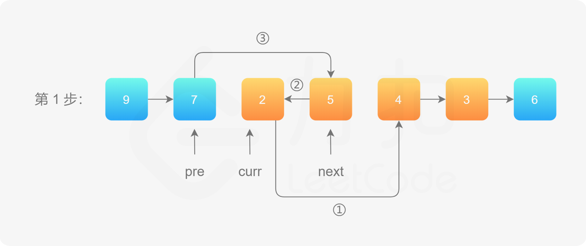

## 目录

[toc]

## 1122. 数组的相对排序

> 给你两个数组，`arr1` 和 `arr2`，
>
> `arr2` 中的元素各不相同
> `arr2` 中的每个元素都出现在 `arr1` 中
> 对 `arr1` 中的元素进行排序，使 `arr1` 中项的相对顺序和 `arr2` 中的相对顺序相同。未在 `arr2` 中出现过的元素需要按照升序放在 `arr1` 的末尾。
>
> **示例：**
>
> ```c++
> 输入：arr1 = [2,3,1,3,2,4,6,7,9,2,19], arr2 = [2,1,4,3,9,6]
> 输出：[2,2,2,1,4,3,3,9,6,7,19]
> ```
>
> **提示：**
>
> * `1 <= arr1.length, arr2.length <= 1000`
> * `0 <= arr1[i], arr2[i] <= 1000`
> * `arr2` 中的元素 `arr2[i]` 各不相同
> * `arr2` 中的每个元素 `arr2[i]` 都出现在 `arr1` 中

### (1) 创新解法：自定义序

**思想：**重新定义“序”的概念。

**原理：**

* `arr2` 中已有的元素排序优先级更高，并保持原序：`pair<0, rank(x)>`
* 新元素的排序优先级靠后，并使用值序：`pair<1, x>`。

```c++
class Solution {
public:
    vector<int> relativeSortArray(vector<int>& arr1, vector<int>& arr2) {
        unordered_map<int,int> rank; // 用于存储 arr2 中元素的原序
        // 填充 rank
        for(int i=0; i<arr2.size(); ++i) 
            rank[arr2[i]]=i;
        // 定义函数指针，用于获得新的序
        auto cmp = [&](int x) -> pair<int, int> {
            return rank.count(x) ? pair{0, rank[x]} : pair{1, x}; // 在 C++11 中才可以列表初始化返回。
        };
        // 采用新的序进行排序
        sort(arr1.begin(), arr1.end(), [&](int x, int y){
            return cmp(x) < cmp(y);
        });
        return arr1;
    }
};
```

## 389. 找不同

> 给定两个字符串 `s` 和 `t`，它们只包含小写字母。
>
> 字符串 `t` 由字符串 `s` 随机重排，然后在随机位置添加一个字母。
>
> 请找出在 `t` 中被添加的字母。
>
> **示例 1：**
>
> ```c++
> 输入：s = "abcd", t = "abcde"
> 输出："e"
> 解释：'e' 是那个被添加的字母。
> ```
>
> **示例 2：**
>
> ```c++
> 输入：s = "", t = "y"
> 输出："y"
> ```
>
> **示例 3：**
>
> ```c++
> 输入：s = "a", t = "aa"
> 输出："a"
> ```
>
> **示例 4：**
>
> ```c++
> 输入：s = "ae", t = "aea"
> 输出："a"
> ```
>
> 提示：
>
> * `0 <= s.length <= 1000`
> * `t.length == s.length + 1`
> * `s` 和 `t` 只包含小写字母

### (1) 基本解法：重拳出击

**思想：**暴力解决

**原理：**

* 将两个字符串排序，然后逐个比较

```c++
class Solution {
public:
    char findTheDifference(string s, string t) {
        sort(s.begin(), s.end());
        sort(t.begin(), t.end());
        short i;
        for(i=0; i<s.size(); i++)
            if(s[i]!=t[i]) return t[i];
        return t[i];
    }
};
```

### (2) 进阶解法：求和抵消

**思想：**两和之差出不同

**原理：**

* 第一串求和，第二串抵消
* 最后留下来的那个值必然就是随机添加的字母值

```c++
class Solution {
public:
    char findTheDifference(string s, string t) {
		int sum=0;
        for(auto i: t) sum+=i;
        for(auto i: s) sum-=i;
        return sum;
    }
};
```

### (3) 创新解法：异或抵消

**思想：**异或抵消出不同

**原理：**

* 异或运算有如下性质
  * 任何数和 `0` 做异或运算，结果仍然是原来的数
  * 任何数和其自身做异或运算为 `0`
  *  异或运算满足交换律和结合律
* 交换律和结合律让异或能够“记录”操作
* 自身异或为 `0` 让异或能够“逆”操作

```c++
class Solution {
public:
    char findTheDifference(string s, string t) {
        int ret=0;
        for(auto x: s)  ret ^= x;
        for(auto y:t) ret ^= y;
        return ret;
    }
};
```

## 387. 字符串中的第一个唯一字符

> 给定一个字符串，找到它的第一个不重复的字符，并返回它的索引。如果不存在，则返回 -1。
>
> **示例：**
>
> ```c++
> s = "leetcode"
> 返回 0
> 
> s = "loveleetcode"
> 返回 2
> ```
>
> **提示：**你可以假定该字符串只包含小写字母。

### (1) 经典解法：字母桶

**思想：**遇到计数，不要犹豫，hash或者桶， 全是字母用桶更快

**原理：**

* 第一遍装通
* 第二遍查桶

```c++
class Solution {
public:
    int firstUniqChar(string s) {
        int i,count[26]={0};
        for(i=0; i<s.size(); ++i) // 装桶
            ++count[s[i]-97];
        for(i=0; i<s.size(); ++i) // 查桶
            if(count[s[i]-97] == 1)
                return i;
        return -1;
    }
};
```

## 85. 最大矩形

> 给定一个仅包含 `0` 和 `1` 、大小为 `rows x cols` 的二维二进制矩阵，找出只包含 `1` 的最大矩形，并返回其面积。
>
> **示例 1：**
>
> 
>
> ```c++
> 输入：matrix = [["1","0","1","0","0"],["1","0","1","1","1"],["1","1","1","1","1"],["1","0","0","1","0"]]
> 输出：6
> 解释：最大矩形如上图所示。
> ```
>
> **示例 2：**
>
> ```c++
> 输入：matrix = []
> 输出：0
> ```
>
> **示例 3：**
>
> ```c++
> 输入：matrix = [["0"]]
> 输出：0
> ```
>
> **示例 4：**
>
> ```c++
> 输入：matrix = [["1"]]
> 输出：1
> ```
>
> **示例 5：**
>
> ```c++
> 输入：matrix = [["0","0"]]
> 输出：0
> ```
>
> **提示：**
>
> * `rows == matrix.length`
> * `cols == matrix[0].length`
> * `0 <= row, cols <= 200`
> * `matrix[i][j]` 为 `'0'` 或 `'1'`

### (1) 创新解法：暴力柱状图

**思想：**基于柱状图的优化暴力解法

**原理：**

* 对于每一列，上面的元素及其左边的 `1` 形成一个柱，建立柱状图
* 对于每一列，判断当前元素及以上组成的子柱状图，寻找最大矩形并记录
* 找到全局最大解

```c++
class Solution {
public:
    int maximalRectangle(vector<vector<char>>& matrix) {
        int n,m = matrix.size(); // 矩阵大小
        if(!m) return 0; // 平凡情况
        n = matrix[0].size();
        vector<vector<int> > bar(m, vector<int>(n,0));  // 柱状图
        int i,j,k,width,area=0,ret=0; // 使用变量
        // 建立柱状图
        for (i = 0; i < m; i++)
            for (j = 0; j < n; j++)
                if (matrix[i][j] == '1')
                    bar[i][j] = (j == 0 ? 0: bar[i][j - 1]) + 1; // 基准值 + 1
        // 柱状图暴力求解
        for(j=0; j<n; ++j)
            for(i=0; i<m; ++i)
            {
                if(!bar[i][j]) continue; // 如果当前元素为 0，则 width=0，可以跳过
                width = bar[i][j]; // 否则计算宽度
                area = bar[i][j]; // 获取面积
                // 检查子柱状图
                for(k=i-1; k>=0 && bar[k][j]; --k)
                {
                    width = min(width,bar[k][j]);
                    area = max(area,(i-k+1)*width);
                }
                //cout << "i = " << i << ", min = " << width << ", area = " << area << endl;
                ret = max(ret, area); // 记录解
            }
        return ret;
    }
};
```

## 228. 汇总区间

> 给定一个无重复元素的有序整数数组 `nums `。
>
> 返回 恰好覆盖数组中所有数字的 **最小有序** 区间范围列表。也就是说，`nums` 的每个元素都恰好被某个区间范围所覆盖，并且不存在属于某个范围但不属于 `nums` 的数字 `x` 。
>
> 列表中的每个区间范围 `[a,b]` 应该按如下格式输出：
>
> `"a->b"` ，如果 `a != b`
> `"a"` ，如果 `a == b`
>
> **示例 1：**
>
> ```c++
> 输入：nums = [0,1,2,4,5,7]
> 输出：["0->2","4->5","7"]
> 解释：区间范围是：
> [0,2] --> "0->2"
> [4,5] --> "4->5"
> [7,7] --> "7"
> ```
>
> **示例 2：**
>
> ```c++
> 输入：nums = [0,2,3,4,6,8,9]
> 输出：["0","2->4","6","8->9"]
> 解释：区间范围是：
> [0,0] --> "0"
> [2,4] --> "2->4"
> [6,6] --> "6"
> [8,9] --> "8->9"
> ```
>
> **示例 3：**
>
> ```c++
> 输入：nums = []
> 输出：[]
> ```
>
>
> 示例 4：
>
> ```c++
> 输入：nums = [-1]
> 输出：["-1"]
> ```
>
>
> **示例 5：**
>
> ```c++
> 输入：nums = [0]
> 输出：["0"]
> ```
>
> **提示：**
>
> * `0 <= nums.length <= 20`
> * $-2^{31} <= \text{nums[i]} <= 2^{31} - 1$
> * `nums` 中的所有值都互不相同
> * `nums` 按升序排列

### (1) 常规解法：顺序探测

思想：循环中分类

原理：

* 按顺序输入
* 根据得到的信息按条件判断，选择合适的操作
  * `arrow` : 加箭头
  * `flag` : 新的区间开始，获得数字、重置`flag`、准备添加箭头
  * 结束情况处理末尾和不连续 : 如果不准备加箭头，说明已有，再补当前数，添加到向量；否则说明是单个数，直接添加到向量。最后立新 `flag`。

```c++
class Solution {
public:
    vector<string> summaryRanges(vector<int>& nums) {
        bool flag = true, arrow = false;
        string s;
        vector<string> res;
        for(int i=0;i<nums.size(); ++i)
        {
            if(arrow) // 新立的 flag 会建立新 s，从而把这里的冲掉
            {
                s+="->";
                arrow = false;
            }
            if(flag)
            {
                s = to_string(nums[i]);
                flag = false;
                arrow = true;
            }
            if(i==nums.size()-1||nums[i+1]-1>nums[i]) // 技巧点
            {
                if(!arrow)
                    s+=to_string(nums[i]);
                res.push_back(std::move(s));
                flag = true;
            }
        }
        return res;
    }
};
```

**【技】**大整数时，尽量不要用 `nums[i+1]-nums[i]>1`，而应该用 `nums[i+1]-1>nums[i]`.

## 1202. 交换字符串中的元素

> 给你一个字符串 `s`，以及该字符串中的一些「索引对」数组 `pairs`，其中 `pairs[i] = [a, b]` 表示字符串中的两个索引（编号从 `0` 开始）。
>
> 你可以 任意多次交换 在 `pairs` 中任意一对索引处的字符。
>
> 返回在经过若干次交换后，`s` 可以变成的按字典序最小的字符串。
>
> **示例 1:**
>
> ```c++
> 输入：s = "dcab", pairs = [[0,3],[1,2]]
> 输出："bacd"
> 解释： 
> 交换 s[0] 和 s[3], s = "bcad"
> 交换 s[1] 和 s[2], s = "bacd"
> ```
>
> **示例 2：**
>
> ```c++
> 输入：s = "dcab", pairs = [[0,3],[1,2],[0,2]]
> 输出："abcd"
> 解释：
> 交换 s[0] 和 s[3], s = "bcad"
> 交换 s[0] 和 s[2], s = "acbd"
> 交换 s[1] 和 s[2], s = "abcd"
> ```
>
>
> **示例 3：**
>
> ```c++
> 输入：s = "cba", pairs = [[0,1],[1,2]]
> 输出："abc"
> 解释：
> 交换 s[0] 和 s[1], s = "bca"
> 交换 s[1] 和 s[2], s = "bac"
> 交换 s[0] 和 s[1], s = "abc"
> ```
>
>
> 提示：
>
> * `1 <= s.length <= 10^5`
> * `0 <= pairs.length <= 10^5`
> * `0 <= pairs[i][0], pairs[i][1] < s.length`
> * `s` 中只含有小写英文字母

### (1) 创新解法：优先并查集

思想：<u>并查集</u>连通交换位，<u>优先队列</u>给出最小字

原理：

* **交换具有传递性**，因此建立并查集，将所有“相通”的交换位置连接起来
* 建立哈希表，表示“连通分量根索引 -> 同分量交换位置处的字符优先队列”
* 遍历字符串，每个位置 ---哈希表--> 字符优先队列 -> 最小字符

```c++
// 并查集
class UnionFind{
public:
    // 构造函数
    UnionFind(int len)
    {
        parent = new int[len];
        rank = new int[len];
        for(int i=0;i<len;++i)
        {
            parent[i] = i;
            rank[i] = 1; // (最小高度为1)
        }
    }
    // 合并
    void unio(int x, int y)
    {
        int rootX=find(x); // (新的定义)
        int rootY=find(y);
        if(rootX==rootY) return;
        if(rank[x]>rank[y]) // (数组方括号)
            parent[rootY]=rootX;
        else
            parent[rootX]=rootY;
        if(rank[x]==rank[y]) // 按秩合并
            ++rank[rootX];
    }
    // 查找
    int find(int x)
    {
        if(x!=parent[x])
            parent[x] = find(parent[x]); // 路径压缩
        return parent[x];
    }
    // 析构
    ~UnionFind()
    {
        delete[] parent; // (删除数组)
        delete[] rank;
    }

private:
    int *parent=nullptr; // 父指针数组
    int *rank=nullptr; // 秩数组
    // 不含 value，只含索引 0 - len-1
}; // (类结束的分号)

class Solution {
public:
    string smallestStringWithSwaps(string s, vector<vector<int>>& pairs) {
        if(pairs.size()==0) return s; // 平凡情况
        int i,root;
        UnionFind unionFind(s.size()); // 定义并查集
        for(const auto& pair:pairs) // 建立并查集
            unionFind.unio(pair[0],pair[1]);
        map<int,priority_queue<char,vector<char>,greater<char>>> hashMap; // 关于并查集中索引的映射
        for(i=0;i<s.size();++i) // 建立 索引-字符 映射
        {
            root = unionFind.find(i); // 获取当前字符索引所处的连通分量
            if(hashMap.count(root)) // 如果该连通分量已经建立了映射
                hashMap[root].push(s[i]); // 继续添加
            else // 如果该连通分量还未建立映射
            {
                priority_queue<char,vector<char>,greater<char>> q; // 创建新的优先队列
                q.push(s[i]); // 添加
                hashMap[root] = std::move(q); // 建立该项映射
            }
        }
        for(i=0;i<s.size();++i) // 对于每个字符位置遍历
        {
            root = unionFind.find(i); // 确定索引所属的连通分量
            s[i] = hashMap[root].top(); // 更改为连通分量中最小的字符
            hashMap[root].pop(); // 然后移除
        }
        return s; // 返回结果
    }
};
```

## 1018. 可被 5 整除的二进制前缀

> 给定由若干 `0` 和 `1` 组成的数组 `A`。我们定义 `N_i`：从 `A[0]` 到 `A[i]` 的第 `i` 个子数组被解释为一个二进制数（从最高有效位到最低有效位）。
>
> 返回布尔值列表 `answer`，只有当 `N_i` 可以被 `5` 整除时，答案 `answer[i]` 为 `true`，否则为 `false`。
>
> **示例 1：**
>
> ```c++
> 输入：[0,1,1]
> 输出：[true,false,false]
> 解释：
> 输入数字为 0, 01, 011；也就是十进制中的 0, 1, 3 。只有第一个数可以被 5 整除，因此 answer[0] 为真。
> ```
>
> **示例 2：**
>
> ```c++
> 输入：[1,1,1]
> 输出：[false,false,false]
> ```
>
> **示例 3：**
>
> ```c++
> 输入：[0,1,1,1,1,1]
> 输出：[true,false,false,false,true,false]
> ```
>
> **示例 4：**
>
> ```c++
> 输入：[1,1,1,0,1]
> 输出：[false,false,false,false,false]
> ```
>
> **提示：**
>
> * `1 <= A.length <= 30000`
> * `A[i]` 为 `0` 或 `1`

### (1) 经典解法：位运算取模

思路：用<u>位运算</u>乘 2，用<u>模运算</u>简化

原理：一个数乘以 2 相当于它<u>左移一位</u>；在探索 5 的倍数时，使用<u>模运算法则</u>

```c++
// 模运算法则
// 除了除法外，几乎常见的运算都符合某种类似分配律的运算律
1. (a + b) % p = (a % p + b % p) % p
2. (a - b) % p = (a % p - b % p) % p
3. (a * b) % p = (a % p * b % p) % p
4. (a^b) % p = ((a % p)^b) % p
```

```c++
class Solution {
public:
    vector<bool> prefixesDivBy5(vector<int>& A) {
        int sum = 0;
        vector<bool> answer(A.size());
        for(int i=0; i<A.size(); ++i)
        {
            // (1) 位运算乘法
            // (2) 及时取余
            sum = ((sum<<1) + A[i])%5;
            answer[i] = sum ? false : true;
        }
        return answer;
    }
};
```

## 947. 移除最多的同行或同列石头

> `n` 块石头放置在二维平面中的一些整数坐标点上。每个坐标点上最多只能有一块石头。
>
> 如果一块石头的 同行或者同列 上有其他石头存在，那么就可以移除这块石头。
>
> 给你一个长度为 `n` 的数组 `stones` ，其中 `stones[i] = [xi, yi]` 表示第 `i` 块石头的位置，返回 **可以移除的石子** 的最大数量。
>
> **示例 1：**
>
> ```c++
> 输入：stones = [[0,0],[0,1],[1,0],[1,2],[2,1],[2,2]]
> 输出：5
> 解释：一种移除 5 块石头的方法如下所示：
> 
> 1. 移除石头 [2,2] ，因为它和 [2,1] 同行。
> 2. 移除石头 [2,1] ，因为它和 [0,1] 同列。
> 3. 移除石头 [1,2] ，因为它和 [1,0] 同行。
> 4. 移除石头 [1,0] ，因为它和 [0,0] 同列。
> 5. 移除石头 [0,1] ，因为它和 [0,0] 同行。
> 石头 [0,0] 不能移除，因为它没有与另一块石头同行/列。
> ```
>
> **示例 2：**
>
> ```c++
> 输入：stones = [[0,0],[0,2],[1,1],[2,0],[2,2]]
> 输出：3
> 解释：一种移除 3 块石头的方法如下所示：
> 
> 1. 移除石头 [2,2] ，因为它和 [2,0] 同行。
> 2. 移除石头 [2,0] ，因为它和 [0,0] 同列。
> 3. 移除石头 [0,2] ，因为它和 [0,0] 同行。
> 
> 石头 [0,0] 和 [1,1] 不能移除，因为它们没有与另一块石头同行/列。
> ```
>
> **示例 3：**
>
> ```c++
> 输入：stones = [[0,0]]
> 输出：0
> 解释：[0,0] 是平面上唯一一块石头，所以不可以移除它。
> ```
>
> **提示：**
>
> * `1 <= stones.length <= 1000`
> * `0 <= xi, yi <= 104`
> * 不会有两块石头放在同一个坐标点上

### (1) 创新解法：紧凑并查集

思想：使用并查集，底层对二维坐标数据进行针对性改动

原理：

* 将同行或同列的石头连起来建图，则由遍历可行性，**一定可以把一个连通图里的所有顶点根据这个删到只剩下一个顶点**
* **唯一化横纵坐标**，二维数据转为同连通分量的一维数据一，区分出横与纵

* 使用**变异的并查集**，用 `map` 代替数组（键为数组下标，值为数组元素，紧凑），建立基于 `map` 的并查集
* 计算**最多可以移除的石头的个数 = 所有石头的个数 - 连通分量的个数**

```c++
class UnionFind {
public:
    UnionFind()
    {
        parent = new map<int,int>(); // 相当于一个数组，键表示数组下标，值表示数组元素（实现了大跨度数据的紧凑存储）
        count = 0;
    }

    int getCount()
    {
        return count;
    }

    int find(int x)
    {
        if(!parent->count(x)) // 变为查询空的时候创建，因为事先无法知道空间大小
        {
            (*parent)[x] = x;
            ++count;
        }
        if(x!=(*parent)[x])
            (*parent)[x] = find((*parent)[x]); // 路径压缩
        return (*parent)[x];
    }

    void unio(int x, int y)
    {
        int rootX = find(x);
        int rootY = find(y);
        if(rootX == rootY) return;
        (*parent)[rootX] = rootY; // 没有弄按秩合并，压缩后的路径已经有较大的效率了
        --count;
    }

    ~UnionFind()
    {
        delete parent;
    }

private:
    map<int,int> *parent = nullptr; 
    int count;
};

class Solution {
public:
    int removeStones(vector<vector<int>>& stones) {
        UnionFind unionFind;
        for(const auto &stone: stones)
            unionFind.unio(stone[0]+10001, stone[1]);
        return stones.size() - unionFind.getCount();
    }
};
```

## 803. 打砖块

> 有一个 `m x n` 的二元网格，其中 `1` 表示砖块，`0` 表示空白。砖块 稳定（不会掉落）的前提是：
>
> 一块砖直接连接到网格的顶部，或者
> 至少有一块相邻（`4` 个方向之一）砖块 稳定 不会掉落时
> 给你一个数组 hits ，这是需要依次消除砖块的位置。每当消除 `hits[i] = (rowi, coli)` 位置上的砖块时，对应位置的砖块（若存在）会消失，然后其他的砖块可能因为这一消除操作而掉落。一旦砖块掉落，它会立即从网格中消失（即，它不会落在其他稳定的砖块上）。
>
> 返回一个数组 `result` ，其中 `result[i]` 表示第 i 次消除操作对应掉落的砖块数目。
>
> 注意，消除可能指向是没有砖块的空白位置，如果发生这种情况，则没有砖块掉落。
>
> **示例 1：**
>
> ```c++
> 输入：grid = [[1,0,0,0],[1,1,1,0]], hits = [[1,0]]
> 输出：[2]
> 解释：
> 网格开始为：
> [[1,0,0,0]，
>  [1,1,1,0]]
> 消除 (1,0) 处加粗的砖块，得到网格：
> [[1,0,0,0]
>  [0,1,1,0]]
> 两个加粗的砖不再稳定，因为它们不再与顶部相连，也不再与另一个稳定的砖相邻，因此它们将掉落。得到网格：
> [[1,0,0,0],
>  [0,0,0,0]]
> 因此，结果为 [2] 。
> ```
>
> **示例 2：**
>
> ```c++
> 输入：grid = [[1,0,0,0],[1,1,0,0]], hits = [[1,1],[1,0]]
> 输出：[0,0]
> 解释：
> 网格开始为：
> [[1,0,0,0],
>  [1,1,0,0]]
> 消除 (1,1) 处加粗的砖块，得到网格：
> [[1,0,0,0],
>  [1,0,0,0]]
> 剩下的砖都很稳定，所以不会掉落。网格保持不变：
> [[1,0,0,0], 
>  [1,0,0,0]]
> 接下来消除 (1,0) 处加粗的砖块，得到网格：
> [[1,0,0,0],
>  [0,0,0,0]]
> 剩下的砖块仍然是稳定的，所以不会有砖块掉落。
> 因此，结果为 [0,0] 。
> ```
>
>
> 提示：
>
> * `m == grid.length`
> * `n == grid[i].length`
> * `1 <= m, n <= 200`
> * `grid[i][j]` 为 `0` 或 `1`
> * `1 <= hits.length <= 4 * 104`
> * `hits[i].length == 2`
> * `0 <= xi <= m - 1`
> * `0 <= yi <= n - 1`
> * 所有 `(xi, yi)` 互不相同

### (1) 创新解法：逆序并查集

思想：逆序思考、信息维护

原理：敲转是“熵减”，并查“熵增”，因此逆序处理；计算砖头掉落个数，可在并查集内维护

```c++
class UnionFind {
public:
    UnionFind(int len)
    {
        parent = new int[len]; // 数组结构
        rank = new int[len]; // 秩数组
        size = new int[len]; // 与该砖头相连的个数
        for(int i=0; i<len; ++i)
        {
            parent[i] = i;
            rank[i] = 1;
            size[i] = 1;
        }
    }

    ~UnionFind()
    {
        delete[] parent;
        delete[] rank;
        delete[] size;
    }

    void unio(int x, int y)
    {
        int rootX = find(x);
        int rootY = find(y);
        if(rootX==rootY) return;
        if(rank[rootX]<rank[rootY])
        {
            parent[rootX] = rootY; // 按秩合并
            size[rootY]+=size[rootX]; // 个数维护
            //cout << "size[rooY] = " << size[rootY] << endl;
        }
        else
        {
            parent[rootY] = rootX; // 按秩合并
            size[rootX]+=size[rootY]; // 个数维护
            //cout << "size[rooX] = " << size[rootX] << endl;
        }
        if(rank[rootX]==rank[rootY])
            ++rank[rootX]; // 秩维护
    }

    int find(int x)
    {
        if(parent[x] == x) return x;
        parent[x] = find(parent[x]); // 路径压缩
        return parent[x];
    }

    int getSize(int x)
    {
        int root = find(x);
        return size[root]; // 获取指定节点相连的砖头数
    }

private:
    int *parent = nullptr;
    int *rank = nullptr;
    int *size = nullptr;
};

class Solution {
public:
    vector<int> hitBricks(vector<vector<int>>& grid, vector<vector<int>>& hits) {
        int i,j; // 辅助参数
        rows = grid.size();
        cols = grid[0].size();
        // 第1步：击碎砖头
        vector<vector<int>> copy(grid);
        for(const auto &hit: hits)
            copy[hit[0]][hit[1]] = 0;   // 击碎
        // 第2步：建图
        int size = rows*cols; // 网格总数
        UnionFind unionFind(size+1); // 建立并查集
        for(j=0;j<cols;++j)
            if(copy[0][j])
                unionFind.unio(size,j); // 贴墙方向
        for(i=1;i<rows;++i)
            for(j=0;j<cols;++j)
                if(copy[i][j])
                {
                    if(copy[i-1][j]) // 上方
                        unionFind.unio(getIndex(i,j),getIndex(i-1,j));
                    if(j>0 && copy[i][j-1]) // 左方
                        unionFind.unio(getIndex(i,j),getIndex(i,j-1));
                }
        // 逆序填充
        vector<int> res(hits.size()); // 存放结果的数组
        for(i=hits.size()-1;i>=0;--i) // 逆序遍历
        {
            int x = hits[i][0]; // 横坐标
            int y = hits[i][1]; // 纵坐标
            if(!grid[x][y]) continue;
            int origin = unionFind.getSize(size); // 放回前砖头个数
            //cout << "origin = " << origin << endl;
            if(x==0)
                unionFind.unio(y,size);
            for(const auto &direction: DIRECTIONS)
            {
                int newX = x + direction[0];
                int newY = y + direction[1];
                if(inArea(newX,newY) && copy[newX][newY])
                    unionFind.unio(getIndex(newX,newY),getIndex(x,y));
            }
            int current = unionFind.getSize(size); // 放回后砖头个数
            // << "current = " << current << endl;
            res[i] = current - origin - 1 > 0 ? current - origin -1 : 0;
            //cout << "res[i] = " << res[i] << endl;
            copy[x][y] = 1; // 真正放回砖头
        }
        return res;
    }

    int getIndex(int x,int y)
    {
        return x*cols+y; // 获取点坐标
    }

    int inArea(int x,int y)
    {
        return x>=0 && x<rows && y>=0 && y<cols; // 判断点的合法性
    }

private:
    int rows;
    int cols;
    constexpr static int DIRECTIONS[4][2] = {{1,0},{0,1},{-1,0},{0,-1}};
};
```

## 1232. 缀点成线

> 在一个 `XY` 坐标系中有一些点，我们用数组 `coordinates` 来分别记录它们的坐标，其中 `coordinates[i] = [x, y]` 表示横坐标为 `x`、纵坐标为 `y` 的点。
>
> 请你来判断，这些点是否在该坐标系中属于同一条直线上，是则返回 `true`，否则请返回 `false`。
>
> **示例 1：**
>
> 
>
> ```c++
> 输入：coordinates = [[1,2],[2,3],[3,4],[4,5],[5,6],[6,7]]
> 输出：true
> ```
>
> **示例 2：**
>
> 
>
> ```c++
> 输入：coordinates = [[1,1],[2,2],[3,4],[4,5],[5,6],[7,7]]
> 输出：false
> ```
>
> **提示：**
>
> * `2 <= coordinates.length <= 1000`
> * `coordinates[i].length == 2`
> * `-10^4 <= coordinates[i][0], coordinates[i][1] <= 10^4`
> * `coordinates` 中不含重复的点

思想：数学方法

原理：判断斜率的数学方法有斜率相等、符合方程、行列式为`0`

### (1) 勉强解法：斜率法

```c++
class Solution {
public:
    bool checkStraightLine(vector<vector<int>>& coordinates) {
        double slope1, slope2;
        if(coordinates[1][0]-coordinates[0][0])
        {	// 横向
            slope1 = static_cast<double>(coordinates[1][1]-coordinates[0][1])/(coordinates[1][0]-coordinates[0][0]);
            for(int i=2; i<coordinates.size(); ++i)
            {
                slope2 = static_cast<double>(coordinates[i][1]-coordinates[i-1][1])/(coordinates[i][0]-coordinates[i-1][0]);
                if(slope1!=slope2) return false;
            }
        }
        else
        {	// 纵向
            slope1 = static_cast<double>(coordinates[1][0]-coordinates[0][0])/(coordinates[1][1]-coordinates[0][1]);
            for(int i=2; i<coordinates.size(); ++i)
            {
                slope2 = static_cast<double>(coordinates[i][0]-coordinates[i-1][0])/(coordinates[i][1]-coordinates[i-1][1]);
                if(slope1!=slope2) return false;
            }
        }
        return true;
    }
};
```

缺点：要专门处理斜率不存在的情况；除法开销远大于乘法；除法结果可能存在精度问题。

### (2) 合适解法：公式法

```c++
class Solution {
public:
    bool checkStraightLine(vector<vector<int>> &coordinates) {
        int deltaX = coordinates[0][0], deltaY = coordinates[0][1];
        int n = coordinates.size();
        for (int i = 0; i < n; ++i) {
            coordinates[i][0] -= deltaX; // 都减去 (x0,y0)，相当于将“直线”平移到原点
            coordinates[i][1] -= deltaY;
        }
        int A = coordinates[1][1], B = -coordinates[1][0];
        for (int i = 2; i < n; ++i) {
            int x = coordinates[i][0], y = coordinates[i][1];
            if (A * x + B * y != 0) { // 套到直线方程中验证
                return false;
            }
        }
        return true;
    }
};
```

### (3) 合适解法：行列式法

```c++
class Solution {
public:
    bool checkStraightLine(vector<vector<int>>& coordinates) {
        int n = coordinates.size();
        int x0 = coordinates[0][0], y0 = coordinates[0][1];
        int x = coordinates[1][0] - x0; // 都减去 (x0,y0)，相当于将“直线”平移到原点
        int y = coordinates[1][1] - y0;
        for (int i = 2; i < n; ++i) {
            int xi = coordinates[i][0] - x0;
            int yi = coordinates[i][1] - y0;
            if (x * yi - y * xi) { // 计算二阶行列式
                return false;
            }
        }
        return true;
    }
};
```

## 721. 账户合并

> 给定一个列表 `accounts`，每个元素 `accounts[i]` 是一个字符串列表，其中第一个元素 `accounts[i][0]` 是 名称 (*name*)，其余元素是 *emails* 表示该账户的邮箱地址。
>
> 现在，我们想合并这些账户。如果两个账户都有一些共同的邮箱地址，则两个账户必定属于同一个人。请注意，即使两个账户具有相同的名称，它们也可能属于不同的人，因为人们可能具有相同的名称。一个人最初可以拥有任意数量的账户，但其所有账户都具有相同的名称。
>
> 合并账户后，按以下格式返回账户：每个账户的第一个元素是名称，其余元素是按字符 ASCII 顺序排列的邮箱地址。账户本身可以以任意顺序返回。
>
> 示例 1：
>
> ```c++
> 输入：
> accounts = [["John", "johnsmith@mail.com", "john00@mail.com"], ["John", "johnnybravo@mail.com"], ["John", "johnsmith@mail.com", "john_newyork@mail.com"], ["Mary", "mary@mail.com"]]
> 输出：
> [["John", 'john00@mail.com', 'john_newyork@mail.com', 'johnsmith@mail.com'],  ["John", "johnnybravo@mail.com"], ["Mary", "mary@mail.com"]]
> 解释：
> 第一个和第三个 John 是同一个人，因为他们有共同的邮箱地址 "johnsmith@mail.com"。 
> 第二个 John 和 Mary 是不同的人，因为他们的邮箱地址没有被其他帐户使用。
> 可以以任何顺序返回这些列表，例如答案 [['Mary'，'mary@mail.com']，['John'，'johnnybravo@mail.com']，
> ['John'，'john00@mail.com'，'john_newyork@mail.com'，'johnsmith@mail.com']] 也是正确的。
> ```
>
>
> 提示：
>
> * `accounts`的长度将在`[1，1000]`的范围内。
> * `accounts[i]`的长度将在`[1，10]`的范围内。
> * `accounts[i][j]`的长度将在`[1，30]`的范围内。

### (1) 创新解法：映射并查集

思想：映射整数使用并查集，整数逆映射为向量集合

原理：将目标映射为整数建立并查集，然后通过整数坐标逆映射导出并查集，最后建立结果集

```c++
class UnionFind {
public:
    UnionFind(int len)
    {
        parent = new int[len];
        rank = new int[len];
        for(int i=0;i<len;++i)
        {
            parent[i] = i;
            rank[i] = 1;
        }
    }

    ~UnionFind()
    {
        delete[] parent;
        delete[] rank;
    }

    void unio(int x, int y)
    {
        int rootX = find(x);
        int rootY = find(y);
        if(rootX==rootY) return;
        if(rank[rootX] < rank[rootY])
            parent[rootX] = rootY;
        else
            parent[rootY] = rootX;
        if(rank[rootX] == rank[rootY])
            ++rank[rootX];
    }

    int find(int x)
    {
        if(x == parent[x]) return x;
        parent[x] = find(parent[x]);
        return parent[x];
    }

private:
    int *parent;
    int *rank;
};

class Solution {
public:
    vector<vector<string>> accountsMerge(vector<vector<string>>& accounts) {
        // 数据准备
        map<string,int> email2index;
        map<string,string> email2name;
        int indexCount = 0,i;
        for(const auto &account: accounts)
            for(i=1;i<account.size();++i)
            {
                email2index[account[i]] = indexCount++; // 重新编号
                email2name[account[i]] = account[0]; // 绑定名字
            }
        // 建立并查集
        UnionFind uf(indexCount);
        int base;
        for(const auto &account: accounts)
        {
            base = email2index[account[1]];
            for(i=2;i<account.size();++i)
            {
                uf.unio(base, email2index[account[i]]);
            }
        }
        // 导出并查集
        map<int,vector<string>> index2emails;
        for(auto &[email,_]: email2index) // map 的双元素遍历方法
        {
            int index = uf.find(email2index[email]);
            vector<string> &account = index2emails[index]; // 找到邮件对应的向量，在找到 index 的同时，自动创建需要的值
            account.push_back(email);
        }
        // 建立结果集
        vector<vector<string>> res;
        for(auto &[_,emails]: index2emails)
        {
            sort(emails.begin(),emails.end()); // 结果要排序
            vector<string> account;
            string name = email2name[emails[0]]; // 直接样例取下标
            account.push_back(name);
            for(auto &email: emails)
                account.push_back(email);
            res.push_back(account);
        }
        return res;
    }
};
```

## 628. 三个数的最大乘积

>给定一个整型数组，在数组中找出由三个数组成的最大乘积，并输出这个乘积。
>
>**示例 1:**
>
>```c++
>输入: [1,2,3]
>输出: 6
>```
>
>
>示例 2:
>
>```c++
>输入: [1,2,3,4]
>输出: 24
>```
>
>
>注意:
>
>* 给定的整型数组长度范围是[3,104]，数组中所有的元素范围是[-1000, 1000]。
>* 输入的数组中任意三个数的乘积不会超出32位有符号整数的范围。

### (1) 基本解法：排序查找

思想：通过排序选出 5 个数

原理：数组经过排序后，就能很容易检查后三个数乘积（3正数情况），和前两个数与最后数的乘积（2负1正情况）

```c++
class Solution {
public:
    int maximumProduct(vector<int>& nums) {
        sort(nums.begin(),nums.end()); // 排序
        int size = nums.size();
        int res1 = nums[size-1] * nums[size-2] * nums[size-3];
        int res2 = nums[size-1] * nums[0] * nums[1];
        if(res1 < res2)
            return res2;
        else
            return res1;
    }
};
```

### (2) 优化解法：线性扫描

思想：在扫描过程中找出 5 个数

原理：为了得到三个数的乘积，在扫描过程中留意最大的三数和最小的2个数，最后乘出比较即可

```c++
class Solution {
public:
    int maximumProduct(vector<int>& nums) {
        // 最小的和第二小的
        int min1 = INT_MAX, min2 = INT_MAX;
        // 最大的、第二大的和第三大的
        int max1 = INT_MIN, max2 = INT_MIN, max3 = INT_MIN;

        for (int x: nums) {
            if (x < min1) {
                min2 = min1;
                min1 = x;
            } else if (x < min2) {
                min2 = x;
            }

            if (x > max1) {
                max3 = max2;
                max2 = max1;
                max1 = x;
            } else if (x > max2) {
                max3 = max2;
                max2 = x;
            } else if (x > max3) {
                max3 = x;
            }
        }

        return max(min1 * min2 * max1, max1 * max2 * max3);
    }
};
```

## 1584. 连接所有点的最小费用

> 给你一个 `points` 数组，表示 2D 平面上的一些点，其中 `points[i] = [xi, yi]` 。
>
> 连接点 `[xi, yi]` 和点 `[xj, yj]` 的费用为它们之间的 曼哈顿距离 ：`|xi - xj| + |yi - yj|` ，其中 `|val|` 表示 `val` 的绝对值。
>
> 请你返回将所有点连接的最小总费用。只有任意两点之间 有且仅有 一条简单路径时，才认为所有点都已连接。
>
> **示例 1：**
>
> 
>
> ```c++
> 输入：points = [[0,0],[2,2],[3,10],[5,2],[7,0]]
> 输出：20
> 解释：
> ```
>
> 
>
> ```c++
> 我们可以按照上图所示连接所有点得到最小总费用，总费用为 20 。
> 注意到任意两个点之间只有唯一一条路径互相到达。
> ```
>
> **示例 2：**
>
> ```c++
> 输入：points = [[3,12],[-2,5],[-4,1]]
> 输出：18
> ```
>
>**示例 3：**
> 
>```c++
> 输入：points = [[0,0],[1,1],[1,0],[-1,1]]
> 输出：4
> ```
> 
>
>**示例 4：**
> 
>```c++
> 输入：points = [[-1000000,-1000000],[1000000,1000000]]
> 输出：4000000
> ```
> 
>
>**示例 5：**
> 
>```c++
> 输入：points = [[0,0]]
> 输出：0
> ```
> 
>**提示：**
> 
>* `1 <= points.length <= 1000`
> * `-106 <= xi, yi <= 106`
> * 所有点 `(xi, yi)` 两两不同。

### (1) 基本解法：Kruskal 算法

思想：基于算法，自定边权

原理：大方向是走 Kruskal 算法流程，只是需要在建立“边“概念要使用面向对象思想。

```c++
/*
    方法一：Kruskal 算法
*/

class UnionFind {
public:
    UnionFind(int len)
    {
        parent = new int[len];
        rank = new int[len];
        for(int i=0;i<len;++i)
        {
            parent[i] = i;
            rank[i] = 1;
        }
    }

    ~UnionFind()
    {
        delete[] parent;
        delete[] rank;
    }

    void unio(int x, int y)
    {
        int rootX = find(x);
        int rootY = find(y);
        if(rootX==rootY) return;
        if(rank[rootX]<rank[rootY])
            parent[rootX] = rootY;
        else
            parent[rootY] = rootX;
        if(rank[rootX]==rank[rootY])
            ++rank[rootX];
    }

    int find(int x)
    {
        if(x == parent[x]) return x;
        parent[x] = find(parent[x]);
        return parent[x];
    }

private:
    int *parent;
    int *rank;
};

// 边结构（类）
// 应该活用“面向对象”的思想，不用过于拘泥于底层，否则可能会适得其反
struct Edge {
    int x;
    int y;
    int w;
    Edge(int x, int y, int w): x(x), y(y), w(w) {}
};

class Solution {
public:
    int minCostConnectPoints(vector<vector<int>>& points) {
        int n = points.size(),i,j;
        // 建立按权排序的边集合
        // 这里有两条思路：
        //     我的思路是使用优先队列一步到位；
        //     LeeCode 的思路是使用 vector 再自定义排序。
        vector<Edge> v;
        int weight = 0;
        for(i=0; i<n; ++i)
            for(j=i+1; j<n; ++j)
            {
                weight = fabs(points[i][0]-points[j][0])+fabs(points[i][1]-points[j][1]);
                Edge e(i, j, weight);
                v.push_back(std::move(e));
            }
        // 复习匿名函数（lambda 函数）的使用
        sort(v.begin(), v.end(), [](const Edge &a, const Edge &b) -> int {return a.w < b.w;});
        // 使用并查集建立最小生成树
        int sum = 0;
        UnionFind uf(n);
        for(const auto &edge: v)
        {
            int u = edge.x;
            int v = edge.y;
            if(uf.find(u) != uf.find(v))
            {
                uf.unio(u,v);
                sum += edge.w;
            }
        }
        return sum;
    }
};
```

### (2) （优化解法：建图优化 Kruskal）

树状数组，后续学习。

## 959. 由斜杠划分区域

>在由 1 x 1 方格组成的 N x N 网格 `grid` 中，每个 1 x 1 方块由 `/`、`\` 或空格构成。这些字符会将方块划分为一些共边的区域。
>
>（请注意，反斜杠字符是转义的，因此 `\` 用 "`\\`" 表示。）。
>
>返回区域的数目。
>
>**示例 1：**
>
>```
>输入：
>[
>  " /",
>  "/ "
>]
>输出：2
>解释：2x2 网格如下：
>```
>
>**示例 2：**
>
>```
>输入：
>[
>  " /",
>  "  "
>]
>输出：1
>解释：2x2 网格如下：
>```
>
>**示例 3：**
>
>```
>输入：
>[
>  "\\/",
>  "/\\"
>]
>输出：4
>解释：（回想一下，因为 \ 字符是转义的，所以 "\\/" 表示 \/，而 "/\\" 表示 /\。）
>2x2 网格如下：
>```
>
>**示例 4：**
>
>```
>输入：
>[
>  "/\\",
>  "\\/"
>]
>输出：5
>解释：（回想一下，因为 \ 字符是转义的，所以 "/\\" 表示 /\，而 "\\/" 表示 \/。）
>2x2 网格如下：
>```
>
>**示例 5：**
>
>```
>输入：
>[
>  "//",
>  "/ "
>]
>输出：3
>解释：2x2 网格如下：
>```
>
>**提示：**
>
>* `1 <= grid.length == grid[0].length <= 30`
>* `grid[i][j]` 是 `'/'`、`'\'`、或 `' '`。

### (1) 创新解法：转化并查集

思想：元素抽象，合并规则

原理：两条斜杆将一个方格分成四个三角形，因此抽象为最小元素；左右上下、斜杠划分对应众多合并规则；并查集维护连通分量个数

```c++
class UnionFind {
public:
    UnionFind(int len) : n(len)
    {
        parent = new int[len];
        rank = new int[len];
        for(int i=0;i<len;++i)
        {
            parent[i] = i;
            rank[i] = 1;
        }
    }

    ~UnionFind()
    {
        delete[] parent;
        delete[] rank;
    }

    void unio(int x, int y)
    {
        int rootX = find(x);
        int rootY = find(y);
        if(rootX == rootY) return;
        if(rank[rootX] < rank[rootY])
            parent[rootX] = rootY;
        else
            parent[rootY] = rootX;
        if(rank[rootX] == rank[rootY])
            ++rank[rootX];
        --n;
    }

    int find(int x)
    {
        if(x == parent[x]) return x;
        parent[x] = find(parent[x]);
        return parent[x];
    }

    int getN()
    {
        return n;
    }

private:
    int *parent;
    int *rank;
    int n = 0;
};

class Solution {
public:
    int regionsBySlashes(vector<string>& grid) {
        int n = grid.size(), i, j, base;
        UnionFind uf(4*n*n);
        for(i=0; i<n; ++i)
            for(j=0; j<n; ++j)
            {
                base = 4*n*i+4*j;
                if(grid[i][j] == '/')
                {
                    uf.unio(base+0, base+1);
                    uf.unio(base+2, base+3);
                }
                else if(grid[i][j] == '\\')
                {
                    uf.unio(base+1, base+2);
                    uf.unio(base+0, base+3);
                }
                else
                {
                    uf.unio(base, base+1);
                    uf.unio(base, base+2);
                    uf.unio(base, base+3);
                }
            }
        for(i=0; i<n; ++i)
            for(j=1; j<n; ++j)
            {
                base = 4*n*i+4*j;
                uf.unio(base-2, base);
                base = 4*n*j+4*i;
                uf.unio(base-4*n+3, base+1);
            }
        return uf.getN();
    }
};
```

## 724. 寻找数组的中心索引

> 给定一个整数类型的数组 `nums`，请编写一个能够返回数组 “中心索引” 的方法。
>
> 我们是这样定义数组 中心索引 的：数组中心索引的左侧所有元素相加的和等于右侧所有元素相加的和。
>
> 如果数组不存在中心索引，那么我们应该返回 `-1`。如果数组有多个中心索引，那么我们应该返回最靠近左边的那一个。
>
> **示例 1：**
>
> ```
> 输入：
> nums = [1, 7, 3, 6, 5, 6]
> 输出：3
> 解释：
> 索引 3 (nums[3] = 6) 的左侧数之和 (1 + 7 + 3 = 11)，与右侧数之和 (5 + 6 = 11) 相等。
> 同时, 3 也是第一个符合要求的中心索引。
> ```
>
>
> **示例 2：**
>
> ```
> 输入：
> nums = [1, 2, 3]
> 输出：-1
> 解释：
> 数组中不存在满足此条件的中心索引。
> ```
>
>
> 说明：
>
> `nums` 的长度范围为 `[0, 10000]`。
> 任何一个 `nums[i]` 将会是一个范围在 `[-1000, 1000]` 的整数。

### (1) 正确解法：前缀和

思想：计算前缀和，建立判别式

原理：线性扫描计算前缀和，通过总和即可得到后缀和，整合出判别式判断

```c++
class Solution {
public:
    int pivotIndex(vector<int>& nums) {
        int total = accumulate(nums.begin(), nums.end(), 0);
        int sum = 0;
        for(int i=0; i<nums.size(); ++i)
            if(2*sum+nums[i]==total)
                return i;
            else
                sum += nums[i];
        return -1;
    }
};
```

## 1631. 最小体力消耗路径

>你准备参加一场远足活动。给你一个二维 `rows x columns` 的地图 `heights` ，其中 `heights[row][col]` 表示格子 `(row, col)` 的高度。一开始你在最左上角的格子 `(0, 0)` ，且你希望去最右下角的格子 `(rows-1, columns-1)` （注意下标从 `0` 开始编号）。你每次可以往 **上**，**下**，**左**，**右** 四个方向之一移动，你想要找到耗费 **体力** 最小的一条路径。
>
>一条路径耗费的 **体力值** 是路径上相邻格子之间 **高度差绝对值** 的 **最大值** 决定的。
>
>请你返回从左上角走到右下角的最小 **体力消耗值** 。
>
>**示例 1：**
>
>
>
>```c++
>输入：heights = [[1,2,2],[3,8,2],[5,3,5]]
>输出：2
>解释：路径 [1,3,5,3,5] 连续格子的差值绝对值最大为 2 。
>这条路径比路径 [1,2,2,2,5] 更优，因为另一条路径差值最大值为 3 。
>```
>
>**示例 2：**
>
>
>
>```c++
>输入：heights = [[1,2,3],[3,8,4],[5,3,5]]
>输出：1
>解释：路径 [1,2,3,4,5] 的相邻格子差值绝对值最大为 1 ，比路径 [1,3,5,3,5] 更优。
>```
>
>**示例 3：**
>
>
>
>```c++
>输入：heights = [[1,2,1,1,1],[1,2,1,2,1],[1,2,1,2,1],[1,2,1,2,1],[1,1,1,2,1]]
>输出：0
>解释：上图所示路径不需要消耗任何体力。
>```
>
>**提示：**
>
>* `rows == heights.length`
>* `columns == heights[i].length`
>* `1 <= rows, columns <= 100`
>* `1 <= heights[i][j] <= 106`

**【注】**审题中的 **“最短路径”** 概念有所不同，这里一条路径的长度定义为其所有**边权最大值**。

### (1) 经典解法：二分查找

思想：转为判断问题

原理：二分查找是一种“伪暴力”破解方法，其前提是解所在区间已知，关键是建立有效的解判断规则

* 体力消耗值 $x$ 是路径中的最大边权，如果当 $x=x_0$ 时，可以从左上角到达右下角，那么当 $x > x_0$ 时同样可行，因此可以用二分查找
* 对边权 $x$ 在 `[0, 10^6-1]` 的范围内进行二分查找
* 从左上角开始进行深度优先搜索或者广度优先搜索，在搜索的过程中只允许经过边权不超过 $x$  的边，搜索结束后判断是否能到达右下角

```c++
// 解法一：二分查找
class Solution {
private:
    // 【技】坐标系的搜索技巧，配有 if 判断即可
    const int dirs[4][2] = {{-1,0},{1,0},{0,-1},{0,1}}; 
public:
    int minimumEffortPath(vector<vector<int>>& heights) {
        int left=0, right=999999, mid, res=-1;
        int m=heights.size(), n=heights[0].size();
        while(left<=right)
        {
            mid = (left+right)/2;
            vector<bool> seen(m*n, false);
            seen[0] = true;
            queue<pair<int,int>> que;
            que.push({0,0}); // 元素插入法
            while(!que.empty())
            {
                auto [x,y] = que.front(); // 【技】既可以接受一个，也可以这样接受两个参数
                que.pop();
                for(int i=0; i<4; ++i)
                {
                    int xn = x+dirs[i][0];
                    int yn = y+dirs[i][1];
                    if(xn>=0 && xn<m && yn>=0 && yn<n && abs(heights[xn][yn]-heights[x][y])<=mid && !seen[xn*n+yn])
                    {
                        seen[xn*n+yn] = true; // 【注】坐标映射乘的是长度
                        que.emplace(xn,yn); // 构造插入法
                    }
                }
            }
            if(seen[m*n-1])
            {
                res = mid;
                right = mid-1;
            }
            else
                left = mid+1;
        }
        return res;
    }
};
```

### (2) 经典解法：并查集

思想：贪小加入的边使得首尾连通即为答案

原理：

* 将图中的所有边按照权值从小到大进行排序
* 将这些边依次加入并查集中
* 当加入一条权值为 $x$ 的边之后，如果左上角和右下角从非连通状态变为连通状态，那么 $x$ 即为答案

```c++
// 解法二：并查集
class UnionFind {
private:
    int *parent;
    int *rank;
    int setCount;

public:
    UnionFind(int len) : setCount(len)
    {
        parent = new int[len];
        rank = new int[len];
        for(int i=0; i<len; ++i)
        {
            parent[i] = i;
            rank[i] = 1;
        }
    }

    ~UnionFind()
    {
        delete[] parent;
        delete[] rank;
    }

    bool unio(int x, int y)
    {
        x = find(x);
        y = find(y);
        if(x==y) return false;
        if(rank[x]<rank[y])
            parent[x] = y;
        else
            parent[y] = x;
        if(rank[x]==rank[y])
            ++rank[x];
        --setCount;
        return true;
    }

    int find(int x)
    {
        if(x!=parent[x])
            parent[x] = find(parent[x]);
        return parent[x];
    }

    int getCount()
    {
        return setCount;
    }
};

class Solution {
public:
    int minimumEffortPath(vector<vector<int>>& heights) {
        int m = heights.size(), n = heights[0].size(); // 行列属性
        // 建立边集
        vector<tuple<int,int,int>> edges;
        int i,j,id;
        for(i=0; i<m; ++i)
            for(j=0; j<n; ++j)
            {
                id = i*n+j;
                if(i) // 【技】网格建边：下标判断，编号计算
                    edges.emplace_back(id,id-n,abs(heights[i][j]-heights[i-1][j]));
                if(j)
                    edges.emplace_back(id,id-1,abs(heights[i][j]-heights[i][j-1]));             
            }
        sort(edges.begin(),edges.end(),[](const auto &a,const auto &b)->bool{ // 匿名函数排序
            auto [x1,y1,w1] = a;
            auto [x2,y2,w2] = b;
            return w1<w2;
            });
        // 并查解决
        UnionFind uf(m*n);
        for(const auto &edge : edges)
        {
            auto [x,y,w] = edge;
            uf.unio(x,y);
            if(uf.find(0)==uf.find(m*n-1)) // 【注】连通性的判断条件
                return w;
        }
        return 0;
    }
};
```

**【技1】图论问题抽象：点集构造**

起手式就是**对节点进行编号（建立点集）**。一般是找到映射函数即可，使用情况自定，核心是**清楚两者等价**。一般来说，这里坐标 $(i,j)$ 的节点对应编号为 $i \times n + j$。

**【技2】图论问题抽象：边集构造**

1. 自建数据结构：1584，(坐标$x$, 坐标$y$) $\longrightarrow$ (编号$i$, 编号$j$, 权重$w$) 

   ```c++
   struct edge {
       int x;
       int y;
       int w;
   };
   vector<edge> edges; // 1584
   ```

2. 元组数据结构：1631，(高度) $\longrightarrow$ (编号$i$, 编号$j$, 权重$w$) 

   ```c++
   vector<pair<int,int>> edges;
   vector<tuple<int,int,int>> edges; // 1631
   ```

3. 直接数据结构：1489，已有合适的数据结构

   ```c++
   vector<vector<int> edges; // 1489
   ```

**【技3】`vector<vector<int>>` 初始化方法**

```c++
vector<vector<int> > bar(m, vector<int>(n,0)); // 85
vector<vector<int>> res(2); // 1489
```

### (3) （创新解法：最短路）

$\texttt{Dijkstra}$ 算法本质上是一种启发式搜索算法，它是 $\texttt{A*}$ 算法在启发函数 $h \equiv 0$ 时的特殊情况。

详细内容以后深入。

## 1489. 找到最小生成树里的关键边和伪关键边

> 给你一个 n 个点的带权无向连通图，节点编号为 0 到 n-1 ，同时还有一个数组 edges ，其中 edges[i] = [fromi, toi, weighti] 表示在 fromi 和 toi 节点之间有一条带权无向边。最小生成树 (MST) 是给定图中边的一个子集，它连接了所有节点且没有环，而且这些边的权值和最小。
>
> 请你找到给定图中最小生成树的所有关键边和伪关键边。如果从图中删去某条边，会导致最小生成树的权值和增加，那么我们就说它是一条关键边。伪关键边则是可能会出现在某些最小生成树中但不会出现在所有最小生成树中的边。
>
> 请注意，你可以分别以任意顺序返回关键边的下标和伪关键边的下标。
>
> **示例 1：**
>
> 
>
> ```c++
> 输入：n = 5, edges = [[0,1,1],[1,2,1],[2,3,2],[0,3,2],[0,4,3],[3,4,3],[1,4,6]]
> 输出：[[0,1],[2,3,4,5]]
> 解释：上图描述了给定图。
> 下图是所有的最小生成树。
> ```
>
> 
>
> ```c++
> 注意到第 0 条边和第 1 条边出现在了所有最小生成树中，所以它们是关键边，我们将这两个下标作为输出的第一个列表。
> 边 2，3，4 和 5 是所有 MST 的剩余边，所以它们是伪关键边。我们将它们作为输出的第二个列表。
> ```
>
> **示例 2 ：**
>
> 
>
> ```c++
> 输入：n = 4, edges = [[0,1,1],[1,2,1],[2,3,1],[0,3,1]]
> 输出：[[],[0,1,2,3]]
> 解释：可以观察到 4 条边都有相同的权值，任选它们中的 3 条可以形成一棵 MST 。所以 4 条边都是伪关键边。
> ```

### (1) 经典解法：枚举 + 最小生成树

思想：基于关键边和伪关建边的判断条件

原理：

需要理解题目描述中对于「关键边」和「伪关键边」的定义：

* 关键边：如果最小生成树中删去某条边，会导致最小生成树的权值和增加，那么我们就说它是一条关键边。也就是说，如果设原图最小生成树的权值为 `value`，那么去掉这条边后：
  * 要么整个图不连通，不存在最小生成树；
  * 要么整个图联通，对应的最小生成树的权值为 `v`，其严格大于 `value`。

* 伪关键边：可能会出现在某些最小生成树中但不会出现在所有最小生成树中的边。也就是说，我们可以在计算最小生成树的过程中，最先考虑这条边，即最先将这条边的两个端点在并查集中合并。设最终得到的最小生成树权值为 `v`，如果 `v=value`，那么这条边就是伪关键边。

```c++
class UnionFind {
public:
    UnionFind(int len) : setCount(len)
    {
        parent = new int[len];
        rank = new int[len];
        for(int i=0; i<len; ++i)
        {
            parent[i] = i;
            rank[i] = 1;
        }
    }

    ~UnionFind()
    {
        if(!parent) delete[] parent; //【注】可能会有内存空间分配失败，因此要有异常检测
        if(!rank) delete[] rank;
    }

    bool unio(int x, int y)
    {
        x = find(x);
        y = find(y);
        if(x==y) return false;
        if(rank[x]<rank[y])
            parent[x] = y;
        else
            parent[y] = x;
        if(rank[x]==rank[y])
            ++rank[x];
        --setCount;
        return true;
    }

    int find(int x)
    {
        if(x!=parent[x])
            parent[x] = find(parent[x]);
        return parent[x];
    }

    int getCount()
    {
        return setCount;
    }

private:
    int *parent = nullptr;
    int *rank = nullptr;
    int setCount;
};

class Solution {
public:
    vector<vector<int>> findCriticalAndPseudoCriticalEdges(int n, vector<vector<int>>& edges) {
        int minW=0, m=edges.size();
        vector<vector<int>> res(2); // 【技】知道元素个数时就可以先初始化
        // 预处理
        for(int i=0; i<m; ++i)
            edges[i].push_back(i); // 边编号
        sort(edges.begin(), edges.end(), [](const auto &a, const auto &b)->bool{return a[2]<b[2];}); // 边排序
        // 最优权值
        UnionFind uf(n);
        for(const auto &edge: edges)
            if(uf.unio(edge[0], edge[1]))
                minW += edge[2];
        // 算法
        int w;
        for(int i=0; i<m; ++i)
        {
            // 判断关键边
            w = 0;
            uf = UnionFind(n); // 【技】类名的重新使用
            for(int j=0; j<m; ++j)
                if(j!=i && uf.unio(edges[j][0], edges[j][1]))
                    w += edges[j][2];
            if(uf.getCount()>1 || w>minW) // 【注】判断是否连通，用连通分量个数
            {
                res[0].push_back(edges[i][3]);
                continue; // 已经判定位关键边，不用继续判断是否为伪关建边
            }
            // 判断伪关建边
            uf = UnionFind(n);
            uf.unio(edges[i][0], edges[i][1]);
            w = edges[i][2];
            for(int j=0; j<m; ++j)
                if(j!=i && uf.unio(edges[j][0], edges[j][1]))
                    w += edges[j][2];
            if(w==minW)
                res[1].push_back(edges[i][3]);
        }
        return res;
    }
};
```

### (2) （创新解法：连通性 + 最小生成树性质）

## 888. 公平的糖果棒交换

> 爱丽丝和鲍勃有不同大小的糖果棒：`A[i]` 是爱丽丝拥有的第 `i` 根糖果棒的大小，`B[j]` 是鲍勃拥有的第 `j` 根糖果棒的大小。
>
> 因为他们是朋友，所以他们想交换一根糖果棒，这样交换后，他们都有相同的糖果总量。（一个人拥有的糖果总量是他们拥有的糖果棒大小的总和。）
>
> 返回一个整数数组 `ans`，其中 `ans[0]` 是爱丽丝必须交换的糖果棒的大小，`ans[1]` 是 `Bob` 必须交换的糖果棒的大小。
>
> 如果有多个答案，你可以返回其中任何一个。保证答案存在。
>
> **示例 1：**
>
> ```c++
> 输入：A = [1,1], B = [2,2]
> 输出：[1,2]
> ```
>
> **示例 2：**
>
> ```c++
> 输入：A = [1,2], B = [2,3]
> 输出：[1,2]
> ```
>
> **示例 3：**
>
> ```c++
> 输入：A = [2], B = [1,3]
> 输出：[2,3]
> ```
>
> **示例 4：**
>
> ```c++
> 输入：A = [1,2,5], B = [2,4]
> 输出：[5,4]
> ```
>
>
> 提示：
>
> * `1 <= A.length <= 10000`
> * `1 <= B.length <= 10000`
> * `1 <= A[i] <= 100000`
> * `1 <= B[i] <= 100000`
> * 保证爱丽丝与鲍勃的糖果总量不同。
> * 答案肯定存在。

### (1) 我的解法：排序追赶

思想：两排序数组追赶出结果

原理：

* 计算达到公平需要的糖果差值 $x-y=\frac{sumA−sumB}{2}$
* 排序两个数组
* 同时变量两个数组，判断当前差值，多退少进

```c++
class Solution {
public:
    vector<int> fairCandySwap(vector<int>& A, vector<int>& B) {
        int d = (accumulate(A.begin(),A.end(),0)-accumulate(B.begin(),B.end(),0))/2;
        sort(A.begin(),A.end());
        sort(B.begin(),B.end());
        int i=0,j=0,e;
        vector<int> res;
        while(true)
        {
            e = A[i]-B[j];
            if(e==d)
            {
                res.push_back(A[i]);
                res.push_back(B[j]);
                return res;
            }
            else if(d>e)
                ++i;
            else
                ++j;
        }
    }
};
```

### (2) 经典解法：哈希表

思想：哈希查存在

原理：

* 目标同样是寻找能造成合适差值的两个数
* 为了快速查询 `A` 中是否存在某个数，常用哈希表。先将 `A` 中的数字存入哈希表中。然后遍历 `B` 序列中的数逐个检查

```c++
class Solution {
public:
    vector<int> fairCandySwap(vector<int>& A, vector<int>& B) {
        int sumA = accumulate(A.begin(), A.end(), 0);
        int sumB = accumulate(B.begin(), B.end(), 0);
        int delta = (sumA - sumB) / 2;
        unordered_set<int> rec(A.begin(), A.end());
        vector<int> ans;
        for (auto& y : B) {
            int x = y + delta;
            if (rec.count(x)) {
                ans = vector<int>{x, y};
                break;
            }
        }
        return ans;
    }
};
```

## 424. 替换后的最长重复字符

> 给你一个仅由大写英文字母组成的字符串，你可以将任意位置上的字符替换成另外的字符，总共可最多替换 k 次。在执行上述操作后，找到包含重复字母的最长子串的长度。
>
> 注意：字符串长度 和 k 不会超过 104。
>
> **示例 1：**
>
> ```c++
> 输入：s = "ABAB", k = 2
> 输出：4
> 解释：用两个'A'替换为两个'B',反之亦然。
> ```
>
> **示例 2：**
>
> ```c++
> 输入：s = "AABABBA", k = 1
> 输出：4
> 解释：
> 将中间的一个'A'替换为'B',字符串变为 "AABBBBA"。
> 子串 "BBBB" 有最长重复字母, 答案为 4。
> ```

### (1) 经典解法：双指针滑动窗口

思想：右指针捕获，左指针筛选（滑动窗口思想）

原理：双指针的基本动作是**固定左指针，最大右指针**

* 枚举字符串中的每一个位置作为右端点
* 找到其最远的左端点的位置，满足该区间内除了出现次数最多的那一类字符之外，剩余的字符（即非最长重复字符）数量不超过 $k$ 个
* 由于字符串中仅包含大写字母，我们可以使用一个长度为 $26$ 的数组维护每一个字符的出现次数

```c++
class Solution {
public:
    int characterReplacement(string s, int k) {
        int tab[26] = {0};
        int i=0, j=-1, c, maxn=0;
        while(++j<s.size())
        {
            c = s[j]-'A';
            if(++tab[c]>maxn)
                maxn = tab[c];
            if(j-i+1-maxn>k)
                --tab[s[i++]-'A'];
        }
        return j-i;
    }
};
```

## 480. 滑动窗口中位数

> 中位数是有序序列最中间的那个数。如果序列的大小是偶数，则没有最中间的数；此时中位数是最中间的两个数的平均数。
>
> 例如：
>
> * `[2,3,4]`，中位数是 `3`
> * `[2,3]`，中位数是 `(2 + 3) / 2 = 2.5`
>
> 给你一个数组 `nums`，有一个大小为 `k` 的窗口从最左端滑动到最右端。窗口中有 `k` 个数，每次窗口向右移动 1 位。你的任务是找出每次窗口移动后得到的新窗口中元素的中位数，并输出由它们组成的数组。
>
> **示例：**
>
> 给出 `nums = [1,3,-1,-3,5,3,6,7]`，以及 `k = 3`。
>
> ```c++
> 窗口位置                        中位数
> ---------------               -----
> [1  3  -1] -3  5  3  6  7       1
>  1 [3  -1  -3] 5  3  6  7      -1
>  1  3 [-1  -3  5] 3  6  7      -1
>  1  3  -1 [-3  5  3] 6  7       3
>  1  3  -1  -3 [5  3  6] 7       5
>  1  3  -1  -3  5 [3  6  7]      6
> ```
>
>
>  因此，返回该滑动窗口的中位数数组 `[1,-1,-1,3,5,6]`。
>
> **提示：**
>
> * 你可以假设 `k` 始终有效，即：`k` 始终小于输入的非空数组的元素个数。
> * 与真实值误差在 `10 ^ -5` 以内的答案将被视作正确答案。

### (1) 创新解法：数据结构滑动窗口1

思想：双优先队列 + 延迟删除

原理：

首先思考一下完成本题需要做哪些事情：

* 初始时，我们需要将数组 `nums` 中的前 `k` 个元素放入一个滑动窗口，并且求出它们的中位数；

* 随后滑动窗口会向右进行移动。每一次移动后，会将一个新的元素放入滑动窗口，并且将一个旧的元素移出滑动窗口，最后再求出它们的中位数。

因此，我们需要设计一个**「数据结构」**，用来维护滑动窗口，并且需要提供如下的三个接口：

* `insert(num)`：将一个数 `num` 加入数据结构；

* `erase(num)`：将一个数 `num` 移出数据结构；

* `getMedian()`：返回当前数据结构中所有数的中位数。

**a) `getMedian` 设计**

使用两个优先队列（堆）维护所有的元素，第一个优先队列 `small` 是一个**大根堆**，它负责维护所有元素中较小的那一半；第二个优先队列 `large` 是一个**小根堆**，它负责维护所有元素中较大的那一半。偶数个元素两者数量相等，奇数个元素 `small` 元素个数比 `large` 元素个数多 `1`。

这样设计的好处在于：当二者包含的元素个数相同时，它们各自的**堆顶元素的平均值**即为中位数；而当 `small` 包含的元素多了一个时，`small` 的堆顶元素即为中位数。

**b) `insert` 设计**

如果当前两个优先队列都为空，那么根据元素个数的要求，我们必须将这个元素加入 `small`；如果 `small` 非空（显然不会存在 `small` 空而 `large` 非空的情况），我们就可以将 `num` 与 `small` 的堆顶元素 `top` 比较：

* 如果 $\textit{num} \leq \textit{top}$，我们就将其加入 $\textit{small}$ 中；

* 如果 $\textit{num} > \textit{top}$，我们就将其加入 $\textit{large}$ 中。

加入元素 `num` 之后，两个优先队列的元素个数可能会变得不符合要求，还需要进行平衡处理，将多出的元素取出放到较少的队列中。

**c) `erase` 设计**

由于**优先队列是不支持移出非堆顶元素**这一操作的，因此我们可以考虑使用**「延迟删除」**的技巧，即：

> 当我们需要移出优先队列中的某个元素时，我们只将这个删除操作「记录」下来，而不去真的删除这个元素。当这个元素出现在 `small` 或者 `large` 的堆顶时，我们再去将其移出对应的优先队列。

* 「延迟删除」使用到的<u>辅助数据结构</u>一般为哈希表 `delayed`，其中的每个键值对 `(num,freq)`，表示元素 `num` 还需要被删除 `freq` 次
* 「优先队列 + 延迟删除」有非常多种<u>设计方式</u>，体现在「延迟删除」的时机选择。这里采取的方式是：保证上述三种操作前堆顶元素是非延迟删除的

**d) 辅助函数 `prune` 设计**

首先设计一个辅助函数 `prune(heap)`，它的作用很简单，就是对 `heap` 这个优先队列（`small` 或者 `large` 之一），不断地弹出其需要被删除的堆顶元素，并且减少 `delayed` 中对应项的值。

**e) 辅助函数 `balance` 设计**

在 `prune(heap)` 的基础上设计另一个辅助函数 `balance()`，它的作用即调整 `small` 和 `large` 中的元素个数，使得二者的元素个数满足要求。

由于在将一个优先队列的堆顶元素放入另一个优先队列时，第一个优先队列的堆顶元素可能是需要删除的。因此我们就可以用 `balance()` 将 `prune(heap)` 封装起来，它的逻辑如下：

* 如果 `small` 和 `large` 中的元素个数满足要求，则不进行任何操作；
* 如果 `small` 比 `large` 的元素个数多了 `2` 个，那么我们我们将 `small` 的堆顶元素放入 `large`。此时 `small` 的对应元素可能是需要删除的，因此我们调用 `prune(small)`；
* 如果 `small` 比 `large` 的元素个数少了 `1` 个，那么我们将 `large` 的堆顶元素放入 `small`。此时 `large` 的对应的元素可能是需要删除的，因此我们调用 `prune(large)`。

**【注】**平衡操作会打破元素之间的固有顺序，故使用双优先队列而不是双单调队列。

**f) 完善细节**

此时，我们只需要在原先 `insert(num)` 的设计的最后加上一步 `balance()` 即可。

然而对于`erase(num)`，我们还是需要进行一些思考的：

* 如果 `num` 与 `small` 和 `large` 的堆顶元素都不相同，那么 `num` 是需要被「延迟删除」的，我们将其在哈希表中的值增加 `1`；
* 否则，例如 `num` 与 `small` 的堆顶元素相同，那么该元素是可以理解被删除的。虽然我们没有实现「立即删除」这个辅助函数，但只要我们将 `num` 在哈希表中的值增加 `1`，并且调用「延迟删除」的辅助函数 `prune(small)`，那么就相当于实现了「立即删除」的功能。
* 最后，调用 `balance` 调整元素个数

```c++
class DualHeap {
private:
    priority_queue<int> small;
    priority_queue<int, vector<int>, greater<int>> large;
    unordered_map<int,int> delayed;
    int smallSize, largeSize, k;

public:
    DualHeap(int k): k(k), smallSize(0), largeSize(0) {}

    void insert(int num)
    {
        if(small.empty() || num<=small.top())
        {
            small.push(num);
            ++smallSize;
        }
        else
        {
            large.push(num);
            ++largeSize;
        }
        balance(); // 插入操作不会“翻出”延迟删除的元素，因此直接 balance
    }

    void erase(int num)
    {
        ++delayed[num];
        if(num<=small.top())
        {
            --smallSize;
            if(num==small.top())
                prune(small);
        }
        else
        {
            --largeSize;
            if(num==large.top())
                prune(large);
        }
        balance(); // 平衡两个堆的元素个数
    }

    double getMedian()
    {   // 注意要转换，否则加法就会溢出
        return k&1 ? small.top() : (static_cast<double>(small.top())+large.top())/2;
    }

private:
    template<typename T>
    void prune(T &heap)
    {
        while(true)
        {
            int num = heap.top();
            if(delayed.count(num))
            {
                --delayed[num];
                if(!delayed[num])
                    delayed.erase(num);
                heap.pop();
            }
            else
                break;
        }
    }

    void balance()
    {
        if(smallSize>largeSize+1)
        {
            large.push(small.top());
            small.pop();
            --smallSize;
            ++largeSize;
            prune(small);
        }
        else if(smallSize<largeSize)
        {
            small.push(large.top());
            large.pop();
            ++smallSize;
            --largeSize;
            prune(large);
        }
    }
};

class Solution {
public:
    vector<double> medianSlidingWindow(vector<int>& nums, int k) {
        DualHeap dh(k);
        for(int i=0; i<k; ++i)
            dh.insert(nums[i]);
        vector<double> res = {dh.getMedian()};
        for(int i=k; i<nums.size(); ++i)
        {
            dh.insert(nums[i]);
            dh.erase(nums[i-k]);
            res.push_back(dh.getMedian());
        }
        return res;
    }
};
```

## 989. 数组形式的整数加法

> 对于非负整数 `X` 而言，`X` 的数组形式是每位数字按从左到右的顺序形成的数组。例如，如果 `X = 1231`，那么其数组形式为 `[1,2,3,1]`。
>
> 给定非负整数 `X` 的数组形式 `A`，返回整数 `X+K` 的数组形式。
>
> **示例 1：**
>
> ```c++
> 输入：A = [1,2,0,0], K = 34
> 输出：[1,2,3,4]
> 解释：1200 + 34 = 1234
> ```
>
> **示例 2：**
>
> ```c++
> 输入：A = [2,7,4], K = 181
> 输出：[4,5,5]
> 解释：274 + 181 = 455
> ```
>
> **示例 3：**
>
> ```c++
> 输入：A = [2,1,5], K = 806
> 输出：[1,0,2,1]
> 解释：215 + 806 = 1021
> ```
>
> **示例 4：**
>
> ```c++
> 输入：A = [9,9,9,9,9,9,9,9,9,9], K = 1
> 输出：[1,0,0,0,0,0,0,0,0,0,0]
> 解释：9999999999 + 1 = 10000000000
> ```
>
>
> 提示：
>
> * `1 <= A.length <= 10000`
> * `0 <= A[i] <= 9`
> * `0 <= K <= 10000`
> * 如果 `A.length > 1`，那么 `A[0] != 0`

### (1) 经典解法：加法模板

**逐位加法公式**
$$
\begin{align*}
 sum & \leftarrow (A[i] + B[i] + carry) \space \% \space 10 \\
 R[i] & \leftarrow sum \space \% \space 10 \\
 carry & \leftarrow sum \space / \space 10
\end{align*}
$$
**算法模板**

```c++
while ( A 没完 || B 没完)
    A 的当前位
    B 的当前位

    和 = A 的当前位 + B 的当前位 + 进位carry

    当前位 = 和 % 10;
    进位 = 和 / 10;

判断还有进位吗
```

```c++
// 思路一：进位变量
class Solution {
public:
    vector<int> addToArrayForm(vector<int>& A, int K) {
        vector<int> res;
        int sum = 0;
        bool carry = false;
        for(int i=A.size(); i||K; K/=10)
        {
            sum = (i ? A[--i]+K%10 : K%10)+carry;
            res.push_back(sum%10);
            carry = sum/10;
        }
        if(carry) res.push_back(1);
        reverse(res.begin(),res.end());
        return res;
    }
};

// 思路二：进位到K
class Solution {
public:
    vector<int> addToArrayForm(vector<int>& A, int K) {
        vector<int> res;
        for(int i=A.size(); i||K; K/=10)
            res.push_back((i ? (K+=A[--i]) : K)%10);
        reverse(res.begin(),res.end());
        return res;
    }
};
```

## 78. 最长湍流子数组

> 当 `A` 的子数组 `A[i], A[i+1], ..., A[j]` 满足下列条件时，我们称其为湍流子数组：
>
> * 若 `i <= k < j`，当 `k` 为奇数时， `A[k] > A[k+1]`，且当 `k` 为偶数时，`A[k] < A[k+1]`；
> * **或** 若 `i <= k < j`，当 `k` 为偶数时，`A[k] > A[k+1]` ，且当 `k` 为奇数时， `A[k] < A[k+1]`。
>   也就是说，如果比较符号在子数组中的每个相邻元素对之间翻转，则该子数组是湍流子数组。
>
> 返回 `A` 的最大湍流子数组的**长度**。
>
> **示例 1：**
>
> ```
> 输入：[9,4,2,10,7,8,8,1,9]
> 输出：5
> 解释：(A[1] > A[2] < A[3] > A[4] < A[5])
> ```
>
> **示例 2：**
>
> ```
> 输入：[4,8,12,16]
> 输出：2
> ```
>
> **示例 3：**
>
> ```
> 输入：[100]
> 输出：1
> ```
>
>
> 提示：
>
> * `1 <= A.length <= 40000`
> * `0 <= A[i] <= 10^9`

### (1) 创新解法：条件+双指针滑动窗口

思想：分析条件，滑动窗口

原理：设确定滑动窗口的双指针为 `[i,j]`

* 平凡情况：·`arr` 只有一个元素，直接返回 `res=1`
* 非平凡情况：`arr` 有两个或两个以上元素，以 `i=j-1` 为基本状态，表示新的湍流子数组判定开始（当前解为 `arr[i,...,j-1]`，`arr[j]` 待判定，即左闭右开区间 `arr[i,j)`）
  * `arr[j-1]==arr[j]`：序对元素相等，`++i, ++j`
  * `arr[j-1]!=arr[j]`：序对元素不等
    * `i==j-1`：基本状态，取最大、记 `flag=arr[j-1]>arr[j]`、`++j`
    * `i!=j-1`：非基本状态
      * `flag^arr[j-1]>arr[j]`：判定是否成“湍流”，然后取最大、记 `flag=arr[j-1]>arr[j]`、`++j`
      * 非湍流：重新开始新的子数组判定，返回基本状态 `i=j-1`

```c++
class Solution {
public:
    int maxTurbulenceSize(vector<int>& arr) {
        int i=0, j=1, maxL=1;
        bool flag;
        while(j<arr.size()) // 通过 while 条件与 i,j 初始值配合区分平凡情况与非平凡情况
        {
            if(arr[j-1]==arr[j])
            {
                ++j;
                i = j-1;
                continue;
            }
            if(i==j-1 || flag^arr[j-1]>arr[j])
            {
                maxL = max(maxL, j-i+1);
                flag = arr[j-1]>arr[j];
                ++j;
            }
            else
                i = j-1;
        }
        return maxL;
    }
};
```

### (2) 经典解法：动态规划

思想：表格结构+递推公式

原理：

记 $\textit{dp}[i][0]$ 为以 $\textit{arr}$ 结尾，且 $\textit{arr}[i-1] > \textit{arr}[i]$ 的「湍流子数组」的最大长度；$\textit{dp}[i][1]$为以 $\textit{arr}[i]$ 结尾，且 $\textit{arr}[i-1] < \textit{arr}[i]$ 的「湍流子数组」的最大长度。

显然，以下标 $0$ 结尾的「湍流子数组」的最大长度为 11，因此边界情况为 $\textit{dp}[0][0]=\textit{dp}[0][1]=1$。

当 $i>0$ 时，考虑 $\textit{arr}[i-1]$ 和 $\textit{arr}[i]$ 之间的大小关系：

* 如果 $\textit{arr}[i-1]>\textit{arr}[i]$，则如果以下标 $i-1$ 结尾的子数组是「湍流子数组」，应满足 $i-1=0$，或者当 $i-1>0$ 时 $\textit{arr}[i-2] < \textit{arr}[i-1]$，因此 $\textit{dp}[i][0]=\textit{dp}[i-1][1]+1$，$\textit{dp}[i][1]=1$；

* 如果 $\textit{arr}[i-1]<\textit{arr}[i]$，则如果以下标 $i-1$ 结尾的子数组是「湍流子数组」，应满足 $i-1=0$，或者当 $i-1>0$ 时 $\textit{arr}[i-2] > \textit{arr}[i-1]$，因此 $\textit{dp}[i][0]=1$，$\textit{dp}[i][1]=\textit{dp}[i-1][0]+1$；

* 如果 $\textit{arr}[i-1]=\textit{arr}[i]$，则 $\textit{arr}[i-1]$ 和 $\textit{arr}[i]$ 不能同时出现在同一个湍流子数组中，因此 $\textit{dp}[i][0]=\textit{dp}[i][1]=1$。

最终，$\textit{dp}$ 数组的最大值即为所求的答案。

上述实现的空间复杂度是 $O(n)$。注意到当 $i>0$ 时，下标 $i$ 处的 $\textit{dp}$ 值只和下标 $i-1$ 处的 $\textit{dp}$ 值有关，因此可以用两个变量 $\textit{dp}_0$ 和 $\textit{dp}_1$ 代替 $\textit{dp}[i][0]$ 和 $\textit{dp}[i][1]$，将空间复杂度降到 $O(1)$。

```c++
class Solution {
public:
    int maxTurbulenceSize(vector<int>& arr) {
        int ret = 1;
        int n = arr.size();
        int dp0 = 1, dp1 = 1;
        for (int i = 1; i < n; i++) {
            if (arr[i - 1] > arr[i]) {
                dp0 = dp1 + 1;
                dp1 = 1;
            } else if (arr[i - 1] < arr[i]) {
                dp1 = dp0 + 1;
                dp0 = 1;
            } else {
                dp0 = 1;
                dp1 = 1;
            }
            ret = max(ret, dp0);
            ret = max(ret, dp1);
        }
        return ret;
    }
};
```

## 992. K 个不同整数的子数组

> 给定一个正整数数组 `A`，如果 `A` 的某个子数组中不同整数的个数恰好为 `K`，则称 `A` 的这个连续、不一定不同的子数组为好子数组。
>
> （例如，`[1,2,3,1,2]` 中有 `3` 个不同的整数：`1`，`2`，以及 `3`。）
>
> 返回 A 中好子数组的数目。
>
> **示例 1：**
>
> ```
> 输入：A = [1,2,1,2,3], K = 2
> 输出：7
> 解释：恰好由 2 个不同整数组成的子数组：[1,2], [2,1], [1,2], [2,3], [1,2,1], [2,1,2], [1,2,1,2].
> ```
>
> **示例 2：**
>
> ```
> 输入：A = [1,2,1,3,4], K = 3
> 输出：3
> 解释：恰好由 3 个不同整数组成的子数组：[1,2,1,3], [2,1,3], [1,3,4].
> ```
>
> **提示：**
>
> * `1 <= A.length <= 20000`
> * `1 <= A[i] <= A.length`
> * `1 <= K <= A.length`

### (1) 创新解法：转化+双指针滑动窗口1

思想：“恰好 K” = “最多 K” - “最多 K-1”

原理：

最初的双指针算法问题：

* 对于一个固定的左边界，满足「恰好存在 `K` 个不同整数的子区间」的右边界 **不唯一**
* 之前的双指针解法中，目标问题都是求 “最小”，“最大” 等最值问题
* 加深对双指针算法的理解：**双指针算法是在左边界固定的前提下，<u>问题要求</u>让右边界走到最右边，这样结果是唯一的**

问题转化：

「恰好存在 `K` 个不同整数的子区间」=「最多存在 `K` 个不同整数的子区间的个数」-「最多存在 `K-1` 个不同整数的子区间的个数」


其中的 “最多” 问题可以很好的用双指针解决。

```c++
class Solution {
public:
    int subarraysWithKDistinct(vector<int>& A, int K) {
        return subarraysWithMostKDistinct(A,K) - subarraysWithMostKDistinct(A,K-1);
    }

    int subarraysWithMostKDistinct(vector<int> &A, int k) // 求 A 含有的最多不超过 k 个整数的子数组个数
    {
        vector<int> freq(A.size()+1,0); // 因为范围是从 1 开始的，取 +1 避免后续的麻烦
        int i=0, j=0, count=0, res=0;
        while(j<A.size())
        {
            if(!freq[A[j]]) ++count; // 如果一开始是 0
            ++freq[A[j]];
            ++j;
            while(count>k)
            {
                --freq[A[i]];
                if(!freq[A[i]]) --count; // 如果削减到 0
                ++i;
            }
            res += j-i;
        }
        return res;
    }
};
```

## 566. 重塑矩阵

> 在`MATLAB`中，有一个非常有用的函数 `reshape`，它可以将一个矩阵重塑为另一个大小不同的新矩阵，但保留其原始数据。
>
> 给出一个由二维数组表示的矩阵，以及两个正整数`r`和`c`，分别表示想要的重构的矩阵的行数和列数。
>
> 重构后的矩阵需要将原始矩阵的所有元素以相同的行遍历顺序填充。
>
> 如果具有给定参数的`reshape`操作是可行且合理的，则输出新的重塑矩阵；否则，输出原始矩阵。
>
> **示例 1:**
>
> ```
> 输入: 
> nums = 
> [[1,2],
>  [3,4]]
> r = 1, c = 4
> 输出: 
> [[1,2,3,4]]
> 解释:
> 行遍历nums的结果是 [1,2,3,4]。新的矩阵是 1 * 4 矩阵, 用之前的元素值一行一行填充新矩阵。
> ```
>
> **示例 2:**
>
> ```
> 输入: 
> nums = 
> [[1,2],
>  [3,4]]
> r = 2, c = 4
> 输出: 
> [[1,2],
>  [3,4]]
> 解释:
> 没有办法将 2 * 2 矩阵转化为 2 * 4 矩阵。 所以输出原矩阵。
> ```
>
> **注意：**
>
> * 给定矩阵的宽和高范围在 `[1, 100]`。
> * 给定的 `r` 和 `c` 都是正数。

### (1) 经典解法：二维与一维的坐标可逆映射

思想：抓住二维数组与一维数组的映射关系

原理：

* 二维到一维
  $$
  (i, j) \rightarrow i \times n+j
  $$

* 一维到二维
  $$
  \left\{\begin{array}{l}
  i=x / n \\
  j=x \% n
  \end{array}\right.
  $$
  

```c++
class Solution {
public:
    vector<vector<int>> matrixReshape(vector<vector<int>>& nums, int r, int c) {
        int m = nums.size();
        int n = nums[0].size();
        if (m * n != r * c) {
            return nums;
        }

        vector<vector<int>> ans(r, vector<int>(c));
        for (int x = 0; x < m * n; ++x) {
            ans[x / c][x % c] = nums[x / n][x % n];
        }
        return ans;
    }
};
```

## 995. K 连续位的最小翻转次数

> 在仅包含 `0` 和 `1` 的数组 `A` 中，一次 `K` 位翻转包括选择一个长度为 `K` 的（连续）子数组，同时将子数组中的每个 `0` 更改为 `1`，而每个 `1` 更改为 `0`。
>
> 返回所需的 `K` 位翻转的最小次数，以便数组没有值为 `0` 的元素。如果不可能，返回 `-1`。
>
> **示例 1：**
>
> ```
> 输入：A = [0,1,0], K = 1
> 输出：2
> 解释：先翻转 A[0]，然后翻转 A[2]。
> ```
>
>
> **示例 2：**
>
> ```
> 输入：A = [1,1,0], K = 2
> 输出：-1
> 解释：无论我们怎样翻转大小为 2 的子数组，我们都不能使数组变为 [1,1,1]。
> ```
>
> **示例 3：**
>
> ```
> 输入：A = [0,0,0,1,0,1,1,0], K = 3
> 输出：3
> 解释：
> 翻转 A[0],A[1],A[2]: A变成 [1,1,1,1,0,1,1,0]
> 翻转 A[4],A[5],A[6]: A变成 [1,1,1,1,1,0,0,0]
> 翻转 A[5],A[6],A[7]: A变成 [1,1,1,1,1,1,1,1]
> ```
>
> **提示：**
>
> * `1 <= A.length <= 30000`
> * `1 <= K <= A.length`

### (1) 经典解法：滑动窗口

思想：滑动窗口中维护新元素翻转次数

原理：

首先探索翻转子数组的性质，

* 对同一个子数组执行两次翻转操作不会改变该子数组
* 对于若干个子数组翻转操作，改变先后顺序并不影响最终翻转的结果

因此，一系列翻转操作的本质是“一个柱状图”，柱高表示数组元素的累计翻转次数，偶数次不变，奇数次变为 `A[i]^1`。

于是，可以从左到右遍历，遇到 `0` 把它以及后面的 `K-1` 个元素进行翻转。这里维护一个长度为 `K` 的队列记录翻转效果

* 队列中的元素表示当前窗口 $[i-K+1,i]$ 中进行翻转的元素的起始
* 队列中的元素个数表示对第 `i` 个元素进行翻转的次数，因此 `que.size()&1)==A[i]` 表示当前元素需要翻转
  * 当 `i` 位置被翻转了偶数次，如果 `A[i]` 为 `0`，那么翻转后是 `0`，当前元素需要翻转
  * 当 `i` 位置被翻转了奇数次，如果 `A[i]` 为 `1`，那么翻转后是 `0`，当前元素需要翻转

```c++
class Solution {
public:
    int minKBitFlips(vector<int>& A, int K) {
        int res=0;
        queue<int> que;
        for(int i=0; i<A.size(); ++i)
        {
            if(!que.empty()&&que.front()+K<=i) // 维护，因为 i 在变，que.front() 随时都可能过期，因此先检查排除
                que.pop();
            if((que.size()&1)==A[i]) // 翻转
            {
                if(i+K>A.size()) return -1;
                que.push(i);
                ++res;
            }
        }
        return res;
    }
};
```

可以看到，队列的存在只是为了获得第 `i` 个元素的的累计翻转次数，这完全可以通过一个变量实现，降低空间复杂度。

* 窗口内翻转过的元素全部 `+2` 来实现和队列一样的效果
* 出队的操作等价于对窗口左端 `>1` 元素的相同操作

```c++
class Solution {
public:
    int minKBitFlips(vector<int>& A, int K) {
        int res=0, cur=0;
        for(int i=0; i<A.size(); ++i)
        {
            if(i>=K&&A[i-K]>1) // 维护
            {
                A[i-K] -= 2; // 出窗还原
                --cur;
            }
            if((cur&1)==A[i]) // 翻转
            {
                if(i+K>A.size()) return -1;
                A[i] += 2; // 进窗标记
                ++cur;
                ++res;
            }
        }
        return res;
    }
};
```

## 697. 数组的度

> 给定一个非空且只包含非负数的整数数组 `nums`，数组的度的定义是指数组里任一元素出现频数的最大值。
>
> 你的任务是在 `nums` 中找到与 `nums` 拥有相同大小的度的最短连续子数组，返回其长度。
>
> **示例 1：**
>
> ```
> 输入：[1, 2, 2, 3, 1]
> 输出：2
> 解释：
> 输入数组的度是2，因为元素1和2的出现频数最大，均为2.
> 连续子数组里面拥有相同度的有如下所示:
> [1, 2, 2, 3, 1], [1, 2, 2, 3], [2, 2, 3, 1], [1, 2, 2], [2, 2, 3], [2, 2]
> 最短连续子数组[2, 2]的长度为2，所以返回2.
> ```
>
>
> **示例 2：**
>
> ```
> 输入：[1,2,2,3,1,4,2]
> 输出：6
> ```
>
>
> 提示：
>
> * `nums.length` 在`1`到 `50,000` 区间范围内。
> * `nums[i]` 是一个在 `0` 到 `49,999` 范围内的整数。

### (1) 创新解法：哈希表

思想：每种元素对应待比较结果

原理：

* 对输入中的每一种取值建立哈希表，映射到一个长度为 `3` 的数组，三个元素分布表示
  * 出现次数
  * 起始位置
  * 终止位置
* 遍历哈希表，找到元素出现次数最多，且前后位置差最小的数，得到长度

```c++
class Solution {
public:
    int findShortestSubArray(vector<int>& nums) {
        map<int, vector<int>> mp;
        int num;
        for(int i=0; i<nums.size(); ++i)
        {
            num = nums[i];
            if(mp.count(num))
            {
                ++mp[num][0];
                mp[num][2] = i;
            }
            else
                mp[num] = {1,i,i}; // 直接用列表初始化即可
        }
        int maxN = 0, minL = 0;
        for(const auto &[_, vec]: mp)
        {
            if(vec[0]>maxN)
            {
                maxN = vec[0];
                minL = vec[2]-vec[1]+1;
            }
            else if(vec[0]==maxN)
            {
                minL = min(minL, vec[2]-vec[1]+1);
            }
        }
        return minL;
    }
};
```

## 1438. 绝对差不超过限制的最长连续子数组

> 给你一个整数数组 `nums `，和一个表示限制的整数 `limit`，请你返回最长连续子数组的长度，该子数组中的任意两个元素之间的绝对差必须小于或者等于 `limit `。
>
> 如果不存在满足条件的子数组，则返回 `0` 。
>
> **示例 1：**
>
> ```
> 输入：nums = [8,2,4,7], limit = 4
> 输出：2 
> 解释：所有子数组如下：
> [8] 最大绝对差 |8-8| = 0 <= 4.
> [8,2] 最大绝对差 |8-2| = 6 > 4. 
> [8,2,4] 最大绝对差 |8-2| = 6 > 4.
> [8,2,4,7] 最大绝对差 |8-2| = 6 > 4.
> [2] 最大绝对差 |2-2| = 0 <= 4.
> [2,4] 最大绝对差 |2-4| = 2 <= 4.
> [2,4,7] 最大绝对差 |2-7| = 5 > 4.
> [4] 最大绝对差 |4-4| = 0 <= 4.
> [4,7] 最大绝对差 |4-7| = 3 <= 4.
> [7] 最大绝对差 |7-7| = 0 <= 4. 
> 因此，满足题意的最长子数组的长度为 2 。
> ```
>
>
> **示例 2：**
>
> ```
> 输入：nums = [10,1,2,4,7,2], limit = 5
> 输出：4 
> 解释：满足题意的最长子数组是 [2,4,7,2]，其最大绝对差 |2-7| = 5 <= 5 。
> ```
>
>
> **示例 3：**
>
> ```
> 输入：nums = [4,2,2,2,4,4,2,2], limit = 0
> 输出：3
> ```
>
> **提示：**
>
> * `1 <= nums.length <= 10^5`
> * `1 <= nums[i] <= 10^9`
> * `0 <= limit <= 10^9`

显然，使用滑动窗口，维护当前窗口的最大值和最小值是解决这个**问题的关键**。

既然是维护，那就要考虑，当窗口扩大时，那来一个新的值是很容易知道是否是最大值或者是最小值，即维护起来是简单直观的。 但是，当窗口减小时，假如从窗口出去的是最大值，或者是最小值，那么窗口缩小以后的最小值或者最大值是啥呢。所以相对窗口增大再次判断最值不容易想出来。

### (1) 常规解法：数据结构滑动窗口1

思想和 `480.滑动窗口中位数` 一样，使用的数据结构是双优先队列。

```c++
class DualHeap {
public:
    void insert(int num)
    {
        small.push(num);
        large.push(num);
    }

    void erase(int num)
    {
        ++delayed[num];
        if(small.top()==num)
            prune(small);
        if(large.top()==num)
            prune(large);
    }

    int getMinus()
    {
        return large.top()-small.top();
    }

private:
    template<typename T> // 函数原型当中不能用 auto，故使用模板
    void prune(T &h)
    {
        while(true)
        {
            int num = h.top();
            if(delayed.count(num))
            {
                h.pop(); // 队列直接 pop，不指定参数
                --delayed[num];
                if(!delayed[num])
                    delayed.erase(num);
            }
            else
                break;
        }
    }

    priority_queue<int> large;
    priority_queue<int, vector<int>, greater<int>> small;
    unordered_map<int,int> delayed;
};

class Solution {
public:
    int longestSubarray(vector<int>& nums, int limit) {
        int i=0, j=0;
        DualHeap dh;
        while(j<nums.size())
        {
            dh.insert(nums[j]);
            if(dh.getMinus()>limit)
            {
                dh.erase(nums[i]);
                ++i;
            }
            ++j;
        }
        return j-i;
    }
};
```

### (2) 经典解法：数据结构滑动窗口2

思想和 `480. 滑动窗口中位数` 类似，使用的是双单调队列。

实际上，这个**维护窗口的最值问题**，是一个非常**经典的问题**，归纳出来一种普遍认为比较好用的方法，就是使用**单调队列**。 因为单调队列<u>保持了队列中元素之间的固有的顺序</u>，同时也维护了<u>单调性</u>。这样，当窗口减小时，我们非常容易知道下一个最值是多少。

由于单调队列只能维护一种单调性，要同时考虑最大值和最小值，可以使用两个单调队列。

```c++
class DualQue {
public:
    void insert(int num)
    {
        while(!small.empty() && small.back()>num)
            small.pop_back();
        small.push_back(num);
        while(!large.empty() && large.back()<num)
            large.pop_back();
        large.push_back(num);
    }

    void erase(int num)
    {
        if(small.front()==num)
            small.pop_front();
        if(large.front()==num)
            large.pop_front();
    }

    int getMinus()
    {
        return large.front()-small.front();
    }

private:
    deque<int> large;
    deque<int> small;
};

class Solution {
public:
    int longestSubarray(vector<int>& nums, int limit) {
        int i=0, j=0;
        DualQue dq;
        while(j<nums.size())
        {
            dq.insert(nums[j]);
            if(dq.getMinus()>limit)
            {
                dq.erase(nums[i]);
                ++i;
            }
            ++j;
        }
        return j-i;
    }
};
```

## 207. 课程表

> 你这个学期必须选修 `numCourses` 门课程，记为 `0` 到 `numCourses - 1` 。
>
> 在选修某些课程之前需要一些先修课程。 先修课程按数组 `prerequisites` 给出，其中 `prerequisites[i] = [ai, bi]` ，表示如果要学习课程 `ai` 则 必须 先学习课程  `bi` 。
>
> 例如，先修课程对 `[0, 1]` 表示：想要学习课程 `0` ，你需要先完成课程 `1` 。
> 请你判断是否可能完成所有课程的学习？如果可以，返回 `true` ；否则，返回 `false` 。
>
> **示例 1：**
>
> ```
> 输入：numCourses = 2, prerequisites = [[1,0]]
> 输出：true
> 解释：总共有 2 门课程。学习课程 1 之前，你需要完成课程 0 。这是可能的。
> ```
>
> **示例 2：**
>
> ```
> 输入：numCourses = 2, prerequisites = [[1,0],[0,1]]
> 输出：false
> 解释：总共有 2 门课程。学习课程 1 之前，你需要先完成课程 0 ；并且学习课程 0 之前，你还应先完成课程 1 。这是不可能的。
> ```

### (1) 经典解法：广度优先搜索

我们使用一个队列来进行广度优先搜索。初始时，所有入度为 `0` 的节点都被放入队列中，它们就是可以作为拓扑排序最前面的节点，并且它们之间的相对顺序是无关紧要的。

在广度优先搜索的每一步中，我们取出队首的节点 `u`：

* 我们将 `u` 放入答案中；

* 我们移除 `u` 的所有出边，也就是将 `u` 的所有相邻节点的入度减少 `1`。如果某个相邻节点 `v` 的入度变为 `0`，那么我们就将 `v` 放入队列中。

在广度优先搜索的过程结束后。如果答案中包含了这 `n` 个节点，那么我们就找到了一种拓扑排序，否则说明图中存在环（有环会使得环路节点入度永远不为 `0`），也就不存在拓扑排序了。

```c++
class Solution {
public:
    bool canFinish(int numCourses, vector<vector<int>>& prerequisites) {
        vector<vector<int>> edges(numCourses); // 边集
        vector<int> indeg(numCourses,0); // 入度
        for(const auto &pre: prerequisites) // 初始化数据结构
        {
            edges[pre[1]].push_back(pre[0]);
            ++indeg[pre[0]];
        }
        
        queue<int> que; // 广度搜索用队列
        int visited = 0;
        for(int i=0; i<numCourses; ++i) // 准备剥洋葱的第一层
            if(!indeg[i]) que.push(i);
        while(!que.empty()) // 一片一片剥
        {
            ++visited;
            for(const auto &v: edges[que.front()])
            {
                --indeg[v];
                if(!indeg[v]) que.push(v);
            }
            que.pop();
        }
        return visited==numCourses;
    }
};
```

### (2) 经典解法：深度优先搜索

对于图中的任意一个节点，它在搜索的过程中有三种状态，即：

* 「未搜索」：我们还没有搜索到这个节点； 
* 「搜索中」：我们搜索过这个节点，但还没有回溯到该节点，即该节点还没有入栈，还有相邻的节点没有搜索完成）；
* 「已完成」：我们搜索过并且回溯过这个节点，即该节点已经入栈，并且所有该节点的相邻节点都出现在栈的更底部的位置，满足拓扑排序的要求。

通过上述的三种状态，我们就可以给出使用深度优先搜索得到拓扑排序的算法流程，在每一轮的搜索搜索开始时，我们任取一个「未搜索」的节点开始进行深度优先搜索。

* 我们将当前搜索的节点 `u` 标记为「搜索中」，遍历该节点的每一个相邻节点 `v`：
  * 如果 `v` 为「未搜索」，那么我们开始搜索 `v`，待搜索完成回溯到 `u`；
  * 如果 `v` 为「搜索中」，那么我们就找到了图中的一个环，因此是不存在拓扑排序的；

  * 如果 `v` 为「已完成」，那么说明 `v` 已经在栈中了，而 `u` 还不在栈中，因此 `u` 无论何时入栈都不会影响到 `(u,v)` 之前的拓扑关系，以及不用进行任何操作。

* 当 `u` 的所有相邻节点都为「已完成」时，我们将 `u` 放入栈中，并将其标记为「已完成」。

在整个深度优先搜索的过程结束后，如果我们没有找到图中的环，那么栈中存储这所有的 `n` 个节点，从栈顶到栈底的顺序即为一种拓扑排序。

```c++
class Solution {
private:
        vector<vector<int>> edges;
        vector<int> visited;
        bool valid = true;

public:
    bool canFinish(int numCourses, vector<vector<int>>& prerequisites) {
        edges.resize(numCourses);
        visited.resize(numCourses,0);
        for(const auto &pre: prerequisites)
            edges[pre[1]].push_back(pre[0]);
        for(int i=0; i<numCourses; ++i)
            if(!visited[i])
                dfs(i);
        return valid;
    }

private:
    void dfs(int u)
    {
        visited[u] = 1;
        for(const int &v: edges[u])
        {
            if(!visited[v])
            {
                dfs(v);
                if(!valid) return;
            }
            else if(visited[v]==1)
            {
                valid = false;
                return;
            }
        }
        visited[u] = 2;
    }
};
```

## 1178. 猜字谜

> 外国友人仿照中国字谜设计了一个英文版猜字谜小游戏，请你来猜猜看吧。
>
> 字谜的迷面 `puzzle` 按字符串形式给出，如果一个单词 word 符合下面两个条件，那么它就可以算作谜底：
>
> 单词 `word` 中包含谜面 `puzzle` 的第一个字母。
> 单词 `word` 中的每一个字母都可以在谜面 `puzzle` 中找到。
> 例如，如果字谜的谜面是 "abcdefg"，那么可以作为谜底的单词有 "faced", "cabbage", 和 "baggage"；而 "beefed"（不含字母 "a"）以及 "based"（其中的 "s" 没有出现在谜面中）。
> 返回一个答案数组 `answer`，数组中的每个元素 `answer[i]` 是在给出的单词列表 `words` 中可以作为字谜迷面 `puzzles[i]` 所对应的谜底的单词数目。
>
> **示例：**
>
> ```
> 输入：
> words = ["aaaa","asas","able","ability","actt","actor","access"], 
> puzzles = ["aboveyz","abrodyz","abslute","absoryz","actresz","gaswxyz"]
> 输出：[1,1,3,2,4,0]
> 解释：
> 1 个单词可以作为 "aboveyz" 的谜底 : "aaaa" 
> 1 个单词可以作为 "abrodyz" 的谜底 : "aaaa"
> 3 个单词可以作为 "abslute" 的谜底 : "aaaa", "asas", "able"
> 2 个单词可以作为 "absoryz" 的谜底 : "aaaa", "asas"
> 4 个单词可以作为 "actresz" 的谜底 : "aaaa", "asas", "actt", "access"
> 没有单词可以作为 "gaswxyz" 的谜底，因为列表中的单词都不含字母 'g'。
> ```
>
>
> 提示：
>
> * `1 <= words.length <= 10^5`
> * `4 <= words[i].length <= 50`
> * `1 <= puzzles.length <= 10^4`
> * `puzzles[i].length == 7`
> * `words[i][j], puzzles[i][j]` 都是小写英文字母。
> * 每个 `puzzles[i]` 所包含的字符都不重复。

### (1) 创新解法：枚举——状态压缩优化

**状态压缩**

因为每个单词不考虑字母顺序，因此可以将它们视为集合，并通过计数来记录含有相同字母的单词个数。以上内容可以存放于某一「数据结构」中。

**遍历子集**

通常的遍历子集方法就是穷举；但是对于二进制子集，有以下方法：

```c++
function get_subset(bitmask)
    subset = bitmask
    answer = [bitmask]
    while subset != 0
        subset = (subset - 1) & bitmask
        put subset into the answer list
    end while
    return answer
end function
```

**算法**

* 首先我们计算出每一个 `word` 对应的集合 $S_w$， 存放在某一「数据结构」中，便于后续操作中的快速查找；

* 随后我们依次枚举每一个 `puzzle`，计算出其对应的集合 $S_p$，并枚举满足要求的子集 $S'_p$。对于每一个 $S'_p$，我们在「数据结构」中查找其出现的次数，这些出现次数之和就是 `puzzle` 对应的谜底个数。

存放 $S_w$ 对应的「数据结构」可以有多种选择，这里采用无序哈希表。

```c++
class Solution {
public:
    vector<int> findNumOfValidWords(vector<string>& words, vector<string>& puzzles) {
        int mask;
        unordered_map<int, int> freq; // 经常插入的用无序集合
        for(const string &word: words)
        {
            mask = 0;
            for(const char &ch: word)
                mask |= 1<<(ch-'a');
            if (__builtin_popcount(mask) <= 7)
                ++freq[mask];
        }
        
        int subset, total;
        vector<int> res;
        for(const string &puzzle: puzzles)
        {
            mask = 0;
            for(int i=1; i<7; ++i)
                mask |= (1<<(puzzle[i]-'a')); // 后 6 位数字的子集
            subset = mask;
            total = 0;
            do { // 遍历子集
                int s = subset | (1<<(puzzle[0]-'a')); // 补上首位数字
                if(freq.count(s))
                    total += freq[s];
                subset = (subset-1) & mask; // 下一个子集
            } while(subset!=mask);
            res.emplace_back(total);
        }
        return res;
    }

};
```

## 395. 至少有 K 个重复字符的最长子串

> 给你一个字符串 `s` 和一个整数 `k` ，请你找出 `s` 中的最长子串， 要求该子串中的每一字符出现次数都不少于 `k `。返回这一子串的长度。
>
> **示例 1：**
>
> ```
> 输入：s = "aaabb", k = 3
> 输出：3
> 解释：最长子串为 "aaa" ，其中 'a' 重复了 3 次。
> ```
>
> **示例 2：**
>
> ```
> 输入：s = "ababbc", k = 2
> 输出：5
> 解释：最长子串为 "ababb" ，其中 'a' 重复了 2 次， 'b' 重复了 3 次。
> ```
>
> **提示：**
>
> * `1 <= s.length <= 104`
> * `s` 仅由小写英文字母组成
> * `1 <= k <= 105`

### (1) 经典解法：分治

思想：将出现次数少于 k 的作为分隔点，进行递归

原理：

对于字符串 `s`，如果存在某个字符 `ch`，它的出现次数大于 `0` 且小于 `k`，则任何包含 `ch` 的子串都不可能满足要求。

于是，将字符串按照 `ch` 切分成若干段，则满足要求的最长子串一定出现在某个被切分的段内，而不能跨越一个或多个段。

因此，可以考虑分治的方式求解本题。

```c++
class Solution {
public:
    int longestSubstring(string s, int k) {
        return dfs(s,0,s.size()-1,k);
    }

    int dfs(const string &s, int l, int r, int k)
    {
        vector<int> cnt(26,0);
        int i, j, split=0;
        for(i=l; i<=r; ++i)
            ++cnt[s[i]-'a']; // 当前子串的字母计数
        for(i=0; i<26; ++i)
            if(0<cnt[i] && cnt[i]<k) split=i+'a'; // 出现次数在 1,2,3,...,k-1 的认为是分隔点
        if(!split)
            return r-l+1; // 没有分隔点，到达分治/递归出口

        int maxL = 0;
        i=l;
        while(i<=r)
        {
            while(i<=r && s[i]==split) ++i; // split 打头作为基本格式，兼容不打头的情况
            if(i>r) break;
            int start = i; // 起点
            while(i<=r && s[i]!=split) ++i; // 走过无分隔点的区域
            int end = i-1; // 终点
            maxL = max(maxL, dfs(s,start,end,k)); // 递归
        }
        return maxL;
    }
};
```

### (2) 创新解法：转化+双指针滑动窗口2

思想：子串中的每一字符出现次数都不少于 `k ` <=> 子串中有 `1` 种字符的出现次数不少于 `k` + ... + 子串中有 `26` 种字符的出现次数不少于 `k`

原理：

双指针滑动窗口的核心是利用两段性质：

* 右指针探索，维持当前窗口目标成立，或使当前窗口目标不成立
* 左指针维护，维持当前窗口目标不成立，或使当前窗口目标成立
* 捕获满足另一目标的有效序列

而最初想应用双指针滑动窗口时，目标并不满足两段性质。

那么还有什么性质可以利用呢？这时候要留意**数据范围「数值小」**的内容。题目说明了只包含小写字母（26 个，为有限数据），我们可以**枚举**最大长度所包含的字符类型数量，答案必然是 [1, 26]，即最少包含 1 个字母，最多包含 26 个字母。

你会发现，**当确定了长度所包含的字符种类数量时，区间重新具有了二段性质**。当我们使用双指针的时候：

* 右端点往右移动必然会导致字符类型数量增加（或不变）
* 左端点往右移动必然会导致字符类型数量减少（或不变）

```c++
class Solution {
public:
    int longestSubstring(string s, int k) {
         int i, j, tot, sum, res=0;
         for(int p=0; p<26; ++p)
         {
             i=0, j=0, tot=0, sum=0;
             vector<int> cnt(26,0);
             while(j<s.size())
             {
                int c = s[j++]-'a';
                ++cnt[c];
                if(cnt[c]==1) ++tot;
                if(cnt[c]==k) ++sum;
                while(tot>p)
                {
                    c = s[i++]-'a';
                    --cnt[c];
                    if(cnt[c]==k-1) --sum;
                    if(cnt[c]==0) --tot;
                }
                if(tot==sum)
                    res = max(res, j-i);
             }
         }
        return res;
    }
};
```

## 5690. 最接近目标价格的甜点成本

> 你打算做甜点，现在需要购买配料。目前共有 `n` 种冰激凌基料和 `m` 种配料可供选购。而制作甜点需要遵循以下几条规则：
>
> * 必须选择 **一种** 冰激凌基料。
> * 可以添加 **一种或多种** 配料，也可以不添加任何配料。
> * 每种类型的配料 **最多两份** 。
>
> 给你以下三个输入：
>
> * `baseCosts` ，一个长度为 n 的整数数组，其中每个 `baseCosts[i]` 表示第 `i` 种冰激凌基料的价格。
> * `toppingCosts`，一个长度为 m 的整数数组，其中每个 `toppingCosts[i]` 表示 一份 第 `i` 种冰激凌配料的价格。
> * `target` ，一个整数，表示你制作甜点的目标价格。
>
> 你希望自己做的甜点总成本尽可能接近目标价格 `target` 。
>
> 返回最接近 `target` 的甜点成本。如果有多种方案，返回 成本相对较低 的一种。
>
> **示例 1：**
>
> ```
> 输入：baseCosts = [1,7], toppingCosts = [3,4], target = 10
> 输出：10
> 解释：考虑下面的方案组合（所有下标均从 0 开始）：
> - 选择 1 号基料：成本 7
> - 选择 1 份 0 号配料：成本 1 x 3 = 3
> - 选择 0 份 1 号配料：成本 0 x 4 = 0
> 总成本：7 + 3 + 0 = 10 。
> ```
>
> **示例 2：**
>
> ```
> 输入：baseCosts = [2,3], toppingCosts = [4,5,100], target = 18
> 输出：17
> 解释：考虑下面的方案组合（所有下标均从 0 开始）：
> - 选择 1 号基料：成本 3
> - 选择 1 份 0 号配料：成本 1 x 4 = 4
> - 选择 2 份 1 号配料：成本 2 x 5 = 10
> 选择 0 份 2 号配料：成本 0 x 100 = 0
> 总成本：3 + 4 + 10 + 0 = 17 。不存在总成本为 18 的甜点制作方案。
> ```
>
> **示例 3：**
>
> ```
> 输入：baseCosts = [3,10], toppingCosts = [2,5], target = 9
> 输出：8
> 解释：可以制作总成本为 8 和 10 的甜点。返回 8 ，因为这是成本更低的方案。
> ```
>
>
> **示例 4：**
>
> ```
> 输入：baseCosts = [10], toppingCosts = [1], target = 1
> 输出：10
> 解释：注意，你可以选择不添加任何配料，但你必须选择一种基料。
> ```
>
> **提示：**
>
> * `n == baseCosts.length`
> * `m == toppingCosts.length`
> * `1 <= n, m <= 10`
> * `1 <= baseCosts[i], toppingCosts[i] <= 104`
> * `1 <= target <= 104`

### (1) 创新解法：枚举——状态压缩优化

思想：配料范围有限，枚举；配料范围够小，压缩

原理：

* 因为最多不超过 `10` 种配料，所以可以使用**状态压缩**，将 `m` 种配料的选择与否对应到一个长度为 `m` 的二进制数字。**遍历**所有 `m` 位的二进制数字对应所有可能的选择搭配，第 `i` 位数字为 `1` 说明本次选择加入了第 `i` 种配料。
* 由于所有配料都可以选择添加 `1` 份或 `2` 份，所以我们可以拆分为进行了 `2` 次选择，每次都选择某种配料不加入或者加入 `1` 份。所以需要嵌套循环，分别遍历两个长度为 `m` 的二进制数。


```c++
class Solution {
public:
    int closestCost(vector<int>& baseCosts, vector<int>& toppingCosts, int target) {
        int m = baseCosts.size(), n = toppingCosts.size();
        long long cost, bestCost = 1e4;
        for(int i=0; i<m; ++i)
            for(int j=0; j<(1<<n); ++j)
                for(int k=j; k<(1<<n); ++k)
                {
                    cost = baseCosts[i]; // for 循环不同于求和号，不具备无关移除性
                    for(int l=0; l<n; ++l)
                    {
                        if(j&(1<<l)) cost += toppingCosts[l];
                        if(k&(1<<l)) cost += toppingCosts[l];
                    }
                    if(abs(cost-target)<abs(bestCost-target))
                        bestCost = cost;
                    else if(abs(cost-target)==abs(bestCost-target))
                        bestCost = min(bestCost, cost);
                }
        return bestCost;
    }
};
```

### (2) （经典解法：0-1背包）

### (3) （创新解法：DFS+剪枝）

## 303. 区域和检索 - 数组不可变

> 给定一个整数数组  `nums`，求出数组从索引 `i` 到 `j`（`i ≤ j`）范围内元素的总和，包含 `i`、`j` 两点。
>
> 实现 `NumArray` 类：
>
> `NumArray(int[] nums)` 使用数组 `nums` 初始化对象
> `int sumRange(int i, int j)` 返回数组 `nums` 从索引 `i` 到 `j`（`i ≤ j`）范围内元素的总和，包含 `i`、`j` 两点（也就是 `sum(nums[i], nums[i + 1], ... , nums[j])`）
>
> **示例：**
>
> ```
> 输入：
> ["NumArray", "sumRange", "sumRange", "sumRange"]
> [[[-2, 0, 3, -5, 2, -1]], [0, 2], [2, 5], [0, 5]]
> 输出：
> [null, 1, -1, -3]
> 
> 解释：
> NumArray numArray = new NumArray([-2, 0, 3, -5, 2, -1]);
> numArray.sumRange(0, 2); // return 1 ((-2) + 0 + 3)
> numArray.sumRange(2, 5); // return -1 (3 + (-5) + 2 + (-1)) 
> numArray.sumRange(0, 5); // return -3 ((-2) + 0 + 3 + (-5) + 2 + (-1))
> ```
>
> **提示：**
>
> * `0 <= nums.length <= 104`
> * `-105 <= nums[i] <= 105`
> * `0 <= i <= j < nums.length`
> * 最多调用 `104` 次 `sumRange` 方法

### (1) 经典解法：前缀和/后缀和

思想：求和预处理，查询常数时

原理：

* 前缀和 `sum(i,j)` = `sum(j)` - `sum(i-1)`
* 后缀和 `sum(i, j)` = `sum(i)` - `sum(j+1)`

另外，为了避免 `0` 处的特殊处理，在前缀和前加 `0`，在后缀和后加 `0`。

```c++
class NumArray {
public:
    NumArray(vector<int>& nums) {
        nums.push_back(0);
        for(int i=nums.size()-2; i>=0; --i)
            nums[i] += nums[i+1];
        vec = &nums;
    }
    
    int sumRange(int i, int j) {
        return (*vec)[i]-(*vec)[j+1];
    }

private:
    vector<int> *vec = nullptr;
};

/**
 * Your NumArray object will be instantiated and called as such:
 * NumArray* obj = new NumArray(nums);
 * int param_1 = obj->sumRange(i,j);
 */
```

### (2) 创新解法：分块和

思想：分块是解决很多区间查询问题的通用「大杀器」，而且便于修改。前缀和/后缀和是它的特殊形式。

原理：

* 设 `block_size = 100`为「块」的大小，我们分别预处理出数组 `nums`位于 `[0,100), [100,200), [200,300),⋯` 这些区间里的元素的部分和
* 如果数组的长度不是 `100` 的倍数，那么最末尾的元素不需要放在 `block_sum` 中
* 在查询的时候，如果需要求出 `[i,j]` 区间的部分和，那么：

  * 令 `k←i`，从区间的头部开始计算前缀和；
  * 如果 `k` 是 `100` 的倍数，并且 `100(k+1)−1≤j`，那么我们直接累加 `block_sum[k/100]`，并且 `k←k+100`；
  * 否则，我们累加 `nums[k]`，并且 `k←k+1`。

```c++
class NumArray {
private:
    static constexpr int block_size = 100;
    vector<int> nums;
    vector<int> block_sum;

public:
    NumArray(vector<int>& nums) {
        this->nums = nums;

        int i = 0;
        while (i + block_size <= nums.size()) {
            block_sum.push_back(accumulate(nums.begin() + i, nums.begin() + i + block_size, 0));
            i += block_size;
        }
    }
    
    int sumRange(int i, int j) {
        int k = i, ans = 0;
        while (k <= j) {
            if (k % block_size == 0 && k + block_size - 1 <= j) {
                ans += block_sum[k / block_size];
                k += block_size;
            }
            else {
                ans += nums[k];
                ++k;
            }
        }
        return ans;
    }
};
```

## 1203. 项目管理

> 有 `n` 个项目，每个项目或者不属于任何小组，或者属于 `m` 个小组之一。`group[i]` 表示第 `i` 个项目所属的小组，如果第 `i` 个项目不属于任何小组，则 `group[i]` 等于 `-1`。项目和小组都是从零开始编号的。可能存在小组不负责任何项目，即没有任何项目属于这个小组。
>
> 请你帮忙按要求安排这些项目的进度，并返回排序后的项目列表：
>
> 同一小组的项目，排序后在列表中彼此相邻。
> 项目之间存在一定的依赖关系，我们用一个列表 `beforeItems` 来表示，其中 `beforeItems[i]` 表示在进行第 `i` 个项目前（位于第 `i` 个项目左侧）应该完成的所有项目。
> 如果存在多个解决方案，只需要返回其中任意一个即可。如果没有合适的解决方案，就请返回一个 空列表 。
>
> **示例1：**
>
> 
>
> ```
> 输入：n = 8, m = 2, group = [-1,-1,1,0,0,1,0,-1], beforeItems = [[],[6],[5],[6],[3,6],[],[],[]]
> 输出：[6,3,4,1,5,2,0,7]
> ```
>
> **示例 2：**
>
> ```
> 输入：n = 8, m = 2, group = [-1,-1,1,0,0,1,0,-1], beforeItems = [[],[6],[5],[6],[3],[],[4],[]]
> 输出：[]
> 解释：与示例 1 大致相同，但是在排序后的列表中，4 必须放在 6 的前面。
> ```
>
> **提示：**
>
> * `1 <= m <= n <= 3 * 104`
> * `group.length == beforeItems.length == n`
> * `-1 <= group[i] <= m - 1`
> * `0 <= beforeItems[i].length <= n - 1`
> * `0 <= beforeItems[i][j] <= n - 1`
> * `i != beforeItems[i][j]`
> * `beforeItems[i]` 不含重复元素

### (1) 创新解法：拓补排序+逆映射

基础：207.课程表，基础知识为图的广度优先遍历和深度优先遍历

思想：项目拓补排序并逆映射到组的拓补排序，(组, 项目) 先后优先输出

原理：

* 从问题的描述（任务计划安排）和结果要求（有可能不存在，如果有，可能不唯一），可以看出思路是「拓扑排序」；
* 读懂题目的意思，这一点非常重要，弄清楚输入的每一个变量的含义，弄清楚什么叫「无人接手」以及 `group[i] = - 1` 的含义；
* 安排任务的第一优先级：组（`group`）相同的项目必须排在一起，第二优先级：项目（`item`）的先后顺序满足拓扑序；
* **关键 1**：题目给出的 `item` 和 `beforItem` 可以得到 `item` 须要满足的先后顺序。而每一个 `item` 或者对应一个 `group`，或者不属于任何一个给定的 `group`，根据 `item` 和 `group` 的函数关系（从 `item` 可以得到唯一的 `group` 编号）：可以得到安排组（`group`）的先后顺序（这一点很关键）；
* **关键 2**：分别对 `group` 和 `item` 执行**拓扑排序**，从 `item -> group` 的（多对一关系）反向得到 `group -> item` 的一对多关系，由于 `item` 按照拓扑序排列，建立 `group` 到 `item` 的一对多关系以后，每一个 `group` 对应的 `item` 列表是符合拓扑序的；
* 从 `group` 的拓扑序，和 `group` 到 `item` 的一对多关系，得到的 `item` 列表就是满足题目意思的一个结果。

```c++
class Solution {
public:
    vector<int> sortItems(int n, int m, vector<int>& group, vector<vector<int>>& beforeItems) {
        // 1 数据预处理
        for(int &g: group)
            if(g==-1) g = m++;
        // 2 边集构建
        vector<vector<int>> edgesItem(n), edgesGroup(m);
        vector<int> indegItem(n,0), indegGroup(m,0);
        for(int i=0; i<n; ++i)
            for(const int &t: beforeItems[i])
            {
                edgesItem[t].push_back(i);
                ++indegItem[i];
                if(group[i]!=group[t])
                {
                    edgesGroup[group[t]].push_back(group[i]);
                    ++indegGroup[group[i]];
                }
            }
        // 3 拓补排序
        unordered_map<int,vector<int>> g2i;
        queue<int> que;
        int cnt = 0;
        for(int i=0; i<n; ++i) // 项目 item 的拓补排序
            if(!indegItem[i]) que.push(i);
        while(!que.empty())
        {
            g2i[group[que.front()]].push_back(que.front());
            for(const int &t: edgesItem[que.front()])
            {
                --indegItem[t];
                if(!indegItem[t]) que.push(t);
            }
            ++cnt;
            que.pop();
        }
        if(cnt!=n) return vector<int>(0);
        // 4 拓补输出
        vector<int> res;
        cnt = 0;
        for(int i=0; i<m; ++i) // 组 group 的拓补排序
            if(!indegGroup[i]) que.push(i);
        while(!que.empty())
        {
            for(const int &t: g2i[que.front()])
                res.push_back(t); // 直接加入，两个拓补排序已经排除了纠缠问题
            for(const int &g: edgesGroup[que.front()])
            {
                --indegGroup[g];
                if(!indegGroup[g]) que.push(g);
            }
            que.pop();
            ++cnt;
        }
        if(cnt!=m) return vector<int>(0);
        return res;
    }
};
```

## 338. 比特位计数

> 给定一个非负整数 `num`。对于 `0 ≤ i ≤ num` 范围中的每个数字 `i` ，计算其二进制数中的 `1` 的数目并将它们作为数组返回。
>
> **示例 1:**
>
> ```
> 输入: 2
> 输出: [0,1,1]
> ```
>
> **示例 2:**
>
> ```
> 输入: 5
> 输出: [0,1,1,2,1,2]
> ```
>
>
> 进阶:
>
> * 给出时间复杂度为 `O(n*sizeof(integer))` 的解答非常容易。但你可以在线性时间 `O(n)` 内用一趟扫描做到吗？
> * 要求算法的空间复杂度为 `O(n)`。
> * 你能进一步完善解法吗？要求在C++或任何其他语言中不使用任何内置函数（如 C++ 中的 `__builtin_popcount`）来执行此操作。

### (1) 创新解法：奇偶分析

思想：奇递偶不递

原理：

* 偶数：二进制表示中，偶数中 `1` 的个数和除以 `2` 之后的数一样多，因为它们之间是**位移 `1` 位的关系**
* 奇数：二进制表示中，奇数比前面的偶数多一个 `1`，因为**奇数最低位是 `1`**

```c++
vector<int> countBits(int num)
{
    vector<int> result(num+1,0);
    for(int i = 1; i <= num; i++)
        if(i % 2 == 1)
            result[i] = result[i-1] + 1;
        else
            result[i] = result[i/2];
    return result;
}
```

### (2) 创新解法：去一递归

* `i&(i-1)` 去掉 `i` 最右边的 `1`，直接递归加 `1`

  ```c++
  public int[] countBits(int num)
  {
      int[] res = new int[num + 1];
      for(int i = 1;i<= num;i++) //注意要从1开始，0不满足
          res[i] = res[i & (i - 1)] + 1;
      return res;
  }
  ```

* `i>>1` 可能去掉 `1`，根据情况递归加 `1`

  ```c++
  public int[] countBits(int num)
  {
      int[] res = new int[num + 1];
      for(int i = 0;i<= num;i++)
          res[i] = res[i >> 1] + (i & 1);  //注意i&1需要加括号
      return res;
  }
  ```

## 300. 最长递增子序列

> 给你一个整数数组 `nums` ，找到其中最长严格递增子序列的长度。
>
> 子序列是由数组派生而来的序列，删除（或不删除）数组中的元素而不改变其余元素的顺序。例如，`[3,6,2,7]` 是数组 `[0,3,1,6,2,2,7]` 的子序列。
>
> **示例 1：**
>
> ```
> 输入：nums = [10,9,2,5,3,7,101,18]
> 输出：4
> 解释：最长递增子序列是 [2,3,7,101]，因此长度为 4 。
> ```
>
>
> **示例 2：**
>
> ```
> 输入：nums = [0,1,0,3,2,3]
> 输出：4
> ```
>
>
> **示例 3：**
>
> ```
> 输入：nums = [7,7,7,7,7,7,7]
> 输出：1
> ```
>
> **提示：**
>
> * `1 <= nums.length <= 2500`
> * `-104 <= nums[i] <= 104`

### (1) 经典解法：动态规划

思想：建立状态 $\rightarrow$ 状态转移方程 $\rightarrow$ 保证无后效性 $\rightarrow$ 修改状态 ...

原理：

首先考虑题目问什么，就把什么定义为状态。

* 状态：（当前序列 `a[0~k]`）最长上升子序列的长度
* 问题：难以做状态转移，该状态违反了“无后效性”；这道题的状态中仍有“不确定因素”，即某个元素是否被选中

因此，**让不确定的因素确定下来**，这样修改状态就能保证“无后效性”

* 状态：（当前序列 `a[0~k]`）以 `a[k]` 结尾的最长上升子序列长度

* 状态转移：
  $$
  dp[k]=\begin{cases}
   1 & \text{ if } k=0 \\
   \max_{i=0\dots k-1} \left \{ dp[i]:a_k>a_i \right \} + 1 & \text{ if } k>0
  \end{cases}
  $$

```c++
class Solution {
public:
    int lengthOfLIS(vector<int>& nums) {
        vector<int> dp(nums.size(),1);
        int maxL = 1;
        for(int k=1; k<nums.size(); ++k)
        {
            for(int i=0; i<k; i++)
                if(nums[k]>nums[i])
                    dp[k] = max(dp[i]+1,dp[k]);
            maxL = max(dp[k],maxL);
        }
        return maxL;
    }
};
```

### (2) 经典解法：贪心算法+二分查找

思想：继续改进状态

原理：

为了贪心，如果要使上升子序列尽可能的长，就需要**让序列上升得尽可能慢**，因此，要求每次在上升子序列最后加上的那个数尽可能的小。

* 状态：（当前序列 `a[0-k]`）长度为 `k` 的子序列中，以 `gs[k]` 结尾的最长上升子序列长度
* 状态转移：贪心算法无状态转移
* 每输入一个新的数，更新数组 `gs`

注意，数组 `gs` 是单调递增的，可以使用二分查找寻找下标 `i`，优化该数组的维护。

```c++
class Solution {
public:
    int lengthOfLIS(vector<int>& nums) {
        vector<int> gs;
        gs.push_back(nums[0]);
        for(int k=1; k<nums.size(); ++k)
        {
            int i=0, j=gs.size()-1, mid; // gs 的大小与 k 不一致！
            while(i<=j) // 二分查找目标为闭区间 a[i,j]
            {
                mid = (i+j)/2;
                if(gs[mid]==nums[k])
                {
                    i = mid;
                    break;
                }
                else if(gs[mid]<nums[k])
                    i = mid+1;
                else
                    j = mid-1;
            }
            // 循环结束前 i==j，有 a[小,小,...,小,i=?=j,大,...,大,大]
            // 之后且无论怎样，i 指向第一个大，j 指向最后一个小
            if(i==gs.size())
                gs.push_back(nums[k]);
            else
                gs[i] = nums[k];
        }
        return gs.size();
    }
};
```

### 拓展：354. 俄罗斯套娃信封问题

> 给你一个二维整数数组 `envelopes` ，其中 `envelopes[i] = [wi, hi]` ，表示第 `i` 个信封的宽度和高度。
>
> 当另一个信封的宽度和高度都比这个信封大的时候，这个信封就可以放进另一个信封里，如同俄罗斯套娃一样。
>
> 请计算 最多能有多少个 信封能组成一组“俄罗斯套娃”信封（即可以把一个信封放到另一个信封里面）。
>
> 注意：不允许旋转信封。
>
> **示例 1：**
>
> ```
> 输入：envelopes = [[5,4],[6,4],[6,7],[2,3]]
> 输出：3
> 解释：最多信封的个数为 3, 组合为: [2,3] => [5,4] => [6,7]。
> ```
>
>
> **示例 2：**
>
> ```
> 输入：envelopes = [[1,1],[1,1],[1,1]]
> 输出：1
> ```
>
> **提示：**
>
> * `1 <= envelopes.length <= 5000`
> * `envelopes[i].length == 2`
> * `1 <= wi, hi <= 104`

思想：相同的方法

原理：

由于多了一维，因此先进行二维排序，具体措施是：

* 对第一维进行升序排序
* 在第一维相等的元素中，对第二维进行降序排序

最后，问题转换为对第二维求最长上升子序列问题。

```c++
class Solution {
public:
    int maxEnvelopes(vector<vector<int>>& envelopes) {
        vector<int> gs; // 元素确定时 vector 可以直接初始化
        sort(envelopes.begin(),envelopes.end(),[](const auto &a,const auto &b)->bool{
            return a[0]<b[0]||(a[0]==b[0]&&a[1]>=b[1]);
        });
        gs.push_back(envelopes[0][1]);
        for(int k=1; k<envelopes.size(); ++k)
        {
            int i=0, j=gs.size()-1,mid;
            while(i<=j)
            {
                mid = (i+j)/2;
                if(envelopes[k][1]==gs[mid])
                {
                    i = mid;
                    break;
                }
                else if(envelopes[k][1]>gs[mid])
                    i = mid + 1;
                else
                    j = mid - 1;
            }
            if(i==gs.size())
                gs.push_back(envelopes[k][1]);
            else
                gs[i] = envelopes[k][1];
            /*
            // for 循环体内的另一种写法
            if (int num = envelopes[i][1]; num > gs.back()) {
                gs.push_back(num);
            }
            else {
                auto it = lower_bound(gs.begin(), gs.end(), num); // 二分法求下界算法
                *it = num;
            }
            */
        }
        return gs.size();
    }
};
```

## 503. 下一个更大元素 II

> 给定一个循环数组（最后一个元素的下一个元素是数组的第一个元素），输出每个元素的下一个更大元素。数字 `x` 的下一个更大的元素是按数组遍历顺序，这个数字之后的第一个比它更大的数，这意味着你应该循环地搜索它的下一个更大的数。如果不存在，则输出 `-1`。
>
> **示例 1:**
>
> ```
> 输入: [1,2,1]
> 输出: [2,-1,2]
> 解释: 第一个 1 的下一个更大的数是 2；
> 数字 2 找不到下一个更大的数； 
> 第二个 1 的下一个最大的数需要循环搜索，结果也是 2。
> ```
>
> 注意: 输入数组的长度不会超过 `10000`，可为 `0`。

### (1) 常规解法：动态规划

思想：建立状态 $\rightarrow$ 状态转移方程

原理：

* 状态：`dp[k]` 表示 `nums[k]` 的下一个最大元素的下标

* 状态转移：
  $$
  \text{dp}[k-1]=\begin{cases}
   k & \text{ if } \text{nums}[k-1]<\text{nums}[k] \\
   \text{dp}[k] & \text{ if } \text{nums}[k-1]=\text{nums}[k] \\
   \min_{i,\text{nums}[k-1]<\text{nums}[b_i]} \left \{ b_i : b_0=\text{dp}[k-1],b_i=\text{dp}[b_{i-1}] \right \} & \text{ if } \text{nums}[k-1]>\text{nums}[k]
  \end{cases}
  $$

```c++
class Solution {
public:
    vector<int> nextGreaterElements(vector<int>& nums) {
        if(!nums.size())
            return vector<int>(0);
        int maxPos = 0, n = nums.size();
        vector<int> dp(n);
        for(int i=1; i<n; ++i)
            if(nums[i]>nums[maxPos])
                maxPos = i;
        dp[maxPos] = -1;
        int k = maxPos, prev=(k-1+n)%n; // 是 prev 与 k 交替后退
        while(prev!=maxPos)
        {
            if(nums[prev]<nums[k])
                dp[prev] = k;
            else
            {
                int i = k;
                while(nums[prev]>nums[i])
                    i = dp[i];
                if(nums[prev]==nums[i])
                    dp[prev] = dp[i];
                else
                    dp[prev] = i;
            }
            k = prev;
            prev = (prev-1+n)%n;
        }
        for(int &x: dp) if(x!=-1) x = nums[x];
        return dp;
    }
};
```

### (2) 经典解法：单调栈

思想：单调栈暂存升序序列，遇大弹栈

原理：

* 单调栈中保存的是下标，从栈底到栈顶的下标在数组 `nums` 中对应的值是单调不升的
* 每次移动到数组中的一个新的位置 `i`，就将当前单调栈中所有对应值小于 `nums[i]` 的下标弹出单调栈，这些值的下一个更大元素即为 `nums[i]`
* 将位置 `i` 入栈

```c++
class Solution {
public:
    vector<int> nextGreaterElements(vector<int>& nums) {
        stack<int> stk;
        int n = nums.size();
        vector<int> res(n,-1);
        for(int i=0; i<2*n; ++i)
        {
            while(!stk.empty() && nums[stk.top()]<nums[i%n])
            {
                res[stk.top()] = nums[i%n];
                stk.pop();
            }
            stk.push(i%n);
        }
        return res;
    }
};
```

## 131. 分割回文串

### (1) 创新解法：枚举——回溯+动规优化

思想：枚举必成功，关键在**回溯的剪枝优化**和**动规的预处理优化**

原理：

* 找到所有可能的解，提示我们可以使用「回溯算法」

  

```c++
class Solution {
private:
    vector<vector<bool>> f;
    vector<vector<string>> res;
    vector<string> ans;
    int n;

public:
    void dfs(const string &s, int i)
    {
        if(i==n)
        {
            res.push_back(ans);
            return;
        }
        for(int j=i; j<n; ++j)
        {
            if(f[i][j])
            {
                ans.push_back(s.substr(i,j-i+1));
                dfs(s,j+1);
                ans.pop_back();
            }
        }
    }

    vector<vector<string>> partition(string s) {
        n = s.size();
        f.assign(n,vector<bool>(n,true));
        for(int i=n-1; i>=0; --i) // 倒过来才能利用确定好的
            for(int j=i+1; j<n; ++j)
                f[i][j] = (s[i]==s[j]) && f[i+1][j-1];
        dfs(s,0);
        return res;
    }
};
```

## 1047. 删除字符串中的所有相邻重复项

> 给出由小写字母组成的字符串 `S`，重复项删除操作会选择两个相邻且相同的字母，并删除它们。
>
> 在 `S` 上反复执行重复项删除操作，直到无法继续删除。
>
> 在完成所有重复项删除操作后返回最终的字符串。答案保证唯一。
>
> **示例：**
>
> ```
> 输入："abbaca"
> 输出："ca"
> 解释：
> 例如，在 "abbaca" 中，我们可以删除 "bb" 由于两字母相邻且相同，这是此时唯一可以执行删除操作的重复项。之后我们得到字符串 "aaca"，其中又只有 "aa" 可以执行重复项删除操作，所以最后的字符串为 "ca"。
> ```
>
> **提示：**
>
> * `1 <= S.length <= 20000`
> * `S` 仅由小写英文字母组成。

### (1) 经典解法：栈暂存

思想：栈暂存

原理：

* 消除一对相邻重复项可能会导致新的相邻重复项出现
* 因此我们需要保存当前还未被删除的字符
* 一种显而易见的数据结构呼之欲出：栈

```c++
class Solution {
public:
    string removeDuplicates(string S) {
        string stk; // 基于字符串的栈
        for(int i=0; i<S.size(); ++i)
            if(!stk.empty()&&stk.back()==S[i])
                stk.pop_back();
            else
                stk.push_back(S[i]);
        return stk;
    }
};
```

## 224. 基本计算器（I和I）

思想：表达式求值

原理：基本步骤是生成逆波兰式，然后逐个求值，根据表达式复杂程度可以进行简化

### (1) 经典解法：逆波兰式转换和求值

**算法：中缀表达式转换成后缀表达式**

输入：中缀表达式串

输出：后缀表达式串

```
PROCESS BEGIN:
	1.从左往右扫描中缀表达式串s，对于每一个操作数或操作符，执行以下操作;
		2.IF (扫描到的s[i]是操作数DATA)
			将s[i]添加到输出串中;
		3.IF (扫描到的s[i]是开括号'(')
			将s[i]压栈;
		4.WHILE (扫描到的s[i]是操作符OP)
			IF (栈为空 或 栈顶为'(' 或 扫描到的操作符优先级比栈顶操作符高)
				将s[i]压栈;
				BREAK;
			ELSE
				出栈至输出串中
		5.IF (扫描到的s[i]是闭括号')')
			栈中运算符逐个出栈并输出，直到遇到开括号'(';
			开括号'('出栈并丢弃;
		6.返回第1.步
	7.WHILE (扫描结束而栈中还有操作符)
		操作符出栈并加到输出串中
PROCESS END
```

**算法：后缀表达式求值**

遇到数字则入栈，遇到运算符则取出栈顶两个数字进行运算（看代码的时候注意先后顺序），并将结果压入栈中。

```c++
class Solution {
public:
    int calculate(string s) {
        // 求逆波兰式
        string invExpr = "";
        stack<char> stk;
        for(int i=0; i<s.size(); ++i)
        {
            if('0'<=s[i]&&s[i]<='9')
            {
                while('0'<=s[i]&&s[i]<='9')
                    invExpr.push_back(s[i++]);
                invExpr.push_back('?');
                --i;
            }
            if(s[i]=='(')
                stk.push(s[i]);
            while(s[i]=='+'||s[i]=='-')
                if(stk.empty()||stk.top()=='(') // 空, '(' 和 高优先级
                {
                    stk.push(s[i]);
                    break;
                }
                else // 其他，包括同优先级
                {
                    invExpr.push_back(stk.top());
                    stk.pop();
                }
            if(s[i]==')')
            {
                while(stk.top()!='(')
                {
                    invExpr.push_back(stk.top());
                    stk.pop();
                }
                stk.pop();
            }
        }
        while(!stk.empty())
        {
            invExpr.push_back(stk.top());
            stk.pop();
        }
        // 求值
        int num, res = 0;
        stack<int> stk2;
        for(int i=0; i<invExpr.size(); ++i)
            if('0'<=invExpr[i]&&invExpr[i]<='9')
            {
                num = 0;
                while(invExpr[i]!='?')
                    num = num*10 + (invExpr[i++]-'0');
                stk2.push(num);
            }
            else
            {
                num = stk2.top();
                stk2.pop();
                if(!stk2.empty()) // 考虑负数时，可能会缺失第二个数
                {				  // 或者改进结构，直接放负数：["10","6","9","3","+","-11","*","/","*","17","+","5","+"]
                    res = stk2.top();
                    stk2.pop();
                }
                else
                    res = 0;
                if(invExpr[i]=='+') stk2.push(res+num);
                if(invExpr[i]=='-') stk2.push(res-num);
            }
        return stk2.top();
    }
};
```

### (2) 特殊解法：四则值进栈

当问题只有四则运算且不包含括号时，可以对上述步骤进行简化。

```c++
class Solution {
public:
    int calculate(string s) {
        vector<int> stk;
        char preSign = '+';
        int num = 0;
        for(int i=0; i<s.size(); ++i)
        {
            if(isdigit(s[i]))
                num = num * 10 + (s[i] - '0');
            if(!isdigit(s[i])&&s[i]!=' '||i==s.size()-1)
            {
                switch(preSign)
                {
                    case '+':
                        stk.push_back(num);
                        break;
                    case '-':
                        stk.push_back(-num);
                        break;
                    case '*':
                        stk.back() *= num;
                        break;
                    case '/':
                        stk.back() /= num;
                        break;
                }
                preSign = s[i];
                num = 0;
            }
        }
        return accumulate(stk.begin(),stk.end(),0);
    }
};
```

## 331. 验证二叉树的前序序列化

> 序列化二叉树的一种方法是使用前序遍历。当我们遇到一个非空节点时，我们可以记录下这个节点的值。如果它是一个空节点，我们可以使用一个标记值记录，例如 `#`。
>
> ```
>      _9_
>     /   \
>    3     2
>   / \   / \
>  4   1  #  6
> / \ / \   / \
> # # # #   # #
> ```
>
> 例如，上面的二叉树可以被序列化为字符串 `"9,3,4,#,#,1,#,#,2,#,6,#,#"`，其中 `#` 代表一个空节点。
>
> 给定一串以逗号分隔的序列，验证它是否是正确的二叉树的前序序列化。编写一个在不重构树的条件下的可行算法。
>
> 每个以逗号分隔的字符或为一个整数或为一个表示 `null` 指针的 `'#'` 。
>
> 你可以认为输入格式总是有效的，例如它永远不会包含两个连续的逗号，比如 `"1,,3"` 。
>
> **示例 1:**
>
> ```
> 输入: "9,3,4,#,#,1,#,#,2,#,6,#,#"
> 输出: true
> ```
>
> **示例 2:**
>
> ```
> 输入: "1,#"
> 输出: false
> ```
>
> **示例 3:**
>
> ```
> 输入: "9,#,#,1"
> 输出: false
> ```

### (1) 经典解法：栈

思想：栈暂存“抵消”记录

原理：

* 每个节点都需要用 `'#'` 抵消两次才能出栈
* 出栈一个元素，还会产生一个 `'#'`
* 最终才栈空表示序列有效

```c++
class Solution {
public:
    bool isValidSerialization(string preorder) {
        stack<char> stk;
        int  n = preorder.size();
        for(int i=0; i<n; ++i)
        {
            if(isdigit(preorder[i])&&i==n-1)
                return false; // 提前结尾，错误
            if(preorder[i]==','&&isdigit(preorder[i-1]))
                stk.push('0');
            if(preorder[i]=='#')
            {
                while(!stk.empty()&&stk.top()=='#')
                    stk.pop();
                if(!stk.empty())
                    stk.top() = '#';
                else if(i!=n-1)
                    return false; // 提前栈空，错误
            }
        }
        return stk.empty();
    }
};
```

### (2) 创新解法：入度等于出度

思想：按序列规则验证入度等于出度

原理：数的入度等于出度

* 根节点多出一个度，因此初始化为 `1`
* 遇到内部节点，度加 `1`
* 遇到叶子节点，度减 `1`
* 最后判断度是否为 `0`

```c++
class Solution {
public:
    bool isValidSerialization(string preorder) {
        int degree = 1, n = preorder.size();
        for(int i=0; i<n; ++i)
        {
            if(degree==0) return false; // 提取完成，错误
            if(preorder[i]==',')
                if(preorder[i-1]=='#')
                    --degree;
                else
                    ++degree;
            else if(i==n-1)
                if(preorder[i]=='#')
                    --degree;
                else
                    ++degree;
        }
        return degree==0;
    }
};
```

## 705. 设计哈希集合

> 不使用任何内建的哈希表库设计一个哈希集合（HashSet）。
>
> 实现 `MyHashSet` 类：
>
> * `void add(key)` 向哈希集合中插入值 `key` 。
> * `bool contains(key)` 返回哈希集合中是否存在这个值 `key` 。
> * `void remove(key)` 将给定值 `key` 从哈希集合中删除。如果哈希集合中没有这个值，什么也不做。
>
> **示例：**
>
> ```
> 输入：
> ["MyHashSet", "add", "add", "contains", "contains", "add", "contains", "remove", "contains"]
> [[], [1], [2], [1], [3], [2], [2], [2], [2]]
> 输出：
> [null, null, null, true, false, null, true, null, false]
> 
> 解释：
> MyHashSet myHashSet = new MyHashSet();
> myHashSet.add(1);      // set = [1]
> myHashSet.add(2);      // set = [1, 2]
> myHashSet.contains(1); // 返回 True
> myHashSet.contains(3); // 返回 False ，（未找到）
> myHashSet.add(2);      // set = [1, 2]
> myHashSet.contains(2); // 返回 True
> myHashSet.remove(2);   // set = [1]
> myHashSet.contains(2); // 返回 False ，（已移除）
> ```
>
>
> 提示：
>
> * `0 <= key <= 106`
> * 最多调用 `104` 次 `add`、`remove` 和 `contains` 。

### (1) 常规解法：除法散列法+链接法

思想：除法散列解决映射，链接解决冲突

原理：算法导论基础

```c++
class MyHashSet {
public:
    /** Initialize your data structure here. */
    MyHashSet():tab(m) {

    }

    void add(int key) {
        if(!contains(key))
            tab[hash(key)].push_back(key);
    }
    
    void remove(int key) {
        int h = hash(key);
        auto p=tab[h].begin();
        while(p!=tab[h].end())
        {
            if(*p == key)
            {
                tab[h].erase(p);
                break;
            }
            ++p; // ！以后 while 循环要先写自增
        }
    }
    
    /** Returns true if this set contains the specified element */
    bool contains(int key) {
        int h = hash(key);
        for (auto it = tab[h].begin(); it != tab[h].end(); it++) // ！有序状态才能用二分查找
            if ((*it) == key)
                return true;
        return false;
    }

private:
    static const int m = 769; // 槽位个数 // 素数表：9973 10007 99991 100003
    vector<list<int>> tab; // ！因为经常增删，因此用链表 list

    int hash(int key)
    {
        return key % m;
    }
};

/**
 * Your MyHashSet object will be instantiated and called as such:
 * MyHashSet* obj = new MyHashSet();
 * obj->add(key);
 * obj->remove(key);
 * bool param_3 = obj->contains(key);
 */
```

## 54. 螺旋矩阵

> 给你一个 `m` 行 `n` 列的矩阵 `matrix` ，请按照 **顺时针螺旋顺序** ，返回矩阵中的所有元素。
>
> **示例 1：**
>
> 
>
> ```
> 输入：matrix = [[1,2,3],[4,5,6],[7,8,9]]
> 输出：[1,2,3,6,9,8,7,4,5]
> ```
>
> **示例 2：**
>
> 
>
> ```
> 输入：matrix = [[1,2,3,4],[5,6,7,8],[9,10,11,12]]
> 输出：[1,2,3,4,8,12,11,10,9,5,6,7]
> ```
>
> **提示：**
>
> * `m == matrix.length`
> * `n == matrix[i].length`
> * `1 <= m, n <= 10`
> * `-100 <= matrix[i][j] <= 100`

### (1) 常规解法：模拟

思想：四循环模拟

原理：

* 不用想太多方向~ 起止点~ 之类的
* 因为小循环中套着四个大循环，因此直接写出来即可
* 其中用元素总数控制大循环，并保证小循环遍历有效即可

```c++
class Solution {
public:
    vector<int> spiralOrder(vector<vector<int>>& matrix) {
        int top = 0, down = matrix.size()-1, left = 0, right = matrix[0].size()-1;
        int num = matrix.size()*matrix[0].size();
        vector<int> res;
        while(num>0)
        {
            for(int j=left; j<=right&&num>0; ++j)
            {
                res.push_back(matrix[top][j]);
                --num;
            }
            ++top;
            for(int i=top; i<=down&&num>0; ++i)
            {
                res.push_back(matrix[i][right]);
                --num;
            }
            --right;
            for(int j=right; j>=left&&num>0; --j)
            {
                res.push_back(matrix[down][j]);
                --num;
            }
            --down;
            for(int i=down; i>=top&&num>0; --i)
            {
                res.push_back(matrix[i][left]);
                --num;
            }
            ++left;
        }
        return res;
    }
};
```

## 92. 反转链表 II

> 给你单链表的头指针 head 和两个整数 left 和 right ，其中 left <= right 。请你反转从位置 left 到位置 right 的链表节点，返回 反转后的链表 。
>
> **示例 1：**
>
> 
>
> ```
> 输入：head = [1,2,3,4,5], left = 2, right = 4
> 输出：[1,4,3,2,5]
> ```
>
> **示例 2：**
>
> ```
> 输入：head = [5], left = 1, right = 1
> 输出：[5]
> ```
>
> **提示：**
>
> * 链表中节点数目为 `n`
> * `1 <= n <= 500`
> * `-500 <= Node.val <= 500`
> * `1 <= left <= right <= n`

### (1) 常规方法：穿针引线

思想：理清思路，穿针引线

原理：

* 整体思路

  * 先思考反转子串的方法，再补充头尾的处理

* 具体思路

  

```c++
/**
 * Definition for singly-linked list.
 * struct ListNode {
 *     int val;
 *     ListNode *next;
 *     ListNode() : val(0), next(nullptr) {}
 *     ListNode(int x) : val(x), next(nullptr) {}
 *     ListNode(int x, ListNode *next) : val(x), next(next) {}
 * };
 */
class Solution {
public:
    ListNode* reverseBetween(ListNode* head, int left, int right) {
        ListNode *s = nullptr, *pre = head, *p = nullptr, *q = nullptr;
        int i=1;
        /*
        	// 因为头节点有可能发生变化，使用虚拟头节点可以避免复杂的分类讨论
        	ListNode *dummyNode = new ListNode(-1);
        	dummyNode->next = head;
        */
        // 理解 1：i 与 pre 位置相同，结束时 i=left-1，pre 就指向 left 前的一个位置
        // 理解 2：pre 在 1 这个位置，向前走 left-2 【步】，来点 left-1 这个位置
        for(i=1; i<left-1; ++i) // 如果有头结点，i 从零开始
            pre = pre->next;
        s = pre; // 记录子串前的一个节点
        p = pre->next; ++i;
        while(i<=right)
        {
            q = p->next;
            p->next = pre;
            pre = p;
            p = q;
            ++i;
        }
        if(left>1) // 如果使用了头结点，就可以避免这些讨论
        {
            s->next->next = p;
            s->next = pre;
        }
        else
        {
            s->next = p;
            head = pre;
        }
        return head;
    }
};
```

### (2) 经典解法：头插法

思路：穿针引线的头插版

原理：

* `curr`：指向待反转区域的第一个节点 `left`；

* `next`：永远指向 `curr` 的下一个节点，循环过程中，`curr` 变化以后 `next` 会变化；

* `pre`：永远指向待反转区域的第一个节点 `left` 的前一个节点，在循环过程中不变。

  

```c++
class Solution {
public:
    ListNode *reverseBetween(ListNode *head, int left, int right) {
        // 设置 dummyNode 是这一类问题的一般做法
        ListNode *dummyNode = new ListNode(-1);
        dummyNode->next = head;
        ListNode *pre = dummyNode;
        for (int i = 0; i < left - 1; i++)
            pre = pre->next;
        ListNode *cur = pre->next;
        ListNode *next;
        for (int i = 0; i < right - left; i++) {
            next = cur->next;
            cur->next = next->next;
            next->next = pre->next;
            pre->next = next;
        }
        return dummyNode->next;
    }
};
```

## 123. 买卖股票的最佳时机 III

> 给定一个数组，它的第 `i` 个元素是一支给定的股票在第 `i` 天的价格。
>
> 设计一个算法来计算你所能获取的最大利润。你最多可以完成 **两笔** 交易。
>
> **注意：**你不能同时参与多笔交易（你必须在再次购买前出售掉之前的股票）。
>
> **示例 1:**
>
> ```
> 输入：prices = [3,3,5,0,0,3,1,4]
> 输出：6
> 解释：在第 4 天（股票价格 = 0）的时候买入，在第 6 天（股票价格 = 3）的时候卖出，这笔交易所能获得利润 = 3-0 = 3 。
>      随后，在第 7 天（股票价格 = 1）的时候买入，在第 8 天 （股票价格 = 4）的时候卖出，这笔交易所能获得利润 = 4-1 = 3 。
> ```
>
>
> **示例 2：**
>
> ```
> 输入：prices = [1,2,3,4,5]
> 输出：4
> 解释：在第 1 天（股票价格 = 1）的时候买入，在第 5 天 （股票价格 = 5）的时候卖出, 这笔交易所能获得利润 = 5-1 = 4 。   
>      注意你不能在第 1 天和第 2 天接连购买股票，之后再将它们卖出。   
>      因为这样属于同时参与了多笔交易，你必须在再次购买前出售掉之前的股票。
> ```
>
> **示例 3：**
>
> ```
> 输入：prices = [7,6,4,3,1] 
> 输出：0 
> 解释：在这个情况下, 没有交易完成, 所以最大利润为 0。
> ```
>
> **示例 4：**
>
> ```
> 输入：prices = [1]
> 输出：0
> ```
>
> **提示：**
>
> * `1 <= prices.length <= 105`
>
> * `0 <= prices[i] <= 105`

### (1) 经典解法：动态规划

思想：最优子结构 $\rightarrow$ 递推公式 $\rightarrow$ 状态和状态转移方程

原理：

* 动规 1：通过最优子结构，顶层遍历各个位置，比较前后两段所能得到的最大利润之和，择优
* 动规 2：从前往后遍历，计算第 `1` 天到第 `i` 天之间的最大利润
* 动规 3：从后往前遍历，计算第 `i` 天到最后一天之间的最大利润

```c++
class Solution {
public:
    int maxProfit(vector<int>& prices) {
        int n = prices.size();
        int minmaxPrice = 0, ret = 0;
        vector<int> boost1(n,0), boost2(n,0);

        // 动规 1
        minmaxPrice = prices[0];
        for(int j=1; j<n; ++j)
        {
            minmaxPrice = min(minmaxPrice, prices[j]);
            boost1[j] = max(boost1[j-1], prices[j]-minmaxPrice);
        }
        // 动规 2
        minmaxPrice = prices[n-1];
        for(int j=n-2; j>=0; --j)
        {
            minmaxPrice = max(minmaxPrice, prices[j]);
            boost2[j] = max(boost2[j+1], minmaxPrice-prices[j]);
        }
        // 动规 3
        for(int j=0; j<n; ++j)
            ret = max(ret, boost1[j]+boost2[j]);

        return ret;
    }
};
```

### (2) 经典解法：贪心策略

思想：建立状态 $\rightarrow$ 状态转移方程 + 贪心

原理：

* 状态

  由于我们最多可以完成两笔交易，因此在任意一天结束之后，我们会处于以下五个状态中的一种：

  * 未进行过任何操作

  * 只进行过一次买操作

  * 进行了一次买操作和一次卖操作，即完成了一笔交易

  * 在完成了一笔交易的前提下，进行了第二次买操作

  * 完成了全部两笔交易

  第一个状态的利润显然为 `0`，于是设各个状态的最大利润为 `buy1`，`sell1`，`buy2` 和 `sell2`。

* 状态转移方程

  * $buy_1=\max\{buy_1^′,−prices[i]\}$
  * $sell_1=\max\{sell_1^′,buy_1^′+prices_[i]\}$
  * $buy2=\max\{buy_2^′,sell_1^′−prices[i]\}$
  * $sell_2=max\{sell_2^′,buy_2^′+prices[i]\}$

```c++
class Solution {
public:
    int maxProfit(vector<int>& prices) {
        int n = prices.size();
        int buy1 = -prices[0], sell1 = 0;
        int buy2 = -prices[0], sell2 = 0;
        for (int i = 1; i < n; ++i) {
            buy1 = max(buy1, -prices[i]);
            sell1 = max(sell1, buy1 + prices[i]);
            buy2 = max(buy2, sell1 - prices[i]);
            sell2 = max(sell2, buy2 + prices[i]);
        }
        return sell2;
    }
};
```

## 341. 扁平化嵌套列表迭代器

> 给你一个嵌套的整型列表。请你设计一个迭代器，使其能够遍历这个整型列表中的所有整数。
>
> 列表中的每一项或者为一个整数，或者是另一个列表。其中列表的元素也可能是整数或是其他列表。
>
> **示例 1:**
>
> ```
> 输入: [[1,1],2,[1,1]]
> 输出: [1,1,2,1,1]
> 解释: 通过重复调用 next 直到 hasNext 返回 false，next 返回的元素的顺序应该是: [1,1,2,1,1]。
> ```
>
>
> **示例 2:**
>
> ```
> 输入: [1,[4,[6]]]
> 输出: [1,4,6]
> 解释: 通过重复调用 next 直到 hasNext 返回 false，next 返回的元素的顺序应该是: [1,4,6]。
> ```

### (1) 经典解法：深度优先遍历

思想：树形结构展开

原理：

* 问题本质：嵌套的整型列表是一个树形结构，树上的叶子节点对应一个整数，非叶节点对应一个列表
* 思路：先遍历整个嵌套列表，将所有整数存入一个数组，然后遍历该数组从而实现 `next` 和 `hasNext` 方法

```c++
/**
 * // This is the interface that allows for creating nested lists.
 * // You should not implement it, or speculate about its implementation
 * class NestedInteger {
 *   public:
 *     // Return true if this NestedInteger holds a single integer, rather than a nested list.
 *     bool isInteger() const;
 *
 *     // Return the single integer that this NestedInteger holds, if it holds a single integer
 *     // The result is undefined if this NestedInteger holds a nested list
 *     int getInteger() const;
 *
 *     // Return the nested list that this NestedInteger holds, if it holds a nested list
 *     // The result is undefined if this NestedInteger holds a single integer
 *     const vector<NestedInteger> &getList() const;
 * };
 */

class NestedIterator {
private:
    vector<int> elements;
    int i = 0;

    void dfs(const vector<NestedInteger> &nestedList)
    {
        for(const auto &ni: nestedList)
            if(ni.isInteger())
                elements.push_back(ni.getInteger());
            else
                dfs(ni.getList());
    }

public:
    NestedIterator(vector<NestedInteger> &nestedList) {
        dfs(nestedList);
    }
    
    int next() {
        return elements[i++];
    }
    
    bool hasNext() {
        return i<elements.size();
    }
};
```

总的来说，这种解法虽然能解决问题，但是不符合迭代器的理念，下面考虑“真正的迭代”。

### (2) 创新解法：非递归深度优先遍历

思想：修改深度优先遍历的非递归版本

原理：

* 首先，得到非递归版本

  ```c++
  void dfs(const vector<NestedInteger> &nestedList)
      {
          stk.emplace(nestedList.begin(),nestedList.end());
          while(!stk.empty())
          {
              auto &stp = stk.top();
              if(stp.first==stp.second)
                  stk.pop();
              else
                  if(stp.first->isInteger())
                      elements.push_back(stp.first++->getInteger());
                  else
                  {
                      auto &lst = stp.first++->getList();
                      stk.emplace(lst.begin(),lst.end());
                  }
          }
      }
  ```

* 然后，将各项分拆到 `next()` 和 `hasNext()` 中

  ```c++
  class NestedIterator {
  private:
      stack<pair<vector<NestedInteger>::const_iterator,vector<NestedInteger>::const_iterator>> stk;
      int element;
  
  public:
      NestedIterator(vector<NestedInteger> &nestedList) {
          stk.emplace(nestedList.begin(),nestedList.end());
      }
      
      int next() {
          return element;
      }
  
      bool hasNext() {
          while(!stk.empty())
          {
              auto &stp = stk.top();
              if(stp.first==stp.second)
                  stk.pop();
              else
                  if(stp.first->isInteger())
                  {
                      element = stp.first++->getInteger();
                      return true;
                  }
                  else
                  {
                      auto &lst = stp.first++->getList();
                      stk.emplace(lst.begin(),lst.end());
                  }
          }
          return false;
      }
  };
  ```

## 456. 132 模式

> 给你一个整数数组 `nums` ，数组中共有 n 个整数。132 模式的子序列 由三个整数 `nums[i]`、`nums[j]` 和 `nums[k]` 组成，并同时满足：`i < j < k` 和 `nums[i] < nums[k] < nums[j]` 。
>
> 如果 `nums` 中存在 `132` 模式的子序列 ，返回 `true` ；否则，返回 `false` 。
>
> 进阶：很容易想到时间复杂度为 `O(n^2)` 的解决方案，你可以设计一个时间复杂度为 `O(n logn)` 或 `O(n)` 的解决方案吗？
>
> **示例 1：**
>
> ```
> 输入：nums = [1,2,3,4]
> 输出：false
> 解释：序列中不存在 132 模式的子序列。
> ```
>
>
> **示例 2：**
>
> ```
> 输入：nums = [3,1,4,2]
> 输出：true
> 解释：序列中有 1 个 132 模式的子序列： [1, 4, 2] 。
> ```
>
>
> **示例 3：**
>
> ```
> 输入：nums = [-1,3,2,0]
> 输出：true
> 解释：序列中有 3 个 132 模式的的子序列：[-1, 3, 2]、[-1, 3, 0] 和 [-1, 2, 0] 。
> ```
>
> **提示：**
>
> * `n == nums.length`
> * `1 <= n <= 104`
> * `-109 <= nums[i] <= 109`

### (1) 创新解法：单调栈

思想：枚举 `1`，维护 `32`

原理：

* 这个方法用于枚举元素 `nums[i]`，此时需要已知 `i` 后面每一个递减序列中`nums[k] < nums[j]` 中，最大的那个 `nums[j]`
* **单调栈**
  * 作用：**捕获**当前连续的递减/增序列
  * 改装：弹栈规则可自定义
    * 常用的是**“填挖”**（高度自定义：左右最大最小），在弹栈过程中将栈中元素与当前元素对齐，得到**省略型表示**
    * 也可以“全弹”
  * 特性：弹栈时必然是违反了单调性，出现了“凹”或“凸”形状，这说明单调栈**可以检测“凹”或“凸”模式**

```c++
class Solution {
public:
    bool find132pattern(vector<int>& nums) {
        stack<int> stk;
        int max_k = INT_MIN, n = nums.size(); // 技巧：无穷小与无穷大的表示
        stk.push(nums[n-1]);
        for(int i=n-2; i>=0; --i)
        {
            if(nums[i]<max_k)
                return true;
            while(!stk.empty()&&nums[i]>stk.top())
            {
                max_k = max(max_k, stk.top());
                stk.pop();
            }
            if(nums[i]!=max_k)      // 小优化，也可以将条件改成 nums[i]>max_k
                stk.push(nums[i]);  // 因为此时必然有 nums[i]<=max_k，不取等于的情况
        }
        return false;
    }
};
```

## 173. 二叉搜索树迭代器

> 实现一个二叉搜索树迭代器类 `BSTIterator` ，表示一个按中序遍历二叉搜索树（`BST`）的迭代器：
> `BSTIterator(TreeNode root)` 初始化 `BSTIterator` 类的一个对象。`BST` 的根节点 `root` 会作为构造函数的一部分给出。指针应初始化为一个不存在于 `BST` 中的数字，且该数字小于 `BST` 中的任何元素。
> `boolean hasNext()` 如果向指针右侧遍历存在数字，则返回 `true` ；否则返回 `false` 。
> `int next()` 将指针向右移动，然后返回指针处的数字。
> 注意，指针初始化为一个不存在于 `BST` 中的数字，所以对 `next()` 的首次调用将返回 `BST` 中的最小元素。
>
> 你可以假设 `next()` 调用总是有效的，也就是说，当调用 `next()` 时，`BST` 的中序遍历中至少存在一个下一个数字。
>
> **示例：**
>
> 
>
> ```
> 输入
> ["BSTIterator", "next", "next", "hasNext", "next", "hasNext", "next", "hasNext", "next", "hasNext"]
> [[[7, 3, 15, null, null, 9, 20]], [], [], [], [], [], [], [], [], []]
> 输出
> [null, 3, 7, true, 9, true, 15, true, 20, false]
> 
> 解释
> BSTIterator bSTIterator = new BSTIterator([7, 3, 15, null, null, 9, 20]);
> bSTIterator.next();    // 返回 3
> bSTIterator.next();    // 返回 7
> bSTIterator.hasNext(); // 返回 True
> bSTIterator.next();    // 返回 9
> bSTIterator.hasNext(); // 返回 True
> bSTIterator.next();    // 返回 15
> bSTIterator.hasNext(); // 返回 True
> bSTIterator.next();    // 返回 20
> bSTIterator.hasNext(); // 返回 False
> ```
>
> **提示：**
>
> * 树中节点的数目在范围 `[1, 105]` 内
> * `0 <= Node.val <= 106`
> * 最多调用 `105` 次 `hasNext` 和 `next` 操作
>
> **进阶：**
>
> 你可以设计一个满足下述条件的解决方案吗？`next()` 和 `hasNext()` 操作均摊时间复杂度为 `O(1)` ，并使用 `O(h)` 内存。其中 `h` 是树的高度。
>

### (1) 经典解法：非递归深度优先遍历

思想：修改深度优先遍历的非递归版本

原理：

* 首先，得到非递归版本
* 然后，将各项分拆到 `next()` 和 `hasNext()` 中。注意确认两个函数中元素产出前比调用的作为”动力源“

```c++
// 我的实现
class BSTIterator {
private:
    int pre, elements = 0; // 一步缓冲
    stack<pair<TreeNode*,int>> stk;
public:
    BSTIterator(TreeNode* root) {
        stk.emplace(root,0);
        next();
    }
    int next() {
        pre = elements;
        while(!stk.empty())
        {
            pair<TreeNode*,int> &top = stk.top();  // 记录要保证修改，使用引用
            if(top.second==0)
            {
                ++top.second;
                if(top.first->left)
                {
                    stk.emplace(top.first->left,0);
                    continue;
                }
            }
            if(top.second==1)
            {
                elements = top.first->val;
                ++top.second;
                if(top.first->right)
                    stk.emplace(top.first->right,0);
                return pre;
            }
            stk.pop();
        }
        return pre;
    }
    bool hasNext() {
        return !stk.empty();
    }
};

// 参考实现
class BSTIterator {
private:
    vector<TreeNode*> S;
public:
    BSTIterator(TreeNode* root) {
        while(root){
            S.push_back(root);
            root = root->left; // 每次走到最左边，保证下一次调用 next() 时栈顶为目标节点
        }
    }
    int next() {
        TreeNode* t = S.back();
        S.pop_back();
        int val = t->val;
        t = t->right; // 拐又循环往左
        while(t) {
            S.push_back(t);
            t = t->left;
        }
        return val;
    }
    bool hasNext() {
        return !S.empty();
    }
};
```

## 190. 颠倒二进制位

> 颠倒给定的 32 位无符号整数的二进制位。
>
> **示例 1：**
>
> ```
> 输入: 00000010100101000001111010011100
> 输出: 00111001011110000010100101000000
> 解释: 输入的二进制串 00000010100101000001111010011100 表示无符号整数 43261596，
>      因此返回 964176192，其二进制表示形式为 00111001011110000010100101000000。
> ```
>
> **示例 2：**
>
> ```
> 输入：11111111111111111111111111111101
> 输出：10111111111111111111111111111111
> 解释：输入的二进制串 11111111111111111111111111111101 表示无符号整数 4294967293，
>      因此返回 3221225471 其二进制表示形式为 10111111111111111111111111111111 。
> ```
>
> **提示：**
>
> * 请注意，在某些语言（如 Java）中，没有无符号整数类型。在这种情况下，输入和输出都将被指定为有符号整数类型，并且不应影响您的实现，因为无论整数是有符号的还是无符号的，其内部的二进制表示形式都是相同的。
> * 在 Java 中，编译器使用*二进制补码*记法来表示有符号整数。因此，在上面的 **示例 2** 中，输入表示有符号整数 `-3`，输出表示有符号整数 `-1073741825`。
> * 输入是一个长度为 `32` 的二进制字符串
>
> **进阶：**
>
> 如果多次调用这个函数，你将如何优化你的算法？

### (1) 经典解法：逐位颠倒

思想：抓住进制的本质

原理：基于多项式实现算法，通过求余除二/左移右移来得到系数进行计算

```c++
// 求余除二法
class Solution {
public:
    uint32_t reverseBits(uint32_t n) {
        uint32_t m = 0;
        for(int i=0; i<32; ++i)
        {
            m = 2*m + n%2;
            n /= 2;
        }
        return m;
    }
};

// 左移右移法
uint32_t reverseBits(uint32_t n) {
        uint32_t ans=0;
        int i=32;
        while(i--)
        {
            ans<<=1;
            ans+=n&1;
            n>>=1;
        }
        return ans;
    }
```

### (2) 创新解法：位运算分治

思想：左右递归翻转，右左拼接

原理：翻转利用位掩码和位移运算，拼接用位或运算


* 递归过程中，需要交换所有的奇偶组
  * 取出所有奇数组和偶数组
  * 将奇数组移到偶数组上，偶数组移到奇数组上

```c++
class Solution {
private:
    const uint32_t M1 = 0x55555555; // 01010101010101010101010101010101
    const uint32_t M2 = 0x33333333; // 00110011001100110011001100110011
    const uint32_t M4 = 0x0f0f0f0f; // 00001111000011110000111100001111
    const uint32_t M8 = 0x00ff00ff; // 00000000111111110000000011111111

public:
    uint32_t reverseBits(uint32_t n) {
        n = n >> 1 & M1 | (n & M1) << 1;
        n = n >> 2 & M2 | (n & M2) << 2;
        n = n >> 4 & M4 | (n & M4) << 4;
        n = n >> 8 & M8 | (n & M8) << 8;
        return n >> 16 | n << 16;
    }
};
```

## 80. 删除有序数组中的重复项 II

> 给你一个有序数组 `nums` ，请你 原地 删除重复出现的元素，使每个元素 最多出现两次 ，返回删除后数组的新长度。
> 不要使用额外的数组空间，你必须在 原地 修改输入数组 并在使用 `O(1)` 额外空间的条件下完成。
>
> **示例 1：**
>
> ```
> 输入：nums = [1,1,1,2,2,3]
> 输出：5, nums = [1,1,2,2,3]
> 解释：函数应返回新长度 length = 5, 并且原数组的前五个元素被修改为 1, 1, 2, 2, 3 。 不需要考虑数组中超出新长度后面的元素。
> ```
>
> **示例 2：**
>
> ```
> 输入：nums = [0,0,1,1,1,1,2,3,3]
> 输出：7, nums = [0,0,1,1,2,3,3]
> 解释：函数应返回新长度 length = 7, 并且原数组的前五个元素被修改为 0, 0, 1, 1, 2, 3, 3 。 不需要考虑数组中超出新长度后面的元素。
> ```
>
> **提示：**
>
> * `0 <= nums.length <= 3 * 104`
> * `-104 <= nums[i] <= 104`
> * `nums 已按升序排列`

### (1) 常规解法：单指针

思想：原地删除
原理：

* 维护一个变量 `same`，记录之前两个元素是否相同
* 指针向右检索，并判断与上一个是否相同
  * 如果相同
    * 如果 `same` 真，则出现三个相同元素，删除当前元素
    * 否则，令 `same` 为真
  * 否则，令 `same` 为假

```c++
class Solution {
public:
    int removeDuplicates(vector<int>& nums) {
        if(nums.size()<=2) return nums.size();
        bool same = false;
        vector<int>::iterator it = nums.begin() + 1;
        while(it!=nums.end())
        {
            if(*it==*(it-1))
                if(same)
                {
                    it = nums.erase(it);
                    continue;
                }
                else
                    same = true;
            else
                same = false;
            ++it;
        }
        return nums.size();
    }
};
```

### (2) 创新解法：双指针

思想：原地置换
原理：

* 因为给定数组是有序的，所以相同元素必然连续，只需要检查上上个应该被保留的元素
  * 如果相等，则当前元素连续出现三次，不保留
  * 如果不相等，则当前元素没有连续三次，保留
* 具体地，我们定义两个指针 `slow` 和 `fast` 分别为慢指针和快指针
  * 慢指针表示处理出的数组的长度
  * 快指针表示已经检查过的数组的长度

```c++
class Solution {
public:
    int removeDuplicates(vector<int>& nums) {
        int n = nums.size();
        if (n <= 2) {
            return n;
        }
        int slow = 2, fast = 2;
        while (fast < n) {
            if (nums[slow - 2] != nums[fast]) {
                nums[slow] = nums[fast];
                ++slow;
            }
            ++fast;
        }
        return slow;
    }
};
```
