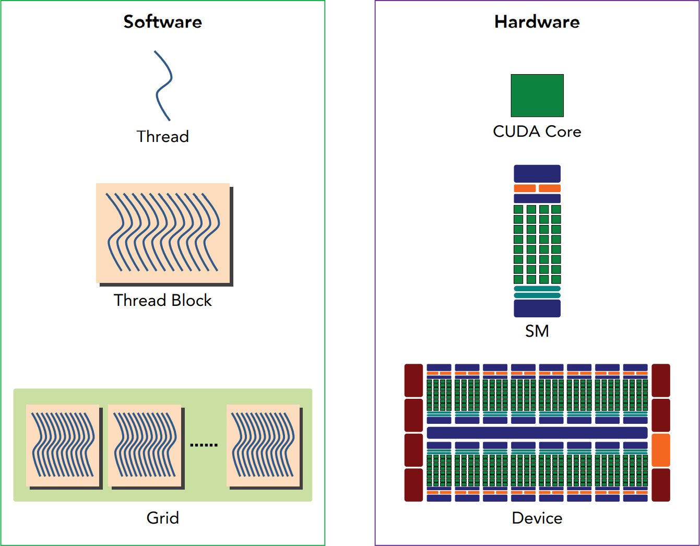

## 目录

[toc]

## 1.1 CUDA 基本概念

参考资料

* [CUDA 在线文档](http://docs.nvidia.com/cuda/index.html)

### 1.1.1 异构计算

同构计算：使用同一架构下一个或多个处理器来执行一个应用。

异构计算：使用多个处理器架构来执行一个应用。

为任务选定合适它的架构，使其最终对性能有所改善。

#### 1.1.1.1 异构计算架构

一个典型的异构计算架构包括一个多核 CPU 插槽和多个众核 GPU 插槽。


GPU 并不是一个独立运行的计算平台，而需要与 CPU 协同工作，可以看成是 CPU 的协处理器，因此当我们在说 GPU 并行计算时，其实是指的基于CPU+GPU 的**异构计算架构**。在异构计算架构中，GPU 与 CPU 通过 **PCIe 总线**连接在一起来协同工作，CPU 所在位置称为为<u>主机端（host）</u>，而 GPU 所在位置称为<u>设备端（device）</u>，如上图所示。

可以看到 GPU 包括<u>更多的运算核心</u>，其特别适合数据并行的**计算密集型任务**，如大型矩阵运算，而 CPU 的<u>运算核心较少</u>，但是其可以实现复杂的逻辑运算，因此其适合**控制密集型任务**。另外，CPU 上的线程是重量级的，上下文切换开销大，但是 GPU 由于存在很多核心，其线程是轻量级的。因此，基于 CPU+GPU 的异构计算平台可以优势互补，CPU 负责处理逻辑复杂的串行程序，而 GPU 重点处理数据密集型的并行计算程序，从而发挥最大功效。


综上所述，一个**异构代码应包含两部分**：

- 主机代码，在 CPU 上运行，通常负责初始化，在设备端加载计算密集型任务之前，管理设备端的环境、代码和数据
- 设备代码，在 GPU 上运行，运行计算密集型任务，提高这些任务并行数据程序段的执行速度

#### 1.1.1.2 异构计算指标

<u>CUDA 核心数量</u>和 <u>GPU 内存大小</u>是衡量 GPU **容量**的两个重要指标，相应也有两种不同指标来评估 GPU 性能：

- 峰值计算性能，用来评估计算容量，通常定义为<u>每秒能处理的单精度或双精度浮点运算的总量</u>，常用 `GFlops`（每秒10亿次浮点运算）或 `TFlops`（每秒万亿次浮点运算）来表示
- 内存带宽，是从内存中读取获奖写入数据的比率，常用 `GB/s` 表示

NVIDIA 使用一个术语 “计算能力”（compute capability）来描述 GPU 加速器的算力。

【注】NVIDIA 的 GPU 计算产品和使用的 GPU 架构：

| 产品系列 | 说明                       | 例子                                                         |
| -------- | -------------------------- | ------------------------------------------------------------ |
| Tegra    | 专为移动和嵌入式设备而设计 | Tegra K1 包含一个 Kepler GPU                                 |
| GeForce  | 面向图形用户               |                                                              |
| Quadro   | 用于专业绘图设计           |                                                              |
| Tesla    | 用于大规模的并行计算       | 主版本 NO-1 是 Tesla 架构<br/>主版本 NO-2 是 Fermi 架构<br/>主版本 NO-3 是 Kepler 架构 |

#### 1.1.1.3 异构计算平台

##### CUDA 计算平台

2006年，NVIDIA公司发布了 [CUDA](http://docs.nvidia.com/cuda/)，CUDA 是建立在 NVIDIA 的 GPUs 上的一个**通用并行异构计算平台**，基于 CUDA 编程可以利用 GPUs 的并行计算引擎来更加高效地解决比较复杂的计算难题。

CUDA 可以通过 CUDA加速库、编译器指令、应用程序接口和程序语言（C/C++，Python，Fortran，LLVM）扩展来使用，如下图所示。通过 GPU 编程的简易接口，可以快速构建基于 GPU 计算的应用程序。


CUDA 提供了两层 API 来管理 GPU 设备和组织线程，如下图所示：

- CUDA driver API，是一种低级 API，较难编程，但在 GPU 设备使用上提供了更多的控制
- CUDA Runtime API，是一个高级 API，在 driver API 之上实现


一般基于 Driver API 的开头会是 `cu`，而基于 Runtime API 的开头是 `cuda`。这两个 API 之间并**没有明显的性能差异**，对性能影响更大的是使用**内存和组织线程的方式**。需注意的是这两种 API 是相互排斥的，只能使用两者之一，无法从两者中混合调用函数。

##### CUDA 开发组件

在安装 CUDA 的时候，会安装三个大的组件：

* NVIDIA 驱动：用来控制 gpu 硬件
* toolkit：包括 **nvcc 编译器**、Nsight 调试工具（支持 Eclipse 和 VS，linux 用 `cuda-gdb`）、分析调试工具、数学库和帮助文档
* samples：相当于 SDK，里面包括很多样例程序包括查询设备、带宽测试等等

**nvcc 编译过程**

与其他异构代码一样，CUDA 程序包含了在 CPU 上运行的 host 代码和在 GPU 上运行的 device 代码，它通过 nvcc 编译器转换为计算机可执行的程序。所以 nvcc 编译器要保证两部分代码能够编译成二进制文件在不同的机器上执行。

nvcc 编译器在编译过程中将设备代码从主机代码中分离出来，如下图所示：

* 主机代码是标准的 ANSI C 代码，将使用 C 编译器进行编译
* 设备代码即核函数，用 CUDA C 进行编写，将通过 nvcc 进行编译
* 到链接阶段，在内核程序调用和显示 GPU 设备操作中添加 CUDA 运行时库


CUDA 编译的内容详见 [DN220316_CUDA编译初步](DN220316_CUDA编译初步.md).

**nvcc 编译扩展**

CUDA nvcc 编译器是以广泛使用 LLVM 开源编译系统为基础的。在 GPU 加速器的支持下，通过使用 CUDA 编译器 SDK，可以创建或扩展编程语言，如图所示。


nvcc 已经封装了几种内部编译工具，如 C 语言编译器、C++ 语言编译器。

## 1.2 CUDA 编程基础

### 1.2.1 执行流程

CPU 和 GPU 的功能互补性导致了 CPU+GPU 异构并行计算架构的发展，为获得最佳性能，可以同时使用 CPU 和 GPU 来执行应用程序，在 CPU 上执行串行或任务并行部分，在 GPU 上执行数据密集并行部分，如下图所示。


NVIDIA 开发了一种 <u>CUDA 编程模型</u>来支持这种编程方式，典型的 CUDA 程序的执行流程如下。

1. 分配 host 内存，并进行数据初始化
2. 分配 device 内存，并从 host 将数据拷贝到 device 上
3. 调用 CUDA 的核函数在 device 上完成指定的运算
4. 将 device 上的运算结果拷贝到 host 上
5. 释放 device 和 host 上分配的内存

CUDA 编程模型详细内容见 [02 CUDA 编程模型](02 CUDA 编程模型.md).

### 1.2.2 三类函数

在异构模型中，需要区分 host 和 device 上的代码，于是 CUDA 通过**函数类型限定词**实现。

* `__global__`

  在 device 上执行，从 host 中调用（一些特定的 GPU 也可以从 device 上调用），返回类型必须是 `void`，不支持可变参数参数，不能成为类成员函数。

  【注】用 `__global__` 定义的 kernel 是异步的，这意味着 host 不会等待 kernel 执行完就执行下一步。

* `__device__`

  在 device 上执行，仅可以从 device 中调用，不可以和 `__global__` 同时用。

* `__host__`

  在 host 上执行，仅可以从 host 上调用，一般省略不写，不可以和 `__global__` 同时用，但可和 `__device__` 同时用，此时函数会在 device 和 host 上都编译。

### 1.2.3 线程层次结构

**核函数 kernel 是在 device 上线程中并行执行的函数**，用 `__global__` 符号声明，在调用时需要用 `<<<grid, block>>>` 来指定 kernel要执行的线程数。在 CUDA 中，每一个线程都要执行核函数，并且每个线程会分配一个唯一的线程号 thread ID，这个 ID 值可以通过核函数的内置变量 `threadIdx` 来获得。

knernel 的线程层次结构如下：


* 网格（grid）

  kernel 在 device 上执行时实际上是启动很多线程，一个 kernel 所<u>启动的所有线程</u>统称为一个 grid，同一个 grid 上的线程共享相同的**全局内存**空间，这是第一个层次。

  grid 各个维度的大小可以通过线程内置变量 `gridDim` 获得。

* 线程块（block）

  网格又可以分为很多线程块（block），一个线程块里面包含很多线程，这是第二个层次。

  block 的组织结构可以通过线程的内置变量 `blockDim` 来获得。

所以，一个线程需要两个内置的坐标变量 `(blockIdx，threadIdx)` 来唯一标识，它们都是 `dim3` 类型变量。其中 `blockIdx` 指明线程所在 grid 中的位置，而 `threaIdx` 指明线程所在 block 中的位置，如上图中的 `Thread (1,1)` 满足：

```
threadIdx.x = 1
threadIdx.y = 1
blockIdx.x  = 1
blockIdx.y  = 1
```

而每个线程的全局 id 由坐标变量和 `gridDim`、`blockDim` 共同计算得出，kernel 的这种线程组织结构天然适合 vector，matrix 等运算。

### 1.2.4 内存层次结构

数据局部性在并行编程中是一个非常重要的概念，它指的是数据重用以降低内存访问的延迟，包括两种基本类型：

* 时间局部性：指在相对较短的时间段内数据和/或资源的重用
* 空间局部性：指在相对较接近的存储空间内数据元素的重用

CUDA 也拥有内存上的层次结构来支持数据局部性，其内存模型如下图所示。每个线程有自己的<u>私有本地内存</u>（Local Memory），而每个线程块又包含<u>共享内存</u>（Shared Memory），可以被线程块中所有线程共享，其生命周期与线程块一致。共享内存可以视为一个**被软件管理的高速缓存**，通过为主内存节省带宽来大幅度提高运行速度，直接控制代码的数据局部性。


此外，所有的线程都可以访问<u>全局内存</u>（Global Memory）。还可以访问一些只读内存块：<u>常量内存</u>（Constant Memory）和<u>纹理</u>内存（Texture Memory）。内存结构**涉及到程序优化**，这里先不深入探讨它们。

### 1.2.5 硬件基础

GPU 硬件的一个核心组件是 SM，英文名是 Streaming Multiprocessor，翻译过来就是流式多处理器，其核心组件包括 CUDA 核心、共享内存、寄存器等（详见 [3.1.1 GPU 架构概述](03 CUDA 执行模型.md#3-1-1-GPU-架构概述)）。SM 可以并发地执行数百个线程，并发能力就取决于 SM 所拥有的资源数。

当一个 kernel 被执行时，它在 gird 中的线程块被分配到 SM 上。一个线程块只能在一个 SM 上被调度，但一个 SM 一般可以调度多个线程块，这要看 SM 本身的能力。所以 <u>grid 只是逻辑层，而 SM 才是执行的物理层</u>。



SM 采用的是 [SIMT](http://docs.nvidia.com/cuda/cuda-c-programming-guide/index.html#simt-architecture) (Single-Instruction, Multiple-Thread，单指令多线程) 架构，基本的执行单元是<u>线程束</u>（wraps)，一个线程束包含 32 个线程，这些线程同时执行**相同的指令**，但是每个线程都包含自己的指令地址计数器和寄存器状态，也有自己独立的执行路径。所以尽管线程束中的线程同时从同一程序地址执行，但是可能具有不同的行为，比如遇到了分支结构，一些线程可能进入这个分支，但是另外一些有可能不执行，它们只能死等。

当线程块被划分到某个 SM 上时，它将进一步划分为多个线程束，因为这才是 SM 的**基本执行单元**。然后 SM 要为每个线程块分配共享内存，也要为每个线程束中的线程分配独立的寄存器。由于资源的限制，SM 的配置会影响其所支持的线程块和线程束并发数量。

总之，

* 网格和线程块只是逻辑划分，一个 kernel 的所有线程其实在物理层是**不一定同时并发的**
* kernel 的 grid 和 block 的配置不同，性能就会出现差异，这点是要特别注意的
* 由于 SM 的基本执行单元是包含 32 个线程的线程束，所以 block 大小一般要**设置为 32 的倍数**

### 1.2.6 HelloWorld

#### 1.2.6.1 硬件配置检查

**检查 GPU 存在**

```shell
$ ls -l /dev/nv*
crw-rw-rw- 1 root root 195,   0 2月  19 19:39 /dev/nvidia0
crw-rw-rw- 1 root root 195,   1 2月  19 19:39 /dev/nvidia1
crw-rw-rw- 1 root root 195,   2 2月  19 19:39 /dev/nvidia2
crw-rw-rw- 1 root root 195,   3 2月  19 19:39 /dev/nvidia3
crw-rw-rw- 1 root root 195,   4 2月  19 19:39 /dev/nvidia4
crw-rw-rw- 1 root root 195,   5 2月  19 19:39 /dev/nvidia5
crw-rw-rw- 1 root root 195,   6 2月  19 19:39 /dev/nvidia6
crw-rw-rw- 1 root root 195,   7 2月  19 19:39 /dev/nvidia7
crw-rw-rw- 1 root root 195,   8 2月  19 19:39 /dev/nvidia8
crw-rw-rw- 1 root root 195,   9 2月  19 19:39 /dev/nvidia9
```

**检查 nvcc 编译器**

```shell
$ which nvcc
/usr/local/cuda/bin/nvcc
```

**检查 GPU 硬件配置**

在进行 CUDA 编程前，可以先检查一下自己的 GPU 的硬件配置，这样才可以有的放矢。

```c++
int dev = 0;
cudaDeviceProp devProp;
CHECK(cudaGetDeviceProperties(&devProp, dev));
std::cout << "使用 GPU device " << dev << ": " << devProp.name << std::endl;
std::cout << "SM 的数量：" << devProp.multiProcessorCount << std::endl;
std::cout << "每个线程块的共享内存大小：" << devProp.sharedMemPerBlock / 1024.0 << " KB" << std::endl;
std::cout << "每个线程块的最大线程数：" << devProp.maxThreadsPerBlock << std::endl;
std::cout << "每个 SM 的最大线程数：" << devProp.maxThreadsPerMultiProcessor << std::endl;
std::cout << "每个 SM 的最大线程束数：" << devProp.maxThreadsPerMultiProcessor / 32 << std::endl;

// 输出如下
使用 GPU device 0: GeForce GT 730
SM 的数量：2
每个线程块的共享内存大小：48 KB
每个线程块的最大线程数：1024
每个 SM 的最大线程数：2048
每个 SM 的最大线程束数：64
```

详见 [02 CUDA 编程模型 - 2.4 设备管理](02 CUDA 编程模型.md#2-4-设备管理)。

#### 1.2.6.2 基本编程步骤

下面是一个 HelloWorld 的例子。

1. 用专用扩展名 `.cu` 来创建一个源文件 `hello.cu`

   ```c
   #include <stdio.h>
   
   __global__ void helloFromGPU(void):
   {
       printf("Hello World from GPU!\n");
   }
   
   int main() 
   {
       // Hello from CPU
       printf("Hello World from CPU!\n");
       // Hello from GPU
       helloFromGPU<<<1,10>>>();
       
       // 显示地释放和清空当前进程中与当前设备有关的所有资源
       cudaDeviceReset();
       return 0;
   }
   ```

   这里用 C 语言编写。

   【注】如果忘记 `cudaDeviceReset()` 释放资源，编译运行后没有输出。

2. 使用 CUDA nvcc 编译器来编译程序

   ```shell
   $ nvcc -arch sm_20 hello.cu -o hello # 开关语句 -arch sm_20 使编译器为 Fermi 架构生成设备代码
   ```

   CUDA nvcc 编译器和 gcc 编译器及其他编译器有**相似的语义**。

   【注1】在执行这条语句时需要根据自己显卡的架构修改相应的架构选项，详见[此处](https://link.zhihu.com/?target=https%3A//arnon.dk/matching-sm-architectures-arch-and-gencode-for-various-nvidia-cards/)。

   【注2】`nvcc x.cu` 是最简单的编译器指令，它是 `nvcc x.cu --gpu-architecture=compute_30 --gpucode=sm_30,compute_30` 的默认形式。

3. 从命令行运行生成可执行文件 `hello`

   ```shell
   $ ./hello
   Hello World from GPU!
   Hello World from GPU!
   Hello World from GPU!
   Hello World from GPU!
   Hello World from GPU!
   Hello World from GPU!
   Hello World from GPU!
   Hello World from GPU!
   Hello World from GPU!
   Hello World from GPU!
   ```

   每个线程输出一条字符串，10 个线程输出 10 条。

下面是一个矩阵加法的例子。

> 利用上图 2-dim 的 block 结构实现两个矩阵的加法，每个线程负责处理每个位置的两个元素相加，代码如下所示。线程块大小为 `(16, 16)`，然后将 `N*N` 大小的矩阵均分为不同的线程块来执行加法运算。

```c++
// Kernel 定义
__global__ void MatAdd(float A[N][N], float B[N][N], float C[N][N]) 
{ 
    int i = blockIdx.x * blockDim.x + threadIdx.x;
    int j = blockIdx.y * blockDim.y + threadIdx.y;
    if (i < N && j < N) 
        C[i][j] = A[i][j] + B[i][j]; 
}

int main() 
{
    ...
    // Kernel 线程配置
    dim3 threadsPerBlock(16, 16); 
    dim3 numBlocks(N / threadsPerBlock.x, N / threadsPerBlock.y);
    // kernel 调用
    MatAdd<<<numBlocks, threadsPerBlock>>>(A, B, C); 
    ...
}
```

## 1.3 CUDA 操作实践

### 向量加法示例

#### 内存管理 API

`cudaMalloc` 函数：在 device 上分配内存

```c++
cudaError_t cudaMalloc(void** devPtr, size_t size);		// 在 device 上分配内存
```

这个函数和 C 语言中的 `malloc` 类似，但是在 device 上申请一定字节大小的显存，其中 `devPtr` 是指向所分配内存的指针。同时要释放分配的内存使用 `cudaFree` 函数，这和 C 语言中的 `free` 函数对应。

`cudaMemcpy` 函数：负责 `host` 和 `device` 之间数据通信

```c++
cudaError_t cudaMemcpy(void* dst, const void* src, size_t count, cudaMemcpyKind kind);
```

其中 `src` 指向数据源，而 `dst` 是目标区域，`count` 是复制的字节数，其中 `kind` 控制复制的方向（`cudaMemcpyHostToHost`, `cudaMemcpyHostToDevice`, `cudaMemcpyDeviceToHost` 及 `cudaMemcpyDeviceToDevice`）

#### 加法实例

这里 **grid 和 block 都设计为 1-D**，首先定义 kernel 如下：

```c++
// 两个向量加法 kernel，grid 和 block 均为一维
__global__ void add(float* x, float * y, float* z, int n)
{
    // 获取全局索引
    int index = threadIdx.x + blockIdx.x * blockDim.x;
    // 步长
    int stride = blockDim.x * gridDim.x;
    for (int i = index; i < n; i += stride)
    {
        z[i] = x[i] + y[i];
    }
}
```

其中 stride 是整个 grid 的线程数，有时候向量的元素数很多，这时候可以在每个线程实现 `n` 个元素（元素总数/线程总数）的加法，相当于使用了多个 grid 来处理，这是一种 [grid-stride loop](https://devblogs.nvidia.com/cuda-pro-tip-write-flexible-kernels-grid-stride-loops/) 方式。

```c++
int main()
{
    int N = 1 << 20;
    int nBytes = N * sizeof(float);
    // 申请 host 内存
    float *x, *y, *z;
    x = (float*)malloc(nBytes);
    y = (float*)malloc(nBytes);
    z = (float*)malloc(nBytes);

    // 初始化数据
    for (int i = 0; i < N; ++i)
    {
        x[i] = 10.0;
        y[i] = 20.0;
    }

    // 申请 device 内存
    float *d_x, *d_y, *d_z;
    cudaMalloc((void**)&d_x, nBytes);
    cudaMalloc((void**)&d_y, nBytes);
    cudaMalloc((void**)&d_z, nBytes);

    // 将 host 数据拷贝到 device
    cudaMemcpy((void*)d_x, (void*)x, nBytes, cudaMemcpyHostToDevice);
    cudaMemcpy((void*)d_y, (void*)y, nBytes, cudaMemcpyHostToDevice);
    // 定义 kernel 的执行配置
    // 		直接用 N/block.size，当 N<block.size 时会有问题。
    // 		例如： int a = 255/256; 在 c++中得到的结果是 0, 需要向上取整。
    // 			  (255+256 -1)/256 = 1 就 ok。
    dim3 blockSize(256);
    dim3 gridSize((N + blockSize.x - 1) / blockSize.x);
    // 执行 kernel
    add << < gridSize, blockSize >> >(d_x, d_y, d_z, N);

    // 将 device 得到的结果拷贝到 host
    cudaMemcpy((void*)z, (void*)d_z, nBytes, cudaMemcpyHostToDevice);

    // 检查执行结果
    float maxError = 0.0;
    for (int i = 0; i < N; i++)
        maxError = fmax(maxError, fabs(z[i] - 30.0));
    std::cout << "最大误差: " << maxError << std::endl;

    // 释放 device 内存
    cudaFree(d_x);
    cudaFree(d_y);
    cudaFree(d_z);
    // 释放 host 内存
    free(x);
    free(y);
    free(z);

    return 0;
}
```

这里我们的向量大小为 `1<<20`，而 block 大小为 `256`，那么 grid 大小是 `4096`，kernel 的线程层级结构如下图所示：


#### 运行分析

使用 nvprof 工具可以分析 kernel 运行情况，结果如下所示，可以看到 kernel 函数费时约 1.5ms.

```shell
nvprof cuda9.exe
==7244== NVPROF is profiling process 7244, command: cuda9.exe
最大误差: 4.31602e+008
==7244== Profiling application: cuda9.exe
==7244== Profiling result:
            Type  Time(%)      Time     Calls       Avg       Min       Max  Name
 GPU activities:   67.57%  3.2256ms         2  1.6128ms  1.6017ms  1.6239ms  [CUDA memcpy HtoD]
                   32.43%  1.5478ms         1  1.5478ms  1.5478ms  1.5478ms  add(float*, float*, float*, int)
```

可以调整 block 的大小，对比不同配置下的 kernel 运行情况，我这里测试的是当 block 为 128 时，kernel 费时约 1.6ms，而 block 为 512 时 kernel 费时约 1.7ms，当 block 为 64 时，kernel 费时约 2.3ms。看来不是 block 越大越好，而要适当选择。

#### 内存改进

在上面的实现中，我们需要单独在 host 和 device 上进行内存分配，并且要进行数据拷贝，这是很容易出错的。好在 CUDA 6.0 引入统一内存（[Unified Memory](http://docs.nvidia.com/cuda/cuda-c-programming-guide/index.html#um-unified-memory-programming-hd)）来避免这种麻烦，简单来说这个统一内存使用一个托管内存来共同管理 host 和 device 中的内存，并且自动在host 和 device 中进行数据传输。CUDA 中使用 cudaMallocManaged 函数分配托管内存：

```c++
cudaError_t cudaMallocManaged(void **devPtr, size_t size, unsigned int flag=0);
```

利用统一内存，可以将上面的程序简化如下：

```c++
int main()
{
    int N = 1 << 20;
    int nBytes = N * sizeof(float);

    // 申请托管内存
    float *x, *y, *z;
    cudaMallocManaged((void**)&x, nBytes);
    cudaMallocManaged((void**)&y, nBytes);
    cudaMallocManaged((void**)&z, nBytes);

    // 初始化数据
    for (int i = 0; i < N; ++i)
    {
        x[i] = 10.0;
        y[i] = 20.0;
    }

    // 定义 kernel 的执行配置
    dim3 blockSize(256);
    dim3 gridSize((N + blockSize.x - 1) / blockSize.x);
    // 执行 kernel
    add << < gridSize, blockSize >> >(x, y, z, N);

    // 同步 device 保证结果能正确访问
    cudaDeviceSynchronize();
    // 检查执行结果
    float maxError = 0.0;
    for (int i = 0; i < N; i++)
        maxError = fmax(maxError, fabs(z[i] - 30.0));
    std::cout << "最大误差: " << maxError << std::endl;

    // 释放内存
    cudaFree(x);
    cudaFree(y);
    cudaFree(z);

    return 0;
}
```

相比之前的代码，使用统一内存更简洁了，值得注意的是 kernel 执行是与 host 异步的，由于托管内存自动进行数据传输，这里要用cudaDeviceSynchronize() 函数保证 device 和 host 同步，这样后面才可以正确访问 kernel 计算的结果。

### 矩阵乘法示例

#### 数据结构

最后再实现一个稍微复杂一些的例子，就是两个矩阵的乘法，设输入矩阵为和，要得到。实现思路是每个线程计算的一个元素值，对于矩阵运算，**应该选用 grid 和 block 为 2-D 的**。首先定义矩阵的结构体：

```c++
// 矩阵类型，行优先，M(row, col) = *(M.elements + row * M.width + col)
struct Matrix
{
    int width;
    int height;
    float *elements;
};
```

#### 编写函数

然后实现矩阵乘法的核函数，这里我们定义了两个辅助的 `__device__` 函数分别用于获取矩阵的元素值和为矩阵元素赋值。

```c++
 // 获取矩阵 A 的 (row, col) 元素值
__device__ float getElement(Matrix *A, int row, int col)
{
    return A->elements[row * A->width + col];
}

// 为矩阵 A 的 (row, col) 元素赋值
__device__ void setElement(Matrix *A, int row, int col, float value)
{
    A->elements[row * A->width + col] = value;
}

// 矩阵相乘 kernel，2-D，每个线程计算一个元素
__global__ void matMulKernel(Matrix *A, Matrix *B, Matrix *C)
{
    float Cvalue = 0.0;
    int row = threadIdx.y + blockIdx.y * blockDim.y;
    int col = threadIdx.x + blockIdx.x * blockDim.x;
    for (int i = 0; i < A->width; ++i)
    {
        Cvalue += getElement(A, row, i) * getElement(B, i, col);
    }
    setElement(C, row, col, Cvalue);
}
```

#### 实例测试

最后我们采用统一内存编写矩阵相乘的测试实例：

```c++
int main()
{
    int width = 1 << 10;
    int height = 1 << 10;
    Matrix *A, *B, *C;
    // 申请托管内存
    cudaMallocManaged((void**)&A, sizeof(Matrix));
    cudaMallocManaged((void**)&B, sizeof(Matrix));
    cudaMallocManaged((void**)&C, sizeof(Matrix));
    int nBytes = width * height * sizeof(float);
    cudaMallocManaged((void**)&A->elements, nBytes);
    cudaMallocManaged((void**)&B->elements, nBytes);
    cudaMallocManaged((void**)&C->elements, nBytes);

    // 初始化数据
    A->height = height;
    A->width = width;
    B->height = height;
    B->width = width;
    C->height = height;
    C->width = width;
    for (int i = 0; i < width * height; ++i)
    {
        A->elements[i] = 1.0;
        B->elements[i] = 2.0;
    }

    // 定义 kernel 的执行配置
    dim3 blockSize(32, 32);
    dim3 gridSize((width + blockSize.x - 1) / blockSize.x, 
        (height + blockSize.y - 1) / blockSize.y);
    // 执行 kernel
    matMulKernel << < gridSize, blockSize >> >(A, B, C);


    // 同步 device 保证结果能正确访问
    cudaDeviceSynchronize();
    // 检查执行结果
    float maxError = 0.0;
    for (int i = 0; i < width * height; ++i)
        maxError = fmax(maxError, fabs(C->elements[i] - 2 * width));
    std::cout << "最大误差: " << maxError << std::endl;

    return 0;
}
```

#### 结果分析

这里矩阵大小为，设计的线程的 block 大小为 `(32, 32)`，那么 grid 大小为 `(32, 32)`，最终测试结果如下：

```shell
nvprof cuda9.exe
==16304== NVPROF is profiling process 16304, command: cuda9.exe
最大误差: 0
==16304== Profiling application: cuda9.exe
==16304== Profiling result:
            Type  Time(%)      Time     Calls       Avg       Min       Max  Name
 GPU activities:  100.00%  1.32752s         1  1.32752s  1.32752s  1.32752s  matMulKernel(Matrix*, Matrix*, Matrix*)
      API calls:   83.11%  1.32762s         1  1.32762s  1.32762s  1.32762s  cudaDeviceSynchronize
                   13.99%  223.40ms         6  37.233ms  37.341us  217.66ms  cudaMallocManaged
                    2.81%  44.810ms         1  44.810ms  44.810ms  44.810ms  cudaLaunch
                    0.08%  1.3300ms        94  14.149us       0ns  884.64us  cuDeviceGetAttribute
                    0.01%  199.03us         1  199.03us  199.03us  199.03us  cuDeviceGetName
                    0.00%  10.009us         1  10.009us  10.009us  10.009us  cuDeviceTotalMem
                    0.00%  6.5440us         1  6.5440us  6.5440us  6.5440us  cudaConfigureCall
                    0.00%  3.0800us         3  1.0260us     385ns  1.5400us  cudaSetupArgument
                    0.00%  2.6940us         3     898ns     385ns  1.5390us  cuDeviceGetCount
                    0.00%  1.9250us         2     962ns     385ns  1.5400us  cuDeviceGet

==16304== Unified Memory profiling result:
Device "GeForce GT 730 (0)"
   Count  Avg Size  Min Size  Max Size  Total Size  Total Time  Name
    2051  4.0000KB  4.0000KB  4.0000KB  8.011719MB  21.20721ms  Host To Device
     270  45.570KB  4.0000KB  1.0000MB  12.01563MB  7.032508ms  Device To Host
```

当然，这不是最高效的实现，后面可以继续优化 ……