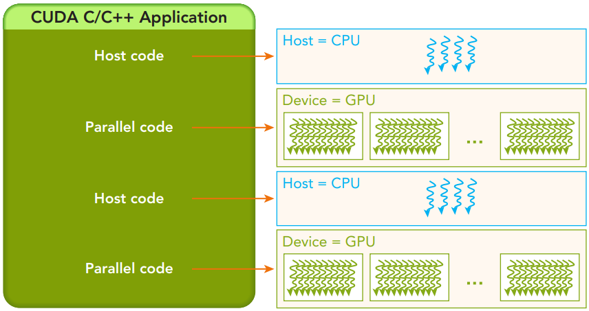
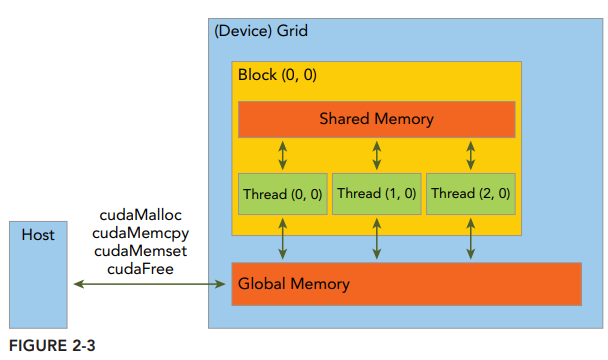
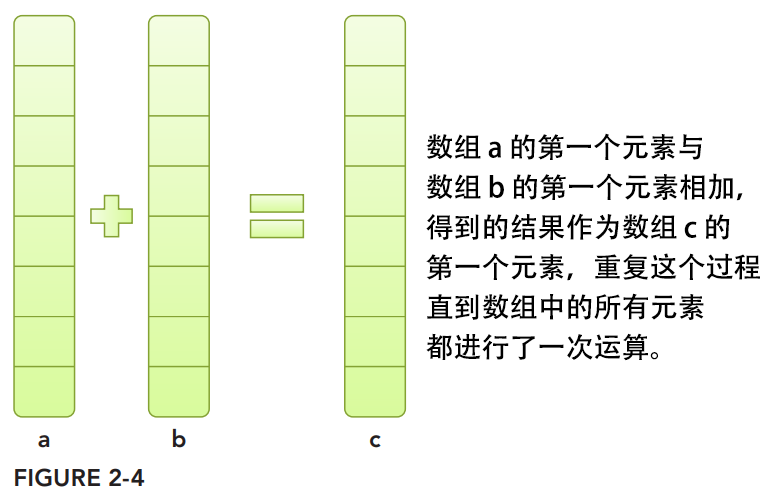
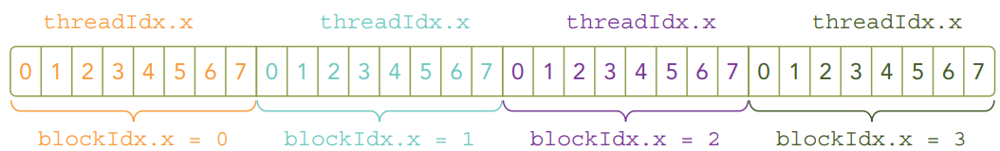
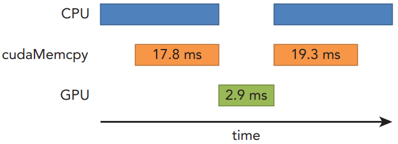
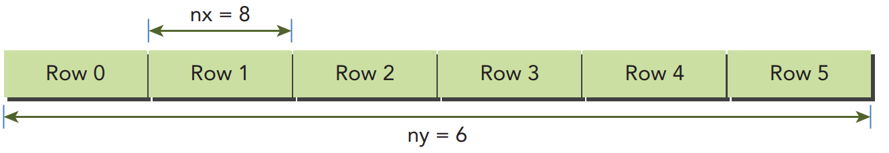
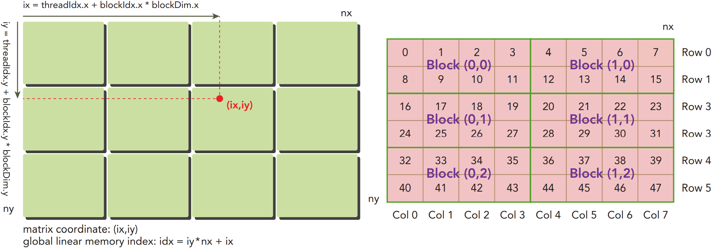
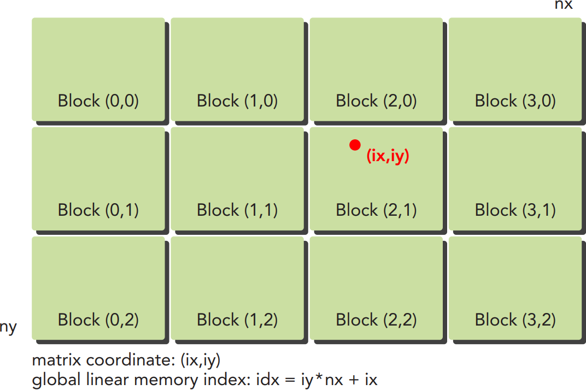
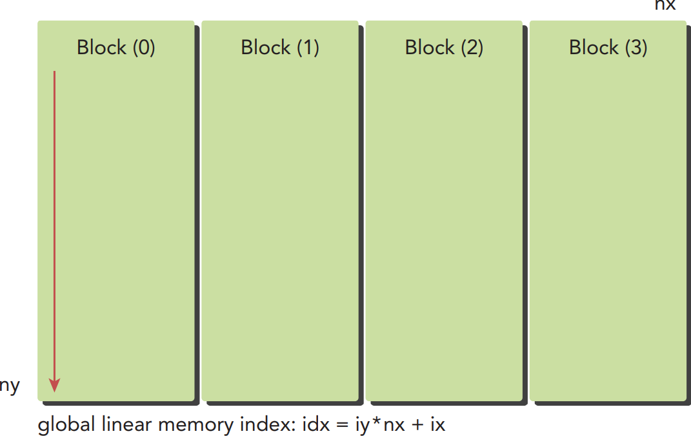
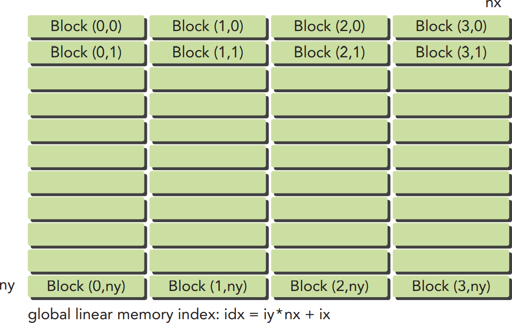

## 目录

[toc]

## 2.1 概述

CUDA 编程模型与其他并行编程模型一样，提供了对系统底层共有的抽象，搭建了应用程序和其可用硬件之间的**桥梁**。

除此之外，CUDA 编程模型还利用 GPU 架构的计算能力，提供了以下几个特有功能：

* 一种通过层次结构在 GPU 中组织线程的方法（第 2、3 章）
* 一种通过层次结构在 GPU 中访问内存的方法（第 4、5 章）

### 2.1.1 编程结构

在一个异构环境中包含多个 CPU 和 GPU，每个 GPU 和 CPU 的内存都由一条 PCI-Express 总线分隔开，因此需要注意区分以下内容：

* 主机 (host)：CPU 及其内存（主机内存），在代码中变量名以 `h_` 为前缀
* 设备 (device)：GPU 及其内存（设备内存），在代码中变量名以 `d_` 为前缀

一个典型的 CUDA 程序包括并行代码和串行代码，如下图所示：



串行代码（及任务并行代码）在主机 CPU 上执行，而并行代码在 GPU 上执行。主机代码使用 ANSI C 语言编写，而设备代码使用 CUDA C 语言进行编写，NVIDIA的 C 编译器（nvcc）会将它们进行编译生成可执行代码。

根据 [01 CUDA 概述 - 1.2 CUDA 编程基础](01 CUDA 概述.md#1-2-CUDA-编程基础) 的 CUDA 程序执行流程，一个典型的 CUDA 程序实现流程遵循以下模式：

1. 把数据从 CPU 内存拷贝到 GPU 内存
2. 调用核函数对存储在 GPU 内存中的数据进行操作
3. 将数据从 GPU 内存传送回到 CPU 内存

### 2.1.2 内存管理

#### 2.1.2.1 内存管理函数

host 和 device 拥有各自独立的内存，相关的内存管理函数如下，CUDA 函数的接口**沿用 C 标准**，使得相关程序能够轻松接入。

| 标准的 C 函数 | CUDA C 函数   |
| ------------- | ------------- |
| `malloc`      | ` cudaMalloc` |
| `memcpy`      | `cudaMemcpy`  |
| `memset`      | `cudaMemset`  |
| `free`        | `cudaFree`    |

* `cudaError_t cudaMalloc ( void** devPtr, size_t size )` - 执行 device 内存分配

  该函数负责向设备分配一定字节的线性内存，并以 `devPtr` 的形式返回指向所分配内存的指针。

  【注】为了向指针赋值，需要传入指针的地址（传址），因此 `devPtr` 是双重指针。

* `cudaError_t cudaMemcpy ( void* dst, const void* src, size_t count, cudaMemcpyKind kind )` - 负责 host 和 device 之间的数据传输

  此函数从 `src` 指向的源存储区复制一定数量的字节到 `dst` 指向的目标存储区。复制方向由 `kind` 指定，有以下几种：

  * `cudaMemcpyHostToHost`
  * `cudaMemcpyHostToDevice`
  * `cudaMemcpyDeviceToHost`
  * `cudaMemcpyDeviceToDevice`

  【注1】 在 `cudaMemcpy` 函数返回以及传输操作完成之前主机应用程序是阻塞的，因此这个函数以**同步**方式执行，除了 kernel 启动之外的 CUDA 调用都会返回一个有关错误的枚举类型 `cuda Error_t`.

  【注2】如果 GPU 内存分配成功，函数返回 `cudaSuccess`，否则返回 `cudaErrorMemoryAllocation`.

  【注3】属于枚举类型 `cuda Error_t` 的 `cudaErrorMemoryAllocation` 可以用 `char* cudaGetErrorString(cudaError_t error)` 转化为可读消息，类似 C 中的 `strerror()` 函数。

#### 2.1.2.2 内存层次结构

根据 [01 CUDA 概述 - 1.2 CUDA 编程基础](01 CUDA 概述.md#1-2-CUDA-编程基础) 可知 CUDA 编程模型的内存层次结构，其中最重要的是

* 全局内存（Global Memory）-  类似 CPU 的内存，处于网格级别
* 共享内存（Shared Memory)  -  类似 CPU 的缓存，处于线程块级别
* 局部内存（Local Memory）- 类似 CPU 的寄存器，处于线程级别



#### 2.1.2.3 案例：两个数组相加

算法逻辑如图所示：



代码如下：

* 主机端代码：代码清单 2-1  [sumArraysOnHost.c](src\chapter02\sumArraysOnHost.c)

  这个纯 C 语言文件可以用 C 语言编译器进行编译，也可以使用 nvcc 进行编译：

  ```sh
  $ nvcc -Xcompiler -std=c99 sumArraysOnHost.c –o sum
  $ ./sum
  ```

  其中  `-Xcompiler` 用于指定命令行选项是指向 C 编译器还是预处理器，`-std=c99` 指明 C 程序是按照 C99 标准编写的。

* 设备端代码：对主机端代码进行如下改动即可

  ```c
  // 用 cudaMalloc 在 GPU 上申请内存
  float *d_A, *d_B, *d_C;
  cudaMalloc((float**)&d_A, nBytes);
  cudaMalloc((float**)&d_B, nBytes);
  cudaMalloc((float**)&d_C, nBytes);
  
  // 使用 cudaMemcpy 函数把数据从主机内存拷贝到 GPU 的全局内存中
  // 参数 cudaMemcpyHostToDevice 指定数据拷贝方向
  cudaMemcpy(d_A, h_A, nBytes, cudaMemcpyHostToDevice);
  cudaMemcpy(d_B, h_B, nBytes, cudaMemcpyHostToDevice);
  
  // ... 主机端调用核函数在 GPU 上进行数组求和，控制权权立刻被传回主机，内核/核函数与主机是异步的 ...
  
  // 用 cudaMemcpy 函数把结果从 GPU 复制回到主机的数组 gpuRef 中
  cudaMemcpy(gpuRef, d_C, nBytes, cudaMemcpyDeviceToHost);
  
  // 用 cudaFree 释放 GPU 的内存
  cudaFree(d_A);
  cudaFree(d_B);
  cudaFree(d_C);
  ```

  【注】用 CUDA C 进行编程的人最常犯的错误就是对不同内存空间的不恰当引用：

  ```c
  gpuRef = d_C;												// 错误
  cudaMemcpy(gpuRef, d_C, nBytes, cudaMemcpyDeviceToHost);	// 正确
  ```

  为了避免这类错误，CUDA 6.0 提出了**统一寻址**，使用一个指针来访问 CPU 和 GPU 的内存，详见 [4 全局内存](4 全局内存.md).

### 2.1.3 线程管理

#### 2.1.3.1 线程层次结构

当核函数在主机端启动时，它的执行会移动到设备端上，此时设备中会产生大量的线程，并且**每个线程都执行由核函数指定的语句**。

根据 [01 CUDA 概述 - 1.2 CUDA 编程基础](01 CUDA 概述.md#1-2-CUDA-编程基础) 可知 CUDA 编程模型**两层的**线程层次结构，其中最重要的是：

* 网格（grid）

  由一个核函数 (kernel) 所<u>启动的所有线程</u>统称为一个网格，同一个网格上的线程共享相同的**全局内存**空间。

* 线程块（block）

  一个网格由多个线程块构成，一个线程块包含一组线程。

线程依靠以下两个坐标变量来区分彼此，它们由内核函数<u>预定义</u>：

* `blockIdx` - 网**格内的线程**块索引，`uint3` 类型，包含属性 `x`, `y`, `z`
* `threadIdx` -  线程**块内的线程**索引，`uint3` 类型，包含属性 `x`, `y`, `z`

网格和线程块的大小由以下两个变量规定，它们由用户<u>自定义</u>：

* `gridDim` - 线程格的维度，用每个线程**格中的线程块数**来表示，`dim3` 类型，包含属性 `x`, `y`, `z`

* `blockDim` - 线程块的维度，用每个线程**块中的线程数**来表示，`dim3` 类型，包含属性 `x`, `y`, `z`

【注1】定义 `dim3` 类型的变量时，所有未指定的元素都被<u>初始化</u>为 `1`，对应的 `uint3` 变量为 `0`.

【注2】通常组织 `gridDim` 为线程块的<u>二维数组</u>，`blockDim` 为线程的<u>三维数组</u>。

【注3】不同线程块内的线程不能协作，同一线程块内的线程协作可以通过**同步、共享内存**的方式实现。

#### 2.1.3.2 线程层次管理

##### 线程维度管理

在主机端，可以使用 `dim3` 数据类型定义一个网格和块的维度，来作为内核调用的一部分。然后到核函数执行时，CUDA runtime 会内置预初始化相应的网格、线程块和线程变量，它们在核函数内均可被访问到且为 `unit3` 类型。

完整程序见：代码清单 2-2  [checkDimension.cu](src\chapter02\checkDimension.cu) 

```c
// 定义程序所用的数据大小
int nElem = 6;

// 定义线程块的尺寸并基于块和数据的大小计算网格尺寸
// 网格大小要求是线程块大小的倍数：加上 block.x - 1 后再除，这样 nElem 中除不尽的被补足一个了，但也不会补过头
dim3 block(3);							// 包含 3 个线程的一维线程块
dim3 grid((nElem+block.x-1)/block.x);	// 基于块和数据大小定义的一定数量线程块的一维线程网格

// 主机端输出
printf("grid.x %d grid.y %d grid.z %d\n",grid.x, grid.y, grid.z);
printf("block.x %d block.y %d block.z %d\n",block.x, block.y, block.z);

// 设备端输出
printf("threadIdx:(%d, %d, %d) blockIdx:(%d, %d, %d) "
	   "blockDim:(%d, %d, %d) gridDim:(%d, %d, %d)\n", 
       threadIdx.x, threadIdx.y, threadIdx.z,
	   blockIdx.x,  blockIdx.y,  blockIdx.z,
       blockDim.x,  blockDim.y,  blockDim.z,
       gridDim.x,   gridDim.y,   gridDim.z);
```

```shell
$ nvcc -arch=sm_20 checkDimension.cu -o check
$ ./check
grid.x 2 grid.y 1 grid.z 1
block.x 3 block.y 1 block.z 1
threadIdx:(0, 0, 0) blockIdx:(1, 0, 0) blockDim:(3, 1, 1) gridDim:(2, 1, 1)
threadIdx:(1, 0, 0) blockIdx:(1, 0, 0) blockDim:(3, 1, 1) gridDim:(2, 1, 1)
threadIdx:(2, 0, 0) blockIdx:(1, 0, 0) blockDim:(3, 1, 1) gridDim:(2, 1, 1)
threadIdx:(0, 0, 0) blockIdx:(0, 0, 0) blockDim:(3, 1, 1) gridDim:(2, 1, 1)
threadIdx:(1, 0, 0) blockIdx:(0, 0, 0) blockDim:(3, 1, 1) gridDim:(2, 1, 1)
threadIdx:(2, 0, 0) blockIdx:(0, 0, 0) blockDim:(3, 1, 1) gridDim:(2, 1, 1)
```

【注】变量可见性

* 手动定义的 `dim3` 类型 `block` 和 `grid` 变量仅在主机端可见
* 内置预初始化的 `uint3` 类型 `blockDim` 和 `gridDim` 以及 `threadIdx` 和 `blockIdx` 仅在设备端可见

##### 线程维度设计

对于一个给定的数据大小，确定网格和块尺寸的一般步骤为：

- 确定块的大小，通常要考虑可利用的计算资源
  - 内核的性能特性，如块内协作特性
  - GPU 资源的限制，如寄存器、共享内存
- 在已知数据大小和块大小的基础上计算网格维度

### 2.1.4 核函数

#### 2.1.4.1 核函数定义

由 [01 CUDA 概述 - 1.2.2 三类函数](01 CUDA 概述.md#1-2-2-三类函数)，核函数的定义语法如下：

```c
__global__ void kernel_name(argument list);
```

它与另外两类函数的关系整理如下表。

| 限定符       | 执行         | 调用                              | 备注                                                         |
| ------------ | ------------ | --------------------------------- | ------------------------------------------------------------ |
| `__global__` | 在设备端执行 | 可从主机端调用<br/>可从设备端调用 | 显示异步行为<br/>必须返回 `void`<br/>不支持可变形参和静态变量<br/>只能访问设备内存<br/>设备端调用要求计算能力 $3\uparrow$ |
| `__device__` | 在设备端执行 | 仅能从设备端调用                  |                                                              |
| `__host__`   | 在主机端执行 | 仅能从主机端调用                  | 可以省略限定符                                               |

【注】`__device__` 和 `__host__` 可一起使用，使得函数可同时在主机和设备进行编译。

#### 2.1.4.2 核函数调用

从之前的代码清单中可以看到关于核函数调用的语法：

```c
// grid 是网格维度，即线程块的个数，不同于 gridDim
// block 是线程块维度，即每块线程的个数，等同于 blockDim
kernel_name <<<grid, block>>>(argument list);
```

因此，通过指定网格和线程块的维度，就可以配置核函数 (kernel) 中使用的线程布局——决定内核中线程的数目。

并且，核函数调用时，众多 CUDA 线程**同时执行同一个计算任务**，根据协作关系可能具有不同的行为 ([01 CUDA 概述 - 2.5 硬件基础](01 CUDA 概述.md#2-5-硬件基础))。

例 1：设由 32 个数据元素用于计算，每 8 个元素一个块，共启动 4 个块

```c
kernel_name<<<4, 8>>>(argument list);
```

 

例 2：所有 32 个元素放到一个块里

```c
kernel_name<<<1, 32>>>(argument list);
```

例 3：每个块只有一个元素，共 32 个块

```c
kernel_name<<<32, 1>>>(argument list);
```

#### 2.1.4.2 核函数异步

前面 [01 CUDA 概述 - 1.2.2 三类函数](01 CUDA 概述.md#1-2-2-三类函数) 也提到，核函数的调用与主机线程是**异步**的：核函数调用后控制权立刻返回给主机端。

**异步代替循环**

CUDA 编程的核心思想就是**<font color="red">利用核函数的异步特性来代替循环</font>**，从而降低运算时间。

下面是两个向量相加的例子，揭示了这种异步代替循环的思想。

```c
// 主机端的向量加法
void sumArraysOnHost(float *A, float *B, float *C, const int N) {
	for (int i = 0; i < N; i++)
		C[i] = A[i] + B[i];
}

// 调用
sumArraysOnHost(A, B, C, 32);
```

```c
// 设备端的向量加法
__global__ void sumArraysOnGPU(float *A, float *B, float *C) {
	int i = threadIdx.x;
	C[i] = A[i] + B[i];				// 内置的线程坐标代替数组索引
}

// 用 32 个线程调用核函数
sumArraysOnGPU<<<1,32>>>(A, B, C);;	// N 被用来隐式定义 N 个线程
```

**强制同步方法**

可以调用以下函数来**强制同步**，让主机端程序等待所有的核函数执行结束：

```c
cudaError_t cudaDeviceSynchronize(void);
```

例如，具有同步特性的核函数 `cudaMemcpy`，其内部必然有类似的同步调用。

#### 2.1.4.3 核函数验证

**主机函数验证法**

```c
void checkResult(float *hostRef, float *gpuRef, const int N) {
	double epsilon = 1.0E-8;
	int match = 1;
	for (int i = 0; i < N; i++) {
		if (abs(hostRef[i] - gpuRef[i]) > epsilon) {
			match = 0;
			printf("Arrays do not match!\n");
			printf("host %5.2f gpu %5.2f at current %d\n", hostRef[i], gpuRef[i], i);
			break;
		}
	}
	if (match) printf("Arrays match.\n\n");
	return;
}
```

**打印输出法**

在 Fermi 及更高版本的 GPU 上，在核函数中使用 `printf` 函数输出结构。

**单线程计算法**

将执行参数设置维 `<<<1,1>>>`，强制模拟串行执行程序，与并行执行的结果进行比较。

### 2.1.5 错误处理

CUDA 调用是异步的，为了定位某个错误的位置、简化错误检查过程，定义一个错误处理宏封装所有的 CUDA API 调用：

```c
#define CHECK(call)															\
{ 																			\
	const cudaError_t error = call;											\
	if (error != cudaSuccess)												\
	{																		\
		printf("Error: %s:%d, ", __FILE__, __LINE__); 						\
		printf("code:%d, reason: %s\n", error, cudaGetErrorString(error)); 	\
		exit(1); 															\
	} 																		\
}																			\
```

使用方法如下：

```c
CHECK(cudaMemcpy(d_C, gpuRef, nBytes, cudaMemcpyHostToDevice));
```

```c
kernel_function<<<grid, block>>>(argument list);
// 阻塞主机端的运行指定所有设备端的请求任务结束，并确保最后的核函数启动部分不会出错
CHECK(cudaDeviceSynchronize());
```

本节的完整代码如下：代码清单 2-4  [sumArraysOnGPU-small-case.cu](src\chapter02\sumArraysOnGPU-small-case.cu) 

## 2.2 计时

衡量核函数性能的方法很多，最容易的是测量**执行时间**，最简单的方法是在主机端使用一个 CPU 或 GPU **计时器**，计算内核的执行时间。

### 2.2.1 CPU 计时器

* `int gettimeofday(struct timeval *tv, struct timezone *tz )` - 获取系统时间

  时间函数，返回自 1970 年 1 月 1 日零点以来到现在的<u>秒数</u>。

  这是 Linux C API，使用时需添加头文件 `sys/time.h`.

例 1：测试编写的核函数

```c
double cpuSecond() {
	struct timeval tp;
	gettimeofday(&tp, NULL);
	return ((double)tp.tv_sec + (double)tp.tv_usec*1.e-6);
}

double iStart = cpuSecond();
kernel_name<<<grid, block>>>(argument list);
cudaDeviceSynchronize();  // 需强制同步，让主机等待 GPU 线程结束
double iElaps = cpuSecond() - iStart;
```

例 2：测试向量加法的核函数性能

代码清单 2-5  [sumArraysOnGPU-timer.cu](src\chapter02\sumArraysOnGPU-timer.cu)

```sh
$ nvcc sumArraysOnGPU-timer.cu -o sumArraysOnGPU-timer
$ ./sumArraysOnGPU-timer
./sumArraysOnGPU-timer Starting...
Using Device 0: Tesla M2070
Vector size 16777216
sumArraysOnGPU <<<16384, 1024>>> Time elapsed 0.002456 sec
Arrays match.
```

### 2.2.2 `nvprof` 工具

CUDA 5.0 以来提供了 `nvprof` 命令行分析工具：

```shell
$ nvprof [nvprof_args] <application> [application_args]
```

它从应用程序的 CPU 和 GPU 活动情况中获取时间线信息，包括内核执行、内存传输和 CUDA API 调用。 

例 1：获取帮助信息

```shell
$ nvprof --help # 获取帮助信息
```

例 2：测试内核（代码文件来自 [2.2.1 CPU 计时器](#2.2.1 CPU 计时器)）

```shell
$ nvprof ./sumArraysOnGPU-timer # 获取结果因 GPU 类型而异
./sumArraysOnGPU-timer Starting...
Using Device 0: Tesla M2070
==17770== NVPROF is profiling process 17770, command: ./sumArraysOnGPU-timer
Vector size 16777216
sumArraysOnGPU <<<16384, 1024>>> Time elapsed 0.003266 sec
Arrays match.
==17770== Profiling application: ./sumArraysOnGPU-timer
==17770== Profiling result:
Time(%) 	 Time 	Calls 		Avg 		Min 		Max 	Name
 70.35%  52.667ms 		3  17.556ms    17.415ms    17.800ms 	[CUDA memcpy HtoD]
 25.77%  19.291ms 		1  19.291ms    19.291ms    19.291ms 	[CUDA memcpy DtoH]
  3.88%  2.9024ms 		1  2.9024ms    2.9024ms    2.9024ms 	sumArraysOnGPU
(float*, float*, int)
```

从中可以看到，数据传输所用的时间远比数据运算要多，示意图如下：



【技1】数据运算时间 $>$ 数据传输时间，优化策略：压缩/并行化 (overlap) 运算操作

【技2】数据运算时间 $<$ 数据传输时间，优化策略：尽量减少主机和设备之间的传输

【注】大多数操作的主要性能限制还是来自于内存带宽，及数据传输。

## 2.3 组织并行线程

### 2.3.1 坐标映射

> **背景**
>
> 通常情况下，一个矩阵用行优先的方法在全局内存中线性存储，例如：
>
> 
>
> 因此，全局内存索引是线性的。

映射目标：已知当前线程的索引信息，找到全局内存中特定的矩阵元素

整体思路：块与线程索引 $\rightarrow$ 矩阵逻辑坐标 $\rightarrow$ 全局内存索引

* 把线程和块索引映射到矩阵坐标

  ```c
  ix = threadIdx.x + blockIdx.x * blockDim.x  // 以二维网格和二维块为例
  iy = threadIdx.y + blockIdx.y * blockDim.y  // 以二维网格和二维块为例
  ```

* 矩阵坐标映射到全局内存中的索引/存储单元

  ```c
  idx = iy * nx + ix
  ```



例：打印上述信息

代码清单 2-6  [checkThreadIndex.cu](src/checkThreadIndex.cu)

```shell
$ nvcc -arch=sm_20 checkThreadIndex.cu -o checkIndex
$ ./checkIndex
thread_id (2,1) block_id (1,0) coordinate (6,1) global index 14 ival 14
```

### 2.3.2 二维网格和二维块对矩阵求和

校验函数：验证矩阵加法核函数是否能得出正确的结果

```c
void sumMatrixOnHost (float *A, float *B, float *C, const int nx, const int ny) {
    float *ia = A;
    float *ib = B;
    float *ic = C;
    for (int iy=0; iy<ny; iy++) {
        for (int ix=0; ix<nx; ix++) {
            ic[ix] = ia[ix] + ib[ix];
        }
        ia += nx; ib += nx; ic += nx;
    }
}
```

核函数：采用二维网格和二维线程块来进行矩阵求和

 

```c
__global__ void sumMatrixOnGPU2D(float *MatA, float *MatB, float *MatC, int nx, int ny) {
    // 将每个线程从它的线程索引映射到全局线性内存索引中
    unsigned int ix = threadIdx.x + blockIdx.x * blockDim.x;
    unsigned int iy = threadIdx.y + blockIdx.y * blockDim.y;
    unsigned int idx = iy*nx + ix;
    // 在全局内存中执行加法
    if (ix < nx && iy < ny)
        MatC[idx] = MatA[idx] + MatB[idx];  // 每个线程执行一个加法
}
```

其他设置：

```c
// 设置每个维度下的矩阵大小为 16384
int nx = 1<<14;
int ny = 1<<14;

// 定义核函数的二维网格和二维块
int dimx = 32;
int dimy = 32;
dim3 block(dimx, dimy);
dim3 grid((nx + block.x - 1) / block.x, (ny + block.y - 1) / block.y);
```

整合代码并编译运行：代码清单 2-7  [sumMatrixOnGPU-2D-grid-2D-block.cu](src\chapter02\sumMatrixOnGPU-2D-grid-2D-block.cu) 

```shell
# 编译运行
$ nvcc -arch=sm_20 sumMatrixOnGPU-2D-grid-2D-block.cu -o matrix2D
$ ./matrix2D
./a.out Starting...
Using Device 0: Tesla M2070
Matrix size: nx 16384 ny 16384
sumMatrixOnGPU2D <<<(512,512), (32,32)>>> elapsed 0.060323 sec
Arrays match.
```

【注】`sumMatrixOnGPU2D` 在不同执行配置下的性能比较

| 内核配置 | 内核运行时间 | 线程块数    |
| -------- | ------------ | ----------- |
| (32,32)  | 0.060323 sec | 512 x 512   |
| (32,16)  | 0.038041 sec | 512 x 1024  |
| (16,16)  | 0.045535 sec | 1024 x 1024 |

从中可以发现，增加块的数量不一定能提升内核性能，其中的分析第 3 章的 [3.3 并行性的表现](03 CUDA 执行模型.md#3-3-并行性的表现)中讲解。

### 2.3.3 一维网格和一维块对矩阵求和

核函数：采用一维网格和一维线程块来进行矩阵求和

 

```c
__global__ void sumMatrixOnGPU1D(float *MatA, float *MatB, float *MatC, int nx, int ny) {
    // 将每个线程从它的线程索引映射到全局线性内存索引中
    unsigned int ix = threadIdx.x + blockIdx.x * blockDim.x;
    if (ix < nx ) {
        for (int iy=0; iy<ny; iy++) {
            int idx = iy*nx + ix;
            // 在全局内存中执行加法
            MatC[idx] = MatA[idx] + MatB[idx];  // 每个线程执行 ny 个加法
        }
    }
}
```

其他设置：

```c
// 设置每个维度下的矩阵大小为 16384
int nx = 1<<14;
int ny = 1<<14;

// 定义核函数的一维网格和一维块
dim3 block(32, 1);
dim3 grid((nx + block.x - 1) / block.x, 1);
```

整合代码并编译运行：代码清单 2-8  [sumMatrixOnGPU-1D-grid-1D-block.cu](src\chapter02\sumMatrixOnGPU-1D-grid-1D-block.cu) 

```shell
$ nvcc -arch=sm_20 sumMatrixOnGPU-1D-grid-1D-block.cu -o matrix1D
$ ./matrix1D
Starting...
Using Device 0: Tesla M2070
Matrix size: nx 16384 ny 16384
sumMatrixOnGPU1D <<<(512,1), (32,1)>>> elapsed 0.061352 sec
Arrays match.
```

### 2.3.4 二维网格和一维块对矩阵求和

核函数：采用二维网格和一维线程块来进行矩阵求和

 

```c
__global__ void sumMatrixOnGPUMix(float *MatA, float *MatB, float *MatC, int nx, int ny) {
    // 将每个线程从它的线程索引映射到全局线性内存索引中
    unsigned int ix = threadIdx.x + blockIdx.x * blockDim.x;
    unsigned int iy = blockIdx.y;
    unsigned int idx = iy*nx + ix;
    // 在全局内存中执行加法
    if (ix < nx && iy < ny)
        MatC[idx] = MatA[idx] + MatB[idx];  // 每个线程执行一个加法
}
```

这可以看作是含有一个二维块的二维网格的特殊情况，其中方形块变成一维横条（第二个维度是 1）。

其他设置：

```c
// 定义核函数的二维网格和一维块
dim3 block(32);
dim3 grid((nx + block.x - 1) / block.x,ny);
```

整合代码并编译运行：代码清单 2-9  [sumMatrixOnGPU-2D-grid-1D-block.cu](src\chapter02\sumMatrixOnGPU-2D-grid-1D-block.cu) 

```sh
$ nvcc -arch=sm_20 sumMatrixOnGPU-2D-grid-1D-block.cu -o mat2D1D
$ ./mat2D1D
./a.out Starting...
Using Device 0: Tesla M2070
Matrix size nx 16384 ny 16384
Matrix initialization
elapsed 0.397689 sec
sumMatrixOnGPUMix <<<(512,16384), (32,1)>>> elapsed 0.073727 sec
Arrays match.
```

【悟】高维矩阵方块（原始数据）的<font color='blue'>**实线（划分块）+ 虚线（添加循环）**</font>切割模型。

【注】三种不同核函数实现的结果比较

| 内核函数            | 执行配置            | 运行时间 |
| ------------------- | ------------------- | -------- |
| `sumMatrixOnGPU2D`  | (512,1024), (32,16) | 0.038041 |
| `sumMatrixOnGPU1D`  | (128,1), (128,1)    | 0.044701 |
| `sumMatrixOnGPUMix` | (64,16384), (256,1) | 0.030765 |

从中可以看到：

* 改变执行配置对内核性能有影响
* 传统的核函数实现一般不能获得最佳性能
* 对于一个给定的核函数，尝试使用不同的网格和线程块大小可以获得更好的性能

[第 3 章](03 CUDA 执行模型.md)将会从硬件的角度学习产生这些问题的原因。

## 2.4 设备管理

### 2.4.1 运行时 API 函数

* `cudaError_t cudaGetDeviceProperties(cudaDeviceProp* prop, int device)` - 查询关于 GPU 设备的所有信息

  [注1] 常见属性：代码清单 2-9  [checkDeviceInfor.cu](src\chapter02\checkDeviceInfor.cu) 

  [注2] [详见官方文档](http://docs.nvidia.com/cuda/cuda-runtime-api/index.html#structcudaDeviceProp)

  ```sh
  $ nvcc checkDeviceInfor.cu -o checkDeviceInfor
  $ ./checkDeviceInfor
  ./checkDeviceInfor Starting...
  Detected 2 CUDA Capable device(s)
  Device 0: "Tesla M2070"
   CUDA Driver Version / Runtime Version 5.5 / 5.5
   CUDA Capability Major/Minor version number: 2.0
   Total amount of global memory: 5.25 MBytes (5636554752 bytes)
   GPU Clock rate: 1147 MHz (1.15 GHz)
   Memory Clock rate: 1566 Mhz
   Memory Bus Width: 384-bit
   L2 Cache Size: 786432 bytes
   Max Texture Dimension Size (x,y,z) 1D=(65536), 2D=(65536,65535), 3D=(2048,2048,2048)
   Max Layered Texture Size (dim) x layers 1D=(16384) x 2048, 2D=(16384,16384) x 2048
   Total amount of constant memory: 65536 bytes
   Total amount of shared memory per block: 49152 bytes
   Total number of registers available per block: 32768
   Warp size: 32
   Maximum number of threads per multiprocessor: 1536
   Maximum number of threads per block: 1024
   Maximum sizes of each dimension of a block: 1024 x 1024 x 64
   Maximum sizes of each dimension of a grid: 65535 x 65535 x 65535
   Maximum memory pitch: 2147483647 bytes
  ```

  [注3] 选择最佳的 GPU

  ```c
  int numDevices = 0;
  cudaGetDeviceCount(&numDevices); // 统计 GPU 个数
  if (numDevices > 1) {
      int maxMultiprocessors = 0, maxDevice = 0;
      for (int device=0; device<numDevices; device++) {
          cudaDeviceProp props;
          cudaGetDeviceProperties(&props, device);
          if (maxMultiprocessors < props.multiProcessorCount) { // 比较 SM 的数量
              maxMultiprocessors = props.multiProcessorCount;
              maxDevice = device;
          }
      }
      cudaSetDevice(maxDevice);
  }
  ```

【注】设备管理操作起手式见 [01 CUDA 概述 - 1.2.6 HelloWorld](01 CUDA 概述.md#1-2-6-HelloWorld)。

### 2.4.2 `nvidia-smi` 命令

`nvidia-smi` 是一个命令行工具，用于管理和监控 GPU 设备，并允许查询和修改设备状态。

列出所有 GPU 设备

```sh
$ nvidia-smi -L
GPU 0: Tesla M2070 (UUID: GPU-68df8aec-e85c-9934-2b81-0c9e689a43a7)
GPU 1: Tesla M2070 (UUID: GPU-382f23c1-5160-01e2-3291-ff9628930b70)
```

 获取 GPU 0 的详细信息

```sh
$ nvidia-smi -q -i 0
```

精简显示信息

```SH
# MEMORY
# UTILIZATION
# ECC
# TEMPERATURE
# POWER
# CLOCK
# COMPUTE
# PIDS
# PERFORMANCE
# SUPPORTED_CLOCKS
# PAGE_RETIREMENT
# ACCOUNTING

# 只显示设备内存信息
$ nvidia-smi -q -i 0 -d MEMORY | tail -n 5
 Memory Usage
 Total : 5375 MB
 Used : 9 MB
 Free : 5366 MB
# 只显示设备使用信息
$ nvidia-smi -q -i 0 -d UTILIZATION | tail -n 4
 Utilization
 Gpu : 0 %
 Memory : 0 %
```

