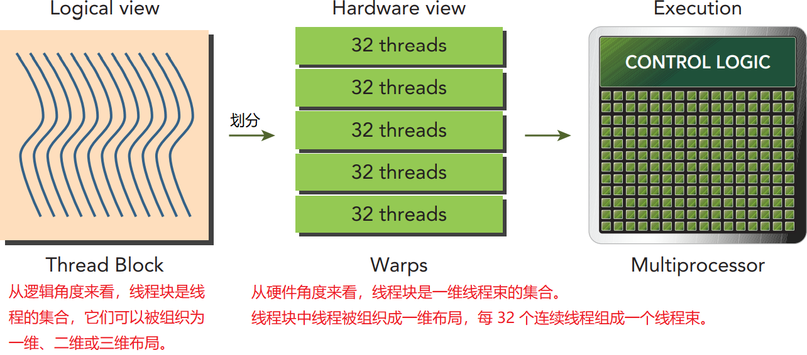
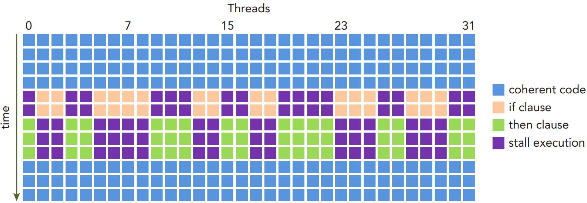
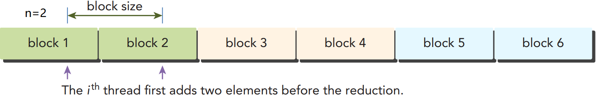
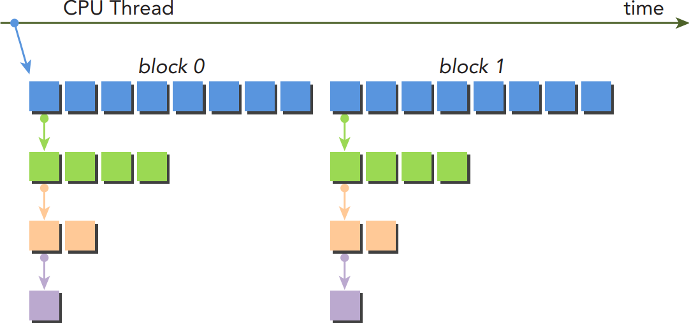

## 目录

[toc]

## 3.1 概述

### 3.1.1 GPU 架构概述

#### 3.1.1.1 关键组件

GPU 架构是基于流式多处理器（SM）的可扩展阵列，通过复制这种架构的构建块（即 SM）就能实现 GPU 的硬件并行。


上图是一个 [Fermi GPU](#3.1.2 Fermi 架构) 的 SM 示意图，包含若干个关键组件。GPU 中这样的一个 SM 都能支持数百个线程并发执行，而每个 GPU 通常有多个 SM，从而能够并发执行数千个线程。当启动一个内核网格时，它的线程块被分布在了可用的 SM 上来执行。多个线程块可能会被分配到同一个 SM 上，而且是根据 SM 资源的可用性进行调度的。

综上，得到 [1.2.5 硬件基础](01 CUDA 概述.md#1-2-5-硬件基础) 所述的 GPU 逻辑层与物理层联系，亦可见下图。


#### 3.1.1.2 线程束

CUDA 采用单指令多线程（SIMT）架构来管理和执行线程，每 32 个线程为一组，被称为线程束（warp）。每个 SM 都**将分配给它的线程块划分到包含 32 个线程的线程束**中，然后在可用的硬件资源上调度执行。<u>线程束中的</u>所有线程**同时**执行<u>相同</u>的指令，但每个线程有自己的指令地址计数器和寄存器状态，从而利用自身的数据得到不同的结果。

【注1】SIMT 架构和 SIMD 架构：

* SIMT（单指令多线程）允许属于同一线程束的多个线程独立执行
* SIMD（单指令多数据）要求同一个向量中的所有元素要在一个统一的同步组中一起执行
* 两者都是将相同的指令广播给多个执 行单元来实现并行

【注2】32 是 CUDA 程序里是一个神奇的数字，它来自于硬件系统，也对软件的性能有重要的影响。它是 SM 用 SIMD 方式所同时处理的工作粒度。

【注3】优化工作负载以适应线程束（一组有 32 个线程）的这个边界，会更有效地利用 GPU 计算资源，将在后面的章节中详细介绍。

#### 3.1.1.3 共享与同步

在 SM 中，共享内存和寄存器是非常重要的资源，**共享内存**的范围在线程块内，**寄存器**的范围在线程块中的线程。线程块中的线程通过这些资源进行<u>相互合作和通信</u>，避免不同的运行速度造成错误。

并行线程访问共享数据时可能引起**竞争读写**，导致错误的程序行为，因此 CUDA 提供[**主机设备同步**和**线程块中的线程同步**](#3.2.6 同步)方法，保证所有线程在进一步动作之前都达到执行过程中的一个特定点。但是 CUDA **没有提供块间同步**的原语。

SM 中有限的共享内存和寄存器，使得其内**活跃的线程束数量**是有限的，但 SM 在并发的[线程束间切换没有开销](#3.2.3 资源分配)，因此线程束等待时可以调度到此 SM 上其他的线程束。

### 3.1.2 Fermi 架构

Fermi 架构是第一个完整的 GPU 计算架构，能够为大多数高性能计算应用提供所需要的功能。下图是 Fermi 的架构图。


Fermi 架构，计算性能 2.x，可在每个 SM 上同时处理 48 个线程束，即可在一个 SM 上同时常驻 1536 个线程。Fermi 架构也支持并发内核执行，允许多达 16 个内核同时运行。

### 3.1.3 Kepler 架构

Kepler 架构包含 15 个 SM 和 6 个 64 位的内存控制器，下图是 Kepler K20X 芯片的逻辑框图。

相比 Fermi 架构，Kepler 架构有三个重要的创新：<u>强化的 SM，动态并行，Hyper-Q 技术</u>。


#### 3.1.3.1 强化的 SM

下图是 Kepler SM 的关键组件示意图，可以看到，一个 Kepler SM 单元包含：

* 192 个单精度 CUDA 核心（Core）

* 64 个双精度单元（DP Unit）

* 32 个特殊功能单元（SFU）

* 32 个加载/存储单元（LD/ST）

* 4 个线程束调度器（Warp Scheduler）

  能够在一个的 SM 上同时发送和执行 4 个线程束。

* 8 个指令调度器（Dispatch）

* 64 KB 的寄存器文件（Register File）

  允许片内存储器在共享内存和一级缓存间有更多的分区。


Kepler K20X 架构，计算能力 3.5，可在每个 SM 上同时调度 64 个线程束，即可在一个 SM 上可同时常驻 2048 个线程。K20X 能够提供超过 1TFlop 的峰值双精度计算能力，相较于 Fermi 的设计，功率效率提高了 80%，每瓦的性能也提升了三倍。

#### 3.1.3.2 动态并行

<u>动态并行特性</u>允许 **GPU** 动态启动新的网格：任一内核都能启动其他内核，并管理核间需要的依赖关系，来正确执行附加工作。

如下图所示，左图没有动态并行，主机要在 GPU 上启动每一个内核；右图有动态并行，GPU 能够启动嵌套内核，**减少与 CPU 的通信**。


该技术的具体使用见 [3.6 动态并行](#3.6 动态并行)。

#### 3.1.3.3 Hyper-Q

Hyper-Q 技术增加 CPU 与 GPU 之间的同步硬件连接，保证在 GPU 上有更多的并发执行，增加 GPU 的利用率，减少 CPU 的闲置时间。

其原理如下图所示，为了从 CPU 传送任务到 GPU，左边的 Fermi GPU 依赖单一的硬件工作队列来传送任务，右边的 Kepler GPU 在 CPU 与 GPU 之间提供 32 个硬件工作队列（所谓 Hyper Queue），从而消除队列阻塞的影响。


### 3.1.4 总结和优化

#### 3.1.4.1 架构总结

下表总结了各个架构的特点和计算能力。


#### 3.1.4.2 性能优化

性能分析工具深入洞察内核的性能，检测核函数中影响性能的瓶颈。CUDA 提供了两个主要的**性能分析工具**：

* `nvvp`，独立的可视化分析器

  `nvvp` 能可视化并优化 CUDA 程序的性能，它会显示 CPU 与 GPU 上的程序活动时间表，分析应用程序潜在的性能瓶颈。

* `nvprof`，命令行分析器

  `nvprof` 在命令行上收集和显示分析数据，详见 [2.2.2 `nvprof` 工具](02 CUDA 编程模型.md#2-2-2-`nvprof`-工具)，本书主要用这个工具。

事件和指标**概念**：

* <u>事件</u>是可计算的活动，它对应一个在内核执行期间被收集的硬件计数器

* <u>指标</u>是内核的特征，它由一个或多个事件计算得到

  > 大多数计数器通过流式多处理器来报告，而不是通过整个 GPU。
  >
  > 一个单一的运行只能获得几个计数器。有些计数器的获得是相互排斥的。多个性能分析运行往往需要获取所有相关的计数器。
  >
  > 由于 GPU 执行中的变化（如线程块和线程束调度指令），经重复运行，计数器值可能不是完全相同的。

  因此，选择合适的性能指标以及将检测性能与理论峰值性能进行对比对于寻找内核的性能瓶颈是很重要的。

三种常见的限制内核**性能的因素**：

* 存储带宽
* 计算资源
* 指令和内存延迟

本章主要介绍<u>指令延迟的问题</u>，其次会介绍一些计算资源限制的问题。后续章节将讨论其余的性能限制因素。

## 3.2 线程束执行原理

### 3.2.1 线程束详解

#### 3.2.1.1 线程块理解

<u>线程块</u>的逻辑视图和硬件视图关系如下。网格启动后，其中的线程块被调度到一个 SM 上，其中的线程被进一步划分为线程束。线程束中的线程同时执行相同的指令。



#### 3.2.1.2 线程束性质

[线程束](#3.1.1.2 线程束)是 SM 中基本的执行单元，有以下几点性质：

* 线程束中的线程编号连续

  ```c
  // 一维
  idx = threadIdx.x;
  // 二维
  idx = threadIdx.y * blockDim.x + threadIdx.x;
  // 三维
  idx = threadIdx.z * blockDim.y + threadIdx.y * blockDim.x + threadIdx.x;
  ```

* 线程束的数量向上取整
  $$
  WrapsPerBlock = ceil\left[ \frac{ThreadsPerBlock}{wrapSize} \right]
  $$
  因此，线程束不会跨越线程块。

* 线程束偶数倍要求

  如果线程块的大小不是线程束大小的偶数倍，那么在最后的线程束里有些线程会不活跃。

  

  如上图所示，总共 96 个硬件线程去支持 80 个软件线程，于是最后半个线程束不活跃，但仍然消耗资源。

#### 3.2.1.3 线程束分化

> **控制流**
>
> <u>控制流</u>是高级编程语言的基本构造中的一种，例如 `if...then...else`，`for` 和 `while` 等。

> **分支预测机制**
>
> CPU 拥有复杂的硬件以执行<u>分支预测</u>，即在条件检查中预测程序控制流使用哪个分支。如果预测正确，CPU 只需付出很小的性能代价。否则，CPU 可能会停止运行多个周期，因为指令流水线被清空了。
>
> GPU <font color='blue'>没有</font>分支预测机制。

> **分支效率  Branch Efficiency**
> $$
> Branch\;Efficiency = \frac{Branches - Divergent\;Branches}{Branches} \times 100\%
> $$
> 

在同一线程束中的线程执行不同的指令，被称为<u>线程束分化</u>，线程束分化只发生在**同一个线程束**中。

当发生线程束分化时，线程束将依次执行各个分支路径，每次禁用不执行当前路径的线程。这导致**并行性削弱、设备利用率**下降。



因此，应避免在同一线程束中有不同的执行路径。线程块中的线程束分配是确定的，据此**对数据进行分区**（尽管不是微不足道的，但取决于算法），确保同一个线程束中的线程执行路径一样。在 [3.4 线程束分支避免](#3.4 线程束分支避免)中会深入讨论**归约问题的分化处理**。

代码清单 3-1  [simpleDivergence.cu](src\chapter03\simpleDivergence.cu)

```c
__global__ void mathKernel2(void) {
    int tid = blockIdx.x * blockDim.x + threadIdx.x;
    float a, b;
    a = b = 0.0f;
//  if (tid % 2 == 0) 			     // 上图的条件
    if ((tid / warpSize) % 2 == 0) { // 改进的条件，分支粒度是线程束大小的倍数
        a = 100.0f;
    } else {
        b = 200.0f;
    }
    c[tid] = a + b;
}
```

```sh
# 编译运行
$ nvcc -O3 -arch=sm_20 simpleDivergence.cu -o simpleDivergence
$ ./simpleDivergence using Device 0: Tesla M2070 
Data size 64 Execution Configuration (block 64 grid 1)
Warmingup elapsed 0.000040 sec
mathKernel1 elapsed 0.000016 sec
mathKernel2 elapsed 0.000014 sec
# nvprof 分析
$ nvprof --metrics branch_efficiency ./simpleDivergence
Kernel: mathKernel1(void)
1	branch_efficiency	Branch	Efficiency	100.00%	100.00%	100.00% # 分支效率，CUDA 编译器优化导致效果一样
Kernel: mathKernel2(void)
1	branch_efficiency	Branch	Efficiency	100.00%	100.00%	100.00% # 分支效率，不深入探究编译器所做的优化
```

### 3.2.2 线程束活化

#### 3.2.2.1 资源分配

线程束的上下文资源有：<u>程序计数器、寄存器、共享内存</u>，它们的特性如下：

* [上下文切换无开销](#3.1.1.3 共享与同步)

  在线程束的生命周期内，上下文资源一直存储在芯片内，故同一 SM 内的线程束切换无开销。

* 计算资源限制线程块和线程束数量

   

* 资源不足无法启动

  如果每个 SM 没有足够的寄存器或共享内存去处理至少一个块，那么内核将无法启动。

  不同计算能力的资源限制情况如下表：

   

当计算资源（如寄存器和共享内存）已分配给线程块时，线程块被称为**活跃的块**，<font color="red">它所包含的</font>线程束被称为**活跃的线程束**。

活跃的线程束可以进一步分为<u>选定的线程束、阻塞的线程束、符合条件的线程束</u>，如下图所示。


因此，为了最大程度地利用 GPU，需要**最大化活跃的线程束数量**。

#### 3.2.2.2 延迟隐藏

指令发出和完成之间的时钟周期称为**指令延迟**。指令延迟可分为两者基本类型：<u>算数指令延迟</u>，一个算术操作从开始到它产生输出之间的时间，约 10～20 个周期；<u>内存指令延迟</u>，发送出的加载或存储操作和数据到达目的地之间的时间，约 400～800 个周期。

> **吞吐量和带宽**
>
> * 带宽通常是指理论峰值，而吞吐量是指已达到的值
>
> * 带宽通常是用来描述单位时间内最大可能的<u>数据传输量</u>，而吞吐量是用来描述单位时间内任何形式的<u>信息或操作的执行速度</u>
>
> 它们都是用来度量性能的速度指标，根据实际情况可以被交换使用。

若每个时钟周期中，所有线程调度器都有符合条件的线程束，就能保证**隐藏指令延迟**（保持 GPU 总是有事可干）。可以通过*利特尔法则（Little’s Law）*估算<u>隐藏延迟所需要的</u>活跃线程束的数量：
$$
\begin{align}
Number \; of \; Required \; Warps & = Latency \times Throughput \\
所需线程束数量 & = 延迟 \times 吞吐量
\end{align}
$$
利特尔法则得到的并行要求只是一个**下边界**，在实际使用中还会有其他延迟存在的。

<u>例 1：隐藏算数指令延迟的并行量计算</u>

对于算术运算来说，其所需的并行可以表示成隐藏算术延迟所需要的**操作数量**。

吞吐量因不同的算术指令而异，以一个 32 位浮点数乘加运算 $(a+b)\times c$ 为例，下表为隐藏指令延迟所需的指令操作数量。

| GPU 架构 | 指令延迟（周期） | 吞吐量（操作/周期） | 并行（操作） |
| -------- | ---------------- | ------------------- | ------------ |
| Fermi    | 20               | 32                  | 640          |
| Kepler   | 20               | 192                 | 3,840        |

因此，为保持计算资源的充分利用，对于 Fermi GPU，每个 SM 中所需的线程束数量为 $640 \div 32 = 20$ 个线程束。

总之，为了提高并行，可以增加

* 指令级并行（ILP）：一个线程中有很多独立的指令，详见 [3.5 规约循环调优](#3.5 规约循环调优)
* 线程级并行（TLP）：很多并发地[符合条件的线程](#3.2.2.1 资源分配)，详见 [3.4 归约分化调优](#3.4 归约分化调优)

<u>例 2：隐藏内存指令延迟的并行量计算</u>

对内存操作来说，其所需的并行可以表示为在每个周期内隐藏内存延迟所需的**字节数**。

下表为隐藏指令延迟所需的数据量大小。

| GPU 架构 | 指令延迟（周期） | 吞吐量（GB/s） | 带宽（B/周期） | 并行（KB） |
| -------- | ---------------- | -------------- | -------------- | ---------- |
| Fermi    | 800              | 144            | 92             | 74         |
| Kepler   | 800              | 250            | 96             | 77         |

> 【注1】内存吞吐量通常单位是 GB/s，因此要根据实际的内存频率转换为 B/周期，方法如下：
>
> ```sh
> $ nvidia-smi -a -q -d CLOCK | fgrep -A 3 "Max Clocks" | fgrep "Memory"
> ```
>
> 然后再用指令延迟乘以带宽，得到并行字节数。
>
> 【注2】并行字节数是对于整个设备而不是每个 SM 来说的， 因为内存带宽是针对整个设备而言的。

因此，设每个线程都把 1 浮点数据（4个字节）从全局内存移动到 SM 中用于计算，对于 Fermi GPU，共需要

* $74 \, \mathrm{KB} \div 4 \, \mathrm{B/thread} \approx 18500$ 个线程
* $18500 \div 32 = 579$ 个线程束，每个 SM 要有 $579 \div 16 = 36$ 个线程束

总之，为了提高并行，可以增加

* 每个线程/线程束中独立的内存操作，详见 [3.5 规约循环调优](#3.5 规约循环调优)
* 并发地[活跃的线程/线程束](#3.2.2.1 资源分配)，详见 [3.4 归约分化调优](#3.4 归约分化调优)

#### 3.2.2.3 占用率

**定义**

占用率是每个 SM 中活跃的线程束占最大线程束数量的比值，公式如下：
$$
\begin{align}
occupancy & = \frac{active \; warps}{maximum \; warps} \\
占用率 & = \frac{活跃线程束数量}{最大线程束数量}
\end{align}
$$
**最大线程束数量**

通过 [2.4.1 运行时 API 函数](02 CUDA 编程模型.md#2-4-1-运行时-API-函数)中的 `cudaGetDeviceProperties` 函数，可以获取一个 SM 的最大线程束数量。

1. 调用函数 `cudaError_t cudaGetDeviceProperties(struct cudaDeviceProp *prop, int device);`
2. 获取返回值中的变量 `maxThreadsPerMultiProcessor`，再除以 `32`

详见代码清单 3-2  [simpleDeviceQuery.cu](src\chapter03\simpleDeviceQuery.cu)

```sh
$ nvcc simpleDeviceQuery.cu -o simpleDeviceQuery
$ ./simpleDeviceQuery
Device 0: Tesla M2070
Number of multiprocessors: 14
Total amount of constant memory: 64.00 KB
Total amount of shared memory per block: 48.00 KB
Total number of registers available per block: 32768
Warp size: 32
Maximum number of threads per block: 1024
Maximum number of threads per multiprocessor: 1536
Maximum number of warps per multiprocessor: 48 # SM 中线程束数量的最大值是 48
```

**占用率计算器**

CUDA Toolkit 有一个 CUDA Occupancy Calculator 工具，可用于计算内核占用率。

1. 提供 GPU 的计算能力

2. 提供内核的资源信息

   * 每个块的线程（执行配置）

     手动输入自己的预设即可。

   * 每个块的共享内存（资源使用情况）

     使用 `nvcc --ptxas-options=-v` 获取。

   * 每个线程的寄存器（资源使用情况）

     使用 `nvcc --ptxas-options=-v` 获取。

3. 内核占用率将显示在 GPU 占用率数据段

**提高占用率**

* 内核使用的**寄存器数量**会对活跃线程束数量产生显著影响

  通过 `nvcc -maxrregcount=NUM` 命令设置每个线程使用的寄存器数量不能超过 `NUM` 个，可以将 `NUM` 设置为占用率计算器推荐数。

- 调整线程块配置或重新调整资源的使用情况以增加活跃的线程

  - 小线程块：每个块中线程太少，会在所有资源被充分利用之前达到 SM 的线程束数量限制
  - 大线程块：每个块中线程太多，会导致 SM 中每个线程可用的硬件资源较少

  - 网格和线程块大小的<font color="red">准则</font>

    * 保持每个块中线程数量是线程束大小（32）的倍数

    * 避免块太小：每个块至少要有 128 或 256 个线程，并根据内核资源的需求调整块大小

    * 块的数量要远远多于 SM 的数量，从而可以在设备中有足够的并行

    * 通过实验得到最佳执行配置和资源使用情况，详见 [3.3 网块维度调优](#3.3 网块维度调优)


### 3.2.3 同步

在 CUDA 中，<u>栅栏同步 (Barrier Synchronization)</u> 可以在两个级别执行：

- **系统级**同步：等待主机和设备完成所有的工作

  `cudaError_t cudaDeviceSynchronize(void);` - 阻塞主机应用程序，直到所有的 CUDA 操作完成（又见 [2.1.4.2 核函数异步](02 CUDA 编程模型.md#2-1-4-2-核函数异步)）

- **块级**同步：在设备执行过程中等待一个线程块中所有线程到达同一点

  `__device__ void __syncthreads(void);` - 线程块中每个线程等待所有其他线程到达同步点

【注1】正如 [3.1.1.3 共享与同步](#3.1.1.3 共享与同步) 提到的，线程块中的线程可以通过共享内存和寄存器来共享数据，而同步可以用于缓解**竞争读写**问题。

【注2】没有**块间同步**，唯一安全的方法是在每个内核执行结束端使用全局同步，然后终止当前的核函数，开始执行新的核函数。

【注3】不同块中的线程不允许相互同步，使得 GPU 以任意顺序执行块，令 CUDA 程序在大规模并行 GPU 上是可扩展的。

第四章将详细探讨同步问题。

## 3.3 网块维度

### 3.3.1 基准程序

二维矩阵求和的核函数

```c
__global__ void sumMatrixOnGPU2D(float *A, float *B, float *C, int NX, int NY) {
    unsigned int ix = blockIdx.x * blockDim.x + threadIdx.x;
    unsigned int iy = blockIdx.y * blockDim.y + threadIdx.y;
    unsigned int idx = iy * NX + ix;
    if (ix < NX && iy < NY) {
        C[idx] = A[idx] + B[idx];
    }
}
```

主调程序

```c
int main(int argc, char **argv)
{
    // 用 16384 个元素确定一个大矩阵
    int nx = 1<<14;
    int ny = 1<<14;
    // 命令行配置线程块大小
    if (argc > 2) {
        dimx = atoi(argv[1]);
        dimy = atoi(argv[2]);
    }
    dim3 block(dimx, dimy);
    dim3 grid((nx + block.x - 1) / block.x, (ny + block.y - 1) / block.y);
    // ...
}
```

编译和运行

```sh
# 编译程序
$ nvcc -O3 -arch=sm_20 sumMatrix.cu -o sumMatrix
# 性能基准
$ ./sumMatrix 32 32
sumMatrixOnGPU2D <<< (512,512), (32,32) >>> elapsed 60 ms
$ ./sumMatrix 32 16
sumMatrixOnGPU2D <<< (512,1024), (32,16) >>> elapsed 38 ms
$ ./sumMatrix 16 32
sumMatrixOnGPU2D <<< (1024,512), (16,32) >>> elapsed 51 ms
$ ./sumMatrix 16 16
sumMatrixOnGPU2D <<< (1024,1024),(16,16) >>> elapsed 46 ms
```

### 3.3.2 检测活跃线程束

#### 3.3.2.1 可实现占用率

**定义**

一个内核的可实现占用率被定义为
$$
可实现占用率 = \frac{周期内平均活跃线程束数量}{最大线程束数量}
$$
它和 [3.2.2.3 占用率](#3.2.2.3 占用率)的区别在于分子，计算的是活跃线程束数量的平均表现，因此更具有实践意义。

**检测**

可实现占用率可以通过 `nvprof --metrics achieved_occupancy` 监测内核获得：

```sh
# 可实现占用率
$ nvprof --metrics achieved_occupancy ./sumMatrix 32 32
sumMatrixOnGPU2D <<<(512,512), (32,32)>>> Achieved Occupancy 0.501071 
$ nvprof --metrics achieved_occupancy ./sumMatrix 32 16
sumMatrixOnGPU2D <<<(512,1024), (32,16)>>> Achieved Occupancy 0.736900
$ nvprof --metrics achieved_occupancy ./sumMatrix 16 32
sumMatrixOnGPU2D <<<(1024,512), (16,32)>>> Achieved Occupancy 0.766037 
$ nvprof --metrics achieved_occupancy ./sumMatrix 16 16
sumMatrixOnGPU2D <<<(1024,1024),(16,16)>>> Achieved Occupancy 0.810691
```

**性质**

比较 “性能基准” 和 “可实现占用率”，可以得出以下结论：

* 可实现占用率越高 $\rightarrow$ 活跃线程束越多，并行性越好
* 更高的占用率并不一定意味着更高的性能，还存在其他因素

### 3.3.3 检测内存操作

#### 3.3.3.1 加载吞吐量

加载吞吐量衡量内存的读取效率，是 [3.2.2.2 延迟隐藏](#3.2.2.2 延迟隐藏)中吞吐量指标在**读操作上的使用程度**。

加载吞吐量可以通过 `nvprof --metrics gld_throughput` 监测内核获得：

```sh
# 加载吞吐量
$ nvprof --metrics gld_throughput./sumMatrix 32 32
sumMatrixOnGPU2D <<<(512,512), (32,32)>>> Global Load Throughput 35.908GB/s
$ nvprof --metrics gld_throughput./sumMatrix 32 16
sumMatrixOnGPU2D <<<(512,1024), (32,16)>>> Global Load Throughput 56.478GB/s 
$ nvprof --metrics gld_throughput./sumMatrix 16 32
sumMatrixOnGPU2D <<<(1024,512), (16,32)>>> Global Load Throughput 85.195GB/s
$ nvprof --metrics gld_throughput./sumMatrix 16 16
sumMatrixOnGPU2D <<<(1024,1024),(16,16)>>> Global Load Throughput 94.708GB/s
```

比较 “性能基准” 和 “加载吞吐量”，可以得出以下结论：

* 加载吞吐量越高 $\rightarrow$ 活跃线程束越多，并行性越好
* 更高的加载吞吐量并不一定意味着更高的性能，还存在其他因素

#### 3.3.3.2 全局加载效率

全局加载效率定义如下：
$$
全局加载效率 = \frac{被请求的全局加载吞吐量}{所需的全局加载吞吐量}
$$
全局加载效率衡量了应用程序的加载操作**利用设备内存带宽的程度**。

全局加载效率可以通过 `nvprof --metrics gld_efficiency` 监测内核获得：

```sh
# 全局加载效率
$ nvprof --metrics gld_efficiency ./sumMatrix 32 32
sumMatrixOnGPU2D <<<(512,512), (32,32)>>> Global Memory Load Efficiency 100.00% 
$ nvprof --metrics gld_efficiency ./sumMatrix 32 16
sumMatrixOnGPU2D <<<(512,1024), (32,16)>>> Global Memory Load Efficiency 100.00%
$ nvprof --metrics gld_efficiency ./sumMatrix 16 32
sumMatrixOnGPU2D <<<(1024,512), (16,32)>>> Global Memory Load Efficiency 49.96% 
$ nvprof --metrics gld_efficiency ./sumMatrix 16 16
sumMatrixOnGPU2D <<<(1024,1024),(16,16)>>> Global Memory Load Efficiency 49.80%
```

比较 “性能基准” 和 “全局加载效率”，可以得出以下结论：

* 全局加载效率越低 $\rightarrow$ 活跃线程束**比例**越少，并行性**投入产出比**越差
* 当加载吞吐量和可实现占用率增加到一定程度时，全局加载效率会走低
* <u>最内层的维数</u>应该总是线程束大小的**倍数**（第四章讨论半个线程束大小的线程块对性能的影响）

### 3.3.4 增大并行性

总结上面的实验和结论后，进行更大范围的实验，调节内核到最佳性能。

---

```sh
# 更大范围性能基准
$ ./sumMatrix 64 2
sumMatrixOnGPU2D <<<(256,8192), (64,2) >>> elapsed 0.033567 sec
$ ./sumMatrix 64 4
sumMatrixOnGPU2D <<<(256,4096), (64,4) >>> elapsed 0.034908 sec
$ ./sumMatrix 64 8
sumMatrixOnGPU2D <<<(256,2048), (64,8) >>> elapsed 0.036651 sec
$ ./sumMatrix 128 2
sumMatrixOnGPU2D <<<(128,8192), (128,2)>>> elapsed 0.032688 sec  # 最佳
$ ./sumMatrix 128 4
sumMatrixOnGPU2D <<<(128,4096), (128,4)>>> elapsed 0.034786 sec
$ ./sumMatrix 128 8
sumMatrixOnGPU2D <<<(128,2048), (128,8)>>> elapsed 0.046157 sec
$ ./sumMatrix 256 2
sumMatrixOnGPU2D <<<(64,8192), (256,2)>>> elapsed 0.032793 sec  # 稍佳
$ ./sumMatrix 256 4
sumMatrixOnGPU2D <<<(64,4096), (256,4)>>> elapsed 0.038092 sec
$ ./sumMatrix 256 8
sumMatrixOnGPU2D <<<(64,2048), (256,8)>>> elapsed 0.000173 sec  # 块中线程总数 1024 超过硬件限制 
Error: sumMatrix.cu:163, code:9, reason: invalid configuration argument
```

比较 `(128,2), (64,4)`，比较 `(64,8), (128,4), (256, 2)`，得到：

* 相同的线程块数量，<u>最内层的维数</u>越大，并行性越好

比较 `(64,2), (128,2)` 与其他，得到：

* <u>线程块数量</u>越多，并行性总的来说更好

---

```sh
# 更大范围可实现占用率
$ nvprof --metrics achieved_occupancy ./sumMatrix 64 2
sumMatrixOnGPU2D <<<(256,8192), (64,2) >>> Achieved Occupancy 0.554556  # 最差
$ nvprof --metrics achieved_occupancy ./sumMatrix 64 4
sumMatrixOnGPU2D <<<(256,4096), (64,4) >>> Achieved Occupancy 0.798622
$ nvprof --metrics achieved_occupancy ./sumMatrix 64 8
sumMatrixOnGPU2D <<<(256,2048), (64,8) >>> Achieved Occupancy 0.753532
$ nvprof --metrics achieved_occupancy ./sumMatrix 128 2
sumMatrixOnGPU2D <<<(128,8192), (128,2)>>> Achieved Occupancy 0.802598	# 最高，最佳
$ nvprof --metrics achieved_occupancy ./sumMatrix 128 4
sumMatrixOnGPU2D <<<(128,4096), (128,4)>>> Achieved Occupancy 0.746367
$ nvprof --metrics achieved_occupancy ./sumMatrix 128 8
sumMatrixOnGPU2D <<<(128,2048), (128,8)>>> Achieved Occupancy 0.573449
$ nvprof --metrics achieved_occupancy ./sumMatrix 256 2
sumMatrixOnGPU2D <<<(64,8192), (256,2) >>> Achieved Occupancy 0.760901	# 不低，稍佳
$ nvprof --metrics achieved_occupancy ./sumMatrix 256 4
sumMatrixOnGPU2D <<<(64,4096), (256,4) >>> Achieved Occupancy 0.595197
```

比较 “更大范围性能基准” 和 “更大范围可实现占用率”，可以得出结论：

* <u>线程块数量</u>越多 $\rightarrow$ 可实现占用率越高 $\rightarrow$ [3.3.2.1 可实现占用率](#3.3.2.1 可实现占用率)

* 线程束数量过多时，可实现占用率大幅降低，因为达到了硬件限制

---

```sh
# 继续增大块间并行性
$ ./sumMatrix 128 1
sumMatrixOnGPU2D <<<(128,16384),(128,1)>>> elapsed 0.032602 sec
$ ./sumMatrix 256 1
sumMatrixOnGPU2D <<<(64,16384), (256,1)>>> elapsed 0.030959 sec
```

比较 “继续增大块间并行性” 和 “更大范围可实现占用率”，可以得出结论：

* <u>缩小其他维度</u> $\rightarrow$ 线程块数量增加 $\rightarrow$ 块间并行性增大

**综上，该配置实现了本程序的最佳总体性能。**

## 3.4 归约分化

### 3.4.1 并行归约问题

**归约问题**指在向量中执行满足交换律和结合律的运算，**并行归约问题**是这种运算的并行化问题。

由于规约问题支持交换律和结合律，因此数组元素可以按任何顺序运算。本节以<u>向量加法</u>作为案例，并行规约问题的处理思路为：

1. 将输入向量划分到更小的数据块中
2. 用一个线程计算一个数据块的部分和
3. 对每个数据块的部分和再求和得出最终结果

下节介绍处理思路的三种实现。

### 3.4.2 三种实现方法

#### 相邻配对间断线程


```c
__global__ void reduceNeighbored(int *g_idata, int *g_odata, unsigned int n) {
    /*
    Args:
    	g_idata (int*): 数据数组的起始指针
    	g_odata (int*): 结果数组的起始指针
    	n (unsigned int): 数组总的元素个数
    */
    
    // set thread ID
    unsigned int tid = threadIdx.x; // 用于筛选线程
    unsigned int idx = blockIdx.x * blockDim.x + threadIdx.x;
    // convert global data pointer to the local pointer of this block
    int *idata = g_idata + blockIdx.x * blockDim.x;
    // boundary check
    if (idx >= n) return;
    // in-place reduction in global memory
    for (int stride = 1; stride < blockDim.x; stride *= 2) {
        if ((tid % (2 * stride)) == 0) { // 选出 stride 点的所有线程
            idata[tid] += idata[tid + stride];
        }
        // synchronize within block
        __syncthreads(); // 确保每一轮中所有线程已经将局部结果写入全局内存中
    }
    // write result for this block to global mem
    if (tid == 0) g_odata[blockIdx.x] = idata[0]; // 选出线程块起点处的线程
}
```

其中的条件语句 `tid % (2 * stride)) == 0` 只对偶数 ID 的线程为 `true`，所以会导致很高的线程束分化：

* 第一次迭代，只有偶数 id 的线程执行条件语句的主体，但所有线程必须被调度
* 第二次迭代，只有四分之一线程是活跃的，但所有线程必须被调度
* 以此类推

#### 相邻配对连续线程


```c
__global__ void reduceNeighboredLess (int *g_idata, int *g_odata, unsigned int n) {
    /*
    Args:
    	g_idata (int*): 数据数组的起始指针
    	g_odata (int*): 结果数组的起始指针
    	n (unsigned int): 数组总的元素个数
    */
    
    // set thread ID
    unsigned int tid = threadIdx.x; // 用于筛选线程
    unsigned int idx = blockIdx.x * blockDim.x + threadIdx.x;
    // convert global data pointer to the local pointer of this block
    int *idata = g_idata + blockIdx.x*blockDim.x;
    // boundary check
    if(idx >= n) return;
    // in-place reduction in global memory
    for (int stride = 1; stride < blockDim.x; stride *= 2) {
        // convert tid into local array index
        int index = 2 * stride * tid; // 选择有 tid 个 “2*跨度” 的线程，从而线程编号递增
        if (index < blockDim.x) {
            idata[index] += idata[index + stride];
        }
        // synchronize within threadblock
        __syncthreads(); // 确保每一轮中所有线程已经将局部结果写入全局内存中
    }
    // write result for this block to global mem
    if (tid == 0) g_odata[blockIdx.x] = idata[0]; // 选出线程块起点处的线程
}
```

线程连续之后，线程束分化有所降低。对于有 512 个线程的块来说：

* 第一轮归约，前 8 个线程束活跃，剩下 8 个线程束停滞
* 第二轮归约，前 4 个线程束活跃，剩下 12 个线程束停滞
* 在最后五轮中，当每一轮的线程总数小于线程束的大小时，分化就会出现

【注1】线程连续后，`$ nvprof --metrics inst_per_warp ./reduceInteger` 表明线程束上**执行指令数量平均值降低**。

【注2】线程连续后，`$ nvprof --metrics gld_throughput ./reduceInteger` 表明内核**加载吞吐量提高**。

#### 交错配对连续线程


```c
__global__ void reduceInterleaved (int *g_idata, int *g_odata, unsigned int n) {
    /*
    Args:
    	g_idata (int*): 数据数组的起始指针
    	g_odata (int*): 结果数组的起始指针
    	n (unsigned int): 数组总的元素个数
    */
    
    // set thread ID
    unsigned int tid = threadIdx.x; // 用于筛选线程
    unsigned int idx = blockIdx.x * blockDim.x + threadIdx.x;
    // convert global data pointer to the local pointer of this block
    int *idata = g_idata + blockIdx.x * blockDim.x;
    // boundary check
    if(idx >= n) return;
    // in-place reduction in global memory
    for (int stride = blockDim.x / 2; stride > 0; stride >>= 1) {
        if (tid < stride) {
            idata[tid] += idata[tid + stride]; // 选择块内编号不过半的线程
        }
        __syncthreads(); // 确保每一轮中所有线程已经将局部结果写入全局内存中
    }
    // write result for this block to global mem
    if (tid == 0) g_odata[blockIdx.x] = idata[0]; // 选出线程块起点处的线程
}
```

较于相邻配对，交错配对的工作线程没有变化，但每个线程在全局内存中的**加载/存储位置**是不同的，实验表明这会进一步提升性能。

### 3.4.3 实验结果

```sh
$ ./reduce starting reduction at device 0: Tesla M2070
 with array size 16777216 grid 32768 block 512
cpu reduce elapsed 0.029138 sec cpu_sum: 2139353471									# 纯 CPU 执行
gpu Warmup elapsed 0.011745 sec gpu_sum: 2139353471 <<<grid 32768 block 512>>>		#
gpu Neighbored elapsed 0.011722 sec gpu_sum: 2139353471 <<<grid 32768 block 512>>>	# 相邻配对间断线程
gpu NeighboredL elapsed 0.009321 sec gpu_sum: 2139353471 <<<grid 32768 block 512>>>	# 相邻配对连续线程
gpu Interleaved elapsed 0.006967 sec gpu_sum: 2139353471 <<<grid 32768 block 512>>>	# 交错配对连续线程
```

## 3.5 展开循环

### 3.5.1 循环展开问题

**循环展开**是一个尝试通过减少<u>分支出现频率</u>和<u>循环维护指令</u>来优化循环的技术，任何封闭的循环都可以减少或完全删除迭代次数。

循环体的重复次数被称为**循环展开因子**，于是新循环的迭代次数就变为<u>原始循环迭代次数</u>除以<u>循环展开因子</u>。

<u>例：循环展开的简单示例</u>

```c
// 原始循环
for (int i = 0; i < 100; i++) {
    a[i] = b[i] + c[i];
}
// 部分展开
for (int i = 0; i < 100; i += 2) {
    a[i] = b[i] + c[i];
    a[i+1] = b[i+1] + c[i+1]; // 重复操作一次循环体，迭代次数能减少到原始循环的一半
}
```

循环展开的性能提升原理较为隐晦，因为这种**提升来自于编译器**执行循环展开时对低级指令的改进和优化，从而

* 减少指令消耗、增加独立调度指令 $\rightarrow$
* 流水线上有更多的并发操作 $\rightarrow$ 
* 产生更高的指令和内存带宽 $\rightarrow$ 
* 出现更多符合条件的线程束 $\rightarrow$ 
* 有利于隐藏指令或内存延迟

本节在 [3.4 归约分化调优](#3.4 归约分化调优)的基础上，继续进行循环展开的优化。

### 3.5.2 三步展开过程

#### 块间倍数展开

[交错配对连续线程](#交错配对连续线程)的程序中，每个线程块对应处理一个数据块，每个线程只处理当前的数据块。考虑让每个线程处理 $n$ 个数据块：



在块间展开循环后，每个数据块都是 **$n$ 个数据块的 “叠加体”**，从而再进入到原来的交错配对计算时，所需线程数倍减。

```c
__global__ void reduceUnrolling2 (int *g_idata, int *g_odata, unsigned int n) {
    // set thread ID
    unsigned int tid = threadIdx.x; // ↓ 相当于基本单位项
    unsigned int idx = blockIdx.x * blockDim.x * 2 + threadIdx.x; // 每个线程处理两个线程块，实际 id 倍增
    // convert global data pointer to the local pointer of this block
    int *idata = g_idata + blockIdx.x * blockDim.x * 2; // 数据起点也相应倍增
    // unrolling 2 data blocks
    if (idx + blockDim.x < n) g_idata[idx] += g_idata[idx + blockDim.x]; // 跨线程块处理，多块归一
    __syncthreads(); // 确保每一轮中所有线程已经将局部结果写入全局内存中
    // in-place reduction in global memory
    for (int stride = blockDim.x / 2; stride > 0; stride >>= 1) { // 本线程块处理
        if (tid < stride) {
            idata[tid] += idata[tid + stride];
        } 
        // synchronize within threadblock
        __syncthreads(); // 确保每一轮中所有线程已经将局部结果写入全局内存中
    }
    // write result for this block to global mem
    if (tid == 0) g_odata[blockIdx.x] = idata[0];
}
```

于是，$n$ 倍展开后将拥有 $n$ 个**独立的内存访问**，从而有更多的独立内存加载/存储操作，更好地让<u>内存带宽饱和</u>及<u>隐藏加载/存储延迟</u>。

【注1】可以使用 `$ nvprof --metrics dram_read_throughput` 检测<u>设备读吞吐量</u>。

【注2】可以使用 `$ nvprof --metrics gld_efficiency, gst_efficiency` 检测<u>内存加载/存储效率</u>。

#### 块内最小展开

[交错配对连续线程](#交错配对连续线程)过程中，每次迭代每个数据块中的线程数减半，当只剩下 32 个或更少线程（即一个线程束）时，会产生线程束分化。

因此，可以在线程数量小于一个线程束大小时展开循环，避免执行循环控制和线程同步逻辑。

```c
__global__ void reduceUnrollWarps8 (int *g_idata, int *g_odata, unsigned int n) {
    // set thread ID
    unsigned int tid = threadIdx.x; // ↓ 相当于基本单位项
    unsigned int idx = blockIdx.x*blockDim.x*8 + threadIdx.x; // 每个线程处理两个线程块，实际 id 八倍增
    // convert global data pointer to the local pointer of this block
    int *idata = g_idata + blockIdx.x*blockDim.x*8; // 数据起点也相应八倍增
    // unrolling 8
    if (idx + 7*blockDim.x < n) { // 跨线程块处理，多块归一
        int a1 = g_idata[idx];
        int a2 = g_idata[idx+blockDim.x];
        int a3 = g_idata[idx+2*blockDim.x];
        int a4 = g_idata[idx+3*blockDim.x];
        int b1 = g_idata[idx+4*blockDim.x];
        int b2 = g_idata[idx+5*blockDim.x];
        int b3 = g_idata[idx+6*blockDim.x];
        int b4 = g_idata[idx+7*blockDim.x];
        g_idata[idx] = a1+a2+a3+a4+b1+b2+b3+b4;
    }
    __syncthreads(); // 确保每一轮中所有线程已经将局部结果写入全局内存中
    // in-place reduction in global memory
    for (int stride = blockDim.x / 2; stride > 32; stride >>= 1) { // 本线程块处理，只处理线程数量超 32 的情况
        if (tid < stride) {
            idata[tid] += idata[tid + stride];
        }
        // synchronize within threadblock
        __syncthreads(); // 确保每一轮中所有线程已经将局部结果写入全局内存中
    }
    // unrolling warp
    if (tid < 32) { // 此时每个线程块的活跃线程数量等于 32，即只调度前 32 个线程
        volatile int *vmem = idata;
        vmem[tid] += vmem[tid + 32];
        vmem[tid] += vmem[tid + 16];
        vmem[tid] += vmem[tid + 8];
        vmem[tid] += vmem[tid + 4];
        vmem[tid] += vmem[tid + 2];
        vmem[tid] += vmem[tid + 1];
    }
    // write result for this block to global mem
    if (tid == 0) g_odata[blockIdx.x] = idata[0];
}
```

【注1】变量 `vmem` 使用了 `volatile` 关键字修饰，要求编译器每次赋值时必须将 `vmem[tid]` 的值存回全局内存中了，不会缓存优化。

【注2】可以使用 `$ nvprof --metrics stall_sync` 检测内核运行中的<u>线程阻塞情况</u>。

#### 块内完全展开

编译时如果已知一个循环中的迭代次数，就可以把循环完全展开。

因为 Fermi 或 Kepler 架构中，每个块的最大线程数都是 1024（参见 [3.2.2.1 资源分配](#3.2.2.1 资源分配)中的表格），并且核函数只基于一个线程块维度，所以能很容易的把循环完全展开。

```c
__global__ void reduceCompleteUnrollWarps8 (int *g_idata, int *g_odata, unsigned int n) {
    // set thread ID
    unsigned int tid = threadIdx.x;
    unsigned int idx = blockIdx.x * blockDim.x * 8 + threadIdx.x;
    // convert global data pointer to the local pointer of this block
    int *idata = g_idata + blockIdx.x * blockDim.x * 8;
    // unrolling 8
    if (idx + 7*blockDim.x < n) {
        int a1 = g_idata[idx];
        int a2 = g_idata[idx + blockDim.x];
        int a3 = g_idata[idx + 2 * blockDim.x];
        int a4 = g_idata[idx + 3 * blockDim.x];
        int b1 = g_idata[idx + 4 * blockDim.x];
        int b2 = g_idata[idx + 5 * blockDim.x];
        int b3 = g_idata[idx + 6 * blockDim.x];
        int b4 = g_idata[idx + 7 * blockDim.x];
        g_idata[idx] = a1 + a2 + a3 + a4 + b1 + b2 + b3 + b4;
    }
    __syncthreads();
    // in-place reduction and complete unroll
    if (blockDim.x>=1024 && tid < 512) idata[tid] += idata[tid + 512];
    __syncthreads();
    if (blockDim.x>=512 && tid < 256) idata[tid] += idata[tid + 256];
    __syncthreads();
    if (blockDim.x>=256 && tid < 128) idata[tid] += idata[tid + 128];
    __syncthreads();
    if (blockDim.x>=128 && tid < 64) idata[tid] += idata[tid + 64];
    __syncthreads();
    // unrolling warp
    if (tid < 32) {
        volatile int *vsmem = idata;
        vsmem[tid] += vsmem[tid + 32];
        vsmem[tid] += vsmem[tid + 16];
        vsmem[tid] += vsmem[tid + 8];
        vsmem[tid] += vsmem[tid + 4];
        vsmem[tid] += vsmem[tid + 2];
        vsmem[tid] += vsmem[tid + 1];
    }
    // write result for this block to global mem
    if (tid == 0) g_odata[blockIdx.x] = idata[0];
}
```

#### 模板化

虽然可以手动展开循环，但是使用模板函数有助于进一步减少分支消耗。

* 让线程块大小作为模板函数的参数

  从而检查块大小的 `if` 语句将在编译时被评估，如果判断为 `false`，那么编译时它将会被删除，使得内循环更有效率。

* 在 `switch-case` 结构中调用核函数

  这允许编译器为特定的线程块大小自动优化代码，也意味着核函数只对特定块大小有效。

```c
template <unsigned int iBlockSize>
    __global__ void reduceCompleteUnroll(int *g_idata, int *g_odata, unsigned int n) {
    // set thread ID
    unsigned int tid = threadIdx.x;
    unsigned int idx = blockIdx.x * blockDim.x * 8 + threadIdx.x;
    // convert global data pointer to the local pointer of this block
    int *idata = g_idata + blockIdx.x * blockDim.x * 8;
    // unrolling 8
    if (idx + 7*blockDim.x < n) {
        int a1 = g_idata[idx];
        int a2 = g_idata[idx + blockDim.x];
        int a3 = g_idata[idx + 2 * blockDim.x];
        int a4 = g_idata[idx + 3 * blockDim.x];
        int b1 = g_idata[idx + 4 * blockDim.x];
        int b2 = g_idata[idx + 5 * blockDim.x];
        int b3 = g_idata[idx + 6 * blockDim.x];
        int b4 = g_idata[idx + 7 * blockDim.x];
        g_idata[idx] = a1+a2+a3+a4+b1+b2+b3+b4;
    }
    __syncthreads();
    // in-place reduction and complete unroll
    if (iBlockSize>=1024 && tid < 512) idata[tid] += idata[tid + 512];
    __syncthreads();
    if (iBlockSize>=512 && tid < 256) idata[tid] += idata[tid + 256];
    __syncthreads();
    if (iBlockSize>=256 && tid < 128) idata[tid] += idata[tid + 128];
    __syncthreads();
    if (iBlockSize>=128 && tid < 64) idata[tid] += idata[tid + 64];
    __syncthreads();
    // unrolling warp
    if (tid < 32) {
        volatile int *vsmem = idata;
        vsmem[tid] += vsmem[tid + 32];
        vsmem[tid] += vsmem[tid + 16];
        vsmem[tid] += vsmem[tid + 8];
        vsmem[tid] += vsmem[tid + 4];
        vsmem[tid] += vsmem[tid + 2];
        vsmem[tid] += vsmem[tid + 1];
    }
    // write result for this block to global mem
    if (tid == 0) g_odata[blockIdx.x] = idata[0];
}
```

```c
switch (blocksize) {
    case 1024:
        reduceCompleteUnroll<1024><<<grid.x/8, block>>>(d_idata, d_odata, size);
        break;
    case 512:
        reduceCompleteUnroll<512><<<grid.x/8, block>>>(d_idata, d_odata, size);
        break;
    case 256:
        reduceCompleteUnroll<256><<<grid.x/8, block>>>(d_idata, d_odata, size);
        break;
    case 128:
        reduceCompleteUnroll<128><<<grid.x/8, block>>>(d_idata, d_odata, size);
        break;
    case 64:
        reduceCompleteUnroll<64><<<grid.x/8, block>>>(d_idata, d_odata, size); 
        break;
} 
```

【悟】展开循环、模板化，都能**减少条件判断**，从而减少线程束分化。

### 3.5.3 实验结果

下表为归约内核的性能结果汇总。


下表为加载/存储效率结果对比。


## 3.6 动态并行

### 3.6.1 嵌套执行规则

在动态并行中，内核执行分为两种类型：父母和孩子。它们的嵌套执行规则如下：


* 子网格完成 $\rightarrow$ 父线程完成 $\rightarrow$ 父线程块完成 $\rightarrow$ 父网格完成

  * 如果<u>调用的线程</u>没有**显式地同步**[^1]<u>启动的子网格</u>，那么运行时会保证父母和孩子之间的**隐式同步**
  * 线程的网格启动行为在整个<u>线程块内可见</u>，因此线程**可与子网格同步**，也**可与兄弟子网格同步**

  * 线程块中<u>所有父线程</u>已完成，但<u>有子网格</u>未完成，就会**触发隐式同步**[^1]
  * 子网格被**启动后不一定执行**，只有<u>线程块在子网格</u>上显示同步[^1]后，才能保证执行

* 父网格和子网格共享相同的全局内存和常量内存，但它们有不同的局部内存和共享内存

  * 父网格与子网格能够对全局内存进行**并发存取**，并且能保证两者之间有**弱一致性**
  * 子网格执行时有两个时刻的内存视图[^2]与<u>父线程</u>有**强一致性**
    * 子网格调用前，父线程中的所有<u>全局内存操作</u>保证对子网格可见
    * 子网格完成后，子网格中的所有<u>内存操作</u>保证对同步完的父线程可见

动态并行也存在一些限制条件：

* 动态并行只支持计算能力 3.5 或更高的设备
* 动态并行调用的内核不能在物理方面独立的设备上启动
* 动态并行的最大嵌套深度限制为 24，但考虑到同步管理等所需的额外内存，实际深度会更小

[^1]: 线程在子网格上同步，是指线程因为这些子网格而进行等待的指向性行为。
[^2]:内存视图不仅指内存的状态，还包括对内存的操作。

### 3.6.2 嵌套内核方法

下面的 HelloWorld 程序展示了动态并行的实现方法：核函数构造嵌套、递归执行。


```c
__global__ void nestedHelloWorld(int const iSize,int iDepth) {
    int tid = threadIdx.x;
    printf("Recursion=%d: Hello World from thread %d" 
           "block %d\n",iDepth,tid,blockIdx.x);
    // condition to stop recursive execution
    if (iSize == 1) return; // 递归出口
    // reduce block size to half
    int nthreads = iSize>>1;
    // thread 0 launches child grid recursively
    if(tid == 0 && nthreads > 0) {
        nestedHelloWorld<<<1, nthreads>>>(nthreads,++iDepth); // 嵌套
        printf("-------> nested execution depth: %d\n",iDepth);
    }
}
```

编译命令要注意：

```sh
$ nvcc -arch=sm_35 -rdc=true nestedHelloWorld.cu -o nestedHelloWorld -lcudadevrt
$ ./nestedHelloWorld Execution Configuration: grid 1 block 8
Recursion=0: Hello World from thread 0 block 0
Recursion=0: Hello World from thread 1 block 0
Recursion=0: Hello World from thread 2 block 0
Recursion=0: Hello World from thread 3 block 0
Recursion=0: Hello World from thread 4 block 0
Recursion=0: Hello World from thread 5 block 0
Recursion=0: Hello World from thread 6 block 0
Recursion=0: Hello World from thread 7 block 0
-------> nested execution depth: 1
Recursion=1: Hello World from thread 0 block 0
Recursion=1: Hello World from thread 1 block 0
Recursion=1: Hello World from thread 2 block 0
Recursion=1: Hello World from thread 3 block 0
-------> nested execution depth: 2
Recursion=2: Hello World from thread 0 block 0
Recursion=2: Hello World from thread 1 block 0
-------> nested execution depth: 3
Recursion=3: Hello World from thread 0 block 0
```

* 因为动态并行是由设备运行时库所支持的，所以必须在命令行使用 `-lcudadevrt` 进行明确链接
* 当 `-rdc` 标志为 `true` 时，它强制生成可重定位的设备代码，这是动态并行的一个要求

### 3.6.3 归约嵌套调优

#### 嵌套规约



```c
__global__ void gpuRecursiveReduce (int *g_idata, int *g_odata, unsigned int isize) {
    // set thread ID
    unsigned int tid = threadIdx.x;
    // convert global data pointer to the local pointer of this block
    int *idata = g_idata + blockIdx.x*blockDim.x; // 全局内存地址转为块内本地地址
    int *odata = &g_odata[blockIdx.x];
    // stop condition（递归出口）
    if (isize == 2 && tid == 0) { // 如果当前线程结点是嵌套执行树上的叶子
        g_odata[blockIdx.x] = idata[0]+idata[1]; // 结果被拷贝回全局内存
        return; // 控制立刻返回到父内核中
    }
    // nested invocation
    int istride = isize>>1; // 计算本地归约的大小
    if(istride > 1 && tid < istride) {
        // in place reduction
        idata[tid] += idata[tid + istride]; // 一半的线程执行就地归约
    }
    // sync at block level
    __syncthreads(); // 同步线程块内的线程，以保证所有部分和的计算
    // nested invocation to generate child grids 
    if(tid==0) { // 线程 0 产生一个子网格，它只有一个线程块，线程数量为当前线程块线程数量的一半
        gpuRecursiveReduce <<<1, istride>>>(idata,odata,istride);
        // sync all child grids launched in this block
        cudaDeviceSynchronize(); // 在每个线程块里，一个线程只产生一个子网格，所以这个障碍点只会同步一个子网格
    }
    // sync at block level again
    __syncthreads();
}
```

慢到无法接受！<u>大量的内核调用与同步</u>很可能是造成内核效率很低的主要原因。

#### 去除同步

* 因为调用时子线程与父线程的内存视图一致性，可去除每个子网格启动前的线程块内同步 `__syncthreads()` 操作

* 因为启动子网格后会有隐式同步，故可以去除后面的 `cudaDeviceSynchronize()` 和 `__syncthreads()` 操作


```c
__global__ void gpuRecursiveReduceNosync (int *g_idata, int *g_odata, unsigned int isize) {
    // set thread ID
    unsigned int tid = threadIdx.x;
    // convert global data pointer to the local pointer of this block
    int *idata = g_idata + blockIdx.x * blockDim.x;
    int *odata = &g_odata[blockIdx.x];
    // stop condition
    if (isize == 2 && tid == 0) {
        g_odata[blockIdx.x] = idata[0] + idata[1];
        return;
    }
    // nested invoke
    int istride = isize>>1;
    if(istride > 1 && tid < istride) {
        idata[tid] += idata[tid + istride];
        if(tid==0) {
            gpuRecursiveReduceNosync<<<1, istride>>>(idata,odata,istride); 
        } 
    } 
}
```

相较于相邻配对实现的内核，它的性能仍然很差，需要考虑如何减少由<u>大量的子网格启动</u>引起的消耗。

#### 减少网格

减少子网格数量，同时增加每个子网格中线程块的数量，以保持相同数量的并行性。


```c
__global__ void gpuRecursiveReduce2(int *g_idata, int *g_odata, int iStride, int const iDim) { 
    // convert global data pointer to the local pointer of this block
    int *idata = g_idata + blockIdx.x*iDim; // 新参数，保证父线程块的维度传递给嵌套的子网格
    // stop condition
    if (iStride == 1 && threadIdx.x == 0) {
        g_odata[blockIdx.x] = idata[0]+idata[1];
        return;
    }
    // in place reduction
    idata[threadIdx.x] += idata[threadIdx.x + iStride];
    // nested invocation to generate child grids
    if(threadIdx.x == 0 && blockIdx.x == 0) { // 第一个线程块中的第一个线程在每一步嵌套时都调用子网格
        gpuRecursiveReduce2 <<<gridDim.x,iStride/2>>>(g_idata,g_odata,iStride/2,iDim);
    }
}
```

值得注意的是，在这个实现中，所有空闲的线程都是在每次内核启动时被移除的。这样的改变将会释放一半的被上一个核函数消耗的计算资源，从而让更多的线程块活跃起来。实验表明，减少子网格数量后，内核速度更快了。

### 3.6.4 实验结果

此案例的完整代码见 [nestedReduce2.cu](src\chapter03\nestedReduce2.cu) ，K40 GPU 设备的输出结果如下：

```sh
$ ./nestedReduce2 starting reduction at device 0: Tesla K40c
array 1048576 grid 2048 block 512
cpu reduce elapsed 0.000689 sec cpu_sum: 1048576
gpu Neighbored elapsed 0.000532 sec gpu_sum: 1048576<<<grid 2048 block 512>>>
gpu nested elapsed 0.172036 sec gpu_sum: 1048576<<<grid 2048 block 512>>>
gpu nestedNosyn elapsed 0.059125 sec gpu_sum: 1048576<<<grid 2048 block 512>>>
gpu nested2 elapsed 0.000797 sec gpu_sum: 1048576<<<grid 2048 block 512>>>
```

对于一个给定的算法，有多种动态并行方式，总的来说应当注意：

* 减少线程块内部的同步次数

* 避免大量嵌套调用

  
