## 目录

[toc]

## 1 窗口操作

### 1.1 窗口函数

#### 1.1.1 概念

Hive 的窗口函数 `over()` 应用广泛，常常搭配 [1.2 分析函数](#1.2 分析函数)使用，完成复杂的操作。

https://www.cnblogs.com/erlou96/p/13590358.html

#### 1.1.2 语法

```
分析函数 over(partition by 列名 order by 列名 rows between 开始位置 and 结束位置)
```

`over` 函数中包括三个函数：

* 分区 `partition by 列名`
* 排序 `order by 列名`
* 窗口范围 `rows between 开始位置 and 结束位`

#### 1.1.3 与 `GROUP BY`

`GROUP BY` 优先级先于 `OVER`，`OVER` 在 `GROUP BY` 内的作用时机为：

> `GROUP BY` 分组聚集 $\overset{明细表}\longrightarrow$ 选取分组列、聚集列，`OVER(分组列、聚集列)` $\overset{筛选表}\longrightarrow$ 每组 LIMIT 1 $\overset{分组表}\longrightarrow$ 整合结果

综上，

1. `GROUP BY` 先于 `OVER` 解析，`OVER` 作用的是 `GROUP BY` 之后的明细表（仅含分组列、聚集列的 `DISTINCT` 表）
2. `GROUP BY` 后 `SELECT` 只能选取
   * 分组列：`GROUP BY` 的列
   * 聚集列：`聚合函数(其他列)`
   * 基于分组列聚集列的运算（包括分析函数的作用运算）

<u>例1：`分析() OVER()` 内只能作用于分组列和聚集列</u>

```hive
-- 正确 --
SELECT 
	Year, Country, 
	SUM([Total Sales]),
    SUM(SUM([Total Sales])) OVER (PARTITION BY Year) 
FROM Table
GROUP BY Country, Year;

-- 错误 --
SELECT
	Year, Country,
	SUM([Total Sales]),
    SUM([Total Sales]) OVER(PARTITION BY Year) 
FROM Table
GROUP BY Country, Year;
```

```hive
select A, B, sum_C
from (
    select
    	A, B,
    	sum(C) as sum_C,
        row_number () over (partition by A order by sum(C) desc) as rn
	from TBL 
    group by A, B
) t
where rn <= 2
```

### 1.2 分析函数

#### 1.2.1 概览

* `sum(column_name)` - 对某列值求和
* `collect_list(column_name)` - 将某列转为一个数组返回，值不去重
* `collect_set(column_name)` - 将某列转为一个数组返回，值去重

【注】分析函数在 `OVER` 窗口内是滑动计算的

[]

```hive
--
```


#### 1.2.2 `sum` 详解

**用法**

```hive
SUM(col) OVER(PARTITION BY COLUMN1 ORDER BY COLUMN2 DESC ROWS BETWEEN unbounded preceding AND current row) 
```

`SUM(col)` 就是对某列求和，`OVER()` 表示这个操作是针对窗口进行的。首先根据 `COLUMN1` 进行结果集分组，结果集内部按照 `COLUMN2` 排序，`ROWS BETWEEN unbounded preceding AND current row` 限定了行的范围是 “当前行 $\rightarrow$ 一直往前”（直至组边界）。

<u>例：有 `(名字, 月份, 金额)` 表，求：每个人的每个月的总额、每个人当前月的顺序累计总额</u>

```hive
-- 1 求出月总额
CREATE TABLE mon_amount AS (
SELECT
    name, mon, SUM(jine) AS amount
FROM
    origin
GROUP BY
    name, mon
)
;
```

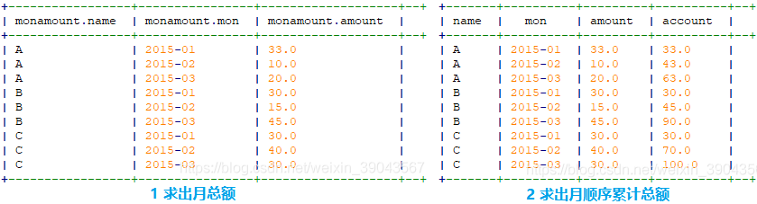

```hive
-- 2 求出月顺序累计总额
SELECT
	name, mon, amount,
	SUM(amount) OVER(
        PARTITION BY name ORDER BY mon DESC ROWS BETWEEN unbounded preceding AND current row
    ) AS account
FROM
	mon_amount
;
```

#### 1.2.3 `collect_list/set` 详解

**用法**

```hive
SELECT col1, COLLECT_LIST/SET(col2)[n] FROM t GROUP BY col1;
```

在每个组中，取出相应的值，其中 `COLLECT_LIST/SET(col2)` 表示取出组内列 `col2` 的所有值到一个列表中，如果加了索引 `[n]`，表示取出列表中的第 `n` 个值。

【注】突破 `GROUP BY` 限制：HIVE 中分组查询要求 `SELECT` 的列是 `GROUP BY` 中出现的列，通过 `COLLECT_LIST/SET` 就能取其他列。

<u>例：按用户分组，取出每个用户看过的所有视频</u>

```hive
-- COLLECT_LIST
SELECT username, collect_list(video_name) FROM t_visit_video GROUP BY username;
```

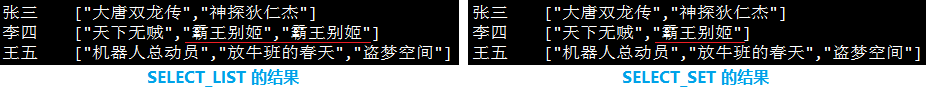

```hive
-- COLLECT_SET
SELECT username, collect_set(video_name) FROM t_visit_video GROUP BY username;
```

### 1.3 排名函数

#### 1.3.1 概览

* `rank()` - 排序表示行号，相同时并列排名，后面的排名出现跳跃
* `dense_rank()` - 排序表示行号，相同时并列排名，后面的排名继续连续
* `row_number()` - 排名表示行号，递增顺序，不会重复

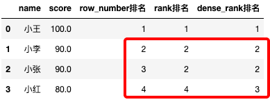

#### 1.3.2 `row_number` 详解

**用法**

```hive
ROW_NUMBER() OVER(PARTITION BY COLUMN1 ORDER BY COLUMN2 DESC)
```

`ROW_NUMBER()` 就是增加序号，`OVER()` 表示这个操作是针对窗口进行的。在窗口中，首先根据 `COLUMN1` 进行结果集分组，结果集内部按照 `COLUMN2` 排序，输出结果是类似于**双重分组**的结果。

<u>例1：每个部门的员工按照工资降序排序</u>

```hive
SELECT
    *,row_number() OVER(PARTITION BY dept ORDER BY salary DESC) AS rn
FROM
    ods_num_window
;
```

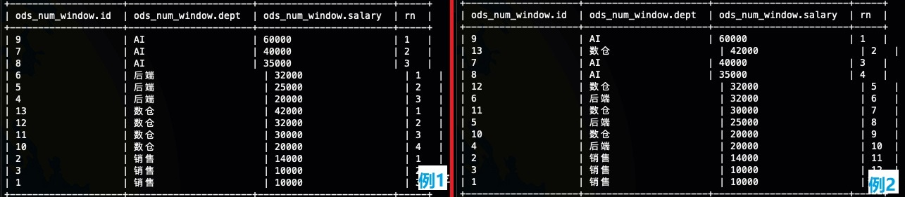

<u>例2：全部的员工按照工资降序排序</u>

```hive
SELECT
    *,row_number() OVER(ORDER BY salary DESC) AS rn
FROM
    ods_num_window
;
```

**场景**

> Top-N 查询
>
> 根据某个值排序，取其中 Top-N 的行。

<u>例：取每个部门的工资前两名</u>

在每个部门内按照薪资排序（双重分组）后，取排序为 Top-N 的行即可。

```hive
SELECT *
FROM(
   SELECT
       *,row_number() OVER(PARTITION BY dept ORDER BY salary DESC) AS rn
   FROM
       ods_num_window
) tmp
WHERE
    rn <=2
;
```

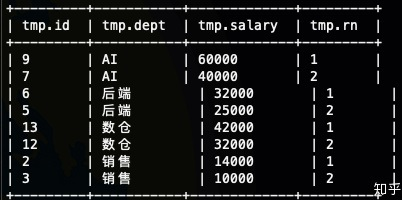

> 计算连续
>
> 筛选某个值连续单调的一串记录。

<u>例：计算连续访问天数最大的 10 位用户</u>

针对同一个用户，按照其访问时间排序（双重分组），然后我们用日期的数字减去对应的排序得到一个值，如果访问时间是连续的话，这个值就一定相同，从而能够判断连续性。

```hive
-- 1 查验数据
SELECT
    id,ctime,
    row_number(PARTITION BY id ORDER BY ctime ) AS rn
FROM
    ods_user_log
;
```

```hive
-- 2 日期减法
SELECT
    id, ctime,
    date_sub(CAST(ctime as date), row_number() OVER(PARTITION BY id ORDER BY ctime)),
    row_number() OVER(PARTITION BY id ORDER BY ctime) AS rn
FROM
    ods_user_log
;
```

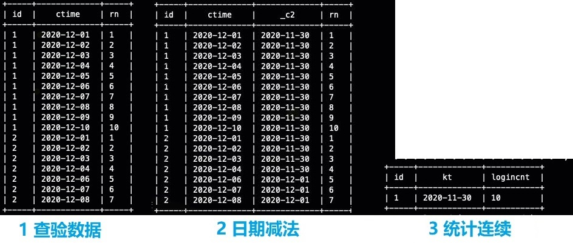

```hive
-- 3 统计连续
SELECT
    id,kt,count(1) AS loginCnt
FROM (
    SELECT
        id,ctime,
        date_sub(CAST(ctime as date),row_number() OVER(PARTITION BY id ORDER BY ctime)) AS kt,
        row_number() OVER(PARTITION BY id ORDER BY ctime) AS rn
    FROM
        ods_user_log
) tmp
GROUP BY
    id,kt
HAVING
    count(1)>=7
;
```

> 分组抽样
>
> 在每个组中都随机抽取一部分数据。

使用 `row_number` 在子窗口内随机排序，然后抽出所需的样本数据即可。

```hive
SELECT *
FROM (
    SELECT
        id,ctime,
        row_number() OVER(PARTITION BY id ORDER BY rand()) AS rn
    FROM
        ods_user_log
) tmp
WHERE rn<=3
;
```

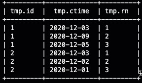

## 2 复杂类型操作

### 2.1 `Map` 类型

#### 2.1.1 基础结构

* 创建含 map 类型的表

  ```hive
  CREATE TABLE temp_db.map_test(
      id int COMMENT "源数据主键 id",
      smap map<string,string> COMMENT "基于 string 的 map 类型",
      imap map<string,int> COMMENT "基于 int 的 map 类型"
  );
  ```

  map 的存储形式为 `key-value` 键值对，如：`{"张三", 23, "性别", "male"}`，每两个表示一对键值。

* 插入 map 类型的数据

  ```hive
  INSERT INTO temp_db.map_test(id, smap, imap)
  SELECT
  	12,
  	map('姓名', '张三') AS pp,
  	map('年龄',23,'性别',1) AS dd
  ;
  
  INSERT INTO temp_db.map_test(id, smap, imap)
  SELECT
  	14,
  	map('地址', '安徽') AS dd,
  	map('年级', 3)
  ;
  ```

  【注】这里的 map 引用使用圆括号 `()`，有时候会错误写成大括号 `{}`.

* 查询 map 类型的列

  ```hive
  SELECT
  	smap['姓名'] AS arg1,
  	imap['年龄'] AS age
  FROM
  	temp_db.map_test
  ;
  ```

  查询方法就是，`map类型名[key]`。

* 删除 map 类型的数据

  HIVE 不支持删除操作，也不支持修改，可以使用 `INSERT OVERWRITE` 覆写。

#### 2.1.2 操作函数

* `map_keys(colName)` - key 键查询，返回一个 Array，如果希望提取，则使用 `[index]`，如 `map_keys(smap)[0]`

  ```hive
  SELECT
  	map_keys(smap) AS smap_keys,
  	map_keys(imap) AS imap_keys
  FROM
  	temp_db.map_test
  ;
  ```

* `map_values(colname)` - value 值查询，返回一个 Array，如果希望提取，则使用 `[index]`，如 `map_values(smap)[0]`

  ```hive
  SELECT
  	map_values(smap) AS s_values,
  	map_values(imap) AS i_values
  FROM
  	temp_db.map_test
  ;
  ```

* `size(colName)` - 键值对统计，返回对应列的 key-value 个数

  ```hive
  SELECT
  	size(imap) AS pair_cnt
  FROM
  	temp_db.map_test
  ;
  ```

#### 2.1.3  数据加工

* 将 map 列拆分为 key、value 列

  ```hive
  -- smap 中只存在单个 key-value 的情况，所有 lateral 之后，数据由单列变成双列，但是行数没有变化
  SELECT
  	id,
  	skey,
  	svalue
  FROM
  	temp_db.map_test
  LATERAL VIEW explode(smap) tb AS skey, svalue
  ;
  ```

  ```hive
  -- imap 中存在多个键值对，这顿操作之后，行数会增加
  SELECT
  	id,
  	ikey,
  	ivalue
  FROM
  	temp_db.map_test
  LATERAL VIEW explode(imap) tb AS ikey, ivalue
  ;
  ```

### 2.2 `Array` 类型

#### 2.2.1 基础结构

* 创建含 array 类型的表

  ```hive
  CREATE TABLE temp_db.array_test(
      id int COMMENT '源数据主键 id',
      year_arr array<string> COMMENT '数组记录, 年份',
      score_arr array<string> COMMENT '数组记录, 分数'
  );
  ```

* 插入 array 类型的数据

  ```hive
  INSERT INTO temp_db.array_test (id, year_arr, score_arr)
  SELECT
  	12,
  	array('1991','1990','1989'),
  	array('56','20','23')
  ;
  ```

* 查询 array 类型的列

  ```hive
  SELECT
  	id,
  	year_arr[1],
  	year_arr[2]
  FROM
  	temp_db.array_test
  ;
  ```

  【注】如果数组越界了，会报错。

#### 2.2.2 操作函数

* `array_contains(colName, colValue)` - 查询 array 列 `colName` 中是否包含值 `colValue`，返回 `Boolean` 值

  ```hive
  SELECT *
  FROM
  	temp_db.array_test
  WHERE
  	array_contains(year_arr, '1990')
  ;
  ```

#### 2.2.3 数据加工

* 将 array 列拆分成多<u>行</u>记录

  ```hive
  SELECT
  	col1
  FROM
  	temp_db.array_test
  LATERAL VIEW explode(year_arr) tb AS col1
  ; 
  ```

### 2.3 相关的关键字

#### 2.3.1 `explode` 详解

##### 单列 `explode`

`explode` 将 HIVE 一行中复杂的 array 或者 map 结构拆分成多行。该 `UDTFs`（User Define Table generation Functions，为每一行输入生成零至多行数据）可以作为 `SELECT` 表达式列表和 `LATERAL VIEW`（[下见](#2.3.2 `lateral view` 详解)）的一部分。

<u>例：`explode` 的使用</u>

设有一张 `myTable` 表，有一列 `myCol` 和两行值，则使用效果如下。

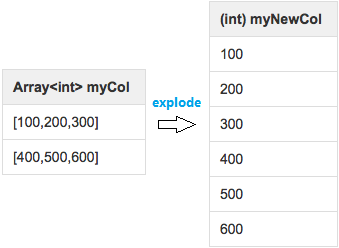

```hive
SELECT explode(myCol) AS myNewCol FROM myTable;                   -- 效果如上图，分成一列
SELECT explode(myMap) AS (myMapKey, myMapValue) FROM myMapTable;  -- 效果同理，分成两列
```

【注】如果表含有多列，需要将拆分的列与原有的其他列进行聚合，常用下面的 [`lateral view`](#2.3.2 `lateral view` 详解) 关键字。

【技】对于字符串类型，可以使用 `split(colName, sepStr)` 进行分割得到列表。

##### 单列 `posexplode`

`posexplode` 用来在 `explode` 的同时产生一个编号列。

<u>例：`posexplode` 的使用</u>

```hive
SELECT
    class,
    student_index + 1 AS student_index,  -- 编号 + 1 从一开始
    student_name
FROM
    default.class_info
LATERAL VIEW posexplode(split(student,',')) t AS student_index,student_name
;
```

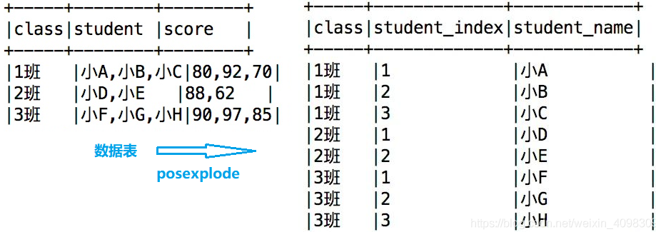

##### 多列 `pos/explode`

同时对多列进行 explode，有两种预期结果：

1. 倍增：每列都会在上个 explode 结果基础上倍增行，例如列 1 三个元素拆成三行，列 2 三个元素拆成九行，以此类推
2. 同增：各个列的元素一一对应地 explode，例如列 1 三个元素拆成三行，列 2 三个元素继续对应拆成三行，以此对应

【技】通过 `array(col1, col2, ...)` 构造出列表然后 `explode` 可实现类似 `zip()` 函数的转置效果。

<u>例1：倍增的拆分</u>

这是默认的预期，即使用两次 `LATERAL VIEW explode`，得到的是类似笛卡尔积的倍增结果。

```hive
SELECT
    class,student_name,student_score
FROM
    default.class_info
    LATERAL VIEW explode(split(student,',')) sn as student_name
    LATERAL VIEW explode(split(score,',')) sc as student_score
;
```

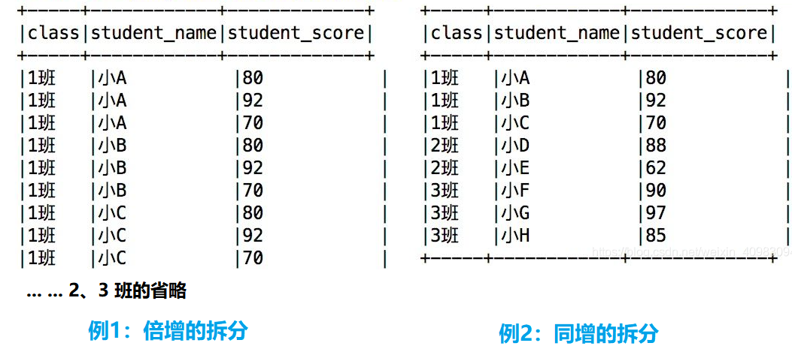

<u>例2：同增的拆分</u>

如果各列的元素一一对应，则借助 `posexplode` 的序号效果，通过 `WHERE` 筛选只保留行号相同的 `index` 即可。

```hive
SELECT
    class,student_name,student_score
FROM
    default.class_info
    LATERAL VIEW posexplode(split(student,',')) sn as student_index_sn,student_name
    LATERAL VIEW posexplode(split(score,',')) sc as student_index_sc,student_score
WHERE
    student_index_sn = student_index_sc;
```

#### 2.3.2 `lateral view` 详解

`lateral view` 用于和 `split`，`explode` 等 `UDTFs` 一起使用（将一行数据拆成多行数据），在此基础上可以对拆分后的数据进行聚合。`lateral view` 首先为原始表的每行调用 `UDTF`，`UDTF` 会把一行拆分成一或者多行，`lateral view` 再把结果组合，产生一个支持别名的虚拟表，以及其中支持别名的虚拟列。

**语法**

`lateralView` 用法

```hive
LATERAL VIEW udtf(expression) tableAlias AS columnAlias (’,’ columnAlias)*
```

`fromClause` 用法

```hive
FROM baseTable (lateralView)*
```

<u>例：统计每个广告出现的次数</u>

```hive
-- 1 将单行列表转为多行单值
SELECT
	pageid, adid
FROM
	pageAds
LATERAL VIEW explode(adid_list) adTable AS adid
;
```

```hive
-- 2 统计每个广告出现的次数
SELECT
	adid,
	count(1)
FROM pageAds
LATERAL VIEW explode(adid_list) adTable AS adid
GROUP BY
	adid
;
```

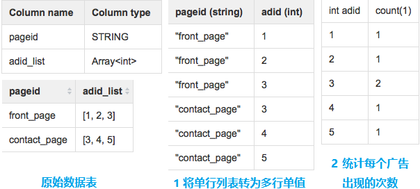

## 3 字段处理

### 3.1 类型转换

### 3.2 文本处理

* `trim(src_str)` - 去除源字符串 `src_str` 中的空格

  ```hive
  >>> select trim('中文空格 dsfs ');
  >>> '中文空格 dsfs'
  >>> select trim('英文空格 dsfs ');
  >>> '英文空格 dsfs'
  ```

* `replace(src_str, dst_exp, rep_str)` - 源字符串 `src_str` 中匹配目标字符串 `dst_str`，替换为 `rep_str`

  ```hive
  >>> select replace('asdas dsfs ',' ','');
  >>> SemanticException Line 0:-1 Invalid function 'replace'
  >>> select regexp_replace('中文空格 dsfs ',' ','');
  >>> '中文空格dsfs'
  ```

* `regexp_replace(src_str, reg_exp, rep_str)` - 源字符串 `src_str` 中匹配正则表达式 `reg_exp`，替换为 `rep_str`

  ```hive
  >>> select regexp_replace('\t abc \n def \r hij', '\n|\t|\r|', '');
  >>> ' abc def hij'
  >>> select regexp_replace('\t abc \n def \r hij', '\n|\t|\r| |', '');
  >>> 'abcdefhij'
  ```