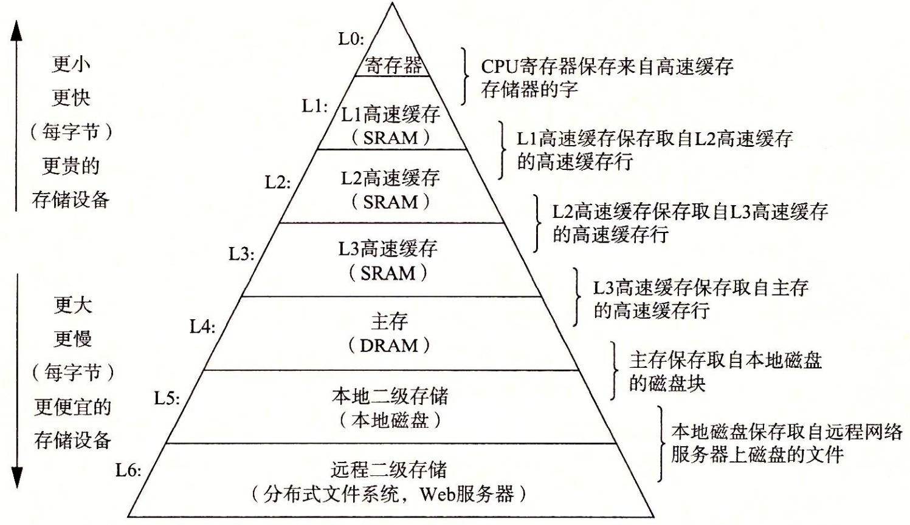

## 目录

[toc]

本章沿着最简单的 hello 程序开始：

```c
// code/intro/hello.c

#include<stdio.h>
int main()
{
    printf("hello, world\n");
    return 0;
}
```

简要介绍一些逐步出现的关键概念、专业术语和组成部分。

## 1.1 信息的概念

hello 程序的生命周期是从一个源程序 / 源文件开始的。

* 源程序：由值 0 和 1 组成的位 / 比特序列，8 位组成一组称为字节
* ASCII 码：C 语言的码表，每个字节所代表的整数值，都对应相应的字符
* 文件：只由 ASCII 字符构成的文件称为<u>文本文件</u>，其他称为<u>二进制文件</u>

hello 程序说明了一个**基本思想**，系统中所有的信息都是由一串<u>比特序列</u>表示的。区分不同数据对象的唯一方法是其<u>上下文</u>。总而言之就是，**信息 = 位 + 上下文**。

## 1.2 程序的编译

hello 程序并不能直接执行，需要被其他程序转化为一系列的低级<u>机器语言</u>指令，称为<u>目标程序 / 可执行目标文件</u>。

在 Unix 系统上，从源文件到目标文件的转化是由编译系统完成的。

编译的命令：

```sh
linux> gcc -o hello hello.c  # 读取源文件 hello.c 翻译成目标文件 hello
```

编译的流程：


1. 预处理阶段

   预处理器（cpp）根据以字符 `#` 开头的命令，修改原始的 C 文件。

   例如，`hello.c` 中第 1 行的 `#include<stdio.h>` 告诉编译器读取系统头文件 `stdio.h` 的内容，并将其直接插入到程序文本中。结果就得到了另一个 C 程序，通常以 `.i` 作为文件扩展名。

2. 编译阶段

   编译器（ccl）将 <u>C 语言的 `.i` 文本文件</u>翻译成<u>低级语言的 `.s` 文本文件</u>。

   例如，从 `hello.i` 翻译成 `hello.s` 后，函数 `main` 的定义如下所示：

   ```python
   main:
   	subq	$8, &rsp
   	movl	$.LC0, %edi
   	call	puts
   	movl	$0, %eax
       addq	$8, %rsp
       ret
   ```

   可以看到，每条语句都以文本格式描述了一条低级语言指令。

3. 汇编阶段

   汇编器（as）将<u>低级语言的 `.s` 文本文件</u>翻译成<u>机器语言的 `.o` 二进制文件</u>。

   例如，`hello.s` 中的低级语言被翻译成机器指令，并打包成可重定位目标程序（relocatable object program）的格式，保存到 `hello.o` 中。

4. 链接阶段

   链接器（ld）负责处理不同 `.o` 文件的合并。

   例如，hello 程序中用到了 `printf` 函数，但它存在于名为 `printf.o` 的已编译文件中，于是链接器就会完成两者的合并工作，最后得到可执行文件。

## 1.3 程序的运行

本节将简要介绍，在 Unix 系统上运行可执行文件后，其中发生的事情。

```sh
linux> ./hello
hello, world
linux>
```

### 1.3.1 系统的硬件组成


1. 总线

   总线是贯穿整个系统的电子管道，携带信息字节并负责在各个部件间传递。

   通常总线被设计成传送<u>定长的字节块</u>，也就是**字（word）**。字中的字节数（即字长）是一个基本的系统参数。

2. I/O 设备

   I/O（输入/输出）设备是系统与外部世界的联系通道。

   每个 I/O 设备都通过一个控制器或适配器与 I/O 总线相连。<u>控制器</u>是 I/O 设备本身或主板上的芯片组；<u>适配器</u>则是一块插在主板插槽上的卡。

3. 主存

   主存是一个临时存储设备，在处理器运行时用来存放程序和程序处理的数据。

   物理上来说，主存由一组<u>动态随机存取存储器（DRAM）</u>芯片组成；逻辑上来说，存储器是一个<u>线性的字节数组</u>，每个字节都有唯一的地址（数组索引）。

4. 处理器

   处理器是解释（或执行）存储在主存中指令的引擎。

   处理器的核心是大小为一个字的寄存器，称为**程序计数器（PC）**，时刻指向主存中的某条机器指令，围绕主存、寄存器、算术/逻辑单元（ALU）参与指令执行。因此，处理器在指令要求下的可能有以下操作：

   * 加载：从主存复制一个字节或一个字到寄存器，以覆盖寄存器原来的内容
   * 存储：从寄存器复制一个字节或一个字到主存，以覆盖某个位置原来的内容
   * 操作：把两个寄存器的内容复制到 ALU，ALU 对这两个字做算术运算，并将结果放到一个寄存器中
   * 跳转：从指令本身抽取一个字，并将其复制到 PC 中，以覆盖 PC 中原来的值

### 1.3.2 程序的执行过程


## 1.4 存储的层次结构

### 1.4.1 高速缓存

处理器与主存之间的运算速度差异，导致数据交换愈发困难。对此，系统设计者采用了更小更快的设备，称为**高速缓存存储器（cache memory）**，简称高速缓存（cache）。高速缓存在寄存器与主存之间，充当着数据临时集结区域的角色，存放处理器<u>近期可能会需要的信息</u>，这种方法的可行性由程序的**空间局部性和时间局部性**保证。


上图是一个典型系统中的高速缓存，现在的机器一般由一级、二级、三级高速缓存，容量逐渐扩大，速度逐渐降低。

总而言之，要意识到，利用高速缓存存储器，能够将程序的<u>性能提高一个数量级</u>。

### 1.4.2 层次结构

每个计算机系统中的存储设备，都被组织成了一个存储器层次结构：



## 1.5 操作系统

操作系统是应用程序和硬件之间插入的一层软件，它由两个基本功能：

* 防止硬件被失控的程序滥用
* 向应用程序提供简单一致的机制来操作不同设备

操作系统通过<u>进程、虚拟内存、文件</u>这几个抽象概念，来实现上述两个功能。


### 1.5.1 进程

进程是操作系统对一个正在运行的程序的一种抽象。

操作系统保持跟踪进程运行所需的所有状态信息，这种状态称为<u>上下文</u>。操作系统控制处理器在不同的进程之间切换，称为<u>上下文切换</u>，主要步骤为：保存当前进程的上下文、恢复新进程的上下文、将控制权传递到新进程。

例如，并发的进程 `shell` 和 `hello` 会进行上下文切换，操作系统的内核（kernel）负责管理进程的转换。


【注1】内核：内核不是一个独立的进程，而是系统管理全部进程所用代码和数据结构的集合。

【注2】线程：在现代系统种，一个进程实际上可以由多个称为线程的执行单元组成。每个线程都运行在进程的上下文中，并共享相同的代码和全局数据。

### 1.5.2 虚拟内存

虚拟内存是一个抽象概念，它为每个进程提供了一个假象，即每个进程都独占低使用主存。每个进程看到的内存都是一致的，称为虚拟地址空间。如下图所示。


* 代码和数据

  对所有进程来说，代码都是从同一固定地址开始的，紧接着是和 C 全局变量相对于的数据位置。

* 堆

  堆可以在运行时动态地扩展和收缩。

* 共享库

  用来存放向 C 标准库和数学库这样的共享的代码和数据的区域。

* 栈

  栈可以在运行时动态地扩展和收缩。特别地，每调用一个函数，栈就会增长；从一个函数返回，栈就会收缩。

* 内核虚拟内存

  为内核保留的区域，不允许应用程序读写它，而必须调用内核来在此执行操作。

【注】为了实现高效的交互，一个基本思想是，把一个进程虚拟内存的内容存储在磁盘上，然后用主存作为高速缓存。

### 1.5.3 文件

**文件就是字节序列**，仅此而已。

这个概念非常强大，每个 I/O 设备（磁盘、键盘、显示器、网络等）都可以看成是文件，它向应用程序提供了一个统一的视图，来看待系统中可能含有的所有各式各样的 I/O 设备。

## 1.6 重要概念

### 1.6.1 Amdahl 定律

思想：对系统的某个部分加速时，其对系统整体性能的影响取决于该部分的**重要程度**和**加速程度**。

定义：

设系统执行应用程序的时间为 $T_\text{old}$，某个部分所需执行时间占比为 $\alpha$，提升性能比例为 $k$，于是提升后所需执行时间
$$
T_\text{new} = \left( 1-\alpha \right) T_\text{old} + \left( \alpha T_\text{old}/k \right) = T_\text{old}\left[ (1-\alpha) + \alpha/k \right]
$$
提升前后的加速比
$$
S = \frac{T_\text{old}}{T_\text{new}} = \frac{1}{\left(1-\alpha\right) + \alpha / k}
$$
观点：

* 要想显著加速整个系统，必须提升全系统中相当大的部分的速度
* 当性能提升比例趋于 $\infin$ 时，$S \rightarrow 1/\left( 1 - \alpha \right)$ 仍是有限的

### 1.6.2 并发和并行

#### 概念

* 并发：一个通用概念，指一个系统同时具有多个活动

* 并行：一个特指概念，指使用并发来让一个系统运行更快

* 处理器系统

   

  * 单处理器系统：字如其意

  * 多处理器系统：由单个内核控制多个处理器的系统

#### 线程级并发

多核处理器：多个 CPU（核）集成到一个集成电路芯片上，从而**支持进程级并发**

超线程技术：涉及 CPU 程序控制硬件的多备份（如程序计数器和寄存器文件），和程序执行硬件的单份（如浮点数运算单元），从而**支持线程快速切换与并发**

#### 指令级并行
