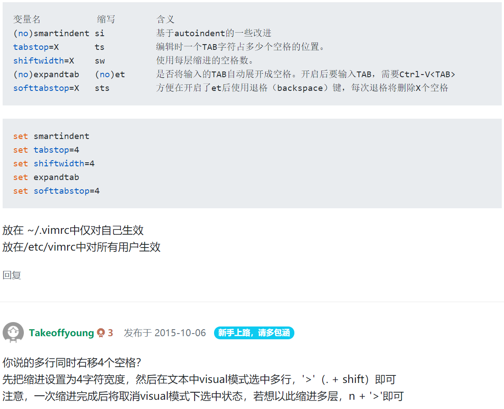

### 目录

[toc]

### 统计字符串出现次数

关键命令：

```shell
:%s/pattern//gn
```

参数说明：

* `%` - 指明操作区间，%表示全文本；可以使用1,$或者行区间代替

* `s` – substitute，表示替换

* `pattern` - 要查找的字符串

* `//` - 替代文本应该放在这里，两个斜杠中间没有任何字符表示无替代文本

* `g` – Replace all occurrences in the line. Without this argument, replacement occurs only for the first occurrence in each line

* `n` – Report the number of matches, and do not actually substitute

  注：这是核心功能，同时也说明为什么//之间可以添加任意字符。

一些引申出的应用：

(1) 统计 `k` 行到l行出现 `pattern` 的次数

```shell
:k,ls/pattern//gn
```

(2) 统计在当前编辑文本出现的次数

```shell
:%s/pattern//gn
```

(3) 统计在文件中出现的行数

```shell
cat file | grep –i pattern | wc –l
```

### 设置缩进4个空格



```shell
set nu   # 设置显示行号
```

