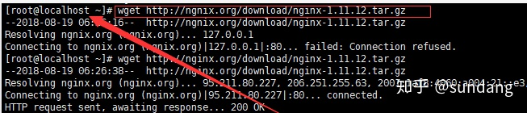
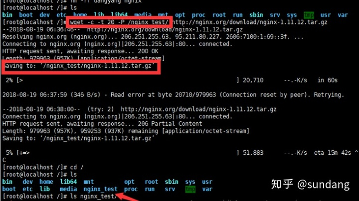
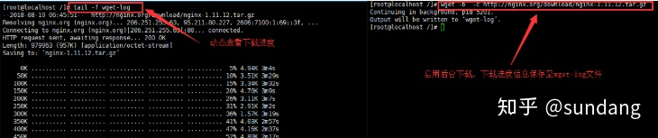
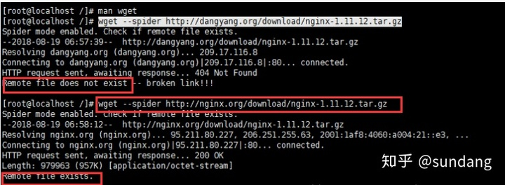
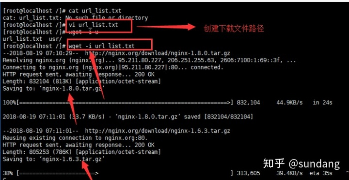

## 目录

[toc]

## 1 文件操作

## 2 文件压缩

Linux下常见的压缩包格式有5种: `zip` `tar.gz` `tar.bz2` `tar.xz` `tar.Z`. 其中 `tar` 是种打包格式，`gz` 和 `bz2` 等后缀才是指代压缩方式 `gzip` 和 `bzip2`。

### 2.1 `zip` 文件

* `zip [-AcdDfFghjJKlLmoqrSTuvVwXyz$][-b <工作目录>][-ll][-n <字尾字符串>][-t <日期时间>][-<压缩效率>][压缩文件][文件...][-i <范本样式>][-x <范本样式>]`

  * `-A` - 调整可执行的自动解压缩文件
  * `-b<工作目录>` - 指定暂时存放文件的目录
  * `-c` - 替每个被压缩的文件加上注释
  * `-d` - 从压缩文件内删除指定的文件
  * `-D` - 压缩文件内不建立目录名称
  * `-f` - 更新现有的文件
  * `-F` - 尝试修复已损坏的压缩文件
  * `-g` - 将文件压缩后附加在既有的压缩文件之后，而非另行建立新的压缩文件
  * `-h` - 在线帮助
  * `-i<范本样式>` - 只压缩符合条件的文件
  * `-j` - 只保存文件名称及其内容，而不存放任何目录名称
  * `-J` - 删除压缩文件前面不必要的数据
  * `-k` - 使用 MS-DOS 兼容格式的文件名称
  * `-l` - 压缩文件时，把 `LF` 字符置换成 `LF+CR` 字符
  * `-ll` - 压缩文件时，把 `LF+CR` 字符置换成 `LF` 字符
  * `-L` - 显示版权信息
  * `-m` - 将文件压缩并加入压缩文件后，删除原始文件，即把文件移到压缩文件中
  * `-n<字尾字符串>` - 不压缩具有特定字尾字符串的文件
  * `-o` - 以压缩文件内拥有最新更改时间的文件为准，将压缩文件的更改时间设成和该文件相同
  * `-q` - 不显示指令执行过程
  * `-r` - 递归处理，将指定目录下的所有文件和子目录一并处理
  * `-S` - 包含系统和隐藏文件
  * `-t<日期时间>` - 把压缩文件的日期设成指定的日期
  * `-T` - 检查备份文件内的每个文件是否正确无误
  * `-u` - 与 `-f` 参数类似，但是除了更新现有的文件外，也会将压缩文件中的其他文件解压缩到目录中
  * `-v` - 显示指令执行过程或显示版本信息
  * `-V` - 保存VMS操作系统的文件属性
  * `-w` - 在文件名称里假如版本编号，本参数仅在VMS操作系统下有效
  * `-x<范本样式>` - 压缩时排除符合条件的文件
  * `-X` - 不保存额外的文件属性
  * `-y` - 直接保存符号连接，而非该连接所指向的文件，本参数仅在 UNIX 之类的系统下有效
  * `-z` - 替压缩文件加上注释
  * `-$` - 保存第一个被压缩文件所在磁盘的卷册名称
  * `-<压缩效率>` - 压缩效率是一个介于 `1-9` 的数值

  ```shell
  # ===== 安装 =====
  >> apt-get install zip
  >> yum install zip
  
  # 将 /home/html/ 这个目录下所有文件和文件夹打包为当前目录下的 html.zip：
  zip -q -r html.zip /home/html
  
  # 如果在我们在 /home/html 目录下，可以执行以下命令：
  zip -q -r html.zip *
  
  # 追加新文件 new.c 到 old.zip 中（会删除现有文件）
  zip -m old.zip new.c
  
  # 从压缩文件 cp.zip 中删除文件 a.c
  zip -dv cp.zip a.c
  ```

* `unzip [-cflptuvz][-agCjLMnoqsVX][-P <密码>][.zip文件][文件][-d <目录>][-x <文件>] 或 unzip [-Z]`

  * `-c` - 将解压缩的结果显示到屏幕上，并对字符做适当的转换
  * `-f` - 更新现有的文件
  * `-l` - 显示压缩文件内所包含的文件
  * `-p` - 与 `-c` 参数类似，会将解压缩的结果显示到屏幕上，但不会执行任何的转换
  * `-t` - 检查压缩文件是否正确
  * `-u` - 与 `-f` 参数类似，但是除了更新现有的文件外，也会将压缩文件中的其他文件解压缩到目录中
  * `-v` - 执行是时显示详细的信息，但不解压文件
  * `-z` - 仅显示压缩文件的备注文字
  * `-a` - 对文本文件进行必要的字符转换
  * `-b` - 不要对文本文件进行字符转换
  * `-C` - 压缩文件中的文件名称区分大小写
  * `-j` - 不处理压缩文件中原有的目录路径
  * `-L` - 将压缩文件中的全部文件名改为小写
  * `-M` - 将输出结果送到 `more` 程序处理
  * **`-n`** - 解压缩时不要覆盖原有的文件
  * `-o` - 不必先询问用户，`unzip` 执行后覆盖原有文件
  * `-P<密码>` - 使用 `zip` 的密码选项
  * **`-q`** - 执行时不显示任何信息
  * `-s` - 将文件名中的空白字符转换为底线字符
  * `-V` - 保留 VMS 的文件版本信息
  * `-X` - 解压缩时同时回存文件原来的 `UID`/`GID`
  * `[.zip文件]` - 指定 `.zip` 压缩文件
  * `[文件]` - 指定要处理 `.zip` 压缩文件中的哪些文件
  * `-d<目录>` - 指定文件解压缩后所要存储的目录
  * `-x<文件>` - 指定不要处理 `.zip` 压缩文件中的哪些文件
  * `-Z` - `unzip -Z` 等于执行 `zipinfo` 指令

  ```shell
  # ===== 安装 =====
  >> apt-get install unzip
  >> yum install unzip
  
  # 查看压缩文件中包含的文件：
  >> unzip -l abc.zip 
  Archive: abc.zip
   Length   Date  Time  Name
  --------  ----  ----  ----
    94618 05-21-10 20:44  a11.jpg
    202001 05-21-10 20:44  a22.jpg
      16 05-22-10 15:01  11.txt
    46468 05-23-10 10:30  w456.JPG
    140085 03-14-10 21:49  my.asp
  --------          -------
    483188          5 files
  
  # -v 参数用于查看压缩文件目录信息，但是不解压该文件
  >> unzip -v abc.zip
  Archive: abc.zip
  Length  Method  Size Ratio  Date  Time  CRC-32  Name
  -------- ------ ------- -----  ----  ----  ------  ----
    94618 Defl:N  93353  1% 05-21-10 20:44 9e661437 a11.jpg
   202001 Defl:N  201833  0% 05-21-10 20:44 1da462eb a22.jpg
     16 Stored    16  0% 05-22-10 15:01 ae8a9910 ? +-|￥+-? (11).txt
    46468 Defl:N  39997 14% 05-23-10 10:30 962861f2 w456.JPG
   140085 Defl:N  36765 74% 03-14-10 21:49 836fcc3f my.asp
  --------     ------- ---              -------
   483188      371964 23%              5 files
   
  # 解压指定文件 target.file 到当前目录
  >> unzip abc.zip target.file -d .
  ```

### 2.2 `tar.xx` 文件

**常用命令**

`tar` 命令的选项有很多(用 `man tar` 可以查看到)，但常用的就那么几个选项，下面来举例说明一下：

```shell
>> tar -cf all.tar *.jpg
# 这条命令是将所有 .jpg 的文件打成一个名为 all.tar 的包。-c 是表示产生新的包，-f 指定包的文件名。

>> tar -rf all.tar *.gif
# 这条命令是将所有 .gif 的文件增加到 all.tar 的包里面去，-r 是表示增加文件的意思。

>> tar -uf all.tar logo.gif
# 这条命令是更新原来 tar 包 all.tar 中 logo.gif 文件，-u 是表示更新文件的意思。

>> tar -tf all.tar
# 这条命令是列出 all.tar 包中所有文件，-t 是列出文件的意思。

>> tar -xf all.tar
# 这条命令是解出 all.tar 包中所有文件，-x 是解开的意思。
```

从 1.15 版本开始 `tar` 就可以**自动识别压缩的格式**，故不需人为区分压缩格式就能正确解压：

```shell
# 解压各类型文件
tar -xvf filename.tar.gz
tar -xvf filename.tar.bz2
tar -xvf filename.tar.xz
tar -xvf filename.tar.Z
```

批量解压

```shell
# bash 方法
for tar in *.tar.gz;  do tar xvf $tar; done
for tar in *.tar.bz2; do tar xvf $tar; done
```

```shell
# 命令行方法
# tar.gz 文件
#   xargs - 得到左边命令的结果
#   -n1 - 列成 n 行 1 列
#   tar 解压命令，作用于之前得到的结果
#   右边命令的参数
ls *.tar.gz | xargs -n1 tar xvf
# bz2 文件
#   -maxdepth 1 - 搜索深度，1 表示当前文件夹
find -maxdepth 1 -name "*.bz2"|xargs -i tar xvjf {  
```

**详解**

首先，是五个是独立的命令，压缩解压都**要用且只能用其中一个**，可以和别的命令连用。

| 独立选项 | 解释                       |
| -------- | -------------------------- |
| `-c`     | 建立压缩档案               |
| `-x`     | 解压                       |
| `-t`     | 查看内容                   |
| `-r`     | 向压缩归档文件末尾追加文件 |
| `-u`     | 更新原压缩包中的文件       |

然后，下面的参数是根据需要在压缩或解压档案时**可选的**。

| 可选选项 | 解释                 |
| -------- | -------------------- |
| `-z`     | 有 `gzip` 属性的     |
| `-j`     | 有 `bz2` 属性的      |
| `-Z`     | 有 `compress` 属性的 |
| `-v`     | 显示所有过程         |
| `-O`     | 将文件解开到标准输出 |

下面的参数 `-f` 是**必须的**：

| 必选选项 | 解释                                                         |
| -------- | ------------------------------------------------------------ |
| `-f`     | 使用的档案名字，切记，这个参数是最后一个参数，后面只能接档案名 |

## 3 文件传输

### 3.1 前言

本文记录 linux 系统中文件传输的多种方式，留作备忘。linux 中文件传输的方式有 `ftp`，`scp`，`rsync`，`rz`，`sz`等，但各个工具的功能又有所区别；

- `ftp` ：`ftp` 是文件服务器，可实现文件的上传下载，存储等功能，但本文不打算介绍 `ftp` 的使用。
- `scp`： `scp` 能够将不同主机的文件进行相互传输，使用简单方便。
- `rz` ： 用于 linux 与 windows 之间的文件上传
- `sz` ： 用于 linux 与 windows 之间的文件下载
- `rsync` ： 文件同步工具，结合 `inotify` 可以实现文件的同步，备份功能。

### 3.2 `scp`

#### 3.2.1 介绍

`scp`是 secure copy 的简写，用于在 Linux 下进行远程拷贝文件的命令，和它类似的命令有`cp`，不过它只是在本机进行拷贝不能跨服务器，而且`scp`传输是加密的（但可能会稍微影响一下速度）。

当你服务器硬盘变为只读 read only system 时，用`scp`可以帮你把文件移出来。另外，`scp`还非常不占资源，不会提高多少系统负荷，在这一点上，`rsync`就远远不及它了。虽然 `rsync`比`scp`会快一点，但当小文件众多的情况下，`rsync`会导致硬盘I/O非常高，而`scp`基本不影响系统正常使用。

`scp`在跨机器复制的时候为了提高数据的安全性，使用了 ssh 连接和加密方式，如果机器之间配置了ssh免密码登录，那在使用`scp`的时候密码都不用输入。

#### 3.2.2 安装

文件传输的**两端机器都需要安装**：

```shell
[root@yufu ~] yum install openssh-clients -y
```

如果想在 windows 下使用和传输，可以用<u>软件 winscp，简单好用</u>，后面的都不用看了。

#### 3.2.3 使用

* `scp [参数] [主机A路径] [主机B路径]`

  * 方向由A到B，其中的远程主机格式为`用户名@服务器IP地址:文件路径`
  * `-1` 强制 `scp` 命令使用协议 `ssh1`

  * `-2` 强制 `scp` 命令使用协议 `ssh2 `
  * `-4` 强制 `scp` 命令只使用 `IPv4` 寻址 
  * `-6` 强制 `scp` 命令只使用 `IPv6` 寻址 
  * `-B` 使用批处理模式（传输过程中不询问传输口令或短语） 
  * `-C` 允许压缩。（将 `-C` 标志传递给 SSH，从而打开压缩功能） 
  * `-p` 保留原文件的修改时间，访问时间和访问权限。 （建议使用，传输时保留属性时间信息，否则会导致时间发生改变无法进行增量传输）
  * `-q` 不显示传输进度条。 （很适合 `crontab` 任务计划中使用）
  * `-r` 递归复制整个目录 
  * `-v` 详细方式显示输出。`scp` 和 `ssh(1)` 会显示出整个过程的调试信息。这些信息用于调试连接，验证和配置问题
  * `-c cipher` 以 cipher 将数据传输进行加密，这个选项将直接传递给 ssh
  * `-F ssh_config` 指定一个替代的 ssh 配置文件，此参数直接传递给 ssh
  * `-i identity_file` 从指定文件中读取传输时使用的密钥文件，此参数直接传递给ssh
  * `-l limit` 限定用户所能使用的带宽，以 `Kbit/s` 为单位
  * `-o ssh_option` 如果习惯于使用 `ssh_config(5)` 中的参数传递方式
  * `-P port` 注意是大写的 P，`port` 是指定数据传输用到的端口号  
  * `-S program` 指定加密传输时所使用的程序。此程序必须能够理解 `ssh(1)` 的选项

例子：

```shell
[root@localhost tmp]#scp -p ./files/yum.log 192.168.214.187:/tmp/demo/
The authenticity of host '192.168.214.187 (192.168.214.187)' can't be established.
RSA key fingerprint is SHA256:BwJdXsDA6F5976fKx1cSxkGJ9/uYYI4zVJ2rd+/Cvj0.
RSA key fingerprint is MD5:85:87:8b:17:d2:79:c7:91:11:46:78:b3:4d:9d:dd:5a.
Are you sure you want to continue connecting (yes/no)? yes
Warning: Permanently added '192.168.214.187' (RSA) to the list of known hosts.
root@192.168.214.187's password: 
yum.log                                                    100%    0     0.0KB/s   00:00

[root@localhost files]#scp -p 192.168.214.187:/tmp/demo/f3.log /tmp/files/
root@192.168.214.187's password: 
f3.log                                                     100%    0     0.0KB/s   00:00 
```

### 3.3 `rz`，`sz`（`lrzsz`）

#### 3.3.1 介绍

`rz`和`sz`指令可以实现 linux 和 windows 之间的文件传输，但要求在windows客户端要安装 Xshell 或 SecureCRT 远程连接工具。

`rz`指令和`sz`指令是一对上传与下载的指令，它们的软件包名为`lrzsz`。

#### 3.3.2 安装

```shell
yum install lrzsz -y
```

#### 3.3.3 使用

在 Xshell 或  SecureCRT 软件下输入：

```shell
ubuntu@VM-16-12-ubuntu:~$ rz
```

```shell
ubuntu@VM-16-12-ubuntu:~$ lz
```

然后直接回车，会弹出文件选择窗口，选择 windows 下的路径就好。

### 3.4 `rsync`

#### 3.4.1 介绍

`rsync` 是可以实现增量备份的工具。

配合任务计划，`rsync` 能实现定时或间隔同步，配合 `inotify` 或 `sersync`，可以实现触发式的实时同步。

`rsync` 可以实现 `scp` 的远程拷贝，`cp`的本地拷贝、`rm`删除和`ls -l`显示文件列表等功能。

（这里暂略）

## 4 文件下载

### 4.1 `wget` 命令行工具

wget - The non-interactive network downloader， 非交互式网络下载工具。

`wget` 命令用来从指定的 URL 下载文件。wget 非常稳定，它在带宽很窄的情况下和不稳定网络中有很强的适应性，如果是由于网络的原因下载失败，wget 会不断的尝试，直到整个文件下载完毕。如果是服务器打断下载过程，它会再次联到服务器上从停止的地方继续下载。这对从那些限定了链接时间的服务器上下载大文件非常有用。

#### 4.1.1 语法

* `wget [option] ... [URL] ...`

（1）启动相关

```shell
-V, --version: 显示版本号
-h, --help: 显示帮助
-b, --background: 启动后转入后台执行
```

（2）日志记录和输入文件选项

```shell
-o: --output-file=file: 把记录写到file文件中
-a: --append-output=file: 把记录追加到file文件中
-i --input-file: 从file中读取url来下载
```

（3）下载选项

```shell
--bind-address=address: 指定本地使用地址
-t, --tries=number: 设置最大尝试连接次数
-c, continue: 接着下载没有下载完的文件
-O, output-document=file: 将下载内容写入到file文件中
--spider: 不下载文件，测试网址是否正确
-T,--timeout=sec: 设置响应超时时间
-w,--wait=sec: 两次尝试之间间隔时间
--limit-rate=rate: 限制下载速率
--progress=type: 设置进度条
```

（4）目录选项

```shell
-P, -directory-prefix=prefix: 将文件保存到指定目录
```

（5）HTTP选项

```shell
--http-user=user: 设置http用户名
--http-passwd=pass: 设置http密码
-U,-user-agent=agent: 伪装代理
-no-http-keep-alive: 关闭http活动链接,变成永久链接
--cookies=off：不使用cookies
--load-cookies=file: 在开始会话前从file文件加载cookies
-s-ave-cookies=file: 在会话结束后将cookie保存到file文件中
```

（6）FTP选项

```shell
--passive-ftp: 默认值，使用被动模式
```

（7）递归下载排除选项

```shell
-A,-accept=list: 分号分割被下载扩展名的列表
-R,-reject=list: 分号分割不被下载扩展名的列表
-D,-domains=list: 分号分割被下载域的列表
--exclude-domains=list: 分号分割不被下载域的列表
```

#### 4.1.2 例子

例1：下载单个文件到当前目录



例2：对于<u>网络不稳定</u>的用户可以使用 `-c` 和 `-t ` 参数，并使用 `-P` 指定存放目录，保证下载任务完成。



【技】判断服务器是否支持断点续传

```shell
curl -i --range 0-9 https://convaisharables.blob.core.windows.net/uniter/img_db/nlvr2_train.tar
HTTP/1.1 206 Partial Content
Content-Length: 10
Content-Type: application/octet-stream
Content-Range: bytes 0-9/19225999360
Last-Modified: Fri, 24 Jan 2020 19:12:50 GMT
ETag: 0x8D7A10167FBC2E7
Server: Windows-Azure-Blob/1.0 Microsoft-HTTPAPI/2.0
x-ms-request-id: 058494ff-801e-009a-7628-635485000000
x-ms-version: 2009-09-19
x-ms-lease-status: unlocked
x-ms-blob-type: BlockBlob
Date: Thu, 17 Jun 2021 03:27:29 GMT
```

若能够找到 `Content-Range`，则表明服务器支持断点续传。

有些服务器还会返回 `Accept-Ranges`，输出结果 `Accept-Ranges: bytes` ，说明服务器支持按字节下载。

例3： 下载大文件时，可以使用 `-b` 参数放到后台去下载，这时会生成 `wget-log` 文件来保存下载进行，可以另外打开一个远程终端登录，使用 `tail -f file` 来动态查看下载进度。



例4：可以使用 `--spider` 参数来判断网址是否有效，不下载。



例5：自动从多个链接下载文件

```text
先创建一个URL文件
使用-i 参数
[root@localhost /]# vi url_list.txt
[root@localhost /]# wget -i url_list.txt 
```



例6： 限制下载速度

```text
[root@localhost /]# wget --limit-root=1k  http://nginx.org/download/nginx-1.8.0.tar.gz
```


### 4.2 `axel` 命令行工具

Axel 是一个轻量级下载程序，支持多线程下载，即对同一个文件建立多个连接，每个连接下载单独的文件片段以更快地完成下载，是 wget 的出色替代者。

#### 4.2.1 安装

```shell
[在 Debian/Ubuntu/LinuxMint 上安装 Axel]
$ sudo apt-get install axel

[在 RHEL/CentOS 上安装 Axel]
$ sudo yum install axel

[在 Fedora 上安装 Axel]
$ sudo dnf install axel

[在 openSUSE 上安装 Axel]
$ sudo zypper install axel

[在 Mageia 上安装 Axel]
$ sudo urpmi axel

[在基于 Arch Linux 的发行版安装 Axel]
$ sudo pacman -S axel
```

#### 4.2.2 语法

* `axel [options] url1 [url2] [url...]`

选项

```
--max-speed=x           -s x    最大速度 (字节/秒)
--num-connections=x     -n x    最大连接数 
--output=f              -o f    指定文件名，即自定义存储路径
--search[=x]            -S [x]  Search for mirrors and download from x servers 
--header=x              -H x    添加header 
--user-agent=x          -U x    设置用户代理 
--no-proxy              -N      不使用任何代理 
--quiet                 -q      Leave stdout alone
--verbose               -v      显示更多状态信息 
--alternate             -a      显示简单进度条 
--help                  -h      帮助 
--version               -V      版本信息
```

帮助

```
man axel
```

#### 4.2.3 例子

例1：下载单个文件、恢复下载

```shell
$ axel https://download.owncloud.org/community/owncloud-9.0.0.tar.bz2
```

下载文件时，我们可以看到文件的信息（建立的连接数、下载速度、下载进度、完成下载所花费的时间以及连接完成的时间）。

Axel <u>默认具有</u>恢复未完成的下载的行为。Axel 在下载文件时定期更新状态文件（扩展名为 `.st`），只要使用相同的 axel 命令，它将会检查 `file` 和 `file.st`，如果找到，它会从停止处恢复下载。

例2：并行下载

```shell
$ axel -n 20 -a -o /home/ http://kdl.cc.ksosoft.com/wps-community/download/6757/wps-office-10.1.0.6757-1.x86_64.rpm
```

其中，"-n"线程数、"-o"下载保存目录、"-a"简略下载条。

### 4.3 `aria2` 命令行工具

### 4.4 文件校验

#### 4.4.1 `md5sum`

MD5 全称是报文摘要算法（Message-Digest Algorithm 5），此算法对任意长度的信息逐位进行计算，产生一个二进制长度为128位（十六进制长度就是32位）的“指纹”（或称“报文摘要”），不同的文件产生相同的报文摘要的可能性是非常非常之小的。

`md5sum` 命令采用 MD5 报文摘要算法（128位）计算和检查文件的校验和。一般来说，安装 Linux 后，就会有 `md5sum` 这个工具，直接在命令行终端直接运行。

语法：

```shell
md5sum [选项] 参数
```

选项：

* `-b 或 --binary` - 把输入文件作为二进制文件看待
* `-t 或 --text` - 把输入的文件作为文本文件看待（默认）
* `-c 或 --check` - 用来从文件中读取 md5 信息检查文件的一致性（不细说了，详见 `info`)
* `--status` - 这个选项和 `check` 一起使用，在 `check` 的时候，不输出，而是根据返回值表示检查结果
* `-w 或 --warn` - 在 `check` 的时候，检查输入的 md5 信息又没有非法的行，如果有则输出相应信息

参数：

* `文件`：指定保存着文件名和校验和的文本文件

示例：

```shell
# 查看一个字符串的 md5 值 (linux 终端里查看出来的 md5 值都是 "32位小写" 格式的值)

[root@web-master ~]# echo -n "hello world"|md5sum
5eb63bbbe01eeed093cb22bb8f5acdc3  -

[root@web-master ~]# echo -n "hello world"|md5sum |cut -d" " -f1
5eb63bbbe01eeed093cb22bb8f5acdc3

# 命令解释：
# md5sum：显示或检查 MD5(128-bit) 校验和，若没有文件选项，或者文件处为"-"，则从标准输入读取。
# echo -n：不打印换行符。(注意: echo -n 后面的 -n 参数必须加上, 这样算出的字符串的 md5 值才正确)
# cut：cut 用来从标准输入或文本文件中剪切列或域。剪切文本可以将之粘贴到一个文本文件。
# 	-d 指定与空格和 tab 键不同的域分隔符
# 	-f1 表示第一个域。
```

```shell
# 查看一个文件的 md5 值

# 先建立文件
[root@web-master ~]# echo "test md5" > kevin.sql
 
# 查看并获取这个文件的 md5 值
[root@web-master ~]# md5sum kevin.sql
170ecb8475ca6e384dbd74c17e165c9e  kevin.sql
 
[root@web-master ~]# md5sum kevin.sql|cut -d" " -f1
170ecb8475ca6e384dbd74c17e165c9e
 
# 生成这个个文件的 md5 值
[root@web-master ~]# md5sum kevin.sql > kevin.sql.md5
 
# 检查两个文件是否一样，可以通过比较两个文件的 md5 值 (后续可以用这个方法来检验 kevin.sql 文件是否被修改)
[root@web-master ~]# md5sum kevin.sql
170ecb8475ca6e384dbd74c17e165c9e  kevin.sql
 
[root@web-master ~]# cat kevin.sql.md5
170ecb8475ca6e384dbd74c17e165c9e  kevin.sql

[root@web-master ~]# md5sum kevin.sql -c kevin.sql.md5
```

## 5 文件查看

### 5.1 vim

### 5.2 tail

tail 命令可用于查看文件尾部的内容。

语法：

```shell
tail [参数] [文件] 
```

选项：

* `-f` - 循环读取
* `-q` - 不显示处理信息
* `-v` - 显示详细的处理信息
* `-c<数目>` - 显示的字节数
* `-n<行数>` - 显示文件的尾部 n 行内容
* `--pid=PID` - 与 `-f` 合用,表示在进程 ID, PID 死掉之后结束
* `-q, --quiet, --silent` - 从不输出给出文件名的首部
* `-s, --sleep-interval=S` - 与 `-f` 合用,表示在每次反复的间隔休眠 S 秒

示例：

```shell
tail notes.log			# 默认显示最后 10 行
tail -f notes.log		# 查阅不断更新的文件
tail -n +20 notes.log	# 显示文件 notes.log 的内容，从第 20 行至文件末尾
tail -c 10 notes.log	# 显示文件 notes.log 的最后 10 个字符
```

### 5.3 文件统计

统计所有级别文件

```shell
du -sh ./*

# -s 表示统计汇总的意思，即只输出一个总和大小
# -h 表示大小单位自动优化
```

统计当前一级文件

```shell
du -h --max-depth=1 ./*

# --max-depth 控制检索深度
```

### 5.4 信息统计

* `grep` 命令 - global search regular expression(RE) and print out the line，全面搜索正则表达式并把行打印出来

  


【技1】查询结构再过滤

```shell
grep ... | grep ...
```

【技2】去除重复行

```shell
grep ... | uniq | less
```

* `uniq` - 

```shell
[zhangy@BlackGhost ~]$ uniq --help
用法：uniq [选项]... [文件]
从输入文件或者标准输入中筛选相邻的匹配行并写入到输出文件或标准输出。

不附加任何选项时匹配行将在首次出现处被合并。

长选项必须使用的参数对于短选项时也是必需使用的。
 -c, --count              //在每行前加上表示相应行目出现次数的前缀编号
 -d, --repeated          //只输出重复的行
 -D, --all-repeated      //只输出重复的行，不过有几行输出几行
 -f, --skip-fields=N     //-f 忽略的段数，-f 1 忽略第一段
 -i, --ignore-case       //不区分大小写
 -s, --skip-chars=N      //根-f有点像，不过-s是忽略，后面多少个字符 -s 5就忽略后面5个字符
 -u, --unique            //去除重复的后，全部显示出来，根mysql的distinct功能上有点像
 -z, --zero-terminated   end lines with 0 byte, not newline
 -w, --check-chars=N      //对每行第N 个字符以后的内容不作对照
 --help              //显示此帮助信息并退出
 --version              //显示版本信息并退出
```

