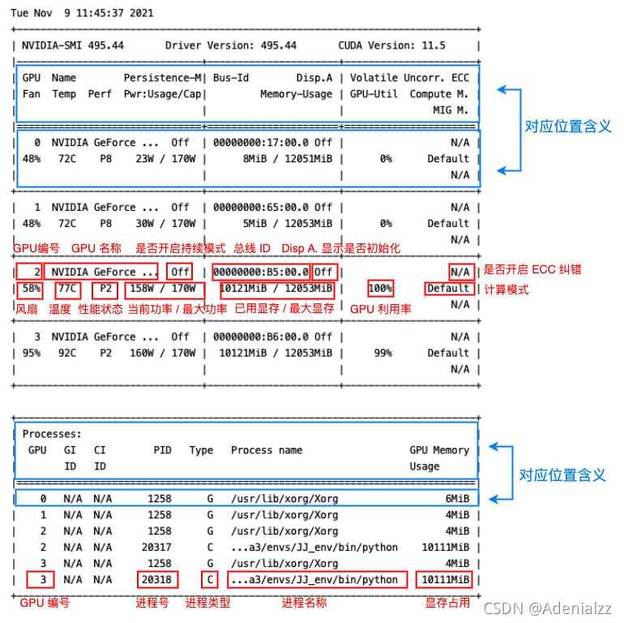

## 目录

[toc]

## Linux 系统

### 系统开关

> 重启

```shell
reboot
```

> 进程信息

```shell
user@tan-To-be-filled-by-O-E-M:~$ ps -ef | grep python
#UID	 #PID  #PPID #C #STIME #TTY	   #TIME	#CMD
root      1409     1  0 5月01  ?       00:00:00 /usr/bin/python3 /usr/share/unattended-upgrades/unattended-upgrade-shutdown --wait-for-signal
user      2720     1 99 5月09  ?       1-12:25:24 python -u main.py
user     10581 13696  0 04:18  ?        00:00:03 python -u main.py
user     10582 13696  0 04:18  ?        00:00:03 python -u main.py
tan      12558  1520  0 5月08  ?       00:00:04 /usr/bin/python3 /usr/bin/update-manager --no-update --no-focus-on-map
user     13696     1 99 5月09  ?       1-10:13:44 python -u main.py
user     25696  2720  0 09:46  ?        00:00:00 python -u main.py
user     25697  2720  0 09:46  ?        00:00:00 python -u main.py
user     27239  2720  0 09:57  ?        00:00:01 python -u main.py
user     27241  2720  0 09:57  ?        00:00:01 python -u main.py
user     27530 13696  0 09:59  ?        00:00:00 python -u main.py
user     27531 13696  0 09:59  ?        00:00:00 python -u main.py
user     28237 28198  0 10:04  pts/2    00:00:00 grep --color=auto python

1) UID		进程用户ID
2) PID		进程ID
3) PPID		父进程ID
4) C		CPU调度情况，CPU用于计算执行优先级的因子 
5) STIME	进程启动的时间
6) TTY		启动进程的终端名
7) TIME		进程共占用CPU的时间
8) CMD		启动进程的命令
```

### 查看硬件信息

> 查看 CPU 信息

```shell
[xxx@localhost ~]$ lscpu
Architecture:          x86_64
CPU op-mode(s):        32-bit, 64-bit
Byte Order:            Little Endian
CPU(s):                4　　　　　　　　　　#总处理器核心数量
On-line CPU(s) list:   0-3
Thread(s) per core:    1　　　　　　　　　　#每个核心支持的线程数量。1表示只支持一个线程，即不支持超线程
Core(s) per socket:    1　　　　　　　　　　#每个处理器的核心数量
Socket(s):             4　　　　　　　　　　#处理器数量
NUMA node(s):          1
Vendor ID:             GenuineIntel
CPU family:            6
Model:                 63
Stepping:              0
CPU MHz:               2599.998
BogoMIPS:              5199.99
Hypervisor vendor:     VMware　　　　　　　#管理程序供应商
Virtualization type:   full
L1d cache:             32K
L1i cache:             32K
L2 cache:              256K
L3 cache:              30720K
NUMA node0 CPU(s):     0-3
```

> 查看内存信息

```shell
root@VM-16-12-ubuntu:~# free -m
              total        used        free      shared  buff/cache   available
Mem:           1833         454         197           4        1181        1213
Swap:          1024          49         975
```

> 查看硬盘信息

```shell
root@VM-16-12-ubuntu:~# lsblk
NAME   MAJ:MIN RM  SIZE RO TYPE MOUNTPOINT
sr0     11:0    1 41.1M  0 rom
vda    252:0    0   50G  0 disk
└─vda1 252:1    0   50G  0 part /
root@VM-16-12-ubuntu:~# df -h [可指定文件夹]
Filesystem      Size  Used Avail Use% Mounted on
udev            885M  4.0K  885M   1% /dev
tmpfs           184M  5.4M  178M   3% /run
/dev/vda1        50G  8.6G   39G  19% /
tmpfs           917M   24K  917M   1% /dev/shm
tmpfs           5.0M     0  5.0M   0% /run/lock
tmpfs           917M     0  917M   0% /sys/fs/cgroup
tmpfs           184M     0  184M   0% /run/user/500
tmpfs           184M     0  184M   0% /run/user/0
(pycloud) user@tan-desktop:~/laiwlong$ df .
Filesystem     1K-blocks      Used Available Use% Mounted on
/dev/nvme0n1p1 245016792 130778296 101769248  57% /
```

> 查看 GPU 信息

```shell
# 查看配置信息

root@VM-16-12-ubuntu:~# lspci | grep -i vga
00:02.0 VGA compatible controller: Cirrus Logic GD 5446
root@VM-16-12-ubuntu:~# lspci -v -s 00:02.0
00:02.0 VGA compatible controller: Cirrus Logic GD 5446 (prog-if 00 [VGA controller])
        Subsystem: Red Hat, Inc. QEMU Virtual Machine
        Physical Slot: 2
        Flags: fast devsel
        Memory at fc000000 (32-bit, prefetchable) [size=32M]
        Memory at febf0000 (32-bit, non-prefetchable) [size=4K]
        Expansion ROM at 000c0000 [disabled] [size=128K]
        Kernel driver in use: cirrus
        Kernel modules: cirrusfb, cirrus
        
# 针对NVIDIA
user@tan-desktop:~$ lspci | grep -i nvidia
01:00.0 VGA compatible controller: NVIDIA Corporation Device 1b00 (rev a1)
01:00.1 Audio device: NVIDIA Corporation Device 10ef (rev a1)
02:00.0 VGA compatible controller: NVIDIA Corporation Device 1b06 (rev a1)
02:00.1 Audio device: NVIDIA Corporation Device 10ef (rev a1)
# http://pci-ids.ucw.cz/mods/PC/10de?action=help?help=pci # 输入4为编号查询型号
```

```shell
# 查看使用信息

user@tan2021:~$ nvidia-smi -l 1   # 每秒刷新一次
Mon Apr 12 09:20:03 2021       
+-----------------------------------------------------------------------------+
| NVIDIA-SMI 460.39       Driver Version: 460.39       CUDA Version: 11.2     |
|-------------------------------+----------------------+----------------------+
| GPU  Name        Persistence-M| Bus-Id        Disp.A | Volatile Uncorr. ECC |
| Fan  Temp  Perf  Pwr:Usage/Cap|         Memory-Usage | GPU-Util  Compute M. |
|                               |                      |               MIG M. |
|===============================+======================+======================|
|   0  GeForce RTX 208...  Off  | 00000000:19:00.0 Off |                  N/A |
| 73%   74C    P2   148W / 250W |   1599MiB / 11019MiB |     42%      Default |
|                               |                      |                  N/A |
+-------------------------------+----------------------+----------------------+
|   1  GeForce RTX 208...  Off  | 00000000:1A:00.0 Off |                  N/A |
|  0%   63C    P8    10W / 250W |      4MiB / 11019MiB |      0%      Default |
|                               |                      |                  N/A |
+-------------------------------+----------------------+----------------------+
|   2  GeForce RTX 208...  Off  | 00000000:67:00.0 Off |                  N/A |
|100%   87C    P2   119W / 250W |   9814MiB / 11019MiB |    100%      Default |
|                               |                      |                  N/A |
+-------------------------------+----------------------+----------------------+
|   3  GeForce RTX 208...  Off  | 00000000:68:00.0 Off |                  N/A |
| 73%   74C    P8    40W / 250W |     47MiB / 11016MiB |      0%      Default |
|                               |                      |                  N/A |
+-------------------------------+----------------------+----------------------+
                                                                               
+-----------------------------------------------------------------------------+
| Processes:                                                                  |
|  GPU   GI   CI        PID   Type   Process name                  GPU Memory |
|        ID   ID                                                   Usage      |
|=============================================================================|
|    0   N/A  N/A     32290      C   python                           1595MiB |
|    2   N/A  N/A     22623      C   python                           4129MiB |
|    2   N/A  N/A     30723      C   python                           5681MiB |
|    3   N/A  N/A      1400      G   /usr/lib/xorg/Xorg                 21MiB |
|    3   N/A  N/A      1624      G   /usr/bin/gnome-shell               20MiB |
+-----------------------------------------------------------------------------+
Fan：显示风扇转速，数值在0到100%之间，是计算机的期望转速，如果计算机不是通过风扇冷却或者风扇坏了，显示出来就是N/A；
Temp：显卡内部的温度，单位是摄氏度；
Perf：表征性能状态，从P0到P12，P0表示最大性能，P12表示状态最小性能；
Pwr：能耗表示；
Bus-Id：涉及GPU总线的相关信息；
Disp.A：是Display Active的意思，表示GPU的显示是否初始化；
Memory Usage：显存的使用率；
Volatile GPU-Util：浮动的GPU利用率；
Compute M：计算模式；
下边的Processes显示每块GPU上每个进程所使用的显存情况。

# -L 显示连接到系统的 GPU 列表
## GPU UUID：此值是GPU的全球唯一不可变字母数字标识符。它与主板上的物理标签无关。
user@tan2021:~$ nvidia-smi -L

GPU 0: NVIDIA GeForce RTX 3060 (UUID: GPU-55275dff-****-****-****-6408855fced9)
GPU 1: NVIDIA GeForce RTX 3060 (UUID: GPU-0a1e7f37-****-****-****-df9a8bce6d6b)
GPU 2: NVIDIA GeForce RTX 3060 (UUID: GPU-38e2771e-****-****-****-d5cbb85c58d8)
GPU 3: NVIDIA GeForce RTX 3060 (UUID: GPU-8b45b004-****-****-****-46c05975a9f0)


# -i 指定某个 GPU，多用于查看 GPU 信息时指定其中一个 GPU
# -q 查看 GPU 的全部信息。可通过 -i 参数指定查看某个 GPU 的参数
user@tan2021:~$ nvidia-smi -i 0 -q
```



```shell
# 查看 cuda 版本
nvcc -V
cat /usr/local/cuda/version.txt
```

### 查看软件信息

> 查看内核版本

- `cat /proc/version`
- `uname -a`
- `uname -r`

```shell
(base) shl@zhihui-mint:~$ cat /proc/version
Linux version 5.0.0-32-generic (buildd@lgw01-amd64-015) (gcc version 7.4.0 (Ubuntu 7.4.0-1ubuntu1~18.04.1)) #34~18.04.2-Ubuntu SMP Thu Oct 10 10:36:02 UTC 2019

(base) shl@zhihui-mint:~$ uname -r
5.0.0-32-generic

(base) shl@zhihui-mint:~$ uname -a
Linux zhihui-mint 5.0.0-32-generic #34~18.04.2-Ubuntu SMP Thu Oct 10 10:36:02 UTC 2019 x86_64 x86_64 x86_64 GNU/Linux
```

> 查看 linux 版本

- `lsb_release -a`
- `cat /etc/issue`

```shell
(base) shl@zhihui-mint:~$ lsb_release -a
No LSB modules are available.
Distributor ID:	LinuxMint
Description:	Linux Mint 19.3 Tricia
Release:	19.3
Codename:	tricia

(base) shl@zhihui-mint:~$ cat /etc/issue
Linux Mint 19.3 Tricia \n \l
```

> 查看 linux 系统位数

- `getconf LONG_BIT`
- `file /bin/ls`

```shell
(base) shl@zhihui-mint:~$ getconf LONG_BIT
64

(base) shl@zhihui-mint:~$ file /bin/ls
/bin/ls: ELF 64-bit LSB shared object, x86-64, version 1 (SYSV), dynamically linked, interpreter /lib64/ld-linux-x86-64.so.2, for GNU/Linux 3.2.0, BuildID[sha1]=9567f9a28e66f4d7ec4baf31cfbf68d0410f0ae6, stripped
```

> 查看系统的架构

- `dpkg --print-architecture`
- `arch`
- `file /lib/systemd/systemd`

```shell
base) shl@zhihui-mint:~$ dpkg --print-architecture 
amd64

(base) shl@zhihui-mint:~$ arch
x86_64

(base) shl@zhihui-mint:~$ file /lib/systemd/systemd
/lib/systemd/systemd: ELF 64-bit LSB shared object, x86-64, version 1 (SYSV), dynamically linked, interpreter /lib64/ld-linux-x86-64.so.2, for GNU/Linux 3.2.0, BuildID[sha1]=85c772a89c42ba78383dec576b414b2b953cbe41, stripped
```

### 挂载硬盘

**(1) 查看硬盘信息**

* `lsblk`：查看硬盘及其分区挂载情况
* `df -h [可指定文件夹]`：查看文件夹挂载位置
* `fdisk -l`：查看硬盘的详细信息，包括硬盘即其分区信息

**(2) 分区初始化**

* `fdisk disk路径`：其中 disk路径 可以从 `fdisk -l` 中获得
  * 输入 `m`：显示所有命令的帮助信息
  * 输入 `p`： 显示硬盘分割情形，打印分区表
  * 输入 `a`：设定硬盘启动区
  * 输入 `n`：设定新的硬盘分割区
    * 输入 `e`：硬盘为[延伸]分割区(extend)
    * 输入 `p`：硬盘为[主要]分割区(primary)
  * 输入 t：改变硬盘分割区属性
    * 输入 `L`：列出所有的分区属性
  * 输入 `d`：删除硬盘分割区属性
  * 输入 `q`：结束不存入硬盘分割区属性
  * 输入 `w`：结束并写入硬盘分割区属性

**(3) 分区格式化**

* `mkfs [-V] [-t fstype] [fs-options] filesys [blocks] [-L Lable] device`：格式化

  * `-V`：详细显示模式
  * `-t`：给定档案系统的型式，Linux 的预设值为 `ext2`，可选 `ext3`（常用），`ext4`（更高级）
  * `-c`：在制做档案系统前，检查该 partition 是否有坏轨
  * `-l bad_blocks_file`：将有坏轨的 block 资料加到 bad_blocks_file 里面
  * `block`：给定 block 的大小
  * `-L`：建立 lable
  * `device` ： 预备检查的硬盘 partition，例如：`/dev/sda1`

  ```shell
  mfks -t ext3 /dev/sda6  # 将sda6分区格式化为ext3格式
  mkfs -t ext2 /dev/sda7  # 将sda7分区格式化为ext2格式
  ```

【注】`mkfs` 本身并不执行建立文件系统的工作，而是去调用相关的程序来执行。例如，若在"`-t`" 参数中指定 `ext2`，则 `mkfs` 会调用 `mke2fs` 来建立文件系统。使用时如省略指定【块数】参数，`mkfs`会自动设置适当的块数。

**(4) 挂载**

查看文件系统：

```shell
sudo parted -l
```

永久性挂载配置：

```shell
sudo vim /etc/fstab
```

在文件中添加如下内容：

```text
# device 设备		# 挂载路径		# 文件系统	  # 文件系统的参数	  # 能否被dump备份命令作用	是否检验扇区
/dev/sdb1		 /opt      		ext3   		defaults   		1 						1
```

其中，

| 第四列 文件系统的参数 | 说明                                                         |
| --------------------- | ------------------------------------------------------------ |
| Async/sync            | 设置是否为同步方式运行，默认为async                          |
| auto/noauto           | 当下载mount -a 的命令时，此文件系统是否被主动挂载。默认为auto |
| rw/ro                 | 是否以以只读或者读写模式挂载                                 |
| exec/noexec           | 限制此文件系统内是否能够进行"执行"的操作                     |
| user/nouser           | 是否允许用户使用mount命令挂载                                |
| suid/nosuid           | 是否允许SUID的存在                                           |
| Usrquota              | 启动文件系统支持磁盘配额模式                                 |
| Grpquota              | 启动文件系统对群组磁盘配额模式的支持                         |
| Defaults              | 同事具有rw,suid,dev,exec,auto,nouser,async等默认参数的设置   |

| 第五列 | 能否被dump备份命令作用     |
| ------ | -------------------------- |
| 0      | 代表不要做dump备份         |
| 1      | 代表要每天进行dump的操作   |
| 2      | 代表不定日期的进行dump操作 |

| 第六列 | 是否检验扇区                 |
| ------ | ---------------------------- |
| 0      | 不要检验                     |
| 1      | 最早检验（一般根目录会选择） |
| 2      | 1级别检验完成之后进行检验    |

然后用 `mount` 命令挂载分区：

* `mount`：挂载分区
  * `-a` 挂载信息立即生效（用这个就行）
  * `-t ext3 /dev/sdb1 /opt`：临时挂载 linux 分区
  * `-t vfat /dev/sdc1 //media/usb`：u 盘挂载 window 分区
  * `-o loop docs.iso /media/iso`：挂载镜像文件
  * `media/cdrom`：光驱挂载
* `umount /opt`：卸载挂载

### 查看登录用户

1. **`w`**：Show who is logged on and what they are doing.

   ```shell
   w [options] user [...]
   ```

   常用命令：

   `  w -h --no-header`

   `  w -u --no-current`  

   `w -s` : Use the short format. Don't print the login time, JCPU or PCPU times.

   `w -i, --ip-addr` : Display IP address instead of hostname for from field.

2. **`who`**：Show who is logged on

   `who -a, --all` : 展示所有的登录用户，相当于使用 `-b -d --login -p -r -t -T -u`

3. **`users`** : Print the user names of users currently logged in to the current host

4. **`whoami`** : Print effective userid

   Print the user name associated with the current effective user ID. Same as id -un.

5. **`last`** : last, lastb - show a listing of last logged in users

   `last reboot` : 展示所有的机器重新启动的情况。

6. **`lastb`** : lastb is the same as last, except that by default it shows a log of the /var/log/btmp file, which contains all the bad login attempts.

   在 root 权限下，使用 `lastb` 命令，将会显示所有尝试登录失败的情况。

## Linux 环境变量

Linux 的环境变量名为 `PATH`，格式为：

```shell
PATH=$PATH:<PATH 1>:<PATH 2>:<PATH 3>:------:<PATH N>
```

**查看 PATH 值**

* `export` - 查看所有的系统变量，其中就有环境变量 `PATH`
* `echo $PATH` - 单独查看 `PATH` 环境变量

**临时添加环境变量**

```shell
export PATH=/opt/STM/STLinux-2.3/devkit/sh4/bin:$PATH
```

上述方法的 `PATH` 在终端关闭后就会消失。

**永久添加环境变量**（影响当前用户）

```shell
vim ~/.bashrc
export PATH="/opt/STM/STLinux-2.3/devkit/sh4/bin:$PATH"
```

**永久添加环境变量**（影响所有用户）

```shell
vim /etc/profile

# 在文档最后，添加:
export PATH="/opt/STM/STLinux-2.3/devkit/sh4/bin:$PATH"

# 保存，退出，然后运行：
source /etc/profile

# 不报错则成功。
```

## Linux 网络

端口不是独立存在的，它是依附于进程的。某个进程开启，那么它对应的端口就开启了，进程关闭，则该端口也就关闭了。

下次若某个进程再次开启，则相应的端口也再次开启。而**不要纯粹的理解为关闭掉某个端口**，不过可以禁用某个端口。

* `lsof -i:端口号` - 查看端口占用情况

  ```shell
  user@tan-To-be-filled-by-O-E-M:/data2/lwl/FasterRCNN$ lsof -i:22
  user@tan-To-be-filled-by-O-E-M:/data2/lwl/FasterRCNN$ lsof -i:8097
  COMMAND   PID USER   FD   TYPE   DEVICE SIZE/OFF NODE NAME
  python  24769 user    7u  IPv4 43931494      0t0  TCP *:8097 (LISTEN)
  python  24769 user    8u  IPv6 43931495      0t0  TCP *:8097 (LISTEN)
  ```

   

* `netstat -tunlp | grep 端口号` - 用于显示 tcp, udp 的端口和进程等相关情况

  * `-t (tcp)` - 仅显示tcp相关选项
  * `-u (udp)` - 仅显示udp相关选项
  * `-n` - 拒绝显示别名，能显示数字的全部转化为数字
  * `-l` - 仅列出在 Listen(监听) 的服务状态
  * `-p` - 显示建立相关链接的程序名

  ```shell
  user@tan-To-be-filled-by-O-E-M:/data2/lwl/FasterRCNN$ netstat -tunlp | grep 22
  (Not all processes could be identified, non-owned process info
   will not be shown, you would have to be root to see it all.)
  tcp        0      0 0.0.0.0:22              0.0.0.0:*               LISTEN      -               
  tcp6       0      0 :::22                   :::*                    LISTEN      -               
  user@tan-To-be-filled-by-O-E-M:/data2/lwl/FasterRCNN$ netstat -tunlp | grep 8097
  (Not all processes could be identified, non-owned process info
   will not be shown, you would have to be root to see it all.)
  tcp        0      0 0.0.0.0:8097            0.0.0.0:*               LISTEN      24769/python    
  tcp6       0      0 :::8097                 :::*                    LISTEN      24769/python
  ```

## Linux 邮件

### 常见问题

> You you have new mail.

**问题描述**：打开一个新的终端窗口，第一句会出现以上提示。

**问题解析**：系统出现错误（例如 cron 出现权限问题等）需要邮件通知用户，系统会将检查的各种状态汇总，定期发送本机用户邮箱中。

**问题处理**：只要把邮件阅读删除后则不会再提示。

1. 查看待发送的 email

使用 mail 查看，可以看到有 email 列表及保存电邮的路径。

```shell
root@VM-16-12-ubuntu:~# mail
"/var/mail/root": 5 messages 5 unread
>U   1 Cron Daemon        Thu Nov  5 06:25  30/1421  Cron <root@VM-16-12-ubunt
 U   2 Cron Daemon        Fri Nov  6 06:25  30/1439  Cron <root@VM-16-12-ubunt
 U   3 Cron Daemon        Sat Nov  7 06:25  29/1396  Cron <root@VM-16-12-ubunt
 U   4 Cron Daemon        Sun Nov  8 06:25  31/1533  Cron <root@VM-16-12-ubunt
 U   5 Cron Daemon        Mon Nov  9 06:25  29/1396  Cron <root@VM-16-12-ubunt
?
```

2. 使用 Enter 或输入数字查看指定邮件
3. 查看完成后，邮件将保存到`/root/mbox`（Ubuntu）

## Linux 后台管理

### 输出重定向

Linux Shell 环境中支持输入输出重定向，符号 `<` 和 `>` 来表示覆写重定向，符号 `<<` 和 `>>` 表示追加重定向，并有

* 特殊符号 `0`、`1` 和 `2` 分别表示标准输入、标准输出和标准错误信息输出
* 特殊文件 `/dev/null`，所有重定向到它的信息都会消失得无影无踪，可用于不需要输出的情况

* 在命令最后面加上 `&` 符号，就可以使其在后台运行。

例子：

```
nohup /root/runoob.sh > runoob.log 2>&1 &
nohup python -m visdom.server > /data3/lwl/VCR/log/visdom.log 2>&1 &
nohup python train.py -params multiatt/default.json -folder saves/flagship_answer > /data3/lwl/VCR/log/vcr.log 2>&1 &
```

将标准错误 `2` 重定向到标准输出 `&1` ，标准输出 `&1` 再被重定向输入到文件中。

### 后台管理命令

* `nohup Command [ Arg … ] [　& ]` - 英文全称 no hang up（不挂起），用于在系统后台**不挂断地运行**命令，**退出终端不会影响**程序的运行
  * `Command` - 要执行的命令，可以使用上述的输出重定向操作
  * `Arg` -可选参数
    * `a` - 显示所有程序
    * `u` - 以用户为主的格式来显示
    * `x` - 显示所有程序，不区分终端机
  * `&` - 让命令在后台执行，终端退出后命令仍旧执行，注意下面两个的区别
    * `&` ： 指在后台运行，退出终端会影响程序的运行
    * `nohup` ： 不挂断的运行，并没有后台运行的功能
* `ctrl + z` - 可以将一个正在前台执行的命令放到后台，并且暂停

* `jobs [-lnprs]` - 查看当前在后台运行的命令

  * `-l` - 显示进程号 PID
  * `-n` - 只显示任务状态变化的进程
  * `-p` - 只列出 PID
  * `-r` - 只输出处于运行状态（running）的作业
  * `-s` - 只输出处于停止状态（stoped）的作业

  ```shell
  jobs
  [1]-  Stopped                 vim ~/.bash_profile
  [2]+  Stopped                 vim /etc/profile
  
  # 输出格式如下：
  # [jobnumber]加号表示最新的任务，减号第二新的任务，其余没有符号  任务状态  启动任务的命令
  ```

  * 【注】退出终端后，jobs 会与当前的虚拟终端断开联系，再重新进入执行命令就是空白的了。

* `fg %jobnumber` - 将后台中的命令调至前台继续运行

* `bg %jobnumber` - 将一个在后台暂停的命令，变成继续执行

* `kill %jobnumber` - 杀死一个后台任务

### `screen` 软件

GNU Screen 是一款由 GNU 计划开发的用于命令行终端切换的自由软件，有会话恢复、多窗口、会话共享等功能。

* `screen [-AmRvx -ls -wipe][-d <作业名称>][-h <行数>][-r <作业名称>][-s ][-S <作业名称>][command]`
  * `-A` - 将所有的视窗都调整为目前终端机的大小
  * `command` - 任务命令，直接创建 screen 终端并执行任务
  * `-d <作业名称>` - 将指定的 screen 作业离线
  * `-h <行数>` - 指定视窗的缓冲区行数
  * `-m` - 即使目前已在作业中的 screen 作业，仍强制建立新的 screen 作业
  * `-r <作业名称>` - 恢复离线的 screen 作业
  * `-R` - 先试图恢复离线的作业。若找不到离线的作业，即建立新的 screen 作业
  * `-s` - 指定建立新视窗时，所要执行的 shell
  * `-S <作业名称>` - 指定 screen 作业的名称
  * `-v` - 显示版本信息。
  * `-x` - 恢复之前离线的 screen 作业
  * `-ls或--list` - 显示目前所有的 screen 作业
  * `-wipe` - 检查目前所有的 screen 作业，并删除已经无法使用的 screen 作业
  * 【注】`detach` 状态：离开 session，程序后台运行

Screen 终端下的 `Ctrl+a` 操作：

* `C-a ?` - Help，显示简单说明
* `C-a c` - Create，开启新的 window
* `C-a n` - Next，切换到下个 window
* `C-a p` - Previous，前一个 window
* `C-a 0..9` - 切换到第 0..9 个 window
* `C-a [Space]` - 由 window 0 循环切换到 window 9
* `C-a C-a` - 在两个最近使用的窗口间切换 
* `C-a x` - 锁住当前的窗口，需用用户密码解锁
* `C-a d` - detach，暂时离开当前 session，将目前的 screen session（可能含有多个 windows）丢到后台执行，并会回到还没进 screen 时的状态
  * 此时在 screen session 里   每个 window 内运行的进程（无论是前台还是后台）都在继续执行，即使 logout 也不影响
* `C-a z` - 把当前 session 放到后台执行，用 shell 的 fg 命令则可回去
* `C-a w` - Windows，列出已开启的 windows 有那些 
* `C-a t` - Time，显示当前时间，和系统的 load 
* `C-a K` - kill window，强行关闭当前的 window
* `C-a [` - 进入 copy mode，在 copy mode 下可以回滚、搜索、复制就像用使用 vi 一样
  * `C-b` Backward，PageUp 
  * `C-f` Forward，PageDown 
  * `H` - High，将光标移至左上角 
  * `L` - Low，将光标移至左下角 
  * `0` - 移到行首 
  * `$` - 行末 
  * `w` - forward one word，以字为单位往前移 
  * `b` - backward one word，以字为单位往后移 
  * `[Space]` - 第一次按为标记区起点，第二次按为终点 
  * `[Esc]` - 结束 copy mode 
* `C-a ]` - Paste，把刚刚在 copy mode 选定的内容贴上

常用方式：

```shell
screen -S yourname 							# 新建一个叫 yourname 的 session
screen -ls 									# 列出当前所有的 session
screen -r yourname 							# 回到 yourname 这个 session
screen -d yourname 							# 远程 detach 某个 session <=> Ctrl+a d
screen -d -r yourname 						# 结束当前 session 并回到 yourname 这个 session
screen -X -S [session or name] quit 		# 停止会话（不再存在）
```

常见问题：

> There is no screen to be resumed matching.

```shell
screen -d yourname  # 先将窗口离线
screen -r yourname  # 然后恢复窗口
```

