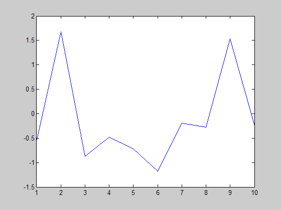
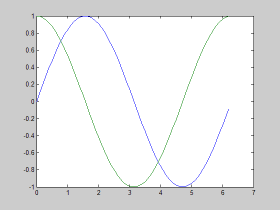
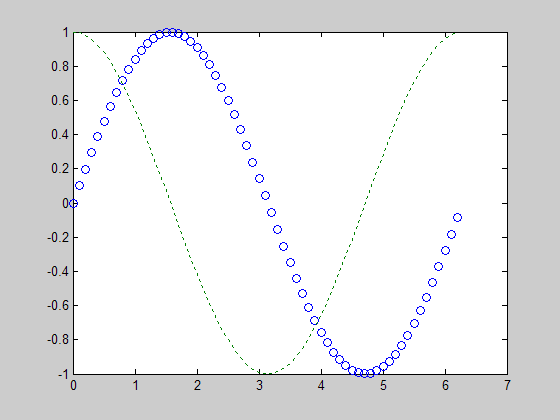
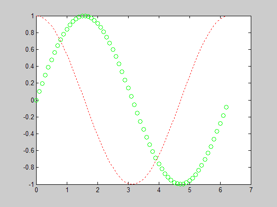
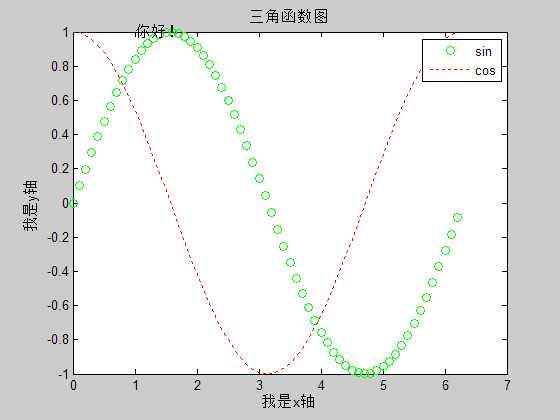
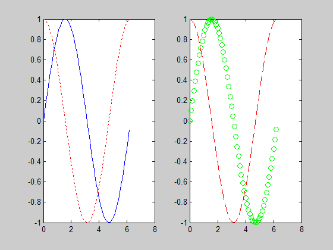
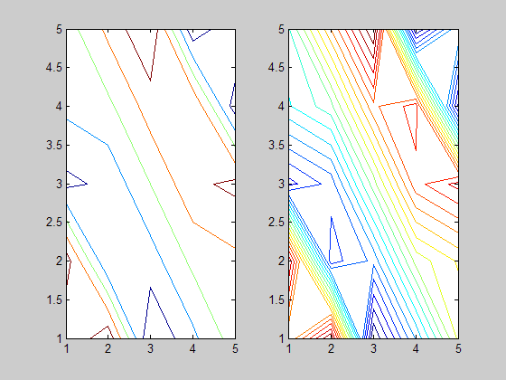
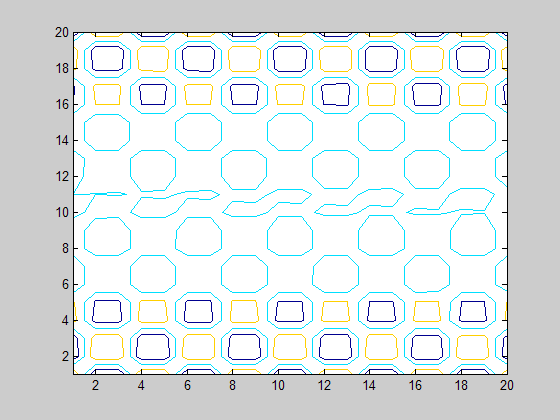
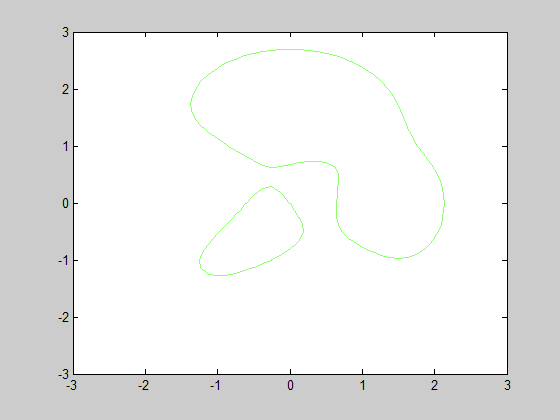

# A 绘制函数图像
* plot - X-Y方向绘图
* loglog - X-Y方向的双对数绘图
* semilogx - X-Y方向的半对数绘图（X轴取对数）
* semilogy - X-Y方向的半对数绘图（Y轴取对数）
* ploar - 极坐标绘图
* mesh - 三维网状曲面图形
* bar - 直方图
* ezplot - 显函数、隐函数和方程绘图

`plot`命令产生X-Y方向绘图。学会了了`plot`命令，对数坐标、极坐标下的绘图只要用`loglog`、`semilogx`、`semilogy`、`polar`命令代替即可。方法是相通的。

下面以`plot`函数为例。

## A1 plot函数
### 1.1 plot(X, Y, Linespace)
#### (1) X,Y参数解析

<table style="text-align:center;">
	<tr>
		<th>X</th><th>Y</th><th></th><th>备注</th>
	</tr>
	<tr>
		<td>mxn</td><td>mxn</td><td>按列取坐标数据绘制n条曲线</td><td>X和Y必须具有相同的尺寸</td>
	</tr>
	<tr>
		<td>1×n或n×1</td><td>m×n或n×m</td><td>自动匹配尺寸相同方向绘制m条曲线</td><td>任意四种组合，效果一样</td>
	</tr>
	<tr>
		<td>m×n或n×m</td><td>1×n或n×1</td><td>同上</td><td>同上</td>
	</tr>
	<tr>
		<td>1×1</td><td>1×n或n×1</td><td>绘制垂直X轴离散点</td><td>Y可以任意向量</td>
	</tr>
	<tr>
		<td>1×n或n×1</td><td>1×1</td><td>绘制垂直Y轴离散点</td><td>X可以任意向量</td>
	</tr>
</table>

例1：

		>> x=[-0.5320    1.6821   -0.8757   -0.4838   -0.7120   -1.1742   -0.1922   -0.2741    1.5301   -0.2490]
		>> plot(x)

例2：

		>> x1=[0:0.1:2*pi];
		>> x2=x1;
		>> y1=sin(x1); y2=cos(x2);
		>> plot(x1,y1,x2,y2);

#### (2) Linespace参数解析

<table style="text-align:center">
	<tr>
		<th>线型</th><th>说明</th><th>标记符</th><th>说明</th><th>颜色</th><th>说明</th>
	</tr>
	<tr>
		<td>-</td><td>实线(默认)</td><td>+</td><td>加号符</td><td>r</td><td>红色</td>
	</tr>
	<tr>
		<td>--</td><td>双划线</td><td>o</td><td>空心圆</td><td>g</td><td>绿色</td>
	</tr>
	<tr>
		<td>:</td><td>虚线</td><td>*</td><td>星号</td><td>b</td><td>蓝色</td>
	</tr>
	<tr>
		<td>-.</td><td>点划线</td><td>.</td><td>实心圆</td><td>c</td><td>青绿色</td>
	</tr>
	<tr>
		<td></td><td></td><td>x</td><td>叉号符</td><td>m</td><td>洋红色</td>
	</tr>
	<tr>
		<td></td><td></td><td>s</td><td>正方形</td><td>y</td><td>黄色</td>
	</tr>
	<tr>
		<td></td><td></td><td>d</td><td>菱形</td><td>k</td><td>黑色</td>
	</tr>
	<tr>
		<td></td><td></td><td>^</td><td>上三角形</td><td>w</td><td>白色</td>
	</tr>
	<tr>
		<td></td><td></td><td>v</td><td>下三角形</td><td>[0 0 0]</td><td>RGB色</td>
	</tr>
	<tr>
		<td></td><td></td><td>></td><td>右三角形</td><td></td><td></td>
	</tr>
	<tr>
		<td></td><td></td><td><</td><td>左三角形</td><td></td><td></td>
	</tr>
	<tr>
		<td></td><td></td><td>p</td><td>五角星</td><td></td><td></td>
	</tr>
	<tr>
		<td></td><td></td><td>h</td><td>六边形</td><td></td><td></td>
	</tr>
</table>

**注释**：画图时，如果不指明使用什么线型，则一般Matlab按连续线型以不同颜色给出图形。

例3：

		>> plot(x1,y1,'o',x2,y2,':');

### 1.2 plot(x,y,Name,Value)
使用Name-Value形式来设定线条参数的plot()函数。

例如：

		% Find Indices of Positive and Negative Examples
		pos = find(y==1); neg = find(y == 0);
		% Plot Examples
		plot(X(pos, 1), X(pos, 2), 'k+','LineWidth', 2, 'MarkerSize', 7);
		plot(X(neg, 1), X(neg, 2), 'ko', 'MarkerFaceColor', 'y', 'MarkerSize', 7);

例4：

		>> plot(x1,y1,'og',x2,y2,':r');

### 1.3 标注
**图像命名**：

* `title('名字')` - 给图像添加名字

**轴线命名**：

* `xlabel('x轴名')` - 给x轴添加名字
* `ylabel('x轴名')` - 给y轴添加名字
* `zlabel('x轴名')` - 给z轴添加名字

**图例**：

* `legend('标注1','标注2',...)` - 功能是对当前图形进行图例标注

**文字信息**：

* `text(x,y,z'标注名')` - 功能是在点(x,y,z)加上文字信息

**颜色信息**：

* `colorbar` - 显示颜色条，给出颜色对应的数值

**网格线**：

* `grid on;` - 添加网格线

老规矩，举个栗子~

例5：

		>> plot(x1,y1,'og',x2,y2,':r');
		>> title('三角函数图');
		>> xlabel('我是x轴');
		>> ylabel('我是y轴');
		>> legend('sin','cos');
		>> text(1,1,'你好！');

**技巧**：

循环标注，可用以下语句

		lgd=num2str((1:2)', 'Line: %d');
		legend(lgd);

### 1.4 坐标轴
* `axis([xmin xmax ymin ymax zmin zmax])` - 设置图像坐标轴的参数，其中x,y,z的min,max代表三个坐标轴的取值范围。

axis函数功能丰富，常用的格式还有：

* `axis equal` - 纵、横坐标轴采用等长刻度。
* `axis square` - 产生正方形坐标系(缺省为矩形)。
* `axis auto` - 使用缺省设置。
* `axis off` - 取消坐标轴。
* `axis on` - 显示坐标轴。

补充：

* `grid()` - 给坐标加网格线。grid on/off命令控制是画还是不画网格线，不带参数的grid命令在两种状态之间进行切换。
* `box()` - 给坐标加边框。box on/off命令控制是加还是不加边框线，不带参数的box命令在两种状态之间进行切换。

### 1.5 多图像输出
一图多线：

除了上述plot中输入多个函数数据外，还可以使用

		>> hold on

来保持当前图像窗口，在上面继续绘图。

分窗口绘图：

subplot(m,n,p) - 该函数将当前图形窗口分成m×n个绘图区，即每行n个，共m行，区号按行优先编号，且选定第p个区为当前活动区。在每一个绘图区允许以不同的坐标系单独绘制图形。

老方法，再次用简单的一个例子把上面的表达出来。

例：

		>> subplot(1,2,1);
		>> plot(x1,y1,'b',x2,y2,':r');
		>> subplot(1,2,2);
		>> plot(x1,y1,'og',x2,y2,'--r');

## A2 ezplot函数
### 2.1 ezplot(f, [xmin,xmax], [ymin,ymax])
#### (1) 参数解析

可用于显函数、隐函数和参数方程作图。

* `f` - 函数或方程，字符串
* `[xmin,xmax]` - 横坐标范围
* `[ymin,ymax]` - 纵坐标范围

例1：

		ezplot('x^2*sin(x+y^2)+y^2*exp(x)+6*cos(x^2+y)', [-6 6]) %隐函数命令

#### (2) 颜色设置

使用以下函数来设置颜色

		h = ezplot(...); % 首先要获取句柄
		set(h, 'PropertyName', propertyValue); % 设置参数即可

* `PropertyName` - 属性名称
* `PropertyValue` - 属性值

# B 绘制等高线图像
* contour - 绘制矩阵等高线图

## B1 contour函数
### 1.1 contour(Z, v)
绘制一个等高线矩阵图Z，其中Z被解释为相对xy平面的高度。v为标量时，指定条数，自动选择级别；v为向量时，指定等高线条数与级别。

注：这里的“级别”按照我的理解，就是给矩阵中的元素按照数值大小来分类的类别，值越大分的所属类（级别）就越高。

例：

		>> A = magic(5)
	
		A =
		
		    17    24     1     8    15
		    23     5     7    14    16
		     4     6    13    20    22
		    10    12    19    21     3
		    11    18    25     2     9
	
		>> figure
		>> subplot(1,2,1)
		>> contour(A, 5)
		>> subplot(1,2,2)
		>> contour(A,20)

		>> A = magic(20);
		>> contour(A, [100, 200, 300, 400, 500, 600])

### 1.2 contour(X, Y, Z, v)
使用X,Y确定的值绘制Z的等高线图。

如果X，Y是向量，则必须`length(X)>size(Z,1)`，`length(Y)>size(Z,2)`，且X，Y必须单调；

如果X，Y是矩阵，则必须`size(X) = size(Y) = size(Z)`

例如：

		x = -3:0.125:3;
		y = -3:0.125:3;
		[X,Y] = meshgrid(x,y);
		Z = peaks(X,Y);
		v = [1,1];
		
		figure
		contour(X,Y,Z,v)

### 1.3 contour(..., LineSpec)与contour(..., Name, Value)
指定曲线参数的等高线绘图函数，详见A1.3 参数设置