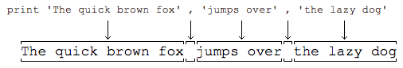

###3-1 Python中数据类型
* A:整数
	* Python可以处理任意大小的整数，当然包括负整数，在Python程序中，整数的表示方法和数学上的写法一模一样，例如：1，100，-8080，0，等等。
	* 计算机由于使用二进制，所以，有时候用十六进制表示整数比较方便，十六进制用0x前缀和0-9，a-f表示，例如：0xff00，0xa5b4c3d2，等等。

* B:浮点数
	* 浮点数也就是小数，之所以称为浮点数，是因为按照科学记数法表示时，一个浮点数的小数点位置是可变的，比如，1.23x10^9和12.3x10^8是相等的。浮点数可以用数学写法，如1.23，3.14，-9.01，等等。但是对于很大或很小的浮点数，就必须用科学计数法表示，把10用e替代，1.23x10^9就是1.23e9，或者12.3e8，0.000012可以写成1.2e-5，等等。
	* 整数和浮点数在计算机内部存储的方式是不同的，整数运算永远是精确的（除法难道也是精确的？是的！），而浮点数运算则可能会有四舍五入的误差。

* C:字符串
	* 字符串是以''或""括起来的任意文本，比如'abc'，"xyz"等等。请注意，''或""本身只是一种表示方式，不是字符串的一部分，因此，字符串'abc'只有a，b，c这3个字符

* D:布尔值
	* 布尔值和布尔代数的表示完全一致，一个布尔值只有True、False两种值，要么是True，要么是False，在Python中，可以直接用True、False表示布尔值（请注意大小写），也可以通过布尔运算计算出来。
	* 布尔值可以用and、or和not运算。
	* and运算是与运算，只有所有都为 True，and运算结果才是 True。
	* or运算是或运算，只要其中有一个为 True，or 运算结果就是 True。
	* not运算是非运算，它是一个单目运算符，把 True 变成 False，False 变成 True。

* E:空值
	* 空值是Python里一个特殊的值，用None表示。None不能理解为0，因为0是有意义的，而None是一个特殊的空值
	* 此外，Python还提供了列表、字典等多种数据类型，还允许创建自定义数据类型，我们后面会继续讲到

* F:任务 
	* 试一试，在右边编辑器中，完成以下任务:
		* 1. 计算十进制整数 45678 和十六进制整数 0x12fd2 之和。
		* 2. 请用字符串表示出Learn Python in imooc。
		* 3. 请计算以下表达式的布尔值（注意==表示判断是否相等）：
		* 
				100 < 99
			    0xff == 255
	
		* 注意：使用print命令

###3-2 Python之print语句
* A:什么是print语句
	* print语句可以向屏幕上输出指定的文字。比如输出'hello, world'，用代码实现如下：
		* 
				print 'hello, world'

	* 注意：
		* 1.当我们在Python交互式环境下编写代码时，>>>是Python解释器的提示符，不是代码的一部分
		* 2.当我们在文本编辑器中编写代码时，千万不要自己添加 >>>
		* 3.print语句也可以跟上多个字符串，用逗号“,”隔开，就可以连成一串输出：
		* 
				print 'The quick brown fox', 'jumps over', 'the lazy dog.'
				The quick brown fox jumps over the lazy dog.

* B:print会依次打印每个字符串，遇到逗号“,”会输出一个空格，因此，输出的字符串是这样拼起来的:
 	

* C:print也可以打印整数，或者计算结果：
	* 
			print 300
			300    #运行结果
			print 100 + 200
			300    #运行结果

	* 因此，我们可以把计算100 + 200的结果打印得更漂亮一点：
	* 
			>>> print '100 + 200 =', 100 + 200
			100 + 200 = 300     #运行结果

	* 注意: 对于100 + 200，Python解释器自动计算出结果300，但是，'100 + 200 ='是字符串而非数学公式，Python把它视为字符串，请自行解释上述打印结果。

* D:任务
	* 请用两种方式打印出 hello, python.

###3-3 Python的注释
* A:什么是注释
	* 任何时候，我们都可以给程序加上注释。注释是用来说明代码的，给自己或别人看，而程序运行的时候，Python解释器会直接忽略掉注释，所以，有没有注释不影响程序的执行结果，但是影响到别人能不能看懂你的代码。

* B:注释语法
	* Python的注释以 # 开头，后面的文字直到行尾都算注释
	*	
 			# 这一行全部都是注释...

			print 'hello' # 这也是注释

* C:注释还有一个巧妙的用途，就是一些代码我们不想运行，但又不想删除，就可以用注释暂时屏蔽掉：
	* 
			# 暂时不想运行下面一行代码:
			# print 'hello, python.'

* D:任务
	* 将代码编辑器中的 "print 'hello'" 语句修改成注释语句

###3-4 Python中什么是变量
* A:什么是变量
	* 在Python中，变量的概念基本上和初中代数的方程变量是一致的。
	* 例如，对于方程式 y=x*x ，x就是变量。当x=2时，计算结果是4，当x=5时，计算结果是25。
	* 只是在计算机程序中，变量不仅可以是数字，还可以是任意数据类型。
	
* B:命名规则
	* 在Python程序中，变量是用一个变量名表示，变量名必须是大小写英文、数字和下划线（_）的组合，且不能用数字开头，比如：
	* 
			a = 1
			#变量a是一个整数。
	* 
			t_007 = 'T007'
			#变量t_007是一个字符串。

* C:等号
	* 在Python中，等号=是赋值语句，可以把任意数据类型赋值给变量，同一个变量可以反复赋值，而且可以是不同类型的变量，例如：
	* 
			a = 123    # a是整数
			print a
			a = 'imooc'   # a变为字符串
			print a
	
	* 这种变量本身类型不固定的语言称之为动态语言，与之对应的是静态语言。
	* 静态语言在定义变量时必须指定变量类型，如果赋值的时候类型不匹配，就会报错。和静态语言相比，动态语言更灵活，就是这个原因。例如Java是静态语言，赋值语句如下（// 表示注释）：
	* 
			int a = 123; // a是整数类型变量
			a = "mooc"; // 错误：不能把字符串赋给整型变量

	* 注意：请不要把赋值语句的等号等同于数学的等号。比如下面的代码：
		* 
				x = 10
				x = x + 2

		* 如果从数学上理解x = x + 2那无论如何是不成立的，在程序中，赋值语句先计算右侧的表达式x + 2，得到结果12，再赋给变量x。由于x之前的值是10，重新赋值后，x的值变成12。

* D:计算机中内存的表示
	* 当我们写：a = 'ABC'时，Python解释器干了两件事情：
		* 1. 在内存中创建了一个'ABC'的字符串；
		* 2. 在内存中创建了一个名为a的变量，并把它指向'ABC'。
	* 举例 把一个变量a赋值给另一个变量b，这个操作实际上是把变量b指向变量a所指向的数据，例如下面的代码：
	* 
			a = 'ABC'
			b = a
			a = 'XYZ'
			print b

	* 最后一行打印出变量b的内容到底是'ABC'呢还是'XYZ'？如果从数学意义上理解，就会错误地得出b和a相同，也应该是'XYZ'，但实际上b的值是'ABC'，让我们一行一行地执行代码，就可以看到到底发生了什么事：
	* 执行a = 'ABC'，解释器创建了字符串  'ABC'和变量 a，并把a指向 'ABC'：

 		 

	* 执行b = a，解释器创建了变量 b，并把b指向 a 指向的字符串'ABC'：

 		 

	* 执行a = 'XYZ'，解释器创建了字符串'XYZ'，并把a的指向改为'XYZ'，但b并没有更改：

 		 

	* 所以，最后打印变量b的结果自然是'ABC'了。

* E:任务
	* 等差数列可以定义为每一项与它的前一项的差等于一个常数，可以用变量 x1 表示等差数列的第一项，用 d 表示公差，请计算数列1 4 7 10 13 16 19 ...前 100 项的和。

###3-5 Python中定义字符串
* A:字符串详细表示
	* 如果字符串本身包含'怎么办？比如我们要表示字符串 I'm OK ，这时，可以用" "括起来表示：
	* 
			"I'm OK"

	* 类似的，如果字符串包含"，我们就可以用' '括起来表示：
	* 
			'Learn "Python" in imooc'

	* 如果字符串既包含'又包含"怎么办？
	* 这个时候，就需要对字符串的某些特殊字符进行“转义”，Python字符串用\进行转义。

	* 例如：要表示字符串 Bob said "I'm OK".
		* 由于 ' 和 " 会引起歧义，因此，我们在它前面插入一个\表示这是一个普通字符，不代表字符串的起始，因此，这个字符串又可以表示为
		* 
				'Bob said \"I\'m OK\".'

		* 注意：转义字符 \ 不计入字符串的内容中。

* B:常用的转义字符还有：
	* \n 表示换行
	* \t 表示一个制表符
	* \\ 表示 \ 字符本身

* C:任务
	* 请将下面两行内容用Python的字符串表示并打印出来：
	* 
			Python was started in 1989 by "Guido".
			Python is free and easy to learn.

###3-6 Python中raw字符串与多行字符串
* A:raw字符串
	* 如果一个字符串包含很多需要转义的字符，对每一个字符都进行转义会很麻烦。为了避免这种情况，我们可以在字符串前面加个前缀** r **，表示这是一个raw 字符串，里面的字符就不需要转义了。
	* 例如：
	* 
			r'\(~_~)/ \(~_~)/'

* B:多行字符串
	* 但是r'...'表示法不能表示多行字符串，也不能表示包含'和 "的字符串（为什么？）
	* 如果要表示多行字符串，可以用**'''...'''**表示：
	* 
			'''Line 1
			Line 2
			Line 3'''

	* 上面这个字符串的表示方法和下面的是完全一样的：
	* 
			'Line 1\nLine 2\nLine 3'

* C:raw+多行
	* 还可以在多行字符串前面添加 r ，把这个多行字符串也变成一个raw字符串：
	* 
			r'''Python is created by "Guido".
			It is free and easy to learn.
			Let's start learn Python in imooc!'''

* D:任务
	* 请把下面的字符串用r'''...'''的形式改写，并用print打印出来：
	* 
			'\"To be, or not to be\": that is the question.\nWhether it\'s nobler in the mind to suffer.'

###3-7 Python中Unicode字符串
* A:字符串还有一个编码问题。
	* 因为计算机只能处理数字，如果要处理文本，就必须先把文本转换为数字才能处理。最早的计算机在设计时采用8个比特（bit）作为一个字节（byte），所以，一个字节能表示的最大的整数就是255（二进制11111111=十进制255），0 - 255被用来表示大小写英文字母、数字和一些符号，这个编码表被称为ASCII编码，比如大写字母 A 的编码是65，小写字母 z 的编码是122。
	* 如果要表示中文，显然一个字节是不够的，至少需要两个字节，而且还不能和ASCII编码冲突，所以，中国制定了GB2312编码，用来把中文编进去。
	* 类似的，日文和韩文等其他语言也有这个问题。为了统一所有文字的编码，Unicode应运而生。Unicode把所有语言都统一到一套编码里，这样就不会再有乱码问题了。

* B:Unicode编码
	* Unicode通常用两个字节表示一个字符，原有的英文编码从单字节变成双字节，只需要把高字节全部填为0就可以。

* C:Python中对Unicode支持
	* 因为Python的诞生比Unicode标准发布的时间还要早，所以最早的Python只支持ASCII编码，普通的字符串'ABC'在Python内部都是ASCII编码的。
	* Python在后来添加了对Unicode的支持，以Unicode表示的字符串用**u'...'**表示，比如：
	* 
			print u'中文'
			#中文

		* 注意: 不加 u ，中文就不能正常显示。

	* 与普通字符串无区别
		* Unicode字符串除了多了一个 u 之外，与普通字符串没啥区别，转义字符和多行表示法仍然有效：
		* 转义：
		* 
				u'中文\n日文\n韩文'
	
		* 多行：
		* 
				u'''第一行
				第二行'''
	
		* raw+多行：
		* 
				ur'''Python的Unicode字符串支持"中文",
				"日文",
				"韩文"等多种语言'''

	* py文件问题解决办法
		* 如果中文字符串在Python环境下遇到 UnicodeDecodeError，这是因为.py文件保存的格式有问题。可以在第一行添加注释：
		* 
				# -*- coding: utf-8 -*-

		* 目的是告诉Python解释器，用UTF-8编码读取源代码。然后用Notepad++ 另存为... 并选择UTF-8格式保存。

* D:任务
	* 用多行Unicode字符串表示下面的唐诗并打印：
 		静夜思
 		床前明月光，
 		疑是地上霜。
 		举头望明月，
 		低头思故乡。

###3-8 字符串相关方法
* A:方法解析
	* join(seq) - 用于将序列中的元素以指定的字符连接生成一个新的字符串
	* 
			str = "-";
			seq = ("a", "b", "c"); # 字符串序列
			print str.join(seq);

			Out:
				a-b-c

	* split(str="", num=string.count(str)) - 通过指定分隔符对字符串进行切片，如果参数num 有指定值，则仅分隔 num 个子字符串
	* 
			str = "Line1-abcdef \nLine2-abc \nLine4-abcd";
			print str.split( );
			print str.split(' ', 1 );

			Out:
				['Line1-abcdef', 'Line2-abc', 'Line4-abcd']
				['Line1-abcdef', '\nLine2-abc \nLine4-abcd']

	* replace(old, new[, max]) - 把字符串中的 old（旧字符串） 替换成 new(新字符串)，如果指定第三个参数max，则替换不超过 max 次
	* 
			str = "this is string example....wow!!! this is really string";
			print str.replace("is", "was");
			print str.replace("is", "was", 3);

			Out:
				thwas was string example....wow!!! thwas was really string
				thwas was string example....wow!!! thwas is really string

###3-9 Python中的布尔类型
* A:布尔类型及其运算
	* 我们已经了解了Python支持布尔类型的数据，布尔类型只有True和False两种值，但是布尔类型有以下几种运算：

	* 与运算：只有两个布尔值都为 True 时，计算结果才为 True。
	* 
			True and True   # ==> True
			True and False   # ==> False
			False and True   # ==> False
			False and False   # ==> False

	* 或运算：只要有一个布尔值为 True，计算结果就是 True。
	* 
			True or True   # ==> True
			True or False   # ==> True
			False or True   # ==> True
			False or False   # ==> False

	* 非运算：把True变为False，或者把False变为True：
	* 
			not True   # ==> False
			not False   # ==> True

 	布尔运算在计算机中用来做条件判断，根据计算结果为True或者False，计算机可以自动执行不同的后续代码。

* B:其他数据类型的布尔值
 	在Python中，布尔类型还可以与其他数据类型做 and、or和not运算，请看下面的代码：
	* 
			a = True
			print a and 'a=T' or 'a=F'

 	计算结果不是布尔类型，而是字符串 'a=T'，这是为什么呢？
 	* 因为Python把0、空字符串''和None看成 False，其他数值和非空字符串都看成 True
 	所以：
 	True and 'a=T' 计算结果是 'a=T'
 	继续计算 'a=T' or 'a=F' 计算结果还是 'a=T'

* C:短路计算
 	要解释上述结果，又涉及到 and 和 or 运算的一条重要法则：
		* 1. 在计算 a and b 时，如果 a 是 False，则根据与运算法则，整个结果必定为 False，因此返回 a；如果 a 是 True，则整个计算结果必定取决与 b，因此返回 b。
		* 2. 在计算 a or b 时，如果 a 是 True，则根据或运算法则，整个计算结果必定为 True，因此返回 a；如果 a 是 False，则整个计算结果必定取决于 b，因此返回 b。
 	所以Python解释器在做布尔运算时，只要能提前确定计算结果，它就不会往后算了，直接返回结果。

* D:任务
	* 请运行如下代码，并解释打印的结果：
	* 
			a = 'python'
			print 'hello,', a or 'world'
			b = ''
			print 'hello,', b or 'world'

###总结
* 1.基本语法（print语句，数据类型）
* 2.数据类型介绍
* 3.变量
* 4.字符串（普通字符串、raw字符串、多行字符串、u字符串及Unicode介绍，字符串相关方法）
* 5.布尔类型