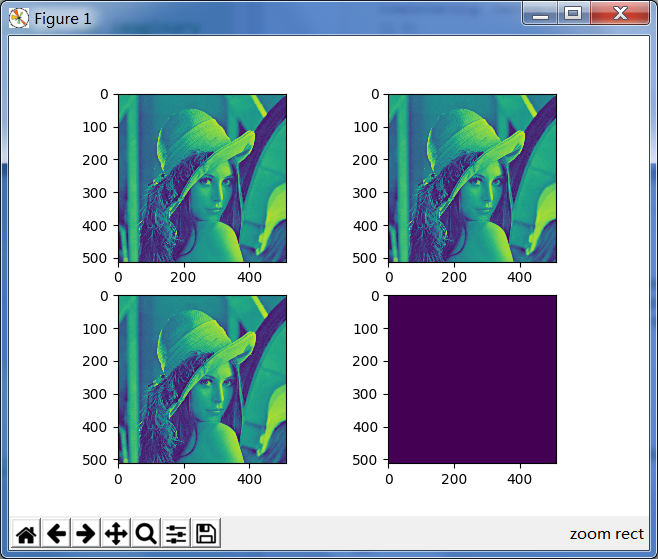
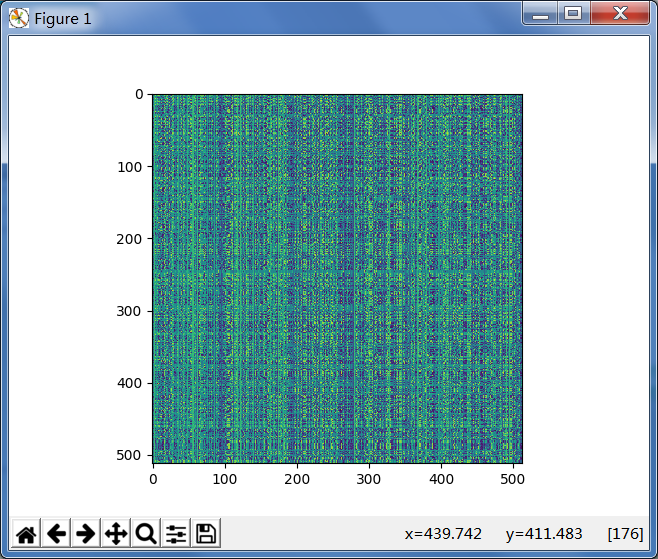
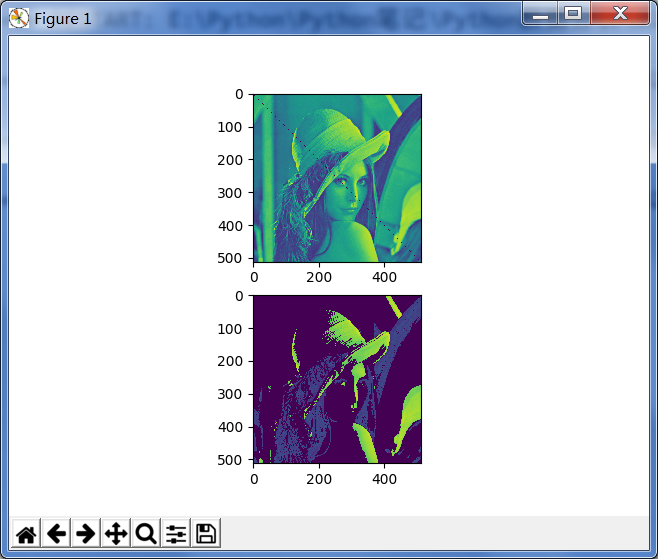
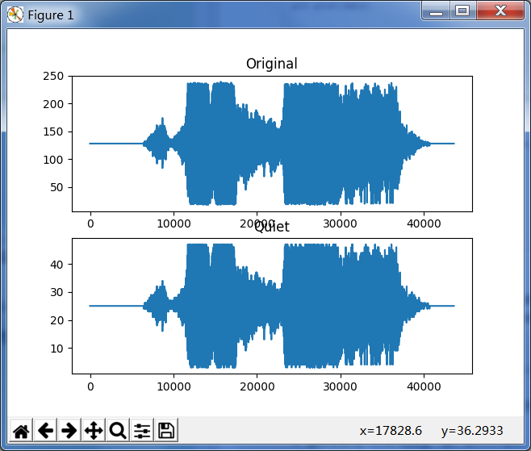

###2-1 NumPy数组对象
* A:多维数组ndarray
	* 组成
		* 数据本身
		* 描述数据的元数据

* B:优势
	* 1.数组元素类型相同，存储空间确定
	* 2.运用向量化运算处理数组
	* 3.使用优化过的C API，运算速度快

* C:获取数组相关信息
	* 获取数组的数据类型
		* 
				import numpy
				a = numpy.arange(5)
				print a.dtype
				Out: dtype('int64')

		* dtype属性 - 获得数组的数据类型

	* 获取数组形状
		* 
				a
				Out: array([0, 1, 2, 3, 4])
				print a.shape
				Out: (5,)

		* shape属性 - 是一个元组，存放的是数组在每一个维度的长度

###2-2 创建和选择数组
* A:创建向量
	* 
			import numpy as np
			a = np.arange(5)

	* arange(n) - 创建一个0到n的numpy数组

* B:创建多维数组
	* 
			m = np.array([np.arange(5), np.arange(5)])
			print m
			Out: array([0, 1, 2, 3, 4],
						[0, 1, 2, 3, 4])
			print a.shape
			Out: (2, 5)
	
	* array(arr) - 传入数组类型的对象（如Python的列表），创建数组

* C:选择数组
	* 
			import numpy as np
			a = np.array([[1, 2], [3,4]])
			print a
			print a[0,0]
			print a[0,1]
			print a[1,0]
			print a[1,1]
			print a[1,2]
			Out: [[1 2]
				  [3 4]]
				1
				2
				3
				4
				
				Traceback (most recent call last):
				IndexError: index 2 is out of bounds for axis 1 with size 2

	* a[x, y] - 矩阵的下标访问方式

###2-3 NumPy的数据类型
* A:各种数据类型
	* bool - 布尔型（值为True或False），占用1bit
	* inti - 长度取决于平台整数
	* int8 - 字节类型（-128~127）
	* int16 - 整形（-32768~32767）
	* int32 - 整形（-2^31~2^31-1）
	* int64 - 整形（-2^63~2^63-1）
	* uint8 - 无符号整形（0~255）
	* uint16 - 无符号整形（0~65535）
	* uint32 - 无符号整形（0~2^32-1）
	* uint64 - 无符号整形（0~2^64-1）
	* float16 - 半精度浮点型（符号占用1bit，指数占用5bit，位数占用10bit）
	* float32 - 单精度浮点型（（符号占用1bit，指数占用8bit，位数占用23bit）
	* float64 - 双精度浮点型（（符号占用1bit，指数占用11bit，位数占用52bit）
	* complex64 - 复数类型，有两个32位浮点数（实部和虚部）表示
	* complex128 或者 complex - 复数类型，有两个64位浮点数（实部和虚部）表示

	* 复数的实部和虚部分别使用real()函数和imag()函数提取

* B:转换函数
	* NumPy的每一种数据类型都有相应的转化函数
	* 语法
	* 
			import numpy as np
			np.float64(42)
			Out: 42.0

	* 注意：
		* 不允许将复数类型转化为整形和浮点型，会触发TypeError

* C:函数中指定数据类型
	* 许多函数都有一个指定数据类型的参数，该参数通常可选
	* 
			import numpy as np
			a = np.arange(7, dtype="float16")
			>>>a
			Out: array([ 0.,  1.,  2.,  3.,  4.,  5.,  6.], dtype=float16)

* D:数据类型对象
	* 含义
		* 是numpy.dtype类的实例
		* 表明了数据占用的字节数，占用字节的具体数目一般存放在itemsize属性中
		* 
				import numpy as np
				a = np.arange(5)
				print a.dtype.itemsize
				Out: 4

	* 字符码
		* 数据类型对于字符码
		* 不建议记住，认识就好。一般使用dtype对象

	* dtype类的构造函数
		* 创建方式
			* 
					import numpy as np
					print np.dtype(float)
					print np.dtype('f')
					print np.dtype('float64')

		* 可以使用sctypeDict.keys()列出所有数据类型的字符码

	* dtype类的属性
		* char属性 - 获取对应的字符码
		* type属性 - 获取数组元素对象的类型
		* str属性 - 第一个字符存放字节顺序，后面对跟着字节码和数字，表示存储所需字节数
		* itemsize属性 - 每一个数据占用字节的具体数目
			* 补充：
				* 字节顺序
				* 字节顺序是指占内存多于一个字节类型的数据在内存中的存放顺序
				* 内存地址：0x0029f458 < 0x0029f459 < 0x0029f45a < 0x0029f45b，数据：0x12345678
					* 小端字节序
						* 0x78 0x56 0x34 0x12
					* 大端字节序
						* 0x12 0x34 0x56 0x78

###2-4 一维数组的切片与索引
* A:一维切片
	* 与Python列表的切片一样，见Python入门-08 切片

###2-5 处理数组形状
* A:调整形状
	* 
			import numpy as np

			a = np.array([1,2,3,4,5,6,7,8])
			print a.shape

			b = a.reshape([2,4])
			print b

			c = a.reshape([2,2,2])
			print c
			
			Out: 
				(8L,)

				[[1 2 3 4]
				 [5 6 7 8]]
				[[[1 2]
				  [3 4]]
				
				 [[5 6]
				  [7 8]]]

	* 
			d = np.arange(24).reshape(2,3,4)
			print "In: d"
			print d

			print "In: d.shape = (6,4)"
			d.shape = (6,4)
			print "In: d"
			print d

			Out:
				In: d.shape = (6,4)
				In: d
				[[ 0  1  2  3]
				 [ 4  5  6  7]
				 [ 8  9 10 11]
				 [12 13 14 15]
				 [16 17 18 19]
				 [20 21 22 23]]

	* 
			print "In: d.resize((2, 12))"
			d.resize((2, 12))
			print "In: d"
			print d

			Out:
				In: d.resize((2, 12))
				In: d
				[[ 0  1  2  3  4  5  6  7  8  9 10 11]
				 [12 13 14 15 16 17 18 19 20 21 22 23]]

	* a.reshape(shape, order='C') - 指定数组的形状，原则是数组元素个数不能发生改变
	* resize(new_shape, refcheck=True) - 调整大小，作用类似reshape()，但是：
		* reshape()：有返回值，所谓有返回值，即不对原始多维数组进行修改；
		* resize()：无返回值，所谓无返回值，即会对原始多维数组进行修改；
	* shape = () - 用元组指定数组的形状

* B:拆解拉直
	* 
			print "In: d.ravel()"
			print d.ravel()

			Out: 
			In: d.ravel()
			[ 0  1  2  3  4  5  6  7  8  9 10 11 12 13 14 15 16 17 18 19 20 21 22 23]

	* 
			print "In: d.flatten()"
			print d.flatten()
			f.flatten() #区别所在

			Out: 
			In: d.flatten()
			[ 0  1  2  3  4  5  6  7  8  9 10 11 12 13 14 15 16 17 18 19 20 21 22 23]

	* ravel() - 拆解，将多维数组变成一维数组
	* flatten() - 功能与ravel()相同，但是：
		* ravel()返回的只是原数组；
		* flatten()返回的是数组的拷贝，需要分配新的内存空间；

* C:转置
	* 
			print "In: d.transpose()"
			print d.transpose()
	
			Out:
				In: d.transpose()
				[[ 0  4  8 12 16 20]
				 [ 1  5  9 13 17 21]
				 [ 2  6 10 14 18 22]
				 [ 3  7 11 15 19 23]]

	* transpose() - 转置，行列互换

###2-6 堆叠数组
* A:叠加
	* 
			import numpy as np
			a = np.arange(9).reshape(3,3)
			print "In: a"
			print a
			print "In: b"
			b = 2 * a
			print b

			Out:
			In: a
			[[0 1 2]
			 [3 4 5]
			 [6 7 8]]
			In: b
			[[ 0  2  4]
			 [ 6  8 10]
			 [12 14 16]]

			print "In: np.hstack((a, b))"
			print np.hstack((a, b))
			print "In: np.concatenate((a, b), axis=1)"
			print np.concatenate((a, b), axis=1)
			
			Out: 
			In: np.hstack((a, b))
			[[ 0  1  2  0  2  4]
			 [ 3  4  5  6  8 10]
			 [ 6  7  8 12 14 16]]
			In: np.concatenate((a, b), axis=1)
			[[ 0  1  2  0  2  4]
			 [ 3  4  5  6  8 10]
			 [ 6  7  8 12 14 16]]

			print "In: np.vstack((a, b))"
			print np.vstack((a, b))
			print "In: np.concatenate((a, b)), axis=0)"
			print np.concatenate((a, b), axis=0)

			Out:
			In: np.vstack((a, b))
			[[ 0  1  2]
			 [ 3  4  5]
			 [ 6  7  8]
			 [ 0  2  4]
			 [ 6  8 10]
			 [12 14 16]]
			In: np.concatenate((a, b)), axis=0)
			[[ 0  1  2]
			 [ 3  4  5]
			 [ 6  7  8]
			 [ 0  2  4]
			 [ 6  8 10]
			 [12 14 16]]
* 
	* hstack(tup) - 水平叠加
	* concatenate(tup, axis=1) - 水平叠加
	* vstack(tup) - 垂直叠加
	* concatenate(tup, axis=0) - 垂直叠加
	* 原理：行与列以第一个维度为准，hstack是行与行按行拼接，vstack是列与列按列拼接 / 图形拼接

* B:深度叠加
	* 
			print "In: np.dstack((a, b)"
			print np.dstack((a, b))
			print np.dstack((a, b)).shape

			Out:
			In: np.dstack((a, b)
			[[[ 0  0]
			  [ 1  2]
			  [ 2  4]]
			
			 [[ 3  6]
			  [ 4  8]
			  [ 5 10]]
			
			 [[ 6 12]
			  [ 7 14]
			  [ 8 16]]]
			(3L, 3L, 2L)

	* dstack(tup) - 深度叠加，第三个维数叠加，例如在图像数据上叠加另一幅图像的数据
	* 原理：最后一维叠加

* C:堆叠
	* 
			import numpy as np
			oned = np.arange(3)
			print "In: oned"
			print oned
			twice_oned = 2 * oned
			print "In: twice_oned"
			print twice_oned
	
			Out:
				In: oned
				[0 1 2]
				In: twice_oned
				[0 2 4]

			print "In: np.column_stack((oned, twice_oned))"
			print np.column_stack((oned, twice_oned)).shape
			print np.column_stack((oned, twice_oned))

			Out:
				In: np.column_stack((oned, twice_oned))
				(3L, 2L)
				[[0 0]
				 [1 2]
				 [2 4]]

			print "In np.row_stack((oned, twice_oned))"
			print np.row_stack((oned, twice_oned)).shape
			print np.row_stack((oned, twice_oned))

			Out:
				In np.row_stack((oned, twice_oned))
				(2L, 3L)
				[[0 1 2]
				 [0 2 4]]

	* column_stack() - 列式堆叠
	* row_stack() - 行式堆叠
	* 原理：行与列以第一个维度为准，column_stack是列与列按行拼接，row_stack是行与行按列拼接

###2-7 拆分数组
* A:横向拆分
	* 
			import numpy as np
			a = np.arange(9).reshape(3,3)
			b = a * 2
			print "In: a"
			print a
			
			print "In: np.hsplit(a, 3)"
			print np.hsplit(a, 3)
			
			print "In: np.split(a, 3, axis=1)"
			print np.split(a, 3, axis=1)

			Out:
				In: a
				[[0 1 2]
				 [3 4 5]
				 [6 7 8]]

				In: np.hsplit(a, 3)
				[array([[0],
				       [3],
				       [6]]), array([[1],
				       [4],
				       [7]]), array([[2],
				       [5],
				       [8]])]

				In: np.split(a, 3, axis=1)
				[array([[0],
				       [3],
				       [6]]), array([[1],
				       [4],
				       [7]]), array([[2],
				       [5],
				       [8]])]

	* hsplit(arr, num) - 沿横轴方向分解数组
	* split(arr, num, axis=1) - 沿横轴方向将其分解为3部分
	* 原理：以第一个维度为准，每num个得到num组的元素 // 图形横向纵分

* B:纵向拆分
	* 
			print "np.vsplit(a, 3)"
			print np.vsplit(a, 3)
			
			print "np.split(a, 3, axis=0)"
			print np.split(a, 3, axis=0)

			Out:
				np.vsplit(a, 3)
				[array([[0, 1, 2]]), array([[3, 4, 5]]), array([[6, 7, 8]])]
				np.split(a, 3, axis=0)
				[array([[0, 1, 2]]), array([[3, 4, 5]]), array([[6, 7, 8]])]

	* vsplit(arr, num) - 沿纵轴方向分解数组
	* split(arr, num, axis=0) - 沿纵轴方向分解数组
	* 原理：以第一个维度为准，每num个得到一组元素 // 图形纵向横分

* C:深向拆分
	* 
			c = np.arange(27).reshape(3,3,3)
			print "In: c"
			print c
			
			print "In: np.dsplit(c, 3)"
			print np.dsplit(c, 3)

			Out:
				In: c
				[[[ 0  1  2]
				  [ 3  4  5]
				  [ 6  7  8]]
				
				 [[ 9 10 11]
				  [12 13 14]
				  [15 16 17]]
				
				 [[18 19 20]
				  [21 22 23]
				  [24 25 26]]]
				In: np.dsplit(c, 3)
				[array([[[ 0],
				        [ 3],
				        [ 6]],
				
				       [[ 9],
				        [12],
				        [15]],
				
				       [[18],
				        [21],
				        [24]]]), 
				array([[[ 1],
				        [ 4],
				        [ 7]],
				
				       [[10],
				        [13],
				        [16]],
				
				       [[19],
				        [22],
				        [25]]]),
				array([[[ 2],
				        [ 5],
				        [ 8]],
				
				       [[11],
				        [14],
				        [17]],
				
				       [[20],
				        [23],
				        [26]]])]
	* dsplit(arr, num) - 沿深度方向拆分数组
	* 原理：以最后一维开始，每num个元素得到num组里的元素，遇维加维 // 先纵向分再横向分

###2-8 NumPy数组的属性
* A:属性一览
	* dtype shape - 见1-1
	* ndim - 维度的数量
	* size - 元素的数量
	* nbytes - 整个数组所占用的字节数量
	* T - 作用与transpose函数相同
	* real - 数组的实部
	* imag - 数组的虚部
	* flat - numpy.flatiter对象（迭代器）（获得该对象的唯一方法），可以用该迭代器遍历
	* 
			import numpy as np
			b = np.arange(4).reshape(2,2)
			print b
			f = b.flat
			print f
			for item in f:
			    print item
			
			print f[2]
			print b.flat[[1, 3]]
			
			b.flat = 7
			print b
			
			b.flat[[1,3]] = 1
			print b

			Out:
				[[0 1]
				 [2 3]]
				<numpy.flatiter object at 0x00000000033FAC60>

				0
				1
				2
				3

				2
				[1 3]

				[[7 7]
				 [7 7]]

				[[7 1]
				 [7 1]]

###2-9 数组的转换
* A:数组类型转换
	* tolist() - 将NumPy数组转换成Python的列表
	* 
			import numpy as np
			b = np.arange(9).reshape(3,3)
			
			print "In: b"
			print b
			
			print "In: b.tolist()"
			print b.tolist()

			Out:
				In: b
				[[ 0  2  4]
				 [ 6  8 10]
				 [12 14 16]]
				In: b.tolist()
				[[0, 2, 4], [6, 8, 10], [12, 14, 16]]

* B:元素类型转换
	* astype() - 把数组元素转换成指定类型
	* 注意：当complex类型转换成int类型时，虚部将被丢弃，另外，还需要将数据类型的名称以字符串的形式传递给astype()函数
	* 
			import numpy as np
			b = np.array([1.+1.j, 3.+2.j])
			print "In: b"
			print b
			
			print b.astype(int)
			
			print b.astype('complex')

			Out:
				In: b
				[ 1.+1.j  3.+2.j]
				
				Warning (from warnings module):
				  File "E:\Python\Python笔记\Python数据分析\02-01.py", line 6
				    print b.astype(int)
				ComplexWarning: Casting complex values to real discards the imaginary part
				[1 3]
				[ 1.+1.j  3.+2.j]

###2-10 NumPy数组高级索引
* A:创建数组的视图和拷贝
	* NumPy中视图不是只读的，关键要知道当前处理的是共享的数组视图，还是数组数据的副本
	* Lena图像：创建数组，创建视图，修改
	* 
			import scipy.misc
			import matplotlib.pyplot as plt
			
			lena = scipy.misc.lena()	#获得莱娜肖像的数组
			acopy = lena.copy()			#创建一份莱娜数组的副本
			aview = lena.view()			#为该数组创建一个视图
			plt.subplot(221)			#指定图像位置
			plt.imshow(lena)			#要绘制的图片
			plt.subplot(222)			#指定图像位置
			plt.imshow(acopy)			#要绘制的图片
			plt.subplot(223)			#指定图像位置
			plt.imshow(aview)			#要绘制的图片
			aview.flat = 0				#通过flat迭代器将视图中所有之设置为0
			plt.subplot(224)			#指定图像位置
			plt.imshow(aview)			#要绘制的图片
			plt.show()					#显示图片
			
			Out:
		* 
 			

	* 结论:视图不是只读的

* B:花式索引
	* 花式索引是一种传统的索引方法，它不使用整数或者切片
	* 下面利用花式索引把莱娜照片对角线上的值全部置0
	* 
			import scipy.misc
			import matplotlib.pyplot as plt
			
			lena = scipy.misc.lena()
			xmax = lena.shape[0]
			ymax = lena.shape[1]
			# ==花式索引==
			lena[range(xmax), range(ymax)] = 0				#将第一条对角线上的值设置为0
			lena[range(xmax -1, -1, -1), range(ymax)] = 0	#将另一条对角线上的值设置为0
			plt.imshow(lena)
			plt.show()
			
	* 内部的NumPy迭代器对象实现索引莱娜数组
		* 1.创建迭代器对象
		* 2.将迭代器对象绑定到数组
		* 3.经由迭代器访问数组元素，利用位置列表进行索引

* C:基于位置列表的索引方法
	* 生成索引矩阵，然后用于矩阵索引，它生成索引以矩阵形式返回
	* 
			import scipy.misc
			import matplotlib.pyplot as plt
			import numpy as np
			
			lena = scipy.misc.lena()
			xmax = lena.shape[0]
			ymax = lena.shape[1]
			
			def shuffle_indices(size):						
			    arr = np.arange(size)
			    np.random.shuffle(arr)					 #把数组中的元素按照随机的索引号重新排列，使新数组产生相应的变化
			    return arr
			
			xindices = shuffle_indices(xmax)
			np.testing.assert_equal(len(xindices), xmax) #断言相等
			yindices = shuffle_indices(ymax)
			np.testing.assert_equal(len(yindices), ymax) #断言相等
			# ==位置索引==
			plt.imshow(lena[np.ix_(xindices, yindices)]) #画出打乱后的索引 

			plt.show()
			Out:
 		* 	
 		 		

	* ix_()
		* 可根据多个序列生成一个网格（矩阵的数轴)
		* 
				print np.ix_([0, 1], [2, 3])
				Out:
					(array[[0],[1]]), array([[2, 3]])

* D:用布尔型变量索引NumPy数组
	* 布尔型变量索引是根据布尔类型数组来索引元素的方法，属于花式索引系列。所以使用方法基本相同
	* 
			import scipy.misc
			import matplotlib.pyplot as plt
			import numpy as np
			
			lena = scipy.misc.lena()
			
			def get_indices(size):
			    arr = np.arange(size)
			    return arr % 4 == 0					#选择可以被4整除的那些位置的点
			
			#条件处理后的列表
			lena1 = lena.copy()
			xindices = get_indices(lena.shape[0])
			yindices = get_indices(lena.shape[1])
			#花式索引
			lena1[xindices, yindices] = 0			#仅绘出选定的点
			plt.subplot(211)
			plt.imshow(lena1)
			lena2 = lena.copy()
			lena2[(lena > lena.max()/4) & (lena < 3 * lena.max() / 4)] = 0	#选取最大值介于1/4到-/4的那些元素，将其置0
			plt.subplot(212)
			plt.imshow(lena2)
			plt.show()

			Out:
		*
 				

###2-11 NumPy数组的广播
* 当操作对象不一样时，NumPy会尽力进行处理，例如：一个数组跟一个标量相乘，这是标量要根据数组形状进行拓展，才可以执行乘法运算。这个扩展过程叫做广播
* A:案例演示
	* 下载一个音频文件，然后依次为基础，生成一个新的静音版本
	* 
			import scipy.io.wavfile
			import matplotlib.pyplot as plt
			import urllib2
			import numpy as np

			#1.读取WAV文件
			#下载音频文件
			response = urllib2.urlopen('http://www.thesoundarchive.com/austinpowers/smashingbaby.wav')
			print response.info()
			WAV_FILE = 'smashingbaby.wav'
			filehandle = open(WAV_FILE, 'w')
			filehandle.write(response.read())
			filehandle.close()
			#读取文件
			sample_rate, data = scipy.io.wavfile.read(WAV_FILE)	#读取文件，返回一个数据阵列及采样率
			print "Data type", data.dtype, "Shape", data.shape

			#2.绘制原WAV数据
			plt.subplot(2, 1, 1)
			plt.title("Original")
			plt.plot(data)

			#3.新建一个数组
			newdata = data * 0.2
			newdata = newdata.astype(np.uint8)

			print "Data type", data.dtype, "Shape", newdata.shape

			#4.写入一个WAV文件中
			scipy.io.wavfile.write("quiet.wav", sample_rate, newdata)

			#5.绘制出新的WAV数据
			plt.subplot(2, 1, 2)
			plt.title("Quiet")
			plt.plot(newdata)
			plt.show()

	* 1.读取WAV文件
		* 使用标准的Python代码下载电影《王牌大贱碟》（Austin Powers）中的歌曲Smashing Baby，
		* SciPy中有一个wavfile子程序包，可以用来加载音频数据，或者生成WAV格式文件。其中的read()函数读取文件，返回一个数据阵列及采样率
	* 2.绘制原WAV数据
		* 利用matplotlib绘制原始WAV数据，并用一个子图来显示标题“Original”
	* 3.新建一个数组
		* 用NumPy来生成一段寂静的声音，原理是将原数组乘以一个常数，从而得到一个新数组，这个新数组的元素之肯定是变小了————广播技术
		* 确保新数组与原数组类型一致，即WAV格式
	* 4.写入一个WAV文件中
	* 5.绘制出新的WAV数据
		* 使用matplotlib

	* 
			Out:
 		

###总结
* 1.numpy数组的创建选择
* 2.数据的属性、数据类型、转换、
* 3.数组的切片索引（一维）、形状处理、堆叠、拆分、高级索引
* 4.数组的广播