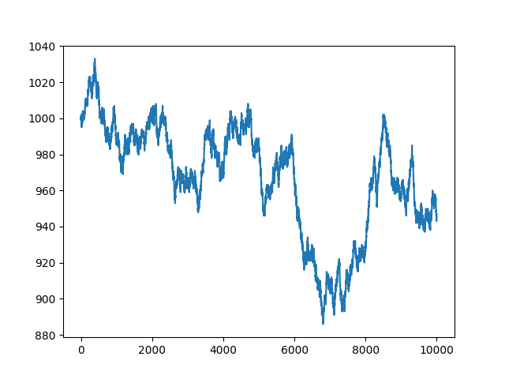
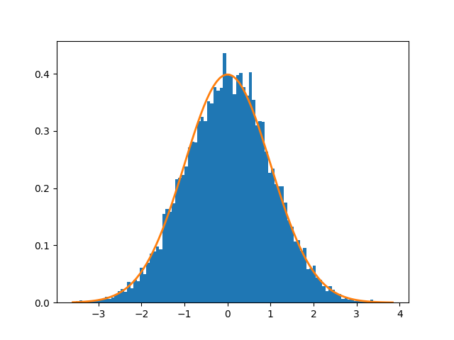
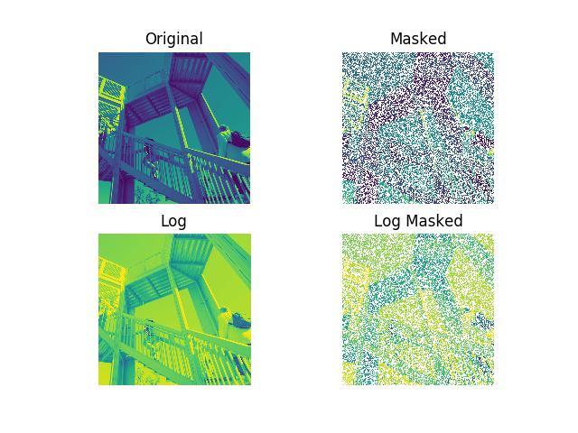
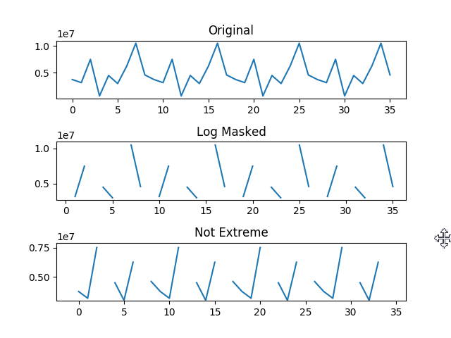

###3-1 Numpy和Scipy模块
* A:模块介绍
	* Numpy和Scipy模块中的linalg程序包可以轻松的解决统计学与线性代数中的问题，如
		* 通过数据求出变量的算术平均值和标准差，并由此推出该变量的取值范围和期望值，利用统计学检验来评估可信度
		* 求解线性方程组

* B:研究Numpy和Scipy的相关文档
	* `对应软件.__version__` - 获得对应模块的属性
	* 
			import numpy as np
			import scipy as sp
			import matplotlib as mpl
			print "NumPy version", np.__version__
			print "SciPy version", sp.__version__
			print "MatPlotlib version", mpl.__version__

			Out:
				NumPy version 1.12.1
				SciPy version 0.13.1
				MatPlotlib version 2.0.0

	* pkgutil.iter_modules(path=None) - 遍历指定目录下的所有子库，返回一个由元组组成的列表，每个元组包含3个元素：module_loader; 子程序包的名称 ; 指示这是个子程序包的布尔值
	* pydoc.plain(pydoc.render_doc(name)) - 剔除字符串中的非打印字符（documentation string）；返回指定子程序包或者函数的文件字符串（主要内容）
	* 
			import numpy as np
			import scipy as sp
			import pkgutil as pu
			import pydoc
			
			def print_desc(prefix, pkg_path):
			    for pkg in pu.iter_modules(path=pkg_path):
			        name = prefix + "." + pkg[1]
			
			        if pkg[2] == True:
			            try:
			                docstr = pydoc.plain(pydoc.render_doc(name))
			                docstr = clean(docstr)
			                start = docstr.find("DESCRIPTION")
			                docstr = docstr[start: start + 140]
			                print name, docstr
			            except:
			                continue
			
			def clean(astr):
			    s = astr
			    #remove multiple spaces
			    s = ' '.join(s.split())
			    s = s.replace('=',' ')
			    return s
			
			print_desc("numpy", np.__path__)
			print
			print
			print
			print_desc("scipy", sp.__path__)

			Out:
				numpy.compat DESCRIPTION This module contains duplicated code from Python itself or 3rd party extensions, which may be included for the following reasons
				numpy.core DESCRIPTION Functions - array - NumPy Array construction - zeros - Return an array of all zeros - empty - Return an uninitialized array - sh
				numpy.distutils 
				numpy.doc DESCRIPTION Topical documentation                       The following topics are available: - basics - broadcasting - byteswapping - constan
				numpy.f2py 
				numpy.fft DESCRIPTION Discrete Fourier Transform (:mod:`numpy.fft`)                                               .. currentmodule:: numpy.fft Standar
				numpy.lib DESCRIPTION Basic functions used by several sub-packages and useful to have in the main name-space. Type Handling -------------             
				numpy.linalg DESCRIPTION Core Linear Algebra Tools ------------------------- Linear algebra basics: - norm Vector or matrix norm - inv Inverse of a squar
				numpy.ma DESCRIPTION               Masked Arrays               Arrays sometimes contain invalid or missing data. When doing operations on such arrays
				numpy.matrixlib 
				numpy.polynomial DESCRIPTION Within the documentation for this sub-package, a "finite power series," i.e., a polynomial (also referred to simply as a "series
				numpy.random DESCRIPTION                          Random Number Generation                                                                               
				numpy.testing DESCRIPTION This single module should provide all the common functionality for numpy tests in a single location, so that test scripts can ju

				scipy._build_utils 
				scipy.constants DESCRIPTION                                    Constants (:mod:`scipy.constants`)                                    .. currentmodule:: scip
				scipy.io DESCRIPTION                                    Input and output (:mod:`scipy.io`)                                    .. currentmodule:: scip
				scipy.lib DESCRIPTION Python wrappers to external libraries                                       - lapack -- wrappers for `LAPACK/ATLAS <http://netli
				scipy.misc DESCRIPTION                                            Miscellaneous routines (:mod:`scipy.misc`)                                           
				scipy.ndimage DESCRIPTION                                                           Multi-dimensional image processing (:mod:`scipy.ndimage`)             
				scipy.sparse DESCRIPTION                                       Sparse matrices (:mod:`scipy.sparse`)                                       .. currentmodu
				scipy.weave DESCRIPTION C/C++ integration                   inline -- a function for including C/C++ code within Python blitz -- a function for compilin

###3-2 用NumPy进行简单的描述性统计计算
* A:用NumPy加载CSV文件
	* 
			import numpy as np
			from scipy.stats import scoreatpercentile
			
			data = np.loadtxt("mdrtb_2012.csv", delimiter=',', usecols=(1,), skiprows=1, unpack=True)
			#指定文件名。假设文件位于当前目录下
			#使用逗号作为分隔符
			#忽略标题

	* numpy.loadtxt(fname, dtype=<type 'float'>, comments='#', delimiter=None, converters=None, skiprows=0, usecols=None, unpack=False, ndmin=0)[source])
		* 读入数据文件，这里的数据文件要求每一行数据的格式相同
		* 返回ndarray数组

* B:如何获取各种统计指标
	* 各有两种方法：
	* 
			#最大值
			print "Max method", data.max()
			print "Max function", np.max(data)
			
			#最小值
			print "Min method", data.min()
			print "Min function", np.min(data)
			
			#平均值
			print "Mean method", data.mean()
			print "Mean function", np.mean(data)
			
			#标准差（standard deviation）
			print "Std method", data.std()
			print "Std method", np.std(data)
			
			#中位数
			print "Median", np.median(data)
			print "Score at percentile 50", scoreatpercentile(data, 50)

###3-3 用NumPy进行线性代数运算
* A:用NumPy求矩阵的逆
	* numpy.linalg.inv() - 求矩阵的逆
	* numpy.linalg.pinv() - 求矩阵的伪逆
	* numpy.eye(n) - n阶单位矩阵
	* 
			#创建一个示例矩阵
			import numpy as np

			#利用mat()函数创建一个示例矩阵
			A = np.mat("2 4 6 ; 4 2 6 ; 10 -4 18")
			print "A\n", A

			Out:
				A
				[[ 2  4  6]
				 [ 4  2  6]
				 [10 -4 18]]

			#求矩阵的逆
			inverse = np.linalg.inv(A)
			print "inverse of A\n", inverse

			Out:
				inverse of A
				[[-0.41666667  0.66666667 -0.08333333]
				 [ 0.08333333  0.16666667 -0.08333333]
				 [ 0.25       -0.33333333  0.08333333]]

	* 注意：
		* 如果矩阵是奇异的，或者非方阵，那么就会得到LinAlgError消息
		* NumPy库中的pinv()函数可以用来求伪逆矩阵

	* 
			#利用乘法进行验算
			print "Check\n", A * inverse

			Out:
				Check
				[[  1.00000000e+00  -2.22044605e-16   0.00000000e+00]
				 [  5.55111512e-17   1.00000000e+00   0.00000000e+00]
				 [  3.88578059e-16  -4.44089210e-16   1.00000000e+00]]

			#计算结果减去3x3的单位矩阵，会得到求逆过程中的误差
			print "Error\n", A * inverse - np.eye(3)
			Out:
				Error
				[[  0.00000000e+00  -2.22044605e-16   0.00000000e+00]
				 [  5.55111512e-17  -4.44089210e-16   0.00000000e+00]
				 [  3.88578059e-16  -4.44089210e-16   0.00000000e+00]]

* B:用NumPy解线性方程组
	* numpy.linalg.solve() - 求解线性方程组Ax=b
	* numpy.dot() - 点乘
	* 
			import numpy as np

			#创建矩阵A和数组b
			A = np.mat("1 -2 1 ; 0 2 -8 ; -4 5 9")
			print "A\n", A
			b = np.array([0, 8, -9])
			print "b\n", b

			Out:
				A
				[[ 1 -2  1]
				 [ 0  2 -8]
				 [-4  5  9]]
				b
				[ 0  8 -9]
			
			#调用solve()函数
			x = np.linalg.solve(A, b)
			print "Solusion", x

			Out:
				Solusion [ 29.  16.   3.]

			#利用dot()函数进行验算
			print "Check\n", np.dot(A, x)

			Out:
				Check
				[[ 0.  8. -9.]]

###3-4 用NumPy计算特征值和特征向量
* A:计算特征值和特征向量
	* numpy.linalg.eigvals() - 获得矩阵的特征值
	* numpy.linalg.eig() - 获得矩阵的特征值和特征向量（返回一个元组，第一个list元素是特征值，第二个list元素是相应的特征向量，其以面向列的方式排列
	* numpy.mat(matlab形的str) - 创建矩阵
	* 
			import numpy as np

			#创建矩阵
			A = np.mat("3 -2 ; 1 0")
			print "A\n", A

			Out:
				A
				[[ 3 -2]
				 [ 1  0]]

			#利用eigvals()函数计算特征值
			print "Eigenvalues", np.linalg.eigvals(A)

			Out:
				Eigenvalues [ 2.  1.]

			#利用eig函数取得特征值和特征向量
			eigenvalues, eigenvectors = np.linalg.eig(A)
			print "First tuple of eig", eigenvalues
			print "Second tuple of eig\n", eigenvectors

			Out:
				First tuple of eig [ 2.  1.]
				Second tuple of eig
				[[ 0.89442719  0.70710678]
				 [ 0.4472136   0.70710678]]

			#验算结果
			for i in range(len(eigenvalues)):
			    print "Left", np.dot(A, eigenvectors[:,i])
			    print "Right", eigenvalues[i] * eigenvectors[:,i]
			    print

			Out:
				Left [[ 1.78885438]
				 [ 0.89442719]]
				Right [[ 1.78885438]
				 [ 0.89442719]]
				
				Left [[ 0.70710678]
				 [ 0.70710678]]
				Right [[ 0.70710678]
				 [ 0.70710678]]

###3-5 NumPy随机数
* A:随机数的实现原理
	* 随机数的分类：
		* 连续分布
			* 正态分布
			* 对数正态分布
		* 离散分布
			* 几何分布
			* 超几何分布
			* 二项式分布
	* 现实中随机数的实现
		* 随机数常用于蒙特卡罗法、随机积分等方面，但是真正的随机数很难获得。所以在处理高精度模拟实验等之外，伪随机数足以满足需求
	* NumPy中随机数的实现
		* 对于NumPy，与随机数有关的函数在random子程序包中，其核心的随机数发生器是基于梅森旋转算法的

* B:生成离散分布随机数————以二项式分布为例
	* a:离散分布函数
		* NumPy中的连续分布函数
		* numpy.random.
			* binomial(n,p,size=…) - 产生二项分布的随机数，其中n,p,size分别是每轮试验次数、概率、轮数，返回概率含有每轮成功次数的列表

	* b:案例
		* 二项式分布概念
			* 二项式分布模拟的是在进行整数次独立实验中成功的次数，其中每次实验成功的机会是一定的
		* 典例规则
			* 假设一场赌博，正在对8片币玩法下注，使用9枚硬币。规则是：如果正面朝上的硬币少于5枚，那么将输掉一个8分币；否则将赢得一个8分币
			* 假设有1000枚硬币作为初始赌资，使用random模块提供的binomial()函数进行模拟

	* c:演示
		* matplotlib.pyploy.plot(x, y) - 根据(x, y)绘制图像
		* matplotlib.pyplot.show() - 显示图像
		* 
				import numpy as np
				from matplotlib.pyplot import plot, show
				
				#使用binamal()函数
				cash = np.zeros(10000)
				cash[0] = 1000
				outcome = np.random.binomial(9, 0.5, size=len(cash))
				
				#更新现金余额
				for i in range(1, len(cash)):
				    if outcome[i] < 5:
				        cash[i] = cash[i - 1] -1
				    elif outcome[i] < 10:
				        cash[i] = cash[i - 1] + 1
				    else:
				        raise AssertionError("Unexcepted outcome " + outcome)
				print outcome.min(), outcome.max()
				
				#用matplotlib绘制cash数组的图像
				plot(np.arange(len(cash)), cash)
				show()
		
				Out:
 		*			

* C:生成连续分布随机数————以正态分布为例
	* a:连续分布函数
		* 连续分布的概念
			* 连续分布是通过概率密度函数（pdf）进行建模的，在特定区间发生的某事件的可能性可以通过概率密度函数的积分运算求出
		* numpy的连续分布函数
			* NumPy的random提供了许多表示连续分布的函数
			* numpy.random.
				* beta
				* chisquare
				* exponential
				* f
				* gamma
				* laplace
				* lognormal
				* logistic
				* multivariate_normal
				* noncentral_chisqure
				* noncentral_f
				* normal(mu, sigma, size)
					* 生产个数为size（int，tuple，ints）在[0， 1)的正态分布随机数，返回float或floats数组
				* randn(d0, d1, ..., dn)
					* 根据指定的维度（d1-dn），返回标准正态分布随机数（均值0，方差1），为float型

	* b:案例
		* 利用random子程序包中的normal()函数，可以把正态分布函数一直观的形式表示出来，用钟形曲线和条形图表示

	* c:演示
		* matplotlib.pyplot.hist(x, bins=10, range=None, normed=False, weights=None, cumulative=False, bottom=None, histtype=u'bar', align=u'mid', orientation=u'vertical', rwidth=None, log=False, color=None, label=None, stacked=False, hold=None, **kwargs) - 绘制条形图（x即横轴，bin表示条状图总数，normed表示每个条状图的占比比例，lw表示曲线编号，converters表示转换对应列的值）
		* 
				import numpy as np
				import matplotlib.pyplot as plt
				
				#help(plt.hist)
				
				#成数值
				N = 10000
				normal_values = np.random.normal(size=10000)
				
				#画出条形图
				dummy, bins, patches = plt.hist(normal_values, (int)(np.sqrt(N)), normed=True, lw=1)
				sigma = 1
				mu = 0
				#画出理论上的pdf
				plt.plot(bins, 1/(sigma * np.sqrt(2 * np.pi)) * np.exp( - (bins - mu)**2 / (2 * sigma**2)), lw=2)
				plt.show()
		
				Out:
		*			

* D:用Scipy进行分布检验————以正态分布为例
	* a:案例
		* 正分布的特效广为人知，方便使用，不过期需要满足许多必要条件。需要有检查数据是否符合正态分布的好习惯。如果数据通过正态检验就成为金标准（the golden standar）
		* scipy.stats程序包中实现了一些检验方法
		* scipy.stats.
			* shapiro() - 用Shapiro检验法检验正态性，将返回一个元组，第一个元素是检验统计量，第二个数值是p值
			* anderson() - 用Anderson检验法检验正态分布以及其他分布，如指数分布。对数分布和冈贝尔（Gumbel）分布等，将返回一个检验统计量和一个数组，数组存放了显著性水平及其所对应的临界百分值——如果统计量大于显著性水平达到临界值，就可以断定非正态性
			* normaltest() - 用正态测试检验正态性，将返回一个统计量和p值，这里p值是双边卡方概率（two-sided Chi-squared probabilty）
				* 补充 卡方分布：一种著名的分布，这种检验本身是基于偏度和峰度检验的z分数。偏度系数用来表示分布的对称程度，峰度系数描述分布的形状（尖尾，肥尾）。对于正态分布，偏度系数为0，峰度系数为3，超额峰度系数为0

	* b:演示
		* numpy.zeros(shape, dtype=float, order='C') - 返回来一个给定形状和类型的用0填充的数组；shape表示形状（数组在每一个维度的长度），dtype表示数据类型，order表示顺序（C表示行优先，F表示列优先）
		* 
				import numpy as np
				from scipy.stats import shapiro
				from scipy.stats import anderson
				from scipy.stats import normaltest
				
				#读取数据；一些单元是空的，所以先清洗数据：假定正确数值是0，用转化器来填上这些0值
				flutrends = np.loadtext("goog_flutrends.csv", delimiter=',', usecols=(1,), skiprows=1, converters={1 : lambda s:float(s or 0)}, unpack=True)
				N = len(flutrends)
				
				normal_values = np.random.normal(size=N)
				zero_values = np.zeros(N)
				
				#夏皮罗-威尔克检验法进行正态性检验
				print "Normal Values Shapiro", shapiro(normal_values)
				print "Zeroes Shapiro", shapiro(zero_values)
				print "Flu Shapiro", shapiro(flutrends)
				print
				
				#用Anderson-Darling检验法可以用来检验正态分布
				print "Normal Values Anderson", anderson(normal_values)
				print "Zeroes Anderson", anderson(zero_values)
				print "Flu Anderson", anderson(flutrends)
				print
				
				#用正态测试检验正态性
				print "Normal Values normaltest", normaltest(normal_values)
				print "Zeros normaltest", normaltest(zero_values)
				print "Flu normaltest", normaltest(flutrends)

###3-6 创建掩码式NumPy数组
* A:掩码的作用及NumPy中的掩码
	* 掩码，按照给定的掩码，对一串二进制进行位或运算，达到某些效果
	* 数据常常是凌乱的，并且含有空白项或者无法处理的字符，而掩码式数组可以忽略残缺的或无效的数据点
	* numpy.ma子程序包提供的掩码式数组隶属于ndarray，带有一个掩码，还有各种所需的处理函数

* B:创建掩码式数组
	* a:案例
		* 以Lena Soderberg的相片为数据源，并假设某些数据已被破坏，进行处理,这里仅介绍如何生成掩码式数组
	* b:演示
		* numpy.random.randint(low, high=None, size=None, dtype='l') - 返回一个指定范围指定个数的随机int数
		* numpy.ma.array(array, mask=) - 生成掩码式数组
		* 
				import numpy
				import scipy.misc
				import matplotlib.pyplot as plt
				
				lena = scipy.misc.ascent()
				
				#创建一个掩码：生成一个随机掩码，取值非0即1
				random_mask = numpy.random.randint(0, 2, size=lena.shape)
				plt.subplot(221)
				plt.title("Original")
				plt.imshow(lena)
				plt.axis('off')
				
				#创建一个掩码式数组：以该掩码来创建一个掩码式数组
				masked_array = numpy.ma.array(lena, mask=random_mask)
				print masked_array
				
				plt.subplot(222)
				plt.title("Masked")
				plt.imshow(masked_array)
				plt.axis('off')
				
				plt.subplot(223)
				plt.title("Log")
				plt.imshow(numpy.log(lena))
				plt.axis('off')
				
				plt.subplot(224)
				plt.title("Log Masked")
				plt.imshow(numpy.log(masked_array))
				plt.axis('off')
				
				plt.show()
	
				Out:
	 	*			

* C:忽略负值和极值
	* 案例演示
	* numpy.np.log() - 取对数，会对不成立的数据进行忽略
	* np.ma.masked_outside(data, min, max, copy=True) - 对超出min和max的数据进行忽略
	* 
			import numpy as np
			from datetime import date
			import sys
			import matplotlib.pyplot as plt
			
			salary = np.loadtxt("MLB2008.csv", delimiter=',', usecols=(1,), skiprows=1, unpack=True)
			
			#原理：对负数取对数，从而忽略负值，numpy.ma.log
			#创建一个可以被3整除的数组
			triples = np.arange(0, len(salary), 3)
			print "Triples", triples[:10], "..."
			
			#生成一个元素值全为1且大小与薪金数组相等的数组
			signs = np.ones(len(salary))
			print "Signs", signs[:10], "..."
			
			#将3的倍数的数组元素的值取反
			signs[triples] = -1
			print "Signs", signs[:10], "..."
			
			#取对数（对数掩码？）
			ma_log = np.ma.log(salary * signs)
			print "Masked logs", ma_log[:10], "..."

			#忽略极值 这里规定：异常值就是在平均值一个标准差以上或以下的数值
			#屏蔽极值点
			dev = salary.std()
			avg = salary.mean()
			inside = np.ma.masked_outside(salary, avg - dev, avg + dev)
			print "Inside", inside[:10], "..."
			
			#绘制图像
			plt.subplot(311)
			plt.title("Original")
			plt.plot(salary)
			
			plt.subplot(312)
			plt.title("Log Masked")
			plt.plot(np.exp(ma_log))
			
			plt.subplot(313)
			plt.title("Not Extreme")
			plt.plot(inside)
			
			plt.show()
			Out:
 	*			

###3-7 NumPy实用函数
* A:计算类
	* numpy.ptp(a, axis=None, out=None)
		* 计算给定维度上的取值范围（maximum - minimum）
		* 案例演示
		* 
			    >>> x = np.arange(4).reshape((2,2))
			    >>> x
			    array([[0, 1],
			           [2, 3]])
			    
			    >>> np.ptp(x, axis=0)
			    array([2, 2])
			    
			    >>> np.ptp(x, axis=1)
			    array([1, 1])

* B:功能类
	* numpy.argsort(a, axis=-1, kind='quicksort', order=None)
		* 返回数组排序后的目录
		* kind - 排序算法，可选'quicksort', 'mergesort', 'heapsort'

###总结
* 1.NumPy和Scipy的模块介绍和子库
* 2.NumPy：描述性统计计算，线性代数运算，特征值和特征向量，随机数，掩码式数组；实用函数
* 3.SciPy：数学运算函数，分布检验函数
* 4.Matplotlib：绘制条形图