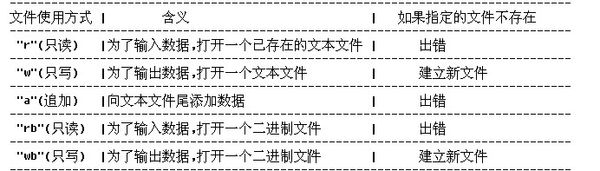

###5-1 利用NumPy和pandas对CSV文件进行写操作
* A:对CSV文件进行写操作
	* a:对NumPy数组进行CSV文件写入
		* numpy.savetxt(fname, X, fmt='%.18e', delimiter=' ', newline='\n', header='', footer='', comments='# ')
			* 将NumPy数组写出到CSV文件
		* 
				import numpy as np
	
				np.random.seed(42)
				
				a = np.random.randn(3, 4)
				a[2][2] = np.nan
				print a
	
				np.savetxt('np.csv', a, fmt='%.2f', delimiter=',', header="#1, #2, #3, #4")
	
				Out:
					[[ 0.49671415 -0.1382643   0.64768854  1.52302986]
					 [-0.23415337 -0.23413696  1.57921282  0.76743473]
					 [-0.46947439  0.54256004         nan -0.46572975]]
	
					#文件np.csv
					# #1	 #2		#3	 	#4
					0.5		-0.14	0.65	1.52
					-0.23	-0.23	1.58	0.77
					-0.47	0.54	nan		-0.47

	* b:对pandasDataFrame进行CSV文件写入
		* dataframe.to_csv(self, path_or_buf=None, sep=',', na_rep='', float_format=None, columns=None, header=True, index=True, index_label=None, mode='w', encoding=None, compression=None, quoting=None, quotechar='"', line_terminator='\n', chunksize=None, tupleize_cols=False, date_format=None, doublequote=True, escapechar=None, decimal='.')
			* 将pandasDataFrame写出到CSV文件
		* 
				df = pd.DataFrame(a)
				print df
				
				df.to_csv('pd.csv', float_format='%2.f', na_rep="NAN!")

				Out:
					          0         1         2         3
					0  0.496714 -0.138264  0.647689  1.523030
					1 -0.234153 -0.234137  1.579213  0.767435
					2 -0.469474  0.542560       NaN -0.465730
					#自动补上title

					#文件pd.csv
						0		1		2		3
					0	0.5		-0.14	0.65	1.52
					1	-0.23	-0.23	1.58	0.77
					2	-0.47	0.54	NAN!	-0.47

###5-2 读写NumPy.npy与Python pickle
* A:NumPy.npy的读写操作
	* numpy.save(file, arr, allow_pickle=True, fix_imports=True)
		* 存储npy文件
	* numpy.load(file, mmap_mode=None, allow_pickle=True, fix_imports=True, encoding='ASCII')
		* 读取".npy",".npz",或者序列化文件（pickled files）
		* 返回array, tuple, dict, 等等

	* 案例演示：用缓存方式创建和比较CSV文件与npy文件
	* tempfile.NamedTemporaryFile(mode='w+b', bufsize=-1, suffix='', prefix='tmp', dir=None, delete=True)
		* 创建和返回一个缓存文件（在程序结束后会自动删除）
		* suffix - 文件后缀名
	* os.path.getszie(path)
		* 返回指定文件的大小信息
	* 
			import numpy as np
			import pandas as pd
			from tempfile import NamedTemporaryFile
			from os.path import getsize
			
			np.random.seed(42)
			a = np.random.randn(365, 4)
			
			#使用缓存方式读写文件

			#CSV文件
			tmpf = NamedTemporaryFile()
			np.savetxt(tmpf, a, delimiter=',')
			print "Size CSV file", getsize(tmpf.name)

			#npy文件
			tmpf = NamedTemporaryFile()
			np.save(tmpf, a)
			tmpf.seek(0)
			loaded = np.load(tmpf)
			print "Shape", loaded.shape
			print "Size .npy file", getsize(tmpf.name)

			Out:
				Size CSV file 36864
				Shape (365L, 4L)
				Size .npy file 11760

* B:对Python pickle的读写操作
	* dataframe.to_pickle(self, path, compression='infer')
		* 将DataFrame的实例以序列化格式(pickle)存储到指定路径
	* pandas.read_pickle(path, compression='infer')
		* 从指定路径读取pandas序列化文件(pickle)（或其他任何序列化文件）
		* 返回序列化时的对象类型
		* 警告：读取不信任的序列化文件会有安全隐患

	* 案例演示：序列化DataFrame对象
	* 
			df = pd.DataFrame(a)
			df.to_pickle("E:\\Python\\Python笔记\\Python数据分析\\temp")
			print "Size pickled dataframe", getsize("E:\\Python\\Python笔记\\Python数据分析\\temp")
			print "DF from pickle\n", pd.read_pickle("E:\\Python\\Python笔记\\Python数据分析\\temp")

			Out:
				Size pickled dataframe 12250
				DF from pickle
				            0         1         2         3
				0    0.496714 -0.138264  0.647689  1.523030
				#略
				363  0.240753  2.601683  0.565510 -1.760763
				364  0.753342  0.381158  1.289753  0.673181
				
				[365 rows x 4 columns]

* C:补充
	* Python pickle的读写操作
		* pickle.load(file)
			* 从指定文件中读取并反序列化文件
			* 注：
				* file类型：open("文件路径", "模式")
				* 模式(mode) 
				* 

###5-3 读写HDF5文件
* A:HDF5概念
	* 名称：层次数据结构， Hierarchical Data Format，简称HDF，HDF5为第5版本
	* 作用：一种存储大型数值数据的技术规范，通过组（group）和数据集（dataset）组织数据
		* dataset是类似于数组的数据集
		* group是类似文件夹一样的容器，存放dataset和其他group
		* 简而言之：groups类比词典，dataset类比Numpy中的数组

* B:Python中的HDF5
	* HDF5主要程序库
		* h5py（使用这种）
		* PyTables（未知问题）
		* 依赖项
			* NumPy：详见第一、二章
			* numexpr：NumPy数组处理的辅助程序包，在计算包含多种运算的数组表达式时，速度比NumPy快许多倍
	* 安装h5py
	* 
			pip install numexpr
			pip install h5py

* C:使用h5py读写HDF5文件
	* h5py.File - 类 
		* `__init__`(self, name, mode=None, driver=None, libver=None, userblock_size=None, swmr=False, **kwds)
			* 根据name和模式mode进行HDF5读或写操作
	* file['主键'] = data
		* 创建一个HDF5 dataset，名字为'主键'，并将data数据写入，只要data是数据集即可
	* file.create_dataset(self, name, shape=None, dtype=None, data=None, **kwds)
		* 创建一个HDF5 dataset，名字为name，并将data数据写入，只要data是数据集即可
	* file.create_group(self, name)
		* 创建和返回一个group，名字为name
	* file.keys()
		* 查看所有的主键
	* file['主键'][#切片语法]
		* 读取主键中的值
	* file.close()
		* 关闭文件

	* 案例演示：
	* 
			import h5py
			import numpy as np
			
			#HDF5的写入
			imgData = np.zeros((30, 3, 128, 256))
			f = h5py.File('HDF5_FILE.h5','w') 		#创建一个h5文件，文件指针是f
			f['data'] = imgData 					#将数据写在主键data下
			f['labels'] = range(100) 				#将数据写在主键labels下
			f.close() 								#关闭文件
			
			#HDF5的读取
			f = h5py.File('HDF5_FILE.h5', 'r') 		#打开h5文件
			print f.keys() 							#可以查看所有的主键
			print f['labels'][:] 					#取出主键为data的所有键值
			f.close()								#关闭文件

			Out:
				[u'data', u'labels']
				[ 0  1  2  3  4  5  6  7  8  9 10 11 12 13 14 15 16 17 18 19 20 21 22 23 24
				 25 26 27 28 29 30 31 32 33 34 35 36 37 38 39 40 41 42 43 44 45 46 47 48 49
				 50 51 52 53 54 55 56 57 58 59 60 61 62 63 64 65 66 67 68 69 70 71 72 73 74
				 75 76 77 78 79 80 81 82 83 84 85 86 87 88 89 90 91 92 93 94 95 96 97 98 99]

###5-4 读写Excel文件
* A:Python中的Excel
	* Excel主要程序库
		* openpyxl：提供针对.xlsx文件的读写功能
		* xlrd、xlwt：提供针对.xlsx文件的读写功能

	* 安装
	* 
			pip install openpyxl
			pip install xlrd
			pip install xlwt

* B:使用pandas读写Excel文件
	* dataframe.to_excel(self, excel_writer, sheet_name='Sheet1', na_rep='', float_format=None, columns=None, header=True, index=True, index_label=None, startrow=0, startcol=0, engine=None, merge_cells=True, encoding=None, inf_rep='inf', verbose=True, freeze_panes=None)
		* 将dataframe写入到一个excel sheet中
		* excel_writer - 字符串路径或者现有的Excel Writer对象
	* pandas.read_excel(io, sheetname=0, header=0, skiprows=None, skip_footer=0, index_col=None, names=None, parse_cols=None, parse_dates=False, date_parser=None, na_values=None, thousands=None, convert_float=True, has_index_names=None, converters=None, dtype=None, true_values=None, false_values=None, engine=None, squeeze=False, **kwds)
		* 读取一个Exceltable到dataframe

	* 案例演示
	* 
			import numpy as np
			import pandas as pd
			
			np.random.seed(42)
			a = np.random.randn(365,4)
			
			df = pd.DataFrame(a)
			name = "excel.xlsx"
			print name
			df.to_excel(name, sheet_name='Random Data')
			print "Means\n", pd.read_excel(name, 'Random Data').mean()

			Out:
				excel.xlsx
				Means
				0    0.037860
				1    0.024483
				2    0.059836
				3    0.058417
				dtype: float64

###5-5 读写JSON
* A:REST Web服务和JSON的概念
	* REST
		* 名称：表述性态转移，Representational State Transfer，简称REST
		* 作用：基于此架构风格的Web服务，可以对数据项
			* 标识
				* 统一资源标识符URL
			* 使用以下操作
				* GET - 创建
				* POST - 请求
				* PUT - 更新
				* DELETE - 删除

	* JSON
		* 名称：JavaScript对象表示法，JavaScropt Object Notation，简称JSON
		* 作用：为Web服务提供数据交换功能，加工数据
			* JSON字符串的使用
				* json.loads(str) - 解析字符串为JSON字符串
				* jsonstr['key'] = - 访问与修改特定key的value
				* json.dumps(jsonstr) - 解析JSON字符串为字符串

* B:使用pandas读写JSON
	* pandas. read_json(path_or_buf=None, orient=None, typ='frame', dtype=True, convert_axes=True, convert_dates=True, keep_default_dates=True, numpy=False, precise_float=False, date_unit=None, encoding=None, lines=False)
		* 将一个JSON字符串转换为pandas对象
		* typ - 可选series或frame，指定pandas对象类型
	* to_json(self, path_or_buf=None, orient=None, date_format=None, double_precision=10, force_ascii=True, date_unit='ms', default_handler=None, lines=False)
		* 将pandas对象转换成JSON字符串

	* 案例演示
			import pandas as pd

			#字典类型的JSON字符串
			json_str = '{"country":"Netherlands","dma_code":"0","timezone":"Europe\/Amsterdam","arae_code":"0","ip":"46.19.37.108","asn":"AS196752","continent_cod":"EU","isp":"Tilaa V.O.F.","longitude":5.75,"latitude":52.5,"country_code":"NL","country_code3":"NLD"}'
			
			data = pd.read_json(json_str, typ='series')
			print "Series\n", data
			
			data["country"] = "Brazil"
			print "New Series\n", data.to_json()

			Out:
				Series
				arae_code                       0
				asn                      AS196752
				continent_cod                  EU
				country               Netherlands
				country_code                   NL
				country_code3                 NLD
				dma_code                        0
				ip                   46.19.37.108
				isp                  Tilaa V.O.F.
				latitude                     52.5
				longitude                    5.75
				timezone         Europe/Amsterdam
				dtype: object
				New Series
				{"arae_code":"0","asn":"AS196752","continent_cod":"EU","country":"Brazil","country_code":"NL","country_code3":"NLD","dma_code":"0","ip":"46.19.37.108","isp":"Tilaa V.O.F.","latitude":52.5,"longitude":5.75,"timezone":"Europe\/Amsterdam"}

###5-6 解析RSS和Atom订阅
* A:RSS和Atom的概念
	* RSS
		* 名称：简易信息聚合，Really Simple Syndication，简称RSS
		* 作用：常用于订阅博客和新闻
	* Atom
		* 与RSS类似

* B:Python中的订阅解析
	* 订阅解析的主要程序库
		* feedparser

	* 安装
	* 
			sudo pip install feedparser

* B:使用feedparser解析订阅
	* feedparser.parse(url_file_stream_or_string, etag=None, modified=None, agent=None, referrer=None, handlers=None, request_headers=None, response_headers=None)
		* 解析URL、文件、流或字符串中的订阅网址

	* 案例演示：解析packpub.com上的订阅
		* enumerate(iterable[, start]) - 类
			* 得到索引和值的迭代器
		* 
				import feedparser as fp
		
				rss = fp.parse("http://packpub.com/rss.xml")
				
				print "# Entries", len(rss.entries)
				
				for i, entry in enumerate(rss.entries):
				    if "Python" in entry.summary:
				        print i, entry.title
				        print entry.summary

###5-7 解析HTML
* A:HTML的概念
	* 名称：超文本标记语言，Hypertext Markuo Language，简称HTML
	* 作用：创建网页文档的一种基础性技术

* B:Python中的HTML解析
	* HTML解析的主要程序库
		* beautifulsoup4（只学习这个）
		* REST API

	* 安装
	* 
			pip install beautifulsoup4

* C:使用beautifulsoup4解析HTML
	* a：初始化
		* BeautifulSoup() - 类，加载HTML
			* __init__(self, markup='', features=None, builder=None, parse_only=None, from_encoding='', exclude_encodings=None, **kwargs)
				* markup - HTML的文档字符串
				* features - HTML解析器
				* from_encoding - HTML编码
	
		* 案例演示
		* 
				import re
	
				#注意：导包方式选择
				from bs4 import BeautifulSoup   				#process html
				from bs4 import BeautifulStoneSoup				#process xml
				import bs4             							#all
	
				doc = ['hello',     ' This is paragraph one of ptyhonclub.org.',     ' This is paragraph two of pythonclub.org.',     '']
	
				soup = BeautifulSoup(''.join(doc)) 				#加载HTML
				soup = BeautifulSoup(respHtml, fromEncoding=htmlCharset)

	* b：获取tag内容
		* soup.find(self, name=None, attrs={}, recursive=True, text=None, **kwargs)
			* 返回找到的第一个标签
		* soup.find_all(self, name=None, attrs={}, recursive=True, text=None, limit=None, **kwargs)
			* 以list返回找到的所有标签
		* .node
			* 获取指定的标记内容
		* node.contents[number]
			* 一个列表，里面保存了该剖析树的直接子节点
	
		* 案例演示
		* 
				head = soup.find('head')						#函数获取
				head = soup.head								#句点标记获取
				head = soup.contents[0].contents[0]				#句点深度获取
	
				html = soup.contents[0]    						# <html> ... </html>
				head = html.contents[0]    						# <head> ... </head>
				body = html.contents[1]   						# <body> ... </body>

	* c：获取关系节点
		* node.parent
			* 获取父节点
		* node.nextSibling
			* 获取下一个节点
		* node.previousSibling
			* 获取上一个节点

	* d：通用获取方法
		* soup.find(self, name=None, attrs={}, recursive=True, text=None, **kwargs)
			* 返回找到的第一个标签
			* recursive - 是否只搜索直接子节点
		* soup.find_all(self, name=None, attrs={}, recursive=True, text=None, limit=None, **kwargs)
			* 以list返回找到的所有标签
			* recursive - 是否只搜索直接子节点
			* limit - 用于限制返回的数量

		* tag搜索
		* 
				find(tagname)           # 直接搜索名为tagname的tag 如：find('head')
				find(list)              # 搜索在list中的tag，如: find(['head', 'body']) 
				find(dict)              # 搜索在dict中的tag，如:find({'head':True, 'body':True})
				find(re.compile(''))    # 搜索符合正则的tag, 如:find(re.compile('^p')) 搜索以p开头的tag
				find(lambda)            # 搜索函数返回结果为true的tag, 如:find(lambda name: if len(name) == 1) 搜索长度为1的tag
				find(True)              # 搜索所有tag 

		* attr搜索
		* 
				find(id='xxx')                 					# 寻找id属性为xxx的
				find(attrs={id=re.compile('xxx'), algin='xxx'}) # 寻找id属性符合正则且algin属性为xxx的
				find(attrs={id=True, algin=None})        		# 寻找有id属性但是没有algin属性的     

				resp1 = soup.findAll('a', attrs = {'href': match1})
				resp2 = soup.findAll('h1', attrs = {'class': match2})
				resp3 = soup.findAll('img', attrs = {'id': match3})

		* text搜索
		* 
				print p1.text # u'This is paragraphone.'
				print p2.text # u'This is paragraphtwo.'
				# 注意：1，每个tag的text包括了它以及它子孙的text。2，所有text已经被自动转为unicode，如果需要，可以自行转码encode(xxx)

	* e：实例，请看Python爬虫

###总结
* 1.CSV文件读写操作：NumPy与pandas
* 2.NumPy.npy与Python pickle读写操作：NumPy与pandas
* 3.HDF5读写操作：h5py
* 4.Excel读写操作：pandas
* 5.JSON读写操作：pandas
* 6.RSS和Atom订阅解析：feedparser
* 7.HTML解析：beautifulsoup4