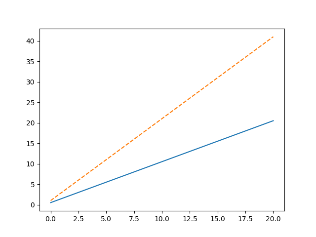
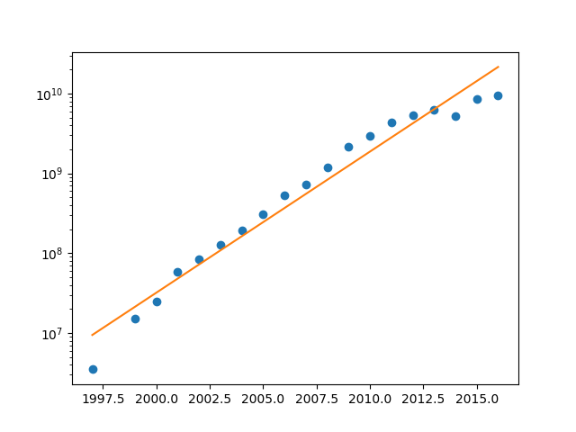
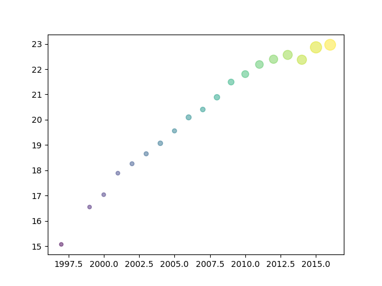
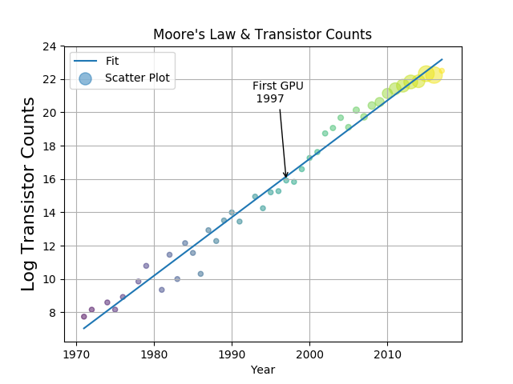
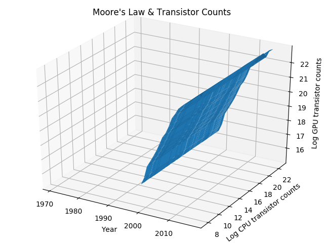
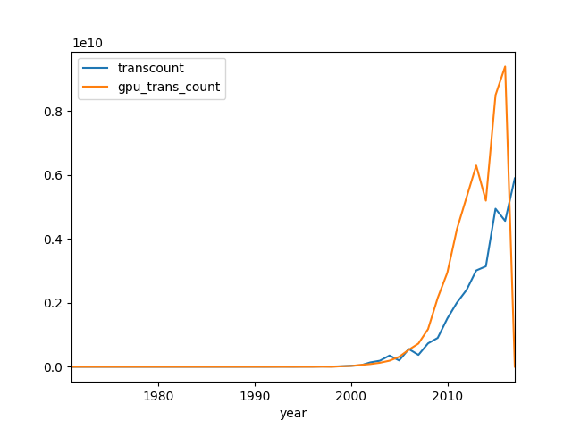
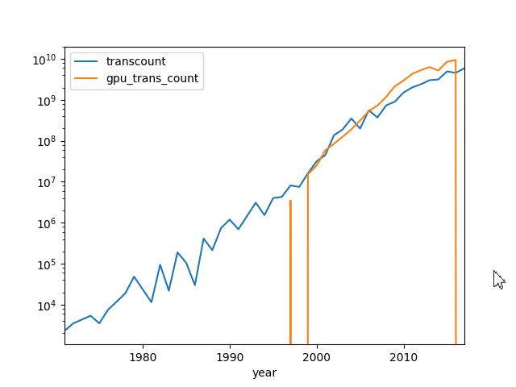
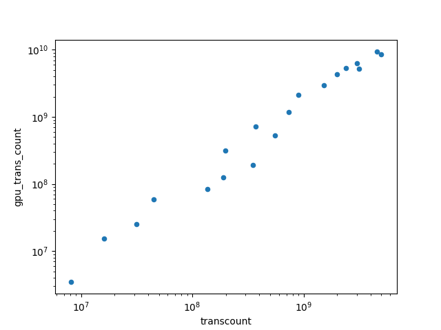
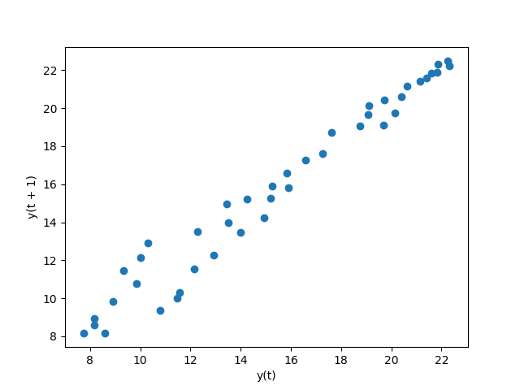
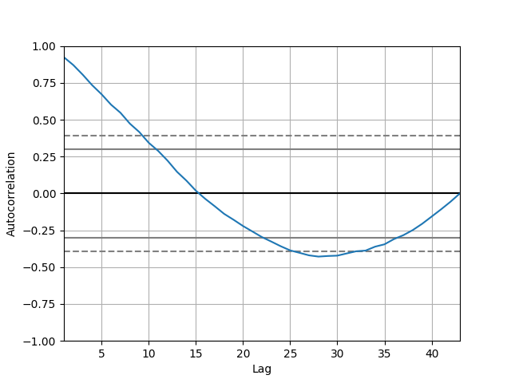

###6-1 matplotlib的子库
* A:模块介绍
	* 参见01 Python程序库入门
	* matplotlib是建立在NumPy之上的一个Python绘图库，它提供了一个面向对象的API和一个过程式类MATLAB API，它们可以并行使用

* B:研究matplotlib的相关文档
	* 
			import matplotlib as mpl
			import pydoc
			import pkgutil
			
			def clean(docstr):
			    docstr = " ".join(docstr.split())
			    docstr = docstr.replace("="," ")
			    return docstr
			
			def desc(prefix, pkg_path):
			    for pkg in pkgutil.iter_modules(path = pkg_path):
			        name = prefix + "." + pkg[1]
			        if(pkg[2] == True):
			            try:
			                docstr = pydoc.plain(pydoc.render_doc(name))
			                dcostr = clean(docstr)
			                start = docstr.find("DESCRIPTION")
			                docstr = docstr[start:start + 140]
			                print name, docstr
			            except:
			                continue
			print "matplotlib version", mpl.__version__
			
			desc('matplotlib', mpl.__path__)

			Out:
				matplotlib version 2.0.0
				matplotlib.axes 
				matplotlib.backends 
				matplotlib.compat 
				matplotlib.delaunay DESCRIPTION
				    :Author: Robert Kern <robert.kern@gmail.com>
				    :Copyright: Copyright 2005 Robert Kern.
				    :License: BSD-style license. Se
				matplotlib.projections 
				matplotlib.sphinxext 
				matplotlib.style 
				matplotlib.testing 
				matplotlib.tri 

###6-2 基本图
* A:绘制基本图形
	* matplotlib.pyploy.plot(x, y, 'type') - 根据(x, y)绘制图像
		* type - 指定填充物
			* '--'
			* 'o'
	* matplotlib.pyplot.show() - 将函数图像显示到屏幕上
	* matplotlib.pyplot.savefig() - 将图形保存到一个文件中

	* 案例演示：绘制线条
	* numpy.linspace(start, stop, num=50, endpoint=True, retstep=False, dtype=None)
		* 根据指定的间隔返回均匀空格的序列
	* 
			import matplotlib.pyplot as plt
			import numpy as np
			
			x = np.linspace(0, 20)
			
			plt.plot(x, .5 + x)
			plt.plot(x, 1 + 2 * x, '--')
			plt.show()

			Out:
	*			

###6-3 对数图
* A:对数图函数
	* matplotlib.pyplot.loglog(x, y, 'type')
		* 双对数图，两个坐标轴都采用对数刻度
	* matplotlib.pyplot.semilogx(x, y, 'type')
		* 半对数图，x轴采用线性刻度，y轴采用对数刻度
	* matplotlib.pyplot.semilogy(x, y, 'type')
		* 半对数图，y轴采用线性刻度，x轴采用对数刻度

	* 案例演示：绘制摩尔定律（GPU）曲线图
	* numpy.polyfit(x, y, deg, rcond=None, full=False, w=None, cov=False)
		* 用多项式来拟合数据
		* deg - 指定最高次数
		* 返回ndarray表示的多项式系数（降序排列）
	* numpy.polyval(p, x)
		* 根据给定的值评估多项式
		* p - 多项式的系数
		* x - 自变量，用来评估p
		* 返回ndarray或者polt1d
	* 
			import matplotlib.pyplot as plt
			import numpy as np
			import pandas as pd
			
			df = pd.read_csv('transcount.csv')
			df = df.groupby('year').aggregate(np.mean)
			years = df.index.values
			counts = df['trans_count'].values
			poly = np.polyfit(years, np.log(counts), deg=1)
			print "Poly", poly
			plt.semilogy(years, counts, 'o')
			plt.semilogy(years, np.exp(np.polyval(poly, years)))
			plt.show()

			Out:
				Poly [  4.07094707e-01  -7.96907643e+02]
	* 			

###6-4 散点图中的泡式图
* A:散点图中的泡式图函数
	* matplotlib.pyplot.scatter(x, y, s=None, c=None, marker=None, cmap=None, norm=None, vmin=None, vmax=None, alpha=None, linewidths=None, verts=None, edgecolors=None, hold=None, data=None, **kwargs)
		* 根据x，y绘制散点图的泡式图
		* s - size，一个序列，表示每点气泡大小
		* c - color，一个序列，表示每点气泡颜色
		* alpha - 表示透明度，范围在0~1，0表示完全透明，1表示完全不透明
    
	* 案例演示：绘制摩尔定律（CPU）曲线
	* 
			import matplotlib.pyplot as plt
			import numpy as np
			import pandas as pd
			
			df = pd.read_csv('gpu_transcount.csv')
			df = df.groupby('year').aggregate(np.mean)
			
			cpu = pd.read_csv('transcount.csv')
			cpu = cpu.groupby('year').aggregate(np.mean)
			
			df = pd.merge(df, cpu, how='outer', left_index=True, right_index=True)
			df = df.replace(np.nan, 0)
			
			print df
			years = df.index.values
			counts = df['gpu_trans_count'].values
			cpu_counts = df['transcount'].values
			cnt_log = np.log(counts)
			plt.scatter(years, cnt_log, c=200 * years, s=20 + 200 * cpu_counts/cpu_counts.max(), alpha=0.5)
			plt.show()

			Out:
				      gpu_trans_count    transcount
				year                               
				1971     0.000000e+00  2.300000e+03
				1972     0.000000e+00  3.500000e+03
				#略
				2016     9.400000e+09  4.566667e+09
				2017     0.000000e+00  5.900000e+09
	* 			

###6-5 图例和注解
* A:辅助信息的函数
	* matplotlib.pyplot.legend(loc, fontsize)
		* loc - 图例位置
			* 
					===============   =============
		            Location String   Location Code
		            ===============   =============
		            'best'            0
		            'upper right'     1
		            'upper left'      2
		            'lower left'      3
		            'lower right'     4
		            'right'           5
		            'center left'     6
		            'center right'    7
		            'lower center'    8
		            'upper center'    9
		            'center'          10
		            ===============   =============
		* fontsize - 文字大小
			* int
			* float
			* {'xx-small', 'x-small', 'small', 'medium', 'large', 'x-large', 'xx-large'}
	* matplotlib.pyplot.annotate(s, xy, xytext, xycoords, textcoords, arrowprops, annotation_clip)
		* 对图中要点的注解
		* s - str，注解的文字
		* xy - (x, y)，注解点的坐标
		* xytext - (a, b)，注解文字的坐标，默认为xy处
		* xycoords - xy的坐标系统
		* textcoords - ab的坐标系统
		* arrowprops - 箭头类型，可选值详见help()
		* annotation_clip - boolean类型，控制边界外注解的可见性
	* matplotlib.pyplot.grid()
		* 绘制网格
	* matplotlib.pyplot.xlabel(str, fontsize=small, verticalalignment=top, horizontalalignment=center)
		* 绘制横轴标签
	* matplotlib.pyplot.ylabel(str, fontsize=small, verticalalignment=top, horizontalalignment=center)
		* 绘制纵轴标签
	* matplotlib.pyplot.title(str, fontdict, loc)
		* 绘制标题
		* fontdict - 字体外观
			* 'fontsize': rcParams['axes.titlesize'],
	        * 'fontweight' : rcParams['axes.titleweight'],
	        * 'verticalalignment': 'baseline',
	        * 'horizontalalignment': loc
	    * loc - 标题位置
	    	* {'center', 'left', 'right'}

	* 案例演示：绘制摩尔定律（GPU与CPU）曲线
	* 
			import matplotlib.pyplot as plt
			import numpy as np
			import pandas as pd

			#读取transcount.csv并分组聚合
			df = pd.read_csv('transcount.csv')
			df = df.groupby('year').aggregate(np.mean)

			#读取gpu_transcount.csv并分组聚合
			gpu = pd.read_csv('gpu_transcount.csv')
			gpu = gpu.groupby('year').aggregate(np.mean)

			#连接两个dataframe
			df = pd.merge(df, gpu, how='outer', left_index=True, right_index=True)
			#将nan用0填充
			df = df.replace(np.nan, 0)
			#获取年份
			years = df.index.values
			#获取transcount的数据
			counts = df['transcount'].values
			#获取gpu_trans_count的数据
			gpu_counts = df['gpu_trans_count'].values

			#拟合years-log(counts)的一次函数
			poly = np.polyfit(years, np.log(counts), deg=1)
			#绘制相应的拟合曲线 注：添加标签Fit
			plt.plot(years, np.polyval(poly, years), label="Fit")

			#b：要点注解
			gpu_start = gpu.index.values.min()
			y_ann = np.log(df.at[gpu_start, 'transcount'])
			ann_str = "First GPU\n %d" % gpu_start
			plt.annotate(ann_str, xy=(gpu_start, y_ann), arrowprops=dict(arrowstyle="->"), xytext=(-30, +70), textcoords='offset points')

			#绘制相应的泡式图 注：添加标签Scatter Plot
			cnt_log = np.log(counts)
			plt.scatter(years, cnt_log, c=200 * years, s=20 + 200 * gpu_counts/gpu_counts.max(), alpha=0.5, label="Scatter Plot")

			#绘制图例
			plt.legend(loc='upper left')
			#绘制网格
			plt.grid()
			#绘制横轴、纵轴标签
			plt.xlabel("Year")
			plt.ylabel("Log Transistor Counts", fontsize=16)
			#绘制标题
			plt.title("Moore's Law & Transistor Counts")

			plt.show()

			Out:
	* 			

###6-6 三维图
* A:三维图中的函数
	* matplotlib.pyplot.figure(num=None, figsize=None, dpi=None, facecolor=None, edgecolor=None, frameon=True, FigureClass=<class 'matplotlib.figure.Figure'>, **kwargs)
		* 创建一个Figue对象
	* mpl_toolkits.mplot3d.axes3d.Axes3D - 类
		* 创建一个Axes3D对象
	* numpy.meshgrid(Xs, Ys)
		* 创建一个坐标矩阵（扩充Xs，Ys）
		* 返回X, Y，其中X含有所有焦点处的横坐标，Y含有所有交点处的纵坐标
	* mpl_toolkits.mplot3d.axes3d.Axes3D.plot_surface(X, Y, Z)
		* 绘图

	* 案例演示：绘制摩尔定律（GPU与CPU）图
	* 
			from mpl_toolkits.mplot3d.axes3d import Axes3D
			import matplotlib.pyplot as plt
			import numpy as np
			import pandas as pd
			
			df = pd.read_csv('transcount.csv')
			df = df.groupby('year').aggregate(np.mean)
			
			gpu = pd.read_csv('gpu_transcount.csv')
			gpu = gpu.groupby('year').aggregate(np.mean)
			
			df = pd.merge(df, gpu, how="outer", left_index=True, right_index=True)
			df = df.replace(np.nan, 0)

			#创建一个Figue对象
			fig = plt.figure()
			#创建一个Axes3D对象
			ax = Axes3D(fig)
			#创建一个坐标矩阵
			X = df.index.values
			Y = np.log(df['transcount'].values)
			X, Y = np.meshgrid(X, Y)
			Z = np.log(df['gpu_trans_count'].values)
			#绘图
			ax.plot_surface(X, Y, Z)
			#设置3轴标签
			ax.set_xlabel('Year')
			ax.set_ylabel('Log CPU transistor counts')
			ax.set_zlabel('Log GPU transistor counts')
			ax.set_title("Moore's Law & Transistor Counts")
			plt.show()

			Out:
	* 			

###6-7 pandas绘图
* A:pandas绘图中的函数
	* dataframe.plot(x, y, kind)
		* pandas封装的matplotlib函数
		* kind - 图像类型
		* 
				'line' : line plot (default)
				'bar' : vertical bar plot
				'barh' : horizontal bar plot
				'hist' : histogram
				'box' : boxplot
				'kde' : Kernel Density Estimation plot
				'density' : same as 'kde'
				'area' : area plot
				'pie' : pie plot
				'scatter' : scatter plot
				'hexbin' : hexbin plot
		* logy - 是否为半对数图
		* logx - 是否为半对数图
		* loglog - 是否为双对数图

	* 案例演示：绘制摩尔定律（GPU与CPU）图
	* 
			import pandas as pd
			import matplotlib.pyplot as plt
			import numpy as np
			
			df = pd.read_csv('transcount.csv')
			df = df.groupby('year').aggregate(np.mean)
						
			gpu = pd.read_csv('gpu_transcount.csv')
			gpu = gpu.groupby('year').aggregate(np.mean)
			
			#基本图
			df = pd.merge(df, gpu, how='outer', left_index=True, right_index=True)
			df = df.replace(np.nan, 0)
			df.plot()
			
			#创建半对数图
			df.plot(logy=True)
			
			#创建散点图
			df[df['gpu_trans_count'] > 0].plot(kind='scatter', x='transcount', y='gpu_trans_count', loglog=True)
			
			plt.show()

			Out:
	* 			
	* 			
	* 			

###6-8 时滞图
* A:时滞图中的函数
	* pandas.plotting.lag_plot(series, lag=1, ax=None, **kwds)
		* 绘制时滞图
		* series - 时间对应序列
		* lag - 时滞值

	* 案例演示：绘制CPU晶体管数量时滞图
	* 
			import matplotlib.pyplot as plt
			import numpy as np
			import pandas as pd
			from pandas.plotting import lag_plot
			
			df = pd.read_csv('transcount.csv')
			df = df.groupby('year').aggregate(np.mean)
			
			gpu = pd.read_csv('gpu_transcount.csv')
			gpu = gpu.groupby('year').aggregate(np.mean)
			
			df = pd.merge(df, gpu, how='outer', left_index=True, right_index=True)
			df = df.replace(np.nan, 0)
			
			lag_plot(np.log(df['transcount']))
			plt.show()

			Out:
	* 			

###6-9 自相关图
* A:自相关图中的函数
	* pandas.plotting.autocorrelation_plot(series, ax=None, **kwds)
		* 绘制自相关图
		* series - 时间对应序列

	* 案例演示：绘制CPU晶体管数量自相关图
	* 
			import matplotlib.pyplot as plt
			import numpy as np
			import pandas as pd
			from pandas.plotting import autocorrelation_plot
			
			df = pd.read_csv('transcount.csv')
			df = df.groupby('year').aggregate(np.mean)
			
			gpu = pd.read_csv('gpu_transcount.csv')
			gpu = gpu.groupby('year').aggregate(np.mean)
			
			df = pd.merge(df, gpu, how='outer', left_index=True, right_index=True)
			df = df.replace(np.nan, 0)
			
			autocorrelation_plot(np.log(df['transcount']))
			plt.show()

			Out:
	* 			

###6-10 Plot.ly
* A:API介绍
	* 本质：
		* 为一个网站，尚处于beta测试阶段
	* 作用：
		* 提供数据可视化在线工具
		* 提供对应的Python工具
		* 可以将分析结果公布到Plot.ly网站上，达到团队成员内数据共享的目的
	* 安装：
	* 
			pip install plotly

* B:案例演示：通过Python API绘制箱形图
	* 
			import plotly.plotly as py
			from plotly.graph_objs import *
			from getpass import getpass
			import numpy as np
			import pandas as pd
			
			df = pd.read_csv('transcount.csv')
			df = df.groupby('year').aggregate(np.mean)
			
			gpu = pd.read_csv('gpu_transcount.csv')
			gpu = gpu.groupby('year').aggregate(np.mean)
			
			df = pd.merge(df, gpu, how='outer', left_index=True, right_index=True)
			df = df.replace(np.nan, 0)
			
			api_key = getpass()
			
			# change the user to your own username
			py.sign_in('Sakura', api_key)
			
			counts = np.log(df['transcount'].values)
			gpu_counts = np.log(df['gpu_trans_count'].values)
			
			data = Data([Box(y=counts), Box(y=gpu_counts)])
			plot_url = py.plot(data, filename='more-law-scatter')
			print plot_url

###总结
	* 1.matplotlib程序库
	* 2.matplotlib绘图：基本图，对数图，散点图中的泡式图，三维图，图例和注解
	* 3.pandas绘图：基本图、半对数图、散点图，时滞图，自相关图
	* 4.Plot.ly绘图：箱形图