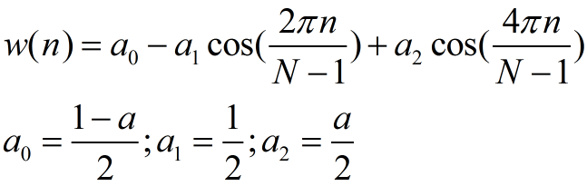

###7-0 附录-理论补充
* A:信号处理
	* 概念
		* 信号处理是工程和应用数学的一个分支
	* 作用
		* 主要用于分析模拟信号和数字信号随时间变化的变量

* B:时间序列
	* 概念
		* 时间序列是一个从首次测量开始的数据点的有序列表，数据采样的时间间隔通常是等间距的
	* 作用
		* 时间序列分析
			* 信号处理技术的一个分支
			* 进行时间序列分析时，数据值的顺序很重要，通常设法找出某个值与该序列中之前特定周期数上的另一个数据点或者一组数据点之间的关系

* C:移动平均法
	* 概念
		* 研究时间序列的一个方法
		* 规定一个窗口，限定每一眼能看到数据的数量，窗口每前移一个周期，其中的数据都要计算一次均值：
			
		* 不同类型的移动平均法主要区别在于求平均值是所用的权重

* D:窗口函数
	* 概念：
		* 定义在一个区间（窗口）上的函数，超出定义域，函数值为0.
	* 作用：
		* 分析频谱
		* 设计滤波器
	* 典例：
		* **矩形窗**：
		* 
			

		* **三角形窗**：
		* 
			
		* L可以是N、N+1、或者N-1

		* **布莱克曼窗**：
		* 
			

		* **汉宁窗**：
		* 
			

* E:协整
	* 概念：
		* 如果两个时间序列x(t)和y(t)的线性组合是稳态的，那么就称这两个序列具有共和整性或协整性
		* 在这种情况下，下面的方程式应该是稳态的：
			* y(t) - a x(t)
	* 举例
		* 考虑醉汉与狗在一起散步的情形，相关性反映出他们是否在同一个方向上前进；协整性反映的则是一段时间后人和狗之间的距离
	* 检验法
		* 增广迪基-福勒检验（Augmented Dickey-Fuller test, ADF）法可以测试时间序列中的单位根，也可用于时间序列的协整关系

* F:自相关
	* 概念
		* 指数据内部的相关性，可用来指明趋势
	* 举例
		* 如果后延一个周期，就可以检测一个值是否影响当前值。当然，如果是真的，那么计算出的自相关的取值自然就会相当高
	* 检验法
		* 对于给定的时间序列，只要知道我均值和标准差，就可以用期望值算子来定义时间s和t的自相关
		* 
		* 本质上，就是把相关性公式应用于一个时间序列及其同一个时间序列的滞后部分

* G:自回归模型
	* 概念
		* 自回归模型可以用于预测时间序列将来的值，通常假定一个随机变量的值依赖于它前面的值，并且前后值之间的关系是线性的，要做的是拟合数据，以便找到合适的参数。公式如下：
		* 
		* c是常量，最后一项是随机分量，又名白噪声
	* 注意
		* 实用性问题
			* 从实用性考虑，保持模型的简单性是非常重要的，因此值保留必要的滞后分量。按机器学习的专业术语来说，这叫做特征
		* 过拟合问题
			* 举例
				* 这个问题常常出现在对样本的拟合程度非常理想的情况下，这时一旦引入新的数据点，其表现立马变差
			* 解决方法
				* 交叉验证
					* 将一部分样本用于模型参数的估算，其余数据用于该模型的测试和评估
				* 使用没有过拟合问题的算法

* H:ARMA模型
	* 概念
		* ARMA（Autoregressive moving-average_model）模型由自回归模型和移动平均模型结合而成
	* 作用
		* 通常用于时间序列的预测
	* 实现法
		* 通常假定随机变量为噪声分量的线性组合与时间序列的均值之和
		* 自回归模型和移动平均模型可以具有不同的阶数，一般定义一个具有p个自回归项的ARMA模型
		* 
		* 同样含有常数部分和白噪声部分，这里还要设法拟合后面的噪声部分

* I:傅里叶级数与傅里叶分析
	* 傅里叶级数
		* 概念
			* 一种表示级数的数学方法，它通常使用正弦函数和余弦函数构成的无穷级数来表示函数，这些函数既可以是实值函数，也可以是虚值函数
			* 
	* 傅里叶分析
		* 概念
			* 傅里叶分析是建立在数学家Jsoeph Fourier命名的傅里叶级数之上的一种数学方法
		* 作用
			* 应用于时间序列时，傅里叶分析能够将数据从时域映射到频域上面，从而得到一个频谱
		* 实现法
			* 快速傅里叶变换（Fast Fourier Transform, FFT）（最高效的算法）
			* Scipy和NumPy已经实现了这个算法

* J:频谱相关
	* 振幅频谱

	* 功率频谱
		* 作用
			* 物理信号的功率频谱可以直观地展现出信号的能量分布
		* 实现法
			* 将某些值取平方

	* 相位谱
		* 作用
			* 直观展示相位

* K:白噪声与滤波
	* 白噪声
		* 概念
			* 功率频谱为常数的一个随机信号，不包含任何有用信息
	* 滤波
		* 概念
			* 一种信号处理技术，可以对信号的某些部分进行删减或抑制
		* 作用
			* 应用FFT后，就可以对高频或低频进行过滤，或者设法消除白噪声
		* 实现法
			* 中值滤波器（Median Filter）
				* 作用
					* 用来计算滚动窗口中数据的中值
			* Wiener滤波器
				* 作用
					* 通过统计数值来删除噪声
			* detrend滤波器
				* 作用
					* 用来删除趋势，它可以是一个线性或者不变趋势

###7-1 statsmodels的子库
* A:模块介绍
	* statsmodels是Python的统计建模和计量经济学工具包
	* 包括一些描述统计、统计模型估计和推断

* B:研究statsmodels的相关文档
	* 
			import statsmodels as sm
			import pkgutil as pu
			import pydoc
			
			def clean(s):
			    s = " ".join(s.split())
			    s.replace("=", " ")
			    return s
			
			def desc(prefix, pkg_path):
			    for pkg in pu.iter_modules(path=pkg_path):
			        name = prefix + "." + pkg[1]
			        if(pkg[2] == True):
			            try:
			                doc_str = pydoc.plain(pydoc.render_doc(name))
			                doc_str = clean(doc_str)
			                start = doc_str.find("DESCRIPTION")
			                doc_str = doc_str[start:start+140]
			                print name, doc_str
			            except:
			                continue
			
			print "statsmodels version", sm.__version__
			desc("statsmodels", sm.__path__)

			Out:
				statsmodels version 0.8.0
				statsmodels.base
				statsmodels.compat
				statsmodels.datasets
				statsmodels.discrete
				statsmodels.distributions
				statsmodels.duration
				statsmodels.emplike
				statsmodels.formula
				statsmodels.genmod
				statsmodels.graphics
				statsmodels.imputation
				statsmodels.interface
				statsmodels.iolib
				statsmodels.miscmodels
				statsmodels.multivariate
				statsmodels.nonparametric DESCRIPTION For an overview of this module, see docs/source/nonparametric.rst PACKAGE CONTENTS _kernel_base _smoothers_lowess api bandwidths
				statsmodels.regression
				statsmodels.resampling
				statsmodels.robust
				statsmodels.sandbox
				statsmodels.src
				statsmodels.stats
				statsmodels.tools
				statsmodels.tsa

###7-2 移动平均值
* A:移动平均值的函数
	* dataframe.rolling(self, window, min_periods=None, freq=None, center=False, win_type=None, on=None, axis=0, closed=None)
		* 翻滚函数，提供移动窗口的计算能力，后面调用相应的算法
		* window - 移动窗口的大小，表示计算数据时一次观察的数目
		* min_periods - 计算一个值所需的最小观察数目，否则会得出结果NA
		* center - 是否居中显示标签
		* 不指定win_type -> 返回rolling类型

	* 案例演示：绘制太阳黑子周期11年和22年为窗口的简单移动平均值
	* statsmodels.api.sm.datasets.sunspots.load_pandas()
		* 得到太阳黑子周期数据的dataset，其中的data键值为pandasDataFrame数据
	* 
			import matplotlib.pyplot as plt
			import statsmodels.api as sm
			
			#载入太阳黑子周期数据的dataset
			data_loader = sm.datasets.sunspots.load_pandas()
			#获得DataFrame类型的数据
			df = data_loader.data
			year_range = df["YEAR"].values
			
			plt.plot(year_range, df["SUNACTIVITY"].values, label="Original")
			plt.plot(year_range, df.rolling(window=11,center=False).mean()["SUNACTIVITY"].values, label="SMA 11")
			plt.plot(year_range, df.rolling(window=22,center=False).mean()["SUNACTIVITY"].values, label="SMA 22")
			plt.legend()
			plt.show()

			Out:
	*			

###7-3 窗口函数
* A:pandas中的窗口函数
	* dataframe.rolling(self, window, min_periods=None, freq=None, center=False, win_type=None, on=None, axis=0, closed=None)
		* 翻滚函数，提供移动窗口的计算能力，后面调用相应的算法
		* window - 移动窗口的大小，表示计算数据时一次观察的数目
		* min_periods - 计算一个值所需的最小观察数目，否则会得出结果NA
		* center - 是否居中显示标签
		* 指定win_type -> 返回windox类型
			* boxcar
			* triang
			* blackman
			* hamming
			* bartlett
			* parzen
			* bohman
			* blackmanharris
			* nuttall
			* barthann
			* kaiser (needs beta)
			* gaussian (needs std)
			* general_gaussian (needs power, width)
			* slepian (needs width)

	* 案例演示：绘制太阳黑子周期22年的窗口函处理取图
	* 
			import matplotlib.pyplot as plt
			import statsmodels.api as sm
			import pandas as pd
	
			#载入太阳黑子周期数据
			data_loader = sm.datasets.sunspots.load_pandas()
			#获得DataFrame类型的数据
			df = data_loader.data.tail(150)
			df = pd.DataFrame({'SUNACTIVITY':df['SUNACTIVITY'].values}, index=df['YEAR'])
			ax = df.plot()
			
			def plot_window(win_type):
			    #获得加窗后的移动平均值
			    df2 = df.rolling(win_type=win_type,center=False,window=22,axis=0).mean()
			    df2.columns = [win_type]
			    df2.plot(ax=ax)
			
			plot_window('boxcar')
			plot_window('triang')
			plot_window('blackman')
			plot_window('hanning')
			plot_window('bartlett')

			plt.show()

			Out:
	*			
				
###7-4 协整检验
* A:协整检验的函数
	* statsmodels.api.OLS(ndarray, naarray)
		* 一般最小二乘
	* statsmodels.api.OLS(ndarray, naarray).fit()
		* 对回归方程进行估计
	* statsmodels.api.OLS(ndarray, naarray).fit().summary()
		* 返回计算的所有结果
	* tatsmodels.api.OLS(ndarray, naarray).fit().resid
		* 返回计算的所有结果中的残差
	* statsmodels.tsa.stattools.adfuller(x, maxlag=None, regression='c', autolag='AIC', store=False, regresults=False)
		* ADF单位根检测
		* x - 数据序列
		* maxlag - 检验中的最大滞后值，默认为12*(nobs/100)^{1/4}

	* 案例演示：太阳黑子数与其正弦值的协整性检验
	* 
			import statsmodels.api as sm
			import pandas as pd
			import numpy as np
			import statsmodels.tsa.stattools as ts
			
			#定义用来计算ADF统计量的函数（Python中ADF统计量的定义）
			def calc_adf(x, y):
			    result = sm.OLS(x, y).fit()
			    return ts.adfuller(result.resid)
			
			#太阳黑子数据载入NumPy数组
			data_loader = sm.datasets.sunspots.load_pandas()
			data = data_loader.data.values
			N = len(data)
			
			#计算正弦值，并求出该值与其自身的协整关系
			t = np.linspace(-2 * np.pi, 2 * np.pi, N)
			sine = np.sin(np.sin(t))
			print "Self ADF", calc_adf(sine, sine)
	
			Out:
				Self ADF (7.3509623005045233e-16, 0.95853208606005602, 0L, 308L, {'5%': -2.8709700936076912, '1%': -3.4517611601803702, '10%': -2.5717944160060719}, -21533.113655477719)
				#第一个值是ADF的度量，第二个值是p值，这里的p值很高。然后是时间延迟和样本容量，最后一个是词典，给出了样本量的t分布值
	
			#给正弦波信号添加噪音，看它们是如何影响该信号的
			noise = np.random.normal(0, .01, N)
			print "ADF sine with noise", calc_adf(sine, sine + noise)
	
			Out:
				ADF sine with noise (-17.083972524411564, 7.6722448732455788e-30, 0L, 308L, {'5%': -2.8709700936076912, '1%': -3.4517611601803702, '10%': -2.5717944160060719}, -1867.5642791193909)
				#p值显著下降。ADF指标为-17.08，低于字典中所有的临界值，所有这些都是拒绝协整的有力证据
	
			#下面生成一个幅值和偏移量更大的余弦波，并混入噪音
			cosine = 100 * np.cos(t) + 10
			print "ADF sine vs cosine with noise", calc_adf(sine, cosine+noise)
	
			Out:
				ADF sine vs cosine with noise (-8.6714928169274668, 4.5335741572483745e-14, 16L, 292L, {'5%': -2.8714895534256861, '1%': -3.4529449243622383, '10%': -2.5720714378870331}, -10316.745482050823)
			#同样表明拒绝协整
	
			#正弦和太阳黑子之间的协整检验结果
			print "Sine vs sunspots", calc_adf(sine, data)
	
			Out:
				Sine vs sunspots (-6.7242691810701016, 3.4210811915549028e-09, 16L, 292L, {'5%': -2.8714895534256861, '1%': -3.4529449243622383, '10%': -2.5720714378870331}, -1102.5867415291168)

###7-5 自相关
* A:自相关的函数
	* 06 数据可视化 - pandas函数绘制自相关图形的函数
	* numpy.correlate(a, v, mode='valid')
		* 计算序列a和v的自相关值
		* mode - 可选{'valid', 'same', 'full'}
		* 返回序列a和v的自相关值序列
	* numpy.argsort(a, axis=-1, kind='quicksort', order=None)
		* 获取数组a排序后对应的下标
		* kind - 可选{'quicksort', 'mergesort', 'heapsort'}，排序的算法
		* order - 字符串或字符串list，决定排序方式

	* 案例演示：计算太阳黑子周期实际的自相关值并绘制自相关图
	* 
			import numpy as np
			import pandas as pd
			import statsmodels.api as sm
			import matplotlib.pyplot as plt
			from pandas.tools.plotting import autocorrelation_plot
			
			#获取太阳黑子的数据
			data_loader = sm.datasets.sunspots.load_pandas()
			data = data_loader.data["SUNACTIVITY"].values
			
			#使用NumPy库的correculate()函数来计算
			y = data - np.mean(data)
			norm = np.sum(y ** 2)
			correlated = np.correlate(y, y, mode='full')/norm
			
			#获取关联度最高的索引
			res = correlated[len(correlated)/2:]
			print np.argsort(res)[-5:]
			
			plt.plot(res)[-5:]
			plt.plot(res)
			plt.grid(True)
			plt.xlabel("Lag")
			plt.ylabel("Autocorrelation")
			plt.show()
			autocorrelation_plot(data)
			plt.show()
		
			Out:
				[ 9 11 10  1  0]
	* 			
 	* 			

###7-6 自回归
* A:自回归的函数
	* scipy.optimize.leastsq(func, x0, args=(), Dfun=None, full_output=0, col_deriv=0, ftol=1.49012e-08, xtol=1.49012e-08, gtol=0.0, maxfev=0, epsfcn=None, factor=100, diag=None)
		* 输入一系列样本点，给出待求函数的基本形状，即可得到相应的参数
		* 将误差函数func中除了初始参数x0以外的参数打包到args中

	* 案例演示：
	* a 线性拟合太阳黑子周期数据
	* 
			from scipy.optimize import leastsq
			import statsmodels.api as sm
			import matplotlib.pyplot as plt
			import numpy as np
			
			#==========搭建模型==========
			#需要拟合的函数（模型）model，以及误差error
			def model(p, x1, x10):
			    p1, p10 = p
			    return p1 * x1 + p10 * x10
			
			def error(p, data, x1, x10):
			    return data - model(p, x1, x10)
			
			#拟合参数
			def fit(data):
			    #给参数表赋值（初始参数）
			    p0 = [.5, 0.5]
			    #把error函数中除了p以外的参数打包到args中
			    params = leastsq(error, p0, args=(data[10:], data[9:-1], data[:-10]))[0]
			    return params
			
			#==========模型参数的估算==========
			#获取太阳黑子周期活动数据
			data_loader = sm.datasets.sunspots.load_pandas()
			sunspots = data_loader.data["SUNACTIVITY"].values
			
			#在部分数据上训练该模型
			cutoff = 9 * len(sunspots) / 10
			params = fit(sunspots[:cutoff])
			#显示模型参数
			print "Params", params
			
			#==========模型的测试和评估==========
			#获取预测值和真实值
			pred = params[0] * sunspots[cutoff-1:-1] + params[1] * sunspots[cutoff-10:-10]
			actual = sunspots[cutoff:]
			#得到预测值与真实值之差的平均平方差
			print "Root mean square error", np.sqrt(np.mean((actual - pred) ** 2))
			#获取平均绝对系数，判定系数应尽量接近1，以更好的拟合数据
			print "Mean absolute error", 100 * np.mean(np.abs(actual - pred)/actual)
			mid = (actual + pred)/2
			print "Symmetric Mean absoulte percentage error", 100 * np.mean(np.abs(actual - pred)/mid)
			print "Coefficient of determination", 1 - ((actual - pred) ** 2).sum() / ((actual - actual.mean()) ** 2).sum()
			#绘制图像
			year_range = data_loader.data["YEAR"].values[cutoff:]
			plt.plot(year_range, actual, 'o', label="Sunspots")
			plt.plot(year_range, pred, 'x', label="Prediction")
			plt.grid(True)
			plt.xlabel("YEAR")
			plt.ylabel("SUNACTIVITY")
			plt.legend()
			plt.show()

			Out:
				Params [ 0.67172672  0.33626295]
				Root mean square error 22.8148122613
				Mean absolute error 60.7817800736
				Symmetric Mean absoulte percentage error 34.9843386176
				Coefficient of determination 0.799940292779
	* 			

	* b 周期拟合太阳黑子周期数据
	* 
			from scipy.optimize import leastsq
			import statsmodels.api as sm
			import matplotlib.pyplot as plt
			import numpy as np
			
			#==========搭建模型==========
			def model(p, t):
			    C, p1, f1, phi1 , p2, f2, phi2 , p3, f3, phi3 = p
			    return C + p1 * np.sin(f1 * t + phi1) + p2 * np.sin(f2 * t + phi2) + p3 * np.sin(f3 * t + phi3)
			
			def error(p, y, t):
			    return y - model(p, t)
			
			def fit(y, t):
			    p0 = [y.mean(), 0, 2 * np.pi/11, 0, 0, 2 * np.pi/22, 0, 0, 2 * np.pi/100, 0]
			    params = leastsq(error, p0, args=(y, t))[0]
			    return params
			
			#==========模型参数的估算==========
			#获取太阳黑子活动周期的数据
			data_loader = sm.datasets.sunspots.load_pandas()
			sunspots = data_loader.data["SUNACTIVITY"].values
			years = data_loader.data["YEAR"].values
			
			#在部分数据上训练该模型
			cutoff = 9 * len(sunspots) / 10
			params = fit(sunspots[:cutoff], years[:cutoff])
			#显示模型参数
			print "Params", params
			
			#==========模型的测试和评估=========
			pred = model(params, years[cutoff:])
			actual = sunspots[cutoff:]
			print "Root mean square error", np.sqrt(np.mean((actual - pred) ** 2))
			#获取平均绝对系数，判定系数应尽量接近1，以更好的拟合数据
			print "Mean absolute error", np.mean(np.abs(actual - pred))
			print "Mean absolute percentage error", 100 * np.mean(np.abs(actual - pred)/actual)
			mid = (actual + pred)/2
			print "Symmetric Mean absolute percentage error", 100 * np.mean(np.abs(actual - pred) / mid)
			print "Coefficient of determination", 1 - ((actual - pred) ** 2).sum() / ((actual - actual.mean()) ** 2).sum()
			#绘制图像
			year_range = data_loader.data["YEAR"].values[cutoff:]
			plt.plot(year_range, actual, 'o', label="Sunspots")
			plt.plot(year_range, pred, 'x', label="Prediction")
			plt.grid(True)
			plt.xlabel("YEAR")
			plt.ylabel("SUNACTIVITY")
			plt.legend()
			plt.show()

			Out:
				Params [ 47.18799995  28.8994747    0.56827278   6.51179623   4.55214498
				   0.29372078 -14.30928312 -18.16524174   0.06574835  -4.37789391]
				Root mean square error 59.5620575957
				Mean absolute error 44.5815868755
				Mean absolute percentage error 65.1645745858
				Symmetric Mean absolute percentage error 78.4480682874
				Coefficient of determination -0.363531623002
	* 			

###7-7 ARMA模型
* A:ARMA模型的函数
	* statsmodels.apism.tsa.ARMA(p,q)
		* 自动聚合移动平均ARMA(p, q)模型
	 * statsmodels.apism.tsa.ARMA(p,q).fit(self, start_params=None, trend='c', method='css-mle', transparams=True, solver='lbfgs', maxiter=50, full_output=1, disp=5, callback=None, start_ar_lags=None, **kwargs)
	 	* 拟合ARMA(q, p)模型
	 	* 返回ARMA结果
	 * statsmodels.apism.tsa.ARMA(p,q).fit().predict(self, start=None, end=None, exog=None, dynamic=False)
	 	* ARMA模型的样本内和样本外预测
	 	* exog - 样本外预测是必须给出，传入真实值
	 	* dynamic - 影响样本内预测。False：样本内滞后值被用来预测；True：样本内预测被用在代替滞后独立变量上。第一个预测值是start

	* 案例演示：太阳黑子周期数据ARMA拟合
	* 
			import pandas as pd
			import matplotlib.pyplot as plt
			import statsmodels.api as sm
			import datetime
			
			#获取太阳黑子活动周期的数据
			data_loader = sm.datasets.sunspots.load_pandas()
			df = data_loader.data
			#将年份值转换成日期类型的索引
			years = df['YEAR'].values.astype(int)
			df.index = pd.Index(sm.tsa.datetools.dates_from_range(str(years[0]), str(years[-1])))
			del df["YEAR"]
			
			#拟合数据
			model = sm.tsa.ARMA(df, (10,1)).fit()
			#进行预测
			prediction = model.predict('1975', str(years[-1]), dynamic=True)
			
			#绘制结果图像
			df['1975':].plot()
			prediction.plot(style='--', label='Prediction')
			plt.legend()
			plt.show()

			Out:
	* 			

###7-8 傅里叶分析
* A:傅里叶变换的函数
	* scipy.fftpack.rfft(x, n=None, axis=-1, overwrite_x=False)
		* 对实值数据进行离散傅里叶变换
	* scipy.fftpack.fftshift(x, axes=None)
		* 把0频分量（数据的平均值）移动到频谱中央（看起来更舒服）

	* 案例演示：对正弦波实施FFT
			import numpy as np
			import statsmodels.api as sm
			import matplotlib.pyplot as plt
			from scipy.fftpack import rfft
			from scipy.fftpack import fftshift
			
			#获取太阳黑子活动数值
			data_loader = sm.datasets.sunspots.load_pandas()
			sunspots = data_loader.data["SUNACTIVITY"].values
			
			#获取太阳黑子活动数值的正弦
			t = np.linspace(-2 * np.pi, 2 * np.pi, len(sunspots))
			mid = np.ptp(sunspots)/2
			sine = mid + mid * np.sin(np.sin(t))
			
			#对正弦进行傅里叶变换
			sine_fft = np.abs(fftshift(rfft(sine)))
			print "Index of max sine FFT", np.argsort(sine_fft)[-5:]
			#对太阳黑子活动数值进行傅里叶变换
			transformed = np.abs(fftshift(rfft(sunspots)))
			print "Indices of max sunpots FFT", np.argsort(transformed)[-5:]
			
			#绘制图像
			plt.subplot(311)
			plt.plot(sunspots, label="Sunspots")
			plt.plot(sine, lw=2, label="Sine")
			plt.grid(True)
			plt.legend()
			plt.subplot(312)
			plt.plot(transformed, label="Transformed Sunspots")
			plt.grid(True)
			plt.legend()
			plt.subplot(313)
			plt.plot(sine_fft, lw=2, label="Transformed Sine")
			plt.grid(True)
			plt.legend()
			plt.show()

			Out:
				Index of max sine FFT [160 157 166 158 154]
				Indices of max sunpots FFT [205 212 215 209 154]
	* 			

###7-9 谱分析
* A:功率频谱
	* 案例演示：以上一节为例
	* 
			plt.plot(transformed ** 2, label="Power Spectrum")
* B:相位谱
	* 案例演示：以上一节为例
	* 
			plt.plot(np.anle(transformed), label="Phase Spectrum")

* C:滤波
	* scipy.signal.medfilt(volume, kernel_size=None)
		* 中值滤波器（Median Filter），计算滚动窗口中数据的中值
		* volumn - n维向量
		* kernel_size - 可以是一个标量或者给出每一个维度长度的list。kernel_size的元素应该是奇数（指定窗口大小）
	* scipy.signal.medfilt.wiener(im, mysize=None, noise=None)
		* Wiener滤波器，通过统计数值来删除噪声
		* im - n维向量
		* mysize - 可以是一个标量或者给出每一个维度长度的list。kernel_size的元素应该是奇数（指定窗口大小）
		* noise - 可用的噪声等级，若无，则为按本地输入变量的均值估计
	* scipy.signal.medfilt.detrend(data, axis=-1, type='linear', bp=0)
		* detrend滤波器，删除指定维度的趋势，它可以是一个线性或者不变趋势
		* data - n维向量
		* axis - 维度
		* type - 可选'linear', 'constant'，指定维度的趋势
		* bp - 断点序列，在每两断点之间过滤
	* 
			import statsmodels.api as sm
			import matplotlib.pyplot as plt
			from scipy.signal import medfilt
			from scipy.signal import wiener
			from scipy.signal import detrend
			
			#获取太阳黑子活动数值
			data_loader = sm.datasets.sunspots.load_pandas()
			sunspots = data_loader.data["SUNACTIVITY"].values
			years = data_loader.data["YEAR"].values
			
			#绘制图像
			plt.plot(years, sunspots, label="SUNACTIVITY")
			plt.plot(years, medfilt(sunspots, 11), lw=2, label="Median")
			plt.plot(years, wiener(sunspots, 11), '--', lw=2, label='Wiener')
			plt.plot(years, detrend(sunspots), lw=3, label='Detrend')
			plt.xlabel("YEAR")
			plt.grid(True)
			plt.legend()
			plt.show()
			Out:
	* 			

###总结
* 1.附录 理论补充
* 2.statsmodels程序库
* 3.基本：移动平均值，窗口函数
* 4.相关：协整检验，自相关，自回归，ARMA模型
* 5.分析：傅里叶分析，谱分析