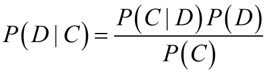
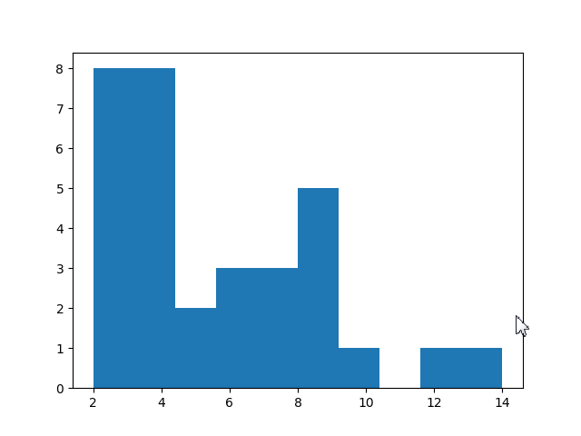
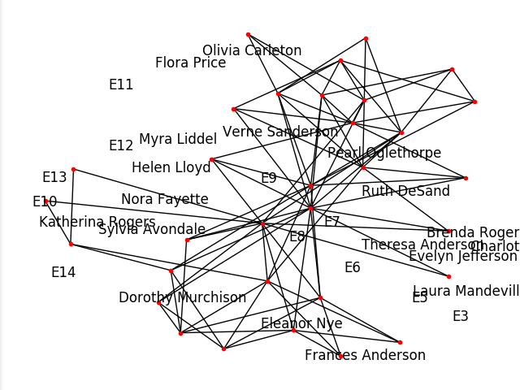

###9-1 NLTK的概览和安装
* A:NLTK
	* 概念
		* NLTK，全称The Python Natural Language Toolkit，是Python自然语言工具包
		* 一个用来分析自然语言文本的Python应用程序接口

* B:安装
* 
		pip install nltk
		import nltk
		nltk.download()

* C:研究NLTK的相关文档
	* 
			import nltk
			import pkgutil as pu
			import pydoc
			
			def clean(doc_str):
			    doc_str = " ".join(doc_str.split())
			    doc_str = doc_str.replace("=", " ")
			    return doc_str
			
			def desc(prefix, pkg_path):
			    for pkg in pu.iter_modules(path=pkg_path):
			        name = prefix + "." + pkg[1]
			        if(pkg[2]==True):
			            doc_str = pydoc.plain(pydoc.render_doc(name))
			            doc_str = clean(doc_str)
			            start = doc_str.find("DESCRIPTION")
			            doc_str = doc_str[start:start+140]
			            print name, doc_str
			
			print nltk.__version__
			desc("nltk", nltk.__path__)

			Out:
				3.2.2
				nltk.app DESCRIPTION chartparser: Chart Parser chunkparser: Regular-Expression Chunk Parser collocations: Find collocations in text concordance: Part
				nltk.ccg DESCRIPTION For more information see nltk/doc/contrib/ccg/ccg.pdf PACKAGE CONTENTS api chart combinator lexicon logic DATA BackwardApplicati
				nltk.chat DESCRIPTION A class for simple chatbots. These perform simple pattern matching on sentences typed by users, and respond with automatically g
				nltk.chunk DESCRIPTION Classes and interfaces for identifying non-overlapping linguistic groups (such as base noun phrases) in unrestricted text. This 
				nltk.classify DESCRIPTION Classes and interfaces for labeling tokens with category labels (or "class labels"). Typically, labels are represented with stri
				nltk.cluster DESCRIPTION This module contains a number of basic clustering algorithms. Clustering describes the task of discovering groups of similar ite
				nltk.corpus 
				nltk.draw DESCRIPTION # Natural Language Toolkit: graphical representations package # # Copyright (C) 2001-2017 NLTK Project # Author: Edward Loper <e
				nltk.inference 
				nltk.metrics DESCRIPTION # Natural Language Toolkit: Translation metrics # # Copyright (C) 2001-2017 NLTK Project # Author: Will Zhang <wilzzha@gmail.com
				nltk.misc DESCRIPTION # Natural Language Toolkit: Miscellaneous modules # # Copyright (C) 2001-2017 NLTK Project # Author: Steven Bird <stevenbird1@gm
				nltk.parse DESCRIPTION Classes and interfaces for producing tree structures that represent the internal organization of a text. This task is known as "
				nltk.sem DESCRIPTION This package contains classes for representing semantic structure in formulas of first-order logic and for evaluating such formu
				nltk.sentiment 
				nltk.stem DESCRIPTION Interfaces used to remove morphological affixes from words, leaving only the word stem. Stemming algorithms aim to remove those 
				nltk.tag DESCRIPTION This package contains classes and interfaces for part-of-speech tagging, or simply "tagging". A "tag" is a case-sensitive string
				nltk.tbl DESCRIPTION A general purpose package for Transformation Based Learning, currently used by nltk.tag.BrillTagger. PACKAGE CONTENTS api demo e
				nltk.test DESCRIPTION Unit tests for the NLTK modules. These tests are intended to ensure that source code changes don't accidentally introduce bugs. 
				nltk.tokenize DESCRIPTION Tokenizers divide strings into lists of substrings. For example, tokenizers can be used to find the words and punctuation in a s
				nltk.translate DESCRIPTION Experimental features for machine translation. These interfaces are prone to change. PACKAGE CONTENTS api bleu_score chrf_score 
				nltk.twitter DESCRIPTION This package contains classes for retrieving Tweet documents using the Twitter API. PACKAGE CONTENTS api common twitter_demo twi

###9-2 滤除停用字、姓名和数字
* A:滤除停用字
	* a 加载语料库
		* nltk.corpus.stopwords.words('language')
			* 从停用字语料库中加载某种语言的停用字语料
		* nltk.corpus.gutenberg.files()
			* 返回当前语料库包含的文件list视图
		* nltk.corpus.gutenberg.sents(self, fileids=None)
			* 返回指定文件的list（句子，每句均编码为单词字符串的list，如：list(list(str))）
		* nltk.corpus.gutenberg.raw(self, fileids=None)
			* 返回指定文件的单个字符串
		* nltk.corpus.gutenberg.words(self, fileids=None)
			* 返回指定文件的list（词与标点符号）
		* 
				import nltk
	
				#加载英语停用字语料
				sw = set(nltk.corpus.stopwords.words('english'))
				print "Stop words", list(sw)[:7]

				Out:
					
				
				#加载Gutenberg语料库
				gb = nltk.corpus.gutenberg
				print "Gutenberg files", gb.files()[-5:]

				Out:
					

				#提取milton-paradise.txt文件中的前两句内容
				text_sent = gb.sents("milton-paradise.txt")[:2]
				print "Unfiltered", text_sent

				Out:
					

	* b 过滤
		* 		
				#过滤掉下面的停用字
				for sent in text_sent:
				    filtered = [w for w in sent if w.lower() not in sw]
				    print "Filtered", filtered

				Out:
					

* B:滤除数字和姓名
	* a 获取标签
		* nltk.pos_tag(list)
			* 获取文本内所含的标签，返回一个元组列表，各元组内第一个元素为文本，第二个元素为文本对应的标签
		* 		
				#接上for语句
		 		#获取文本内所含的标签
			    tagged = nltk.pos_tag(filetered)
			    print "Tagged", tagged
			
	* b 删除
			    #删除列表中的数字和姓名
			    words= []
			    for word in tagged:
			        if word[1] != "NNP" and word[1] != 'CD':
			            words.append(word[0])

###9-3 词袋模型
* A:词袋模型
	* 概念
		* 认为一篇文档是由其中的一个集合（即袋子），词与词之间没有顺序以及先后关系
		* 对于一批文档，每一个唯一的文字，都可以视为语料库中的一个特征，利用单词计数可以为每个文档建立一个特征向量
	* 作用
		* 可以进行单词计数，进行类似垃圾邮件识别之类的统计分析
	* 安装
		* 
				pip install scikit-learn

* B:使用词袋模型
	* sklearn.feature_extraction.text.CountVectorizer(stop_words='language')
		* 特征向量产生器
		* stop_words - 去掉停用字
	* sklearn.feature_extraction.text.CountVectorizer().fit_transform()
		* 对指定list提取对应的特征向量
	* sklearn.feature_extraction.text.CountVectorizer().fit_transform().toarray()
		* 返回特征向量
	* sklearn.feature_extraction.text.CountVectorizer().fit_transform().get_feature_names()
		* 返回特征值
	* 
			import nltk
			from sklearn.feature_extraction.text import CountVectorizer
			
			#加载gutenberg语料库
			gb = nltk.corpus.gutenberg
			#加载文档
			hamlet = gb.raw("shakespeare-hamlet.txt")
			macbeth = gb.raw("shakespeare-macbeth.txt")
			
			#去掉英语停用词
			cv = CountVectorzier(stop_words='english')
			#并创建特征向量
			print "Feature vector", cv.fit_transform([hamlet, macbeth]).toarray()
			print "Features", cv.get_feature_names()[:5]

###9-4 词频分析
* A:分析词频
	* nltk.FreqDist(list)
		* 创建词频分析器
	* nltk.FreqDist(list).keys()
		* 返回键的列表
	* nltk.FreqDist(list).values()
		* 返回值的列表
	* 
			import nltk
			import string
			
			#加载文档
			gb = nltk.corpus.gutenberg
			words = gb.words("shakespeare-caesar.txt")
			
			#加载停用字语料库
			sw = set(nltk.corpus.stopwords.words('english'))
			#剔除停用词和标点符号
			punctuation = set(string.punctuation)
			filtered = [w.lower() for w in words if w.lower() not in sw and w.lower() not in punctuation]
			
			#====单字词分析====
			#创建一个FreqDist对象，并输出键和值
			fd = nltk.FreqDist(filtered)
			print "Words", fd.keys()[:5]
			print "Counts", fd.values()[:5]

			Out:
				Words [u'fawn', u'writings', u'legacies', u'pardon', u'hats']
				Counts [1, 1, 1, 10, 1]

			#输出频率最高的值，以及对应的次数
			print "Max", fd.max()
			print "Count", fd[fd.max()]

			Out:
				Max caesar
				Count 190

			#双、三字词分析
			fd = nltk.FreqDist(nltk.bigrams(filtered))
			print "Bigrams", fd.keys()[:5]
			print "Counts", fd.values()[:5]
			print "Bigrams Max", fd.max()
			print "Bigrams count", fd[('let', 'vs')]

			Out:
				Bigrams [(u'bru', u'must'), (u'bru', u'patient'), (u'angry', u'flood'), (u'decay', u'vseth'), (u'cato', u'braue')]
				Counts [1, 1, 1, 1, 1]
				Bigrams Max (u'let', u'vs')
				Bigrams count 16

###9-5 朴素贝叶斯分类
* A:分类算法
	* 概念
		* 机器学习算法的一种
	* 定理
		* 后验概率与先验概率和相似度的乘积成正比
		* 
	* 作用
		* 用来判定给定的数据所属的类别，即种类或类型

* B:朴素贝叶斯分类
	* 概念
		* 一种常用于进行文本文档研究的机器学习算法
		* 一个概率算法，基于概率与数理统计中的贝叶斯定理，它假设特征之间是相互独立的
			* 贝叶斯定理：给出了如何利用新证据来修正某事件发生概率的方法

* C:朴素贝叶斯分类算法
	* random.seed(number)
		* 设定种子
	* random.shuffle(self, x, random=None)
		* 随机洗乱list x
	* nltk.NaiveBayesClassifier.train(set)
		* 用带标注的set训练分类器，返回训练后的分类器（原理为朴素贝叶斯分类）
	* classifier.classify(key)
		* 对指定的键值进行预测
	* 
			import nltk
			import string
			import random
			
			#=====按照停用词或标点符号（标注）对单词进行分类======
			
			#获取停用字和标点符号
			sw = set(nltk.corpus.stopwords.words('english'))
			punctuation = set(string.punctuation)
			#获取古登堡项目的shakespeare-caesar.txt
			gb = nltk.corpus.gutenberg
			words = gb.words("shakespeare-caesar.txt")
			
			#将字长作为一个特征，为此定义函数
			#函数：获取特征——字长
			def word_features(word):
			    return {'len': len(word)}
			#函数：获取标注——判断是否是停用词
			def isStopword(word):
			    return word in sw or word in punctuation
			
			#取古登堡项目的shakespeare-caesar.txt中的单词进行标注，以区分是否为停用词
			labeled_words = ([(word.lower(), isStopword(word.lower())) for word in words])
			random.seed(42)
			random.shuffle(labeled_words)
			print labeled_words[:5]

			Out:
				[(u'was', True), (u'greeke', False), (u'cause', False), (u'but', True), (u'house', False)]

			#求出每个单词的长度
			featuresets = [(word_features(n), word) for (n, word) in labeled_words]
			
			#训练一个贝叶斯分类器，90%的单词用于训练，10%用于预测
			cutoff = int(.9 * len(featuresets))
			train_set, test_set = featuresets[:cutoff], featuresets[cutoff:]
			#训练
			classifier = nltk.NaiveBayesClassifier.train(train_set)
			#预测
			print "'behold' class", classifier.classify(word_features('behold'))
			print "'the' class", classifier.classify(word_features('the'))

			Out:
				'behold' class False
				'the' class True

			#根据测试数据集来计算分类器的准确性
			print "Accuracy", nltk.classify.accuracy(classifier, test_set)
			#查看贡献最大的特征
			print classifier.show_most_informative_features(5)

			Out:
				Accuracy 0.857585139319
				Most Informative Features
			                     len = 7               False : True   =     65.7 : 1.0
			                     len = 1                True : False  =     52.0 : 1.0
			                     len = 6               False : True   =     51.4 : 1.0
			                     len = 5               False : True   =     10.9 : 1.0
			                     len = 2                True : False  =     10.4 : 1.0
				None

###9-6 案例演示：情感分析
* A:特征值：词频前5%的情感词，标注：neg与pos
	* 
			import random
			from nltk.corpus import movie_reviews
			from nltk.corpus import stopwords
			from nltk import FreqDist
			from nltk import NaiveBayesClassifier
			from nltk.classify import accuracy
			import string
			
			#通过categories()方法对影评文档进行标注
			labeled_docs = [(list(movie_reviews.words(fid)), cat) for cat in movie_reviews.categories() for fid in movie_reviews.fileids(cat)]
			#打乱文档
			random.seed(42)
			random.shuffle(labeled_docs)
			
			#载入文档数据
			review_words = movie_reviews.words()
			print "# Review Words", len(review_words)
			#滤除停用字和标点符号
			sw = set(stopwords.words('english'))
			punctuation = set(string.punctuation)
			def isStopWord(word):
			    return word in sw or word in punctuation
			filtered = [w.lower() for w in review_words if not isStopWord(w.lower())]
			print "# After filter", len(filtered)
			
			#为了效率，选用词频最高的前5%的单词作为特征
			words = FreqDist(filtered)
			N = int(.05 * len(words.keys()))
			word_features = [x[0] for x in words.most_common(N)]
			
			#定义函数：使用原始单词计数作为度量指标
			def doc_features(doc):
			    doc_words = FreqDist(w for w in doc if not isStopWord(w))
			    features = {}
			    for word in word_features:
			        features['count (%s)' % word] = (doc_words.get(word, 0))
			    return features
			
			#训练分类器
			featuresets = [(doc_features(d), c) for (d,c) in labeled_docs]
			train_set, test_set = featuresets[200:], featuresets[:200]
			classifier = NaiveBayesClassifier.train(train_set)
			#检验准确性
			print "Accuracy", accuracy(classifier, test_set)
			#获取贡献最大的特征
			print classifier.show_most_informative_features()

			Out:
				# Review Words 1583820
				# After filter 710579
				Accuracy 0.795
				Most Informative Features
			       count (wonderful) = 2                 pos : neg    =     14.7 : 1.0
			     count (outstanding) = 1                 pos : neg    =     11.2 : 1.0
			             count (bad) = 5                 neg : pos    =     10.8 : 1.0
			          count (stupid) = 2                 neg : pos    =     10.8 : 1.0
			          count (boring) = 2                 neg : pos    =     10.4 : 1.0
			          count (nature) = 2                 pos : neg    =      8.5 : 1.0
			       count (different) = 2                 pos : neg    =      8.3 : 1.0
			             count (bad) = 6                 neg : pos    =      8.2 : 1.0
			      count (apparently) = 2                 neg : pos    =      8.0 : 1.0
			            count (life) = 5                 pos : neg    =      7.6 : 1.0
			None

###9-7 创建词云
* A:词云
	* 创建方式
		* Wordle创建
		* http://www.wordle.net/advanced
		* 
				#需要提供单词列表和权值
				Word1 : weight
				word2 : weight

		* Python的两个程序库

* B:Wordle页面创建词云
	* 
			from nltk.corpus import movie_reviews
			from nltk.corpus import stopwords
			from nltk import FreqDist
			import string
			
			#载入停用字和标点符号
			sw = set(stopwords.words('english'))
			punctuation = set(string.punctuation)
			
			#定义函数：判断是否为停用字或标点符号
			def isStopWord(word):
			    return word in sw or word in punctuation
			
			#滤除停用字和标点符号
			review_words = movie_reviews.words()
			filtered = [w.lower() for w in review_words if not isStopWord(w.lower())]
			
			words = FreqDist(filtered)
			N = int(.01 * len(words.keys()))
			tags = [x[0] for x in words.most_common(N)]
			
			for tag in tags:
			    print tag, ':', words[tag]

			#将输出结果复制到Wordle页面即可
			Out:
				

* C:改进
	* 进一步过滤
		* 剔除包含数字符号和姓名的单词，以及在所有语料库中仅出现一次的词语
	* 使用更好的度量指标
		* 词频和逆文档频率（The Term Frequency-Inverse Document Frequency, TF-IDF）
			* scikit-learn的TfidVectorizer类有效实现了TF-IDF。该类产生一个稀疏的SciPy矩阵，存放着单词和文档的每种可能组合的TF-IDF值
	* list.isalpha()
		* 检测是否为单个字符
	* sklearn.feature_extraction.text.TfidfVectorizer(CountVectorizer)
		* 类，返回一个生成TF-IDF值的向量机
		* input - 输入，为string {'filename', 'file', 'content'}
		* stop_words(set) - 过滤停用字
	* vectorizer.fit_transform(string)
		* 创建文档矩阵
	* 
	* 
			from nltk.corpus import movie_reviews
			from nltk.corpus import stopwords
			from nltk import FreqDist
			import string
			#改
			from nltk.corpus import names
			from sklearn.feature_extraction.text import TfidfVectorizer
			import itertools
			import numpy as np
			import pandas as pd
			
			#载入停用字和标点符号
			sw = set(stopwords.words('english'))
			punctuation = set(string.punctuation)
			#改 载入names语料库
			all_names = set([name.lower() for name in names.words()])

			#定义函数：判断是否为停用字或标点符号  改 过滤名字和单个字母
			def isStopWord(word):
			    return word in sw or word in punctuation or word in all_names or not word.isalpha()
			
			#滤除
			review_words = movie_reviews.words()
			filtered = [w.lower() for w in review_words if not isStopWord(w.lower())]
			
			words = FreqDist(filtered)
			#改
			#为TfidfVectorizer提供一个字符串，指出语料库中的文档
			texts = []
			for fid in movie_reviews.fileids():
			    texts.append(" ".join([w.lower() for w in movie_reviews.words(fid) if not isStopWord(w.lower()) and words[w.lower()] > 1]))
			#创建向量化程序
			vectorizer = TfidfVectorizer(stop_words='english')
			#创建稀疏的文档矩阵
			matrix = vectorizer.fit_transform(texts)
			#为每个单词的TF-IDF的值求和，将结果保存在NumPy数组中
			sums = np.array(matrix.sum(axis=0)).ravel()
			#通过单词的排名权值来创建一个pandas DataFrame，并进行相应的排序
			ranks = []
			for word, val in itertools.izip(vectorizer.get_feature_names(), sums):
			    ranks.append((word, val))
			df = pd.DataFrame(ranks, columns=["term", "tfidf"])
			df = df.sort_values(['tfidf'])
			
			#输出前1%的词机器tfidf
			N = int(.01 * len(words.keys()))
			df = df.tail(N)
			for term, tfidf in itertools.izip(df["term"].values, df["tfidf"].values):
			    print term, ":", tfidf

###9-8 社交网络分析
* A:社交网络分析
	* 概念
		* 利用网络理论来研究社会关系
		* 节点：网络中的参与者
		* 连线：参与者之间的相互关系
	* Python中的社交网络分析
		* 仅介绍如何利用流行的Python库NetWorkX来分析简单的图；用Python库matplotlib来对这些网络进行可视化
	* 安装
	* 
			pip install networkxr

* B:列出示例图，绘制各个节点的柱状图，带有节点的网络图
	* nx.graph
		* 获取指定的示例图的数据
	* networkx.fruchterman_reingold_layout(G, dim=2, k=None, pos=None, fixed=None, iterations=50, weight='weight', scale=1.0, center=None)
		* 使用Fruchterman-Reingold force-directed算法的位置节点
		* G - networkx图表数据
		* dim - 视图的维数
		* 返回键值为节点的位置字典
		* 以下代码等价：
			* 
					G=nx.path_graph(4)
					pos=nx.spring_layout(G)
					#等价于
					pos=nx.fruchterman_reingold_layout(G)

	* networkx.draw(G, pos=None, ax=None, hold=None, **kwds)
		* 用matplotlib来绘制图表G
		* G - 一个networkx graph
		* pos - 接受一个由节点作键、位置作值的字典
	* draw_networkx_labels(G, pos, labels=None, font_size=12, font_color='k', font_family='sans-serif', font_weight='normal', alpha=1.0, bbox=None, ax=None, **kwds)
		* 在graph G上画节点标签
		* G - networkx图表数据
		* 返回键值为节点的位置字典

	* 
			import networkx as nx
			import matplotlib.pyplot as plt
			
			#NetworkX提供了许多示例图，将其列出
			print [s for s in dir(nx) if s.endswith('graph')]
			
			#导入davis_southern_women_graph，绘制出各个节点的度的柱状图
			G = nx.davis_southern_women_graph()
			plt.figure(1)
			plt.hist(nx.degree(G).values())
			
			#绘制带有节点标签的网络图
			plt.figure(2)
			pos = nx.spring_layout(G)
			nx.draw(G, node_size=9)
			nx.draw_networkx_labels(G, pos)
			plt.show()

			Out:
				['LCF_graph', 'barabasi_albert_graph', 'barbell_graph', 'binomial_graph', 'bull_graph', 'caveman_graph', 'chordal_cycle_graph', 'chvatal_graph', 'circulant_graph', 'circular_ladder_graph', 'complete_bipartite_graph', 'complete_graph', 'complete_multipartite_graph', 'connected_caveman_graph', 'connected_watts_strogatz_graph', 'cubical_graph', 'cycle_graph', 'davis_southern_women_graph', 'dense_gnm_random_graph', 'desargues_graph', 'diamond_graph', 'digraph', 'directed_havel_hakimi_graph', 'dodecahedral_graph', 'dorogovtsev_goltsev_mendes_graph', 'duplication_divergence_graph', 'ego_graph', 'empty_graph', 'erdos_renyi_graph', 'expected_degree_graph', 'fast_gnp_random_graph', 'florentine_families_graph', 'frucht_graph', 'gaussian_random_partition_graph', 'general_random_intersection_graph', 'geographical_threshold_graph', 'gn_graph', 'gnc_graph', 'gnm_random_graph', 'gnp_random_graph', 'gnr_graph', 'graph', 'grid_2d_graph', 'grid_graph', 'havel_hakimi_graph', 'heawood_graph', 'house_graph', 'house_x_graph', 'hypercube_graph', 'icosahedral_graph', 'is_directed_acyclic_graph', 'k_random_intersection_graph', 'karate_club_graph', 'kl_connected_subgraph', 'krackhardt_kite_graph', 'ladder_graph', 'line_graph', 'lollipop_graph', 'make_max_clique_graph', 'make_small_graph', 'margulis_gabber_galil_graph', 'moebius_kantor_graph', 'multidigraph', 'multigraph', 'navigable_small_world_graph', 'newman_watts_strogatz_graph', 'null_graph', 'nx_agraph', 'octahedral_graph', 'pappus_graph', 'path_graph', 'petersen_graph', 'planted_partition_graph', 'powerlaw_cluster_graph', 'projected_graph', 'quotient_graph', 'random_clustered_graph', 'random_degree_sequence_graph', 'random_geometric_graph', 'random_partition_graph', 'random_regular_graph', 'random_shell_graph', 'relabel_gexf_graph', 'relaxed_caveman_graph', 'scale_free_graph', 'sedgewick_maze_graph', 'star_graph', 'stochastic_graph', 'subgraph', 'tetrahedral_graph', 'to_networkx_graph', 'trivial_graph', 'truncated_cube_graph', 'truncated_tetrahedron_graph', 'tutte_graph', 'uniform_random_intersection_graph', 'watts_strogatz_graph', 'waxman_graph', 'wheel_graph']

	*			
	*			

###总结