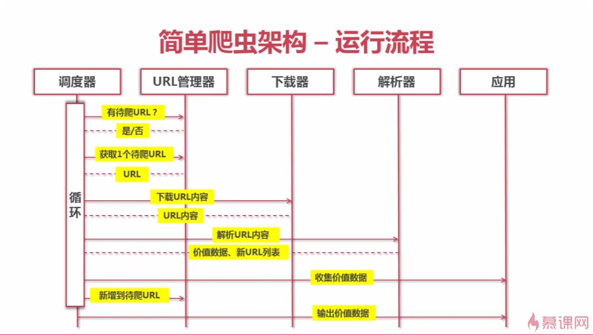
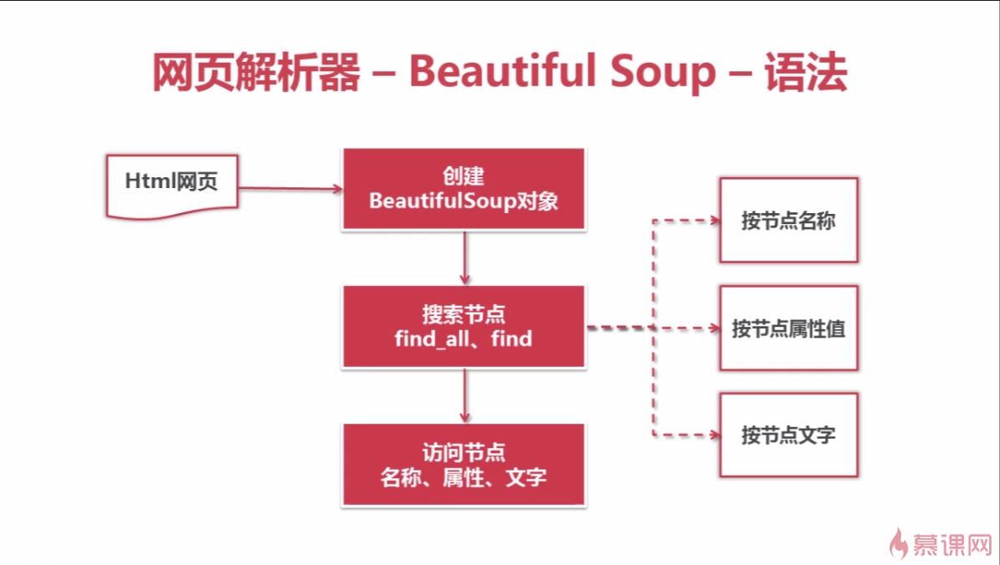
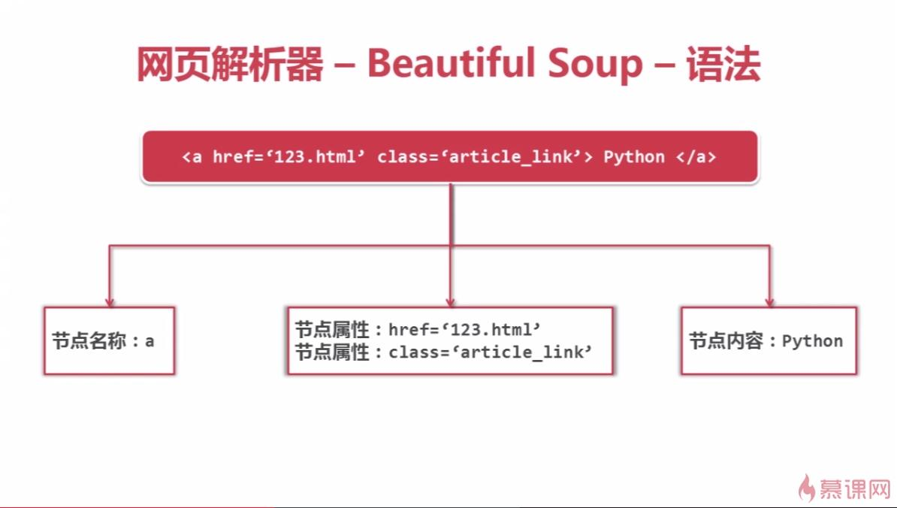
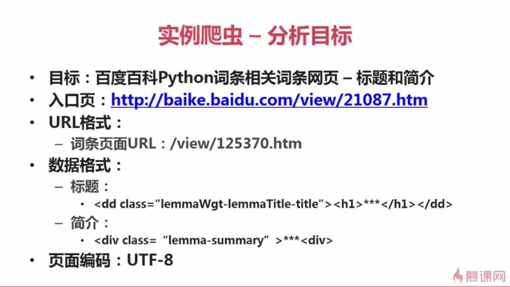

### 01 爬虫是什么
* A:爬虫简介
	* 爬虫：一段自动抓取互联网信息的程序

### 02 爬虫的技术价值
* A:价值
	* 互联网数据，为我所用！

* B:案例演示
	* 新闻聚合阅读
	* 最爆笑故事app
	* 最漂亮美女图片网
	* 图书价格对比网
	* Python资料合集

### 03 简单爬虫架构
* A:架构
	* 1.爬虫调度端
		* 启动，停止，监视
	* 2.爬虫
		* URL管理器 <----
		* 	 |			|
		* 	 |			|
		* 	 v			|
		* 网页下载器 	|
		* 	 |			|
		* 	 |			|
		* 	 v			|
		* 网页解析器 ____|	
	* 3.价值数据

* B:动态运行流程

 	

### 04 URL管理器
* A:作用
	* 管理待抓取	URL集合和已抓取URL集合
	* 防止重复、循环抓取

* B:功能
	* 1.添加新URL到待爬取的集合中
	* 2.判断待添加URL是否在容器中
	* 3.获取待爬取URL
	* 4.判断是否还有待爬取URL
	* 5.将URL从待爬取集合移动到已爬取集合

* C:实现方式
	* 1.内存
		* set()URL集合
	* 2.关系数据库
		* MYSQL	urls(url, is_crawled)
	* 3.缓存数据库
		* redis set

### 05 网页下载器
* A:作用
	* 将互联网上URL对应的网页下载到本地的工具

* B:Python的URL下载器
	* urllib2（Python官方基础模块）
		* 支持直接的URL下载
		* 向网页提交需要用户输入的数据
		* 支持需要登陆网页的cookie处理
		* 支持代理访问的代理处理
	* requests（第三方包，更强大）

* C:urllib2网页下载方法
	* 1.最简洁方法
		* urllib2.urlopen(url)
		* 
				import urllib2
				response = urllib2.urlopen('http://www.baidu.com') 	#直接请求
				print response.getcode() 							#获取状态码，如果是200，则表示获取成功
				cont = response.read() 								#读取内容

	* 2.增强处理
		* 添加data、http header
		* 
				import urllib2
				request = urllib2.Request(url)						#创建Request对象
				request.add_data('a', '1')							#添加数据
				request.add_heaer('User-Agent', 'Mozilla/5.0')		#添加http的header(伪装成Mozilla浏览器)
				response = urllib2.urlopen(request)					#发送请求获取结果

	* 3.添加特殊情景的处理器
		* HTTPCookieProcessor - 网页需要登陆访问，添加cookie处理
		* ProxyHandler - 网页需要代理访问
		* HTTPShandler - 网页使用HTTPS加密访问
		* HTTPRedirectHandler - 网页URL使用相互自动跳转关系
		* 
				import urllib2, cookielib
				cj = cookielib.CookieJar()										#创建cookie容器
				opener = urllib2.build_opener(urllib2.HTTPCookieProcessor(cj))	#创建一个opener
				urllib2.install_opener(opener)									#给urllib2安装opener
				response = urllib2.urlopen("http://www.baidu.com")				#使用带有cookie的urllib2访问网页

* D:案例演示
	* 
			url = "http://baidu.com"
			
			print '第一种方法'
			response1 = urllib2.urlopen(url)
			print response.getcode()
			print len(response1.read())
	
			print '第二种方法'
			request = urllib.Request(url)
			request.add_header('user-agent', 'Mozilla/5.0')
			response2 = urllib2.urlopen(request)
			print response.getcode()
			print len(response2.read())
	
			print '第三种方法'
			cj = cookielib.CookieJar()
			opener = urllib2.build_opener(urllib2.HTTPCookieProcessor(cj))
			urllib2.install_opener(opener)
			response3 = urllib2.urlopen(url)
			print response3.getcode()
			print cj
			print response3.read()

### 06 网页解析器
* A:作用
	* 从网页中提取有价值的数据

* B:Python的网页解析器
	* 正则表达式（模糊匹配）
	* html.parser（结构化解析）
	* BeautifulSoup（可以使用html.parser和lxml）（结构化解析）
	* lxml（结构化解析）
	
	* 结构化解析的概念
		* DOM（Document Object Model）树

* C:Beautiful Soup解析器
	* 简介
		* Python第三方库，用于从html或xml中提取数据
		* 官网：http://www.crummy.com/software/BeautifulSoup/

	* 安装并测试
		* pip install beautifulsoup4
		* import bs4

* D:网页解析器(BeautifulSoup)语法
	* 语法内容
 	
		* 案例演示
 		
		* 创建BeautifulSoup对象
		* 
				from bs4 import BeautfulSoup			#根据HTML网页字符串创建BeautifulSoup对象
				soup = BeautifulSoup(
									html_doc,			#HTML文档字符串
									'html.parser'		#HTML解析器
									from_encoding='utf8'#HTML文档的编码
									)

		* 搜索节点(find_all, find)
			* find_all(name, attrs, string) find(name, attrs, string)
			* 查找所有标签为a的节点
			* 
					soup.find_all('a')
			* 查找所有标签为a，链接符合/view/123.htm形式的节点
			* 
					soup.find_all('a', href='/view/123.htm')
					soup.find_all('a', href=re.compile(r'/view/\d+\.htm)) #三个参数都可正则

			* 查找所有标签为div，class为abc，文字为Python的节点冲突

		* 访问节点信息
			* node.name	- 获取查找到的节点的标签名称
			* node['href'] - 获取查找到的a节点的href属性
			* node.get_text() - 获取查找到的a节点的链接文字

* E:案例演示
	* 
			from bs4 import BeautifulSoup
			
			html_doc = '''（略）'''
	
			soup = BeautifulSoup(html_doc, 'html.parser', from_encoding='utf-8'	)
			print '获取所有数据'
			links = soup.find_all('a')
			for link in links:
				print link.name, link['href'], link.get_text()
			
			print '获取Lacie的链接'
			link_node = soup.find('a', href='http://example.com/Lacie')
			print link_node.name, link_node['href'], link_node.get_text()
	
			print '正则匹配'
			link_node = soup.find('a', href=re.compile(r'ill'))
			print link_node.name, link_node['href'], link_node.get_text()
	
			print '获取P段落文字'
			link_node = soup.find('P', class_="title")	#class后面加下划线
			print p_node.name, p_node.get_text()

### 07 实例爬虫
* A:分析目标
	* 确定目标
		* 百度百科Python词条页面以及相关词条页面的标题和简介
	* 分析目标
		* URL格式 - 限定抓取范围
		* 数据格式
		* 网页编码
 	
	* 编写代码
	* 执行爬虫

* B:创建项目
	* 1.创建模块
		* 总调度器，URL管理器，网页解析器，网页下载器，输出器

* C:总调度器
	* 1.创建main函数
		* 得到目标URL，创建并启动爬虫
	* 2.爬虫构造函数初始化
		* URL管理器，网页下载器，网页解析器，输出器对象
	* 3.实现爬取方法
		* 判断，启动爬取循环调度程序，输出
		* 添加辅助信息，处理异常

* D:URL管理器
	* 1.构造函数初始化2个需要维护的列表
	* 2.实现添加单个URL方法
		* 判断是否合法
		* 进行添加
	* 3.实现添加多个URL方法
		* 判断是否合法
		* 调用单个添加方法
	* 4.实现其他方法

* E:网页下载器
	* 1.参数判断
	* 2.下载网页
	* 3.判断是否下载成功
	* 4.返回下载内容

* F:网页解析器
	* 1.进行参数判断
	* 2.创建BeautifulSoup解析器对象
	* 3.创建两个本地方法进行解析
		* 1.列表/字典用于存放新的数据
		* 2.soup获取目标内容
		* 3.添加
		* 4.返回
	* 4.返回

* G:输出器
	* 1.构造方法初始化维护的目标数据
	* 2.收集数据
		* 参数判断
		* 添加
	* 3.输出文件为htlm
		* 创建文件对象
		* 按html格式写入
		* 设置默认编码问utf-8
		* 关闭文件对象

* H:开始运行
	* 得到数据

* G:代码见：eclipse项目