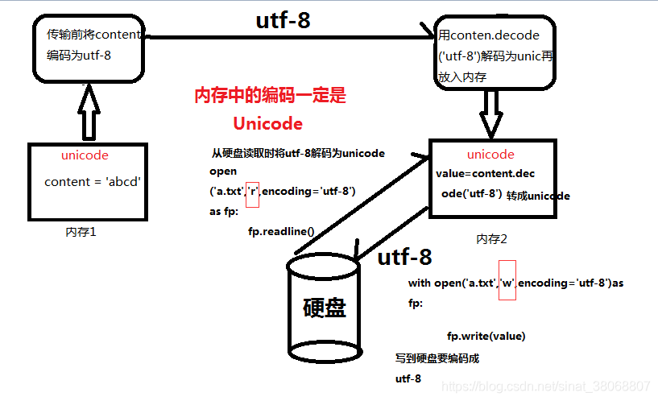

## 目录
[toc]

## 1 Hello World!
### 1.1 输出
`print(字符串1/语句1,字符串2/或语句2,...)` - 依次输出每个字符串，遇到逗号会空格

例：

```python
>>> print('100 + 200 =', 100 + 200)
100 + 200 = 300
```

### 1.2 输入
`var = input("提示语") `- 接收用户的输入信息，存放到变量var中

例：

```python
#文件hello.py'
name = input('please enter your name: ')
print('hello,', name)

#命令行
$ C:\Users\hasee\Desktop> C:\Users\hasee\Desktop\hello.py
$ Please enter your name:Infinity
$ hello Infinity
```

## 2 基本数据类型
### 2.1 整数
Python 可以处理任意大小的整数，十进制和数学上的表示方法相同，也支持十六进制。

例如：

`1`,`-100`

`0xff00`,`0xa5b4d`

### 2.2 浮点数
浮点数也就是小数，有两种表示，数学写法和科学计数法。

例如：

`0.12`,`3.1415926`

`1.23e9`,`12.3e8`

#### 2.2.1 浮点数四舍五入

* `round(x [, n])` - 返回浮点数 `x` 的四舍五入值，精度要求高的，不建议使用该函数

  取舍逻辑：“四舍六入五平分”， “四舍六入” 即保留值将保留到离上一位更近的一端，“五平分” 就是为 "5" 时根据奇偶性来判断，奇舍偶入。

  【注】”四舍五入” 的区间划分是 `[0,5)` 和 `[5, 10)`，是区间角度；“四舍六入五平分” 的区间划分是 `[0,5)`、`[5]`、`(5,10)`，是距离角度。

  * `n` - 保留的小数位数，默认只保留整数部分
  
  ```python
  # 四舍六入五平分
  >>> round(2.675, 2)
  2.67
  
  # 利用精度问题实现四舍五入
  >>> round(2.135*100)/100.0
  2.13
  
  # 精度问题如下
  >>> 2.135*100
  213.49999999999997
  >>> Decimal(2.135)*100
  Decimal('213.4999999999999786837179272')
  ```

### 2.3 字符串

#### 2.3.1 字符串的表示方法

字符串是任意文本，表示方法：

* 单引号 `'` 或双引号 `"` 括起来
	* 如果 `'` 也是字符，用双引号，其他的使用转义字符
* `r'文本'`
	* 文本内容默认不转义
* `'''文本'''`
	* 用来表示多行内容

第 2 种和第 3 种格式可以组合使用来达到想要的效果。

用例子来看看效果吧：

```python
>>> print(r'''hello,\n
world''')
hello,\n
world

print(r'''hello,
\'''''') # 后面有6个'
hello,
\'
```

对第2个例子的解释：

* 默认情况下，`\` 只对后面一个起作用，如 `\'''` 就理解成了 `\'` 和 `''`，而 `r` 又使 `\'` 失去转义作用
* `\''''` 则是 `'` 和 `'''`（后 `'''` 和先的 `'''` 对应）
* 最后 `''` 则代表空的字符串

#### 2.3.2 字符串的格式化法

* `print('%2d-%02d-%.2f' % (3,1,3.1415926))` - 使用占位符
  * `%d` - 整数，可以指定是否补 0 与位数
  * `%f` - 浮点数，可以指定是否补 0 与位数
  * `%s` - 字符串
  * `%x` - 十六进制整数
  * 【注】若要输出 `%`，直接用转义 `%%`
* `"xxx{:.2f}xxx{}xxx".format(str1, str2)` - 会用括号内的参数代替括号 `{}`，可在其中设置格式
  * `'xxx{:.2f}xxx'.format` - 直接返回对应的单（多）参数函数
  * 【注】要想输出纯粹的 `{` 和 `}`，应当使用转义符 `{{` 和 `}}`
* `f'Epoch {var1}/{var2 - 1}'` - 使用括号 `{}` 内变量的值来格式化
* `'-' * 10` - 输出多个字符，这里是 10 个

#### 2.3.3 字符串的拼接方法

* 方法一：使用加号（`+`）连接

  ```python
  str_name1 = 'To'
  str_name2 = 'ny'
  str_name = str_name1 + str_name2
  >> print(str_name)
  >> 'Tony'
  ```

* 方法二：使用 `.join(iterable)` 拼接

  ```python
  # 列表（list）为非嵌套列表,列表元素为字符串（str）类型
  list_good_night = ['晚', '上', '好', '!']
  str_night = ''.join(list_good_night)
  >> print(str_night)
  >> '晚上好!'
  
  # 字典（dict）的 key, value 必须为字符串 默认拼接 key 的列表
  dict_name = {'key1': 'value1', 'key2': 'value2'}
  str_key = ','.join(dict_name)  				# 拼接 key
  str_value = ','.join(dict_name.values())  	# 拼接 value
  ```


#### 2.3.4 字符串的分割方法

* 方法一：使用

  * `str.split(sep=" ", num=string.count(str))` 方法，`sep` 为分隔符，`num` 为分割次数，方向从前向后
  * `str.rsplit(sep=" ", num=string.count(str))` 方法，`sep` 为分隔符，`num` 为分割次数，方向从后向前

  ```python
  str = "Line1-abcdef \nLine2-abc \nLine4-abcd";
  print(str.split( ))       # 以空格为分隔符，包含 \n
  print(str.split(' ', 1 )) # 以空格为分隔符，分隔成两个
  
  ['Line1-abcdef', 'Line2-abc', 'Line4-abcd']
  ['Line1-abcdef', '\nLine2-abc \nLine4-abcd']
  ```

  【注1】分隔符 `sep` 默认为所有的空字符，包括空格（`' '`）、换行（`'\n'`）、制表符（`'\t'`）等。

  【注2】内置 `split()` 只能指定一个分隔符，多个用正则，多个单一分隔符使用 `'[]'` 或 `'|'`，多个长短不一分隔符使用 `'|'`.

  ```python
  # 多个单一分隔符
  line1 = "word;Word,emp?hahaha"
  print re.split(r";|,|\?", line1) # 别忘了转义 "?"
  >> ['word', 'Word', 'emp', 'hahaha']
  print re.split(r"[;,?]", line1)
  >> ['word', 'Word', 'emp', 'hahaha']
  
  # 多个长短不一分隔符
  line2 = "word;Word,emp? hahaha; whole, cai"
  print re.split(r";|,|\?\s|;\s|,\s", line2) 
  >> ['word', 'Word', 'emp', 'hahaha', ' whole', ' cai']
  ```

* 方法二：使用 `str.splitlines([keepends])`，行（`'\r'`, `'\r\n'`, `'\n'`）分割，返回一个包含各行作为元素的列表，`keepends` 表示是否保留换行符

  ```python
  str1 = 'ab c\n\nde fg\rkl\r\n'
  print(str1.splitlines())
   
  str2 = 'ab c\n\nde fg\rkl\r\n'
  print(str2.splitlines(True))
  
  ['ab c', '', 'de fg', 'kl']
  ['ab c\n', '\n', 'de fg\r', 'kl\r\n']
  ```

#### 2.3.5 字符串的空格去除

* `strip()` - 去除字符串开头和结尾的空格

  ```python
  str = " Hello world "
  str.strip()
   
  >>> "Hello world"
  ```

* `lstrip()` - 去除字符串开头的空格

  ```python
  str = " Hello world "
  str.lstrip()
   
  >>> 'Hello world '
  ```

* `rstrip()` - 去除字符串结尾的空格

  ```python
  str = " Hello world "
  str.lstrip()
  
  >>> ' Hello world'
  ```

* `replace(old, new, count)` - 可以去除全部空格

  ```python
  str = " Hello world "
  str.replace(" ","")
  
  >>> "Helloworld"
  ```

* `split()` + `join()` - 先用 `split` 按照空格分割字符串，再将各个元素连接起来

  ```python
  a = " a b c "
  b = a.split()  # 字符串按空格分割成列表
  >>> b ['a', 'b', 'c']
  c = "".join(b) # 使用一个空字符串合成列表内容生成新的字符串
  >>> 'abc'
  
  # 快捷用法
  >>> a = " a b c " 
  >>> "".join(a.split())
  'abc'
  ```

#### 2.3.7 技巧

* 替换字符串中的某些字符

  ```python
  # 按 image 切割，按 labels 拼接，就等价于用 lables 替换 image
  label_dir = "labels".join(image_dir.rsplit("images", 1))
  ```

* 左填充 `0` 到指定长度

  ```python
  str("10010").zfill(12)  # 向左填充 0 到长度 12
  >>> '000000010010'
  ```

### 2.4 布尔值

值与比较运算：

一个布尔值只有 `True` 和 `False` 两种值。可以直接使用，也可以通过布尔运算计算出来。

举个例子最清楚：

```python
>>> True
True
>>> False
False
>>> 3>2
True
>>> 9>10
False
```

逻辑运算：

Python的基本的逻辑运算为`and`,`or`,`not`，布尔值或判断语句可以直接参与。

看个例子：

```python
>>> True or False
True
>>> False or 3>2
True
>>> not True
False
```

### 2.5 空值
空值是 Python 里一个特殊的值，用 `None` 表示。

注意：

* `None` 是一个特殊的常量
* `None` 和 `False` 不同
* `None` 不是 `0`
* `None` 不是空字符串
* `None` 和其他数据类型比较永远返回 `False`
* `None` 有自己的数据类型 `NoneType`
* 可以将 `None` 赋值给任何变量，也可以将任何变量赋值给一个 `None`，但不能创建其他 `NoneType` 对象

## 3 变量和常量
### 3.1 变量
#### 3.1.1 变量的命名与赋值
变量可以是任意数据类型。

Python 的变量命名规则：

* 变量名必须是字母、数字、和下划线 `_` 的组合
* 不能用数字开头。

Python的变量赋值规则：

* 等号 `=` 是赋值语句
* 同一个变量可以反复赋值，且可以为不同类型

这么重要，举个例子好了：

```python
>>> a=123
>>> print(a)
123
>>> a='你好'
>>> print(a)
你好
```

#### 3.1.2 动态语言与变量在内存的表示
动态语言与静态语言：

Python 的这种变量本身类型不固定的语言称为动态语言，与之对应的是静态语言，如 Java 和 C++，赋值时若类型不匹配就会报错。

变量的内存表示：

Python 中的变量都是引用，使用中有下面的三种情形。

第一种情形：

```python
a='ABC'
```

Python 解释器干了 2 件事：

* 1.在内存中创建了一个 `'ABC'` 的字符串
* 2.在内存中创建了一个名为 `a` 的变量，并指向 `'ABC'`

第二种情形：

```python
b=a
```

Python 解释器的操作：

* 将 `b` **指向**变量 `a` 所指向的数据

用例子复习一下吧：

```python
>>> a='ABC'
>>> b=a
>>> a='XYZ'
>>> print(b)
ABC
>>> print(a)
XYZ
# 弄清楚上面的概念就好理解a与b的输出了
```

#### 3.1.3 局部变量与全局变量

**局部变量：**在函数内定义的变量

**全局变量：**在函数外定义的变量

**`global` 关键字：**声明变量为全局变量，一旦声明，变量就永远是全局的了

**`nonlocal` 关键字：**声明变量为非局部变量（Python3新增）

**注意：**

如果在函数内部定义与某个局部变量一样名称的局部变量，可能导致意外的结果，例如：

```python
def fun():  
	num1*=2  
	print("函数内修改后num1=",num1)  
num1=1  
print("初始num1=",num1)  
fun()  
print("运行完函数后num1=",num1)
```

运行结果：

```python
初始num1= 1
Traceback (most recent call last):
  File "<ipython-input-1-4c55f494f2ab>", line 6, in <module>
	fun()
  File "<ipython-input-1-4c55f494f2ab>", line 2, in fun
	num1*=2
UnboundLocalError: local variable 'num1' referenced before assignment
```

因为在函数 `fun` 内使用的只是与全局变量同名的局部变量，该局部变量未赋值。

#### 3.1.4 解除引用

Python 中使用 `del` 关键字，解除变量到对象的引用，并删除该变量名。

要注意两点，

> `del` 语句作用在变量上，而不是数据对象上

```python
if __name__=='__main__':  
    a=1       # 对象 1 被变量 a 引用，对象 1 的引用计数器为 1  
    b=a       # 对象 1 被变量 b 引用，对象 1 的引用计数器加 1  
    c=a       # 对象 1 被变量 c 引用，对象 1 的引用计数器加 1  
    del a     # 删除变量 a，解除 a 对 1 的引用  
    del b     # 删除变量 b，解除 b 对 1 的引用  
    print(c)  # 最终变量 c 仍然引用 1  
```

> `del` 删除的是变量，而不是数据

```python
if __name__=='__main__':  
    li=[1,2,3,4,5]  # 列表本身不包含数据 1,2,3,4,5，而是包含变量：li[0] li[1] li[2] li[3] li[4]   
    first=li[0]     # 拷贝列表，也不会有数据对象的复制，而是创建新的变量引用  
    del li[0]  
    print(li)      	# 输出 [2, 3, 4, 5]，效果是列表中的元素被删除 
    print(first)   	# 输出 1  
```

### 3.2 常量
Python 中常量就是不能变的变量。在 Python 中，通常用全部字母大写的方式命名常量：

```python
PI=3.14159265359
```

但是，`PI` 仍然是一个变量（笑），因为 Python 中根本没有任何机制保障 `PI` 不会被改变。

### 3.3 补充——除法与数值大小
Python 中有两种除法：

第一种除法是 `/`：

这种除法得到的结果永远是浮点数：

```python
>>> 10/3
3.3333333333333335
>>> 9/3
3.0
```

第二种除法是 `//`：

称为 “地板除”，其只取结果的整数部分：

```python
>>> 10//3
3
>>> 9//3
3
```

Python 中的数值大小：

Python 中整数与浮点数都没有大小限制，但是超出一定范围后就直接表示为 `inf`。

## 4 深入字符串
### 4.1 字符编码概念
#### 4.1.1 一些编码的关系

最早只有 127 个字符被编码到计算机里，也就是大小写英文字母、数字和一些符号，这个编码表被称为 ASCII 编码。

全世界有上百种语言，因此，Unicode 应运而生。Unicode 把所有语言都统一到一套编码里，这样就不会再有乱码问题了。

本着节约的精神，又出现了把 Unicode 编码转化为 “可变长编码” 的 UTF-8 编码。

Python 文件中，常在开头加入以下两句保证编码正确性：

```python
#!/usr/bin/env python3
# -*- coding: utf-8 -*-
```

#### 4.1.2 计算机通用编码工作方式

在计算机内存中，统一使用 Unicode 编码，当需要保存到硬盘或者需要传输的时候，就转换为UTF-8编码。

浏览网页的时候，服务器会把动态生成的 Unicode 内容转换为 UTF-8 再传输到浏览器。

### 4.2 Python 中的字符串编码
#### 4.2.1 Python 的编码
在最新的 Python3 版本中，字符串是以 Unicode 编码的，即 Python 字符串支持多语言。

例如：

```python
>>> print('包含字符串的str')
包含字符串的str
```

在 Python 中，

1. `decode` - `其它码-->unicode`

`decode` 的作用是将其他编码的字符串转换成 `unicode` 编码，如 `str1.decode(‘gb2312’)`，表示将 `gb2312` 编码的字符串转换成 `unicode` 编码。

2. `encode` - `unicode-->其它码`

`encode` 的作用是将 `unicode` 编码转换成其他编码的字符串，如 `str2.encode(‘gb2312’)`，表示将 `unicode` 编码的字符串转换成 `gb2312` 编码。



#### 4.2.2 编码转换

① 整数编码转换

* `ord(字符)` - 获取单个字符的整数表示

* `chr(整数编码)` - 将整数编码转换为对应的字符

用例子好好看点：

```python
>>> ord('中')
20013
>>> chr(20013)
'中'
```

② 十六进制表示

知道了字符的整数编码，可以用十六进制表示字符串：

* `'\u整数十六进制编码'` - 用十六进制表示的字符串

举个例子：

```python
>>> '\u4e2d\u6587'
'中文'
```

③ 字节转换

如果要用于网络传输或存储，需要将字符串类型 `str` 转换为以字节为单位的 `byte` 类型：

* `b字符串` - 将 `str` 类型转换为 `byte` 类型

	```python
	>>> x=b'ABC'
	>>> print(x)
	b'ABC'
	```

* `字符串.encode('编码')` - 将 `str` 按指定方式编码为 `byte`，编码按情况有 utf-8，ascii

	```python
	>>> 'ABC'.encode('ascii')
	b'ABC'
	>>> '中文'.encode('utf-8')
	b'\xe4\xb8\xad\xe6\x96\x87'
	>>> '中文'.encode('ascii')
	Traceback (most recent call last):
	  File "<stdin>", line 1, in <module>
	UnicodeEncodeError: 'ascii' codec can't encode characters in position 0-1: ordin
	al not in range(128)
	```

* `b字符串.decode('ascii')` - 将 `byte` 类型按指定方式解码为 `str`，编码按情况有 utf-8，ascii

	```python
	>>> b'\xe4\xb8\xad\xe6\x96\x87'.decode('utf-8')
	'中文'
	>>> b'\xe4\xb8\xad\xff'.decode('utf-8')
	Traceback (most recent call last):
	  File "<stdin>", line 1, in <module>
	UnicodeDecodeError: 'utf-8' codec can't decode byte 0xff in position 3: invalid
	start byte
	>>> b'\xe4\xb8\xad\xff'.decode('utf-8',errors='ignore')
	'中'
	```

注：`decode()` 函数中，添加参数 `errors='ignore'`，可以忽略错误的字节而输出。

注：在操作字符串是，经常会遇到 `str` 和 `byte` 的互相转换，为了避免乱码问题，应当始终坚持使用utf-8编码进行互相转换。

#### 4.2.3 缺省化编码
当源代码中包含中文时，应保存为 utf-8 编码（编辑器使用 `UTF-8 without BOM` 即可）。在读取时，为了默认按 utf-8 读取，通常在文件开头写：

```python
#!/usr/bin/env python3
# -*- coding: utf-8 -*-
```

第一行为 Linux/OS X 的，第二行为 Windows 系统的。

## 5 高级数据类型
### 5.1 list
#### 5.1.1 介绍
Python内置的一种数据类型是列表：list。

特点：

* 1 list 是一种有序的集合
* 2 可以随时添加、删除和插入元素
* 3 list 里面的数据类型可以不同，其元素也可以是另一个 list

#### 5.1.2 创建与访问
**创建：**

用一对中括号`[]`括起来的就是 list，等号赋值以创建。

举个例子的说：

```python
>>> classmate=['Michael', 'Bob', 'Tracy']
>>> classmate
['Michael', 'Bob', 'Tracy']
```

**访问：**

用索引来访问list中指定位置的元素，下标从0开始，最后一个元素是len()-1。

可以<u>正序访问</u>，例子如下：

```python
>>> classmate[0]
'Michael'
>>> classmate[1]
'Bob'
>>> classmate[2]
'Tracy'
>>> classmate[3]
Traceback (most recent call last):
  File "<stdin>", line 1, in <module>
IndexError: list index out of range
```

也可以<u>逆序访问</u>，例子如下：

```python
>>> classmate[-1]
'Tracy'
>>> classmate[-2]
'Bob'
>>> classmate[-3]
'Michael'
>>> classmate[-4]
Traceback (most recent call last):
  File "<stdin>", line 1, in <module>
IndexError: list index out of range
```

还有<u>多维度访问</u>，例子如下：

```python
>>> classroom=['AClass','BClass',['C1Class','C2Class'],'DClass']
>>> classroom[2][1]
'C2Class'
```

#### 5.1.3 元素操作
**插入：**

可以在末尾追加元素，例子如下：

```python
>>> classmate.append('Adam')
>>> classmate
['Michael', 'Bob', 'Tracy', 'Adam']
```

也可以指定位置插入，例子如下：
```python
>>> classmate.insert(1,'Jack')
>>> classmate
['Michael', 'Jack', 'Bob', 'Tracy', 'Adam']
```

**删除：**

用pop()方法，可以直接删除末尾元素，例子嘛：

```python
>>> classmate.pop()
'Adam'
>>> classmate
['Michael', 'Jack', 'Bob', 'Tracy']
```

注意pop()是有返回值的。

pop()方法也可以删除指定位置的元素，举例：

```python
>>> classmate.pop(1)
'Jack'
>>> classmate
['Michael', 'Bob', 'Tracy']
```

**替换：**

要替换元素，直接赋值给对于元素即可，看这个：

```python
>>> classmate[1]='Sarah'
>>> classmate
['Michael', 'Sarah', 'Tracy']
```

**连接：**

多个list之间可以用加号`+`连接，举例

```python
>>> list((1,2,3)) + list((4,5,6))
[1, 2, 3, 4, 5, 6]
```

还可以用 `extend()` 函数：

* `list.extend(seq)` - 用于在列表末尾一次性追加另一个序列中的多个值（用新列表扩展原来的列表）
  * `seq` - 元素列表
  * 无返回值

```python
aList = [123, 'xyz', 'zara', 'abc', 123];
bList = [2009, 'manni'];
aList.extend(bList)
print("Extended List : ", aList)
>> Extended List :  [123, 'xyz', 'zara', 'abc', 123, 2009, 'manni']
```

#### 5.1.4 使用技巧

* **`list` 逆序排序**

方法一：利用 `list` 的分片操作

```python
x = [1, 2, 3, 4, 5]
print(x[::-1])
```

方法二：`list.reverse()`，会改变原 `list`，无返回

```python
x = [1, 2, 3, 4, 5]
x.reverse()
print(x)
```

方法三：`reversed(list)`。不改变原 `list`，有返回，但返回类型不是 `list`，而是 `<class 'list_reverseiterator'>` 迭代器

```python
x = [1, 2, 3, 4, 5]
print(list(reversed(x)))
```

* **`list` 二维合并**

方法一：迭代器

```python
arrs = [[1, 2, 3], [4, 5, 6], [7, 8, 9]]
arrs = [a for arr in arrs for a in arr]
```

方法二：`sum()` 函数

```python
arrs = [[1, 2, 3], [4, 5, 6], [7, 8, 9]]
arrs = sum(arrs, [])  # 第一个参数为元素求和列表，第二个参数为初始值
```

* **`list` 次数统计**

方式一：字典

原理：创建一个新的空字典，用循环的方式来获取列表中的每一个元素，判断获取的元素是否存在字典中的key，如果不存在的话，将元素作为key，值为列表中元素的count

```
# 字典方法``words ``=` `[`` ``'my'``, ``'skills'``, ``'are'``, ``'poor'``, ``'I'``, ``'am'``, ``'poor'``, ``'I'``,`` ``'need'``, ``'skills'``, ``'more'``, ``'my'``, ``'ability'``, ``'are'``,`` ``'so'``, ``'poor'``]``dict1 ``=` `{}``for` `i ``in` `words:`` ``if` `i ``not` `in` `dict1.keys():`` ``dict1[i] ``=` `words.count(i)``print``(dict1)
```

运行结果：

> {'my': 2, 'skills': 2, 'are': 2, 'poor': 3, 'I': 2, 'am': 1, 'need': 1, 'more': 1, 'ability': 1, 'so': 1}

方式二：字典

原理：使用setdefault函数，setdefault()函数,如果键不存在于字典中，将会添加键并将值设为默认值。
打个比方，我们要查找的这个键不在字典中，我们先将它置为0，然后再加1，再查找到这个键的时候，这个时候它是存在这个字典里面的，故这个setdefault函数不生效，然后我们再把次数加1

```
words ``=` `[`` ``'my'``, ``'skills'``, ``'are'``, ``'poor'``, ``'I'``, ``'am'``, ``'poor'``, ``'I'``,`` ``'need'``, ``'skills'``, ``'more'``, ``'my'``, ``'ability'``, ``'are'``,`` ``'so'``, ``'poor'``]``d ``=` `dict``()``for` `item ``in` `words:`` ``# setdefault()函数,如果键不存在于字典中，将会添加键并将值设为默认值`` ``d[item] ``=` `d.setdefault(item, ``0``) ``+` `1``print``(d)
```

运行结果：

> {'my': 2, 'skills': 2, 'are': 2, 'poor': 3, 'I': 2, 'am': 1, 'need': 1, 'more': 1, 'ability': 1, 'so': 1}

### 5.2 tuple

#### 5.2.1 介绍
Python内置的另一种有序列表：元组。

特点：

* 1 和`list`有相同特点
* 2 特别的，`tuple`一旦初始化就不能修改。所以只能创建和访问，不能修改；定义时赋值。

#### 5.2.2 创建与访问
**创建：**

用一对小括号`()`括起来的就是`tuple`，等号赋值以创建。

`tuple`的创建方式与`list`相同，特别的，

定义空的`tuple`，有例子：

```python
>>> t=()
>>> t
()
```

定义1个元素的tuple，有例子：

```python
>>> t=(1,)
>>> t
(1,)
```

逗号是必须的，否则Python规定`()`为数学公式中的小括号。例子看看：

```python
>>> t=(1)
>>> t
1 # 注意！这不是tuple!
```

**访问：**

tuple的访问方式与list相同。

#### 5.2.3 “可变”tuple
tuple的不变性指的是指向不变性，所以有例子：

```python
>>> t=('a','b',['A','B'])
>>> t[2][1]='X'
>>> t[2][0]='Y'
>>> t
('a', 'b', ['Y', 'X'])
```

### 5.3 dict

#### 5.3.1 介绍
Python内置了字典：dict。

特点：

* 1 具有极快的查找速度，且不会随key的增加而变慢
* 2 需要占用大量内存
* 3 dict内部存放的顺序和key放入的顺序无关
* 4 dict的key必须是不可变的对象

#### 5.3.2 创建与访问
创建：

用一对大括号`{}`括起来的就是dict，等号赋值以创建。

来看个例子：

```python
>>> d = {'Michael': 95, 'Bob': 75, 'Tracy': 85}
>>> d['Michael']
95
```

访问：

通过键值访问：

```python
>>> d['Bob']
75
>>> d['Thomas']
Traceback (most recent call last):
  File "<stdin>", line 1, in <module>
KeyError: 'Thomas'
>>>
```

`get()` 方法访问：

```python
>>> d.get('Bob')
75
>>> d.get('Thomas')
>>> d.get('Thomas','没有')
'没有'
```

方法 `get()` 可以避免没有键值的情况，空时默认返回 `None`（交互式环境不显示），也可以自定义。

也可以先判断再访问：

```python
>>> 'Thomas' in d
False
```

#### 5.3.3 元素操作
插入：

直接指定 `key-value` 即可，

```python
>>> d['Adam']=67
>>> d['Leo']=100
>>> d['Leo']
100
```

删除：

用 `pop()` 方法删除一个 `key`，对应的 `value` 也会被删除，例：

```python
>>> d.pop('Bob')
75
>>> d
{'Michael': 95, 'Tracy': 85, 'Adam': 67, 'Leo': 100}
```

替换：

和插入的方式一样，重复赋值即可。

重命名：

插入+删除同时操作。

```python
qa_dict["targets"] = qa_dict.pop("target")
```

#### 5.3.4 常用函数
* **`items()`** - 返回字典的列表-元组视图

举例：

```python
parse.parse_qs(qs, True).items()
>> dict_items([('first', ['f,s']), ('second', ['s'])])
```

#### 5.3.5 类型转换

* 两个 list 转换为一个 dict - `zip()` 函数

  ```python
  ls1=[1,2,3,4,5,6,7]
  ls2=[4,5,89,1]
  print(dict(zip(ls1,ls2)))  # 会自动匹配，省去多余的部分
  >>> {1: 4, 2: 5, 3: 89, 4: 1}
  ```

* 一个 dict 转换为两个 list - `dict.keys()` 和 `dict.values()` 函数

  ```python
  a = {'a' : 1, 'b': 2, 'c' : 3}
  # 字典中的key转换为列表
  key_value = list(a.keys())
  print('字典中的key转换为列表：', key_value)
  # 字典中的value转换为列表
  value_list = list(a.values())
  print('字典中的value转换为列表：', value_list)
  ```

### 5.4 set

#### 5.4.1 介绍
set和dict类似，也是一组key的集合，但不存储value。

特点：

* 没有重复的key

#### 5.4.2 创建与访问
创建：

set的创建需要提供一个list/tuple作为输入集合：

```python
>>> s=set([1,2,3])
>>> s
{1, 2, 3}
>>> s=set([1,1,2,2,3,3])
>>> s
{1, 2, 3}
```

访问：

set不支持特定的访问，它只是一个集合。

#### 5.4.3 元素操作
插入：

通过add()方法可以添加元素，可以重复添加，但不会有效果，例如：

```python
>>> s.add(4)
>>> s
{1, 2, 3, 4}
>>> s.add(4)
>>> s
{1, 2, 3, 4}
```

删除：

通过remove()方法删除元素：

```python
>>> s.remove(4)
>>> s
{1, 2, 3}
```

修改：

set作为集合无修改操作，可以通过插入删除来达到目的。

#### 5.4.4 集合操作
set可以看做数学意义上的无序无重复元素的集合，因此，两个set可以做数学上的交集和并集操作。

举个例子好知道：

```python
>>> s1=set([1,2,3])
>>> s2=set([2,3,4])
>>> s1&s2
{2, 3}
>>> s1|s2
{1, 2, 3, 4}
```

### 5.5 序列操作函数

* **`zip(*iterables)`** - 生成一个迭代器，它聚合每个迭代序列中相应的元素；按最短项停止
	* `iterables` - 可迭代类型，可变参数
	* 返回值 - `zip` 结果对象，可用 `list()` 导出结果
	
	```python
	>>> a = [1,2,3]
	>>> b = [4,5,6]
	>>> c = [4,5,6,7,8]
	
	>>> zipped = zip(a,b)     		# 打包为元组的列表
	>>> list(zipped)
	[(1, 4), (2, 5), (3, 6)]
	
	>>> list(zip(a,c))              # 元素个数与最短的列表一致
	[(1, 4), (2, 5), (3, 6)]
	
	>>> zipped = zip(a,b)     		# 打包为元组的列表（再来，因为之前 list(zipped) 过一次，变量已经是空的了）
	>>> list(zip(*zipped))          # 与 zip 相反，*zipped 可理解为解压，返回二维矩阵式
	[(1, 2, 3), (4, 5, 6)]
	```
	
* **`zip_longest(*iterables)`** - 生成一个迭代器，它聚合每个迭代项中的元素；按最长项停止
  
  * `iterables` - 可迭代类型，可变参数
  * 返回值 - `zip` 结果对象，可用 `list()` 导出结果
  
* 

## 6 控制语句
### 6.1 条件语句
Python的条件语句为：

```python
if 条件判断1:
	执行1
elif 条件判断2:
	执行2
elif 条件判断3:
	执行3
else:
	执行4
```

举个例子容易规范：

```python
# 文件：test.py
age = 20
if age >= 6:
	print('teenager')
elif age >= 18:
	print('adult')
else:
	print('kid')

# 输出：
teenager
```

**input 的返回值类型问题**

`input()` 返回的数据类型是 `str`，不能直接和整数比较，必须转换。

* `int()` - 将 `str` 类型转换为 `int` 类型

### 6.2 循环语句
#### 6.2.1 for循环
Python的第一种循环语句为：

```python
for 中间变量 in list/tuple:
	执行语句
```

举个例子容易规范：

```python
# 文件：test.py
names = ['Michael', 'Bob', 'Tracy']
for name in names:
	print(name)

# 输出：
Michael
Bob
Tracy
```

小技巧：

使用 `range()` 函数可以生成一个整数序列，再通过 `list()` 函数转换为 list

例子：

```python
>>> list(range(5))
[0, 1, 2, 3, 4]
```

注：for循环中的中间变量可以有多个，视情况而定。

#### 6.2.2 while循环
Python的第二种循环语句为：

```python
while 判断语句:
	执行语句
```

举个例子规范一下：

```python
# 文件：test.py
sum=0
n=99
while n>0:
	sum=sum+n
	n=n-2
print(sum)

# 输出：
2500
```

#### 6.2.3 循环控制语句
`break`可以提前终止循环。

`continue`可以提前终止本轮循环，并直接开始下一轮循环。