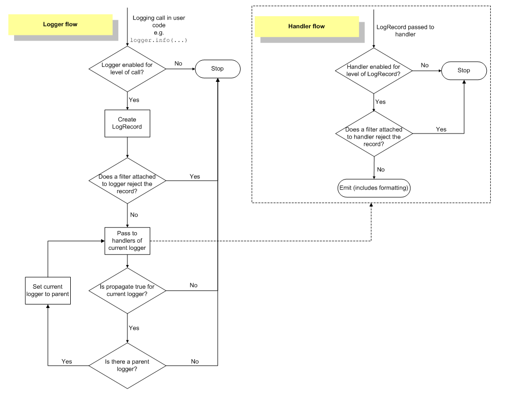

##  目录
[toc]

##  1 异常的概念
异常发生的情况：

* 程序编写问题

* 用户输入问题

* 外在因素条件

异常处理：

下面慢慢道来。

##  2 错误处理
Python内也设置了一套`try...except...finally`的错误处理机制。

###  2.1 错误处理机制
* `try...except...finally` - `try`运行可能出错的代码；执行出错时，后续代码不会执行，直接跳转错误处理代码`except`；如果有`finally`，则执行，无论是否有错误，该语句一定执行。

例如：

```python
# 文件test.py
try:
	print('try...')
	r = 10 / 0
	print('result:', r)
except ZeroDivisionError as e:
	print('except:', e)
finally:
	print('finally...')
print('END')

# 控制台
try...
except: division by zero
finally...
END
```

**补充：**

在所有的`except`后面，可以加入`else:`语句，当没有错误时会执行。

###  2.2 错误类型
Python的错误也是类，所有的错误类型都继承`BaseException`。

**详细信息：**

* `str(e)` - 返回字符串类型，只给出异常信息，不包括异常信息的类型，如1/0的异常信息

		'integer division or modulo by zero'

* `repr(e)` - 给出较全的异常信息，包括异常信息的类型，如1/0的异常信息

		"ZeroDivisionError('integer division or modulo by zero',)"

* `e.message` - 获得的信息同str(e)

**注意事项：**

* 使用`except`捕获错误时，要注意错误类型的范围，`BaseException`是最大范围的错误类型。

**补充：**

常见的错误类型和继承关系参看：

[https://docs.python.org/3/library/exceptions.html#exception-hierarchy](https://docs.python.org/3/library/exceptions.html#exception-hierarchy "Python常见的错误类型和继承关系")

### 2.3 错误分析
但如果错误没有被捕获，它就会一直往上抛，最后被Python解释器捕获，打印一个错误信息，然后结束程序。

错误信息包括函数调用链与错误类型。

来通过例子分析分析：

```python
# 文件err.py
# err.py
def foo(s):
	return 10 / int(s)
	
def bar(s):
	return fool(s) * 2
	
def main():
	bar('0')

# 控制台
Traceback (most recent call last):
  File "err.py", line 11, in <module>
	main()
  File "err.py", line 9, in main
	bar('0')
  File "err.py", line 6, in bar
	return foo(s) * 2
  File "err.py", line 3, in foo
	return 10 / int(s)
ZeroDivisionError: division by zero
```

**分析：**

* 第1行：表明以下是错误跟踪信息
* 第2~3行：调用`main()`函数出错，在代码文件`err.py`第11行
* 第4~5行：调用`bar(0)`函数出错，在代码文件`err.py`第9行
* 第6~7行：语句`return 10 / int(s)`出错，在代码文件`err.py`第3行
* 第8行：表明错误原因为`ZeroDivisionError: division by zero`

### 2.4 记录错误
综合利用Python的错误信息与捕获错误防止程序终止的想法，Python内置的`logging`模块的`exception()`方法可以非常容易地记录错误信息。

* `logging.exception(e)` - 记录错误信息，完整的打印地输出，默认到控制台，可配置到日志文件。

例如：

```python
# 文件test.py
import logging

def foo(s):
	return 10 / int(s)
	
def bar(s):
	return foo(s) * 2
	
def main():
	try:
		bar('0')
	except Exception as e:
		logging.exception(e)
		
main()
print('END')

# 控制台
ERROR:root:division by zero
Traceback (most recent call last):
  File "err_logging.py", line 13, in main
	bar('0')
  File "err_logging.py", line 9, in bar
	return foo(s) * 2
  File "err_logging.py", line 6, in foo
	return 10 / int(s)
ZeroDivisionError: division by zero
END	# 仍然执行到了最后
```

### 2.5 抛出错误
错误不是凭空产生的，而是有意创建并抛出的。Python的内置函数会抛出很多类型的错误。

**用法一**

可以为自己编写的函数抛出错误。

* 首先定义错误类，选好继承类；在合适的地方用`raise`抛出一个错误类型的实例

例如：

```python
# 文件test.py
class FooError(ValueError):
	pass
	
def foo(s):
	n = int(s)
	if n == 0:
		raise FooError('invaild value: %s' % s)
	return 10 / n

foo('0')

# 控制台
Traceback (most recent call last):
  File "err_throw.py", line 11, in <module>
	foo('0')
  File "err_throw.py", line 8, in foo
	raise FooError('invalid value: %s' % s)
__main__.FooError: invalid value: 0
```

**用法二**

可以将当前捕获的错误交给有处理能力的上级处理。

* 在`except`语句后加入不带参数的`raise`，将当前错误原样或转换类型后抛出。、

例如：

```python
def foo(s):
	n = int(s)
	if n==0:
		raise ValueError('invalid value: %s' % s)
	return 10 / n

def bar():
	try:
		foo('0')
	except ValueError as e:
		print('ValueError!')
		raise

bar()
```

## 3 调试
上联：bug年年有 下联：错法日日新 横批：日新月异

因此，需要一整套调试程序的手段来修复bug

### 3.1 打印
这是一种简单粗暴的方法。

* 直接用 `print()` 把可能有问题的变量打印出来

例如：

```python
# 文件test.py
def foo(s):
	n = int(s)
	print('>>> n = %d' % n)
	return 10 / n
	
def main():
	foo('0')
	
main()

# 控制台
>>> n = 0
Traceback (most recent call last):
  ...
ZeroDivisionError: integer division or modulo by zero
```

### 3.2 断言
凡是用`print()`辅助查看的地方，都可以用断言(assert)来替代。

* `assert 表达式, 异常自定义字符串` - 判断表达式为 `True`，否则抛出 `AssertionError`，传入字符串参数；若要统一关闭 `assert`，以参数 `-O`（大写字母O）启动。

例如：

```python
# 文件test.py
def foo(s):
	n = int(s)
	assert n != 0, 'n is zero!'
	return 10 / n
	
def main():
	foo('0')
	
main()

# 控制台
python err.py
Traceback (most recent call last):
  ...
AssertionError: n is zero!
python -O err.py
Traceback (most recent call last):
  ...
ZeroDivisionError: division by zero
```

### 3.3 logging
替换 `print()` 的另一种方式，调试的终极武器，相比 `assert`，`logging`（内置模块）不会抛出错误，而且可以输出到文件。

参考文档：[Python之日志处理（logging模块）](https://www.cnblogs.com/yyds/p/6901864.html)

#### 3.3.1 模块级日志记录

##### 3.3.3.1 配置

导包后进行配置，有三种配置方式：

* `logging.basicConfig(*args, **kwargs)` - `logging` 模块配置函数

  * `filename` - 指定 `FileHandler` 输出对象，传入文件路径

  * `filemode` - 如果指定 `filename`，设置文件打开模式
    * `w` - 写模式（会清除当前文件）
    * `a` - 追加模式（从当前文件末尾追加）
    
  * `format` - 为当前 `handler` 指定特点的字符串输出格式 `formatter`
    
    常用：
    
    * `%(asctime)s - %(filename)s[line:%(lineno)d] - %(levelname)s: %(message)s`
    
    时间：
    
    * `%(asctime)s` - 日志事件发生的时间——人类可读时间，如：`2003-07-08 16:49:45,896`
    * `%(created)f` - 日志事件发生的时间——时间戳，就是当时调用 `time.time()` 函数返回的值
    * `%(relativeCreated)d` - 日志事件发生的时间——相对于 logging 模块加载时间的相对毫秒数
    * `%(msecs)d` - 日志事件发生时间——毫秒部分
    
    内容名称：
    
    * `%(name)s` - 所使用的日志器名称，默认是 `'root'`，因为**默认使用的是 `rootLogger`**
    * `%(levelno)s` - 该日志记录的数字形式的日志级别（`10`, `20`, `30`, `40`, `50`）
    * `%(levelname)s` - 该日志记录的文字形式的日志级别（`'DEBUG'`, `'INFO'`, `'WARNING'`, `'ERROR'`, `'CRITICAL'`）
    * `%(pathname)s` - 调用日志记录函数的源码文件的全路径，即 `sys.argv[0]`
    * `%(filename)s` - `pathname` 的文件名部分，包含文件后缀
    * `%(funcName)s` - 调用日志记录函数的函数名
    * `%(lineno)d` - 调用日志记录函数的源代码所在的行号
    * `%(message)s` - 日志记录的文本内容，通过 `msg % args` 计算得到的
    
    进程线程：
    
    * `%(process)d` - 进程 ID
    
    * `%(processName)s` - 进程名称
    * `%(thread)d` - 线程 ID
    * `%(threadName)s` - 线程名称
    
  * `datefmt` - 指定 `time.strftime()` 所兼容的日期/时间格式

    * `%m` - 月份
    * `%d` - 日份
    * `%Y` - 年份
    * `%H` - 小时
    * `%M` - 分钟
    * `%S` - 秒钟

  * `style` - 如果指定 `format`，设置当前字符作为头，如 `%`（默认），`{`，`$` 等

  * `stream` - 指定 `StreamHandler` 输出对象，传入特定的 `stream`，注意此参数**与 `filename`、`handlers` 不兼容**

  * `handlers` - 如果指定，这应该是已经创建的 handler 可迭代对象，以便添加到根日志程序中，**与 `filename`、`stream` 不兼容**
    
    * 如果 handler 没有 `formatter` 集合，将会使用默认的 `formatter`，注意此参数与 `filename` 或 `stream` 不兼容
    * `StreamHandler：logging.StreamHandler`，日志输出到流，可以是 `sys.stderr`，`sys.stdout` 或者文件路径
    * `FileHandler：logging.FileHandler`，日志输出到文件
    * `BaseRotatingHandler：logging.handlers.BaseRotatingHandler`，基本的日志回滚方式
    * `RotatingHandler：logging.handlers.RotatingHandler`，日志回滚方式，支持日志文件最大数量和日志文件回滚
    * `TimeRotatingHandler：logging.handlers.TimeRotatingHandler`，日志回滚方式，在一定时间区域内回滚日志文件
    * `SocketHandler：logging.handlers.SocketHandler`，远程输出日志到 TCP/IP sockets
    * `DatagramHandler：logging.handlers.DatagramHandler`，远程输出日志到 UDP sockets
    * `SMTPHandler：logging.handlers.SMTPHandler`，远程输出日志到邮件地址
    * `SysLogHandler：logging.handlers.SysLogHandler`，日志输出到 `syslog`
    * `NTEventLogHandler：logging.handlers.NTEventLogHandler`，远程输出日志到 Windows NT/2000/XP 的事件日志
    * `MemoryHandler：logging.handlers.MemoryHandler`，日志输出到内存中的指定 buffer
    * `HTTPHandler：logging.handlers.HTTPHandler`，通过 "GET" 或者 "POST" 远程输出到 HTTP 服务器
    
  * `level` - 输出等级设置（如下，等级从低到高），**全局控制，会阻止低等级输出**
    * `logging.DEBUG`
    * `logging.INFO`
    * `logging.WARNING`
    * `logging.ERROR`
    * `logging.CRITICAL`

  【注1】`logging.basicConfig()` 只在第一次调用时有效。

  【注2】日志器（Logger）是有层级关系的，这种模块级调用所使用的日志器是 `RootLogger` 类的实例，是最顶层的日志器，以单例模式存在。

```python
# 格式
LOG_FORMAT = "%(asctime)s - %(levelname)s - %(message)s"
DATE_FORMAT = "%m/%d/%Y %H:%M:%S %p"
# 配置
logging.basicConfig(filename='my.log', level=logging.DEBUG, format=LOG_FORMAT, datefmt=DATE_FORMAT)
# 输出
logging.debug("This is a debug log.")
logging.info("This is a info log.")
logging.warning("This is a warning log.")
logging.error("This is a error log.")
logging.critical("This is a critical log.")
```

* `logging.fileConfig(filename,defaults=None,disable_existing_loggers=Ture)` - 读取配置文件，使用配置文件的方式配置 logging
* `logging.dictConfig(dict,defaults=None, disable_existing_loggers=Ture)` - 使用字典方式来配置 logging

【注】日志回滚

日志回滚的意思为：比如日志文件是 `chat.log`，当它达到指定的大小之后，`RotatingFileHandler` 自动把文件改名为 `chat.log.1`。

如果 `chat.log.1` 已经存在，会先把 `chat.log.1` 重命名为 `chat.log.2`。最后重新创建 `chat.log`，继续输出日志信息。

这样保证了 `chat.log` 里面是最新的日志。

##### 3.3.3.2 打印

`logging.等级函数(字符串)`，是等级函数，有以下（从小到大）：

* `logging.debug(*args, **kwargs)`

* `logging.info(*args, **kwargs)`

* `logging.warning(*args, **kwargs)`

* `logging.error(*args, **kwargs)`

* `logging.critical(*args, **kwargs)`

  * `*args` - 用于在日志中包含变量数据

    * 使用一个格式字符串作为这个事件的描述消息（`logging.debug`、`logging.info` 等函数的第一个参数）
    * 将变量数据作为第二个参数 `*args` 的值进行传递
    * 例如：`logging.warning('%s is %d years old.', 'Tom', 10)`

  * `**kwargs` - 支持 3 个关键字参数

    * `exc_info` - 布尔值，为 `True` 时，会将异常信息添加到日志消息中，如果没有异常信息则添加 `None`
    * `stack_info` - 布尔值，为 `True` 时，栈信息将会被添加到日志信息中
    * `extra` - 字典（`dict`）参数，用来自定义消息格式中所包含的字段，它的 `key` 不能与 logging 模块定义的字段冲突

    ```python
    LOG_FORMAT = "%(asctime)s - %(levelname)s - %(user)s[%(ip)s] - %(message)s"
    DATE_FORMAT = "%m/%d/%Y %H:%M:%S %p"
    
    logging.basicConfig(format=LOG_FORMAT, datefmt=DATE_FORMAT)
    logging.warning("Some one delete the log file.", exc_info=True, stack_info=True, extra={'user': 'Tom', 'ip':'47.98.53.222'})
    ```

#### 3.3.2 流程级日志记录

logging 还有更高级的用法，支持深入管线的自定义操作。

##### 3.3.2.1 组件及流程介绍

在使用 logging 的高级用法之前，有必要理清它的重要组件和工作流程。

logging 模块的四大组件：

| 组件名称 | 对应类名  | 功能描述                                                     |
| -------- | --------- | ------------------------------------------------------------ |
| 日志器   | Logger    | 提供了应用程序可以直使用的接口                               |
| 处理器   | Handler   | 将 logger 创建的日志记录发送到合适的目的输出                 |
| 过滤器   | Filter    | 提供更细粒度的日志过滤功能，用于决定哪些日志记录将会被输出（其它的日志记录将会被忽略） |
| 格式器   | Formatter | 用于控制日志信息的最终输出格式                               |

四大组件的相互关系：

* 日志器（logger）需要通过处理器（handler）将日志信息输出到目标位置，如：文件、`sys.stdout`、网络等
* 不同的处理器（handler）可以将日志输出到不同的位置
* 日志器（logger）可以设置多个处理器（handler）将同一条日志记录输出到不同的位置
* 每个处理器（handler）都可以设置自己的过滤器（filter）实现日志过滤，从而只保留感兴趣的日志；
* 每个处理器（handler）都可以设置自己的格式器（formatter）实现同一条日志以不同的格式输出到不同的地方。

简单来说：日志器（logger）是入口，真正干活儿的是处理器（handler），处理器（handler）还可以通过过滤器（filter）和格式器（formatter）对要输出的日志内容做过滤和格式化等处理操作。

下图描述了日志流的处理流程：



可见，一条日志信息要想被最终输出需要依次经过以下几次过滤：

- 日志器等级过滤；
- 日志器的过滤器过滤；
- 日志器的处理器等级过滤；
- 日志器的处理器的过滤器过滤；

##### 3.3.2.2 四大组件常用方法

* `logging.Logger` - 提供了应用程序可以直使用的接口

  对象配置方法：

  * `Logger.setLevel()` - 设置日志器将会处理的日志消息的最低严重级别
  * `Logger.addHandler()` - 为该 logger 对象添加一个 handler 对象
  * `Logger.removeHandler()` - 为该 logger 对象移除一个 handler 对象
  * `Logger.addFilter()` - 为该 logger 对象添加一个 filter 对象
  * `Logger.removeFilter()` - 为该 logger 对象移除一个 filter 对象

  消息发送方法：

  * `Logger.debug()`, `Logger.info()`, `Logger.warning()`, `Logger.error()`, `Logger.critical()` - 创建一个与它们的方法名对应等级的日志记录
  * `Logger.exception()` - 创建一个类似于 `Logger.error()` 的日志消息
    * 区别：`Logger.exception()` 将会输出堆栈追踪信息，`Logger.error()` 只是在一个 `exception handler` 中调用该方法
  * `Logger.log(level=)` - 需要获取一个明确的日志 `level` 参数来创建一个日志记录

  Logger 类的实例创建方式：

  * 通过 Logger 类的构造方法创建

  * `logging.getLogger(name='root')` - 创建一个 `logging.Logger` 实例，是更常用的创建方法

    * `name` - 日志器的名称标识
      * 如果 `name` 与已有的 logger 重复了，则会直接返回已有的对象（单例模式）

    【注1】logger 的名称是一个以 '`.`' 分割的层级结构，每个 '`.`' 后面的 logger 都是 '`.`' 前面的 children。

    【注2】未设定 `level` 的 child logger 与沿用 parent 的 level，并以此类推，直至 root logger（默认为 WARNING 级别）。

    【注3】child logger 在完成对日志消息的处理后，默认会将日志消息传递给与它们的祖先 loggers 相关的 handlers（因此只需指定一个顶层 handler）；可以通过将一个 logger 的 `propagate` 属性设置为 `False` 来关闭这种传递机制。

* `logging.Handler` - 将 logger 创建的日志记录发送到合适的目的输出

  对象配置方法：

  * `Handler.setLevel()` -  设置 handler 将会处理的日志消息的最低严重级别
  * `Handler.setFormatter()` - 为 handler 设置一个格式器对象
  * `Handler.addFilter()` - 为 handler 添加一个过滤器对象
  * `Handler.removeFilter()` - 为 handler 删除一个过滤器对象

  Handler 抽象类无法实例化，可以用各种子类的构造方法创建：

  * `logging.StreamHandler` - 将日志消息发送到输出到 Stream，如 `std.out`, `std.err` 或任何 `file-like` 对象
  * `logging.FileHandler` - 将日志消息发送到磁盘文件，默认情况下文件大小会无限增长
  * `logging.handlers.RotatingFileHandler` - 将日志消息发送到磁盘文件，并支持日志文件按大小切割
  * `logging.hanlders.TimedRotatingFileHandler` - 将日志消息发送到磁盘文件，并支持日志文件按时间切割
  * `logging.handlers.HTTPHandler` - 将日志消息以 GET 或 POST 的方式发送给一个 HTTP 服务器
  * `logging.handlers.SMTPHandler` - 将日志消息发送给一个指定的 email 地址
  * `logging.NullHandler` - 该 Handler 实例会忽略 error messages，通常来避免 `'No handlers could be found for logger XXX'`  信息的出现

* `logging.Formater` - 用于控制日志信息的最终输出格式

  示例创建方式：

  * `logging.Formatter.__init__(fmt=None, datefmt=None, style='%')`
    * `fmt` - 指定消息格式化字符串，如果不指定该参数则默认使用 message 的原始值
    * `datefmt` - 指定日期格式字符串，如果不指定该参数则默认使用 `"%Y-%m-%d %H:%M:%S"`
  * `style` - 头字符标识，可取值为 `'%'`（默认）, `'{'` 和 `'$'`

* `logging.Filter` - 提供更细粒度的日志过滤功能，用于决定哪些日志记录将会被输出（其它的日志记录将会被忽略）

  过滤逻辑：通过 `record` 函数判断，返回值为 `0` 表示不能通过过滤，返回值为非 `0` 表示可以通过过滤

  默认逻辑：只允许名称为 `A.B.子层` 的 children loggers 产生的日志记录通过过滤，默认 `''` 表示允许所有的日志事件通过过滤

  ```python
  class logging.Filter(name=''):
      def filter(record):
          ...
  ```

  【注1】可以在 `filter(record)` 方法内部改变该 `record`，比如添加、删除或修改一些属性。

  【注2】可以通过 `filter` 做一些统计工作，比如可以计算被一个特殊的 logger 或 handler 所处理的 `record` 数量等。

##### 3.3.2.3 开发方式

作为开发者，我们可以通过以下 3 中方式来配置 logging：

1. 使用 Python 代码显式的创建 loggers, handlers 和 formatters 并分别调用它们的配置函数；

2. 创建一个日志配置文件，然后使用`fileConfig()`函数来读取该文件的内容；

3. 创建一个包含配置信息的 `dict`，然后把它传递个`dictConfig()`函数；

具体说明请参考另一篇博文 [《python之配置日志的几种方式》](http://www.cnblogs.com/yyds/p/6885182.html)。

##### 3.3.2.4 添加上下文信息

有时候我们还想在日志输出中包含一些额外的上下文信息，有以下几种方式：

1. 通过向日志记录函数传递一个 `extra` 参数引入上下文信息

2. 使用 `LoggerAdapters` 引入上下文信息

3. 使用 Filters 引入上下文信息

具体说明请参考另一篇博文[ 《Python之向日志输出中添加上下文信息》](http://www.cnblogs.com/yyds/p/6897964.html)。

### 3.4 pdb

pdb 是Python的调试器，让程序以单步方式运行，可以随时查看运行状态。

调试模式：

* 以参数 `-m pdb` 启动
* 命令 `1` - 查看代码
* 命令 `n` - 单步执行代码
* 命令 `p 变量名` - 查看变量
* 命令 `q` - 退出程序
* 命令 `c` - 继续运行

断点设置：

* 导包 `pdb`
* `pdb.set_trace()` - 在该代码处设置断点，命令上面提到

### 3.5 IDE
直接使用一些好用的Python IDE，爽快地设置断点，单步执行。

## 4 单元测试
单元测试是用来对一个模块、一个类或者一个函数进行正确性检验的测试工作。

单元测试的意义：

如果对模块、类或者函数进行了修改，只需要再跑一遍单元测试，如果通过，说明修改不会对原有的代码产生影响，如果测试不通过，说明修改与原有行为不一致，要么修改代码，要么修改测试。

### 4.1 编写单元测试
* 导入模块`unittest` - Python自带的支持单元测试的模块
* 编写一个测试类，继承`unittest.Testcase`
* 对每一类测试，编写`test_xxx()`方法 - 以`test`开头的会被认为是测试方法而执行，没有就不会
* 使用内置的条件判断语句测试

内置的条件判断语句有：

* `self.assertEqual(x, y)` - 断言输出结果相等
* `self.assetTrue(x)` - 断言结果为真
* `with self.assertRaise(错误类型):` - 断言以下的语句若抛出错误，则为指定类型

### 4.2 运行单元测试
**方法一**

通过控制台运行，在单元测试类最后加上

```python
if __name__=='__main__'
	unittest.main()
```

**方法二**

以参数`-m unittest`启动，此法可以一次批量运行单元测试。

### 4.3 `setUp()` 与 `tearDown()`
`setUp()`与`tearDown`会分别在每调用一个测试方法的前后分别被执行。

例如：

可用于连接和关闭数据库，而不必在每个测试中重复相同的代码。

### 4.4 案例演示
```python
# 文件mydict.py
# 编写dict的子类，可以通过属性访问
class Dict(dict):
	
	def __init__(self, **kw):
		super().__init__(**kw)
		
	def __getattr__(self, key):
		try:
			return self[key]
		except KeyError:
			raise AttributeError(r"'Dict' object has no attribute '%s'" % key)
	
	def __setattr__(self, key, value):
		self[key] = value

# 文件test.py
# 编写单元测试类
import unittest

from mydict import Dict

class TestDict(unittest.TestCase):

	def test_init(self):
		d = Dict(a=1, b='test')
		self.assertEqual(d.a, 1)
		self.assertEqual(d.b, 'test')
		self.assertTrue(isinstance(d, dict))
		
	def test_key(self):
		d = Dict()
		d['key'] = 'value'
		self.assertEqual(d.key, 'value')
		
	def test_attr(self):
		d = Dict()
		d.key = 'value'
		self.assertTrue('key' in d)
		self.assertEqual(d['key'], 'value')
		
	def test_keyerror(self):
		d = Dict()
		with self.assertRaises(KeyError):
			value = d['empty']
			
	def test_attrerror(self):
		d = Dict()
		with self.assertRaises(AttributeError):
			value = d.empty

# 控制台
python -m unittest mydict_test
.....
----------------------------------------------------------------------
Ran 5 tests in 0.000s

OK
```

## 5 文档测试
### 5.1 测试模板
Python内置的	“文档测试”(`doctest`)模块可以直接提取注释中的代码并执行测试。

* 在多行字符串内添加命令行形式的交互式代码，然后使用命令行运行语法：

		if __name__=='__main__':
			import doctest
			doctest.testmod()

注意：

* `doctest`会**严格**按照Python交互式命令行的输入和输出来判断测试结果是否正确。只有测试异常的时候，才可以用`...`来表示异常中间一段因电脑而异的内容。

正常导包时`doctest`不会被执行，只有在命令行直接运行的时候，才执行`doctest`。

例如：

```python
# 文件test.py
def fact(n):
	'''
	Calculate 1*2*...*n

	>>> fact(1)
	1
	>>> fact(10)
	3628800
	>>> fact(-1)
	Traceback (most recent call last):
	...
	ValueError 
	'''
	if n < 1:
		raise ValueError()
	if n == 1:
		return 1
	return n * fact(n - 1)

if __name__ == '__main__':
	import doctest
	doctest.testmod()

# 控制台
# 此处省略许多错误信息
1 items had failures: 
   1 of   3 in __main__.fact 
***Test Failed*** 1 failures.
```

原因在于输出代码中`ValueError()`后面多了一个空格。

### 5.2 相关操作
* **`sys.argv`** - 一个从程序外部获取参数的桥梁，是一个 list
	* `sys.argv[0]` 存储输入的文件名，后面的以此类推，以空格分隔


* **`__file__`** - 用来获取模块/文件所在路径，取决于 `.py` 文件的执行方式（相对路径执行还是绝对路径执行）
	* 与`sys.argv[0]`的区别：
		* 两者代码在主执行文件时无区别
		* 两者代码在另一文件，而在当前文件执行该代码时：`__file__`返回另一文件路径，`sys.argv[0]`返回当前文件路径