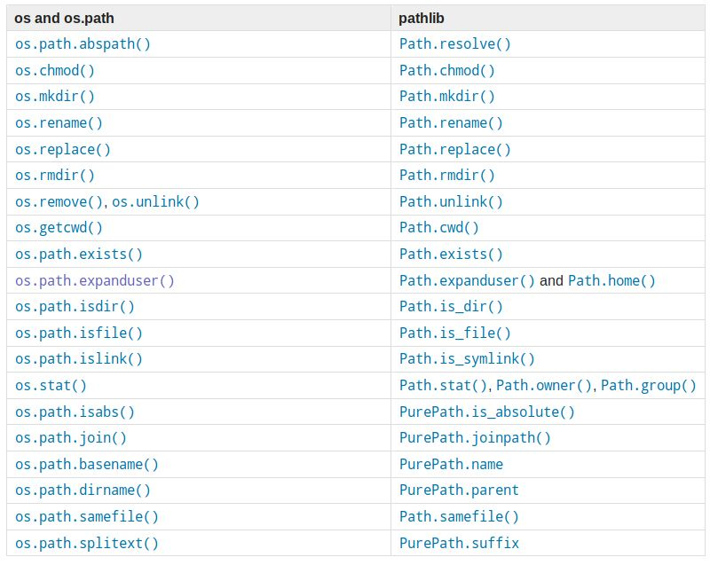
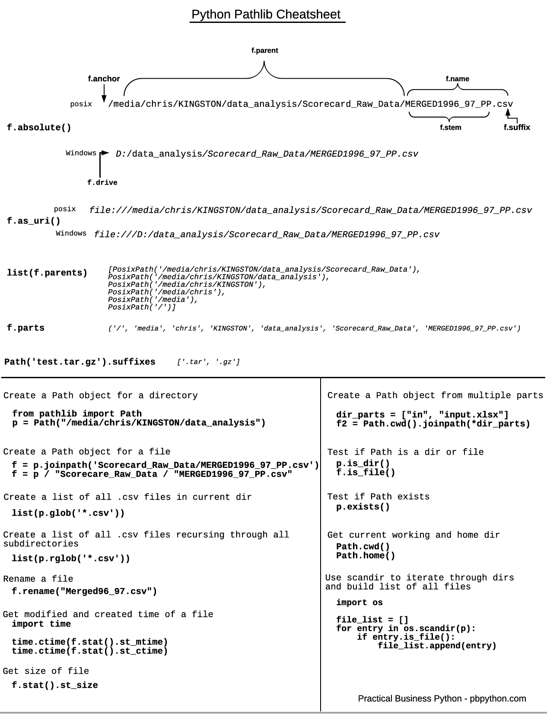

## 目录
[toc]

## 1 IO的概念
**术语**

* Stream：数据流
* Input：输入流
* Output：输出流

**问题**

CPU内存与外设速度严重不匹配

**IO类型**

同步IO：CPU等待外设运行

异步IO：CPU执行其他任务，不等待结果。需要通知模式：回调模式或轮询模式

本章的IO编程谈的都是同步IO，异步IO复杂度太高，后续涉及服务器端开发时讨论。

## 2 文件读写
Python内置了读写文件的函数，用法与C兼容。

补充知识：

在磁盘上读写文件的功能由操作系统提供，现代操作系统不允许普通程序直接操作。

### 2.1 读写文件
* `open(文件名字符串, 标示符)` - 打开指定文件，返回文件操作对象
* `read(size=全部)` - 一次读取 `size` 大小的内容，返回字符串
* `readline()` - 一次读取一行内容，返回字符串
* `readlines()` - 一次读取全部内容，按行返回 `list`
* `write(字符串)` - 写入内容，成功则返回写入字符数
* `close()` - 关闭文件输入流

**注意问题**

* 文件不存在、文件读写时，`open`、`read` 会有异常 `IOError` - 使用异常处理机制
* 文件对象会占用系统资源，系统同时打开的文件数量有限 - 必须保证正确关闭文件，使用异常处理机制
* 大文件用`read`读取会内存溢出 - 综合使用`read`、`readline` 和 `readlines`
	* 小文件 - `read`
	* 大文件 - `readline`
	* 配置文件 - `readlines`
* 异常处理机制的语法太麻烦 - Python引入`with`语句自动调用`close`

例如：

```python
# 读文件
# "try-except-finally"式
try:
	f = open('wifi.txt')
	print(f.read())
finally:
	if f:
		f.close()

# "with-as"式
with open('wifi.txt', 'r') as f:
	print(f.read())

# 写文件
# "try-except-finally"式
try:
	f = open('IOtest.txt', 'w')
	f.write('Hi, Sakura!')
finally:
	if f:
		f.close()

# "with-as"式
with open('IOtest', 'a') as f:
	f.write('\nHello, tomorrow!')
```

### 2.2 参数与编码
Python中统称含有`read`方法的对象为file-like Object。

**模式参数**

<table>
<thead>
<tr>
<th>符号</th>
<th>含义</th>
</tr>
</thead>
<tbody>
<tr>
<td>'r'</td>
<td>以只读模式打开文件（默认模式）（2.1节例）</td>
</tr>
<tr>
<td>'w'</td>
<td>以只写的方式打开文件，如果文件存在的话会先删除再重新创建（2.3节例）</td>
</tr>
<tr>
<td>'x'</td>
<td>以独占的方式打开文件，如果文件已经存在则错误</td>
</tr>
<tr>
<td>'a'</td>
<td>以写的形式打开文件，若文件已存在，则以追加的方式写入</td>
</tr>
<tr>
<td>'b'</td>
<td>二进制模式，搭配使用，如：'rb'为二进制只读，'wb'为二进制只写</td>
</tr>
<tr>
<td>'t'</td>
<td>文本模式（默认）</td>
</tr>
<tr>
<td>'+'</td>
<td>更新文件（读/写）</td>
</tr>
</tbody>
</table>

**字符编码**

* `encoding='utf-8'` - `open()`的参数，表示编码模式，默认`utf-8`
* `erros`参数 - `open()`的参数，表示编码错误是否忽略，默认不忽略而抛出异常，选`'ignore'`以忽略

例如：

```python
>>> f = open('IOtest.txt', 'rb')
>>> f.read()
b'ABCDEFGHIJKLMNOPQRSTUVWXYZ'
>>> f.close()

>>> f = open('IOtest.txt', 'r', encoding='gbk')
>>> f.read()
'Hello, world!\n你好，世界！'
>>> f.close()
```

**参考资料**

所有模式的定义及含义可以参考Python的[官方帮助文档](https://docs.python.org/3/library/functions.html#open "Python官方帮助文档")

### 2.3 经典导入方式

**1.采用标准 Python 类库导入数据**

Python 提供了一个标准类库 CSV，用来处理 CSV 文件。这个类库中的 `reader()` 函数用来读入 CSV 文件。

```python
from csv import reader
import numpy as np 
# 使用标准的Python类库导入csv数据
filename = 'pima_data.csv'
with open(filename,'rt') as raw_data:
	readers = reader(raw_data,delimiter=',')
	x = list(readers)
	data = np.array(x).astype('float')
	print(data.shape)
```

**2.采用 NumPy 导入数据**

也可以使用 Numpy 的 `loadtxt() `函数导入数据。使用这个函数处理的数据没有文件头，并且**所有的数据结构是一样的**，也就是说，数据类型是一样的。

```python
	from numpy import loadtxt
	# 使用NumPy导入csv数据
	filename = 'pima_data.csv'
	with open(filename,'rt') as raw_data:
		data = loadtxt(raw_data,delimiter=',')
		print(data.shape)
```

**3.采用 Pandas 导入数据**

通过 Pandas 来导入 csv 文件要使用 `pandas.read_csv()` 函数.这个函数的返回值是 DataFrame ,可以很方便的进行下一步处理。

```python
from pandas import read_csv
# 使用Pandas导入csv数据
filename = 'pima_data.csv'
names = ['preg','plas','pres','skin','test','mass','pedi','age','class']
data = read_csv(filename, names=names)
print(data.shape)
```

## 3 内存读写

数据读写的<u>目标</u>不一定是文件，也可以在内存中读写。

###  3.1 `StringIO`
顾名思义，`StringIO` 就是在内存中读写 `str`（文本方式）。

* `StringIO(str=None)` - 获取一个指向内存的 IO 流对象，该类在模块 `io` 内
* `getvalue()` - 获取写入的 `str`
* 其他基本操作参考 2.1 节读写文件

例如：

```python
>>> from io import StringIO
>>> f = StringIO()
>>> f.write('hello')
5
>>> f.write(' ')
1
>>> f.write('world!')
6
>>> print(f.getvalue())
hello world!
>>> f.close()

# 可以用一个 str 初始化 StringIO，然后像读文件一样读取
>>> f = StringIO('asd\nfgh\njkl')
>>> f.readline()
'asd\n'
>>> f.read()
'fgh\njkl'
>>> f.close()
```

### 3.2 `BytesIO`
顾名思义，`BytesIO` 能以二进制形式操作内存数据（二进制方式）。

* `BytesIO(bstr=None)` - 获取一个指向内存的 IO 流对象，该类在模块 `io` 内，成功则返回
* `getvalue()` - 获取写入的二进制数据
* 其他基本操作参考 2.1 节文件读写

例如：

```python
>>> from io import BytesIO
>>> f = BytesIO()
>>> f.write('中文'.encode('utf-8'))
6
>>> print(f.getvalue())
b'\xe4\xb8\xad\xe6\x96\x87'
>>> f.close()

# 可以用一个 bytes 初始化 BytesIO，然后像读文件一样读取
>>> f = BytesIO(b'\xe4\xb8\xad\xe6\x96\x87')
>>> f.read()
b'\xe4\xb8\xad\xe6\x96\x87'
>>> f.close()
```

### 3.3 `mmap`

`mmap` 是一种**内存映射文件**的方法，即将一个文件或者其它对象映射到进程的地址空间，实现文件磁盘地址和进程虚拟地址空间中的一一对应关系。

其基本概念和原理见 `Linux 基础 - 09 虚拟内存 - 9.8 内存映射`.

Python 提供封装好的 `mmap` 模块，来用于支持大文件的处理。

## 4 操作文件和目录

### 4.1 `os` 库

#### 4.1.1 操作系统
* `os.name` - 查看操作系统类型，输出为`posix`，说明系统是`Linux`，`Unix`或`Mac OS X`，如果是`nt`，说明是`Windows`系统

注意：`os`模块的某些函数与系统有关，不同类型会有一些不同的函数。

* `os.environ` - 查看操作系统的环境变量
* `os.environ.get('键')` - 获取指定的环境变量

#### 4.1.2 操作文件

**目录操作**

* `os.getcwd()` - 返回当前工作目录
* `os.mkdir(str)` - 创建一个目录
* `os.makedirs(str, mode=0o777, exist_ok=False)` - 迭代创建各级目录
  * `exist_ok` - 取值 `False` 时，会在目标文件夹存在时抛出 `FileExistsError`
* `os.rmdir(str)` - 删除一个目录
* `os.listdir(str='.')` - 显示目录下的所有内容，默认为当前目录

**文件操作**

* `os.rename(oldstr, newstr)` - 重命名文件
* `os.remove(str)` - 删除文件
* `copyfile(src, dst)` - 复制文件，在模块`shutil`中

**路径操作**

* `os.path.abspath(str='.')` - 查看目录的绝对路径，默认为当前路径

* `os.path.dirname(path)` - 返回路径名 `path` 的目录名 `directory`，常与上个结合使用

  ```python
  >>> os.path.dirname("data3/lwl/pcd/a.txt")
  'data3/lwl/pcd'
  ```

* `os.path.basename(path)` - 返回路径名 `path` 的文件名 `file_name`，与上个互补

  ```python
  >>> os.path.basename("data3/lwl/pcd/a.txt")
  'a.txt'
  ```

* `os.path.join(str1, str2, ...)` - 按系统路径形式拼接目录或文件名

* `os.path.split(str1)` - 按系统路径形式拆分最后级别的目录或文件名

* `os.path.isdir(str='.')` - 判断当前路径是否为目录，默认为当前路径

* `os.path.isfile(str='.')` - 判断当前路径是否为文件，默认为当前路径

* `os.path.splitext(str)` - 获得当前路径的文件名字和拓展名，返回一个二元组

  ```python
  >>> os.path.splitext("abc/def/g.txt")
  ('abc/def/g', '.txt')
  ```

* `os.path.getsize(str)` - 获取当前路径的文件大小

#### 4.1.3 实用技术
##### 4.1.3.1 过滤文件
使用列表生成式，添加判断条件即可，也可以用高级函数 `filter()`

例如：

```python
# 列出当前目录下的所有目录
>>> import os
>>> [x for x in os.listdir('.') if os.path.isdir(x)]
['__pycache__', '数学建模学习', '机器学习']

# 所处所有的.py文件
>>> [x for x in os.listdir('.') if os.path.isfile(x) and os.path.splitext(x)[1]
='.py']
['mydict.py', 'test.py']
```

##### 4.1.3.2 查找文件
二话不说上代码：

```python
# 文件test.py
#!/usr/bin/env python3
# -*- coding: utf-8 -*-

import os

def get_target(path, str='.'):
	# 如果路径为目录，则进行查找
	if os.path.isdir(path):
		l1 = []
		l2 = []
		for x in os.listdir(path):
			if str in x and os.path.isfile(os.path.join(path, x)):	# 如果找到文件
				l1.append(x)
			if os.path.isdir(x):
				get_target(os.path.join(path, x), str)	# 如果找到目录
		# 输出找到的文件
		for x in l1:
			print(x)

# 控制台
>>> from test import get_target
>>> get_target('C:\\Users\\hasee\\Desktop\\学习室', '.py')
abc1.py
test3.py
mydict.cpython-36.pyc
test.cpython-36.pyc
test2.cpython-36.pyc
test.py
test2.py
>>> get_target('C:\\Users\\hasee\\Desktop\\学习室', 'abc')
abc1.py
abc2.txt
```

### 4.2 `pathlib` 库

官方定义：Object-oriented filesystem paths（面向对象的文件系统路径）。

官方推荐：`pathlib` 是一个从 3 版本开始就能完全替代 `os.path` 的内置库，当然，对于字符串的低级路径操作，也可以使用该 `os.path` 模块。

参考文档：

#### 4.2.1 `os` 与 `pathlib` 比较

`pathlib` 和 `os.path` 的区别：

1. 当需要找多个层级的目录路径时，通过 `os.path` 需要嵌套写法，而 `pathlib` 可以提供链式写法，简洁明了
2. `os.path` 只用于处理路径，如果你想在获取到的路径下做一些事情（如：创建一个目录），你就需要用 `os` 模块，而 `pathlib` 可以一站式搞定

`os` 和 `pathlib` 的对应关系：



#### 4.2.2 `pathlib` 操作文件

通过上面的比较表格和下面的常用总结，能够应付大部分使用场景了。



#### 4.2.3 实用技术

##### 4.2.3.1 路径获取

- 获取当前工作目录

  ```python
  >>> import pathlib
  >>> pathlib.Path.cwd()		# 结果是一个 WindowsPath('C:\Users\me\study') 类型的对象
  C:\Users\me\study
  >>> str(pathlib.Path.cwd())	# 转化为 str 类型的对象
  C:\Users\me\study
  ```

  【注】工作目录是在哪个目录下运行你的程序，不是项目目录。

- 获取用户 home 目录

  ```python
  from pathlib import Path
  >>> Path.home()
  c:\Users\me
  ```

- 获取当前文件路径

  ```python
  >>> Path(__file__)
  demo_01.py
  ```

* 获取任意字符串路径

  ```python
  >>> Path('subdir/demo_02.py')
  subdir\demo_02.py
  >>> Path('c:d:y/rad.txt')
  c:d:y\rad.txt
  ```

  【注1】不管字符串使用的是正斜杠 `/` 还是反斜杠 `\`，在 windows 系统里，得到的路径都是反斜杠 `\`, `pathlib` 会根据操作系统智能处理。

  【注2】第二个例子中字符串会被 `/` 分割，`c:d:y` 会被当做一个目录名字，`pathlib` 不会去判断这个文件是否真的存在。

- 获取相对路径

  ```python
  >>> file.relative_to('archive')  # 需要先得到一个 Path 对象
  dmeo.txt
  ```

- 获取绝对路径

  在任意路径对象后添加方法 `.resolve()` 就能获取路径的绝对路径。

  如果填入的路径是相对路径（windows 下没有盘符，linux 没有 `/` 开头)，则会使用当前工作目录来添加路径。

  如果是已经是绝对路径，则只会根据操作系统优化表达。

  ```python
  >>> file = Path('archive/demo.txt')
  >>> file
  archive\demo.txt
  >>> file.resolve()
  C:\Users\me\study\archive\demo.txt
  ```

- 获取上级目录

  ```python
  # 获取上一级目录
  >>> file = Path('archive/demo.txt')
  >>> file.parent
  archive
  >>> file.parent.parent			# 多次获取上级目录
  .
  
  # 获取所有的上级目录
  >>> file.parents
  <WindowsPath.parents>
  >>> list(file.parents)
  [WindowsPath('archive'), WindowsPath('.')]
  >>> file.parents[0]				# 选择其中的某级，不能使用负数
  archive
  
  >>> file.resolve().parents[4]	# 建议转化成绝对路径再使用
  C:\Users
  
  ```

##### 4.2.3.2 路径操作

* 获取路径组成部分

  * `.name` - 文件名，包含后缀名，如果是目录则获取目录名
  * `.stem` - 文件名，不包含后缀
  * `.suffix` - 后缀，比如 `.txt`, `.png`
  * `.parent` - 父级目录，相当于 `cd ..`
  * `.anchor` - 锚，目录前面的部分 `C:\` 或者 `/`

  ```python
  >>> file = Path('archive/demo.txt')
  >>> file.name
  demo.txt
  >>> file.stem
  demo
  >>> file.suffix
  .txt
  >>> file.parent
  C:\Users\me\study\archive
  >>> file.anchor
  'C:\'
  ```

* 获取文件属性

  文件属性比如文件大小，创建时间，修改时间等等。

  ```python
  file = Path('archive/demo.txt')
  print(file.stat())
  print(file.stat().st_size)
  print(file.stat().st_atime)
  print(file.stat().st_ctime)
  print(file.stat().st_mtime)  # 获取毫秒级时间戳
  ```

* 路径拼接

  `pathlib` 支持用 `/` 拼接路径，熟悉魔术方法的同学应该很容易理解其中的原理。

  ```python
  >>> Path.home() / 'dir' / 'file.txt'
  C:\Users\me\dir\file.txt
  ```

  如果用不惯 `/`，也可以用类似 `os.path.join` 的方法：

  ```python
  >>> Path.home().joinpath('dir', 'file.txt')
  C:\Users\me\dir\file.txt
  ```

* 路径测试

  是否为文件

  ```python
  >>> Path("archive/demo.txt").is_file()
  True
  >>> Path("archive/demo.txt").parent.is_file()
  False
  ```

  是否为文件夹 (目录)

  ```python
  >>> Path("archive/demo.txt").is_dir()
  False
  >>> Path("archive/demo.txt").parent.is_dir()
  True
  ```

  是否存在

  ```python
  >>> Path("archive/demo.txt").exists()
  True
  >>> Path("archive/dem.txt").exists()
  False
  ```

##### 4.2.3.3 子路径扫描

* `dir_path.iterdir()` - 扫描某个目录下的所有路径（文件和子目录)， 打印的内容是处理过的绝对路径

  ```python
  >>> cwd = Path.cwd()
  >>> [path for path in cwd.iterdir() if cwd.is_dir()]
  [
      WindowsPath('C:/Users/me/study/archive'), 
      WindowsPath('C:/Users/me/study/demo_01.py'), 
      WindowsPath('C:/Users/me/study/new_archive')
  ]
  ```

  使用 `iterdir()` 可以统计目录下的不同文件类型

  ```python
  >>> path = Path.cwd()
  >>> files = [f.suffix for f in path.iterdir() if f.is_file()]
  >>> collections.Counter(files)
  Counter({'.py': 3, '.txt': 1})
  ```

* `glob` 模块的配套使用（`4.4 glob 库`）

  ```python
  >>> cwd = Path.cwd()
  >>> list(cwd.glob('*.txt'))		# 查找目录下的指定文件
  []
  >>> list(cwd.rglob('*.txt'))	# 查找目录下的指定文件（会递归子目录）
  [WindowsPath('C:/Users/me/study/archive/demo.txt')]
  
  # glob 得到的是一个生成器，可以通过 list() 转化成列表
  ```

  正则匹配检查路径

  ```python
  >>> file = Path('/archive/demo.txt')
  >>> file.match('*.txt')
  True
  ```

##### 4.2.3.4 文件操作

不管是移动文件还是删除文件，都不会给任何提示。所以在进行此类操作的时候要特别小心。

对文件进行操作最好还是用 `shutil` 模块。

- 创建文件 `path.touch()`

  ```python
  >>> file = Path('hello.txt')
  >>> file.touch(exist_ok=True)
  None
  
  >>> file.touch(exist_ok=False)
  FileExistsError: [Errno 17] File exists: 'hello.txt'
  ```

  `exist_ok` 表示当文件已经存在时，程序的反应。如果为 `True`，文件存在时，不进行任何操作。如果为 `False`, 则会报 `FileExistsError` 错误。

- 创建目录 `path.mkdir()`

  `path.mkdir()` 有个参数 `parent`，`parent=False` 功能同 `os.mkdir()`，`parent=True` 功能同 `os.mkdirs()`。

  ```python
  >>> path = Path('/dir/subdir/3dir')
  >>> path.mkdir()
  FileNotFoundError: [WinError 3] 系统找不到指定的路径。: 'dir/subdir/3dir'
  
  >>> path.mkdir(parents=True)
  None
  ```

* 删除目录 `path.rmdir()`

  删除目录非常危险，并且没有提示，一定要谨慎操作，一次只删除一级目录，且当前目录必须为空。

  ```python
  >>> path = Path('dir/subdir/3dir')
  >>> path.rmdir()
  None
  ```

* 删除文件 `path.unlink`

  同样是危险操作。

  ```python
  >>> path = Path('archive/demo.txt')
  >>> path.unlink()
  ```

- 打开文件

  使用 `open()` 函数打开文件时，一般用字符串作为参数传入，`path` 对象也支持传入：

  ```python
  file_path = Path('archive/demo.txt')
  with open(file_path) as f:
      print(f.read())
  ```

  可以直接 `path` 对象直接调用 `path.open()` 方法，但它底层也是使用内置函数 `open()`。

  ```python
  file = Path('archive/demo.txt')
  with file.open() as f:
      print(f.read())
  ```

- 封装读写

  `pathlib` 对读取和写入进行了简单的封装，不再需要重复去打开文件和管理文件的关闭。

  - `.read_text()` - 读取文本
  - `.read_bytes()` - 读取 `bytes`
  - `.write_text()` - 写入文本
  - `.write_bytes()` - 写入 `tytes`

  ```python
  >>> file_path = Path('archive/demo.txt')
  
  >>> file_path.read_text()   		# 读取文本
  'text in the demo.txt'
  >>> file_path.read_bytes()  		# 读取 bytes
  b'text in the demo.txt'
  >>> file.write_text('new words')  	# 写入文本
  9
  >>> file.write_bytes(b'new words') 	# 写入 bytes
  9
  ```

  【注】`file.write` 操作使用的是 `w` 模式，如果之前已经有文件内容，将会被覆盖。

* 移动文件

  ```python
  # 把 archive 目录下的 demo.txt 文件移动到当前工作目录，并重命名为 new_demo.txt
  txt_path = Path('archive/demo.txt')
  res = txt_path.replace('new_demo.txt')
  print(res)
  ```

  【注1】如果当前工作目录如果已经有同名文件，则里面的内容都会被覆盖。

  【注2】如果需要移动到其他目录下，则该目录必须要存在，否则会报错。

* 重命名文件

  ```python
  txt_path = Path('archive/demo.txt')
  new_file = txt_path.with_name('new.txt')
  txt_path.replace(new_file)
  ```

* 修改后缀名

  ```python
  txt_path = Path('archive/demo.txt')
  new_file = txt_path.with_suffix('.json')
  txt_path.replace(new_file)
  ```

### 4.3 `shutil` 库

`shutil` 模块提供了许多关于文件和文件集合的高级操作，特别提供了支持文件复制和删除的功能。

#### 4.3.1 文件夹与文件操作

* `copyfileobj(fsrc, fdst, length=16\*1024)`： 将 `fsrc` 文件内容复制至 `fdst` 文件，`length` 为 `fsrc` 每次读取的长度，用做缓冲区大小

  * `fsrc`： 源文件
  * `fdst`： 复制至 `fdst` 文件
  * `length`： 缓冲区大小，即 `fsrc` 每次读取的长度

  ```pyhon
  import shutil
  f1 = open("file.txt","r")
  f2 = open("file_copy.txt","a+")
  shutil.copyfileobj(f1,f2,length=1024)
  ```

* `copyfile(src, dst)`： 将 `src` 文件内容复制至 `dst` 文件

  - `src`： 源文件路径
  - `dst`： 复制至 `dst` 文件，若 `dst` 文件不存在，将会生成一个 `dst` 文件；若存在将会被覆盖
  - `follow_symlinks`：设置为 `True` 时，若 `src` 为软连接，则当成文件复制；如果设置为 `False`，复制软连接。默认为 `True`

  ```python
  import shutil
  shutil.copyfile("file.txt","file_copy.txt")
  ```

* `copymode(src, dst)`： 将 `src` 文件权限复制至 `dst` 文件。文件内容，所有者和组不受影响

  - `src`： 源文件路径
  - `dst`： 将权限复制至 `dst` 文件，`dst` 路径必须是真实的路径，并且文件必须存在，否则将会报文件找不到错误
  - `follow_symlinks`：设置为 `False` 时，`src`, `dst`皆为软连接，可以复制软连接权限，如果设置为 `True`，则当成普通文件复制权限。默认为 `True`。

  ```python
  import shutil
  shutil.copymode("file.txt","file_copy.txt")
  ```

* `copystat(src, dst)`： 将权限，上次访问时间，上次修改时间以及src的标志复制到dst。文件内容，所有者和组不受影响

  - `src`： 源文件路径
  - `dst`： 将权限复制至 `dst` 文件，`dst` 路径必须是真实的路径，并且文件必须存在，否则将会报文件找不到错误
  - `follow_symlinks`：设置为 `False` 时，`src`, `dst` 皆为软连接，可以复制软连接权限、上次访问时间，上次修改时间以及 `src` 的标志，如果设置为 `True`，则当成普通文件复制权限。默认为 `True`。

  ```python
  import shutil
  shutil.copystat("file.txt","file_copy.txt")
  ```

* `copy(src, dst)`： 将文件 `src` 复制至 `dst`。`dst` 可以是个目录，会在该目录下创建与 `src` 同名的文件，若该目录下存在同名文件，将会报错提示已经存在同名文件。权限会被一并复制。本质是先后调用了 `copyfile` 与 `copymode` 而已

  - `src`：源文件路径
  - `dst`：复制至 `dst` 文件夹或文件
  - `follow_symlinks`：设置为 `False` 时，`src`,` dst` 皆为软连接，可以复制软连接权限，如果设置为 `True`，则当成普通文件复制权限。默认为 `True`

  ```python
  improt shutil,os
  shutil.copy("file.txt","file_copy.txt")
  # 或者
  shutil.copy("file.txt",os.path.join(os.getcwd(),"copy"))
  ```

* `copy2(src, dst)`： 将文件 `src` 复制至 `dst`。`dst` 可以是个目录，会在该目录下创建与 `src` 同名的文件，若该目录下存在同名文件，将会报错提示已经存在同名文件。权限、上次访问时间、上次修改时间和 `src` 的标志会一并复制至 `dst`。本质是先后调用了 `copyfile` 与 `copystat` 方法而已

  - `src`：源文件路径
  - `dst`：复制至 `dst` 文件夹或文件
  - `follow_symlinks`：设置为 `False` 时，`src`, `dst` 皆为软连接，可以复制软连接权限、上次访问时间，上次修改时间以及 `src` 的标志，如果设置为 `True`，则当成普通文件复制权限。默认为 `True`

  ```python
  improt shutil,os
  shutil.copy2("file.txt","file_copy.txt")
  # 或者
  shutil.copy2("file.txt",os.path.join(os.getcwd(),"copy"))
  ```

* `ignore_patterns(*patterns)`： 忽略模式，用于配合 `copytree()` 方法，传递文件将会被忽略，不会被拷贝

  - `patterns`：文件名称，元组

* `copytree(src, dst, symlinks=False, ignore=None)`： 拷贝文档树，将 `src` 文件夹里的所有内容拷贝至 `dst` 文件夹

  - `src`：源文件夹
  - `dst`：复制至 `dst` 文件夹，该文件夹会自动创建，需保证此文件夹不存在，否则将报错
  - `symlinks`：是否复制软连接，True复制软连接，False不复制，软连接会被当成文件复制过来，默认 `False`
  - `ignore`：忽略模式，可传入`ignore_patterns()`
  - `copy_function`：拷贝文件的方式，可以传入一个可执行的处理函数，默认为 `copy2`
  - `ignore_dangling_symlinks`：`sysmlinks` 设置为 `False` 时，拷贝指向文件已删除的软连接时，将会报错，如果想消除这个异常，可以设置此值为 `True`。默认为 `False`。

  ```python
  import shutil,os
  folder1 = os.path.join(os.getcwd(),"aaa")
  # bbb与ccc文件夹都可以不存在,会自动创建
  folder2 = os.path.join(os.getcwd(),"bbb","ccc")
  # 将"abc.txt","bcd.txt"忽略，不复制
  shutil.copytree(folder1,folder2,ignore=shutil.ignore_patterns("abc.txt","bcd.txt")
  ```

* `rmtree(path, ignore_errors=False, onerror=None)`： 移除文档树，将文件夹目录删除

  - `ignore_errors`：是否忽略错误，默认 `False`
  - `onerror`：定义错误处理函数，需传递一个可执行的处理函数，该处理函数接收三个参数：函数、路径和 `excinfo`

  ```python
  import shutil,os
  folder1 = os.path.join(os.getcwd(),"aaa")
  shutil.rmtree(folder1)
  ```

* `move(src, dst)`： 将 `src` 移动至 `dst` 目录下。若 `dst` 目录不存在，则效果等同于 `src` 改名为 `dst`。若 `dst` 目录存在，将会把 `src` 文件夹的所有内容移动至该目录下面

  - `src`：源文件夹或文件
  - `dst`：移动至 `dst` 文件夹，或将文件改名为 `dst` 文件。如果 `src` 为文件夹，而 `dst` 为文件将会报错
  - `copy_function`：拷贝文件的方式，可以传入一个可执行的处理函数。默认为 `copy2`

  ```python
  import shutil,os
  # 示例一，将src文件夹移动至dst文件夹下面，如果bbb文件夹不存在，则变成了重命名操作
  folder1 = os.path.join(os.getcwd(),"aaa")
  folder2 = os.path.join(os.getcwd(),"bbb")
  shutil.move(folder1, folder2)
  # 示例二，将src文件移动至dst文件夹下面，如果bbb文件夹不存在，则变成了重命名操作
  file1 = os.path.join(os.getcwd(),"aaa.txt")
  folder2 = os.path.join(os.getcwd(),"bbb")
  shutil.move(file1, folder2)
  # 示例三，将src文件重命名为dst文件(dst文件存在，将会覆盖)
  file1 = os.path.join(os.getcwd(),"aaa.txt")
  file2 = os.path.join(os.getcwd(),"bbb.txt")
  shutil.move(file1, file2)
  ```

* `disk_usage(path)`： 获取当前目录所在硬盘使用情况

  - `path`：文件夹或文件路径。windows 中必须是文件夹路径，在 linux 中可以是文件路径和文件夹路径

  ```python
  import shutil.os
  path = os.path.join(os.getcwd(),"aaa")
  info = shutil.disk_usage(path)
  print(info)   # usage(total=95089164288, used=7953104896, free=87136059392)
  ```

* `chown(path, user=None, group=None)`： 修改路径指向的文件或文件夹的所有者或分组

  - `path`：路径
  - `user`：所有者，传递 `user` 的值必须是真实的，否则将报错 `no such user`
  - `group`：分组，传递 `group` 的值必须是真实的，否则将报错 `no such group`

  ```python
  import shutil,os
  path = os.path.join(os.getcwd(),"file.txt")
  shutil.chown(path,user="root",group="root")
  ```

* `which(cmd, mode=os.F_OK | os.X_OK, path=None)`： 获取给定的 `cmd` 命令的可执行文件的路径

  ```python
  import shutil
  info = shutil.which("python3")
  print(info)   # /usr/bin/python3
  ```

#### 4.3.2 归档操作

* `make_archive(base_name, format, root_dir, …)`： 生成压缩文件

  - `base_name`：压缩文件的文件名，不允许有扩展名，因为会根据压缩格式生成相应的扩展名
  - `format`：压缩格式
  - `root_dir`：将制定文件夹进行压缩

  ```python
  import shutil,os
  base_name = os.path.join(os.getcwd(),"aaa")
  format = "zip"
  root_dir = os.path.join(os.getcwd(),"aaa")
  # 将会root_dir文件夹下的内容进行压缩，生成一个aaa.zip文件
  shutil.make_archive(base_name, format, root_dir)
  ```

* `get_archive_formats()`： 获取支持的压缩文件格式。目前支持的有：tar、zip、gztar、bztar。在Python3还多支持一种格式xztar

* `unpack_archive(filename, extract_dir=None, format=None)`： 解压操作

  - `filename`：文件路径
  - `extract_dir`：解压至的文件夹路径。文件夹可以不存在，会自动生成
  - `format`：解压格式，默认为 `None`，会根据扩展名自动选择解压格式

  ```python
  import shutil,os
  zip_path = os.path.join(os.getcwd(),"aaa.zip")
  extract_dir = os.path.join(os.getcwd(),"aaa")
  shutil.unpack_archive(zip_path, extract_dir)
  ```

* `get_unpack_formats()`： 获取支持的解压文件格式。目前支持的有：tar、zip、gztar、bztar 和 xztar

### 4.4 `glob` 库

`glob` 是 Python 自带的一个操作文件的相关模块，可以查找符合特定规则的文件路径名。

该模块使用的通配符有：

| 通配符 |                             功能                             |
| :----: | :----------------------------------------------------------: |
|  `*`   |                     匹配 `0` 或多个字符                      |
|  `**`  | 匹配所有文件、目录、子目录和子目录里面的文件（3.5 版本新增） |
|  `？`  | 匹配一个字符，这里同正则表达式 `?`（正则中 `?` 表示匹配前面表达式 `0` 次或者 `1` 次） |
|  `[]`  |  匹配指定范围内的字符，如：`[1-9]`匹配 `1` 至 `9` 内的字符   |
| `[!]`  |                   匹配不在指定范围内的字符                   |

* `glob.glob(pathname)` - 返回所有匹配 `pathname` 的文件路径列表

  * `pathname, str` - 绝对路径或相对路径
  * 返回值 - `list`

  ```python
  # 匹配当前路径文件夹 tmp 下 py 文件
  for fname in glob.glob("**/*.py",recursive=True):
      print(fname)
  ```

* `glob.iglob(pathname)` - 返回与 `golb.golb` 输出值相同的迭代器（`iterator`）

  * `pathname, str` - 绝对路径或相对路径

  ```python
  # 匹配当前路径文件夹 tmp 下 py 文件
  for fname in glob.iglob("./tmp/*.py"):
      print(fname)
  ```

* `glob.excape(chars)` - 返回通配符的转移字符

  * ` chars, str` - 通配符的转移字符

  ```python
  specials = '?*['
  
  for char in specials:
      pattern = '**/*' + glob.escape(char) + '.txt'
      print('Searching for: {!r}'.format(pattern))
      for name in sorted(glob.glob(pattern,recursive=True)):
          print(name)
      print()
  ```

## 5 序列化

序列化：变量从内存中变成可存储或可传输的过程称为序列化，称为 "pickling"，"serialization"，"marshalling" 或者 "flatterning"

反序列化：将变量内容从序列化的对象重新读到内存里，称 "unpickling"

Python提供了 `pickle` 模块来实现序列化。

### 5.1 pickle
**序列化**

* 导入模块 `pickle`
* `pickle.dumps(变量名)` - 将任意对象序列化成一个 `bytes`，返回 `bytes` 类型
* `pickle.dump(变量名, 文件打开对象)` - 将对象序列化后直接写入一个 `file-like Object`

例如：

```python
>>> import pickle
>>> d = dict(name='Bob', age=20, score=88)
>>> pickle.dumps(d)
b'\x80\x03}q\x00(X\x04\x00\x00\x00nameq\x01X\x03\x00\x00\x00Bobq\x02X\x03\x00\x
0\x00ageq\x03K\x14X\x05\x00\x00\x00scoreq\x04KXu.'
>>> f = open('dump.txt', 'wb')
>>> pickle.dump(d,f)
>>> f.close()
>>> exit()
```

**反序列化**

* 导入模块 `pickle`
* `pickle.loads(变量名)` - 将 `bytes` 反序列化为对象
* `pickle.load(文件打开对象)` - 从一个 `file-like Object` 中直接反序列化出对象

例如：

```python
>>> import pickle
>>> f = open('dump.txt', 'rb')
>>> d = pickle.load(f)
>>> f.close()
>>> d
{'name': 'Bob', 'age': 20, 'score': 88}
```

注意：

* 编程语言序列化（`Pickle`）的问题 - 只能用于特定的语言如 Python，且不同版本的 Python 可能彼此不兼容。
* 只能用 `Pickle` 保存那些不重要的数据。

### 5.2 json
若要在不同的编程语言之间传递对象，就必须把对象序列化为标准格式，如 json，json 编码是 UTF-8，与 Python 相同。

**json 描述**

json 与 Python 内置的数据对应如下：

	json类型						Python类型
	
	{}							dict
	[]							list
	"string"					str
	1234.56						int或float
	true/false					True/False
	null						None

**json 序列化**

* 导入模块 `json`
* `json.dump(obj, fp, ...)` - 将对象序列化为 json 后直接写入一个 `file-like Object`
  * `obj` - 序列化对象
  * `fp` - `file open` 对象
  * `skipkeys` - 默认 `False`，`True` 时非基础类型（`str`, `int`, `float`, `bool`, `None`）的 key 会被忽略
  * `ensure_ascii` - `True` 时所有字符都显示为 ascii 格式，`False` 时支持字符显示
  * `allow_nan` - 默认 `False`，在 `float` 超出范围（`nan`, `inf`, `-inf`）时异常
  * `cls` - 
  * `indent` - 默认 `None`，缩进空格数
  * `separators` - 设置分隔符，格式为 `(item_separator, key_separator)`，默认 `None` 表示 `(', ', ': ')`
  * `default` - 默认 `None`，给定时将用此函数进行对象的序列化，返回 JSON encodable 对象或 `TypeError`
  * `sort_keys` - 默认 `False`，是否排序关键字

* `json.dump(obj, ...)` - 将任意对象 json 序列化为字符串
  * 参数同 `json.dump`


例如：

```python
# 序列化基础类
>>> import json
>>> d = dict(name='Bob', age=20, score=88)
>>> json.dumps(d)
'{"name": "Bob", "age": 20, "score": 88}'

# 序列化自定义类
class Man(object):
    def __init__(self):
        self.name = name
        self.age = age
m = Man('tom', 18)
json.dumps(m, default=lambda obj: obj.__dict__, sort_keys=True, indent=4)
```

**json 反序列化**

* 导入模块`json`
* `json.loads(变量名)` - 将一个 json 字符串反序列化为 Python 对象
* `json.load(文件打开对象)` - 从一个 `file-like Object` 中直接 json 反序列化出对象

例如：

```python
>>> json_str = '{"age": 20, "score": 88, "name": "Bob"}'
>>> json.loads(json_str)
{'age': 20, 'score': 88, 'name': 'Bob'}
```

**json 进阶**

json 无法直接序列化或反序列化一个对象，需要定制 `dump(s)` 的 `default` 函数参数以及 `load(s)` 的 `object_hook` 函数参数，为此可以添加对象<——>基本json数据的转换函数。

例如：

```python
def student2dict(std):
	return {
		'name': std.name,
		'age': std.age,
		'score': std.score
	}
>>> print(json.dumps(s, default=student2dict))
{"age": 20, "name": "Bob", "score": 88}

def dict2student(d):
	return Student(d['name'], d['age'], d['score'])
>>> json_str = '{"age": 20, "score": 88, "name": "Bob"}'
>>> print(json.loads(json_str, object_hook=dict2student))
<__main__.Student object at 0x10cd3c190>
```

技巧：

活用所有类都基本存在的属性`__dict__`，即

```python
print(json.dumps(s, default=lambda obj: obj.__dict__))
```

### 5.3 msgpack

`msgpack` 用起来像 `json`，但是却更快，并且序列化以后的数据长度更小，在时间和空间上都优于 `json`，同样也支持多种语言。

另外，`msgpack-numpy` 模块提供了对 NumPy 数值和数组类型的 msgpack 操作。

**安装**

```shell
pip install msgpack
pip install msgpack-numpy
```

**msgpack 序列化**

* 导入模块 `msgpack`
* `msgpack.dumps(变量名)` - 将任意对象 `msgpack` 序列化为字符串
* `msgpack.dump(变量名, 文件打开对象)` - 将对象 `msgpack` 序列化后直接写入一个 `file-like Object`

```python
import msgpack
var = {'a': 'this',
       'b': 'is',
       'c': 'a test'
}
with open('data.txt', 'wb') as f1:
    msgpack.dump(var, f1)  # 存储数据
```

**msgpack 反序列化**

* 导入模块 `msgpack`
* `msgpack.loads(变量名)` - 将一个 msgpack 字符串反序列化为 Python 对象
* `msgpack.load(文件打开对象)` - 从一个`file-like Object`中直接 msgpack 反序列化出对象

```python
import msgpack
with open('data.txt', 'rb') as f2:
    var = msgpack.load(f2, use_list=False, encoding='utf-8')  # 读取数据
print(var)
>> {'a': 'this', 'b': 'is', 'c': 'a test'}
```

**支持 msgpack-numpy**

最简单的方法是导入 msgpack 后调用其 monkey patching 函数，这将自动强制所有 msgpack 序列化和反序列化例程（以及使用它们的其他包）兼容 numpy。

```python
import msgpack
import msgpack_numpy as m
m.patch()
```

还可以手动将 msgpack numpy 提供的编码器和解码器传递给 msgpack 例程：

```python
import msgpack
import msgpack_numpy as m
import numpy as np

x = np.random.rand(5)
x_enc = msgpack.packb(x, default=m.encode)
x_rec = msgpack.unpackb(x_enc, object_hook=m.decode)
```

【注】如果 msgpack 不是用 Cython 编译的（或者如果设置了 `MSGPACK_PUREPYTHON` 变量），它将使用较慢的纯 Python msgpack 实现。

### 5.4 yaml

`yaml` 是一个专门用来写配置文件的语言。

#### 5.4.1 yaml 基础

**安装**

```shell
pip install pyyaml
```

**`yaml` 语法**

- 区分大小写
- 使用缩进表示层级关系
- 使用空格键缩进，而<u>非 `tab` 键缩进</u>
- 缩进的空格数目不固定，只需要相同层级的元素左侧对齐
- 文件中的字符串不需要使用引号标注，但若字符串包含有特殊字符则需用引号标注
- 注释标识为 `#`

**`yaml` 数据结构**

- 对象：键值对的集合
  - 简称 "映射或字典"
  - 键值对用冒号 `:` 结构表示，冒号与值之间需用空格分隔
  
  ```yaml
  user: admin
  pwd: 123
  # python 解析：{'user': 'admin', 'pwd': 123}
  # 解析结果为字典
  ```
  
- 数组：一组按序排列的值
  - 简称 "序列或列表"
  - 数组前加有 `-` 符号，符号与值之间需用空格分隔
  
  ```yaml
  - admin1
  - 111111
  - 灰蓝
  # python 解析：['admin1',
  #              111111, 
  #              '灰蓝']
  # 解析结果为列表
  ```
  
- 复合结构
  
  ```python
  - name: 灰蓝
    age: 0
    job: Tester
  - name: James
    age: 30
  # python 解析：[{'name': '灰蓝', 'age': 0, 'job': 'Tester'}, {'name': 'James', 'age': 30}]
  # 解析结果是个 list，里面包含 dict
  ```

**yaml 数据类型**

字符串

```yaml
str: "Hello World!"
```

整型

```yaml
int: 110
```

浮点型

```yaml
float: 3.141
```

布尔型

```yaml
boolean: true  						# or false
```

null

```yaml
None: null  						# 也可以用 ~ 号来表示 null
```

时间

```yaml
time: 2016-09-22t11:43:30.20+08:00  # ISO8601，写法百度
```

日期

```yaml
date: 2016-09-22 	 				# 同样 ISO8601
```

【注1】如果字符串没有空格或特殊字符，不需要加引号，否则需要。

【注2】单引号和双引号有区别：

* 单引号中的特殊字符转到 Python 会被转义
* 双引号中的特殊字符不会被 Python 转义

```yaml
str1: 'Hello\nWorld'
str2: "Hello\nWorld"
# python 解析：{'str1': 'Hello\\nWorld', 'str2': 'Hello\nWorld'}
```

【注3】强制类型转换：通过 `!!` 实现

```yaml
str: !!str 3.14
int: !!int "123"

# python 解析：{'int': 123, 'str': '3.14'}
```

**yaml 特殊格式**

* 引用：`&` 和 `*` 符号的作用是引用

  ```yaml
  name: &name 灰蓝
  tester: *name
  
  # 等价于
  
  name: 灰蓝
  tester: 灰蓝
  ```

* 分段：在同一个 yaml 文件中，可以用 `-` 来分段（一个段称为一个 yaml 文档），将多个文档写在一个文件中

  ```yaml
  ---
  name: James
  age: 20
  ---
  name: Lily
  age: 19
  ```

#### 5.4.2 yaml 读写

**`yaml` 序列化**

* 导入模块 `yaml`

* `yaml.dump(py_object, dest)` - 将一个 Python 对象导出到 yaml 文档

  * `py_object` - Python 对象
  * `dest` - 目标对象，可以是，如果没有指定此参数，则函数直接返回 `yaml` 文档
    * `open binary file object`
    * `open text file object`

  ```python
  import yaml
  def generate_yaml_doc(yaml_file):
      py_object = {'school': 'zhang',
                   'students': ['a', 'b']}
      file = open(yaml_file, 'w', encoding='utf-8')		# 'w' 表示覆盖，换 'a' 表示追加
      yaml.dump(py_object, file)
      file.close()
  
  current_path = os.path.abspath(".")						# 获取当前路径
  yaml_path = os.path.join(current_path, "generate.yaml")	# 制作 yaml 文件路径
  generate_yaml_doc(yaml_path)
  ```

* `yaml.dump_all(list/generator, dest)` - 将多个段输出到一个文件中

  * `list/generator` - Python 对象的 `list` 或 `generator`
  * `dest` - 目标对象，可以是，如果没有指定此参数，则函数直接返回 `yaml` 文档
    * `open binary file object`
    * `open text file object`
  
  ```python
  import yaml
  
  obj1 = {"name": "James", "age": 20}
  obj2 = ["Lily", 19]
  
  with open(r'E:\AutomaticTest\Test_Framework\config\config.yml', 'w') as f:
      yaml.dump_all([obj1, obj2], f)
  ```

**`yaml` 反序列化**

* 导入模块 `yaml`

* `yaml.load(source)` - 读取一个 yaml 文档为 Python 对象

  * `source` - 源对象，可以是
    * `byte string`
    * `Unicode string`
    * `open binary file object`
    * `open text file object`

  ```python
  import yaml
  def get_yaml_data(yaml_file):
      file = open(yaml_file, 'r', encoding="utf-8")		# 打开 yaml 文件
      file_data = file.read()								# 读取文件数据
      file.close()										# 关闭 yaml 文件
      data = yaml.load(file_data)							# 解析文件数据为 yaml
      return data
  
  current_path = os.path.abspath(".")						# 获取当前路径
  yaml_path = os.path.join(current_path, "config.yaml")	# 制作 yaml 文件路径
  get_yaml_data(yaml_path)
  ```

  【注】`yaml.load` 并不安全，跟 `pickle.load` 类似，它可能会出现 “代码注入” 问题。

* `yaml.load_all(source)` - 读取多个 yaml 文档，返回一个迭代器

  * `source` - 源对象，可以是
    * `byte string`
    * `Unicode string`
    * `open binary file object`
    * `open text file object`
  
  ```python
  import yaml
  
  f = '''
  ---
  name: James
  age: 20
  ---
  name: Lily
  age: 19
  '''
  
  y = yaml.load_all(f)
  for data in y:
      print(data)
  ```
  
  【注】`yaml.load_all` 并不安全，跟 `pickle.load` 类似，它可能会出现 “代码注入” 问题。

* `yaml.safe_load(stream)` - `yaml.load` 的安全版本，只能读取流，并且只支持标准的 `YAML` 标签而不能构造任意的 Python 对象
* `yaml.safe_load_all(stream)` - `yaml.load_all` 的安全版本，只能读取流，并且只支持标准的 `YAML` 标签而不能构造任意的 Python 对象

## 6 压缩文件

### 6.1 `zip`文件

#### 6.1.1 常用方法

`zip`一种常见的压缩文件格式，Python中的**模块 `zipfile` **可以对这种文件进行处理。

以下工具均在模块 `zipfile` 内，`z` 是指 `zipfile.ZipFile` 对象。

* `is_zipfile(filename)` - 测试filename的文件，看它是否是个有效的归档文件
* `ZipFile(file, mode='r', compression=ZIP_STORED, allowZip64=True, compresslevel=None, *, strict_timestamps=True)`
  * 创建一个`zipfile`对象（后面用`z.xxx`表示该对象的成员）
  * `file` - 文件路径
  * `mode` - 文件模式，r只读、w重写、a添加
  * `compression` - 压缩方法，应为`ZIP_STORED`，`ZIP_DEFLATED`，`ZIP_BZIP2`或`ZIP_LZMA`
  * `allowZip64` - `True`时表示可以创建大于2GB的zip文件
  * `compresslevel` - 将文件写入归档时要使用的压缩等级
    * 当使用`ZIP_STORED`或`ZIP_LZMA`时无压缩效果
    *  当使用`ZIP_DEFLATED`时接受整数0至9
    * 当使用`ZIP_BZIP2`时接受整数1至9
  * `strict_timestamps` - `False`时允许压缩早于`1980-01-01`的文件和晚于`2107-12-31`的文件，时间会设为这两个上/下限
* `z.testzip()` - 读取归档中的所有文件并检查它们的CRC和文件头。 返回第一个已损坏文件的名称，在其他情况下则返回`None`
* `z.getinfo(name)` - 返回一个`ZipInfo`对象，其中包含有关zip成员`name`的信息
  * `name` - zip成员名字
* `z.infolist()` - 返回一个列表，其中包含每个归档成员的`ZipInfo`对象
* `z.namelist()` - 返回按名称排序的zip成员列表
* `z.printdir()` - 打印归档的目录表
* `z.open(name, mode='r', pwd=None, *, force_zip64=False)` - 以二进制文件类对象的形式访问一个归档成员，用来`read`，`readline`，`write`

  * `name` - zip成员名字
  * `mode` - 文件模式，r只读、w重写、a添加

  * `force_zip64` - 当写入一个文件时，如果文件大小不能预先确定但是可能超过 2GB，设置为`True`
* `z.close()` - 关闭文件，结束时必须要有
* `z.extract(member, path=None, pwd=None)` - 从归档中提取出一个成员放入工作目录
  * `member` - 成员的完整名称或`ZipInfo`对象
  * `path` - 要提取到的目标目录，默认`None`为当前目录
  * `pwd` -  压缩包密码
* `z.extractall(path=None, members=None, pwd=None)` - 从归档中提取出所有成员放入工作目录

  * `path` - 要提取到的目标目录，默认`None`为当前目录
  * `members` - 可选项且必须为`z.namelist()`所返回列表的一个子集
  * `pwd` -  压缩包密码
* `z.read(name, pwd=None)` - 返回归档中文件成员的字节数据

  * `name` - 归档文件成员的名字
  * `pwd` - 压缩包密码
* `z.write(filename, arcname=None, compress_type=None, compresslevel=None)` - 将文件写入归档

  * `filename` - 要写入文件的路径
  * `arcname` - 写入文件在归档中的名字，默认`None`表示与`filename`同名
  * `compress_type` - 压缩方法，如果给出，将覆盖创建`ZipFile`对象时的`compression`设置值
  * `compresslevel` - 将文件写入归档时要使用的压缩等级，同会覆盖创建`ZipFile`对象时给出的设置值
* `z.setpassword(pwd)` - 设置密码
* `z.filename` - 归档文件名
* `z.comment` - 关联到ZIP文件的bytes对象形式的说

#### 6.1.2 读取文件

```python
import zipfile

# 列出压缩包文件
with zipfile.ZipFile('KaggleCredit2.csv.zip','r') as zf:
    # f 内容是 gbk 误解码为 cp437，因此先编码回去 cp437 恢复 gbk，然后再重新解码 gbk
    files = [f.encode('cp437').decode('gbk') for f in zf.namelist()]
    for f in files:
        print(f)  
    
# 读取表格
with zipfile.ZipFile('KaggleCredit2.csv.zip','r') as zf:
    f = zf.open('KaggleCredit2.csv'.encode('cp437').decode('gbk'))
    data = pd.read_csv(f,index_col = 0, encoding='gbk')
    data.head()

# 读取图像
# [f.encode('cp437').decode('gbk') for f in zf.namelist()]  # 文件列表
data_path = "E:/WorkSpace/data/Signature"  # 读取文件
with zipfile.ZipFile(os.path.join(data_path,"img.zip")) as zf:  # 打开压缩文件
    f = zf.open('img/b云.bmp'.encode('gbk').decode('cp437'))  # 要注意编码
    img = mpimg.imread(f)
    plt.imshow(img)
    plt.axis('off')
    plt.show()
```

【注】`zipfile` 模块会将压缩文件中的所有文件名用 `CP437` （又称 `DOS Latin`） 来编码，因此要自己动手处理。

```python
from pathlib import Path
import zipfile

# 正常解压文件，然后使用正确的文件名重命名解压的文件
with zipfile.ZipFile('文件.zip', 'r') as f:
    for fn in f.namelist():
        extracted_path = Path(f.extract(fn))
        extracted_path.rename(fn.encode('cp437').decode('gbk')) # 先编码 cp437，然后解码 gbk
```

**【注】**编码（encode）含义是将指定类型数据编码为二进制数据，解码（decode）含义是将二进制数据解码为指定类型数据。

#### 6.1.3 解压文件

```python
import zipfile

exampleZip = zipfile.ZipFile('/content/drive/MyDrive/detection_coco.zip')
exampleZip.extractall('/content/drive/MyDrive/data/')             			# 会被解压到输入的路径中
exampleZip.close()
```


### 6.2 `lz4` 文件

LZ4 是 Yann Collet 在2011年发明的压缩算法，它虽然没有 middle out 那么牛逼得无死角，但在能保证一定压缩率的情况下，它以它无敌的压缩速度和更快的解压速度著称。

Python 中安装模块 `lz4` 即可使用，详细教程参考 [lz4 docs](https://python-lz4.readthedocs.io/en/latest/index.html)，算法原理解析参考 [LZ4最快压缩算法解释](https://www.cnblogs.com/z-blog/p/8860799.html)。

#### 6.2.1 常用方法

#### 6.2.2 简单使用

建议使用的绑定是 LZ4 帧格式绑定（frame format binding），它提供了与其他实现和语言绑定的互操作性。

使用 frame format binding 的最简单方式是通过 `compress()` 和 `decompress()` 函数。

```python
>>> import os
>>> import lz4.frame
>>> input_data = 20 * 128 * os.urandom(1024)  # Read 20 * 128kb
>>> compressed = lz4.frame.compress(input_data)
>>> decompressed = lz4.frame.decompress(compressed)
>>> decompressed == input_data
True
```

`compress()` 函数的作用：读取并压缩输入数据，然后返回 LZ4 帧。帧由一个报头、一系列压缩数据块和一个帧结束标记（以及可选的未压缩数据校验和）组成。

`decompress()` 函数的作用：获取一个完整的 LZ4 帧，对其进行解压缩（并根据存储的校验和验证未压缩的数据），然后返回未压缩的数据。
