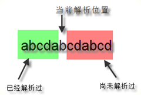

## 1 基本语法

### 1.1 基本概念

正则表达式中有<u>前瞻（Look ahead）</u>和<u>后顾（Look behind）</u>的概念，如下图所示，前瞻是用模式匹配尚未解析过的内容，后顾是用模式匹配已经解析过的内容。



在前瞻和后顾的过程中，判断是否匹配又分为<u>肯定式匹配</u>和<u>否定式匹配</u>两种。

### 1.2 基本语法

**A: 匹配单个字符**

| 模式         | 说明                                         |
| ------------ | -------------------------------------------- |
| `.`          | 匹配任意字符（除了 `\n`）                    |
| `[xyz]`      | 匹配字符集中的任意一个字符                   |
| `[^xyz]`     | 匹配字符集中的非任意一个字符                 |
| `\d` 与 `\D` | 匹配数字集 与 匹配非数字集                   |
| `\s` 与 `\S` | 匹配空白集 与 非空白字符集                   |
| `\w` 与 `\W` | 匹配单词字符集 `[a-zA-Z0-9]` 与 非单词字符集 |

注意：转义字符，用 `\[` 和 `\]` 等表示，或使用 `r''` 字符串就不用考虑匹配问题。

**B: 匹配多个字符**

| 模式          | 说明                                                         |
| ------------- | ------------------------------------------------------------ |
| `{m}`         | 匹配前一个字符 m 次<br/>例如，`o{2}` 不能匹配 `"Bob"` 中的 `'o'`，但是能匹配 `"food"` 中的两个。 |
| `{m,}`        | 匹配前一个字符<br/>例如，`o{2,}` 不能匹配 `"Bob"` 中的 `'o'`，但能匹配 `"foooood"` 中的所有 `'o'`。 |
| `{m,n}`       | 匹配前一个字符 m 到 n 次<br/>例如，`o{1,3}` 将匹配 `"fooooood"` 中的前三个 `'o'`。 |
| `*`           | 匹配前一个字符 0 次至多次，`*` 等价于 `{0,}`<br/>例如，`zo*` 能匹配 `"z"` 以及 `"zoo"`。 |
| `+`           | 匹配前一个字符 1 次至多次，`+` 等价于 `{1,}`<br/>例如，`zo+` 能匹配 `"zo"` 以及 `"zoo"`，但不能匹配 `"z"`。 |
| `?`           | 匹配前一个字符 `0` 次或者 `1` 次，`?` 等价于 `{0,1}`<br/>例如，`do(es)?` 可以匹配 `"do"` 或 `"does"` 中的 `"do" `。 |
| `?`           | 其搭配在上面的模式得到 `*?`  `+?`  `??`  ` {m}?`  ` {m,}?`  `{m,n}?`，表示匹配模式是非贪婪的。非贪婪模式尽可能少的匹配所搜索的字符串，而默认的贪婪模式则尽可能多的匹配所搜索的字符串。<br/>例如，对于字符串 `"oooo"`，`o+?` 将匹配单个 `'o'`，而 `o+` 将匹配所有 `'o'`。 |
| `(pattern)`   | 匹配 pattern 并存储匹配结果供以后使用。                      |
| `(?:pattern)` | 匹配 pattern 但不存匹配结果供以后使用。这在使用 `|` 来组合一个模式的各个部分是很有用。<br/>例如，`industr(?:y|ies)` 就是一个比 `'industry|industries'` 更简略的表达式。 |

**C 零宽断言**

| 模式          | 说明                                                         |
| ------------- | ------------------------------------------------------------ |
| `(?=pattern)` | 肯定式前瞻 / 正向预查，前面匹配完成后继续预查能否匹配 pattern，但不获取 pattern 的结果。<br/>例如，`Windows (?=95|98|NT|2000)` 能匹配 `"Windows 2000"` 中的 `"Windows"`，但不能匹配 `"Windows 3.1"` 中的 `"Windows"`。 |
| `(?!pattern)` | 否定式前瞻 / 负向预查，前面匹配完成后继续预查能否不匹配 pattern，但不获取 pattern 的结果。<br/>例如，`Windows (?!95|98|NT|2000)` 能匹配 `"Windows 3.1"` 中的 `"Windows"`，但不能匹配 `"Windows 2000"` 中的 `"Windows"`。 |
| (?<=pattern)  | 肯定式后顾，左箭头 `<` 就说明预查方向是从右往左<br/>例如，`(?<=[\d].) Windows` 能匹配 `"11 Windows"` 中的 `"Windows"`，但不能匹配 `"no Windows"` 中的 `"Windows"`。 |
| (?<!pattern)  | 否定式后顾，左箭头 `<` 就说明预查方向是从右往左<br/>例如，`(?<![\d].) Windows` 能匹配 `"no Windows"` 中的 `"Windows"`，但不能匹配 `"11 Windows"` 中的 `"Windows"`。 |

【悟】预查可以理解为一种不获取内容的判断，因此学术上也叫 “零宽断言”。

【注】预查不消耗字符，即在一个匹配发生后，立即开始下一次匹配的搜索，而不是从包含预查的字符之后开始。

```
>> windows (?=2000|2003|xp) pro
>> windows (?=2000|2003|xp)(?:2000|2003|xp) pro

解析字符串 windows 2003 pro 时，结果依次为：

>> 无
>> windows 2003 pro

原因是前瞻不消耗字符（用游标理解相当于游标还在2003前的空格处），故第一个正则表达式在解析匹配了 windows (?=2000|2003|xp)部分后，未解析的字符串还有 2003 pro ,但后面的正则为 出现 " pro"，明显不符合匹配。
而第二个正则在后面使用非捕获捕获匹配，解析了 2003 ，再解析 " pro"，故成功匹配。
```

**D 边界匹配**

| 模式         | 说明                                                         |
| ------------ | ------------------------------------------------------------ |
| `^`          | 匹配字符串开头                                               |
| `$`          | 匹配字符串结尾                                               |
| `\b` 与 `\B` | 匹配单词边界 与 非单词边界<br/>例如，`er\b` 可以匹配 `"never"` 中的 `'er'`，但不能匹配 `"verb"` 中的 `'er'`；<br/>例如，`er\B` 可以匹配 `"verb"` 中的 `'er'`，但不能匹配 `"never"` 中的 `'er'`。 |
| `\A` 与 `\Z` | 指定的字符串必须出现在开头或结尾                             |

【注】如果设置了 `Multiline` 属性，`^` 也匹配 `'\n'` 或 `'\r'` 之后的位置，`$` 也匹配 `'\n'` 或 `'\r'` 之前的位置。

**E: 分组匹配**

| 模式         | 说明                                                         |
| ------------ | ------------------------------------------------------------ |
| `a|b`        | 匹配左右任意一个表达式<br/>例如 `z|food` 能匹配 `"z"` 或 `"food"`，`(z|f)ood` 则匹配 `"zood"` 或 `"food"`。 |
| `(ab)`       | 括号中表达式作为一个分组，并且里面匹配结果将会被缓存，组序号从 1 递增 |
| `\number`    | 引用编号为 `number` 的分组匹配到的字符串（自动编号，Python 中 `\` 要转义）<br/>注：支持后向引用，例如 `(a)(b)(ac).* \1\3\3` 相当于 `(a)(b)(ac).* (a)(ac)(ac)`。 |
| `(?P<name>)` | 给分组起个别名                                               |
| `(?P=name)`  | 引用别名为 `name` 的分组匹配到的字符                         |

**F: 补充**

* 非贪婪模式：只匹配 pattern 能匹配到的最少字符，便不再往后匹配
* 意义：如果一个表达式中有多个未知匹配次数的表达式，应防止进行不必要的尝试匹配
* 正则语法对其他高级语言通用
* 以上出现的 `^`, `$`, `.`, `[`, `]`, `*`,  `?`, `+`, `{`, `}`, `|`, `(`, `)`, `\` 为正则表达式特殊字符，需转义

### 1.3 典例总结

#### 1.3.1 匹配不包含特定字符串的条目

模式：`^(?!.*?robots).*$`

要点：

* 开头的 `.*` 一定放到括号里面，不然如 `^.*?(?!robots\.txt).*?$` 会非贪婪地配出空，后面的否定式也成立，导致没有内容
* 尾部的 `.*` 一定放到括号外面，不然如 `^.*?(?!robots\.txt.*?)$` 会非贪婪地匹配任何内容，再搭配否定式变成不匹配了

## 2 re 模块
**re 模块函数介绍：**

* **`compile(pattern, flags=0)`** - 编译一个正则模式，返回模式对象 `pattern`

* **`match(pattern, string, flags=0)`** - 判断是否匹配，成功则返回匹配对象 `match`，失败则返回 `None` 对象

  ```python
  line='Cats are smarter than dogs'
  
  matchObj=re.match(r'dogs',line,re.M|re.I)
  if matchObj:
      print('use match,the match string is:',matchObj.group())
  else:
      print('No match string!!')
      
  >> No match string!!
  ```

  【注】`re.match` 只从待匹配的字符串开头开始匹配，如果匹配的字符串不在开头，而是在中间或结尾，则无法匹配！

* **`search(pattern, string, flag=0)`** - 扫描查找匹配的第一个位置，并返回一个相应的匹配对象，失败则返回一个 `None`

  ```python
  line='Cats are smarter than dogs'
  
  matchObj=re.search(r'dogs',line,re.M|re.I)
  if matchObj:
      print('use search,the match string is:',matchObj.group())
  else:
      print('No search match string!!')
      
  >> use search,the match string is: dogs
  ```

  【注】`re.search` 会扫描整个字符串查找匹配，并返回第一个成功的匹配。

* **`findall(pattern, string. flag=0)`** - 找到匹配，返回所有匹配部分的列表

* **`sub(pattern, repl, string, count=0, flags=0)`** - 将字符串中匹配正则表达式的部分替换为其他值，返回字符串

* **`split(pattern, string, maxsplit=0, flags=0)`** - 根据匹配分割字符串，返回分割字符串组成的列表

  【技】在 `string` 最外层加入 `()` 可以保留分隔符。

* **`group(number=0)`** - `match`对象的方法，返回匹配的字符串分组，默认0为原始字符串

* **`groups()`** - `match`对象的方法，返回匹配的元组

* **`span()`** - `match`对象的方法，返回匹配字符串或元组的位置

* **`string()`** - `mathc`对象的方法，返回要匹配的字符串

**匹配方法：**

单次匹配

```python
re.match(pattern, string, flags=0)	# 只适用于匹配一次的情况
```

多次匹配

```python
pa = re.compile(r'...')		# compile定义正则表达式，得到pattern对象
ma = pa.match('...')		# match匹配字符串，得到match对象
ma.groups()
...
```

**案例演示：**

```python
# 文件test.py
import re

def name_of_email(addr):
    ma = re.match(r'^(\W*)([\w\.\s]+)(\W*)([\w\s]*)@\w+\.\w+$',addr)
    print(ma.groups())
    if ma:
        return ma.group(2)
    else:
        return None
		
assert name_of_email('<Tom Paris> tom@voyager.org') == 'Tom Paris'
assert name_of_email('tom@voyager.org') == 'tom'
print('ok')
```

```shell
# 控制台
$ C:\Users\hasee\Desktop\学习室>python test.py
('<', 'Tom Paris', '> ', 'tom')
('', 'tom', '', '')
ok
```

**编写技巧：**

摸索 ing ... ...