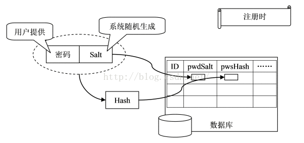
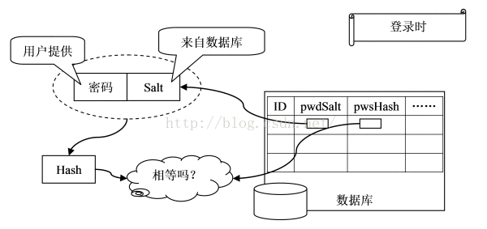
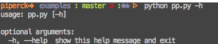
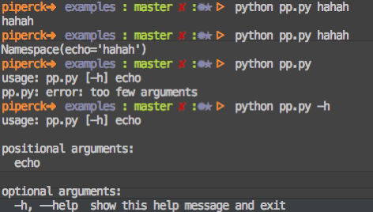
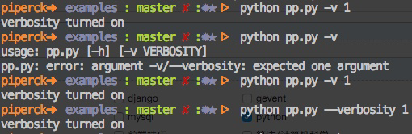
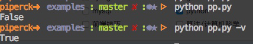
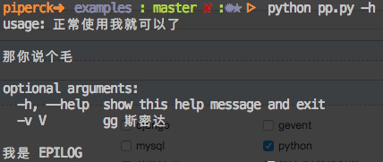

## 目录
[toc]

## 1 `datetime`
`datetime` 是 Python 处理日期和时间的标准库。

### 1.1 获取日期时间
* **`datetime(year, month, day[, hour[, minute[, second[, microsecond[,tzinfo]]]]`** - 创建/获取指定日期和时间的 `datetime` 对象，**在模块`datetime` 内**
  * `t.year` - `datetime` 对象的年份
  * `t.month` - `datetime` 对象的月份
  * `t.day` - `datetime` 对象的日份
* **`datetime.now()`** - 获取当前时间的 `datetime` 对象，**在模块 `datetime` 内**
* **`datetime.utcnow()`** - 获取当前 `UTC` 时间，**在模块 `datetime` 内**

例如：

```python
>>> from datetime import datetime
>>> now = datetime.now()
>>> print(now)
2018-03-01 20:37:29.551000
>>> dt = datetime(2008, 8, 8, 20, 20, 20)
>>> print(dt)
2008-08-08 20:20:20
```

### 1.2 `datetime` 与 `timestamp` 相互转换
`timestamp` : 当前时间相对于 `epoch time`（1970年1月1日 `00:00:00 UTC+00:00` 时区的时刻）的秒数

Python的 `timestamp` 是一位小数，小数表示毫秒数。

* **`timestamp()`** - `datetime`对象的实例方法，获取其 `timestamp` 类型
* **`datetime.fromtimestamp(seconds)`** - 通过 `timestamp` 创建`datetime`对象，默认本地时区，**在模块 `datatime` 内**
* **`datetime.utcfromtimestamp(seconds)`** - 通过 `timestamp` 创建`datetime`对象，默认`UTC`时区，**在模块 `datatime` 内**

例如：

```python
>>> from datetime import datetime
>>> t = 1429417200.0
>>> print(datetime.fromtimestamp(t)) # 本地时间
2015-04-19 12:20:00
>>> print(datetime.utcfromtimestamp(t)) # UTC时间
2015-04-19 04:20:00
```

### 1.3 `datetime` 与 `string` 相互转换
字符串的日期格式（format）：

如 `'%Y-%m-%d %H:%M:%S'` 规定了日期和时间部分的格式，详细内容参考 [strftime() and strptime() Behavior](https://docs.python.org/3/library/datetime.html#strftime-strptime-behavior "strftime() and strptime() Behavior")

* **`datetime.strptime(string, format)`** - 通过指定字符串与格式创建`datetime`对象，**在模块`datatime`内**
* **`strftime(format)`** - `datetime`对象的实例方法，获取指定格式的`string`

例如：

```python
>>> from datetime import datetime
>>> cdat = datetime.strptime('2018-3-1 21:00:00', '%Y-%m-%d %H:%M:%S')
>>> print(cdat)
2018-03-01 21:00:00
>>> now = datetime.now()
>>> print(now.strftime('%a, %b, %d, %H:%M'))
Thu, Mar, 01, 21:00
```

### 1.4 `datetime` 的加减运算
* **`timedelta(days=0, hous=0)`** - 可供`datetime`直接加减的对象创建方法，**在模块 `datatime` 内**

例如：

```python
>>> from datetime import datetime, timedelta
>>> now + timedelta(days=2,hours=7)
datetime.datetime(2018, 3, 4, 4, 0, 48, 976000)
```

### 1.5 时区转换
* **`timezone(timedelta(hous=0))`** - 创建时区对象，**在模块`datetime`内**
* **`replace(tzinfo=None)`** - `datetime`对象的实例方法，强制设置`datetime`的时区属性（其属性默认为None），返回新的`datetime`对象
* **`astimezone(timezone)`** - `datetime`对象的实例方法，转换datetime对象的时区为指定时区，必须已有时区属性

* **`timezone.utc`** - timezone的静态属性，utc时区对象，**在模块`datetime`内**

例如：

```python
>>> from datetime import datetime, timedelta, timezone
>>> tz_utc_8 = timezone(timedelta(hours=8))
>>> now = datetime.now()
>>> now
datetime.datetime(2018, 3, 1, 21, 23, 54, 954000)
>>> dt = now.replace(tzinfo=tz_utc_8)
>>> dt
datetime.datetime(2018, 3, 1, 21, 23, 54, 954000, tzinfo=datetime.timezone(datet
ime.timedelta(0, 28800)))
>>>
>>> dt.astimezone(timezone(timedelta(hours=9)))
datetime.datetime(2018, 3, 1, 22, 23, 54, 954000, tzinfo=datetime.timezone(date
ime.timedelta(0, 32400)))
>>> dt.astimezone(timezone(timedelta(hours=-8)))
datetime.datetime(2018, 3, 1, 5, 23, 54, 954000, tzinfo=datetime.timezone(datet
me.timedelta(-1, 57600)))
```

注意：

对于一个`datetime`，要获知其正确的时区，然后强制设置时区，在开始时区转换。

## 2 `collections`
`collections`是 Python 内建的一个集合模块，提供了许多有用的集合类。

### 2.1 `namedtuple` - 命名 `tuple`

`nametuple` 是一个元类，用于定制像 `tuple` 的类。它的优点是，比起自己定义规范的“结构体”类，`nametuple` 能简化很多工作。

* **`namedtuple(typename, field_names)`** - 定制一个像 `tuple` 的类，**在模块`collections`中**
  * 基本操作同 `tuple`，读写形式为属性引用

例如：

```python
from collections import namedtuple
# 这个是类，columns 也可以写成 'name score age'，即用空格分开
Student = namedtuple('Student', ['name', 'score', 'age'], defaults=(0, 0))  # 可指定默认值

# 这个是实例
student = Student(name='xiaoming', score=99, age=10)
print(student.name)
```

### 2.2 `deque` - 双向列表
* **`deque(list)`** - 根据 `list` 创建一个 `deque`，能高效地实现插入和删除元素，**在模块`collections`中**
  * 基本操作同 `list`
  * `appendleft(element)` - `deque` 对象的实例方法，尾部插入
  * `popleft(element)` - `deque` 对象的实例方法，尾部删除

例如：

```python
>>> from collections import deque
>>> q = deque(['a', 'b', 'c'])
>>> q.append('x')
>>> q.appendleft('y')
>>> q
deque(['y', 'a', 'b', 'c', 'x'])
```

### 2.3 `defaultdict` - 默认`dict`
* **`defaultdict(default_factory[, ...])`** - 创建一个无 `key` 时会默认返回 factory 生成值的 `dict`，**在模块`collections`中**
  * `default_factory` - `list`，`set`，`str`，匿名函数等，表示 `key` 不存在时的默认返回值
  * 剩余参数 - <u>当做</u>传入内部的 `dict` 对象中
  * 基本操作同 `dict`

例如：

```python
>>> dd = defaultdict(lambda: 'N/A')
>>> dd['key1'] = 'abc'
>>> dd['key1']
'abc'
>>> dd['key2']
'N/A'
```

### 2.4 `OrderedDict` - 有序`dict`
* **`OrderedDict([(ki, vi), ...])`** - 创建一个 `key` 有序的 `dict`，**在模块`collections`中**
  * 基本操作同 `dict`

例如：

```python
>>> from collections import OrderedDict
>>> d = dict([('a', 1), ('b', 2), ('c', 3)])
>>> d # dict的Key是无序的
{'a': 1, 'c': 3, 'b': 2}
>>> od = OrderedDict([('a', 1), ('b', 2), ('c', 3)])
>>> od # OrderedDict的Key是有序的
OrderedDict([('a', 1), ('b', 2), ('c', 3)])
```

注意：`OrderedDict`不会排序，只是保留插入顺序。

### 2.5 `Counter` - 无重复`dict`
* **`Counter()`** - 创建一个无重复`dict`，**在模块`collections`中**
  * 基本操作同`dict`

例如：

```python
>>> from collections import Counter
>>> c = Counter()
>>> for ch in 'programming':
...     c[ch] = c[ch] + 1
...
>>> c
Counter({'g': 2, 'm': 2, 'r': 2, 'a': 1, 'i': 1, 'o': 1, 'n': 1, 'p': 1})
```

## 3 `base64`
`base64`是一种用64个字符来表示任意二进制数据（二进制编码）的方法。

原理：3字节二进制数据->4字节文本数据

准备一个包含64个字符的数组：

	['A', 'B', 'C', ... 'a', 'b', 'c', ... '0', '1', ... '+', '/']

对二进制数据进行处理，每3个字节一组，共3x8=24bit，划分为4组，每组6bit。

将得到的4个数字作为索引，查表获得对应字符，得到编码后的字符串。

若剩下1-2个字节，用`\x00`补足，编码时加上1-2个`=`号，解码时自动去掉。

### 3.1 二进制编码与解码
* **`b64encode(byte)`** - 将`byte`编码，返回编码后的`byte`，**在模块`base64`内**
* **`b64decode(byte)`** - 将`byte`解码，返回解码后的`byte`，**在模块`base64`内**
* **`urlsafe_b64encode(byte)`** - 将`byte`编码，返回编码后的`byte`，其中字符`+`和`/`分别变成`-`和`_`，**在模块`base64`内**
* **`urlsafe_b64decode(byte)`** - 将`byte`解码，返回解码后的`byte`，其中字符`-`和`_`分别变回`+`和`/`，**在模块`base64`内**

例如：

```python
>>> import base64
>>> base64.b64encode(b'binary\x00string')
b'YmluYXJ5AHN0cmluZw=='
>>> base64.b64decode(b'YmluYXJ5AHN0cmluZw==')
b'binary\x00string'
>>> base64.b64encode(b'i\xb7\x1d\xfb\xef\xff')
b'abcd++//'
>>> base64.urlsafe_b64encode(b'i\xb7\x1d\xfb\xef\xff')
b'abcd--__'
>>> base64.urlsafe_b64decode(b'abcd--__')
b'i\xb7\x1d\xfb\xef\xff'
```

技巧：生成式，数字*字符=字符字符...

```python
base64.b64decode(s if not len(s) % 4 else s+b'='*(4-len(s) % 4)
```

## 4 `struct`
`struct`实现了`byte`和其他二进制数据类型的转换。

### 4.1 二进制类型转换
* **`pack('处理指令', 数据)`** - 将任意数据转换为`byte`返回，**在模块`struct`中**
* **`unpack('处理指令', byte)`** - 将`byte`转换为相应的数据返回，**在模块`struct`中**

关于指令及其他详细内容，参考[Format Characters](https://docs.python.org/3/library/struct.html#format-characters "Format Characters")

例如：

```python
>>> import struct
>>> struct.pack('>I', 10240099)
b'\x00\x9c@c'
>>> struct.unpack('>IH', b'\xf0\xf0\xf0\xf0\x80\x80')
(4042322160, 32896)
```

## 5 `hashlib`
`hashlib`提供了常用的摘要算法。

例如：

MD5算法，生成速度很快，生成结果为固定128bit。

SHA1算法，生成速度快，生成结果为固定160bit。

更安全的算法有SHA256，SHA512。

### 5.1 MD5 和 SHA1
* **`md5(None)`** - 获取`hashlib`中的MD5算法对象，可在`None`填入数据直接计算，**在模块 `hashlib` 中**
* **`sha1(None)`** - 获取`hashlib`中的sha1算法对象，可在`None`填入数据直接计算，**在模块 `hashlib` 中**
* **`update(str.encoed('utf-8'))`** - `hashlib`中的算法实例方法，提供要计算的字符串，可分多次
* **`hexdigest()`** - `hashlib`中的算法实例方法，计算摘要并返回

例如：

```python
>>> import hashlib
>>> md5=hashlib.md5()
>>> md5.update('how to use md5 in '.encode('utf-8'))
>>> md5.update('python hashlib?'.encode('utf-8'))
>>> print(md5.hexdigest())
d26a53750bc40b38b65a520292f69306
>>> sha1 = hashlib.sha1()
>>> sha1.update('how to use sha1 in '.encode('utf-8'))
>>> sha1.update('python hashlib?'.encode('utf-8'))
>>> print(sha1.hexdigest())
2c76b57293ce30acef38d98f6046927161b46a44
```

### 5.2 应用：明文加密
**1 直接加密用户口令**

例如：

	import hashlib
	db = {
	'michael': 'e10adc3949ba59abbe56e057f20f883e',
	'bob': '878ef96e86145580c38c87f0410ad153',
	'alice': '99b1c2188db85afee403b1536010c2c9'
	}
	def login(user, password):
	md5  = hashlib.md5()
	md5.update(password.encode('utf-8'))
	if md5.hexdigest()==db[user]:
	return True
	else:
	return False

**2 对简单口令进行保护**

对原始口令增加复杂字符串：加盐

**3 避免密文相同**

使用不同的附加字符串：加不同的盐

例如：

```python
import hashlib, random
def get_md5(s):
	return hashlib.md5(s.encode('utf-8')).hexdigest()

class User(object):
	def __init__(self, username, password):
		self.username = username
		self.salt = ''.join([chr(random.randint(48, 122)) for i in range(20)])
		self.password = get_md5(password + self.salt)
db = {
	'michael': User('michael', '123456'),
	'bob': User('bob', 'abc999'),
	'alice': User('alice', 'alice2008')
}

def login(username, password):
	user = db[username]
	password = password + user.salt
	return user.password == get_md5(password)
```

**图解**





## 6 `hmac`
`hamc`模块实现了标准的Hmac（Keyed-Hashing for Message Authentication）算法：

通过一个标准算法，在计算hash过程中，把key混入计算过程中。

* **`new(byte_key, byte_message, digestmod='')`** - 创建Hmac算法对象，**在模块`hmac`内**
* **`update()`** - hmac对象的实例方法，提供要计算的字符串，可分多次
* **`hexdigest()`** - hmac对象的实例方法，计算摘要并返回

例如：

```python
>>> import hmac
>>> message = b'Hello, world!'
>>> key = b'secret'
>>> h = hmac.new(key, message, digestmod='MD5')
>>> h.hexdigest()
'fa4ee7d173f2d97ee79022d1a7355bcf'
```

## 7 `itertools`
`itertools`模块提供了用于操作迭代对象的函数。

**迭代器函数**

* **`count(start=0, step=1)`** - 创建一个无限迭代器，打印自然序列，**在模块`itertools`内**
* **`cycle(iterable)`** - 创建一个无限迭代器，将传入的一个序列无限重复下去，**在模块`itertools`内**
* **`repeat(object, times=Inf)`** - 创建一个无限迭代器，将一个元素无限重复下去，可指定重复次数，**在模块`itertools`内**

**迭代操作函数**

* **`takewhile(predicate, iterable)`** - 根据`predicate`函数的返回值真假截取`iterable`序列，**在模块`itertools`内**
* **`chain(*iterable)`** - 将一组迭代对象串联，返回串联后的迭代对象，**在模块`itertools`内**
* **`groupby(iterable, keyfunc)`** - 根据`keyfunc`的返回值分类，返回元素为`(key, sub-iterator)`的`iterable`，**在模块`itertools`内**

所有例子演示一遍：

```python
# count(start=0, step=1)
>>> import itertools
>>> natuals = itertools.count(1)
>>> for n in natuals:
...     print(n)
...
1
2
3
...

# cycle(iterable)
>>> import itertools
>>> cs = itertools.cycle('ABC') # 注意字符串也是序列的一种
>>> for c in cs:
...     print(c)
...
'A'
'B'
'C'
'A'
'B'
'C'
...

# repeat(object, times=Inf)
>>> ns = itertools.repeat('A', 3)
>>> for n in ns:
...     print(n)
...
A
A
A

# takewhile(predicate, iterable)
>>> natuals = itertools.count(1)
>>> ns = itertools.takewhile(lambda x: x <= 10, natuals)
>>> list(ns)
[1, 2, 3, 4, 5, 6, 7, 8, 9, 10]

# chain(*iterable)
>>> for c in itertools.chain('ABC', 'XYZ'):
...     print(c)
A
B
C
X
Y
Z

# groupby
>>> for key, group in itertools.groupby('AaaBBbcCAAa', lambda c: c.upper()):
...     print(key, list(group))
...
A ['A', 'a', 'a']
B ['B', 'B', 'b']
C ['c', 'C']
A ['A', 'A', 'a']
```

## 8 `contextlib`
`contextlib` 提供了许多装饰器，便于编写简洁的代码。

* **`try...finally`** - 函数代码的上下文管理方式

* **`__enter__()` 和 `__exit__()`** - 类与对象的代码上下文管理方式

* **`@contextmanager`** - 类的简化上下文管理方式，**在模块 `contextlib` 内**，实现 `with ... as var` 的上下文管理方式：

   ```python
   @contextmanager
   def function(argc):
       ...	# code A
       yield var # code B
       ... # code C
   
   with function(argc) as var:
   	... # code D
   
   # 1 执行 code A
   # 2 执行 yield 的语句 B，传出语句调用结果
   # 3 执行 code D
   # 4 执行 code C
   ```
   
* **`@closing`** - 对象的简化上下文管理方式,自动调用对象的close方法，**在模块`contextlib`内**，实现`with ... as var`的上下文管理方式：

	```python
	with colsing(obj) as var:
		... # code A
	```
	
* **`@closing`** 等价于以下 `decorator`：

  ```python
  @contextmanager
  def closing(obj):
  	try:
  		yield obj
  	finally:
  		code B
  ```

## 9 `urllib`
`urllib` 模块提供了一系列用于操作URL的功能。

下属模块方法：

* **`request.urlopen(url, data=None)`** - 打开一个`url`（string或Request），返回一个`http.client.HTTPResponse`，**在模块`urllib`内**
* **`request.Request(url, data=None, headers={})`** - 创建一个可自定义的请求对象，**在模块`urllib`内**
* **`parse.urlencode(query)`** - 将含有双元组的字典或列表编码为URL请求字符串并返回，**在模块`urllib`内**
* **`parse.parse_qs(qs, keep_blank_values=False, strict_parsing=False, encoding='utf-8', errors='replace')`** - 解析URL查询语句，返回字典类型（`{'键': ['值']}`），**在模块`urllib`内**

下属对象方法：

* **`add_header(key, value)`** - `Request`对象的实例方法，向对象中加入一个header
* **`read()`** - `http.client.HTTPResponse`对象的实例方法，读取响应内容，返回许多`byte`
* **`getheaders()`** - `http.client.HTTPResponse`对象的实例方法，返回`[(header, value), ...]`

下属对象属性：

* **`request.match_info`** - Request对象的属性，存储可变路由的字段
	* 若存在可变路由：`/a/{name}/c`，可匹配path为：`/a/jack/c`的request
	* 则request.match_info返回`{name = jack}`
* **`status`**,**`reason`** - `http.client.HTTPResponse`对象的属性

**案例演示：**

```python
 # parse.parse
qs = 'first=f,s&second=s' 
parse.parse_qs(qs, True).items() 
>>> dict([('first', ['f,s']), ('second', ['s'])]) 
```

### 9.1 Get

直接打开url或者创建`Request`对象自定义后打开对象，然后对响应数据进行操作。

```python
from urllib import request
with request.urlopen('https://api.douban.com/v2/book/2129650') as f: # 直接打开一个URL
    data = f.read() # 获取响应的数据（要解码）
    print('Status:', f.status, f.reason) # 获取响应的转态
    for k, v in f.getheaders(): # 获取响应的header
    print('%s: %s' % (k, v))
    print('Data:', data.decode('utf-8')) # 解码响应的数据
```

伪装：模拟浏览器发送get请求

```python
from urllib import request
req = request.Request('http://www.douban.com/') # 创建自定义请求对象
req.add_header('User-Agent', 'Mozilla/6.0 (iPhone; CPU iPhone OS 8_0 like Mac OS X) AppleWebKit/536.26 (KHTML, like Gecko) Version/8.0 Mobile/10A5376e Safari/8536.25') # 自定义请求对象：添加header
with request.urlopen(req) as f: # 使用自定义请求对象打开（Get）URL
    print('Status:', f.status, f.reason) # 获取响应的状态
    for k, v in f.getheaders(): # 获取响应的header
        print('%s: %s' % (k, v))
    print('Data:', f.read().decode('utf-8')) # 获取响应的数据（要解码）
```

### 9.2 Post

创建`Request`对象，制作参数data的请求`str`的`byte`，自定义后打开对象，然后对响应数据进行操作。

```python
from urllib import request, parse
print('Login to weibo.cn...')
email = input('Email: ')
passwd = input('Password: ')
login_data = parse.urlencode([ # 封装要Post的数据
	('username', email),
	('password', passwd),
	('entry', 'mweibo'),
	('client_id', ''),
	('savestate', '1'),
	('ec', ''),
	('pagerefer', 'https://passport.weibo.cn/signin/welcome?entry=mweibo&r=http%3A%2F%2Fm.weibo.cn%2F')
])

req = request.Request('https://passport.weibo.cn/sso/login') # 创建可自定义请求对象
req.add_header('Orgin', 'https://passport.weibo.cn') # 自定义请求对象：添加header，多次添加
req.add_header('User-Agent', 'Mozilla/6.0 (iPhone; CPU iPhone OS 8_0 like Mac OS X) AppleWebKit/536.26 (KHTML, like Gecko) Version/8.0 Mobile/10A5376e Safari/8536.25')
req.add_header('Referer', 'https://passport.weibo.cn/signin/login?entry=mweibo&res=wel&wm=3349&r=http%3A%2F%2Fm.weibo.cn%2F')

with request.urlopen(req, data=login_data.encode('utf-8')) as f: # 使用自定义请求对打开（Post）URL，传入数据（要编码）
	print('Status:', f.status, f.reason)
	for k, v in f.getheaders(): # 获取响应的header
		print('%s: %s' % (k, v))
	print('Data:', f.read().decode('utf-8')) # 获取响应的数据（要解码）
```

### 9.3 Handler  （马克一下，以后回来学习）

```python
from urllib import request
# 获取ProxyHandler对象
proxy_handler = request.ProxyHandler({'http': 'http://www.example.com:3128/'})
proxy_auth_handler = request.ProxyBasicAuthHandler()
proxy_auth_handler.add_password('realm', 'host', 'username', 'password')
# 返回一个OpenerDirector实例，即这里的opener
opener = request.build_opener(proxy_handler, proxy_auth_handler)
with opener.open('http://www.example.com/login.html') as f:
	pass
```

**注意**

`urllib`处理URL：传送数据要编码，接收数据要解码。

## 10 `xml`
`xml`模块用于操作XML。

操作XML有两种方法：DOM和SAX。

* DOM将整个XML读入内存，解析为树。占用内存大，解析慢；可以任意遍历树。
* SAX边读边解析。占用内存小，解析快；需手动处理事件。

正常情况优先考虑SAX。

**解析xml**

* **`ParserCreate()`** - 创建`xml`解析对象（parser），**在`xml.parsers.expat`内**
* **`StartElementHandler`** - parser的实例属性，`start_element`事件解析函数，待指定
* **`EndElementHandler`** - parser的实例属性，`end_element`事件的解析函数，待指定
* **`CharacterDataHandler`** - parser的实例属性，`char_data`事件的解析函数，待指定
* **`Parse(xml)`** - parser对象的实例方法，解析`xml`（字符串）

注意：

读取大段字符串时，`CharacterDataHandler`可能被多次调用，内容先保存，再在`EndElementHandler`合并。

**生成xml**

生成简单`XML`：直接拼接字符串

生成复杂`XML`：该用`JSON`

**案例演示**

```python
from xml.parsers.expat import ParserCreate

class DefaultSaxHandler(object):
	def start_element(self, name, attrs):
		print('sax:start_element: %s, attrs: %s' % (name, str(attrs)))
		
	def end_element(self, name):
		print('sax:end_element: %s' % name)
	
	def char_data(self, text):
		print('sax:char_data: %s' % text)
		
xml = r'''<?xml version="1.0"?>
<ol>
	<li><a href="/python">Python</a></li>
	<li><a href="/ruby">Ruby</a></li>
</ol>
'''

handler = DefaultSaxHandler()	# 创建要指定的处理函数类
parser = ParserCreate()	# 获取xml解析对象
parser.StartElementHandler = handler.start_element	# 指定start_element
parser.EndElementHandler = handler.end_element	# 指定end_element
parser.CharacterDataHandler = handler.char_data	# 指定char_element
parser.Parse(xml)	# 解析xml
```

## 11 `HTMLParser`
`HTMLParser`用于解析HTML（本质上是xml的子集）。

* **`HTMLParser()`** - 创建`HTMLParser`对象，其各类方法待重写（**在`html.parser`内**），如下：
* **`handle_starttag(self, tag, attrs)`** - 待重写，处理`<tag>`，参数`tag`为小写标签名，参数`attrs`为`(name, value)`的列表
* **`handle_endtag(self, tag)`** - 待重写，处理`</tag>`
* **`handle_data(self, data)`** - 待重写，处理`<tag> data </tag>`中的`data`
* **`handle_startendtag(self, tag, attrs)`** - 待重写，处理`<tag key=value .../>`
* **`handle_comment(self, data)`** - 待重写，处理`<!-- data -->`
* **`handle_entityref(self, name)`** - 待重写，处理`@name`
* **`handle_charref(self, name)`** - 待重写，处理`@#name`
* **`feed(str)`** - `HTMLParser`的实例方法，输入要解析的数据，可以多次输入

**案例演示：**

```python
from html.parser import HTMLParser
from html.entities import name2codepoint

class MyHTMLParser(HTMLParser):
	def handle_starttag(self, tag, attrs):	# 处理<tag>
		print('<%s>' % tag)
	
	def handle_endtag(self, tag):	# 处理</tag>
		print('</%s>' % tag)
		
	def handle_data(self, data):	# 处理<tag> data </tag>中的data
		print(data)
		
	def handle_startendtag(self, tag, attrs):	# 处理<tag key=value.../>
		print('<%s/>' % tag)
		
	def handle_comment(self, data):	# 处理<!--', data, '-->
		print('<!--', data, '-->')
		
	def handle_entityref(self, name):	# 处理@name:
		print('@%s:' % name)
		
	def handle_charref(self, name):	# 处理@#name:
		print('@#%s:' % name)
		
parser = MyHTMLParser()	# 获取HTML解析器对象（HTMLParser）
parser.feed('''<html>
<head></head>
<body>
<!-- test html parser -->
	<p>Some <a href=\"#\">html</a> HTML&nbsp;tutorial...<br>END</p>
</body></html>''')	# 输入要解析的数据，可以多次输入
```

## 12 `uuid`
UUID是128位全局唯一标识符，通常有32字节字母串表示。它可以保证时间和空间的唯一性，也称GUID。

它通过MAC地址，时间戳，命名空间，随机数，伪随机数来保证生成ID的唯一性。

UUID主要有5个算法，即5中方法实现：

* **`uuid1()`** - 基于时间戳
	* 由MAC地址，当前时间戳，随机数字生成。可以保证全球范围内的唯一性。但是由于MAC地址的使用同时带来了安全问题，局域网中可以使用IP来代替MAC。
* **`uuid2()`** - 基于分布式计算环境DCE（python中没有这个函数）
	* 算法和uuid1相同，不同的是把时间戳的前4位换位POSIX的UID，实际中很少用到该方法。
* **`uuid3()`** - 基于名字和MD5散列值
	* 通过计算名字和命名空间的MD5散列值得到，保证了同一命名空间中不同名字的唯一性，和不同命名空间的唯一性，但同一命名空间的名字生成相同的uuid。
* **`uuid4()`** - 基于伪随机数
	* 由伪随机数得到，有一定的重复概率，该概率可以计算出来。
* **`uuid5()`** - 基于名字的SHA-1散列值
	* 算法和uuid3()相同，不同的是使用Secure Hash Algorithm 1算法。

**使用经验：**

* 1 Python中没有基于DCE的，所以uuid2可以忽略
* 2 uuid4存在概率性重复，由无映射性，最好不用
* 3 如果在global的分布式计算环境下，最好用uuid1
* 4 若有名字的唯一性要求，最好使用uuid3或uuid5

举例说明：

```python
import uuid

# uuid1()
>>> print(uuid.uuid1())
2cf0fa7e-48d9-11e6-93fb-c03fd53413ef
# uuid3()
>>> print(uuid.uuid3(uuid.NAMESPACE_DNS, 'test'))
45a113ac-c7f2-30b0-90a5-a399ab912716
# uuid4()
>>> print(uuid.uuid4())
08bffbb6-05e1-41c1-8989-6aa07a4a5e5d
# uuid5()
>>> print(uuid.uuid5(uuid.NAMESPACE_DNS, 'test'))
4be0643f-1d98-573b-97cd-ca98a65347dd
```

## 13 `inspect`
`inspect`模块用于解析函数参数。

* **`signature(func)`** - 解析指定函数参数，返回Signature对象，**在模块`inspect`内**
	* `parameters` - Signature对象的子对象，存有属性集合，可用于获取属性/参数
	* `parameters.items()` - Signature对象的实例属性方法，获取参数字典，返回健（`str`）-值（`inspect.Parameter`）元组型元素的列表
	* `parameters.keys()` - Signature对象的实例属性方法，获取参数字典的键，返回列表
	* `parameters.values()` - Signature对象的实例属性方法，获取参数字典的值，返回列表
	* `inspect.parameter` - 参数对象，代表parameters子对象中存放的值 
		* `kind` - 参数对象的实例属性，表示函数参数的类型，有如下分类：
			* POSITIONAL_OR_KEYWORD - 位置/默认参数
			* VAR_POSITIONAL - 可变参数（*args）
			* KEYWORD_ONLY - 位置命名关键字参数/默认命名关键字参数
			* VAR_KEYWORD - 关键字参数（**kw）
		* `default` - 参数对象的实例属性，表示函数参数的默认值，无默认值时为`parameter.empty`

举例：
	
```python
def foo(a, b = 10, *c, d,**kw): pass
sig = inspect.signature(foo)
>> <Signature (a, b=10, *c, d, **kw)>

sig.parameters
>> mappingproxy(OrderedDict([('a', <Parameter "a">), ('b', <Parameter "b=10">), ('c ', <Parameter "*c">), ('d', <Parameter "d">), ('kw', <Parameter "**kw">)]))

sig.parameters.items()
>> odict_items([('a', <Parameter "a">), ('b', <Parameter "b=10">), ('c', <Parameter "*c">), ('d', <Parameter "d">), ('kw', <Parameter "**kw">)])

sig.parameters.keys()
>> odict_keys(['a', 'b', 'c', 'd', 'kw'])

sig.parameters.values()
>> odict_values([<Parameter "a">, <Parameter "b=10">, <Parameter "*c">, <Parameter "d">, <Parameter "**kw">])
```
## 14 `argparse`
`argparse` 模块可以让人轻松编写用户友好的命令行接口。还会自动生成帮助和使用手册，并在用户给程序传入无效参数时报出错误信息。

### 14.1 基本用法

`argparse` 的使用流程为：

（1）`import argparse` - 首先导入模块

（2）`parser = argparse.ArgumentParser()` - 创建一个解析对象

（3）`parser.add_argument()` - 向该对象中添加你要关注的命令行参数和选项

（4）`parser.parse_args()` - 进行解析

#### 14.1.1 定义和解析

```python
import argparse
parser = argparse.ArgumentParser() # 定义解析器对象
parser.parse_args() # 解析参数
```
例子：



#### 14.1.2 设置位置参数

```python
import argparse
parser = argparse.ArgumentParser() # 定义解析器对象
parser.add_argument("echo") # 添加位置参数
args = parser.parse_args() # 解析参数
print args.echo
```
例子：



其中，第二行是直接打印该参数对应的属性，可以看到结果是一个 `Namespace` 对象，另外，所有属性值类型均为 `str`.

#### 14.1.3 设置可选参数

```python
import argparse
parser = argparse.ArgumentParser() # 定义解析器对象
# 添加可选参数，前两个分别是简写和全写，参数 help 是说明信息
parser.add_argument("-v", "--verbosity", help="increase output verbosity")
args = parser.parse_args() # 解析参数
if args.verbosity: # 用了为真，没有用为假
    print "verbosity turned on"
```

例子：



【注1】简写参数和全写参数都有时，属性名称与全写参数一致。

【注2】使用可选参数时也**必须**传入一个值，或者添加 `action=‘store_true’` 表示 “出现即为 `True`”。

```python
import argparse
parser = argparse.ArgumentParser() # 定义解析器对象
# 添加可选参数，前两个分别是简写和全写，参数 help 是说明信息，这里相比上面就加了一个参数
parser.add_argument("-v", "--verbosity", help="increase output verbosity", action="store_true")
args = parser.parse_args() # 解析参数
print args.verbosity # 输出参数值，没指定值时，有默认值就输出默认值，没有默认值就报提示（因为要接收值）
```



### 14.2 进阶用法

#### 14.2.1 传入数组

**字符串数组**

使用属性 `nargs=''`，取值为：

* `+` - 一个或多个参数
* `*` - 零个或多个参数
* `?` - 零个或一个参数

```python
parser.add_argument('--nargs', nargs='+')

>>> python arg.py --nargs 1234 2345 3456 4567
['1234', '2345', '3456', '4567']
```

**整数数组**

使用属性 `nargs=''`（取值也是 `+, -, ?` 之一）和 `type=int`，就能解析为整数

```python
parser.add_argument('--nargs-int-type', nargs='+', type=int)

>>> python arg.py --nargs-int-type -1234 2345 -3456 4567
[-1234, 2345, -3456, 4567]
```

#### 14.2.2 解析列表

**字符串解析列表**

使用属性 `type=list` 解析字符串为列表：

```python
parser.add_argument('--list-type', type=list)

>>> python arg.py --list-type "1234 2345 3456 4567"
['1', '2', '3', '4', ' ', '2', '3', '4', '5', ' ', '3', '4', '5', '6', ' ', '4', '5', '6', '7']
```

**多字符串解析列表**

使用属性 `type=list` 和 `nargs=''`，会在上面的基础上自动过滤空格，得到二维列表：

```python
parser.add_argument('--list-type-nargs', type=list, nargs='+')

>>> python arg.py --list-type-nargs 1234 2345 3456 4567
[['1', '2', '3', '4'], ['2', '3', '4', '5'], ['3', '4', '5', '6'], ['4', '5', '6', '7']]
```

### 14.3 API 详解

* `argparse.ArgumentParser(...)`

  创建一个新的 `ArgumentParser` 对象。所有的参数都应当作为关键字参数传入。每个参数在下面都有它更详细的描述，但简而言之，它们是：

  * `prog` - 程序的名称（默认：`sys.argv[0]`）
  * `usage` - 描述程序用途的字符串（默认值：从添加到解析器的参数生成）
  * `description` - 在参数帮助文档之前显示的文本（默认值：无）
  * `epilog` - 在参数帮助文档之后显示的文本（默认值：无）
  * `parents` - 一个 `ArgumentParser` 对象的列表，它们的参数也应包含在内
  * `formatter_class` - 用于自定义帮助文档输出格式的类
  * `prefix_chars` - 可选参数的前缀字符集合（默认值：`'-'`）
  * `fromfile_prefix_chars` - 当需要从文件中读取其他参数时，用于标识文件名的前缀字符集合（默认值：`None`）
  * `argument_default` - 参数的全局默认值（默认值：`None`）
  * `conflict_handler` - 解决冲突选项的策略（通常是不必要的）
  * `add_help` - 为解析器添加一个 `-h` / `--help` 选项（默认值： True）
  * `allow_abbrev` - 如果缩写是无歧义的，则允许缩写长选项 （默认值：`True`）
  * `exit_on_error` - 决定当错误发生时是否让 `ArgumentParser` 附带错误信息退出（默认值: `True`）

  例子：

  ```python
  # coding: utf-8
  import argparse
  x = argparse.ArgumentParser(prog='It\'s a cool job!',
                              usage='正常使用我就可以了',
                              description='那你说个毛',
                              epilog='我是 EPILOG')
  x.add_argument('-v', help='gg 斯密达')
  x.parse_args()
  ```

  

* `ArgumentParser.add_argument(name or flags...[, action][, nargs][, const][, default][, type][, choices][, required][, help][, metavar][, dest])`

  定义单个的命令行参数应当如何解析，每个形参都在下面有它自己更多的描述。

  * `name or flags` - 选项字符串的名字或者列表，例如 `foo` 或 `-f`, `--foo`
  * `action` - 命令行**遇到**参数时的动作，默认值是 `"store_true"`，可选 `store_const`（赋值 `const`，见下面）
  * `nargs` - 应该读取的命令行参数个数，可以是具体的数字，或者是 `?` 号
    * 当不指定值时，对于 Positional argument 使用 `default`
    * 当不指定值时，对于 Optional argument 使用 `const`；或者是 `*` 号，表示 `0` 或多个参数；或者是 `+` 号表示 `1` 或多个参数
  * `const` - `action` 和 `nargs` 所需要的常量值
  * `default` - 当参数未在命令行中出现并且也不存在于命名空间时的值
  * `type` - 命令行参数应当被转换成的类型
  * `choices` - 参数可允许的值的一个容器
  * `required` - 可选参数是否可以省略（仅针对可选参数）
  * `help` - 参数的帮助信息，当指定为 `argparse.SUPPRESS` 时表示不显示该参数的帮助信息
  * `metavar` - 在 `usage` 说明中的参数名称，对于必选参数默认就是参数名称，对于可选参数默认是全大写的参数名称
  * `dest` - 解析后的参数名称，默认情况下，对于可选参数选取最长的名称，中划线转换为下划线

* `ArgumentParser.parse_args(args=None, namespace=None)`

  将参数字符串转换为对象并将其设为命名空间的属性。 返回带有成员的命名空间。

  之前对 `add_argument()` 的调用决定了哪些对象被创建以及它们如何被赋值。 请参阅 `add_argument()` 的文档了解详情。

  * `args` - 要解析的字符串列表。 默认值是从 `sys.argv` 获取。
  * `namespace` - 用于获取属性的对象。 默认值是一个新的空 `Namespace` 对象。
  * 返回值 - 一个 `Namespace` 对象

* `argparse.Namespace` - 由 `parse_args()` 默认使用的简单类，可创建一个存放属性的对象并将其返回。

  这个类被有意做得很简单，只是一个具有可读字符串表示形式的 `object`。 

  如果你更喜欢类似字典的属性视图，你可以使用标准 Python 中惯常的 `vars()`：

  ```python
  >>> parser = argparse.ArgumentParser()
  >>> parser.add_argument('--foo')
  >>> args = parser.parse_args(['--foo', 'BAR'])
  >>> vars(args)
  {'foo': 'BAR'}
  ```

  

【完全详解】[https://docs.python.org/zh-cn/3/library/argparse.html](https://docs.python.org/zh-cn/3/library/argparse.html)

## 15 `copy`

`copy` 模块提供了通用的浅层复制和深层复制操作。

* `copy.copy(list)` - 浅拷贝，只拷贝**父对象**，不会拷贝**子对象**

  ```python
  import copy
  
  a = [[1],[2],[3]]
  b = copy.copy(a)
  
  print "before", "=>"
  print a
  print b
  
  # modify original
  a[0][0] = 0  # 修改子对象
  a[1] = None  # 修改父对象
  
  print "after", "=>"
  print a
  print b
  
  before =>
  [[1], [2], [3]]
  [[1], [2], [3]]
  after =>
  [[0], None, [3]]
  [[0], [2], [3]]  # 浅拷贝，子元素修改
  ```

* `copy.deepcopy(list)` - 深拷贝，拷贝**父对象**及**子对象**

  ```python
  import copy
  
  a = [[1],[2],[3]]
  b = copy.deepcopy(a)
  
  print "before", "=>"
  print a
  print b
  
  # modify original
  a[0][0] = 0  # 修改子对象
  a[1] = None  # 修改父对象
  
  print "after", "=>"
  print a
  print b
  
  before =>
  [[1], [2], [3]]
  [[1], [2], [3]]
  after =>
  [[0], None, [3]]
  [[1], [2], [3]]  # 深拷贝，无修改
  ```
